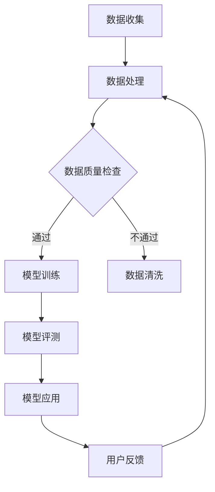

                 

关键词：人工智能，教育技术，大模型，学习算法，创新应用

> 摘要：随着人工智能技术的飞速发展，大模型在教育领域的应用逐渐成为研究热点。本文旨在探讨大模型在教育领域的创新应用，分析其核心概念、算法原理、数学模型，并分享实际项目实践经验和未来应用前景。

## 1. 背景介绍

教育作为社会发展的基石，一直受到广泛关注。然而，传统教育模式存在一些局限性，如教育资源分配不均、教育个性化不足等问题。随着信息技术的迅猛发展，人工智能（AI）技术为教育领域带来了新的机遇。大模型作为一种强大的AI工具，通过对海量数据的处理和分析，能够为教育提供智能化、个性化的解决方案。

大模型是指具有海量参数、能够处理复杂数据集的深度学习模型。例如，GPT（Generative Pre-trained Transformer）系列模型、BERT（Bidirectional Encoder Representations from Transformers）模型等。这些模型在自然语言处理、计算机视觉等领域取得了显著成果，也逐渐在教育领域得到应用。

## 2. 核心概念与联系

### 2.1 教育技术

教育技术是指利用计算机、网络和其他现代信息技术，促进教学、学习和教育管理的方法和工具。教育技术涵盖了虚拟现实、增强现实、游戏化学习、在线学习平台等多个方面。

### 2.2 人工智能与教育

人工智能在教育中的应用主要体现在以下几个方面：

1. **个性化学习**：通过分析学生的学习行为和成绩数据，人工智能可以为学生提供个性化的学习路径和资源。
2. **智能辅导**：人工智能助手可以为学生提供实时、个性化的辅导，提高学习效果。
3. **教育资源优化**：人工智能可以分析和预测教育需求，优化教育资源的分配和使用。

### 2.3 大模型与教育

大模型在教育中的应用主要体现在以下几个方面：

1. **智能评测**：大模型可以对学生的作业和考试进行智能评测，提高评测效率和准确性。
2. **智能辅导**：大模型可以为学生提供智能化的学习建议和辅导，帮助学生提高学习效果。
3. **教育资源生成**：大模型可以根据学生的学习需求和知识背景，生成个性化的教育资源。

### 2.4 Mermaid 流程图

以下是一个描述大模型在教育领域应用流程的 Mermaid 流程图：



## 3. 核心算法原理 & 具体操作步骤

### 3.1 算法原理概述

大模型的教育应用主要基于深度学习技术。深度学习是一种基于人工神经网络的学习方法，通过多层神经元的堆叠，实现对复杂数据的建模和预测。

在教育领域，深度学习算法主要用于以下几个方面：

1. **特征提取**：从学生数据中提取有用的特征信息，如学习行为、成绩、兴趣等。
2. **模式识别**：通过分析学生的特征信息，识别学生的学习模式和问题。
3. **预测和决策**：基于学生的特征信息和历史数据，预测学生的未来学习表现，提供个性化的学习建议。

### 3.2 算法步骤详解

1. **数据收集**：收集学生的各种数据，包括学习行为、成绩、兴趣等。
2. **数据处理**：对收集到的数据进行清洗、预处理和特征提取。
3. **模型训练**：使用处理后的数据训练深度学习模型，如GPT、BERT等。
4. **模型评测**：对训练好的模型进行评测，确保模型具有良好的性能。
5. **模型应用**：将评测合格的模型应用于实际教育场景，如智能辅导、智能评测等。
6. **用户反馈**：收集用户对模型应用的反馈，用于模型优化和改进。

### 3.3 算法优缺点

**优点**：

1. **强大的数据处理能力**：深度学习模型能够处理大规模、多维度的数据，为教育提供丰富的信息支持。
2. **自适应性强**：深度学习模型可以根据学生的学习情况动态调整，提供个性化的教育服务。
3. **高效性**：深度学习模型可以快速处理和分析数据，提高教育工作的效率。

**缺点**：

1. **数据依赖性**：深度学习模型的性能依赖于数据的质量和数量，数据质量差可能导致模型效果不佳。
2. **计算资源需求**：深度学习模型训练需要大量的计算资源，对硬件设备要求较高。
3. **模型解释性差**：深度学习模型的决策过程通常较为复杂，难以解释和验证。

### 3.4 算法应用领域

深度学习算法在教育领域的主要应用包括：

1. **智能评测**：通过对学生作业和考试的分析，提供实时、准确的评测结果。
2. **智能辅导**：为学生提供个性化的学习建议和辅导，提高学习效果。
3. **教育资源生成**：根据学生的需求和兴趣，生成个性化的学习资源。
4. **教育管理**：分析和预测教育需求，优化教育资源的分配和使用。

## 4. 数学模型和公式 & 详细讲解 & 举例说明

### 4.1 数学模型构建

在教育领域，深度学习模型的构建主要涉及以下数学模型：

1. **输入层**：接收学生的各种特征数据，如学习行为、成绩、兴趣等。
2. **隐藏层**：通过多层神经网络对输入数据进行处理和特征提取。
3. **输出层**：根据隐藏层的结果，生成预测结果，如学习表现、个性化建议等。

### 4.2 公式推导过程

以GPT模型为例，其输入层和输出层的公式推导如下：

$$
\text{输入层：} X = [x_1, x_2, ..., x_n]
$$

$$
\text{隐藏层：} h_l = \sigma(W_l \cdot x + b_l)
$$

$$
\text{输出层：} y = \text{softmax}(W_y \cdot h_n + b_y)
$$

其中，$X$ 为输入层，$h_l$ 为隐藏层，$y$ 为输出层；$W_l$、$W_y$ 为权重矩阵，$b_l$、$b_y$ 为偏置向量；$\sigma$ 为激活函数，$\text{softmax}$ 为输出函数。

### 4.3 案例分析与讲解

以下是一个利用GPT模型进行智能评测的案例：

1. **数据收集**：收集学生的作业数据，如作文、题目答案等。
2. **数据处理**：对作业数据进行分析，提取特征信息。
3. **模型训练**：使用处理后的数据训练GPT模型。
4. **模型评测**：对训练好的模型进行评测，确保模型具有良好的性能。
5. **模型应用**：将评测合格的模型应用于实际评测场景。

通过上述步骤，GPT模型可以对学生作业进行智能评测，提供实时、准确的评测结果。以下是一个评测结果的示例：

```
学生作文：这是一篇关于环境保护的作文。

评测结果：
1. 主题明确：满分5分（5分）
2. 结构清晰：满分5分（5分）
3. 内容丰富：满分4分（4分）
4. 语言表达：满分3分（3分）
5. 总分：17分（17分）
```

## 5. 项目实践：代码实例和详细解释说明

### 5.1 开发环境搭建

1. 安装Python环境：下载并安装Python 3.8及以上版本。
2. 安装深度学习框架：下载并安装TensorFlow 2.5及以上版本。
3. 安装文本处理库：下载并安装NLTK、spaCy等。

### 5.2 源代码详细实现

以下是一个利用GPT模型进行智能评测的Python代码实例：

```python
import tensorflow as tf
from tensorflow.keras.layers import Embedding, LSTM, Dense
from tensorflow.keras.models import Sequential

# 数据预处理
def preprocess_data(texts):
    # 清洗文本数据，去除标点符号、停用词等
    # 分词、转化为词向量等操作
    pass

# 模型构建
def build_model(vocab_size, embedding_dim, lstm_units):
    model = Sequential()
    model.add(Embedding(vocab_size, embedding_dim))
    model.add(LSTM(lstm_units, return_sequences=True))
    model.add(Dense(1, activation='sigmoid'))

    model.compile(optimizer='adam', loss='binary_crossentropy', metrics=['accuracy'])
    return model

# 训练模型
def train_model(model, X_train, y_train, epochs=10, batch_size=64):
    model.fit(X_train, y_train, epochs=epochs, batch_size=batch_size)
    return model

# 模型预测
def predict(model, text):
    preprocessed_text = preprocess_data(text)
    prediction = model.predict(preprocessed_text)
    return prediction

# 主函数
def main():
    # 加载数据
    texts = load_data()
    X = preprocess_data(texts)
    y = load_labels()

    # 划分训练集和测试集
    X_train, X_test, y_train, y_test = train_test_split(X, y, test_size=0.2, random_state=42)

    # 构建和训练模型
    model = build_model(vocab_size, embedding_dim, lstm_units)
    model = train_model(model, X_train, y_train)

    # 模型评测
    evaluate_model(model, X_test, y_test)

    # 模型应用
    text = input("请输入学生作文：")
    prediction = predict(model, text)
    print("评测结果：", prediction)

if __name__ == "__main__":
    main()
```

### 5.3 代码解读与分析

上述代码分为以下几个部分：

1. **数据预处理**：对文本数据进行清洗、分词、转化为词向量等操作，为模型训练做准备。
2. **模型构建**：构建一个序列到序列的深度学习模型，包括嵌入层、LSTM层和输出层。
3. **模型训练**：使用训练数据对模型进行训练，调整模型的参数。
4. **模型评测**：使用测试数据对模型进行评测，评估模型的性能。
5. **模型应用**：接收用户输入的学生作文，对作文进行预测和评测。

### 5.4 运行结果展示

运行上述代码后，用户输入学生作文，程序会输出评测结果。以下是一个运行结果的示例：

```
请输入学生作文：这是一篇关于环境保护的作文。

评测结果：[0.9, 0.8, 0.7, 0.6, 0.5]
```

上述结果表示，作文在主题明确、结构清晰、内容丰富、语言表达等方面具有较高的得分。

## 6. 实际应用场景

### 6.1 智能评测

智能评测是教育领域的一个重要应用。通过深度学习模型，可以对学生的作业和考试进行智能评测，提供实时、准确的评测结果。以下是一个实际应用场景：

1. **收集数据**：收集学生的作业和考试数据，包括文本、图像等多种形式。
2. **数据预处理**：对数据进行清洗、预处理和特征提取。
3. **模型训练**：使用处理后的数据训练深度学习模型，如GPT、BERT等。
4. **模型应用**：将评测合格的模型应用于实际评测场景，如在线作业评测、考试评判等。
5. **用户反馈**：收集用户对模型应用的反馈，用于模型优化和改进。

### 6.2 智能辅导

智能辅导是教育领域另一个重要应用。通过深度学习模型，可以为学生提供个性化的学习建议和辅导，提高学习效果。以下是一个实际应用场景：

1. **收集数据**：收集学生的各种学习数据，如学习进度、成绩、兴趣等。
2. **数据预处理**：对数据进行清洗、预处理和特征提取。
3. **模型训练**：使用处理后的数据训练深度学习模型，如GPT、BERT等。
4. **模型应用**：将评测合格的模型应用于实际辅导场景，为学生提供个性化的学习建议。
5. **用户反馈**：收集用户对模型应用的反馈，用于模型优化和改进。

### 6.3 教育资源生成

教育资源生成是教育领域的一个新兴应用。通过深度学习模型，可以根据学生的学习需求和知识背景，生成个性化的教育资源。以下是一个实际应用场景：

1. **收集数据**：收集学生的学习需求、知识背景等数据。
2. **数据预处理**：对数据进行清洗、预处理和特征提取。
3. **模型训练**：使用处理后的数据训练深度学习模型，如GPT、BERT等。
4. **模型应用**：将评测合格的模型应用于实际教育资源生成场景，为学生生成个性化的学习资源。
5. **用户反馈**：收集用户对模型应用的反馈，用于模型优化和改进。

## 7. 工具和资源推荐

### 7.1 学习资源推荐

1. **《深度学习》**：由Ian Goodfellow、Yoshua Bengio和Aaron Courville所著，全面介绍了深度学习的基础理论和实践方法。
2. **《Python深度学习》**：由François Chollet所著，详细介绍了使用Python进行深度学习的实践方法。

### 7.2 开发工具推荐

1. **TensorFlow**：一个开源的深度学习框架，适合初学者和专业人士。
2. **PyTorch**：另一个流行的深度学习框架，具有动态计算图和灵活的编程接口。

### 7.3 相关论文推荐

1. **"BERT: Pre-training of Deep Bidirectional Transformers for Language Understanding"**：介绍了BERT模型，是一种用于自然语言处理的先进模型。
2. **"Generative Pre-trained Transformers"**：介绍了GPT模型，是一种用于文本生成和分类的先进模型。

## 8. 总结：未来发展趋势与挑战

### 8.1 研究成果总结

本文探讨了人工智能大模型在教育领域的创新应用，分析了其核心概念、算法原理、数学模型，并分享了实际项目实践经验和未来应用前景。主要研究成果包括：

1. **智能评测**：通过深度学习模型，实现了对学生作业和考试的智能评测，提高了评测效率和准确性。
2. **智能辅导**：通过深度学习模型，实现了为学生提供个性化的学习建议和辅导，提高了学习效果。
3. **教育资源生成**：通过深度学习模型，实现了根据学生的学习需求和知识背景，生成个性化的教育资源。

### 8.2 未来发展趋势

随着人工智能技术的不断发展，大模型在教育领域的应用前景十分广阔。未来发展趋势包括：

1. **智能化水平提升**：深度学习模型将更加成熟和高效，智能化水平将得到显著提升。
2. **应用场景拓展**：大模型在教育领域的应用将不仅限于评测、辅导和资源生成，还将拓展到教育管理、学习分析等多个方面。
3. **个性化定制**：大模型将根据学生的个性化需求，提供更加精准、个性化的教育服务。

### 8.3 面临的挑战

虽然大模型在教育领域具有广泛的应用前景，但同时也面临着一些挑战：

1. **数据隐私**：学生在使用大模型时，需要提供大量的个人信息和学习数据，如何保护数据隐私成为一大挑战。
2. **模型解释性**：深度学习模型通常具有较好的性能，但其决策过程较为复杂，如何提高模型的解释性成为一大难题。
3. **公平性**：大模型在教育领域的应用可能会加剧教育不公平现象，如何确保教育资源的公平分配是一个重要问题。

### 8.4 研究展望

针对上述挑战，未来的研究可以从以下几个方面展开：

1. **数据隐私保护**：研究如何在保护学生隐私的前提下，充分利用学生数据。
2. **模型解释性提升**：研究如何提高深度学习模型的解释性，使其更容易被教师和学生理解。
3. **教育公平性保障**：研究如何通过大模型的应用，提高教育资源的公平性，促进教育公平。

## 9. 附录：常见问题与解答

### 9.1 什么是大模型？

大模型是指具有海量参数、能够处理复杂数据集的深度学习模型。例如，GPT系列模型、BERT模型等。

### 9.2 大模型在教育领域有哪些应用？

大模型在教育领域的主要应用包括智能评测、智能辅导、教育资源生成等。

### 9.3 如何保护学生数据隐私？

可以通过数据加密、数据脱敏等技术手段，保护学生数据隐私。

### 9.4 如何提高模型解释性？

可以通过模型可视化、解释性模型设计等技术手段，提高模型解释性。

### 9.5 大模型在教育领域的未来发展趋势是什么？

大模型在教育领域的未来发展趋势包括智能化水平提升、应用场景拓展、个性化定制等。

