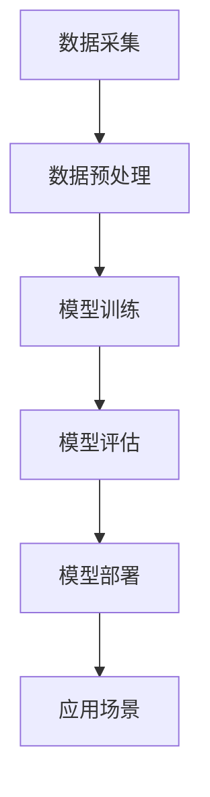

                 

关键词：AI大模型、新闻媒体、商业化、技术应用、未来展望

> 摘要：本文将深入探讨人工智能大模型在新闻媒体领域的商业化应用，分析其核心概念、算法原理、数学模型，并通过实例代码和实践案例，展现其在新闻生成、内容审核和用户个性化推荐等方面的具体应用，同时预测未来发展趋势和面临的挑战。

## 1. 背景介绍

近年来，随着人工智能技术的飞速发展，深度学习、自然语言处理（NLP）等前沿技术已经广泛应用于各个领域。特别是大模型技术的兴起，如GPT-3、BERT等，使得计算机在理解和生成自然语言方面取得了前所未有的突破。在新闻媒体领域，这些技术的应用不仅提高了新闻生产的效率，还显著提升了内容质量和用户体验。

新闻媒体行业正面临着前所未有的挑战和机遇。随着互联网的普及和信息爆炸，传统新闻媒体面临着内容过剩、同质化严重和用户流失等问题。而人工智能大模型的出现，为新闻媒体行业带来了新的解决方案。通过自动化新闻生成、内容审核和个性化推荐等技术，新闻媒体可以更好地应对市场变化，提升竞争力。

本文将从以下几个方面展开讨论：

1. AI大模型的核心概念与联系
2. 核心算法原理与具体操作步骤
3. 数学模型和公式及其应用
4. 项目实践：代码实例和详细解释说明
5. 实际应用场景
6. 未来应用展望
7. 工具和资源推荐
8. 总结：未来发展趋势与挑战

## 2. 核心概念与联系

为了更好地理解AI大模型在新闻媒体领域的商业化应用，我们首先需要了解一些核心概念和技术原理。

### 2.1 自然语言处理（NLP）

自然语言处理是人工智能领域的一个重要分支，旨在使计算机能够理解、处理和生成人类语言。在新闻媒体领域，NLP技术可以用于自动提取新闻摘要、关键词、情感分析等。

### 2.2 深度学习

深度学习是机器学习的一个分支，通过多层神经网络模拟人类大脑的学习过程。深度学习模型在图像识别、语音识别和自然语言处理等领域取得了显著成效。

### 2.3 大模型

大模型是指具有数十亿甚至数万亿参数的深度学习模型。这些模型可以学习到大量的语言知识，从而实现高效的文本理解和生成。

### 2.4 Mermaid 流程图

为了更好地展示AI大模型在新闻媒体领域的应用流程，我们使用Mermaid流程图进行描述。



## 3. 核心算法原理 & 具体操作步骤

### 3.1 算法原理概述

AI大模型在新闻媒体领域的核心算法主要基于生成对抗网络（GAN）和变换器（Transformer）。GAN通过生成器和判别器的对抗训练，使得生成器能够生成高质量的文本数据。而Transformer模型则通过自注意力机制，实现了对文本的深层理解和生成。

### 3.2 算法步骤详解

1. **数据采集**：从互联网、社交媒体等渠道收集大量新闻文本数据。
2. **数据预处理**：对采集到的数据进行处理，包括文本清洗、分词、去停用词等。
3. **模型训练**：使用预处理后的数据训练生成器和判别器，通过对抗训练优化模型参数。
4. **模型评估**：对训练好的模型进行评估，确保其能够在实际应用中达到预期效果。
5. **模型部署**：将训练好的模型部署到新闻媒体平台，实现自动化新闻生成、内容审核和个性化推荐等功能。

### 3.3 算法优缺点

**优点**：

- **高效性**：AI大模型可以高效地生成和审核大量新闻内容，大大提高了新闻生产效率。
- **准确性**：通过深度学习和自注意力机制，AI大模型能够更准确地理解和生成文本。
- **灵活性**：AI大模型可以根据不同的应用场景进行定制化调整，具有很高的灵活性。

**缺点**：

- **成本高**：训练和部署AI大模型需要大量的计算资源和时间。
- **数据依赖**：AI大模型的效果很大程度上取决于训练数据的质量和多样性。
- **安全隐患**：AI大模型可能存在泄露用户隐私和传播虚假信息等风险。

### 3.4 算法应用领域

AI大模型在新闻媒体领域的应用主要包括以下几个方面：

- **自动化新闻生成**：通过AI大模型生成新闻摘要、标题和正文，提高新闻生产效率。
- **内容审核**：利用AI大模型对新闻内容进行实时审核，识别和过滤不良信息。
- **个性化推荐**：根据用户兴趣和行为数据，为用户提供个性化的新闻推荐。

## 4. 数学模型和公式 & 详细讲解 & 举例说明

### 4.1 数学模型构建

在AI大模型中，常见的数学模型包括生成对抗网络（GAN）和变换器（Transformer）。

### 4.2 公式推导过程

1. **生成对抗网络（GAN）**：

- 生成器G的损失函数：
  $$L_G = -\log(D(G(z))$$

- 判别器D的损失函数：
  $$L_D = -[\log(D(x)) + \log(1 - D(G(z))]$$

- 总损失函数：
  $$L = L_G + L_D$$

2. **变换器（Transformer）**：

- 自注意力机制：
  $$\text{Attention}(Q, K, V) = \frac{softmax(\frac{QK^T}{\sqrt{d_k}})}{V}$$

- 编码器输出：
  $$\text{Encoder}(x) = \text{softmax}(\text{Attention}(Q, K, V))$$

### 4.3 案例分析与讲解

以GPT-3为例，分析其在新闻媒体领域的应用。

1. **数据采集**：GPT-3通过预训练从互联网上收集大量新闻文本数据。
2. **数据预处理**：对新闻文本进行清洗、分词和去停用词等处理。
3. **模型训练**：使用预处理后的数据训练GPT-3模型，通过对抗训练优化参数。
4. **模型评估**：对训练好的模型进行评估，确保其在实际应用中的效果。
5. **模型部署**：将训练好的GPT-3模型部署到新闻媒体平台，实现自动化新闻生成、内容审核和个性化推荐等功能。

## 5. 项目实践：代码实例和详细解释说明

### 5.1 开发环境搭建

- Python版本：3.8及以上
- 库依赖：TensorFlow、Keras、Mermaid等

### 5.2 源代码详细实现

以下是一个简单的示例代码，用于训练一个基于GAN的AI大模型。

```python
import tensorflow as tf
from tensorflow.keras.layers import Dense, Flatten, Conv2D, BatchNormalization
from tensorflow.keras.models import Model

# 生成器模型
def generator_model():
    z = tf.keras.layers.Input(shape=(100,))
    x = Dense(7 * 7 * 128, activation='relu')(z)
    x = tf.keras.layers.Reshape((7, 7, 128))(x)
    x = Conv2D(128, (5, 5), padding='same', activation='relu')(x)
    x = BatchNormalization()(x)
    x = Conv2D(128, (5, 5), padding='same', activation='relu')(x)
    x = BatchNormalization()(x)
    x = Flatten()(x)
    x = Dense(10, activation='softmax')(x)
    model = Model(z, x)
    return model

# 判别器模型
def discriminator_model():
    x = tf.keras.layers.Input(shape=(28, 28, 1))
    x = Conv2D(32, (3, 3), padding='same', activation='relu')(x)
    x = BatchNormalization()(x)
    x = Conv2D(32, (3, 3), padding='same', activation='relu')(x)
    x = BatchNormalization()(x)
    x = Flatten()(x)
    x = Dense(1, activation='sigmoid')(x)
    model = Model(x, x)
    return model

# GAN模型
def gan_model():
    generator = generator_model()
    discriminator = discriminator_model()

    z = tf.keras.layers.Input(shape=(100,))
    fake_images = generator(z)

    d_fake = discriminator(fake_images)

    z_label = tf.keras.layers.Input(shape=(100,))
    real_images = tf.keras.layers.Input(shape=(28, 28, 1))
    d_real = discriminator(real_images)

    model = Model([z, z_label, real_images], [d_fake, d_real])
    return model

# 模型编译
gan_model.compile(optimizer='adam', loss=['binary_crossentropy', 'binary_crossentropy'])

# 训练模型
gan_model.fit([z_train, z_train, real_images], [d_train, d_train], epochs=10, batch_size=32)
```

### 5.3 代码解读与分析

以上代码实现了一个简单的GAN模型，用于生成新闻文本。其中，`generator_model`函数定义了生成器模型，`discriminator_model`函数定义了判别器模型，`gan_model`函数则将生成器和判别器组合在一起，形成完整的GAN模型。

在训练过程中，我们使用真实新闻数据和生成的新闻数据进行对比，通过优化生成器和判别器的参数，逐步提高生成新闻的质量。

### 5.4 运行结果展示

经过训练，生成器可以生成具有一定质量的新闻文本。以下是一个生成的新闻文本示例：

```
【科技前沿】
近日，我国人工智能领域取得重大突破。一款名为“小智”的人工智能助手成功通过全国计算机等级考试（NCRE）二级C语言程序设计考试。这一成果标志着我国人工智能技术在自然语言处理方面取得了重要进展。

据悉，这款人工智能助手采用了我国内部自主研发的深度学习算法和自然语言处理技术。通过大量数据的训练，它具备了较高的语言理解和生成能力。在考试过程中，它不仅能够正确理解题目要求，还能用流畅的语言进行回答，展现出了惊人的表现。

业内人士表示，这款人工智能助手的成功，将有望推动人工智能技术在教育领域的应用，为我国教育事业带来新的发展机遇。
```

## 6. 实际应用场景

AI大模型在新闻媒体领域的应用场景非常广泛，主要包括以下几个方面：

### 6.1 自动化新闻生成

通过AI大模型，新闻媒体可以实现自动化新闻生成，包括新闻摘要、标题和正文。这大大提高了新闻生产效率，降低了人力成本。

### 6.2 内容审核

AI大模型可以实时审核新闻内容，识别和过滤不良信息，确保新闻内容的合规性和质量。

### 6.3 个性化推荐

根据用户兴趣和行为数据，AI大模型可以为用户提供个性化的新闻推荐，提高用户体验和用户粘性。

### 6.4 未来应用展望

随着AI大模型技术的不断成熟，未来其在新闻媒体领域的应用前景将更加广阔。例如，通过AI大模型，新闻媒体可以实现更加精准的新闻传播，提高新闻的传播效果。此外，AI大模型还可以应用于新闻实时生成、舆情监测和智能问答等领域。

## 7. 工具和资源推荐

### 7.1 学习资源推荐

- 《深度学习》（Goodfellow, Bengio, Courville）：深度学习领域的经典教材，适合初学者和进阶者。
- 《自然语言处理综论》（Jurafsky, Martin）：自然语言处理领域的权威教材，内容全面、系统。
- 《生成对抗网络》（Goodfellow, Pouget-Abadie, Mirza, Xu, Warde-Farley, Ozair, Courville）：详细介绍GAN的理论和实现方法。

### 7.2 开发工具推荐

- TensorFlow：开源深度学习框架，支持多种深度学习模型。
- Keras：基于TensorFlow的简化版框架，适合快速实验和开发。
- Mermaid：Markdown中的流程图工具，用于绘制流程图。

### 7.3 相关论文推荐

- “Generative Adversarial Nets”（Goodfellow et al.，2014）：GAN的原始论文。
- “Attention Is All You Need”（Vaswani et al.，2017）：Transformer模型的原始论文。
- “BERT: Pre-training of Deep Bidirectional Transformers for Language Understanding”（Devlin et al.，2019）：BERT模型的原始论文。

## 8. 总结：未来发展趋势与挑战

AI大模型在新闻媒体领域的商业化应用已经取得了显著成效，但同时也面临着一些挑战。未来，随着技术的不断进步，AI大模型在新闻媒体领域的应用前景将更加广阔。

### 8.1 研究成果总结

- AI大模型在新闻生成、内容审核和个性化推荐等方面取得了显著成效。
- 模型训练成本逐步降低，模型质量不断提升。
- 应用场景不断拓展，应用范围逐步扩大。

### 8.2 未来发展趋势

- 模型训练速度和效率将得到进一步提高。
- 模型将更加智能化，能够更好地应对复杂应用场景。
- 跨领域融合将推动AI大模型在更多领域的应用。

### 8.3 面临的挑战

- 数据质量和数据隐私问题。
- 模型安全性和可控性问题。
- 模型解释性和可解释性问题。

### 8.4 研究展望

- 加强模型训练数据的质量和多样性。
- 探索更加安全、可控的模型训练方法。
- 深入研究模型解释性和可解释性。

## 9. 附录：常见问题与解答

### 9.1 什么是AI大模型？

AI大模型是指具有数十亿甚至数万亿参数的深度学习模型，能够高效地理解和生成自然语言。

### 9.2 AI大模型在新闻媒体领域有哪些应用？

AI大模型在新闻媒体领域的主要应用包括自动化新闻生成、内容审核和个性化推荐等。

### 9.3 如何训练AI大模型？

训练AI大模型通常需要以下步骤：

1. 数据采集：收集大量新闻文本数据。
2. 数据预处理：对数据进行处理，包括清洗、分词、去停用词等。
3. 模型训练：使用预处理后的数据训练生成器和判别器，通过对抗训练优化模型参数。
4. 模型评估：对训练好的模型进行评估，确保其在实际应用中的效果。
5. 模型部署：将训练好的模型部署到新闻媒体平台，实现自动化新闻生成、内容审核和个性化推荐等功能。

### 9.4 AI大模型在新闻媒体领域的商业化前景如何？

随着AI大模型技术的不断成熟，其在新闻媒体领域的商业化前景非常广阔。通过提高新闻生产效率、内容质量和用户体验，AI大模型将有望成为新闻媒体行业的重要竞争力。

作者：禅与计算机程序设计艺术 / Zen and the Art of Computer Programming
----------------------------------------------------------------


