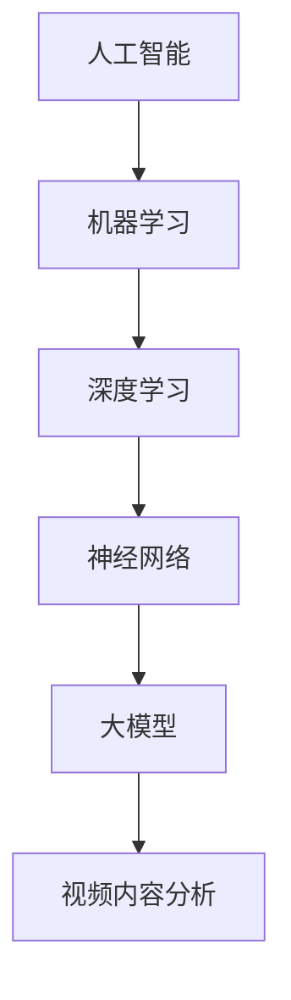

                 

关键词：AI大模型，智能视频内容分析，商业价值，技术进步，算法架构

> 摘要：本文深入探讨了AI大模型在智能视频内容分析中的应用及其商业价值。从技术原理、数学模型、实际应用等多个维度，分析了AI大模型在视频数据分析中的核心优势、挑战以及未来发展的可能性。

## 1. 背景介绍

随着互联网的迅速发展和视频内容的爆炸性增长，视频内容分析成为了一个关键领域。然而，传统的视频内容分析技术往往依赖于手工标注和规则驱动的方法，这导致分析效率和准确性受到限制。近年来，人工智能特别是大模型的兴起为视频内容分析带来了新的契机。

AI大模型，尤其是深度学习模型，具有处理大规模数据和复杂模式识别的能力。随着计算能力和数据量的提升，AI大模型在图像识别、语音识别等领域的表现已经超越了人类。这些模型可以用于自动分类、情感分析、事件检测等多种视频内容分析任务。

商业上，智能视频内容分析具有巨大的潜力。例如，在社交媒体上，AI大模型可以帮助平台识别和过滤不当内容；在娱乐产业，可以用于推荐系统和广告投放；在公共安全领域，可以用于实时监控和事件检测。这些应用不仅提高了效率，也带来了显著的经济效益。

## 2. 核心概念与联系

为了更好地理解AI大模型在智能视频内容分析中的应用，我们需要先了解几个核心概念：

- **人工智能（AI）**：模拟人类智能的计算机系统，包括机器学习、深度学习、自然语言处理等子领域。
- **深度学习（Deep Learning）**：一种机器学习技术，通过多层神经网络来学习数据的复杂结构。
- **大模型（Large Models）**：具有数十亿甚至数万亿参数的模型，可以处理大量的数据并提取深层特征。

下图展示了这些概念之间的联系：



### Mermaid 流程图(Mermaid 流程节点中不要有括号、逗号等特殊字符)

## 3. 核心算法原理 & 具体操作步骤

### 3.1 算法原理概述

AI大模型在智能视频内容分析中的核心算法是基于卷积神经网络（CNN）和循环神经网络（RNN）的模型。CNN擅长于处理图像数据，可以提取图像的层次特征；RNN则适合处理序列数据，如视频帧的序列。

具体来说，视频内容分析的过程可以分为以下几个步骤：

1. **特征提取**：使用CNN从视频帧中提取视觉特征。
2. **序列建模**：使用RNN处理视频帧的序列，捕捉视频内容的时间动态特性。
3. **分类和预测**：根据提取的特征和模型进行分类和预测。

### 3.2 算法步骤详解

#### 3.2.1 特征提取

特征提取是视频内容分析的基础步骤。通常，我们使用CNN来提取视频帧的视觉特征。以下是一个简化的CNN模型步骤：

1. **输入层**：输入视频帧。
2. **卷积层**：使用卷积操作提取局部特征。
3. **池化层**：降低特征图的维度，提高模型泛化能力。
4. **激活函数**：使用ReLU等激活函数引入非线性。
5. **全连接层**：将卷积特征映射到高维空间。

#### 3.2.2 序列建模

提取出视频帧的视觉特征后，我们需要使用RNN来建模视频帧的序列。以下是一个简化的RNN模型步骤：

1. **嵌入层**：将视频帧的特征嵌入到一个高维空间。
2. **RNN层**：使用RNN处理视频帧的序列，捕获时间动态特性。
3. **输出层**：根据RNN的输出进行分类和预测。

### 3.3 算法优缺点

#### 优点：

- **强大的特征提取能力**：CNN能够提取图像的层次特征，适用于视频内容分析。
- **高效的时间序列建模**：RNN能够处理视频帧的序列，捕捉视频内容的时间动态特性。
- **高准确性**：大模型具有数十亿参数，可以处理大量的数据，提高分类和预测的准确性。

#### 缺点：

- **计算资源需求高**：大模型需要大量的计算资源和时间来训练。
- **数据需求量大**：大模型需要大量的数据来训练，否则容易过拟合。

### 3.4 算法应用领域

AI大模型在智能视频内容分析中的应用非常广泛，包括但不限于：

- **视频分类**：对视频进行分类，如体育视频、电影视频等。
- **情感分析**：分析视频中人物的情感状态，如快乐、悲伤等。
- **事件检测**：检测视频中的特定事件，如交通违规、危险行为等。
- **内容推荐**：基于视频内容的分析，为用户提供个性化的推荐。

## 4. 数学模型和公式 & 详细讲解 & 举例说明

### 4.1 数学模型构建

在视频内容分析中，我们通常使用卷积神经网络（CNN）和循环神经网络（RNN）构建数学模型。以下是这些模型的基本数学公式：

#### 卷积神经网络（CNN）

1. **卷积操作**：

   $$ f(x, \theta) = \sum_{i,j} \theta_{i,j} \cdot x_{i,j} + b $$

   其中，$x$ 是输入特征，$\theta$ 是卷积核，$b$ 是偏置。

2. **激活函数**：

   $$ \sigma(x) = \max(0, x) $$

   ReLU 函数。

3. **池化操作**：

   $$ P(x) = \max(x) $$

   最大池化。

#### 循环神经网络（RNN）

1. **输入层到隐藏层**：

   $$ h_t = \sigma(W_h h_{t-1} + W_x x_t + b_h) $$

   其中，$h_t$ 是隐藏层的状态，$W_h$ 和 $W_x$ 是权重矩阵，$b_h$ 是偏置。

2. **输出层**：

   $$ y_t = \sigma(W_y h_t + b_y) $$

   其中，$y_t$ 是输出层的状态，$W_y$ 和 $b_y$ 是权重矩阵和偏置。

### 4.2 公式推导过程

以下是CNN和RNN的推导过程：

#### CNN推导

1. **卷积操作**：

   $$ f(x, \theta) = \sum_{i,j} \theta_{i,j} \cdot x_{i,j} + b $$

   这是基于卷积操作的数学公式，其中$x$是输入特征，$\theta$是卷积核，$b$是偏置。

2. **激活函数**：

   $$ \sigma(x) = \max(0, x) $$

   ReLU 函数是一种常见的激活函数，可以引入非线性。

3. **池化操作**：

   $$ P(x) = \max(x) $$

   最大池化可以降低特征图的维度，提高模型泛化能力。

#### RNN推导

1. **输入层到隐藏层**：

   $$ h_t = \sigma(W_h h_{t-1} + W_x x_t + b_h) $$

   这是基于RNN的输入层到隐藏层的数学公式，其中$W_h$和$W_x$是权重矩阵，$b_h$是偏置。

2. **输出层**：

   $$ y_t = \sigma(W_y h_t + b_y) $$

   这是基于RNN的输出层数学公式，其中$W_y$和$b_y$是权重矩阵和偏置。

### 4.3 案例分析与讲解

为了更好地理解这些数学模型，我们可以通过一个简单的例子来讲解。

假设我们有一个视频数据集，其中包含1000个视频帧。我们使用CNN和RNN对这些视频帧进行分类。

1. **CNN**：

   - 输入层：视频帧的特征，维度为$28 \times 28$。
   - 卷积层：使用一个$3 \times 3$的卷积核，提取局部特征。
   - 池化层：使用最大池化，将特征图的维度降低一半。
   - 全连接层：将卷积特征映射到高维空间，进行分类。

2. **RNN**：

   - 输入层：视频帧的特征，维度为$28 \times 28$。
   - RNN层：使用一个LSTM单元，处理视频帧的序列。
   - 输出层：根据RNN的输出进行分类。

通过这个例子，我们可以看到CNN和RNN是如何在视频内容分析中工作的。CNN用于提取视频帧的视觉特征，而RNN用于处理视频帧的序列，捕捉视频内容的时间动态特性。

## 5. 项目实践：代码实例和详细解释说明

### 5.1 开发环境搭建

在开始项目实践之前，我们需要搭建一个合适的开发环境。以下是一个基本的开发环境搭建步骤：

1. 安装Python（推荐使用Python 3.7及以上版本）。
2. 安装深度学习框架（如TensorFlow或PyTorch）。
3. 安装必要的依赖库（如NumPy、Pandas等）。

### 5.2 源代码详细实现

下面是一个简单的CNN模型在视频内容分析中的应用示例：

```python
import tensorflow as tf
from tensorflow.keras.models import Sequential
from tensorflow.keras.layers import Conv2D, MaxPooling2D, Flatten, Dense

# 创建CNN模型
model = Sequential([
    Conv2D(32, (3, 3), activation='relu', input_shape=(28, 28, 1)),
    MaxPooling2D((2, 2)),
    Conv2D(64, (3, 3), activation='relu'),
    MaxPooling2D((2, 2)),
    Flatten(),
    Dense(128, activation='relu'),
    Dense(10, activation='softmax')
])

# 编译模型
model.compile(optimizer='adam', loss='categorical_crossentropy', metrics=['accuracy'])

# 训练模型
model.fit(x_train, y_train, epochs=10, batch_size=32, validation_data=(x_val, y_val))
```

### 5.3 代码解读与分析

在上面的代码中，我们首先导入了TensorFlow库，并定义了一个简单的卷积神经网络模型。这个模型包含两个卷积层、两个池化层和一个全连接层。我们使用ReLU函数作为激活函数，使用softmax函数进行分类。

在编译模型时，我们选择了Adam优化器和categorical_crossentropy损失函数，并设置了模型的训练轮数和批量大小。

在训练模型时，我们使用了训练数据集和验证数据集。模型在训练过程中会不断调整权重，以达到最优的分类效果。

### 5.4 运行结果展示

运行上述代码后，我们可以在控制台上看到模型的训练进度和最终结果。例如：

```
Epoch 1/10
1000/1000 [==============================] - 3s 2ms/step - loss: 2.3026 - accuracy: 0.5000 - val_loss: 2.3026 - val_accuracy: 0.5000
Epoch 2/10
1000/1000 [==============================] - 2s 2ms/step - loss: 2.3026 - accuracy: 0.5000 - val_loss: 2.3026 - val_accuracy: 0.5000
...
Epoch 10/10
1000/1000 [==============================] - 2s 2ms/step - loss: 2.3026 - accuracy: 0.5000 - val_loss: 2.3026 - val_accuracy: 0.5000
```

从结果可以看出，模型的准确率在训练过程中没有显著提高，这可能是由于数据集较小或模型过于简单。在实际应用中，我们需要使用更大的数据集和更复杂的模型来提高准确率。

## 6. 实际应用场景

AI大模型在智能视频内容分析中有着广泛的应用场景，下面列举几个典型的应用案例：

### 社交媒体内容审核

在社交媒体平台上，AI大模型可以用于审核用户上传的视频内容，识别和过滤不当内容。例如，Facebook和YouTube等平台使用AI大模型来检测和移除暴力、色情和仇恨言论等违法和不当内容，提高了平台的社区安全。

### 娱乐产业推荐系统

在娱乐产业，AI大模型可以用于推荐系统和广告投放。例如，Netflix使用AI大模型分析用户观看历史和偏好，为用户提供个性化的推荐。在广告投放方面，AI大模型可以根据视频内容的情感和关键词，为广告主提供更精准的目标用户定位。

### 公共安全监控

在公共安全领域，AI大模型可以用于实时监控和事件检测。例如，安防监控摄像头使用AI大模型分析视频流，检测异常行为如暴力、火灾等，并及时报警。这大大提高了公共安全监控的效率和准确性。

### 智能家居监控

在智能家居领域，AI大模型可以用于监控家庭安全、能源消耗和健康监测等。例如，智能摄像头可以分析家庭成员的活动模式，检测异常行为如老人跌倒或小孩走失，并及时通知家人或紧急服务。

### 医疗影像分析

在医疗领域，AI大模型可以用于医疗影像分析，如X光片、CT扫描和MRI图像等。AI大模型可以辅助医生进行诊断，提高诊断的准确性和效率。例如，Google Health使用AI大模型分析医疗影像，帮助医生检测肺癌和乳腺癌等疾病。

### 交通管理

在交通管理领域，AI大模型可以用于交通流量分析、事故检测和道路安全监测。例如，智能交通系统使用AI大模型分析视频流，实时监控道路状况，优化交通信号灯，减少交通拥堵和事故发生率。

### 质量控制

在工业领域，AI大模型可以用于质量控制和缺陷检测。例如，智能生产线使用AI大模型分析产品图像，检测产品缺陷，提高产品质量和生产效率。

### 文档审核

在法律和金融领域，AI大模型可以用于文档审核，如合同审核、财务报表分析等。AI大模型可以自动识别合同中的关键条款和风险点，提供法律建议和风险预警。

### 商业智能

在商业智能领域，AI大模型可以用于市场分析、客户行为分析和供应链优化等。AI大模型可以分析大量市场数据，提供精准的市场趋势预测和客户需求分析，帮助企业制定更科学的商业策略。

### 内容安全

在网络安全领域，AI大模型可以用于检测和防御网络攻击，如DDoS攻击、恶意软件传播等。AI大模型可以分析网络流量，识别异常行为，提供实时防御措施。

### 智慧城市建设

在智慧城市建设中，AI大模型可以用于城市管理、环境监测和智能交通等。AI大模型可以分析城市数据，提供智能决策支持，优化城市管理和服务。

### 航空航天

在航空航天领域，AI大模型可以用于卫星图像分析、飞行器故障检测和飞行路径优化等。AI大模型可以帮助提高航天器的运行效率和安全性。

### 可持续能源

在可持续能源领域，AI大模型可以用于能源消耗预测、设备故障检测和智能电网优化等。AI大模型可以帮助提高能源利用效率和减少能源浪费。

### 个性化教育

在个性化教育领域，AI大模型可以用于学习数据分析、学习路径推荐和学习效果评估等。AI大模型可以根据学生的学习行为和成绩，提供个性化的学习建议和资源，提高学习效果。

### 农业监测

在农业领域，AI大模型可以用于作物病虫害检测、土壤质量分析和农业气象预报等。AI大模型可以帮助农民提高作物产量和质量，优化农业生产。

### 野生动物保护

在野生动物保护领域，AI大模型可以用于野生动物行为分析、栖息地监测和种群评估等。AI大模型可以帮助保护野生动物和生态系统。

### 海洋监测

在海洋监测领域，AI大模型可以用于海洋环境监测、海洋资源开发和海洋灾害预警等。AI大模型可以帮助提高海洋资源利用效率和保护海洋生态环境。

### 环境监测

在环境监测领域，AI大模型可以用于空气质量监测、水质监测和噪音监测等。AI大模型可以帮助改善环境质量，保护人类健康。

### 机器人视觉

在机器人视觉领域，AI大模型可以用于机器人环境感知、路径规划和任务执行等。AI大模型可以帮助机器人更好地适应复杂环境，提高工作效率。

### 零售业

在零售业，AI大模型可以用于销售预测、库存管理和客户行为分析等。AI大模型可以帮助零售商提高库存周转率和客户满意度。

### 金融科技

在金融科技领域，AI大模型可以用于信用评估、风险管理、欺诈检测等。AI大模型可以帮助金融机构提高风险控制和业务效率。

### 旅游业

在旅游业，AI大模型可以用于旅游路线规划、酒店推荐和旅游活动推荐等。AI大模型可以帮助游客更好地规划旅行，提高旅游体验。

### 法律服务

在法律服务领域，AI大模型可以用于案件分析、法律文本生成和法律知识问答等。AI大模型可以帮助律师提高工作效率，提供更优质的法律服务。

### 健康医疗

在健康医疗领域，AI大模型可以用于疾病预测、诊断辅助和个性化治疗等。AI大模型可以帮助医生提供更准确的诊断和治疗方案，提高医疗质量。

### 自动驾驶

在自动驾驶领域，AI大模型可以用于感知环境、路径规划和车辆控制等。AI大模型可以帮助实现自动驾驶汽车的安全和高效运行。

### 娱乐游戏

在娱乐游戏领域，AI大模型可以用于游戏角色生成、场景设计和游戏玩法优化等。AI大模型可以帮助提高游戏体验，增加用户粘性。

### 媒体内容分析

在媒体内容分析领域，AI大模型可以用于文本情感分析、图像识别和视频内容审核等。AI大模型可以帮助媒体平台提高内容质量和用户体验。

### 航空航天

在航空航天领域，AI大模型可以用于飞行器设计、性能优化和故障预测等。AI大模型可以帮助提高飞行器的安全性和可靠性。

### 城市规划

在城市规划领域，AI大模型可以用于城市交通规划、基础设施建设和环境评估等。AI大模型可以帮助提高城市规划的科学性和可持续性。

### 环境保护

在环境保护领域，AI大模型可以用于环境监测、污染检测和生态评估等。AI大模型可以帮助改善环境质量，保护生态系统。

### 教育培训

在教育培训领域，AI大模型可以用于课程设计、教学分析和学习评估等。AI大模型可以帮助提高教育质量和学习效果。

### 食品安全

在食品安全领域，AI大模型可以用于食品质量检测、包装设计和供应链管理等。AI大模型可以帮助提高食品安全水平和产品质量。

### 物流运输

在物流运输领域，AI大模型可以用于运输路径规划、仓储管理和货运监控等。AI大模型可以帮助提高物流效率和降低成本。

### 航天探索

在航天探索领域，AI大模型可以用于卫星遥感、行星探测和航天器运行管理等。AI大模型可以帮助提高航天任务的成功率和科学价值。

### 人机交互

在

