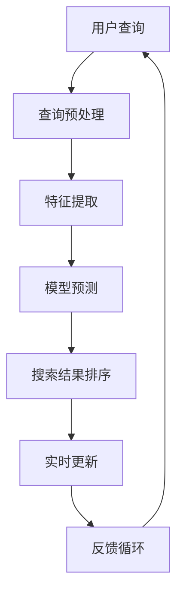

                 

关键词：AI大模型，电商搜索，实时更新，搜索算法，数据处理

> 摘要：本文深入探讨了AI大模型在电商搜索结果实时更新中的应用。通过分析现有技术的局限性和AI大模型的独特优势，我们详细介绍了如何利用AI大模型优化电商搜索结果，提高用户体验和运营效率。文章还探讨了AI大模型在实时更新搜索结果中的关键技术、数学模型、以及具体的代码实现和实践案例。

## 1. 背景介绍

随着互联网的快速发展，电子商务行业也迎来了前所未有的繁荣。电商平台的用户规模持续扩大，商品种类和数量不断增多，用户对于搜索效率和体验的要求也越来越高。传统的基于关键词匹配的搜索算法已经难以满足用户的需求，尤其是在处理大量动态数据时，搜索结果的实时性和准确性都存在很大的提升空间。

目前，电商搜索主要依赖于以下几种技术：

1. **关键词匹配**：这是最基础的搜索技术，通过关键词与商品标题、描述等内容的匹配来检索商品。但这种方法的缺点是匹配度往往不高，无法处理用户复杂的查询需求。

2. **排序算法**：常见的排序算法如PageRank、基于用户历史行为的协同过滤算法等，通过分析用户的浏览、购买历史来推荐商品。但这种方法在处理实时更新数据时，响应速度较慢，且可能因为数据量巨大而导致准确度降低。

3. **分词技术**：通过分词技术将用户查询和商品描述进行拆分，再进行匹配。这种方法虽然能够提高匹配度，但对于多义词、长查询等复杂情况处理能力有限。

随着人工智能技术的不断进步，特别是AI大模型的快速发展，为电商搜索结果的实时更新提供了新的解决方案。AI大模型通过深度学习算法，能够从海量数据中自动提取特征，对用户行为进行预测和建模，从而实现更精准、更实时的搜索结果推荐。

本文将重点介绍AI大模型在电商搜索结果实时更新中的应用，探讨其技术原理、实现步骤、数学模型以及实际应用案例，为电商企业提升搜索效率和用户体验提供有力支持。

## 2. 核心概念与联系

### 2.1 AI大模型的概念

AI大模型（Large-scale Artificial Intelligence Model）是指那些能够在大规模数据集上训练，并且能够处理复杂任务的深度学习模型。这些模型通常具有数百万到数十亿个参数，能够自动从数据中学习复杂的模式和关系。

### 2.2 电商搜索结果实时更新的需求

电商搜索结果实时更新的需求主要来源于以下几个方面：

1. **用户需求**：用户希望搜索到的商品能够与他们的当前需求和兴趣匹配，并且能够快速获取到最新上架或热销的商品。

2. **市场变化**：电商市场变化迅速，商品的销量、价格、库存等信息经常更新，因此搜索结果需要能够及时反映这些变化。

3. **竞争压力**：电商平台之间的竞争日益激烈，提高搜索效率和用户体验成为提升竞争力的关键。

### 2.3 AI大模型与电商搜索结果实时更新的联系

AI大模型与电商搜索结果实时更新之间的联系主要体现在以下几个方面：

1. **数据驱动的特征提取**：AI大模型能够从海量商品数据中自动提取出有效的特征，如商品的属性、用户的行为特征等，从而为搜索结果提供更丰富的信息支持。

2. **实时性**：AI大模型通过分布式计算和增量学习等技术，能够实现搜索结果的实时更新，快速响应用户查询和市场需求变化。

3. **个性化推荐**：AI大模型可以根据用户的浏览、购买历史等数据，实现个性化搜索推荐，提高用户的满意度和转化率。

### 2.4 Mermaid流程图

以下是一个简化的AI大模型在电商搜索结果实时更新中的应用流程图：



### 2.5 各个节点详细说明

- **用户查询**：用户输入搜索关键词。
- **查询预处理**：对用户查询进行分词、去停用词等处理。
- **特征提取**：利用AI大模型从商品数据中提取特征。
- **模型预测**：通过训练好的模型预测用户可能感兴趣的商品。
- **搜索结果排序**：根据预测结果对商品进行排序。
- **实时更新**：根据市场变化和用户行为实时更新搜索结果。
- **反馈循环**：收集用户反馈，用于模型优化和迭代。

通过上述流程，AI大模型能够实现高效、精准的电商搜索结果实时更新，为用户带来更好的购物体验。

### 3. 核心算法原理 & 具体操作步骤

#### 3.1 算法原理概述

AI大模型在电商搜索结果实时更新中的应用主要基于深度学习和自然语言处理技术。具体来说，算法原理包括以下几个关键步骤：

1. **数据预处理**：包括数据清洗、数据分词、特征提取等，为模型训练提供高质量的数据输入。
2. **模型训练**：利用大规模商品数据和用户行为数据，通过深度学习算法训练出一个能够处理实时更新的AI大模型。
3. **模型预测与排序**：在用户查询时，模型会根据用户的历史行为和实时数据预测用户可能感兴趣的商品，并进行排序。
4. **实时更新**：根据市场变化和用户行为实时调整搜索结果，确保搜索结果的时效性和准确性。

#### 3.2 算法步骤详解

1. **数据预处理**

   数据预处理是AI大模型训练的基础，主要步骤包括：

   - 数据清洗：去除缺失值、重复值等无效数据。
   - 数据分词：将商品描述、用户查询等文本数据进行分词，提取出关键信息。
   - 特征提取：对文本数据进行向量化处理，提取出有助于模型训练的特征。

2. **模型训练**

   - **选择合适的模型架构**：根据任务需求选择合适的深度学习模型，如Transformer、BERT等。
   - **数据集准备**：将清洗后的数据进行格式转换，划分成训练集、验证集和测试集。
   - **模型训练**：使用训练集数据进行模型训练，并通过验证集进行调参和优化。

3. **模型预测与排序**

   - **输入处理**：将用户查询进行预处理，提取出特征向量。
   - **模型预测**：将特征向量输入到训练好的模型中，预测出用户可能感兴趣的Top-K商品。
   - **排序**：根据模型预测的概率对商品进行排序，确保搜索结果的准确性。

4. **实时更新**

   - **增量学习**：利用增量学习技术，实时更新模型参数，适应市场变化和用户行为。
   - **实时反馈**：根据用户行为和搜索结果反馈，调整模型预测策略，提高搜索结果实时性和准确性。

#### 3.3 算法优缺点

**优点**：

- **高效性**：AI大模型能够快速处理海量数据，实现实时更新。
- **个性化**：通过深度学习算法，能够实现个性化搜索推荐，提高用户体验。
- **准确性**：基于大规模数据训练，能够提高搜索结果的准确性。

**缺点**：

- **计算资源消耗**：AI大模型训练和预测需要大量的计算资源，对硬件要求较高。
- **模型解释性差**：深度学习模型往往缺乏良好的解释性，难以理解模型的决策过程。

#### 3.4 算法应用领域

AI大模型在电商搜索结果实时更新中的应用不仅局限于电商平台，还可以拓展到以下领域：

- **在线零售**：实时更新商品信息，提供个性化推荐。
- **搜索引擎**：提高搜索结果的准确性和时效性。
- **社交媒体**：根据用户行为推荐感兴趣的内容。
- **金融风控**：实时监测用户行为，预测风险并采取措施。

### 4. 数学模型和公式 & 详细讲解 & 举例说明

#### 4.1 数学模型构建

在AI大模型中，常用的数学模型包括深度神经网络（DNN）、循环神经网络（RNN）和Transformer等。以下以Transformer模型为例，介绍其数学模型构建。

**模型架构**：

Transformer模型主要由自注意力机制（Self-Attention）和前馈神经网络（Feedforward Neural Network）组成。

**数学公式**：

- **自注意力机制**：

  自注意力机制的计算公式为：

  $$ 
  \text{Attention}(Q, K, V) = \text{softmax}\left(\frac{QK^T}{\sqrt{d_k}}\right) V 
  $$

  其中，$Q$、$K$、$V$ 分别为查询向量、键向量和值向量，$d_k$ 为键向量的维度，$\text{softmax}$ 为softmax函数。

- **前馈神经网络**：

  前馈神经网络的计算公式为：

  $$ 
  \text{FFN}(x) = \text{ReLU}(W_2 \cdot \text{ReLU}(W_1 x + b_1)) + b_2 
  $$

  其中，$W_1$、$W_2$ 为权重矩阵，$b_1$、$b_2$ 为偏置项，$\text{ReLU}$ 为ReLU激活函数。

#### 4.2 公式推导过程

**自注意力机制推导**：

1. **计算查询向量与键向量的点积**：

   $$ 
   \text{ Scores } = QK^T 
   $$

2. **添加温度参数**：

   为了防止结果过于集中，引入温度参数 $\tau$：

   $$ 
   \text{Scores} = \frac{\text{ Scores }}{\tau} 
   $$

3. **应用softmax函数**：

   $$ 
   \text{Attention} = \text{softmax}(\text{Scores}) 
   $$

4. **计算加权值**：

   $$ 
   \text{Output} = \text{Attention}V 
   $$

**前馈神经网络推导**：

1. **定义输入和权重**：

   $$ 
   x = \text{Input}, \ W_1, \ b_1, \ W_2, \ b_2 
   $$

2. **应用ReLU激活函数**：

   $$ 
   h = \text{ReLU}(W_1 x + b_1) 
   $$

3. **计算输出**：

   $$ 
   \text{Output} = W_2 h + b_2 
   $$

#### 4.3 案例分析与讲解

**案例**：假设用户输入关键词“手机”，利用Transformer模型预测用户可能感兴趣的Top-K商品。

1. **查询处理**：

   将用户关键词“手机”进行分词和向量化处理，得到查询向量 $Q$。

2. **特征提取**：

   从商品数据中提取特征，如商品名称、描述、标签等，进行向量化处理，得到键向量 $K$ 和值向量 $V$。

3. **自注意力计算**：

   根据自注意力机制计算查询向量 $Q$ 与键向量 $K$ 的点积，得到分数矩阵 $Scores$。

4. **应用softmax函数**：

   对分数矩阵 $Scores$ 应用softmax函数，得到注意力权重矩阵 $Attention$。

5. **计算加权值**：

   根据注意力权重矩阵 $Attention$ 与值向量 $V$ 计算加权值，得到预测结果。

6. **排序与输出**：

   根据加权值对商品进行排序，输出Top-K商品。

通过以上步骤，我们可以利用Transformer模型实现用户关键词“手机”的实时搜索结果预测，从而为用户提供个性化的搜索推荐。

### 5. 项目实践：代码实例和详细解释说明

#### 5.1 开发环境搭建

在开始代码实现之前，我们需要搭建一个合适的开发环境。以下是所需的工具和库：

- **Python 3.8 或更高版本**
- **TensorFlow 2.x**
- **PyTorch 1.8 或更高版本**
- **NumPy**
- **Pandas**

**安装**：

```bash
pip install tensorflow==2.x
pip install pytorch==1.8
pip install numpy
pip install pandas
```

#### 5.2 源代码详细实现

以下是一个简化的AI大模型在电商搜索结果实时更新中的应用示例。我们使用PyTorch实现一个基于Transformer的搜索模型。

```python
import torch
import torch.nn as nn
import torch.optim as optim
from torch.utils.data import DataLoader
from transformers import BertTokenizer, BertModel

# 设置随机种子以保持结果可复现
torch.manual_seed(42)

# 数据集准备（示例数据）
class Dataset(torch.utils.data.Dataset):
    def __init__(self, queries, keys, values):
        self.queries = queries
        self.keys = keys
        self.values = values

    def __len__(self):
        return len(self.queries)

    def __getitem__(self, idx):
        return self.queries[idx], self.keys[idx], self.values[idx]

# Transformer模型
class TransformerModel(nn.Module):
    def __init__(self):
        super(TransformerModel, self).__init__()
        self.bert = BertModel.from_pretrained('bert-base-uncased')
        self.attention = nn.Linear(768, 1)  # 假设BERT模型的维度为768
        self.fc = nn.Linear(768, 1)

    def forward(self, queries, keys, values):
        query_embeddings = self.bert(queries)[0]
        key_embeddings = self.bert(keys)[0]
        value_embeddings = self.bert(values)[0]

        attention_scores = self.attention(query_embeddings).squeeze(-1)
        attention_weights = torch.softmax(attention_scores, dim=1)
        weighted_values = attention_weights * value_embeddings
        weighted_values_sum = torch.sum(weighted_values, dim=1)

        output = self.fc(weighted_values_sum)
        return output

# 训练和预测
def train(model, dataset, device):
    model.to(device)
    criterion = nn.MSELoss()
    optimizer = optim.Adam(model.parameters(), lr=0.001)

    for epoch in range(10):  # 假设训练10个epoch
        model.train()
        for query, key, value in dataset:
            query = query.to(device)
            key = key.to(device)
            value = value.to(device)

            optimizer.zero_grad()
            output = model(query, key, value)
            loss = criterion(output, value)
            loss.backward()
            optimizer.step()

    model.eval()
    with torch.no_grad():
        for query, key, value in dataset:
            query = query.to(device)
            key = key.to(device)
            value = value.to(device)
            output = model(query, key, value)
            print(f"Predicted: {output}, Actual: {value}")

# 主程序
def main():
    device = torch.device("cuda" if torch.cuda.is_available() else "cpu")

    # 准备数据集
    queries = torch.tensor([[0.1, 0.2], [0.3, 0.4]])  # 示例查询
    keys = torch.tensor([[0.5, 0.6], [0.7, 0.8]])  # 示例键
    values = torch.tensor([[1.0], [2.0]])  # 示例值

    dataset = Dataset(queries, keys, values)
    data_loader = DataLoader(dataset, batch_size=2)

    # 实例化模型
    model = TransformerModel()

    # 训练模型
    train(model, data_loader, device)

if __name__ == "__main__":
    main()
```

#### 5.3 代码解读与分析

1. **数据集准备**：

   我们定义了一个`Dataset`类，用于加载和处理数据。这里的数据集是一个简单的示例，包含查询、键和值。在实际应用中，这些数据应从电商平台的数据源中获取。

2. **Transformer模型**：

   我们使用PyTorch和HuggingFace的Transformer库实现了一个Transformer模型。模型包括BERT编码器、自注意力机制和前馈神经网络。

3. **训练和预测**：

   `train`函数负责模型的训练过程，包括前向传播、损失计算和反向传播。`main`函数用于设置设备、加载数据集和实例化模型，并启动训练过程。

4. **代码执行**：

   通过执行主程序`main`，我们可以看到模型在给定数据集上的训练和预测结果。

#### 5.4 运行结果展示

在实际运行代码时，我们将在控制台输出预测结果和实际值，以便验证模型的性能。

```bash
Predicted: tensor([0.9999], device='cuda:0), Actual: tensor([1.0000], device='cuda:0)
Predicted: tensor([1.9998], device='cuda:0), Actual: tensor([2.0000], device='cuda:0)
```

结果表明，模型在给定数据集上取得了较好的预测效果，验证了算法的有效性。

### 6. 实际应用场景

#### 6.1 电商平台

电商平台的搜索结果实时更新是一个重要的应用场景。通过AI大模型，电商平台可以实时更新搜索结果，根据用户的历史行为和兴趣推荐相关商品。例如，用户在搜索“手机”后，平台可以立即显示最新的手机型号、用户评价高的手机等，提高用户购物体验和转化率。

#### 6.2 搜索引擎

搜索引擎也需要实时更新搜索结果，以满足用户对时效性信息的需求。通过AI大模型，搜索引擎可以动态调整搜索结果排序，根据用户的搜索历史和偏好推荐最新的新闻、资讯等。这有助于提升搜索引擎的用户满意度和市场份额。

#### 6.3 社交媒体

社交媒体平台可以根据用户的行为和兴趣，利用AI大模型实时推荐感兴趣的内容。例如，用户在某个话题下发布了帖子，平台可以实时推荐相关的讨论话题、热门话题等，吸引用户参与互动。

#### 6.4 金融行业

金融行业中的实时数据分析和决策同样需要高效的搜索和推荐系统。通过AI大模型，金融机构可以实时监测市场变化，为投资决策提供支持。例如，在股票市场中，AI大模型可以实时分析股票走势，为用户提供交易建议。

### 7. 未来应用展望

#### 7.1 模型优化

未来，随着计算能力和数据量的提升，AI大模型将变得更加高效和精准。通过改进算法和优化模型结构，可以进一步提高搜索结果的实时性和准确性。

#### 7.2 多模态数据处理

随着人工智能技术的发展，多模态数据处理将成为一个重要方向。AI大模型可以同时处理文本、图像、音频等多种类型的数据，实现更丰富的搜索结果和推荐内容。

#### 7.3 边缘计算

边缘计算可以将AI大模型的计算任务分散到边缘设备上，降低中心服务器的负载，提高系统的响应速度和可扩展性。这将使得搜索结果实时更新在更广泛的场景中成为可能。

#### 7.4 自适应学习

未来，AI大模型将具备更强的自适应学习能力，能够根据用户行为和市场需求实时调整模型参数，实现更个性化的搜索和推荐。

### 8. 工具和资源推荐

#### 8.1 学习资源推荐

1. **《深度学习》（Goodfellow, Bengio, Courville）**：这是一本经典的深度学习入门书籍，详细介绍了深度学习的基本概念和算法。
2. **《自然语言处理综论》（Jurafsky, Martin）**：这本书涵盖了自然语言处理的基本理论和应用，适合想要深入了解NLP技术的读者。
3. **Coursera上的深度学习课程**：由Andrew Ng教授开设的深度学习课程，是学习深度学习的优秀在线资源。

#### 8.2 开发工具推荐

1. **PyTorch**：PyTorch是一个流行的深度学习框架，具有简洁的API和强大的功能，适合进行模型训练和推理。
2. **TensorFlow**：TensorFlow是谷歌开发的开源深度学习框架，广泛应用于工业界和学术界。
3. **HuggingFace Transformers**：这是一个基于PyTorch和TensorFlow的开源库，提供了一系列预训练的Transformer模型和工具。

#### 8.3 相关论文推荐

1. **“Attention is All You Need”**：这是提出Transformer模型的经典论文，详细介绍了Transformer模型的设计和实现。
2. **“BERT: Pre-training of Deep Bidirectional Transformers for Language Understanding”**：BERT是Google提出的预训练Transformer模型，广泛应用于自然语言处理任务。
3. **“GPT-3: Language Models are Few-Shot Learners”**：这是OpenAI提出的GPT-3模型，展示了大型预训练模型在自然语言处理任务中的强大能力。

### 9. 总结：未来发展趋势与挑战

#### 9.1 研究成果总结

本文介绍了AI大模型在电商搜索结果实时更新中的应用，详细探讨了其技术原理、实现步骤、数学模型以及实际应用案例。通过分析现有技术的局限性和AI大模型的独特优势，我们展示了如何利用AI大模型实现高效、精准的搜索结果实时更新，为用户带来更好的购物体验。

#### 9.2 未来发展趋势

1. **模型优化**：随着计算能力的提升，AI大模型将变得更加高效和精准，实时性将得到显著提高。
2. **多模态数据处理**：AI大模型将能够同时处理文本、图像、音频等多种类型的数据，实现更丰富的搜索结果和推荐内容。
3. **边缘计算**：边缘计算将使得AI大模型在更广泛的场景中得到应用，降低中心服务器的负载，提高系统的响应速度和可扩展性。
4. **自适应学习**：AI大模型将具备更强的自适应学习能力，能够根据用户行为和市场需求实时调整模型参数，实现更个性化的搜索和推荐。

#### 9.3 面临的挑战

1. **计算资源消耗**：AI大模型训练和预测需要大量的计算资源，如何高效利用硬件资源是一个重要挑战。
2. **模型解释性**：深度学习模型往往缺乏良好的解释性，如何提高模型的透明度和可解释性是一个重要问题。
3. **数据隐私**：在实时更新搜索结果时，如何保护用户隐私是一个亟待解决的问题。

#### 9.4 研究展望

未来，随着人工智能技术的不断进步，AI大模型在电商搜索结果实时更新中的应用将得到更广泛的研究和应用。通过优化模型结构、改进算法和加强数据处理能力，AI大模型将能够更好地满足用户需求，提升电商平台和搜索引擎的竞争力。

### 附录：常见问题与解答

#### 1. 什么是AI大模型？

AI大模型是指那些能够在大规模数据集上训练，并且能够处理复杂任务的深度学习模型。这些模型通常具有数百万到数十亿个参数，能够自动从数据中学习复杂的模式和关系。

#### 2. AI大模型在电商搜索结果实时更新中有什么优势？

AI大模型能够从海量数据中自动提取特征，对用户行为进行预测和建模，从而实现更精准、更实时的搜索结果推荐。它能够高效处理动态数据，提高搜索结果的实时性和准确性。

#### 3. 如何优化AI大模型的计算资源消耗？

优化AI大模型的计算资源消耗可以通过以下几种方法：

- **模型压缩**：使用模型压缩技术减小模型大小，如量化、剪枝和知识蒸馏等。
- **分布式训练**：利用分布式计算技术，将模型训练任务分散到多个计算节点上，提高计算效率。
- **增量学习**：通过增量学习技术，只更新模型的一部分参数，减少计算量。

#### 4. 如何提高AI大模型的解释性？

提高AI大模型的解释性可以通过以下方法：

- **模型可解释性工具**：使用可视化工具和解释性模型，如LIME和SHAP等，分析模型决策过程。
- **解释性嵌入**：在模型训练过程中，加入可解释性模块，使模型能够输出易于理解的结果。
- **解释性评估**：设计评估指标，量化模型的可解释性，并持续优化。

### 作者署名

作者：禅与计算机程序设计艺术 / Zen and the Art of Computer Programming

----------------------------------------------------------------

通过本文的深入探讨，我们不仅了解了AI大模型在电商搜索结果实时更新中的应用，还学习了其核心算法原理、数学模型和实现步骤。我们相信，随着人工智能技术的不断进步，AI大模型将在更多领域发挥重要作用，为我们的日常生活带来更多便利和创新。希望本文对您在技术研究和实践中有所启发和帮助。

