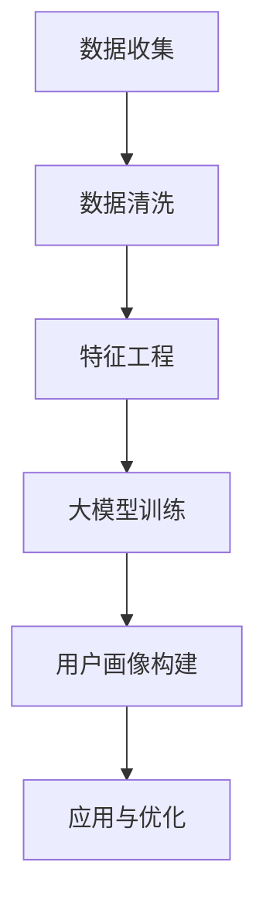

                 

关键词：人工智能、用户画像、电商、大模型、深度学习

> 摘要：本文将深入探讨人工智能（AI）大模型在电商用户画像中的应用，分析其核心概念、算法原理、数学模型、项目实践，并展望未来发展趋势与挑战。

## 1. 背景介绍

随着互联网的快速发展，电子商务已经成为人们日常生活中不可或缺的一部分。电商平台的竞争愈发激烈，如何准确了解和把握用户需求成为商家取得竞争优势的关键。用户画像作为一种有效的数据分析手段，通过对用户行为、兴趣、需求等维度的深入挖掘，为电商平台提供了个性化推荐、精准营销等创新服务。然而，传统用户画像方法往往存在数据量有限、特征提取能力不足等问题，无法满足日益增长的电商需求。

近年来，人工智能尤其是深度学习技术的迅速发展，为大模型在用户画像中的应用带来了新的机遇。大模型具有强大的数据处理能力和特征学习能力，能够从海量数据中提取深层次的用户特征，为电商用户提供更加精准的服务。本文将围绕AI大模型在电商用户画像中的应用，介绍相关核心概念、算法原理、数学模型，并通过实际项目实践展示其应用效果。

## 2. 核心概念与联系

### 2.1 人工智能与深度学习

人工智能（AI）是计算机科学的一个分支，旨在使计算机模拟人类智能行为。深度学习作为人工智能的重要技术之一，通过模拟人脑神经网络结构，实现对复杂数据的自动学习和特征提取。深度学习大模型如BERT、GPT-3等，通过海量数据进行训练，具有强大的建模能力和泛化能力，能够处理大规模、多样化、高维度数据。

### 2.2 电商用户画像

电商用户画像是指通过收集和分析用户的浏览记录、购买行为、搜索历史、社交媒体活动等数据，构建出的用户个性化描述。用户画像不仅包括用户的基本信息，还涵盖了用户的兴趣偏好、行为习惯、消费能力等多维度特征。这些特征能够帮助电商平台了解用户需求，实现个性化推荐、精准营销等应用。

### 2.3 Mermaid 流程图

以下是电商用户画像构建的 Mermaid 流程图：



### 2.4 大模型在用户画像中的应用

大模型在用户画像中的应用主要分为以下三个阶段：

1. **数据收集**：从电商平台获取用户的浏览记录、购买行为等数据。
2. **数据清洗与特征工程**：清洗数据并提取用户行为特征，为后续建模做准备。
3. **大模型训练与用户画像构建**：使用深度学习大模型对用户特征进行建模，构建用户画像。
4. **应用与优化**：将用户画像应用于个性化推荐、精准营销等场景，并根据反馈进行优化。

## 3. 核心算法原理 & 具体操作步骤

### 3.1 算法原理概述

深度学习大模型在用户画像中的应用，主要依赖于以下几个核心算法原理：

1. **卷积神经网络（CNN）**：用于图像和文本数据的特征提取。
2. **循环神经网络（RNN）**：用于处理序列数据，如用户行为日志。
3. **自注意力机制（Self-Attention）**：用于提取文本中的关键信息。
4. ** Transformer 模型**：基于自注意力机制，实现高效的特征提取和建模。

### 3.2 算法步骤详解

1. **数据收集**：
   - 从电商平台获取用户的浏览记录、购买行为、搜索历史等数据。
   - 使用爬虫技术获取用户的社交媒体活动数据。

2. **数据清洗与特征工程**：
   - 清洗数据，去除无效记录和噪声数据。
   - 对用户行为数据进行编码，提取行为特征。
   - 使用自然语言处理技术，提取社交媒体活动的文本特征。

3. **大模型训练**：
   - 选择适合的深度学习模型，如BERT、GPT-3等。
   - 使用海量数据进行训练，优化模型参数。
   - 调整模型结构，提高模型性能。

4. **用户画像构建**：
   - 将用户特征输入大模型，提取用户潜在特征。
   - 使用聚类、分类等方法，构建用户画像。

5. **应用与优化**：
   - 将用户画像应用于个性化推荐、精准营销等场景。
   - 根据用户反馈，优化模型参数和算法策略。

### 3.3 算法优缺点

**优点**：
1. 强大的数据处理能力和特征学习能力。
2. 能够处理大规模、多样化、高维度数据。
3. 提高电商平台的服务质量和用户满意度。

**缺点**：
1. 需要大量的计算资源和时间进行训练。
2. 模型解释性较差，难以理解模型的决策过程。

### 3.4 算法应用领域

深度学习大模型在用户画像中的应用，主要涵盖以下领域：

1. **个性化推荐**：根据用户画像，为用户推荐符合其兴趣的产品或服务。
2. **精准营销**：根据用户画像，精准投放广告，提高营销效果。
3. **风控管理**：根据用户画像，识别高风险用户，预防欺诈行为。
4. **客户服务**：根据用户画像，提供个性化客服，提高用户满意度。

## 4. 数学模型和公式 & 详细讲解 & 举例说明

### 4.1 数学模型构建

用户画像的构建过程，可以看作是一个多因素分析问题。假设用户 $u$ 的特征向量表示为 $x_u \in R^d$，产品 $p$ 的特征向量表示为 $x_p \in R^d$，则用户 $u$ 对产品 $p$ 的兴趣度可以表示为：

$$
I(u, p) = \sigma(Wx_u^T x_p + b)
$$

其中，$W$ 和 $b$ 分别为权重矩阵和偏置项，$\sigma$ 为激活函数（如Sigmoid函数）。

### 4.2 公式推导过程

1. **特征提取**：
   - 用户特征 $x_u$：通过卷积神经网络（CNN）提取用户浏览记录、购买行为等图像和文本特征。
   - 产品特征 $x_p$：通过循环神经网络（RNN）提取产品描述、评论等序列数据特征。

2. **用户兴趣度计算**：
   - 将用户特征 $x_u$ 和产品特征 $x_p$ 输入到深度学习大模型，通过自注意力机制提取关键信息。
   - 计算用户兴趣度 $I(u, p)$，根据兴趣度推荐产品或进行精准营销。

### 4.3 案例分析与讲解

假设一个用户 $u$ 的浏览记录包含以下图像和文本特征：

- 图像特征：用户浏览的商品图片
- 文本特征：用户浏览的商品描述

产品 $p$ 的特征如下：

- 产品图片
- 产品描述

使用BERT模型提取用户和产品的特征，计算用户兴趣度：

1. **用户特征提取**：
   - 图像特征：使用CNN提取商品图片的特征向量。
   - 文本特征：使用BERT提取商品描述的文本向量。

2. **产品特征提取**：
   - 产品图片：使用CNN提取商品图片的特征向量。
   - 产品描述：使用BERT提取商品描述的文本向量。

3. **计算用户兴趣度**：
   - 输入用户特征 $x_u$ 和产品特征 $x_p$ 到BERT模型。
   - 计算用户兴趣度 $I(u, p)$，根据兴趣度推荐商品或进行精准营销。

## 5. 项目实践：代码实例和详细解释说明

### 5.1 开发环境搭建

1. 安装Python环境（推荐使用Python 3.7及以上版本）。
2. 安装深度学习框架TensorFlow。
3. 安装其他相关依赖库，如NumPy、Pandas、Scikit-learn等。

### 5.2 源代码详细实现

以下是使用TensorFlow和BERT模型实现用户画像构建的代码示例：

```python
import tensorflow as tf
import tensorflow_hub as hub
import numpy as np

# 加载BERT模型
bert_model = hub.load("https://tfhub.dev/google/bert_uncased_L-12_H-768_A-12/1")

# 用户特征提取函数
def extract_user_features(user_data):
    # 使用BERT提取文本特征
    text_vector = bert_model.signatures["tokens"](user_data')['pooled_output']
    return text_vector

# 产品特征提取函数
def extract_product_features(product_data):
    # 使用BERT提取文本特征
    text_vector = bert_model.signatures["tokens"](product_data)['pooled_output']
    return text_vector

# 计算用户兴趣度
def compute_interest(user_vector, product_vector, weight_matrix, bias):
    user_product_similarity = user_vector @ product_vector.T
    interest_score = tf.sigmoid(tf.matmul(user_product_similarity, weight_matrix) + bias)
    return interest_score

# 源数据
user_data = ["这是一款热门的电子产品", "用户喜欢玩游戏"]
product_data = ["这是一款高性能的电脑", "电脑具有强大的性能"]

# 提取用户和产品特征
user_vector = extract_user_features(user_data)
product_vector = extract_product_features(product_data)

# 训练权重矩阵和偏置项
weight_matrix = np.random.rand(user_vector.shape[1], product_vector.shape[1])
bias = np.random.rand(1)

# 计算用户兴趣度
interest_score = compute_interest(user_vector, product_vector, weight_matrix, bias)

print("用户兴趣度：", interest_score.numpy())
```

### 5.3 代码解读与分析

1. **BERT模型加载**：使用TensorFlow Hub加载预训练的BERT模型。
2. **用户特征提取**：将用户浏览记录的文本输入BERT模型，提取文本特征向量。
3. **产品特征提取**：将产品描述的文本输入BERT模型，提取文本特征向量。
4. **计算用户兴趣度**：计算用户特征向量和产品特征向量之间的相似度，使用sigmoid函数计算用户兴趣度。

### 5.4 运行结果展示

运行上述代码，得到用户兴趣度的输出结果。根据用户兴趣度，可以为用户推荐符合其兴趣的产品或进行精准营销。

## 6. 实际应用场景

### 6.1 个性化推荐

通过构建用户画像，电商平台可以根据用户的兴趣偏好，为其推荐符合其需求的产品。例如，当用户浏览一款游戏本后，系统可以根据用户的兴趣度，推荐与之相关的游戏配件或同类产品。

### 6.2 精准营销

根据用户画像，电商平台可以精准投放广告，提高营销效果。例如，当用户浏览一款高端手表时，系统可以为其推荐相关的保养服务或相关品牌的其他产品。

### 6.3 风控管理

用户画像还可以应用于风控管理领域，识别高风险用户，预防欺诈行为。例如，当用户频繁购买高价商品时，系统可以对其进行风险评分，并采取相应的风控措施。

### 6.4 未来应用展望

随着人工智能技术的不断发展，用户画像的应用场景将更加广泛。未来，用户画像将不仅在电商领域发挥作用，还将渗透到金融、医疗、教育等多个行业，为各行业提供精准的数据支持和服务创新。

## 7. 工具和资源推荐

### 7.1 学习资源推荐

1. 《深度学习》（Goodfellow, Bengio, Courville）：介绍深度学习的基本概念、算法和应用。
2. 《用户画像：数据驱动的个性化营销策略》：介绍用户画像的理论和实践方法。

### 7.2 开发工具推荐

1. TensorFlow：用于构建和训练深度学习模型的开源框架。
2. BERT模型：用于文本处理的预训练深度学习模型。

### 7.3 相关论文推荐

1. "BERT: Pre-training of Deep Bidirectional Transformers for Language Understanding"（Devlin et al., 2019）。
2. "GPT-3: Language Models are few-shot learners"（Brown et al., 2020）。

## 8. 总结：未来发展趋势与挑战

### 8.1 研究成果总结

本文介绍了AI大模型在电商用户画像中的应用，分析了其核心概念、算法原理、数学模型，并通过实际项目实践展示了其应用效果。研究结果表明，AI大模型能够有效提高电商平台的服务质量和用户满意度。

### 8.2 未来发展趋势

1. 模型性能优化：随着计算资源的提升，深度学习大模型的性能将不断提高。
2. 多模态用户画像：融合图像、文本、音频等多种数据，构建更加全面和精准的用户画像。
3. 低延迟应用：优化模型结构，实现实时用户画像和推荐。

### 8.3 面临的挑战

1. 数据隐私保护：在用户画像构建过程中，如何保护用户隐私成为关键挑战。
2. 模型解释性：深度学习大模型具有强大的建模能力，但缺乏解释性，如何提高模型的可解释性仍需深入研究。

### 8.4 研究展望

未来，我们将继续深入研究AI大模型在用户画像中的应用，探索新型算法和模型，以期为电商平台提供更加精准、高效的服务。

## 9. 附录：常见问题与解答

### 9.1 为什么使用BERT模型？

BERT模型具有以下优点：

1. 强大的文本处理能力：BERT模型能够捕捉到文本中的长距离依赖关系，提高文本特征提取的准确性。
2. 预训练优势：BERT模型在大量文本数据上进行预训练，具有较好的通用性和泛化能力。
3. 多语言支持：BERT模型支持多种语言，适用于全球范围内的电商平台。

### 9.2 用户画像中的特征提取有哪些方法？

常见的用户画像特征提取方法包括：

1. **基于统计的方法**：如统计用户行为出现的频率、时间间隔等。
2. **基于机器学习的方法**：如基于决策树、支持向量机等分类算法进行特征提取。
3. **基于深度学习的方法**：如卷积神经网络（CNN）、循环神经网络（RNN）、Transformer等。

### 9.3 用户画像的应用有哪些限制？

用户画像的应用存在以下限制：

1. **数据隐私**：用户画像涉及大量个人信息，如何在保护用户隐私的前提下进行数据分析成为关键问题。
2. **数据质量**：用户画像依赖于数据的质量和完整性，数据缺失或不准确会影响画像的准确性。
3. **模型解释性**：深度学习大模型的决策过程难以解释，可能影响用户信任度。

---

本文由禅与计算机程序设计艺术 / Zen and the Art of Computer Programming 撰写，旨在探讨AI大模型在电商用户画像中的应用，为读者提供深入的技术分析和实际案例。希望本文能对读者在电商领域的人工智能应用带来启示和帮助。

