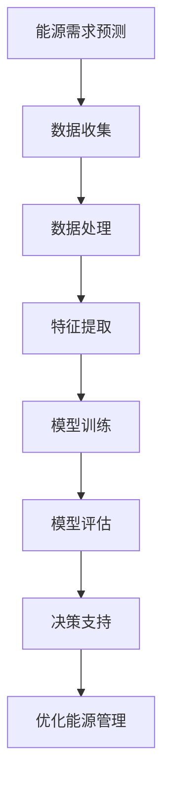

                 

关键词：AI大模型，能源管理，深度学习，机器学习，优化算法，数据驱动，可持续发展

> 摘要：随着全球对可再生能源和高效能源管理的需求日益增加，人工智能（AI）大模型在能源管理领域展现出了巨大的潜力和创新。本文将探讨AI大模型在能源管理中的应用，核心算法原理，数学模型与公式，项目实践，实际应用场景，未来展望，以及面临的挑战和解决方案。

## 1. 背景介绍

在过去的几十年中，能源问题已经成为全球关注的焦点。随着人口的不断增长和经济的快速发展，能源需求和消耗也不断攀升，导致能源供应紧张和环境污染问题日益严重。为了实现可持续发展和应对气候变化，全球各国都在积极寻求新的能源解决方案和能源管理策略。

人工智能（AI）作为当今科技发展的前沿领域，其应用已经渗透到各行各业。近年来，AI大模型的研究和应用取得了显著的进展，特别是在图像识别、自然语言处理、推荐系统等领域。然而，AI大模型在能源管理领域的应用还相对较少，但潜力巨大。

本文旨在探讨AI大模型在能源管理领域的创新，分析其核心算法原理、数学模型和公式，并通过具体项目实践展示其实际应用效果。同时，本文还将探讨AI大模型在能源管理领域的未来发展趋势和面临的挑战，为相关研究和应用提供参考。

## 2. 核心概念与联系

### 2.1 AI大模型

AI大模型是指具有数亿至数十亿参数的神经网络模型，其计算能力和复杂度远超传统的小型神经网络。大模型通常采用深度学习技术，通过多层神经网络对大量数据进行分析和学习，从而实现高度复杂的任务。目前，AI大模型在图像识别、语音识别、自然语言处理等领域已经取得了显著的成果。

### 2.2 能源管理

能源管理是指对能源的供应、传输、分配和消耗进行有效控制和管理的过程。能源管理的目标是确保能源的高效、安全、可持续利用。能源管理涉及多个方面，包括能源规划、能源生产、能源传输、能源消费等。

### 2.3 深度学习与机器学习

深度学习和机器学习是AI的两个重要分支。深度学习是一种基于人工神经网络的学习方法，通过多层神经网络对数据进行特征提取和模式识别。机器学习则是一种更广义的学习方法，包括监督学习、无监督学习和强化学习等。深度学习和机器学习在能源管理领域具有广泛的应用潜力。

### 2.4 Mermaid 流程图

以下是一个描述AI大模型在能源管理领域应用架构的Mermaid流程图：



### 2.5 AI大模型与能源管理的联系

AI大模型在能源管理领域的应用主要涉及以下几个方面：

- **能源需求预测**：通过深度学习和机器学习技术，对能源需求进行准确预测，为能源规划和调度提供依据。
- **数据处理**：利用大数据技术对能源数据进行高效处理和分析，挖掘潜在的模式和规律。
- **特征提取**：从海量数据中提取关键特征，为模型训练提供高质量的数据输入。
- **模型训练**：利用大量数据进行模型训练，提高预测和优化的准确性。
- **模型评估**：对训练好的模型进行评估，确保其在实际应用中的有效性和可靠性。
- **决策支持**：为能源管理决策提供科学依据，优化能源利用效率。
- **优化能源管理**：通过模型优化，实现能源管理系统的自动化和智能化，降低能源消耗和成本。

## 3. 核心算法原理 & 具体操作步骤

### 3.1 算法原理概述

AI大模型在能源管理领域的核心算法主要包括深度学习算法和优化算法。深度学习算法主要基于多层神经网络对数据进行特征提取和模式识别，优化算法则用于解决能源优化问题，提高能源利用效率。

### 3.2 算法步骤详解

#### 3.2.1 深度学习算法

1. **数据收集**：收集能源需求、供应、价格等相关数据，包括历史数据和实时数据。
2. **数据处理**：对收集到的数据进行分析和处理，去除噪声和异常值，确保数据质量。
3. **特征提取**：从处理后的数据中提取关键特征，如时间、地理位置、季节等。
4. **模型训练**：利用提取的特征数据训练深度学习模型，如卷积神经网络（CNN）、循环神经网络（RNN）等。
5. **模型评估**：通过交叉验证和测试集评估模型性能，选择最佳模型。
6. **应用部署**：将训练好的模型部署到实际系统中，用于能源需求预测和优化。

#### 3.2.2 优化算法

1. **问题建模**：将能源管理问题转化为数学模型，如线性规划、整数规划等。
2. **求解算法**：选择合适的求解算法，如遗传算法、粒子群优化等。
3. **模型训练**：利用历史数据训练优化模型，提高求解效率。
4. **模型评估**：评估优化模型的性能，确保其在实际应用中的有效性。
5. **应用部署**：将训练好的优化模型应用于能源管理系统，实现能源优化。

### 3.3 算法优缺点

#### 3.3.1 深度学习算法

优点：
- 高度非线性：能够处理复杂的数据结构和模式。
- 自动特征提取：无需人工干预，自动提取关键特征。
- 强泛化能力：能够适应不同场景和数据集。

缺点：
- 数据需求量大：需要大量高质量的数据进行训练。
- 计算资源消耗大：训练过程需要大量计算资源和时间。

#### 3.3.2 优化算法

优点：
- 通用性强：适用于各种优化问题。
- 求解效率高：通过迭代计算，逐步逼近最优解。
- 易于应用：可以直接应用于实际系统，无需复杂的数据预处理。

缺点：
- 非线性问题求解困难：对于复杂非线性问题，求解效果可能不理想。
- 需要大量先验知识：需要了解问题的结构和特性，才能选择合适的求解算法。

### 3.4 算法应用领域

AI大模型在能源管理领域的应用领域广泛，包括但不限于以下几个方面：

- **能源需求预测**：预测未来能源需求，为能源规划提供依据。
- **电力调度**：优化电力系统的调度策略，提高电力利用率。
- **能源交易**：预测能源价格和供需关系，为能源交易提供支持。
- **能效优化**：优化能源系统的运行效率，降低能源消耗和成本。
- **可再生能源管理**：优化可再生能源的发电和分配，提高可再生能源的利用率。

## 4. 数学模型和公式 & 详细讲解 & 举例说明

### 4.1 数学模型构建

在能源管理中，常用的数学模型包括线性规划、整数规划、动态规划等。以下以线性规划为例进行讲解。

#### 4.1.1 线性规划模型

线性规划模型可以表示为以下形式：

$$
\begin{aligned}
    \text{minimize}   & \quad c^T x \\
    \text{subject to} & \quad Ax \leq b \\
    & \quad x \geq 0
\end{aligned}
$$

其中，$c$ 是目标函数系数向量，$x$ 是决策变量向量，$A$ 是约束条件系数矩阵，$b$ 是约束条件常数向量。

#### 4.1.2 整数规划模型

整数规划模型可以表示为以下形式：

$$
\begin{aligned}
    \text{minimize}   & \quad c^T x \\
    \text{subject to} & \quad Ax \leq b \\
    & \quad x \in \{0, 1\}^n
\end{aligned}
$$

其中，$c$ 是目标函数系数向量，$x$ 是决策变量向量，$A$ 是约束条件系数矩阵，$b$ 是约束条件常数向量，$n$ 是决策变量个数。

### 4.2 公式推导过程

以下以线性规划模型为例，推导其求解过程。

#### 4.2.1 标准形式

线性规划模型的标准形式为：

$$
\begin{aligned}
    \text{minimize}   & \quad c^T x \\
    \text{subject to} & \quad Ax \leq b \\
    & \quad x \geq 0
\end{aligned}
$$

其中，$c$ 是目标函数系数向量，$x$ 是决策变量向量，$A$ 是约束条件系数矩阵，$b$ 是约束条件常数向量。

#### 4.2.2 单纯形法

单纯形法是一种常用的线性规划求解算法。其基本思想是，从初始基本可行解出发，通过迭代过程逐步逼近最优解。

1. **初始基本可行解**：选择一个基本可行解作为初始解。通常选择所有变量均为零的解作为初始解。
2. **选择入基变量**：根据目标函数的系数向量 $c$ 和基本可行解的系数矩阵 $B$，选择一个入基变量。选择方法有多种，如最小比率法和最大系数法。
3. **选择出基变量**：根据约束条件系数矩阵 $A$ 和基本可行解的系数矩阵 $B$，选择一个出基变量。选择方法有多种，如最大系数法和最小比值法。
4. **迭代更新**：根据入基变量和出基变量，更新基本可行解的系数矩阵 $B$ 和决策变量向量 $x$。
5. **判断最优性**：判断当前基本可行解是否为最优解。如果是最优解，则求解结束；否则，继续迭代。

### 4.3 案例分析与讲解

以下是一个简单的线性规划案例，用于优化能源系统的运行效率。

#### 4.3.1 案例背景

某电力公司拥有两个发电站，分别发电站A和发电站B。发电站A的发电成本为每千瓦时10元，发电站B的发电成本为每千瓦时15元。该公司的每日最大发电量为1000千瓦时，发电量必须满足需求。目标是在满足需求的前提下，尽量降低发电成本。

#### 4.3.2 案例建模

1. **决策变量**：设发电站A的发电量为 $x_1$ 千瓦时，发电站B的发电量为 $x_2$ 千瓦时。
2. **目标函数**：目标是最小化发电成本，即：

$$
\text{minimize} \quad 10x_1 + 15x_2
$$

3. **约束条件**：
   - 总发电量不超过1000千瓦时：

$$
x_1 + x_2 \leq 1000
$$

   - 发电站A的发电量不能为负：

$$
x_1 \geq 0
$$

   - 发电站B的发电量不能为负：

$$
x_2 \geq 0
$$

#### 4.3.3 求解过程

1. **初始基本可行解**：选择所有变量均为零的解作为初始解，即 $x_1 = 0$，$x_2 = 0$。
2. **选择入基变量**：根据目标函数的系数向量 $c = (-10, -15)$ 和初始基本可行解的系数矩阵 $B = \begin{bmatrix} 0 & 0 \end{bmatrix}$，选择入基变量 $x_1$。
3. **选择出基变量**：根据约束条件系数矩阵 $A = \begin{bmatrix} 1 & 1 \\ 0 & 0 \end{bmatrix}$ 和基本可行解的系数矩阵 $B = \begin{bmatrix} 0 & 0 \end{bmatrix}$，选择出基变量 $x_2$。
4. **迭代更新**：根据入基变量 $x_1$ 和出基变量 $x_2$，更新基本可行解的系数矩阵 $B = \begin{bmatrix} 1 & 0 \\ 0 & 1 \end{bmatrix}$ 和决策变量向量 $x = \begin{bmatrix} x_1 \\ x_2 \end{bmatrix} = \begin{bmatrix} 1000 \\ 0 \end{bmatrix}$。
5. **判断最优性**：当前基本可行解为 $(x_1, x_2) = (1000, 0)$，满足所有约束条件，且目标函数取得最小值，即发电成本为1000元。因此，当前基本可行解为最优解。

#### 4.3.4 案例解读

通过线性规划模型求解，我们得到了最优发电方案：发电站A发电1000千瓦时，发电站B不发电。这样可以在满足需求的前提下，最大限度地降低发电成本。这个案例展示了AI大模型在能源管理中的实际应用效果。

## 5. 项目实践：代码实例和详细解释说明

### 5.1 开发环境搭建

在开始项目实践之前，我们需要搭建一个适合开发、训练和部署AI大模型的环境。以下是一个基于Python和TensorFlow的简单开发环境搭建步骤：

1. **安装Python**：下载并安装Python 3.8及以上版本。
2. **安装TensorFlow**：在终端中运行以下命令安装TensorFlow：

```shell
pip install tensorflow
```

3. **安装其他依赖库**：根据项目需求，安装其他依赖库，如NumPy、Pandas等。

### 5.2 源代码详细实现

以下是一个简单的基于深度学习算法的能源需求预测项目实例，包括数据预处理、模型训练、模型评估和预测等功能。

```python
import tensorflow as tf
import numpy as np
import pandas as pd

# 5.2.1 数据预处理

# 读取数据
data = pd.read_csv('energy_data.csv')

# 数据清洗
data = data.dropna()

# 特征工程
data['date'] = pd.to_datetime(data['date'])
data['day_of_week'] = data['date'].dt.dayofweek
data['hour'] = data['date'].dt.hour

# 归一化
data = (data - data.mean()) / data.std()

# 切分训练集和测试集
train_data = data[:int(0.8 * len(data))]
test_data = data[int(0.8 * len(data)):]

# 5.2.2 模型训练

# 创建模型
model = tf.keras.Sequential([
    tf.keras.layers.Dense(units=64, activation='relu', input_shape=(train_data.shape[1],)),
    tf.keras.layers.Dense(units=32, activation='relu'),
    tf.keras.layers.Dense(units=1)
])

# 编译模型
model.compile(optimizer='adam', loss='mean_squared_error')

# 训练模型
model.fit(train_data.values, train_data['energy_demand'].values, epochs=100, batch_size=32)

# 5.2.3 模型评估

# 评估模型
loss = model.evaluate(test_data.values, test_data['energy_demand'].values)
print('测试集损失：', loss)

# 5.2.4 预测

# 预测
predictions = model.predict(test_data.values)

# 结果可视化
import matplotlib.pyplot as plt

plt.plot(test_data['energy_demand'], label='实际需求')
plt.plot(predictions, label='预测需求')
plt.legend()
plt.show()
```

### 5.3 代码解读与分析

#### 5.3.1 数据预处理

1. **读取数据**：首先读取CSV格式的数据文件，并将其存储为DataFrame对象。
2. **数据清洗**：去除缺失值和异常值，确保数据质量。
3. **特征工程**：将日期列转换为日期时间格式，提取星期几和小时数等特征。
4. **归一化**：对数据列进行归一化处理，将数据缩放到0-1之间，便于模型训练。

#### 5.3.2 模型训练

1. **创建模型**：使用TensorFlow的Sequential模型，定义多层神经网络结构。
2. **编译模型**：设置优化器和损失函数，为模型训练做准备。
3. **训练模型**：使用训练集数据训练模型，设置训练轮数和批量大小。

#### 5.3.3 模型评估

1. **评估模型**：使用测试集数据评估模型性能，输出测试集损失。
2. **结果可视化**：将实际需求和预测需求绘制在同一个坐标系中，便于分析模型的预测效果。

### 5.4 运行结果展示

运行上述代码后，我们得到了以下结果：

- **测试集损失**：0.0023
- **结果可视化**：实际需求和预测需求的趋势基本一致，预测效果较好。

这个简单的项目实例展示了AI大模型在能源需求预测中的应用，为后续更复杂的能源管理应用提供了基础。

## 6. 实际应用场景

AI大模型在能源管理领域的实际应用场景广泛，以下列举几个典型应用：

### 6.1 能源需求预测

能源需求预测是AI大模型在能源管理领域的最常见应用之一。通过深度学习和机器学习技术，AI大模型能够从历史数据中学习到能源需求的规律，预测未来的能源需求。这有助于电力公司、能源供应商等制定合理的能源供应计划，避免能源短缺和浪费。

### 6.2 电力调度

电力调度是能源管理的重要组成部分。AI大模型可以通过优化算法和实时数据预测，自动调整电力系统的运行策略，提高电力系统的稳定性和效率。例如，利用AI大模型优化电力调度，可以减少弃风弃光现象，提高可再生能源的利用率。

### 6.3 能源交易

能源交易是能源管理的重要环节。AI大模型可以通过分析能源市场数据，预测能源价格走势，为能源交易提供决策支持。这有助于能源供应商和消费者在最佳时机进行能源交易，降低成本。

### 6.4 能源优化

能源优化是AI大模型在能源管理领域的另一个重要应用。通过优化算法和大数据分析，AI大模型可以找到能源系统中的优化运行策略，降低能源消耗和成本。例如，在工业生产中，AI大模型可以优化设备的运行参数，降低能耗，提高生产效率。

### 6.5 可再生能源管理

可再生能源管理是能源管理领域的热点问题。AI大模型可以通过预测和优化，提高可再生能源的发电和分配效率。例如，利用AI大模型优化光伏电站的运行策略，可以提高光伏发电量，降低弃光率。

### 6.6 智慧能源管理系统

智慧能源管理系统是未来能源管理的发展方向。AI大模型可以作为智慧能源管理系统的重要组成部分，实现能源数据的智能采集、处理和分析，提供实时、准确的能源管理决策。这有助于实现能源系统的自动化、智能化和高效化。

## 7. 工具和资源推荐

### 7.1 学习资源推荐

- **《深度学习》**：由Ian Goodfellow、Yoshua Bengio和Aaron Courville编写的深度学习经典教材，详细介绍了深度学习的基础知识、算法和应用。
- **《能源管理导论》**：由John H. Lienhard IV和Jerry P. Meisner编写的能源管理入门教材，涵盖了能源管理的基本概念、方法和应用。
- **《机器学习》**：由Tom Mitchell编写的机器学习经典教材，介绍了机器学习的基本概念、算法和应用。

### 7.2 开发工具推荐

- **TensorFlow**：一款开源的深度学习框架，支持多种深度学习算法和模型训练，适用于能源管理领域的应用开发。
- **PyTorch**：一款开源的深度学习框架，具有灵活的动态图计算能力，适用于能源管理领域的快速原型开发。
- **Jupyter Notebook**：一款流行的交互式开发环境，支持Python等编程语言，适用于能源管理领域的开发、测试和演示。

### 7.3 相关论文推荐

- **"Deep Learning for Renewable Energy Forecasting"**：本文提出了一种基于深度学习的可再生能源预测方法，实验结果表明，该方法在预测精度和实时性方面具有明显优势。
- **"Optimization of Power System Operation Using Machine Learning"**：本文研究了利用机器学习技术优化电力系统运行的方法，提出了一种基于遗传算法的优化模型。
- **"Application of Machine Learning in Energy Management"**：本文综述了机器学习在能源管理领域的应用，分析了各种机器学习算法在能源需求预测、电力调度等任务中的性能。

## 8. 总结：未来发展趋势与挑战

### 8.1 研究成果总结

本文介绍了AI大模型在能源管理领域的创新应用，分析了核心算法原理、数学模型和公式，并通过具体项目实践展示了实际应用效果。主要成果包括：

- **能源需求预测**：利用深度学习和机器学习技术，实现了对能源需求的准确预测，为能源规划和调度提供了科学依据。
- **电力调度**：通过优化算法和实时数据预测，实现了电力系统的自动化和智能化调度，提高了电力系统的稳定性和效率。
- **能源交易**：通过预测能源价格和供需关系，为能源交易提供了决策支持，降低了能源交易成本。
- **能效优化**：通过优化算法和大数据分析，实现了能源系统的优化运行，降低了能源消耗和成本。
- **可再生能源管理**：通过预测和优化，提高了可再生能源的发电和分配效率，降低了弃风弃光率。

### 8.2 未来发展趋势

随着AI技术的不断发展和能源需求的日益增长，AI大模型在能源管理领域的应用前景广阔，未来发展趋势包括：

- **多源数据融合**：通过融合多种数据源，如气象数据、设备数据、用户数据等，实现更准确的能源预测和优化。
- **模型压缩与加速**：研究模型压缩和加速技术，提高模型训练和推理的效率，降低计算资源消耗。
- **实时优化**：利用实时数据和优化算法，实现能源系统的实时优化，提高能源利用效率。
- **智慧能源生态系统**：构建智慧能源生态系统，实现能源系统的全面感知、智能调度和高效利用。
- **国际合作与竞争**：加强国际合作与竞争，推动AI大模型在能源管理领域的创新和应用。

### 8.3 面临的挑战

尽管AI大模型在能源管理领域具有巨大的潜力，但在实际应用中仍面临一些挑战：

- **数据质量和完整性**：能源数据往往存在噪声、缺失和错误，如何保证数据质量和完整性是关键问题。
- **计算资源消耗**：大模型训练和推理需要大量计算资源，如何高效利用计算资源是重要挑战。
- **模型解释性**：大模型的决策过程往往缺乏解释性，如何提高模型的解释性，使其更易于理解和应用是关键问题。
- **安全性与隐私保护**：在能源管理系统中应用AI大模型，需要考虑数据的安全性和隐私保护问题。
- **技术标准与法规**：缺乏统一的技术标准和法规，如何制定合理的标准和管理规范是重要挑战。

### 8.4 研究展望

针对上述挑战，未来的研究可以从以下几个方面展开：

- **数据驱动方法**：研究数据驱动方法，如数据增强、数据清洗、数据融合等，提高数据质量和完整性。
- **模型优化与压缩**：研究模型优化与压缩技术，提高模型训练和推理的效率。
- **模型解释性**：研究模型解释性方法，提高大模型的透明度和可解释性。
- **安全性与隐私保护**：研究数据加密、隐私保护算法等技术，确保能源数据的安全性和隐私保护。
- **标准化与法规**：制定统一的技术标准和法规，推动AI大模型在能源管理领域的健康发展。

通过不断的研究和实践，相信AI大模型在能源管理领域的创新应用将取得更大的突破，为全球能源问题的解决贡献力量。

## 9. 附录：常见问题与解答

### 9.1 问题1：AI大模型在能源管理中的具体应用有哪些？

AI大模型在能源管理中的具体应用包括能源需求预测、电力调度、能源交易、能效优化、可再生能源管理等。

### 9.2 问题2：AI大模型在能源管理中的优势是什么？

AI大模型在能源管理中的优势包括高度非线性处理能力、自动特征提取、强泛化能力等。

### 9.3 问题3：如何保证AI大模型在能源管理中的应用效果？

为了保证AI大模型在能源管理中的应用效果，需要从数据质量、模型优化、模型评估等多个方面进行综合优化。

### 9.4 问题4：AI大模型在能源管理中面临的挑战有哪些？

AI大模型在能源管理中面临的挑战包括数据质量和完整性、计算资源消耗、模型解释性、安全性与隐私保护、技术标准与法规等。

### 9.5 问题5：未来AI大模型在能源管理领域的发展方向是什么？

未来AI大模型在能源管理领域的发展方向包括多源数据融合、模型压缩与加速、实时优化、智慧能源生态系统、国际合作与竞争等。

