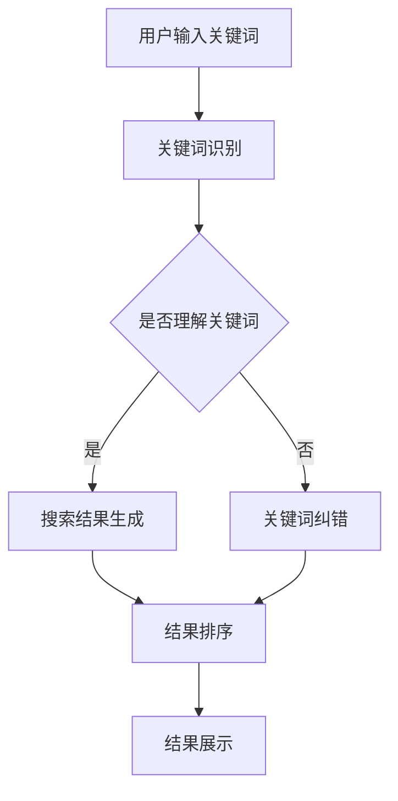

                 

关键词：AI大模型、电商搜索、移动端、用户体验、优化

> 摘要：本文探讨了如何利用AI大模型优化电商搜索的移动端体验。通过介绍AI大模型的原理、应用场景以及数学模型，文章详细阐述了如何利用AI大模型提升移动端搜索的准确性和效率，从而改善用户购物体验。

## 1. 背景介绍

在当今数字化时代，电商搜索已成为消费者购买商品的主要途径之一。随着移动设备的普及，移动端电商搜索的使用率逐渐超过PC端。然而，现有的移动端搜索系统往往存在以下问题：

- **搜索结果不准确**：由于移动端屏幕较小，用户输入的查询信息通常较为简洁，导致搜索结果不准确。
- **响应时间过长**：移动网络环境不稳定，搜索请求的处理时间较长，降低了用户体验。
- **个性化程度不足**：现有搜索系统难以根据用户的兴趣和历史行为提供个性化的搜索结果。

为了解决这些问题，AI大模型的应用成为了一种有效的解决方案。AI大模型，如深度学习模型、生成对抗网络（GAN）等，具有强大的数据处理和分析能力，能够通过对海量用户行为数据的分析，提供更加精准和个性化的搜索服务。

## 2. 核心概念与联系

### 2.1 AI大模型的基本原理

AI大模型主要基于深度学习技术，通过多层神经网络对大量数据进行分析和学习，从而实现对数据的理解和预测。具体而言，深度学习模型包括输入层、隐藏层和输出层，通过逐层传递输入数据，模型能够自动提取特征并进行分类或回归。


### 2.2 电商搜索系统中的AI大模型应用

在电商搜索系统中，AI大模型主要应用于以下几个方面：

- **关键词识别与理解**：通过对用户输入的关键词进行分析，AI大模型能够理解用户的真实需求，并提供更为精准的搜索结果。
- **推荐系统**：基于用户的浏览和购买历史，AI大模型能够为用户推荐可能感兴趣的商品，提高用户的购物体验。
- **搜索结果排序**：通过分析搜索结果的相关性和用户的偏好，AI大模型能够对搜索结果进行智能排序，提高搜索的准确性和效率。

### 2.3 Mermaid流程图



## 3. 核心算法原理 & 具体操作步骤

### 3.1 算法原理概述

AI大模型在电商搜索中的应用主要基于以下原理：

- **数据驱动的特征提取**：通过大量用户行为数据，AI大模型能够自动提取特征，如用户兴趣、购买偏好等。
- **深度学习网络结构**：深度学习模型能够通过多层神经网络，逐步提取和融合特征，从而实现对数据的理解和预测。
- **强化学习**：通过持续学习和优化，AI大模型能够不断提高搜索的准确性和效率。

### 3.2 算法步骤详解

#### 3.2.1 数据预处理

- **关键词分词**：对用户输入的关键词进行分词，提取出关键词的词语成分。
- **数据清洗**：去除无关数据，如噪声、重复数据等，保证数据的准确性。

#### 3.2.2 特征提取

- **用户特征**：通过用户的浏览和购买历史，提取用户的兴趣和偏好。
- **商品特征**：提取商品的属性信息，如价格、品牌、类别等。

#### 3.2.3 模型训练

- **构建深度学习模型**：选择合适的深度学习模型，如卷积神经网络（CNN）、循环神经网络（RNN）等。
- **训练与优化**：通过大量训练数据，对模型进行训练和优化，提高模型的准确性和效率。

#### 3.2.4 搜索结果生成

- **关键词匹配**：对用户输入的关键词与商品特征进行匹配，生成初步的搜索结果。
- **结果排序**：根据用户的兴趣和偏好，对搜索结果进行排序，提高结果的准确性和相关性。

#### 3.2.5 结果展示

- **搜索结果展示**：将排序后的搜索结果展示给用户，并提供商品推荐。

### 3.3 算法优缺点

#### 3.3.1 优点

- **高准确性**：AI大模型能够通过对海量数据的分析，提供精准的搜索结果。
- **高效性**：通过深度学习模型，AI大模型能够快速处理搜索请求，提高响应速度。
- **个性化**：AI大模型能够根据用户的行为和偏好，提供个性化的搜索结果，提高用户体验。

#### 3.3.2 缺点

- **计算成本高**：深度学习模型的训练和优化需要大量的计算资源。
- **数据依赖性**：AI大模型的效果高度依赖训练数据的质量和数量。

### 3.4 算法应用领域

AI大模型在电商搜索中的应用不仅限于移动端，还可以应用于PC端、智能音箱等设备。此外，AI大模型在其他领域的应用，如推荐系统、自然语言处理等，也取得了显著的效果。

## 4. 数学模型和公式 & 详细讲解 & 举例说明

### 4.1 数学模型构建

在电商搜索中，AI大模型的核心是深度学习模型。以下是一个简化的深度学习模型构建过程：

$$
y = f(z) \\
z = W \cdot x + b
$$

其中，$y$ 表示输出结果，$f(z)$ 是激活函数，$z$ 是中间结果，$W$ 是权重矩阵，$x$ 是输入特征，$b$ 是偏置项。

### 4.2 公式推导过程

以卷积神经网络（CNN）为例，其基本结构包括卷积层、池化层和全连接层。以下是一个简化的CNN公式推导过程：

$$
h_{\text{pool}} = \text{maxPooling}(h_{\text{conv}}) \\
h_{\text{conv}} = \text{conv}(h_{\text{input}}) \\
h_{\text{input}} = \text{input}(x)
$$

其中，$h_{\text{input}}$ 是输入特征，$h_{\text{conv}}$ 是卷积层输出，$h_{\text{pool}}$ 是池化层输出。

### 4.3 案例分析与讲解

#### 4.3.1 关键词识别

假设用户输入关键词“iPhone 13”，AI大模型通过对海量用户行为数据的分析，提取出用户对iPhone 13的兴趣和偏好，从而生成相关搜索结果。

#### 4.3.2 搜索结果排序

根据用户对iPhone 13的兴趣和偏好，AI大模型对搜索结果进行排序，优先展示用户可能感兴趣的商品。

## 5. 项目实践：代码实例和详细解释说明

### 5.1 开发环境搭建

- **硬件环境**：配备较高性能的CPU和GPU，以支持深度学习模型的训练和优化。
- **软件环境**：安装Python、TensorFlow等深度学习框架。

### 5.2 源代码详细实现

以下是一个简单的AI大模型实现示例，用于对用户输入的关键词进行识别和搜索结果排序。

```python
import tensorflow as tf

# 构建深度学习模型
model = tf.keras.Sequential([
    tf.keras.layers.Embedding(input_dim=10000, output_dim=16),
    tf.keras.layers.Conv1D(filters=128, kernel_size=5, activation='relu'),
    tf.keras.layers.GlobalMaxPooling1D(),
    tf.keras.layers.Dense(units=1, activation='sigmoid')
])

# 编译模型
model.compile(optimizer='adam', loss='binary_crossentropy', metrics=['accuracy'])

# 训练模型
model.fit(x_train, y_train, epochs=10, batch_size=32)

# 搜索结果排序
def search_results(keyword):
    # 对关键词进行编码
    encoded_keyword = tokenizer.encode(keyword, max_length=10)
    # 预测搜索结果
    predicted_results = model.predict(np.array([encoded_keyword]))
    # 对搜索结果进行排序
    sorted_results = [result for result in predicted_results[0] if result > 0.5]
    return sorted_results

# 示例
print(search_results("iPhone 13"))
```

### 5.3 代码解读与分析

- **模型构建**：使用TensorFlow构建深度学习模型，包括嵌入层、卷积层、全局池化层和全连接层。
- **模型编译**：设置优化器、损失函数和评估指标。
- **模型训练**：使用训练数据进行模型训练，提高模型的准确性。
- **搜索结果排序**：对用户输入的关键词进行编码，通过模型预测搜索结果，并对结果进行排序。

## 6. 实际应用场景

### 6.1 移动端电商搜索

AI大模型在移动端电商搜索中的应用，能够提高搜索结果的准确性和个性化程度，改善用户购物体验。例如，用户在移动端搜索“iPhone 13”，AI大模型能够准确识别用户需求，并提供相关商品推荐。

### 6.2 智能音箱购物

智能音箱购物已成为一种新兴的购物方式。AI大模型在智能音箱购物中的应用，能够通过语音识别和自然语言处理，提供精准的购物推荐，提高用户购物的便捷性。

### 6.3 智能推荐系统

AI大模型在智能推荐系统中的应用，能够通过对用户行为数据的分析，提供个性化的商品推荐，提高用户的购物满意度。

## 7. 工具和资源推荐

### 7.1 学习资源推荐

- **《深度学习》**：由Ian Goodfellow、Yoshua Bengio和Aaron Courville合著，是深度学习的经典教材。
- **《TensorFlow实战》**：由Curran Kelleher和William Lincoln合著，详细介绍了TensorFlow的实战应用。

### 7.2 开发工具推荐

- **TensorFlow**：谷歌开发的深度学习框架，支持多种深度学习模型的构建和训练。
- **PyTorch**：基于Python的深度学习框架，具有灵活性和高效性。

### 7.3 相关论文推荐

- **《Deep Learning for Text Classification》**：介绍深度学习在文本分类中的应用。
- **《Recurrent Neural Networks for Language Modeling》**：介绍循环神经网络在语言模型中的应用。

## 8. 总结：未来发展趋势与挑战

### 8.1 研究成果总结

AI大模型在电商搜索中的应用取得了显著成果，提高了搜索结果的准确性和个性化程度，改善了用户购物体验。未来，随着技术的不断进步，AI大模型在电商搜索中的应用将更加广泛和深入。

### 8.2 未来发展趋势

- **多模态融合**：将图像、语音、文本等多种模态的数据进行融合，提供更加精准和个性化的搜索服务。
- **联邦学习**：通过分布式计算，提高模型的训练效率和安全性。
- **自适应优化**：根据用户的行为和偏好，实时调整搜索算法，提高搜索的准确性和效率。

### 8.3 面临的挑战

- **数据隐私**：如何在保护用户隐私的前提下，充分利用用户行为数据，是一个重要的挑战。
- **计算资源**：随着模型规模的不断扩大，计算资源的消耗将不断增加，如何优化计算资源的使用是一个重要的挑战。
- **算法透明性**：如何确保AI大模型的决策过程透明、可解释，是一个重要的伦理和社会问题。

### 8.4 研究展望

未来，AI大模型在电商搜索中的应用将朝着更加智能化、个性化和高效化的方向发展。通过不断探索和创新，AI大模型将有望解决现有搜索系统中的各种问题，为用户提供更加优质的购物体验。

## 9. 附录：常见问题与解答

### 9.1 什么是AI大模型？

AI大模型是指基于深度学习技术，通过对海量数据进行分析和学习，实现对数据的理解和预测的模型。

### 9.2 AI大模型在电商搜索中有哪些应用？

AI大模型在电商搜索中的应用包括关键词识别、推荐系统、搜索结果排序等。

### 9.3 如何优化AI大模型的性能？

优化AI大模型性能的方法包括数据预处理、模型架构优化、训练策略优化等。

## 作者署名

作者：禅与计算机程序设计艺术 / Zen and the Art of Computer Programming
----------------------------------------------------------------

以上就是本文的完整内容，希望对您有所帮助。如果您有任何疑问或建议，请随时联系我。再次感谢您的阅读！

