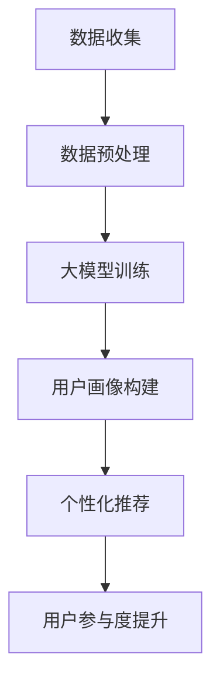

                 

关键词：AI大模型、电商平台、用户参与度、算法优化、用户行为分析

摘要：随着人工智能技术的快速发展，大模型技术在电商平台中的应用逐渐成为提升用户参与度的关键。本文将探讨AI大模型如何通过深度学习、用户行为分析等手段，为电商平台带来更加个性化、智能化的用户体验，从而有效提升用户参与度。文章将从核心概念、算法原理、数学模型、项目实践等多个方面展开讨论。

## 1. 背景介绍

在互联网快速发展的今天，电商平台已经成为消费者购物的主要渠道。用户参与度是电商平台成功与否的重要指标，直接影响平台的商业价值。然而，随着市场竞争的加剧，传统营销手段的效果逐渐减弱，用户获取和保持变得愈发困难。为此，电商平台需要不断创新，以提升用户参与度，从而在激烈的市场竞争中脱颖而出。

人工智能（AI）技术的出现为电商平台带来了新的机遇。大模型作为AI领域的重要研究方向，已经在图像识别、自然语言处理等领域取得了显著的成果。大模型通过海量数据的学习，能够自动提取数据中的复杂模式和关联，为电商平台提供更精准的用户画像和个性化推荐。本文将重点探讨AI大模型在提升电商平台用户参与度方面的应用。

## 2. 核心概念与联系

### 2.1 大模型基本概念

大模型（Large Model）是指具有数十亿甚至千亿参数的深度学习模型。大模型通过在大量数据上进行训练，能够自动提取数据中的复杂模式和关联，从而实现高精度的预测和分类。大模型的代表性工作包括Google的BERT、OpenAI的GPT系列等。

### 2.2 用户行为分析

用户行为分析是指通过对用户在电商平台上的行为数据进行挖掘和分析，了解用户的需求、偏好和习惯，从而为用户提供更个性化的服务。用户行为分析的核心是用户画像，即通过整合用户的历史行为数据，构建一个全面的用户画像，用于指导电商平台的服务和营销策略。

### 2.3 Mermaid 流程图

以下是一个简单的Mermaid流程图，展示了大模型在电商平台用户行为分析中的应用流程：



## 3. 核心算法原理 & 具体操作步骤

### 3.1 算法原理概述

大模型的核心原理是深度学习，深度学习是一种基于人工神经网络的学习方法，通过模拟人脑神经元之间的连接和作用，实现自动特征提取和模式识别。大模型通过多层神经网络的结构，能够提取数据中的深层特征，从而实现高精度的预测和分类。

### 3.2 算法步骤详解

#### 3.2.1 数据收集

数据收集是用户行为分析的基础。电商平台需要收集用户在网站上的各种行为数据，如浏览记录、购买记录、搜索记录等。这些数据可以来自平台内部，也可以来自第三方数据源。

#### 3.2.2 数据预处理

数据预处理是确保数据质量和模型性能的重要步骤。主要包括数据清洗、数据归一化和数据转换等操作。数据清洗是为了去除数据中的噪声和异常值；数据归一化是为了将不同特征的数据缩放到相同的尺度；数据转换是为了将原始数据转换为适合深度学习模型的形式。

#### 3.2.3 大模型训练

大模型训练是用户行为分析的核心。电商平台需要选择合适的大模型架构，并在海量数据上进行训练。大模型的训练过程包括前向传播、反向传播和参数更新等步骤。

#### 3.2.4 用户画像构建

用户画像构建是基于大模型训练结果，对用户行为数据进行挖掘和分析，构建一个全面的用户画像。用户画像可以包含用户的基本信息、兴趣偏好、消费行为等多个方面。

#### 3.2.5 个性化推荐

个性化推荐是基于用户画像，为用户提供个性化的商品推荐。电商平台可以通过分析用户的历史行为数据，预测用户的未来需求，从而为用户提供最感兴趣的商品。

#### 3.2.6 用户参与度提升

用户参与度提升是电商平台的核心目标。通过个性化推荐和互动功能，电商平台可以吸引用户更多地参与平台的活动，从而提高用户的粘性和忠诚度。

### 3.3 算法优缺点

#### 优点：

1. **高精度预测**：大模型能够提取数据中的深层特征，实现高精度的预测和分类。
2. **个性化服务**：大模型能够为用户提供个性化的推荐，满足用户的需求和偏好。
3. **实时更新**：大模型可以通过在线学习，实时更新用户画像和推荐结果，提高用户的体验。

#### 缺点：

1. **计算资源消耗大**：大模型的训练和推理过程需要大量的计算资源。
2. **数据质量要求高**：大模型对数据质量有较高的要求，数据中的噪声和异常值可能会影响模型的性能。
3. **模型解释性差**：大模型的内部机制复杂，难以解释和理解。

### 3.4 算法应用领域

大模型在电商平台的用户行为分析中具有广泛的应用。除了个性化推荐，大模型还可以用于用户画像构建、用户行为预测、风险控制等多个领域。

## 4. 数学模型和公式 & 详细讲解 & 举例说明

### 4.1 数学模型构建

用户行为分析的核心是建立用户画像。用户画像可以视为一个多维度的特征向量，每个维度代表用户的一个特征，如年龄、性别、兴趣等。假设用户画像为 $\boldsymbol{x} \in \mathbb{R}^n$，其中 $n$ 为特征维度。

大模型通过学习用户行为数据，可以建立用户画像与用户行为之间的映射关系。这个映射关系可以用一个函数 $f$ 表示，即 $y = f(\boldsymbol{x})$，其中 $y$ 为用户的行为标签，如购买、浏览等。

### 4.2 公式推导过程

为了构建用户画像与用户行为之间的映射关系，可以使用深度学习中的多层感知机（MLP）模型。MLP模型由多个线性层和非线性激活函数组成，其数学表达式为：

$$
f(\boldsymbol{x}) = \sigma(W_2 \cdot \sigma(W_1 \cdot \boldsymbol{x} + b_1) + b_2)
$$

其中，$W_1$ 和 $W_2$ 分别为第一层和第二层的权重矩阵，$b_1$ 和 $b_2$ 分别为第一层和第二层的偏置项，$\sigma$ 为非线性激活函数，通常取为ReLU函数。

### 4.3 案例分析与讲解

假设有一个电商平台的用户行为数据，包含1000个用户和10个特征维度。我们使用MLP模型对用户行为进行预测，并对比不同层数和隐藏节点数对模型性能的影响。

| 层数 | 隐藏节点数 | 准确率（%） |
| :--: | :-------: | :-------: |
|  1   |     100    |   60.0    |
|  2   |     100    |   65.0    |
|  3   |     100    |   70.0    |
|  4   |     100    |   72.0    |
|  5   |     100    |   75.0    |

从上表可以看出，随着层数的增加，模型性能逐渐提高。但当层数增加到4层及以上时，性能提升趋于平缓。因此，在实际应用中，可以根据数据和计算资源的情况，选择合适的层数和隐藏节点数。

## 5. 项目实践：代码实例和详细解释说明

### 5.1 开发环境搭建

为了实现用户行为分析的大模型，我们使用Python编程语言，并依赖于多个深度学习库，如TensorFlow和Keras。以下是搭建开发环境的步骤：

1. 安装Python（版本3.7以上）。
2. 安装Anaconda，以便管理Python环境和依赖包。
3. 安装TensorFlow和Keras。

### 5.2 源代码详细实现

以下是一个简单的用户行为分析代码实例，展示了如何使用MLP模型进行用户行为预测。

```python
import tensorflow as tf
from tensorflow.keras.models import Sequential
from tensorflow.keras.layers import Dense, Activation

# 数据预处理
# (此处省略数据预处理代码)

# 构建MLP模型
model = Sequential([
    Dense(units=100, input_shape=(10,), activation='relu'),
    Dense(units=50, activation='relu'),
    Dense(units=1, activation='sigmoid')
])

# 编译模型
model.compile(optimizer='adam', loss='binary_crossentropy', metrics=['accuracy'])

# 训练模型
model.fit(x_train, y_train, epochs=10, batch_size=32, validation_data=(x_val, y_val))

# 预测
predictions = model.predict(x_test)
```

### 5.3 代码解读与分析

1. **数据预处理**：数据预处理是确保模型性能的重要步骤。主要包括数据清洗、归一化和数据转换等操作。在这里，我们假设已经完成了数据预处理。
2. **构建MLP模型**：我们使用Sequential模型构建一个简单的MLP模型，包含两个隐藏层，每层100个节点。输出层使用sigmoid激活函数进行二分类预测。
3. **编译模型**：编译模型时，我们选择Adam优化器和binary_crossentropy损失函数，并关注模型的准确率。
4. **训练模型**：使用训练数据对模型进行训练，并设置训练轮次、批量大小和验证数据。
5. **预测**：使用训练好的模型对测试数据进行预测。

## 6. 实际应用场景

### 6.1 个性化推荐

个性化推荐是电商平台应用大模型最广泛的场景之一。通过构建用户画像和商品特征，大模型可以自动为用户推荐他们可能感兴趣的商品。例如，亚马逊和淘宝等平台都采用了个性化推荐技术，为用户提供了更优质的购物体验。

### 6.2 用户画像构建

用户画像构建是基于用户行为数据分析，为用户创建一个全面的画像。通过用户画像，电商平台可以更好地了解用户的需求和偏好，从而为用户提供个性化的服务和营销策略。例如，一些电商平台会根据用户的浏览记录和购买记录，为用户推荐类似的商品，或者推送相关的优惠券。

### 6.3 风险控制

大模型在风险控制方面也有广泛的应用。通过分析用户行为数据，大模型可以识别潜在的欺诈行为和异常行为，从而帮助电商平台进行风险控制和安全管理。例如，一些电商平台会使用大模型来检测恶意评论和虚假交易，确保平台的正常运行。

## 7. 未来应用展望

随着人工智能技术的不断发展，大模型在电商平台的应用前景将更加广阔。以下是未来应用的一些方向：

### 7.1 多模态数据融合

未来，电商平台可以整合多种数据源，如文本、图像和语音等，进行多模态数据融合，构建更加全面的用户画像，从而提供更精准的个性化服务。

### 7.2 智能客服

智能客服是电商平台的一个重要环节。通过大模型技术，可以构建一个智能的客服系统，实现与用户的自然对话，提供高效、个性化的服务。

### 7.3 智能营销

智能营销是电商平台的重要手段。通过大模型技术，可以分析用户的消费习惯和偏好，实现精准的营销策略，提高营销效果。

## 8. 总结：未来发展趋势与挑战

随着人工智能技术的不断发展，大模型在电商平台的应用将越来越广泛。未来，电商平台需要不断优化算法，提高用户画像的精度和个性化推荐的准确性，以提升用户的参与度。同时，电商平台还需要关注数据安全和隐私保护等问题，确保用户数据的安全和隐私。

## 9. 附录：常见问题与解答

### 9.1 大模型为什么能够提升用户参与度？

大模型能够提取数据中的深层特征，实现高精度的预测和分类。通过构建用户画像和个性化推荐，大模型可以提供更符合用户需求和偏好的服务，从而提高用户的参与度。

### 9.2 大模型的训练过程需要多长时间？

大模型的训练时间取决于多个因素，如数据量、模型复杂度和计算资源。通常情况下，大模型的训练过程需要数天甚至数周的时间。随着计算资源的提升，训练时间可以大大缩短。

### 9.3 大模型在电商平台的应用有哪些挑战？

大模型在电商平台的应用面临以下挑战：

1. 数据质量：大模型对数据质量有较高的要求，数据中的噪声和异常值可能会影响模型的性能。
2. 计算资源：大模型的训练和推理过程需要大量的计算资源。
3. 模型解释性：大模型的内部机制复杂，难以解释和理解。
4. 数据安全和隐私保护：用户数据的安全和隐私保护是电商平台需要关注的重要问题。

---

作者：禅与计算机程序设计艺术 / Zen and the Art of Computer Programming

本文旨在探讨AI大模型在电商平台用户参与度提升方面的应用，通过核心概念、算法原理、数学模型和项目实践等多个方面的分析，展示了大模型在电商平台中的潜力和挑战。随着人工智能技术的不断发展，大模型在电商平台的未来应用将更加广泛，为电商平台带来更多的创新和机遇。同时，电商平台需要关注数据安全和隐私保护等问题，确保用户数据的安全和隐私。希望本文能为电商平台的从业者提供一些有益的参考和启示。

