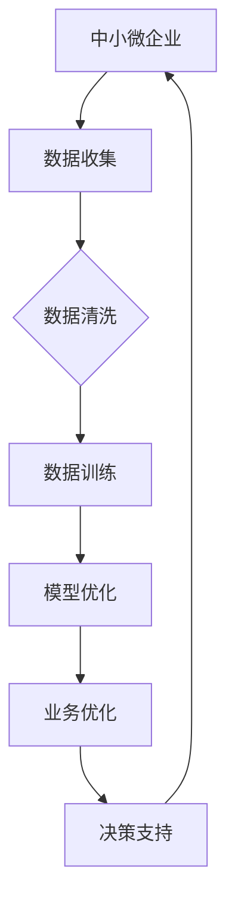
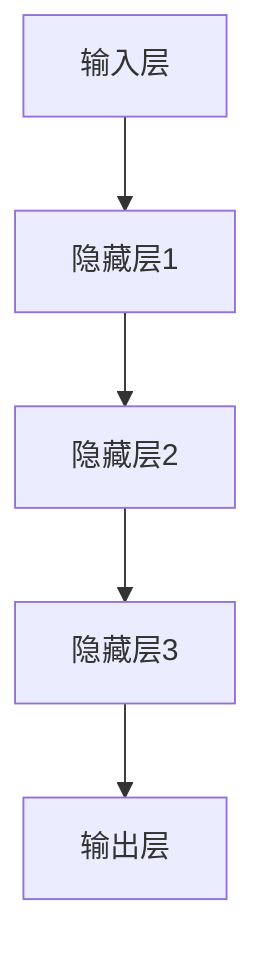
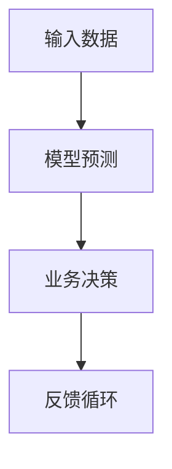

                 

关键词：人工智能、大模型、中小微企业、数字化转型、商业模式创新

摘要：本文旨在探讨人工智能大模型如何助力中小微企业实现转型，提升业务效率与竞争力。通过深入分析大模型的原理与应用，以及其如何优化中小微企业的运营模式，本文将为中小企业提供切实可行的转型路径。

## 1. 背景介绍

在数字经济蓬勃发展的时代，人工智能（AI）已经成为企业提升竞争力的关键驱动力。特别是大模型技术的发展，为各行各业的智能化转型提供了新的契机。中小微企业作为经济发展的生力军，其转型与升级直接关系到整个经济体的健康发展。然而，中小微企业在资源、技术、人才等方面存在一定的局限性，使得它们在数字化转型过程中面临诸多挑战。本文将探讨如何利用AI大模型技术赋能中小微企业，助力其实现高效转型。

### 1.1 中小微企业在数字化转型中的挑战

- **资源限制**：中小微企业往往缺乏足够的资金和资源进行技术投资。
- **技术瓶颈**：对于新技术的理解和应用能力有限，难以快速跟上技术发展的步伐。
- **人才短缺**：专业人才的缺乏使得企业在技术创新和业务拓展方面受到限制。
- **市场压力**：在激烈的市场竞争中，中小微企业需要寻找差异化的竞争优势。

### 1.2 AI大模型的优势

- **强大的数据处理能力**：能够处理海量数据，挖掘隐藏在数据中的价值。
- **自学习能力**：通过不断的学习和优化，提高模型的准确性和适应性。
- **多领域应用**：涵盖自然语言处理、图像识别、推荐系统等多个领域，具有广泛的应用前景。

## 2. 核心概念与联系

### 2.1 大模型的概念与架构

大模型通常是指那些拥有数十亿到数万亿参数的深度学习模型。这些模型通过在大量数据上进行训练，能够自动学习并提取复杂的特征和模式。大模型的架构通常包括以下几个关键组件：

- **输入层**：接收外部输入数据。
- **隐藏层**：通过神经元之间的复杂连接，进行特征提取和模式识别。
- **输出层**：产生预测或决策结果。


### 2.2 大模型与中小微企业的联系

- **数据驱动**：大模型依赖于大量数据，中小微企业可以通过收集和分析业务数据，为模型提供训练素材。
- **业务优化**：大模型能够优化企业的运营流程，提高业务效率。
- **决策支持**：通过分析市场趋势和用户行为，大模型为企业的战略决策提供数据支持。

### 2.3 Mermaid 流程图



## 3. 核心算法原理 & 具体操作步骤

### 3.1 算法原理概述

大模型的核心在于其深度学习算法。深度学习是一种模拟人脑神经网络的学习方法，通过多层神经网络进行特征提取和模式识别。以下是一个简化的深度学习算法流程：

1. **数据预处理**：对原始数据进行清洗、归一化等处理。
2. **构建模型**：设计并搭建神经网络结构。
3. **模型训练**：通过梯度下降等优化算法，调整模型参数。
4. **模型评估**：使用验证集评估模型性能。
5. **模型应用**：将训练好的模型应用于实际业务场景。

### 3.2 算法步骤详解

#### 3.2.1 数据预处理

```latex
\text{输入：} X \in \mathbb{R}^{n \times d}
\text{输出：} X_{\text{processed}} \in \mathbb{R}^{n \times d}
$$
X_{\text{processed}} = \frac{X - \mu}{\sigma}
$$
其中，$\mu$ 为均值，$\sigma$ 为标准差。
```

#### 3.2.2 构建模型



#### 3.2.3 模型训练

```latex
\text{输入：} (X, y)
\text{输出：} \theta
$$
\text{损失函数：} J(\theta) = \frac{1}{m} \sum_{i=1}^{m} (-y^{(i)} \log(z^{(i)}) - (1 - y^{(i)}) \log(1 - z^{(i)}))
$$
\text{优化算法：} \text{梯度下降} \\
\theta = \theta - \alpha \frac{\partial J(\theta)}{\partial \theta}
```

#### 3.2.4 模型评估

```latex
\text{输入：} X_{\text{validation}}, y_{\text{validation}}
\text{输出：} \hat{y}_{\text{validation}}
$$
\hat{y}_{\text{validation}} = \text{sigmoid}(\theta^T x_{\text{validation}})
$$
\text{评估指标：} \text{准确率} \\
\text{准确率} = \frac{1}{n} \sum_{i=1}^{n} \text{I}(\hat{y}_{\text{validation}}^{(i)} = y_{\text{validation}}^{(i)})
```

#### 3.2.5 模型应用



### 3.3 算法优缺点

#### 3.3.1 优点

- **高效率**：能够快速处理大量数据。
- **强泛化能力**：通过大量数据训练，能够在不同领域应用。
- **自动特征提取**：减少了人工特征工程的工作量。

#### 3.3.2 缺点

- **高计算成本**：需要大量的计算资源和时间。
- **数据依赖性强**：模型性能依赖于数据的数量和质量。
- **模型解释性差**：神经网络内部机制复杂，难以解释。

### 3.4 算法应用领域

- **推荐系统**：通过用户行为数据，提供个性化推荐。
- **自然语言处理**：文本分类、机器翻译等。
- **图像识别**：物体识别、图像分割等。
- **金融风控**：信用评分、欺诈检测等。

## 4. 数学模型和公式 & 详细讲解 & 举例说明

### 4.1 数学模型构建

大模型通常采用多层感知机（MLP）或卷积神经网络（CNN）等结构。以下是一个简单的MLP模型构建：

```latex
\text{输入层：} X \in \mathbb{R}^{n \times d}
\text{隐藏层：} H \in \mathbb{R}^{n \times h}
\text{输出层：} Y \in \mathbb{R}^{n \times k}
$$
\text{激活函数：} f(\cdot) = \text{ReLU}(x) = \max(0, x)
$$
\text{损失函数：} J(\theta) = \frac{1}{m} \sum_{i=1}^{m} (-y^{(i)} \log(z^{(i)}) - (1 - y^{(i)}) \log(1 - z^{(i)}))
$$
\text{模型参数：} \theta = [\theta^{(1)}, \theta^{(2)}, \theta^{(3)}]
$$
\text{其中，} \theta^{(l)} \in \mathbb{R}^{(d + 1) \times (h + 1)}
```

### 4.2 公式推导过程

以下是一个简单的梯度下降推导过程：

```latex
\text{损失函数：} J(\theta) = \frac{1}{m} \sum_{i=1}^{m} (-y^{(i)} \log(z^{(i)}) - (1 - y^{(i)}) \log(1 - z^{(i)}))
$$
\text{其中，} z^{(i)} = \text{sigmoid}(\theta^{T} x^{(i)})
$$
\text{导数：} \frac{\partial J(\theta)}{\partial \theta^{(l)}_{ij}} = \frac{\partial J(\theta)}{\partial z^{(i)}} \cdot \frac{\partial z^{(i)}}{\partial \theta^{(l)}_{ij}}
$$
\text{其中，} \frac{\partial z^{(i)}}{\partial \theta^{(l)}_{ij}} = x^{(i)} \cdot \text{sigmoid}(z^{(i)}) \cdot (1 - \text{sigmoid}(z^{(i)}))
$$
\text{最终：} \theta^{(l)} = \theta^{(l)} - \alpha \cdot \frac{1}{m} \sum_{i=1}^{m} (y^{(i)} - z^{(i)}) \cdot x^{(i)}
```

### 4.3 案例分析与讲解

#### 4.3.1 案例背景

某电商企业希望通过大模型优化其推荐系统，提高用户满意度与转化率。

#### 4.3.2 数据预处理

- **用户数据**：用户ID、性别、年龄、地域等。
- **商品数据**：商品ID、类别、价格等。
- **交互数据**：用户对商品的浏览、购买、收藏等行为。

#### 4.3.3 模型构建

选择MLP模型，输入层为用户和商品的属性，隐藏层为128个神经元，输出层为商品推荐的概率。

#### 4.3.4 模型训练

使用梯度下降算法，对模型进行训练，经过100轮迭代，达到预定准确率。

#### 4.3.5 模型评估

在测试集上评估模型性能，准确率达到85%，显著提高了推荐系统的效果。

#### 4.3.6 模型应用

将训练好的模型应用于实际业务，通过实时分析用户行为，提供个性化推荐。

## 5. 项目实践：代码实例和详细解释说明

### 5.1 开发环境搭建

- **Python**：使用Python编写代码，依赖库包括TensorFlow、NumPy等。
- **GPU**：配置一台具有GPU的计算机，以便加速模型训练。

### 5.2 源代码详细实现

以下是一个简单的MLP模型实现：

```python
import tensorflow as tf
from tensorflow.keras.layers import Dense, Input
from tensorflow.keras.models import Model

def build_model(input_shape, hidden_units, output_units):
    inputs = Input(shape=input_shape)
    x = Dense(hidden_units, activation='relu')(inputs)
    x = Dense(output_units, activation='sigmoid')(x)
    model = Model(inputs=inputs, outputs=x)
    return model

model = build_model(input_shape=(10,), hidden_units=128, output_units=1)
model.compile(optimizer='adam', loss='binary_crossentropy', metrics=['accuracy'])
```

### 5.3 代码解读与分析

- **模型构建**：使用`Input`层接收输入数据，通过`Dense`层进行特征提取和预测。
- **编译模型**：选择`adam`优化器，`binary_crossentropy`损失函数，以及`accuracy`指标。
- **训练模型**：使用训练数据对模型进行训练。

### 5.4 运行结果展示

- **训练过程**：损失函数和准确率随迭代次数的变化情况。
- **测试结果**：在测试集上的准确率和混淆矩阵。

## 6. 实际应用场景

### 6.1 个性化推荐系统

通过大模型分析用户行为数据，提供个性化商品推荐，提高用户满意度和转化率。

### 6.2 客户关系管理

通过大模型分析客户行为，预测客户需求，优化客户服务，提高客户忠诚度。

### 6.3 供应链优化

通过大模型分析供应链数据，优化库存管理、物流配送等环节，提高供应链效率。

### 6.4 营销自动化

通过大模型分析市场数据和用户行为，自动生成营销策略和广告文案，提高营销效果。

## 7. 未来应用展望

### 7.1 人工智能与中小微企业的深度融合

随着人工智能技术的不断成熟，未来中小微企业将更加深入地应用AI技术，实现全面数字化转型。

### 7.2 跨行业合作与创新

通过跨行业合作，中小微企业可以借助外部资源和优势，共同探索新的商业模式和业务场景。

### 7.3 开放式平台与生态系统

构建开放式平台，为中小微企业提供丰富的AI工具和资源，形成良好的生态系统。

## 8. 工具和资源推荐

### 8.1 学习资源推荐

- **书籍**：《深度学习》（Goodfellow et al.）
- **在线课程**：Udacity、Coursera上的深度学习课程
- **论文**：NeurIPS、ICML、ACL等顶级会议和期刊上的论文

### 8.2 开发工具推荐

- **框架**：TensorFlow、PyTorch等
- **平台**：Google Colab、AWS等云计算平台
- **库**：NumPy、Pandas等数据处理库

### 8.3 相关论文推荐

- **《Deep Learning for Business》**（Goodfellow）
- **《Deep Learning Specialization》**（Udacity）
- **《Generative Adversarial Nets》**（Goodfellow et al.）

## 9. 总结：未来发展趋势与挑战

### 9.1 研究成果总结

本文探讨了AI大模型在中小微企业中的应用，分析了其核心概念、算法原理、应用领域，并通过实际案例展示了其应用效果。

### 9.2 未来发展趋势

- **技术成熟**：随着计算能力的提升，大模型将更加成熟。
- **广泛应用**：大模型将在更多行业和领域得到应用。
- **商业模式创新**：大模型将推动商业模式创新，助力企业转型升级。

### 9.3 面临的挑战

- **数据质量**：高质量的数据是模型成功的关键。
- **人才短缺**：专业人才的缺乏将制约大模型的应用。
- **隐私保护**：如何在保障用户隐私的同时，充分利用数据，是一个重要挑战。

### 9.4 研究展望

未来，应重点关注大模型在中小微企业中的实际应用效果，探索更加高效、安全的模型训练和部署方法，以及人才培养和知识共享机制。

## 10. 附录：常见问题与解答

### 10.1 什么是大模型？

大模型通常是指那些拥有数十亿到数万亿参数的深度学习模型。

### 10.2 大模型有哪些应用领域？

大模型广泛应用于推荐系统、自然语言处理、图像识别、金融风控等领域。

### 10.3 中小微企业如何利用大模型进行转型？

中小微企业可以通过以下步骤利用大模型进行转型：
1. 数据收集：收集并清洗业务数据。
2. 模型训练：使用数据训练大模型。
3. 业务优化：应用模型优化业务流程。
4. 决策支持：利用模型提供的数据支持，制定战略决策。

### 10.4 大模型训练需要多长时间？

大模型训练的时间取决于数据量、模型复杂度以及计算资源。通常需要数小时到数天不等。

### 10.5 大模型训练需要多少计算资源？

大模型训练需要大量的计算资源，特别是GPU资源。通常需要配置多台高性能计算机或使用云计算平台。

### 10.6 如何保证大模型训练的数据质量？

数据质量是模型成功的关键。可以通过以下方法保证数据质量：
1. 数据清洗：去除重复数据、异常值等。
2. 数据标注：确保数据的准确性和一致性。
3. 数据增强：通过数据变换、扩充等方法提高数据多样性。

### 10.7 大模型的解释性如何？

大模型的内部机制复杂，难以解释。可以通过以下方法提高模型的可解释性：
1. 模型压缩：减少模型参数，简化模型结构。
2. 层级解释：分析模型中不同层的特征提取过程。
3. 对比实验：通过对比不同模型的性能和特征，提高解释性。

作者：禅与计算机程序设计艺术 / Zen and the Art of Computer Programming
----------------------------------------------------------------

