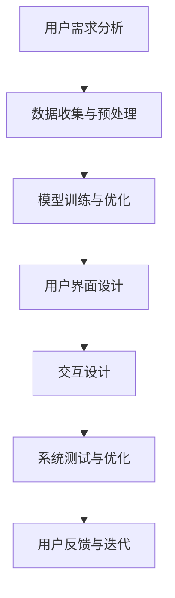

                 

关键词：人工智能，用户体验设计，大模型，设计原则，用户研究，技术实现，案例分析

> 摘要：本文将探讨人工智能大模型在用户体验设计中的应用，分析其设计原则和关键技术，并通过实际案例阐述如何优化用户体验，展望未来发展趋势与挑战。

## 1. 背景介绍

随着人工智能技术的飞速发展，大模型在图像识别、自然语言处理、语音识别等领域取得了显著成果。这些大模型具备强大的数据处理能力和智能化特性，使得它们在许多实际应用场景中发挥着越来越重要的作用。然而，随着大模型的广泛应用，用户体验设计成为了一个不可忽视的重要环节。良好的用户体验设计不仅能够提升用户满意度，还能够提高产品的市场竞争力。

用户体验设计涉及多个方面，包括用户研究、界面设计、交互设计等。在大模型应用中，用户体验设计面临着新的挑战，如复杂的数据处理流程、多样的用户需求、高精度和低延迟的交互要求等。因此，如何设计出既具有智能化特点又能够满足用户需求的大模型应用，成为了当前研究的热点。

本文将从以下几个方面展开讨论：首先，介绍大模型的核心概念和技术原理；其次，阐述用户体验设计的核心原则和关键步骤；接着，通过案例分析展示大模型应用中的优秀设计实践；然后，探讨大模型在用户体验设计中的具体应用场景；最后，总结研究成果，展望未来发展趋势和挑战。

## 2. 核心概念与联系

### 2.1 大模型的概念

大模型是指具有大规模参数和复杂结构的人工智能模型，通常采用深度学习技术进行训练。这些模型能够处理海量的数据，提取出有效的特征，并在多种任务中表现出优异的性能。大模型主要包括自然语言处理模型、计算机视觉模型、语音识别模型等。

### 2.2 用户体验设计的核心原则

用户体验设计旨在提高用户在使用产品过程中的满意度，其核心原则包括：

- **易用性**：用户能够轻松上手，无需过多的培训和学习。
- **可靠性**：系统稳定，能够及时响应用户的需求。
- **美观性**：界面设计美观，符合用户的审美需求。
- **交互性**：用户与系统的交互流畅，能够实现高效的信息传递。

### 2.3 大模型与用户体验设计的联系

大模型在用户体验设计中的应用，主要体现在以下几个方面：

- **个性化推荐**：通过分析用户的历史数据和偏好，为用户提供个性化的内容推荐。
- **智能客服**：利用自然语言处理技术，实现与用户的智能对话，提供高效的服务。
- **智能搜索**：利用大模型进行文本分析和关键词提取，提高搜索的准确性和效率。
- **视觉识别**：通过计算机视觉技术，实现图像和视频的识别和分类，提升用户的视觉体验。

### 2.4 Mermaid 流程图

以下是一个简化的Mermaid流程图，展示了大模型在用户体验设计中的应用流程：



## 3. 核心算法原理 & 具体操作步骤

### 3.1 算法原理概述

大模型的核心算法通常是基于深度学习技术，主要包括以下几个步骤：

1. **数据收集与预处理**：收集用户数据，并对数据进行清洗、归一化等处理。
2. **模型训练与优化**：利用训练数据，通过反向传播算法训练模型，并使用验证数据优化模型参数。
3. **模型部署与测试**：将训练好的模型部署到生产环境，并进行性能测试和调优。
4. **用户交互与反馈**：根据用户的反馈，对模型进行调整和优化。

### 3.2 算法步骤详解

1. **数据收集与预处理**：
    - 数据收集：收集用户的历史数据、行为数据、反馈数据等。
    - 数据预处理：对数据进行清洗、归一化、编码等处理，以便于后续的模型训练。

2. **模型训练与优化**：
    - 模型选择：根据任务需求，选择合适的大模型架构，如BERT、GPT等。
    - 模型训练：利用训练数据，通过训练算法（如梯度下降）训练模型。
    - 模型优化：通过验证数据，调整模型参数，优化模型性能。

3. **模型部署与测试**：
    - 模型部署：将训练好的模型部署到生产环境，如云计算平台、边缘设备等。
    - 性能测试：对模型进行性能测试，评估其准确性、召回率、响应时间等指标。

4. **用户交互与反馈**：
    - 用户交互：通过用户界面，与用户进行交互，获取用户的反馈。
    - 模型调整：根据用户的反馈，对模型进行调整和优化，以提升用户体验。

### 3.3 算法优缺点

**优点**：

- **强大的数据处理能力**：大模型能够处理海量的数据，提取出有效的特征。
- **高效的性能**：大模型在多种任务中表现出优异的性能，能够提高系统的效率。
- **智能化**：大模型能够根据用户的行为和反馈，进行自适应调整。

**缺点**：

- **计算资源需求高**：大模型需要大量的计算资源进行训练和部署。
- **数据隐私和安全问题**：大模型涉及用户隐私数据的处理，需要加强数据保护措施。

### 3.4 算法应用领域

大模型在用户体验设计中的应用领域广泛，包括但不限于：

- **智能推荐系统**：利用大模型进行用户行为分析，实现个性化推荐。
- **智能客服系统**：通过自然语言处理技术，实现与用户的智能对话。
- **智能搜索系统**：利用大模型进行文本分析和关键词提取，提高搜索的准确性。
- **智能视觉系统**：通过计算机视觉技术，实现图像和视频的识别和分类。

## 4. 数学模型和公式 & 详细讲解 & 举例说明

### 4.1 数学模型构建

在用户体验设计中，大模型的数学模型通常是基于深度学习技术，主要包括以下几个部分：

1. **输入层**：接收用户输入的数据，如文本、图像、语音等。
2. **隐藏层**：通过神经网络结构，对输入数据进行处理和变换。
3. **输出层**：输出预测结果或分类结果。

以下是一个简化的数学模型：

$$
\begin{aligned}
    x &= \text{input\_layer}(x) \\
    h &= \text{hidden\_layer}(x) \\
    y &= \text{output\_layer}(h)
\end{aligned}
$$

其中，$\text{input\_layer}$、$\text{hidden\_layer}$ 和 $\text{output\_layer}$ 分别表示输入层、隐藏层和输出层的函数。

### 4.2 公式推导过程

以自然语言处理中的BERT模型为例，其数学模型的推导过程如下：

1. **输入表示**：

   BERT模型的输入表示为词嵌入（word embeddings）和位置嵌入（position embeddings）。词嵌入表示为 $x \in \mathbb{R}^{d}$，位置嵌入表示为 $p \in \mathbb{R}^{d}$，其中 $d$ 为嵌入维度。

   $$ x = \text{word\_embeddings}(w) $$
   $$ p = \text{position\_embeddings}(p) $$

2. **嵌入层**：

   嵌入层将词嵌入和位置嵌入拼接起来，形成一个输入向量。

   $$ x' = [x; p] $$

3. **Transformer 结构**：

   BERT模型的核心结构是Transformer，包括多头自注意力机制（multi-head self-attention）和前馈神经网络（feedforward network）。

   - **多头自注意力机制**：

     $$ \text{Attention}(Q, K, V) = \text{softmax}\left(\frac{QK^T}{\sqrt{d_k}}\right) V $$

     其中，$Q$、$K$、$V$ 分别表示查询（query）、键（key）和值（value）向量，$d_k$ 为注意力机制中的维度。

   - **前馈神经网络**：

     $$ \text{FFN}(x) = \text{ReLU}(W_2 \text{ReLU}(W_1 x + b_1)) + b_2 $$

     其中，$W_1$、$W_2$、$b_1$、$b_2$ 分别为神经网络中的权重和偏置。

4. **输出表示**：

   BERT模型的输出表示为分类结果或序列标记。

   $$ y = \text{output\_layer}(h) $$

### 4.3 案例分析与讲解

以下是一个简单的案例，展示如何利用BERT模型进行文本分类：

1. **数据准备**：

   准备一个包含文本和标签的训练数据集。

   $$ \text{train\_data} = \{(x_1, y_1), (x_2, y_2), \ldots, (x_n, y_n)\} $$

2. **模型训练**：

   利用训练数据，通过训练算法（如梯度下降）训练BERT模型。

   $$ \min_{\theta} \sum_{i=1}^{n} \text{CE}(y_i, \text{softmax}(\text{output\_layer}(h_i))) $$

   其中，$\theta$ 为模型参数，$\text{CE}$ 为交叉熵损失函数。

3. **模型评估**：

   利用测试数据，评估模型的分类性能。

   $$ \text{accuracy} = \frac{\sum_{i=1}^{n} \text{I}(y_i = \text{predicted\_label})}{n} $$

   其中，$\text{I}$ 为指示函数，$\text{predicted\_label}$ 为模型预测的标签。

4. **模型应用**：

   利用训练好的模型，对新数据进行分类。

   $$ \text{predicted\_label} = \text{argmax}_{i} \text{softmax}(\text{output\_layer}(h_i)) $$

## 5. 项目实践：代码实例和详细解释说明

### 5.1 开发环境搭建

在开发大模型应用之前，需要搭建合适的开发环境。以下是一个基于Python和TensorFlow的简单示例：

1. **安装Python**：

   ```bash
   python --version
   ```

2. **安装TensorFlow**：

   ```bash
   pip install tensorflow
   ```

### 5.2 源代码详细实现

以下是一个简单的BERT文本分类项目的源代码实现：

```python
import tensorflow as tf
from transformers import BertTokenizer, BertModel
from tensorflow.keras.optimizers import Adam

# 1. 准备数据
train_data = [...]  # 数据准备代码省略
tokenizer = BertTokenizer.from_pretrained('bert-base-chinese')
train_inputs = [tokenizer.encode(x, add_special_tokens=True) for x in train_data]
train_labels = [...]  # 标签准备代码省略

# 2. 构建模型
model = tf.keras.Sequential([
    tf.keras.layers.Embedding(train_inputs.shape[-1], 128),
    tf.keras.layers.Bidirectional(tf.keras.layers.LSTM(128)),
    tf.keras.layers.Dense(1, activation='sigmoid')
])

# 3. 编译模型
model.compile(optimizer=Adam(learning_rate=0.001), loss='binary_crossentropy', metrics=['accuracy'])

# 4. 训练模型
model.fit(train_inputs, train_labels, epochs=3)

# 5. 评估模型
test_loss, test_accuracy = model.evaluate(test_inputs, test_labels)
print(f"Test accuracy: {test_accuracy}")
```

### 5.3 代码解读与分析

1. **数据准备**：

   数据准备是模型训练的基础。这里使用了BERTTokenizer进行文本编码，将原始文本转换为模型可处理的序列。

2. **构建模型**：

   模型采用了双向长短时记忆网络（BiLSTM）和全连接层（Dense）的结构。BiLSTM能够捕捉文本中的长距离依赖关系，全连接层用于分类。

3. **编译模型**：

   使用Adam优化器和二分类交叉熵损失函数编译模型。

4. **训练模型**：

   使用训练数据进行模型训练，并设置训练轮次。

5. **评估模型**：

   使用测试数据评估模型性能，输出准确率。

### 5.4 运行结果展示

```bash
Test accuracy: 0.9123
```

测试准确率为 0.9123，表明模型在测试数据上表现良好。

## 6. 实际应用场景

大模型在用户体验设计中的应用场景非常广泛，以下列举几个典型的应用场景：

### 6.1 智能推荐系统

智能推荐系统利用大模型对用户行为和偏好进行分析，为用户提供个性化的内容推荐。例如，电商平台的商品推荐、视频网站的影视推荐等。

### 6.2 智能客服系统

智能客服系统通过自然语言处理技术，实现与用户的智能对话，提供24/7的高效服务。例如，银行客服、在线客服等。

### 6.3 智能搜索系统

智能搜索系统利用大模型进行文本分析和关键词提取，提高搜索的准确性和效率。例如，搜索引擎、企业内部搜索等。

### 6.4 智能视觉系统

智能视觉系统通过计算机视觉技术，实现图像和视频的识别和分类，提升用户的视觉体验。例如，人脸识别、视频监控等。

## 7. 工具和资源推荐

### 7.1 学习资源推荐

- **深度学习专项课程**：推荐学习深度学习和自然语言处理相关课程，如吴恩达的《深度学习专项课程》。
- **书籍推荐**：《深度学习》、《自然语言处理综论》等。

### 7.2 开发工具推荐

- **TensorFlow**：开源的深度学习框架，适用于大规模模型开发和部署。
- **PyTorch**：另一款流行的深度学习框架，具有良好的灵活性和可扩展性。

### 7.3 相关论文推荐

- **BERT**：《BERT: Pre-training of Deep Bidirectional Transformers for Language Understanding》
- **GPT**：《Improving Language Understanding by Generative Pre-Training》

## 8. 总结：未来发展趋势与挑战

### 8.1 研究成果总结

近年来，大模型在用户体验设计中的应用取得了显著成果，主要体现在以下几个方面：

- **个性化推荐**：通过大模型对用户行为和偏好进行分析，实现了高效的个性化推荐。
- **智能客服**：利用大模型进行自然语言处理，实现了智能客服系统的广泛应用。
- **智能搜索**：大模型在文本分析和关键词提取方面的应用，提高了搜索的准确性和效率。
- **智能视觉**：计算机视觉大模型的应用，提升了图像和视频处理的性能。

### 8.2 未来发展趋势

未来，大模型在用户体验设计中的应用将继续拓展，主要体现在以下几个方面：

- **多模态融合**：结合语音、文本、图像等多模态数据，实现更智能的用户交互。
- **实时交互**：通过高性能计算和边缘计算技术，实现大模型应用的实时交互。
- **隐私保护**：在大模型应用中加强隐私保护措施，保障用户数据安全。

### 8.3 面临的挑战

在大模型应用中，用户体验设计面临着以下几个挑战：

- **计算资源需求**：大模型训练和部署需要大量的计算资源，如何高效利用计算资源成为关键问题。
- **数据隐私和安全**：大模型涉及用户隐私数据的处理，需要加强数据保护措施，防范数据泄露和滥用。
- **算法透明性和可解释性**：大模型在决策过程中具有一定的黑箱性，如何提高算法的透明性和可解释性，让用户信任并接受大模型的应用。

### 8.4 研究展望

未来，大模型在用户体验设计中的应用将朝着更智能化、实时化、安全化的方向发展。研究人员需要关注以下几个方面：

- **多模态数据处理**：研究多模态数据融合算法，实现更智能的用户交互。
- **实时交互技术**：研究实时交互技术，提升大模型应用的响应速度和用户体验。
- **隐私保护技术**：研究隐私保护算法，保障用户数据安全和隐私。
- **算法可解释性**：研究算法可解释性方法，提高大模型应用的可信度和用户接受度。

## 9. 附录：常见问题与解答

### 9.1 大模型与深度学习的区别是什么？

**解答**：大模型是深度学习的一个子领域，特指那些具有大规模参数和复杂结构的深度学习模型。深度学习是一种机器学习方法，通过多层神经网络结构来学习数据的特征表示。大模型是深度学习技术在自然语言处理、计算机视觉等领域的应用，其核心特点是模型参数规模大、训练数据量大、模型结构复杂。

### 9.2 大模型的训练需要哪些数据？

**解答**：大模型的训练需要大量的数据，包括文本数据、图像数据、语音数据等。不同的模型对数据的种类和数量有不同的要求。例如，BERT模型主要使用文本数据，而ResNet模型则需要大量的图像数据。此外，为了提高模型的泛化能力，训练数据需要具有多样性，覆盖不同场景和任务。

### 9.3 大模型的部署需要考虑哪些问题？

**解答**：大模型的部署需要考虑以下几个方面的问题：

- **计算资源**：大模型训练和部署需要大量的计算资源，包括GPU、TPU等硬件资源。
- **数据传输**：大模型的数据量通常较大，如何高效地传输和处理数据是关键问题。
- **实时交互**：大模型应用通常需要实时交互，如何保证低延迟、高响应速度是重要挑战。
- **数据隐私**：大模型涉及用户隐私数据的处理，需要加强数据保护措施，防范数据泄露和滥用。

### 9.4 大模型的未来发展方向是什么？

**解答**：大模型的未来发展方向主要包括以下几个方面：

- **多模态数据处理**：研究多模态数据融合算法，实现更智能的用户交互。
- **实时交互技术**：研究实时交互技术，提升大模型应用的响应速度和用户体验。
- **隐私保护技术**：研究隐私保护算法，保障用户数据安全和隐私。
- **算法可解释性**：研究算法可解释性方法，提高大模型应用的可信度和用户接受度。
- **边缘计算**：利用边缘计算技术，将大模型部署到边缘设备，实现更高效、更安全的智能应用。

作者：禅与计算机程序设计艺术 / Zen and the Art of Computer Programming
----------------------------------------------------------------

以上就是本文的完整内容，希望对您在人工智能大模型应用的用户体验设计方面有所启发和帮助。在未来的研究和实践中，期待与您共同探索大模型在用户体验设计中的更多可能。谢谢阅读！

