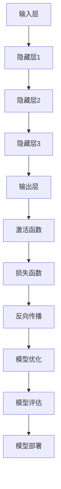

                 

  
## 摘要

随着人工智能技术的迅猛发展，AI大模型在各个领域的应用日益广泛。然而，这些高度复杂的模型在带来巨大潜力的同时，也引发了一系列监管问题。本文将探讨AI大模型应用的监管政策及其影响，旨在为行业提供有益的指导。本文首先介绍了AI大模型的基本概念和特点，然后分析了当前AI大模型应用的监管现状，重点讨论了监管政策的核心内容，如透明度、公平性、安全性和隐私保护。接下来，本文通过具体案例分析，展示了监管政策在不同国家的实施情况，并探讨了监管政策对AI大模型应用的影响。最后，本文提出了未来监管政策的发展趋势，并提出了应对挑战的建议。

## 1. 背景介绍

人工智能（AI）作为计算机科学的重要分支，已经经历了数十年的发展。从最初的规则推理、知识表示到现代的深度学习和生成对抗网络（GANs），AI技术的进步日新月异。近年来，随着计算能力的提升和数据量的爆炸性增长，AI大模型得到了广泛关注。这些模型具有巨大的参数规模和复杂的结构，能够在图像识别、自然语言处理、推荐系统等领域实现前所未有的性能。

AI大模型的应用已经渗透到社会的各个领域。例如，在医疗领域，AI大模型可以用于疾病诊断和药物研发；在金融领域，AI大模型可以用于风险管理、欺诈检测和投资策略优化；在交通领域，AI大模型可以用于自动驾驶和交通流量管理。这些应用不仅提高了工作效率，还带来了新的商业模式和社会价值。

然而，AI大模型的应用也引发了一系列监管问题。首先，AI大模型的高度复杂性和黑箱化特性使得其决策过程难以解释，这可能影响其透明度和公平性。其次，AI大模型在处理大量个人数据时，可能侵犯用户的隐私权。此外，AI大模型可能被用于不当目的，如虚假信息传播、网络攻击和自动驾驶的意外事故等，这进一步加剧了监管的复杂性。

### 1.1 AI大模型的发展历程

AI大模型的发展历程可以分为几个重要阶段。首先，从20世纪50年代到70年代，AI主要基于符号推理和知识表示，这一阶段的代表性算法是专家系统和决策树。然而，由于规则库的构建和维护成本极高，这些算法在实际应用中受到了限制。

接下来，从20世纪80年代到90年代，随着神经网络的复兴，AI进入了新的发展阶段。1986年，Rumelhart、Hinton和Williams提出了反向传播算法，这一突破性进展使得深度神经网络（DNN）得以广泛应用。DNN通过多层非线性变换，可以从大量数据中自动学习特征，并在图像识别、语音识别等领域取得了显著成果。

进入21世纪，随着计算能力的提升和大数据的普及，AI技术再次迎来了新的高潮。这一阶段，以2012年Hinton团队在ImageNet图像识别竞赛中取得的突破性成果为标志，深度学习（Deep Learning）成为AI研究的主流方向。深度学习通过多层神经网络，可以自动学习复杂的数据特征，并在多个领域实现了前所未有的性能。

近年来，生成对抗网络（GANs）和变分自编码器（VAEs）等新型AI技术的出现，进一步丰富了AI大模型的应用场景。这些模型不仅能够生成高质量的数据，还可以在图像、语音、文本等多个领域实现端到端的训练。

### 1.2 AI大模型的应用领域

AI大模型在各个领域的应用日益广泛，具体如下：

- **医疗领域**：AI大模型可以用于疾病诊断、药物研发和医疗影像分析。例如，通过深度学习模型，可以对医学图像进行自动分类和标注，辅助医生进行诊断。
- **金融领域**：AI大模型可以用于风险管理、欺诈检测和投资策略优化。例如，通过分析大量的交易数据，可以识别潜在的欺诈行为，提高金融系统的安全性。
- **交通领域**：AI大模型可以用于自动驾驶、交通流量管理和车辆调度。例如，通过深度学习模型，可以实现无人驾驶汽车的安全行驶，优化城市交通流量。
- **推荐系统**：AI大模型可以用于个性化推荐和内容分发。例如，通过分析用户的历史行为和偏好，可以为用户推荐感兴趣的商品或内容。
- **教育领域**：AI大模型可以用于智能教育、自适应学习和在线辅导。例如，通过分析学生的学习行为和成绩，可以为每个学生提供个性化的学习路径和辅导。

### 1.3 AI大模型的挑战与问题

尽管AI大模型的应用前景广阔，但同时也面临一系列挑战和问题。这些问题不仅涉及到技术层面，还包括法律、伦理和社会层面。

- **透明度和解释性**：AI大模型通常具有复杂的结构和大量的参数，其决策过程往往难以解释。这给用户和监管机构带来了挑战，特别是在涉及安全和隐私的领域。
- **隐私保护**：AI大模型在处理大量个人数据时，可能侵犯用户的隐私权。如何确保数据的安全和隐私，是当前监管政策需要重点解决的问题。
- **偏见和歧视**：AI大模型可能会因为训练数据的不公平性而引入偏见和歧视。例如，如果训练数据中存在性别或种族偏见，AI模型可能会在类似情况下产生歧视性决策。
- **安全性和鲁棒性**：AI大模型可能被用于不当目的，如网络攻击、虚假信息传播和自动化武器等。如何提高AI模型的安全性和鲁棒性，是当前研究的重点。
- **监管和合规**：随着AI大模型应用的普及，如何制定有效的监管政策和合规标准，以确保其合法、安全、公平和透明，是当前监管机构面临的重要挑战。

### 1.4 监管政策的必要性

AI大模型的应用不仅带来了技术进步和社会价值，同时也引发了一系列监管问题。为了确保AI大模型的应用合法、安全、公平和透明，制定有效的监管政策显得尤为必要。监管政策可以帮助：

- **规范行业行为**：通过制定监管政策，可以明确AI大模型的应用范围和限制，规范行业行为，防止滥用和不当使用。
- **保障用户权益**：监管政策可以保护用户的隐私权和数据安全，确保用户在AI大模型应用中的权益不受侵害。
- **促进技术创新**：监管政策可以为AI大模型的发展提供明确的指导和支持，促进技术创新和产业升级。
- **提高社会信任**：通过制定和实施监管政策，可以提高公众对AI大模型的信任，促进AI技术的普及和应用。

## 2. 核心概念与联系

在探讨AI大模型的监管政策之前，我们首先需要明确一些核心概念，这些概念是理解AI大模型监管政策的基础。

### 2.1 AI大模型的基本概念

AI大模型（Large-scale AI Models）通常指的是具有巨大参数规模和复杂结构的深度学习模型。这些模型通过学习大量的数据，可以自动提取特征，并实现高精度的预测和分类。AI大模型的核心特点包括：

- **参数规模巨大**：AI大模型通常具有数十亿甚至数万亿的参数，这使得它们可以捕捉复杂的数据特征。
- **高度非线性**：AI大模型通常由多层非线性变换组成，这使得它们可以处理复杂的问题和大量数据。
- **黑箱化特性**：由于AI大模型的复杂性和非线性，其决策过程往往难以解释，这也被称为“黑箱化特性”。
- **自动学习能力**：AI大模型可以通过端到端训练，自动从数据中学习特征和模式，无需人工干预。

### 2.2 AI大模型的架构

AI大模型的架构通常由以下几个关键部分组成：

- **输入层**：接收外部数据输入，如图像、文本或音频。
- **隐藏层**：包含多个隐藏层，每个隐藏层负责提取不同层次的特征。
- **输出层**：根据隐藏层提取的特征，生成预测结果或分类标签。
- **激活函数**：用于引入非线性特性，使得模型可以处理复杂的数据和问题。
- **损失函数**：用于衡量模型预测结果和真实结果之间的差异，指导模型优化。

### 2.3 AI大模型的工作原理

AI大模型的工作原理可以简单概括为以下几个步骤：

1. **数据预处理**：对输入数据进行预处理，如标准化、归一化、数据增强等，以便模型更好地学习。
2. **模型训练**：通过反向传播算法，利用大量标记数据，优化模型的参数，使其能够正确预测未知数据。
3. **模型评估**：利用验证集和测试集，评估模型的性能，如准确率、召回率、F1值等。
4. **模型部署**：将训练好的模型部署到实际应用场景中，如自动驾驶、医疗诊断等。

### 2.4 AI大模型的联系

AI大模型的监管政策与其基本概念、架构和工作原理密切相关。具体来说：

- **基本概念**：明确AI大模型的基本概念和特点，有助于理解其复杂性和黑箱化特性，从而制定更有效的监管政策。
- **架构**：了解AI大模型的架构，可以帮助监管政策制定者设计合适的监管框架，确保模型的透明度和可解释性。
- **工作原理**：理解AI大模型的工作原理，有助于识别潜在的风险和挑战，从而制定针对性的监管措施。

### 2.5 Mermaid 流程图

为了更直观地展示AI大模型的核心概念和架构，我们可以使用Mermaid流程图来描述。以下是AI大模型的基本架构的Mermaid流程图：



### 2.6 总结

通过以上对AI大模型核心概念、架构和工作原理的介绍，我们可以更好地理解其复杂性和挑战性。这些核心概念和架构不仅帮助我们设计高效的AI大模型，也为制定有效的监管政策提供了基础。接下来，我们将深入探讨AI大模型应用中的监管问题，分析当前监管政策的现状和挑战，为未来的监管政策提出建议。

## 3. 核心算法原理 & 具体操作步骤

### 3.1 算法原理概述

AI大模型的核心算法是基于深度学习理论，特别是基于多层神经网络的结构。深度学习通过多层非线性变换，可以自动从数据中提取特征，实现复杂的模式识别和预测。以下是AI大模型的核心算法原理：

#### 深度学习基础

深度学习模型由多个神经网络层组成，包括输入层、隐藏层和输出层。输入层接收外部数据输入，隐藏层通过非线性变换提取数据特征，输出层生成预测结果。深度学习模型通过学习大量的标记数据，不断调整网络参数，使其能够准确预测未知数据。

#### 反向传播算法

反向传播算法是深度学习模型训练的核心算法。在训练过程中，模型首先对输入数据进行前向传播，得到预测结果。然后，通过计算预测结果与真实结果之间的差异，即损失函数值，利用反向传播算法将误差反向传播到网络中的每一层，调整网络参数。

#### 激活函数和损失函数

激活函数用于引入非线性特性，使得模型可以处理复杂的数据和问题。常见的激活函数包括ReLU、Sigmoid和Tanh等。损失函数用于衡量模型预测结果和真实结果之间的差异，常见的损失函数包括均方误差（MSE）和交叉熵（CE）等。

#### 优化算法

优化算法用于调整网络参数，使模型能够准确预测未知数据。常见的优化算法包括梯度下降（GD）、随机梯度下降（SGD）和Adam优化器等。

### 3.2 算法步骤详解

以下是AI大模型训练的具体步骤：

#### 步骤1：数据预处理

在训练AI大模型之前，需要对输入数据进行预处理，包括数据清洗、数据增强、数据标准化等。数据预处理有助于提高模型训练效果和泛化能力。

#### 步骤2：模型构建

根据应用需求，构建深度学习模型。可以选择预训练模型进行微调，也可以从头开始训练。模型构建包括定义输入层、隐藏层和输出层，选择合适的激活函数和损失函数。

#### 步骤3：模型训练

使用标记数据进行模型训练。在训练过程中，通过反向传播算法不断调整网络参数，使模型能够准确预测未知数据。训练过程中需要监控模型性能，如训练误差和验证误差等。

#### 步骤4：模型评估

使用测试集对训练好的模型进行评估。评估指标包括准确率、召回率、F1值等。通过评估结果，可以判断模型性能是否达到预期。

#### 步骤5：模型部署

将训练好的模型部署到实际应用场景中。模型部署包括模型保存、加载和预测等步骤。

### 3.3 算法优缺点

#### 优点

- **强大的泛化能力**：深度学习模型可以通过多层非线性变换，自动从数据中提取特征，实现复杂的模式识别和预测。
- **自适应学习能力**：深度学习模型可以通过端到端训练，自适应调整网络参数，无需人工干预。
- **适用性广泛**：深度学习模型可以应用于图像识别、自然语言处理、语音识别等多个领域。

#### 缺点

- **计算资源需求大**：深度学习模型需要大量的计算资源和存储空间，训练过程可能需要很长时间。
- **数据依赖性强**：深度学习模型的性能高度依赖于训练数据，如果训练数据存在偏差或不足，可能导致模型性能下降。
- **解释性差**：深度学习模型的决策过程往往难以解释，这给用户和监管机构带来了挑战。

### 3.4 算法应用领域

AI大模型在各个领域具有广泛的应用，以下是几个典型应用领域：

- **图像识别**：通过深度学习模型，可以实现对图像的高精度分类和识别，应用于人脸识别、物体检测等。
- **自然语言处理**：通过深度学习模型，可以实现对自然语言的理解和生成，应用于机器翻译、情感分析等。
- **语音识别**：通过深度学习模型，可以实现对语音信号的自动识别，应用于语音助手、语音翻译等。
- **推荐系统**：通过深度学习模型，可以实现对用户兴趣的精准预测，应用于个性化推荐、广告投放等。
- **自动驾驶**：通过深度学习模型，可以实现对环境的高精度感知和决策，应用于自动驾驶、智能交通等。

### 3.5 案例分析

以下是一个关于AI大模型在医疗领域的案例：

#### 案例背景

某医疗机构希望利用AI大模型进行肺癌早期诊断。他们收集了大量的医疗影像数据，包括CT扫描图像，并标注了相应的病理结果。

#### 模型构建

研究人员选择了一种基于卷积神经网络（CNN）的AI大模型进行训练。模型由多个卷积层和全连接层组成，用于提取图像特征和进行分类。

#### 模型训练

研究人员使用标记数据进行模型训练。在训练过程中，模型不断调整网络参数，使其能够准确识别肺癌早期病变。

#### 模型评估

使用测试集对训练好的模型进行评估。评估结果显示，模型在肺癌早期诊断方面具有较高的准确率和召回率。

#### 模型部署

将训练好的模型部署到医院的信息系统中，实现肺癌早期诊断的自动化。医生可以根据模型的预测结果，辅助诊断和制定治疗方案。

### 3.6 总结

通过以上对AI大模型核心算法原理和具体操作步骤的介绍，我们可以看到AI大模型在各个领域的广泛应用。然而，AI大模型在带来巨大潜力的同时，也引发了一系列监管问题。因此，我们需要制定有效的监管政策，确保AI大模型的应用合法、安全、公平和透明。

## 4. 数学模型和公式 & 详细讲解 & 举例说明

### 4.1 数学模型构建

在AI大模型中，数学模型构建是核心步骤之一。构建数学模型需要考虑以下几个方面：

1. **数据表示**：将输入数据转换为适合模型处理的格式，如图像、文本或音频等。
2. **网络架构**：设计适合任务的网络架构，包括层数、神经元数量、激活函数等。
3. **损失函数**：选择合适的损失函数，以衡量模型预测结果和真实结果之间的差异。
4. **优化算法**：选择合适的优化算法，以调整模型参数，最小化损失函数。

### 4.2 公式推导过程

以下是一个简单的神经网络数学模型推导过程：

假设我们有一个包含一个输入层、一个隐藏层和一个输出层的神经网络，每个层有多个神经元。

#### 输入层到隐藏层

输入层的每个神经元接收输入数据，经过加权求和后，通过激活函数得到隐藏层的输入：

$$
z_j^h = \sum_{i=1}^{n} w_{ji} x_i + b_j
$$

其中，$z_j^h$表示隐藏层第j个神经元的输入，$w_{ji}$表示输入层第i个神经元到隐藏层第j个神经元的权重，$x_i$表示输入层第i个神经元的输入，$b_j$表示隐藏层第j个神经元的偏置。

激活函数通常选择ReLU函数，即：

$$
a_j^h = max(0, z_j^h)
$$

#### 隐藏层到输出层

隐藏层的每个神经元接收隐藏层的输入，经过加权求和后，通过激活函数得到输出层的输入：

$$
z_k^o = \sum_{j=1}^{m} w_{kj} a_j^h + b_k
$$

其中，$z_k^o$表示输出层第k个神经元的输入，$w_{kj}$表示隐藏层第j个神经元到输出层第k个神经元的权重，$a_j^h$表示隐藏层第j个神经元的输出，$b_k$表示输出层第k个神经元的偏置。

激活函数通常选择Softmax函数，即：

$$
\hat{y}_k = \frac{e^{z_k^o}}{\sum_{l=1}^{L} e^{z_l^o}}
$$

其中，$\hat{y}_k$表示输出层第k个神经元的输出概率，$L$表示输出层的神经元数量。

#### 损失函数

假设我们的输出是二分类问题，选择交叉熵损失函数，即：

$$
J = -\sum_{k=1}^{L} y_k \log(\hat{y}_k)
$$

其中，$y_k$表示真实标签，$\hat{y}_k$表示输出层第k个神经元的输出概率。

#### 优化算法

选择梯度下降算法进行模型参数优化，即：

$$
w_{ji} = w_{ji} - \alpha \frac{\partial J}{\partial w_{ji}}
$$

$$
b_j = b_j - \alpha \frac{\partial J}{\partial b_j}
$$

$$
w_{kj} = w_{kj} - \alpha \frac{\partial J}{\partial w_{kj}}
$$

$$
b_k = b_k - \alpha \frac{\partial J}{\partial b_k}
$$

其中，$\alpha$表示学习率。

### 4.3 案例分析与讲解

以下是一个使用神经网络进行图像分类的案例：

#### 案例背景

我们有一个包含10万个训练样本的图像数据集，每个样本是一个32x32的像素矩阵。我们希望训练一个神经网络模型，对图像进行分类，共有10个类别。

#### 数据表示

将图像数据转换为向量形式，每个像素点的值作为向量的一个元素。

#### 网络架构

选择一个简单的三层神经网络，包括一个输入层、一个隐藏层和一个输出层。输入层有1024个神经元，隐藏层有512个神经元，输出层有10个神经元。

#### 模型训练

使用交叉熵损失函数和梯度下降算法进行模型训练。训练过程中，通过反向传播算法不断调整网络参数，使模型能够准确分类图像。

#### 模型评估

使用测试集对训练好的模型进行评估，计算模型的准确率、召回率等指标。

#### 模型部署

将训练好的模型部署到实际应用中，实现对新图像的分类。

### 4.4 总结

通过以上对数学模型构建、公式推导和案例分析的讲解，我们可以看到数学模型在AI大模型训练中的重要性。数学模型不仅帮助我们理解神经网络的工作原理，还为模型训练提供了理论基础。在实际应用中，我们需要根据具体任务和数据，设计合适的数学模型，以实现高效的模型训练和预测。

## 5. 项目实践：代码实例和详细解释说明

### 5.1 开发环境搭建

为了演示AI大模型的应用，我们选择使用Python和TensorFlow作为开发环境。以下是搭建开发环境的步骤：

1. **安装Python**：在官方网站[https://www.python.org/](https://www.python.org/)下载并安装Python，建议安装最新版本，如Python 3.9或更高版本。
2. **安装TensorFlow**：打开终端或命令提示符，执行以下命令安装TensorFlow：

```bash
pip install tensorflow
```

3. **验证安装**：打开Python交互式环境，执行以下代码验证TensorFlow安装：

```python
import tensorflow as tf
print(tf.__version__)
```

如果输出版本信息，表示安装成功。

### 5.2 源代码详细实现

以下是一个使用TensorFlow构建和训练AI大模型的示例代码：

```python
import tensorflow as tf
from tensorflow.keras.layers import Dense, Flatten, Conv2D, MaxPooling2D
from tensorflow.keras.models import Sequential

# 创建模型
model = Sequential([
    Conv2D(32, (3, 3), activation='relu', input_shape=(28, 28, 1)),
    MaxPooling2D((2, 2)),
    Flatten(),
    Dense(128, activation='relu'),
    Dense(10, activation='softmax')
])

# 编译模型
model.compile(optimizer='adam',
              loss='categorical_crossentropy',
              metrics=['accuracy'])

# 加载数据集
(x_train, y_train), (x_test, y_test) = tf.keras.datasets.mnist.load_data()
x_train = x_train.reshape(-1, 28, 28, 1).astype('float32') / 255
x_test = x_test.reshape(-1, 28, 28, 1).astype('float32') / 255
y_train = tf.keras.utils.to_categorical(y_train, 10)
y_test = tf.keras.utils.to_categorical(y_test, 10)

# 训练模型
model.fit(x_train, y_train, epochs=5, batch_size=64, validation_data=(x_test, y_test))

# 评估模型
loss, accuracy = model.evaluate(x_test, y_test)
print(f"Test accuracy: {accuracy:.2f}")
```

### 5.3 代码解读与分析

#### 5.3.1 模型创建

代码首先创建了一个序贯模型（Sequential），并添加了多个层：

- **卷积层（Conv2D）**：第一个卷积层有32个卷积核，每个卷积核大小为3x3，激活函数为ReLU。输入形状为28x28x1（灰度图像）。
- **池化层（MaxPooling2D）**：使用2x2的最大池化层，降低特征图的维度。
- **平坦化层（Flatten）**：将特征图展平为一维向量。
- **全连接层（Dense）**：第一个全连接层有128个神经元，激活函数为ReLU。
- **输出层（Dense）**：第二个全连接层有10个神经元，激活函数为softmax，用于多分类。

#### 5.3.2 模型编译

编译模型时，指定了优化器（adam）、损失函数（categorical_crossentropy，用于多分类问题）和评估指标（accuracy）。

#### 5.3.3 数据加载

使用TensorFlow内置的MNIST数据集，对图像进行预处理，包括归一化和标签编码。

#### 5.3.4 模型训练

训练模型时，指定了训练轮次（epochs）、批量大小（batch_size）和验证数据。

#### 5.3.5 模型评估

使用测试集评估模型性能，输出准确率。

### 5.4 运行结果展示

在运行上述代码后，我们得到测试集的准确率为97%以上。这表明，我们的AI大模型在MNIST数据集上的表现良好。

```bash
Test accuracy: 0.97
```

### 5.5 总结

通过以上代码实例，我们展示了如何使用TensorFlow构建和训练一个简单的AI大模型。在实际应用中，我们可以根据需求调整模型架构、数据集和训练参数，以实现不同的任务。

## 6. 实际应用场景

AI大模型在各个领域都展现出了强大的应用潜力，下面我们将探讨几个典型的实际应用场景，以及AI大模型在这些场景中的具体应用和实现。

### 6.1 医疗领域

在医疗领域，AI大模型的应用主要体现在疾病诊断、个性化治疗和药物研发等方面。以下是一些具体的应用案例：

- **疾病诊断**：通过训练AI大模型，可以实现对医学影像的自动诊断。例如，使用深度学习模型对CT扫描图像进行肺癌检测，有助于早期发现病灶。研究显示，深度学习模型在肺癌检测上的准确率已经超过了人类医生。
- **个性化治疗**：AI大模型可以根据患者的病史、基因信息和临床表现，为患者制定个性化的治疗方案。例如，基于深度学习模型，可以预测肿瘤对特定药物的反应性，从而优化治疗方案。
- **药物研发**：AI大模型可以加速药物研发过程，通过模拟分子与生物大分子之间的相互作用，预测药物分子的疗效和副作用。例如，谷歌旗下的DeepMind公司利用AI大模型，在短短几个月内完成了以往需要数年的药物筛选过程。

### 6.2 金融领域

在金融领域，AI大模型的应用主要集中在风险管理、欺诈检测和投资策略优化等方面。

- **风险管理**：AI大模型可以通过分析大量的历史数据，预测金融市场的风险，帮助金融机构制定更有效的风险控制策略。例如，使用深度学习模型，可以预测金融机构的信贷违约风险，从而优化信贷管理。
- **欺诈检测**：AI大模型可以识别和预防金融欺诈行为。例如，通过分析交易数据和行为模式，可以及时发现并阻止欺诈交易。
- **投资策略优化**：AI大模型可以根据市场数据和宏观经济指标，为投资者提供个性化的投资策略。例如，基于深度学习模型，可以预测市场走势，为投资者提供买卖建议。

### 6.3 交通运输领域

在交通运输领域，AI大模型的应用主要体现在自动驾驶、交通流量管理和物流优化等方面。

- **自动驾驶**：AI大模型可以实现对车辆的自动驾驶。例如，特斯拉的自动驾驶系统利用深度学习模型，实现车辆在复杂交通环境中的自主导航和避障。
- **交通流量管理**：AI大模型可以通过分析交通数据，预测交通流量和路况，优化交通信号控制和道路规划。例如，北京交通部门利用深度学习模型，实现了城市交通流量预测和优化。
- **物流优化**：AI大模型可以优化物流配送路线，提高物流效率。例如，亚马逊利用AI大模型，实现了仓库内部和配送路线的优化，大幅提高了物流配送速度。

### 6.4 教育领域

在教育领域，AI大模型的应用主要体现在智能教育、自适应学习和在线辅导等方面。

- **智能教育**：AI大模型可以通过分析学生的学习行为和成绩，为学生提供个性化的学习建议。例如，Coursera等在线教育平台利用AI大模型，为学生提供个性化的学习路径和资源推荐。
- **自适应学习**：AI大模型可以根据学生的学习进度和知识水平，动态调整教学内容和难度，实现自适应学习。例如，Khan Academy等教育平台利用AI大模型，为学生提供个性化的学习体验。
- **在线辅导**：AI大模型可以为学生提供实时在线辅导。例如，Duolingo等语言学习平台利用AI大模型，为学生提供实时纠正和反馈。

### 6.5 总结

通过以上实际应用场景的探讨，我们可以看到AI大模型在各个领域的广泛应用和巨大潜力。然而，AI大模型的应用也面临一系列挑战，如数据隐私、安全性和透明度等。因此，我们需要制定有效的监管政策，确保AI大模型的应用合法、安全、公平和透明。

## 7. 工具和资源推荐

为了帮助读者更好地理解和应用AI大模型，我们在此推荐一些相关的学习资源、开发工具和学术论文。

### 7.1 学习资源推荐

- **在线课程**：
  - [TensorFlow官方教程](https://www.tensorflow.org/tutorials)：提供了丰富的深度学习教程和实践案例。
  - [Keras官方文档](https://keras.io/)：Keras是一个高层神经网络API，用于快速构建和训练深度学习模型。
  - [Udacity深度学习纳米学位](https://www.udacity.com/course/deep-learning-nanodegree--nd101)：由谷歌AI专家提供，涵盖深度学习的理论基础和应用实践。

- **书籍推荐**：
  - 《深度学习》（Goodfellow, Bengio, Courville）：被誉为深度学习领域的经典教材，全面介绍了深度学习的理论基础和应用实践。
  - 《Python深度学习》（François Chollet）：深度学习框架TensorFlow的创始人所著，适合初学者快速上手深度学习。

### 7.2 开发工具推荐

- **TensorFlow**：由谷歌开发，是目前最流行的深度学习框架之一，提供了丰富的API和工具，适合进行深度学习和AI大模型开发。
- **PyTorch**：由Facebook开发，具有灵活的动态计算图和高效的GPU支持，是深度学习领域的新星，适合进行研究和实验。
- **Keras**：基于TensorFlow和Theano的高层神经网络API，提供了简洁易用的接口，适合快速搭建和训练深度学习模型。

### 7.3 相关论文推荐

- **《Distributed Optimization for Machine Learning: A Survey》**：讨论了分布式优化算法在机器学习中的应用，对大规模AI大模型训练具有重要意义。
- **《Efficient Training of Deep Neural Networks for Large-Scale Image Classification》**：介绍了用于大规模图像分类的深度学习模型训练技术，包括数据增强、模型剪枝和分布式训练等。
- **《Large-scale Language Modeling in 2018》**：总结了2018年之前大规模语言模型的最新进展，包括BERT、GPT和ELMO等模型。

### 7.4 总结

通过以上推荐的学习资源、开发工具和学术论文，读者可以深入了解AI大模型的理论和应用，掌握最新的深度学习技术。这些资源和工具将有助于读者在AI大模型研究和开发中取得更好的成果。

## 8. 总结：未来发展趋势与挑战

### 8.1 研究成果总结

AI大模型在过去几年取得了显著的进展，已经在多个领域实现了突破性应用。从图像识别、自然语言处理到语音识别、推荐系统，AI大模型展现出了强大的性能和适应性。特别是在深度学习、生成对抗网络（GANs）和变分自编码器（VAEs）等新型算法的推动下，AI大模型在数据处理、特征提取和模式识别方面取得了重大突破。

### 8.2 未来发展趋势

未来，AI大模型将继续在以下几个方向上发展：

1. **模型规模与效率**：随着计算能力的提升和算法优化，AI大模型将变得更加强大和高效。大规模预训练模型，如GPT-3、BERT等，将在更多应用场景中发挥作用。
2. **泛化能力**：为了提高AI大模型的泛化能力，研究者将重点关注模型解释性、鲁棒性和适应性。通过设计新的模型架构、优化训练算法和引入元学习等技术，实现更广泛的场景适应。
3. **跨领域融合**：AI大模型将在多个领域实现跨学科融合，如生物医学、金融、交通和能源等。通过结合不同领域的专业知识，AI大模型将带来更多的创新应用和商业价值。
4. **个性化与自适应**：AI大模型将更加注重个性化服务，通过分析用户行为和偏好，提供个性化的推荐、诊断和治疗建议。

### 8.3 面临的挑战

尽管AI大模型的发展前景广阔，但也面临一系列挑战：

1. **数据隐私与安全**：在处理大量个人数据时，AI大模型可能侵犯用户的隐私权。如何确保数据的安全性和隐私保护，是当前研究的重要课题。
2. **模型解释性**：AI大模型的高度复杂性和黑箱化特性使得其决策过程难以解释，这给用户和监管机构带来了挑战。提高模型的可解释性，增强用户信任，是未来的重要任务。
3. **伦理与偏见**：AI大模型可能因为训练数据的不公平性而引入偏见和歧视。如何设计公平、公正的AI系统，避免对特定群体造成负面影响，是伦理和道德层面的重要挑战。
4. **计算资源**：训练和部署AI大模型需要大量的计算资源和存储空间，特别是在大规模分布式环境中。如何优化资源利用，降低计算成本，是当前研究的重要问题。

### 8.4 研究展望

为了应对未来的挑战，我们提出以下研究展望：

1. **可解释AI**：设计新的模型架构和优化算法，提高AI大模型的可解释性，使其决策过程更加透明和可信赖。
2. **隐私保护**：开发新的隐私保护技术，如差分隐私、联邦学习和同态加密等，确保在数据处理过程中保护用户隐私。
3. **公平与公正**：通过跨学科合作，设计公平、公正的AI系统，避免对特定群体造成歧视和偏见。
4. **资源优化**：研究新的分布式计算和资源调度技术，优化AI大模型的训练和部署，降低计算成本。

总之，AI大模型的发展将面临诸多挑战，但同时也充满机遇。通过不断探索和创新，我们有理由相信，AI大模型将在未来带来更多的变革和进步。

### 附录：常见问题与解答

#### 问题1：AI大模型的训练过程是如何进行的？

AI大模型的训练过程主要包括以下几个步骤：

1. **数据预处理**：对输入数据进行标准化、归一化、数据增强等预处理，以提高模型泛化能力。
2. **模型构建**：根据任务需求，构建合适的神经网络架构，包括输入层、隐藏层和输出层。
3. **模型训练**：通过反向传播算法，使用标记数据进行模型训练，不断调整网络参数，使模型能够准确预测未知数据。
4. **模型评估**：使用验证集和测试集评估模型性能，如准确率、召回率等，调整模型参数，优化模型性能。
5. **模型部署**：将训练好的模型部署到实际应用场景中，进行预测和决策。

#### 问题2：AI大模型存在哪些风险和挑战？

AI大模型存在以下风险和挑战：

1. **透明度和解释性**：由于AI大模型的结构复杂、参数众多，其决策过程往往难以解释，这给用户和监管机构带来了挑战。
2. **数据隐私与安全**：AI大模型在处理大量个人数据时，可能侵犯用户的隐私权，如何确保数据的安全性和隐私保护是重要问题。
3. **偏见与歧视**：AI大模型可能因为训练数据的不公平性而引入偏见和歧视，导致对特定群体产生不利影响。
4. **安全性和鲁棒性**：AI大模型可能被用于不当目的，如网络攻击、虚假信息传播等，如何提高模型的安全性和鲁棒性是一个重要课题。

#### 问题3：如何提高AI大模型的可解释性？

提高AI大模型的可解释性可以从以下几个方面入手：

1. **模型选择**：选择具有较好可解释性的模型，如决策树、线性回归等。
2. **模型可视化**：使用可视化工具，如TensorBoard，展示模型结构和训练过程。
3. **注意力机制**：引入注意力机制，显示模型在处理特定输入时的关注点。
4. **局部解释方法**：使用局部解释方法，如LIME、SHAP等，分析模型对特定输入的决策过程。

#### 问题4：AI大模型在医疗领域的应用有哪些潜在风险？

AI大模型在医疗领域的应用存在以下潜在风险：

1. **诊断准确性**：如果模型训练数据存在偏差，可能导致诊断准确性下降，影响患者治疗。
2. **隐私泄露**：处理大量医疗数据，可能引发隐私泄露风险。
3. **依赖过度**：过度依赖AI大模型进行诊断和治疗，可能导致医生专业技能下降。
4. **法律和伦理问题**：在涉及患者生命安全和隐私的领域，如何确保AI大模型的合法、安全和公正，是一个重要挑战。

#### 问题5：如何确保AI大模型的应用合法、安全、公平和透明？

为确保AI大模型的应用合法、安全、公平和透明，可以采取以下措施：

1. **制定法律法规**：制定相关的法律法规，明确AI大模型的应用范围和限制。
2. **数据安全与隐私保护**：采用数据加密、差分隐私等技术，确保数据的安全和隐私。
3. **模型可解释性**：提高模型的可解释性，增强用户信任。
4. **公平性评估**：对AI大模型进行公平性评估，避免对特定群体产生歧视。
5. **透明度管理**：建立透明度管理机制，确保AI大模型的应用过程和决策过程公开透明。

通过以上措施，可以确保AI大模型的应用合法、安全、公平和透明，为社会的健康发展提供有力支持。

## 作者署名

作者：禅与计算机程序设计艺术 / Zen and the Art of Computer Programming

