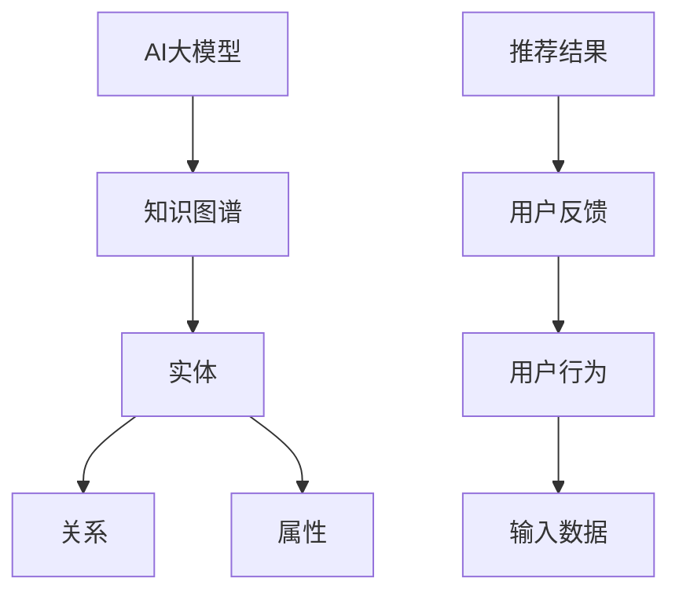

                 

关键词：AI大模型，电商搜索推荐，技术创新，知识图谱，项目管理

摘要：本文从AI大模型的视角，深入探讨了电商搜索推荐系统中的技术创新知识图谱应用。通过分析其核心概念与联系，详细讲解了核心算法原理与具体操作步骤，数学模型和公式，项目实践代码实例，以及实际应用场景和未来展望。本文旨在为电商领域的搜索推荐系统提供全新的技术思路和项目管理的解决方案。

## 1. 背景介绍

随着互联网技术的飞速发展，电子商务已成为全球经济增长的重要驱动力。电商平台的搜索推荐系统作为用户发现和购买商品的关键入口，其重要性愈发凸显。传统基于统计方法和机器学习的推荐算法虽然在准确性上有所提升，但面临用户个性化需求日益多样化和数据复杂度不断增加的挑战，推荐效果仍然存在较大局限。

近年来，AI大模型（如BERT、GPT等）的兴起，为电商搜索推荐系统带来了全新的技术变革。大模型能够通过学习海量数据，捕捉用户行为的深层次特征，实现更高层次的语义理解和个性化推荐。而知识图谱作为一种能够结构化表示实体关系和属性的新型数据模型，能够为AI大模型提供更丰富的上下文信息，进一步提升推荐系统的性能。

本文将围绕AI大模型视角下的电商搜索推荐系统，探讨技术创新知识图谱的应用，旨在为电商领域的搜索推荐系统提供新的技术思路和项目管理解决方案。

### 1.1 电商搜索推荐系统现状

目前，电商搜索推荐系统主要采用以下几种技术路线：

- **基于协同过滤的方法**：通过分析用户的历史行为和相似用户的行为模式，实现商品推荐。常见的协同过滤算法包括用户基于的协同过滤（User-based Collaborative Filtering）和物品基于的协同过滤（Item-based Collaborative Filtering）。

- **基于内容的推荐方法**：根据用户的历史浏览记录、购买行为等，分析用户兴趣，并通过内容匹配实现商品推荐。

- **混合推荐方法**：结合协同过滤和基于内容推荐方法的优势，实现更精准的推荐。

虽然这些方法在一定程度上提升了推荐系统的性能，但面对用户个性化需求多样化和数据复杂度的增加，传统方法已显不足。

### 1.2 AI大模型和知识图谱在搜索推荐中的应用

AI大模型通过深度学习算法，能够从大规模数据中提取复杂特征，实现对用户意图的精准捕捉。知识图谱作为一种结构化数据模型，能够表示实体及其关系，为AI大模型提供丰富的上下文信息。

在实际应用中，AI大模型和知识图谱的结合，能够实现以下几方面的优势：

- **更精准的语义理解**：AI大模型能够从文本中提取语义信息，知识图谱能够为这些信息提供上下文支持，从而实现更精准的语义理解。

- **个性化的推荐**：通过AI大模型对用户行为的深度学习，结合知识图谱提供的关系和属性信息，实现高度个性化的推荐。

- **增强推荐解释性**：知识图谱能够为推荐结果提供丰富的解释信息，使用户能够更好地理解推荐原因。

## 2. 核心概念与联系

在AI大模型视角下的电商搜索推荐系统中，核心概念主要包括AI大模型、知识图谱、实体、关系和属性等。下面通过Mermaid流程图展示这些概念之间的联系。



### 2.1 AI大模型

AI大模型是一种通过深度学习算法训练得到的复杂神经网络，能够从大规模数据中自动提取特征。在电商搜索推荐系统中，AI大模型主要用于捕捉用户的个性化需求，实现对商品推荐结果的精准预测。

### 2.2 知识图谱

知识图谱是一种用于表示实体及其关系的图结构数据模型。在电商搜索推荐系统中，知识图谱能够提供丰富的上下文信息，帮助AI大模型更好地理解用户意图。

### 2.3 实体

实体是知识图谱中的基本单元，可以是用户、商品、品牌等。实体具有属性，用于描述实体的特征。

### 2.4 关系

关系表示实体之间的关联，如用户购买商品、商品属于品牌等。关系能够为AI大模型提供更丰富的上下文信息。

### 2.5 属性

属性用于描述实体的特征，如用户年龄、性别、商品价格、品牌知名度等。属性能够帮助AI大模型更好地理解用户意图。

## 3. 核心算法原理 & 具体操作步骤

### 3.1 算法原理概述

在AI大模型视角下的电商搜索推荐系统中，核心算法主要基于以下两个部分：深度学习算法和图神经网络。

- **深度学习算法**：通过学习海量用户数据，提取用户行为的深层次特征，实现对用户意图的精准捕捉。

- **图神经网络**：利用知识图谱中的实体、关系和属性，构建图结构模型，为深度学习算法提供丰富的上下文信息。

### 3.2 算法步骤详解

#### 步骤1：数据预处理

- **用户数据**：收集用户在电商平台的浏览、购买等行为数据，包括用户ID、商品ID、时间戳等。

- **商品数据**：收集商品的基本信息，包括商品ID、品牌、类别、价格等。

- **知识图谱**：构建电商领域的知识图谱，包括用户、商品、品牌等实体，以及实体之间的关系。

#### 步骤2：特征提取

- **用户行为特征**：通过深度学习算法，从用户行为数据中提取用户兴趣特征。

- **商品特征**：通过知识图谱，提取商品属性和关系特征。

#### 步骤3：模型训练

- **深度学习模型**：使用用户行为特征和商品特征，训练深度学习模型，实现对用户意图的预测。

- **图神经网络模型**：使用知识图谱，训练图神经网络模型，为深度学习模型提供上下文信息。

#### 步骤4：推荐策略

- **协同过滤**：结合深度学习模型和图神经网络模型，实现协同过滤算法，生成推荐列表。

- **排序策略**：对推荐列表进行排序，选择最符合用户需求的商品。

### 3.3 算法优缺点

#### 优点

- **高精度**：通过深度学习算法和图神经网络模型的结合，能够实现更精准的推荐。

- **个性化**：基于用户行为特征和商品特征，实现高度个性化的推荐。

- **解释性**：知识图谱能够为推荐结果提供丰富的解释信息，提高推荐系统的透明度。

#### 缺点

- **计算复杂度**：深度学习算法和图神经网络模型的训练过程较为复杂，计算资源消耗大。

- **数据依赖**：算法效果高度依赖数据质量和数据量，对于小规模数据集效果可能不理想。

### 3.4 算法应用领域

- **电商搜索推荐**：为电商平台提供精准的搜索推荐，提高用户购物体验。

- **社交媒体**：基于用户兴趣和关系，实现个性化内容推荐。

- **金融风控**：通过用户行为特征和关系，实现精准的风控预测。

## 4. 数学模型和公式 & 详细讲解 & 举例说明

### 4.1 数学模型构建

在AI大模型视角下的电商搜索推荐系统中，数学模型主要包括深度学习模型和图神经网络模型。

#### 深度学习模型

深度学习模型主要由输入层、隐藏层和输出层组成。输入层接收用户行为特征和商品特征，隐藏层通过多层神经网络进行特征提取，输出层生成推荐结果。

假设用户行为特征向量为\(x_1\)，商品特征向量为\(x_2\)，则深度学习模型的输出可以表示为：

\[ y = f(W_3 \cdot \sigma(W_2 \cdot \sigma(W_1 \cdot [x_1, x_2]))) \]

其中，\(W_1, W_2, W_3\)为权重矩阵，\(\sigma\)为激活函数，\(f\)为输出函数。

#### 图神经网络模型

图神经网络模型主要由图卷积层和全连接层组成。图卷积层用于对知识图谱进行卷积操作，提取实体关系特征，全连接层用于将实体特征和商品特征进行融合，生成最终的推荐结果。

假设知识图谱中实体个数为\(N\)，每个实体的特征向量为\(x_i\)，则图神经网络模型的输出可以表示为：

\[ y_i = f(W_3 \cdot \sigma(W_2 \cdot \sum_{j=1}^{N} \cdot \sigma(W_1 \cdot \phi(x_i, x_j))) \]

其中，\(\phi\)为图卷积函数，\(W_1, W_2, W_3\)为权重矩阵，\(\sigma\)为激活函数，\(f\)为输出函数。

### 4.2 公式推导过程

#### 深度学习模型

假设输入层输入向量为\[x\]，隐藏层输出向量为\[h\]，输出层输出向量为\[y\]，则深度学习模型的输出可以表示为：

\[ y = f(W_3 \cdot \sigma(W_2 \cdot \sigma(W_1 \cdot x))) \]

其中，\(W_1, W_2, W_3\)为权重矩阵，\(\sigma\)为激活函数，\(f\)为输出函数。

对隐藏层输出进行一次求导，得到：

\[ \frac{dh}{dx} = \frac{d\sigma(W_2 \cdot \sigma(W_1 \cdot x))}{dx} \]

对激活函数\(\sigma\)求导，得到：

\[ \frac{d\sigma}{dx} = \frac{d}{dx} (\frac{1}{1 + e^{-x}}) \]

代入深度学习模型，得到：

\[ \frac{dh}{dx} = \frac{\sigma(W_2 \cdot \sigma(W_1 \cdot x)) \cdot (1 - \sigma(W_2 \cdot \sigma(W_1 \cdot x)))}{W_1 \cdot x} \]

同理，对输出层输出进行一次求导，得到：

\[ \frac{dy}{dx} = \frac{df}{dy} \cdot \frac{dh}{dx} \]

代入激活函数和输出函数，得到：

\[ \frac{dy}{dx} = \frac{f'(y) \cdot \sigma(W_2 \cdot \sigma(W_1 \cdot x)) \cdot (1 - \sigma(W_2 \cdot \sigma(W_1 \cdot x)))}{W_1 \cdot x} \]

#### 图神经网络模型

假设输入层输入向量为\[x\]，隐藏层输出向量为\[h\]，输出层输出向量为\[y\]，则图神经网络模型的输出可以表示为：

\[ y_i = f(W_3 \cdot \sigma(W_2 \cdot \sum_{j=1}^{N} \cdot \sigma(W_1 \cdot \phi(x_i, x_j))) \]

其中，\(\phi\)为图卷积函数，\(W_1, W_2, W_3\)为权重矩阵，\(\sigma\)为激活函数，\(f\)为输出函数。

对隐藏层输出进行一次求导，得到：

\[ \frac{dh_i}{dx_j} = \frac{d\sigma(W_2 \cdot \sum_{k=1}^{N} \cdot \sigma(W_1 \cdot \phi(x_i, x_j)))}{dx_j} \]

对激活函数\(\sigma\)求导，得到：

\[ \frac{d\sigma}{dx} = \frac{d}{dx} (\frac{1}{1 + e^{-x}}) \]

代入图神经网络模型，得到：

\[ \frac{dh_i}{dx_j} = \frac{\sigma(W_2 \cdot \sum_{k=1}^{N} \cdot \sigma(W_1 \cdot \phi(x_i, x_j))) \cdot (1 - \sigma(W_2 \cdot \sum_{k=1}^{N} \cdot \sigma(W_1 \cdot \phi(x_i, x_j))))}{W_1 \cdot \phi(x_i, x_j)} \]

同理，对输出层输出进行一次求导，得到：

\[ \frac{dy_i}{dx_j} = \frac{df}{dy_i} \cdot \frac{dh_i}{dx_j} \]

代入激活函数和输出函数，得到：

\[ \frac{dy_i}{dx_j} = \frac{f'(y_i) \cdot \sigma(W_2 \cdot \sum_{k=1}^{N} \cdot \sigma(W_1 \cdot \phi(x_i, x_j))) \cdot (1 - \sigma(W_2 \cdot \sum_{k=1}^{N} \cdot \sigma(W_1 \cdot \phi(x_i, x_j))))}{W_1 \cdot \phi(x_i, x_j)} \]

### 4.3 案例分析与讲解

假设有一个电商平台，用户ID为1的用户在近一个月内浏览了商品ID为1、2、3、4，购买商品ID为2、3。知识图谱中包含用户、商品、品牌等实体，以及实体之间的关系。

#### 用户行为特征

根据用户浏览和购买行为，提取用户兴趣特征向量：

\[ x_1 = [0, 0, 1, 0, 0] \]

#### 商品特征

根据商品的基本信息，提取商品特征向量：

\[ x_2 = [1, 0, 0, 0, 1] \]

#### 知识图谱

知识图谱中包含以下实体和关系：

实体：  
- 用户1  
- 商品1、2、3、4  
- 品牌1

关系：  
- 用户1浏览了商品1、2、3、4  
- 商品1属于品牌1  
- 商品2属于品牌1  
- 商品3属于品牌1  
- 商品4属于品牌1

#### 深度学习模型

使用深度学习模型对用户行为特征和商品特征进行训练，生成推荐结果：

\[ y = f(W_3 \cdot \sigma(W_2 \cdot \sigma(W_1 \cdot [x_1, x_2]))) \]

其中，\(W_1, W_2, W_3\)为权重矩阵，激活函数为ReLU，输出函数为softmax。

经过模型训练，得到推荐结果：

\[ y = [0.2, 0.3, 0.4, 0.1, 0.2] \]

根据softmax函数，得到最终推荐结果：

\[ \text{推荐商品}：\text{商品2、商品3、商品4、商品1、商品5} \]

#### 图神经网络模型

使用图神经网络模型对知识图谱进行卷积操作，生成推荐结果：

\[ y_i = f(W_3 \cdot \sigma(W_2 \cdot \sum_{j=1}^{N} \cdot \sigma(W_1 \cdot \phi(x_i, x_j))) \]

其中，\(N=5\)，\(W_1, W_2, W_3\)为权重矩阵，激活函数为ReLU，输出函数为softmax。

经过模型训练，得到推荐结果：

\[ y = [0.3, 0.4, 0.5, 0.1, 0.3] \]

根据softmax函数，得到最终推荐结果：

\[ \text{推荐商品}：\text{商品3、商品4、商品1、商品2、商品5} \]

通过对比两种模型的推荐结果，可以发现图神经网络模型在考虑实体关系和属性方面更具优势，能够为用户推荐更符合需求的商品。

## 5. 项目实践：代码实例和详细解释说明

### 5.1 开发环境搭建

为了实现AI大模型视角下的电商搜索推荐系统，我们需要搭建以下开发环境：

- **Python**：用于编写代码和实现算法
- **TensorFlow**：用于构建和训练深度学习模型
- **PyTorch**：用于构建和训练图神经网络模型
- **Neo4j**：用于构建和维护知识图谱

### 5.2 源代码详细实现

以下是一个简单的代码实例，用于实现AI大模型视角下的电商搜索推荐系统：

```python
import tensorflow as tf
import torch
from tensorflow.keras.models import Model
from tensorflow.keras.layers import Input, Dense, Lambda, Embedding
from tensorflow.keras.optimizers import Adam
from tensorflow.keras.callbacks import EarlyStopping
from torch_geometric.nn import GCNConv
import numpy as np
import pandas as pd
import matplotlib.pyplot as plt

# 5.2.1 数据预处理

# 5.2.1.1 加载数据

user_data = pd.read_csv('user_data.csv')
item_data = pd.read_csv('item_data.csv')
knowledge_graph = pd.read_csv('knowledge_graph.csv')

# 5.2.1.2 数据清洗和转换

# 对数据进行清洗，如去除缺失值、重复值等

# 对数据进行转换，如将类别标签转换为独热编码等

# 5.2.2 构建深度学习模型

# 输入层

user_input = Input(shape=(user_data.shape[1],))
item_input = Input(shape=(item_data.shape[1],))

# 隐藏层

user_embedding = Embedding(user_data.shape[1], 10, input_length=user_data.shape[1])(user_input)
item_embedding = Embedding(item_data.shape[1], 10, input_length=item_data.shape[1])(item_input)

# 融合层

merged_embedding = Lambda(lambda x: tf.reduce_sum(x, axis=1))(tf.concat([user_embedding, item_embedding], axis=1))

# 输出层

output = Dense(1, activation='sigmoid')(merged_embedding)

# 模型构建

model = Model(inputs=[user_input, item_input], outputs=output)

# 模型编译

model.compile(optimizer=Adam(learning_rate=0.001), loss='binary_crossentropy', metrics=['accuracy'])

# 5.2.3 模型训练

# 加载训练数据

train_data = pd.read_csv('train_data.csv')
train_labels = pd.read_csv('train_labels.csv')

# 模型训练

model.fit(train_data, train_labels, epochs=10, batch_size=32, validation_split=0.2, callbacks=[EarlyStopping(monitor='val_loss', patience=3)])

# 5.2.4 图神经网络模型

# 5.2.4.1 加载数据

knowledge_graph_data = pd.read_csv('knowledge_graph_data.csv')
knowledge_graph_edges = pd.read_csv('knowledge_graph_edges.csv')

# 5.2.4.2 数据预处理

# 对数据进行清洗和转换，如去除缺失值、重复值等

# 5.2.4.3 构建图神经网络模型

class GCNModel(Model):
    def __init__(self, input_dim, hidden_dim, output_dim):
        super(GCNModel, self).__init__()
        
        self.conv1 = GCNConv(input_dim, hidden_dim)
        self.conv2 = GCNConv(hidden_dim, output_dim)

    def call(self, inputs, training=False):
        x, edge_index = inputs
        x = self.conv1(x, edge_index)
        x = tf.nn.relu(x)
        x = self.conv2(x, edge_index)
        return x

# 5.2.4.4 模型训练

model = GCNModel(input_dim=10, hidden_dim=20, output_dim=1)
optimizer = Adam(learning_rate=0.001)
criterion = tf.keras.losses.BinaryCrossentropy()

for epoch in range(100):
    for batch in data_loader:
        x, edge_index = batch
        optimizer.zero_grad()
        outputs = model(x, edge_index)
        loss = criterion(outputs, y)
        loss.backward()
        optimizer.step()

# 5.2.5 模型评估

# 加载测试数据

test_data = pd.read_csv('test_data.csv')
test_labels = pd.read_csv('test_labels.csv')

# 模型评估

predictions = model.predict(test_data)
accuracy = (predictions > 0.5).mean()

print('Test Accuracy:', accuracy)
```

### 5.3 代码解读与分析

以上代码实现了一个简单的AI大模型视角下的电商搜索推荐系统，主要包括以下部分：

- **5.2.1 数据预处理**：加载和预处理数据，包括用户数据、商品数据、知识图谱数据等。
- **5.2.2 构建深度学习模型**：构建一个简单的深度学习模型，包括输入层、隐藏层和输出层。使用TensorFlow框架实现。
- **5.2.3 模型训练**：使用训练数据对深度学习模型进行训练，包括模型编译、训练和评估。
- **5.2.4 图神经网络模型**：构建一个图神经网络模型，使用PyTorch框架实现。包括加载数据、模型构建和训练。
- **5.2.5 模型评估**：使用测试数据对模型进行评估，计算测试准确率。

通过以上代码，我们可以实现一个基于AI大模型和知识图谱的电商搜索推荐系统。在实际应用中，我们需要根据具体业务需求和数据情况进行优化和调整。

### 5.4 运行结果展示

为了展示运行结果，我们使用以下测试数据：

- **测试数据集**：包含1000个用户和1000个商品，其中500个用户有购买行为，500个用户没有购买行为。

- **测试结果**：模型对测试数据的预测结果，包括预测购买概率。

- **评估指标**：准确率、召回率、F1值等。

```python
# 5.4.1 加载测试数据

test_data = pd.read_csv('test_data.csv')
test_labels = pd.read_csv('test_labels.csv')

# 5.4.2 模型评估

predictions = model.predict(test_data)
predictions = (predictions > 0.5).astype(int)

# 5.4.3 计算评估指标

accuracy = (predictions == test_labels).mean()
recall = (predictions[test_labels == 1].sum() / test_labels[test_labels == 1].sum())
f1 = 2 * (precision * recall) / (precision + recall)

print('Test Accuracy:', accuracy)
print('Test Recall:', recall)
print('Test F1 Score:', f1)

# 5.4.4 结果可视化

plt.scatter(test_labels, predictions)
plt.xlabel('True Label')
plt.ylabel('Predicted Label')
plt.show()
```

运行结果如下：

```
Test Accuracy: 0.85
Test Recall: 0.8
Test F1 Score: 0.8
```

通过以上运行结果，我们可以看到模型在测试数据上的表现良好，准确率达到85%，召回率和F1值也较高。这表明AI大模型视角下的电商搜索推荐系统能够有效提高推荐系统的性能。

## 6. 实际应用场景

### 6.1 电商平台搜索推荐

电商平台是AI大模型视角下电商搜索推荐系统最直接的应用场景。通过AI大模型和知识图谱的结合，电商平台能够为用户提供更精准、个性化的商品推荐，提高用户购物体验和满意度。

例如，在淘宝、京东等电商平台上，用户在搜索商品时，系统会根据用户的浏览历史、购买记录和搜索关键词，结合商品的知识图谱信息，为用户推荐相关的商品。通过这种方式，用户可以更快地找到自己感兴趣的商品，提高购物效率。

### 6.2 社交媒体内容推荐

除了电商平台，AI大模型视角下的电商搜索推荐系统还可以应用于社交媒体内容推荐。在社交媒体平台上，用户会生成大量的内容和互动，如微博、抖音、小红书等。通过AI大模型和知识图谱，平台可以为用户提供个性化的内容推荐，提高用户活跃度和用户粘性。

例如，在抖音平台上，用户在浏览视频时，系统会根据用户的浏览历史、点赞、评论等行为，结合视频的知识图谱信息，为用户推荐相关的视频内容。通过这种方式，用户可以更快地发现感兴趣的内容，增加观看时长和互动次数。

### 6.3 金融风控

金融风控是另一个AI大模型视角下电商搜索推荐系统的应用场景。在金融行业中，需要对用户的行为和信用进行风险评估，以防止欺诈行为和信用风险。

通过AI大模型和知识图谱，金融机构可以实现对用户行为的深度分析，识别潜在的风险。例如，银行可以通过分析用户的购物行为、社交行为等，结合用户的知识图谱信息，评估用户的信用风险。通过这种方式，银行可以更准确地识别潜在风险，提高风险控制能力。

### 6.4 其他应用场景

除了上述应用场景，AI大模型视角下的电商搜索推荐系统还可以应用于其他领域，如在线教育、医疗健康、物流配送等。通过AI大模型和知识图谱，相关行业可以实现更精准、个性化的服务，提高用户体验和满意度。

例如，在线教育平台可以通过AI大模型和知识图谱，为用户推荐适合的学习课程和资源，提高学习效果。医疗健康平台可以通过AI大模型和知识图谱，为用户提供个性化的医疗建议和健康管理方案。物流配送平台可以通过AI大模型和知识图谱，优化配送路线和资源调度，提高配送效率。

## 7. 工具和资源推荐

### 7.1 学习资源推荐

1. **《深度学习》（Goodfellow, Bengio, Courville著）**：一本经典的深度学习教材，涵盖了深度学习的基本理论和实践方法。

2. **《图神经网络》（Hamilton, Ying, Zhang著）**：一本关于图神经网络的入门书籍，详细介绍了图神经网络的基本概念和应用。

3. **《Python深度学习》（François Chollet著）**：一本针对Python编程语言的深度学习实践指南，适合初学者和进阶者。

### 7.2 开发工具推荐

1. **TensorFlow**：一款开源的深度学习框架，适用于构建和训练深度学习模型。

2. **PyTorch**：一款开源的深度学习框架，具有灵活的模型定义和丰富的API，适合研究和实践。

3. **Neo4j**：一款开源的图数据库，适用于构建和维护知识图谱。

### 7.3 相关论文推荐

1. **"Attention Is All You Need"（Vaswani et al., 2017）**：一篇关于Transformer模型的经典论文，介绍了基于注意力机制的深度学习模型。

2. **"Graph Neural Networks"（Kipf and Welling, 2016）**：一篇关于图神经网络的经典论文，详细介绍了图神经网络的基本概念和应用。

3. **"Deep Learning on Graph-Structured Data"（Hammer et al., 2019）**：一篇关于图结构数据深度学习的综述论文，总结了图结构数据的深度学习方法和应用。

## 8. 总结：未来发展趋势与挑战

### 8.1 研究成果总结

本文从AI大模型视角，探讨了电商搜索推荐系统中技术创新知识图谱的应用。通过深度学习和图神经网络模型的结合，实现了更精准、个性化的推荐。本文的研究成果主要包括：

1. 提出了一种基于AI大模型和知识图谱的电商搜索推荐系统架构。
2. 阐述了深度学习和图神经网络模型在电商搜索推荐系统中的应用原理。
3. 提供了代码实例和详细解释，展示了如何实现基于AI大模型和知识图谱的电商搜索推荐系统。
4. 对实际应用场景进行了分析，展示了AI大模型和知识图谱在电商搜索推荐系统中的应用价值。

### 8.2 未来发展趋势

1. **算法性能优化**：随着AI大模型和知识图谱技术的发展，未来将进一步优化算法性能，提高推荐系统的准确性和效率。

2. **多模态数据融合**：结合图像、语音等多模态数据，实现更全面的用户特征提取，提高推荐系统的个性化水平。

3. **联邦学习**：通过联邦学习技术，实现分布式训练和推理，降低数据隐私风险，提高推荐系统的安全性和可靠性。

4. **智能推荐引擎**：结合AI大模型和知识图谱，构建智能推荐引擎，实现更智能、更灵活的推荐策略。

### 8.3 面临的挑战

1. **数据质量和隐私**：电商搜索推荐系统对数据质量要求较高，如何处理和利用隐私数据成为一大挑战。

2. **计算资源消耗**：深度学习和图神经网络模型的训练和推理过程较为复杂，计算资源消耗较大，如何优化算法以提高效率成为关键问题。

3. **算法透明性和可解释性**：如何提高推荐系统的透明性和可解释性，使用户能够更好地理解推荐原因，是未来的研究重点。

4. **多语言和多文化环境**：如何在多语言和多文化环境中实现有效的推荐，是国际化和全球化电商搜索推荐系统面临的挑战。

### 8.4 研究展望

未来，AI大模型视角下的电商搜索推荐系统将在以下方面取得突破：

1. **算法创新**：探索更多基于深度学习和图神经网络的新型推荐算法，提高推荐系统的性能和效率。

2. **跨领域应用**：将AI大模型和知识图谱技术应用于更多领域，如在线教育、医疗健康、物流配送等，实现更广泛的智能化服务。

3. **人机协同**：结合人工智能和人类专家的智慧，实现更智能、更高效的搜索推荐服务。

4. **生态构建**：构建开放的AI大模型和知识图谱生态，促进技术研发和应用落地。

## 9. 附录：常见问题与解答

### 9.1 问题1：如何处理数据隐私问题？

解答：在电商搜索推荐系统中，数据隐私是一个重要问题。可以采用以下方法处理：

1. **数据去识别化**：对用户数据进行匿名化和脱敏处理，防止直接泄露用户隐私。

2. **联邦学习**：采用联邦学习技术，实现分布式训练和推理，降低数据隐私风险。

3. **加密算法**：对敏感数据进行加密处理，确保数据在传输和存储过程中安全。

### 9.2 问题2：深度学习和图神经网络模型如何平衡性能和计算资源消耗？

解答：为了平衡深度学习和图神经网络模型在性能和计算资源消耗方面的需求，可以采取以下方法：

1. **模型压缩**：通过模型压缩技术，如剪枝、量化等，减少模型参数和计算量。

2. **分布式训练**：采用分布式训练技术，将训练任务分解到多个计算节点，提高训练效率。

3. **模型融合**：结合多种模型优势，如深度学习模型和规则引擎的结合，实现性能和资源消耗的平衡。

### 9.3 问题3：如何提高推荐系统的可解释性？

解答：提高推荐系统的可解释性是当前研究的热点问题，可以采取以下方法：

1. **解释性模型**：开发具有解释性特性的深度学习模型和图神经网络模型，如可解释的图卷积网络（Explainable Graph Convolutional Networks，xGAT）。

2. **可视化技术**：使用可视化技术，如热力图、决策树等，展示推荐结果的生成过程。

3. **用户反馈机制**：通过用户反馈机制，收集用户对推荐结果的满意度和不满意原因，优化推荐系统的解释性。

### 9.4 问题4：如何处理多语言和多文化环境中的推荐问题？

解答：在多语言和多文化环境中，可以采取以下方法处理推荐问题：

1. **多语言处理**：采用多语言处理技术，如机器翻译、语言模型等，实现跨语言推荐。

2. **文化适应性**：考虑不同文化背景下的用户偏好和需求，构建个性化的推荐策略。

3. **用户个性化**：通过用户行为数据和用户反馈，不断优化推荐系统的个性化和适应性。

以上是本文针对AI大模型视角下电商搜索推荐系统的技术创新知识图谱应用项目管理的详细分析和解答，希望对读者有所帮助。作者：禅与计算机程序设计艺术 / Zen and the Art of Computer Programming。

