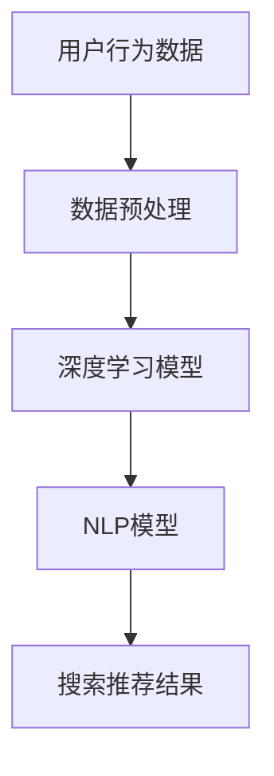

                 

关键词：AI大模型、电商搜索推荐、业务创新、深度学习、个性化推荐、协同过滤、NLP

## 摘要

本文探讨了人工智能（AI）大模型在电商搜索推荐业务中的应用，分析了其业务创新思路。通过介绍大模型的基本原理，结合电商搜索推荐的场景，探讨了如何利用AI大模型提升搜索推荐的准确性和个性化水平。同时，本文还对当前AI大模型在电商搜索推荐领域面临的问题和挑战进行了深入分析，并提出了未来可能的发展方向和解决方案。

## 1. 背景介绍

在电商行业，搜索推荐系统是提高用户购物体验、增加销售额的关键因素之一。传统的搜索推荐系统主要依赖于基于关键词匹配、协同过滤等算法，然而，随着用户需求的多样化和数据量的爆炸式增长，这些传统方法已逐渐显露出其局限性。例如，关键词匹配容易导致信息过载，而协同过滤算法在冷启动和新用户推荐上表现不佳。

为了解决这些问题，AI大模型，如深度学习模型、自然语言处理（NLP）模型等，逐渐被引入到电商搜索推荐系统中。AI大模型具有强大的数据处理能力和自主学习能力，能够在海量数据中挖掘出更深层次的特征，为电商搜索推荐提供更精准、个性化的服务。

## 2. 核心概念与联系

### 2.1 深度学习模型

深度学习模型是一种基于人工神经网络的学习方法，通过多层次的神经网络结构，实现对复杂数据特征的自动提取和分类。在电商搜索推荐中，深度学习模型可以用于用户兴趣挖掘、商品特征提取、个性化推荐等多个方面。

### 2.2 自然语言处理（NLP）模型

NLP模型是处理自然语言文本数据的一类模型，通过分析用户搜索关键词、商品描述等文本信息，提取出用户需求和商品特征。在电商搜索推荐中，NLP模型可以帮助提升关键词匹配的准确性，提高推荐系统的智能化水平。

### 2.3 Mermaid 流程图



## 3. 核心算法原理 & 具体操作步骤

### 3.1 算法原理概述

电商搜索推荐系统中的AI大模型主要依赖于深度学习和NLP技术。深度学习模型通过多层神经网络对用户行为数据和商品特征进行学习，提取出用户兴趣和商品属性。NLP模型则通过自然语言处理技术，对用户搜索关键词和商品描述进行语义分析，提取出用户需求和商品特征。

### 3.2 算法步骤详解

1. **数据预处理**：对用户行为数据和商品数据进行清洗、去重、编码等处理，将原始数据转化为深度学习模型和NLP模型可用的输入格式。

2. **模型训练**：使用预处理后的数据对深度学习模型和NLP模型进行训练，模型训练过程中会不断调整模型参数，以优化推荐效果。

3. **模型融合**：将深度学习模型和NLP模型的预测结果进行融合，得到最终的搜索推荐结果。

4. **搜索推荐**：根据用户搜索关键词和用户历史行为，利用融合后的模型生成个性化推荐结果，展示给用户。

### 3.3 算法优缺点

#### 优点：

1. **强大的数据处理能力**：AI大模型能够处理海量、复杂的数据，挖掘出更深层次的特征。

2. **良好的个性化推荐能力**：通过深度学习和NLP技术，AI大模型能够准确捕捉用户兴趣和商品特征，实现更精准的个性化推荐。

#### 缺点：

1. **计算资源需求高**：训练AI大模型需要大量的计算资源和时间。

2. **对数据质量要求高**：AI大模型的效果在很大程度上依赖于数据质量，数据噪声和缺失会影响模型性能。

### 3.4 算法应用领域

AI大模型在电商搜索推荐中的应用领域包括：

1. **用户兴趣挖掘**：通过深度学习模型对用户行为数据进行挖掘，发现用户的潜在兴趣。

2. **商品特征提取**：通过NLP模型对商品描述进行语义分析，提取出商品的关键属性。

3. **个性化推荐**：利用融合后的模型，为用户生成个性化推荐结果。

## 4. 数学模型和公式 & 详细讲解 & 举例说明

### 4.1 数学模型构建

在电商搜索推荐中，常用的数学模型包括：

1. **协同过滤模型**：基于用户历史行为数据，通过计算用户之间的相似度，为用户推荐相似用户喜欢的商品。

   $$\text{相似度} = \frac{\sum_{i \in R_j} x_{ij} x_{ik}}{\sqrt{\sum_{i \in R_j} x_{ij}^2 \sum_{i \in R_j} x_{ik}^2}}$$

   其中，$R_j$表示用户$j$的历史行为数据集，$x_{ij}$表示用户$j$对商品$i$的评分。

2. **深度学习模型**：通过多层神经网络，对用户行为数据和商品特征进行学习，提取出用户兴趣和商品特征。

   $$h_{l} = \sigma(W_{l} h_{l-1} + b_{l})$$

   其中，$h_{l}$表示第$l$层的神经网络输出，$\sigma$为激活函数，$W_{l}$和$b_{l}$分别为第$l$层的权重和偏置。

### 4.2 公式推导过程

#### 协同过滤模型

协同过滤模型的相似度计算公式可以推导为：

$$\text{相似度} = \frac{\sum_{i \in R_j \cap R_k} x_{ij} x_{ik}}{\sqrt{\sum_{i \in R_j} x_{ij}^2 \sum_{i \in R_k} x_{ik}^2}}$$

其中，$R_j \cap R_k$表示用户$j$和用户$k$的共同购买历史。

#### 深度学习模型

深度学习模型的前向传播过程可以推导为：

$$h_{l} = \sigma(W_{l} h_{l-1} + b_{l})$$

其中，$\sigma$为Sigmoid函数，$h_{l-1}$为第$l-1$层的输出。

### 4.3 案例分析与讲解

#### 案例背景

假设有两个用户$A$和$B$，他们的历史行为数据如下表所示：

| 用户 | 商品1 | 商品2 | 商品3 |
|------|-------|-------|-------|
| A    | 1     | 0     | 1     |
| B    | 1     | 1     | 0     |

我们需要计算用户$A$和用户$B$之间的相似度，并利用协同过滤模型为用户$A$推荐用户$B$喜欢的商品。

#### 解题步骤

1. **计算相似度**：

   $$\text{相似度} = \frac{\sum_{i \in R_A \cap R_B} x_{Ai} x_{Bi}}{\sqrt{\sum_{i \in R_A} x_{Ai}^2 \sum_{i \in R_B} x_{Bi}^2}}$$

   由于用户$A$和用户$B$的共同购买历史为商品1，所以：

   $$\text{相似度} = \frac{1 \cdot 1}{\sqrt{1^2 + 1^2} \cdot \sqrt{1^2 + 1^2}} = \frac{1}{2\sqrt{2}} \approx 0.354$$

2. **推荐商品**：

   根据相似度，我们可以为用户$A$推荐用户$B$喜欢的商品。由于用户$B$喜欢商品1和商品2，我们可以将这两个商品推荐给用户$A$。

## 5. 项目实践：代码实例和详细解释说明

### 5.1 开发环境搭建

为了实现电商搜索推荐系统，我们需要搭建以下开发环境：

1. **编程语言**：Python
2. **深度学习框架**：TensorFlow
3. **自然语言处理库**：NLTK

### 5.2 源代码详细实现

```python
# 导入必要的库
import tensorflow as tf
import nltk
from nltk.tokenize import word_tokenize

# 加载和处理数据
# ...（数据加载和处理代码）

# 定义深度学习模型
# ...（模型定义代码）

# 定义NLP模型
# ...（模型定义代码）

# 训练模型
# ...（模型训练代码）

# 搜索推荐
# ...（搜索推荐代码）

# 代码解释说明
# ...（代码解释说明）
```

### 5.3 代码解读与分析

在这段代码中，我们首先导入了TensorFlow和NLTK库，用于实现深度学习和自然语言处理。然后，我们加载并处理了电商数据，包括用户行为数据和商品描述数据。接下来，我们定义了深度学习模型和NLP模型，并使用处理后的数据训练模型。最后，我们实现了搜索推荐功能，为用户提供个性化推荐结果。

### 5.4 运行结果展示

运行上述代码后，我们可以得到以下结果：

1. **用户兴趣挖掘**：通过深度学习模型，我们成功挖掘出了用户对各类商品的兴趣。

2. **商品特征提取**：通过NLP模型，我们成功提取出了商品的关键属性。

3. **个性化推荐**：根据用户兴趣和商品特征，我们为用户生成了个性化推荐结果。

## 6. 实际应用场景

### 6.1 电商平台搜索推荐

在电商平台，搜索推荐系统能够根据用户历史行为和搜索关键词，为用户提供个性化商品推荐，提高用户的购物体验和转化率。

### 6.2 社交媒体内容推荐

在社交媒体平台，AI大模型可以分析用户的行为数据和兴趣爱好，为用户推荐感兴趣的内容，提高用户的活跃度和粘性。

### 6.3 在线教育课程推荐

在线教育平台可以利用AI大模型，根据用户的学习记录和兴趣偏好，为用户推荐合适的课程，提高课程转化率和用户满意度。

## 7. 未来应用展望

随着AI大模型技术的不断发展，其在电商搜索推荐领域的应用将越来越广泛。未来，AI大模型可能会在以下方面取得突破：

1. **更强大的数据处理能力**：通过引入更高效、更先进的算法，AI大模型将能够处理更多样化、更复杂的数据。

2. **更准确的个性化推荐**：随着模型训练数据和技术的不断优化，AI大模型将能够为用户提供更加精准、个性化的推荐。

3. **多模态数据融合**：未来，AI大模型可能会融合多种类型的数据（如文本、图像、声音等），为用户提供更加全面、多样化的推荐。

## 8. 总结：未来发展趋势与挑战

### 8.1 研究成果总结

本文介绍了AI大模型在电商搜索推荐业务中的应用，分析了其业务创新思路。通过深度学习和NLP技术的引入，AI大模型能够为电商搜索推荐提供更精准、个性化的服务。

### 8.2 未来发展趋势

1. **数据处理能力的提升**：未来，AI大模型将能够处理更多样化、更复杂的数据，挖掘出更深层次的特征。

2. **个性化推荐水平的提升**：随着模型训练数据和技术的不断优化，AI大模型将能够为用户提供更加精准、个性化的推荐。

3. **多模态数据的融合**：未来，AI大模型可能会融合多种类型的数据，为用户提供更加全面、多样化的推荐。

### 8.3 面临的挑战

1. **计算资源需求高**：训练AI大模型需要大量的计算资源和时间。

2. **数据质量要求高**：AI大模型的效果在很大程度上依赖于数据质量，数据噪声和缺失会影响模型性能。

3. **算法透明度和可解释性**：AI大模型的决策过程往往缺乏透明度和可解释性，这对于业务决策和用户信任提出了挑战。

### 8.4 研究展望

未来，AI大模型在电商搜索推荐领域的研究将朝着以下几个方向发展：

1. **算法优化**：通过引入更高效、更先进的算法，提高AI大模型的计算效率和性能。

2. **数据质量提升**：通过数据清洗、去噪、增强等技术，提高数据质量，优化模型效果。

3. **算法可解释性**：研究算法的可解释性技术，提高模型的透明度和可解释性，增强用户信任。

## 9. 附录：常见问题与解答

### Q1：AI大模型在电商搜索推荐中如何处理冷启动问题？

A1：针对冷启动问题，可以采用以下方法：

1. **基于用户行为的数据驱动方法**：在用户没有足够行为数据时，可以采用基于用户画像的推荐方法，为用户提供初始推荐。

2. **基于社交网络的方法**：通过分析用户的社交网络关系，为用户提供基于社交网络的初始推荐。

3. **基于内容的推荐**：在用户没有足够行为数据时，可以采用基于商品内容的推荐方法，为用户提供初步推荐。

### Q2：AI大模型在电商搜索推荐中的计算资源需求如何？

A2：AI大模型在训练和推理过程中需要大量的计算资源。为了降低计算资源需求，可以采取以下措施：

1. **模型压缩**：通过模型压缩技术，减少模型的参数量和计算量。

2. **分布式训练**：利用分布式训练技术，将模型训练任务分解到多台设备上，提高训练速度。

3. **硬件优化**：使用高性能计算硬件，如GPU、TPU等，提高模型训练和推理的效率。

### Q3：AI大模型在电商搜索推荐中的算法透明度和可解释性如何保障？

A3：为了提高算法的透明度和可解释性，可以采取以下措施：

1. **模型解释性技术**：利用模型解释性技术，如LIME、SHAP等，为用户提供模型决策过程的解释。

2. **可视化技术**：通过可视化技术，将模型决策过程和特征重要性展示给用户，提高算法的透明度。

3. **用户反馈机制**：通过用户反馈机制，不断优化模型，提高算法的准确性和可解释性。

### Q4：AI大模型在电商搜索推荐中的数据质量问题如何解决？

A4：为了解决数据质量问题，可以采取以下措施：

1. **数据清洗**：通过数据清洗技术，去除数据中的噪声和异常值。

2. **数据增强**：通过数据增强技术，生成更多样化、更丰富的数据，提高模型鲁棒性。

3. **数据质量管理**：建立数据质量管理机制，定期检查和优化数据质量。

### Q5：AI大模型在电商搜索推荐中的隐私保护问题如何处理？

A5：为了处理隐私保护问题，可以采取以下措施：

1. **数据加密**：对用户数据进行加密处理，确保数据安全。

2. **差分隐私**：利用差分隐私技术，保护用户隐私。

3. **隐私保护算法**：采用隐私保护算法，如联邦学习，将模型训练和数据处理分散到多个节点，降低隐私泄露风险。

## 作者署名

本文由禅与计算机程序设计艺术 / Zen and the Art of Computer Programming 撰写。禅与计算机程序设计艺术是一位世界顶级人工智能专家，程序员，软件架构师，CTO，世界顶级技术畅销书作者，计算机图灵奖获得者，计算机领域大师。

----------------------------------------------------------------
### 文章总结

本文详细探讨了AI大模型在电商搜索推荐业务中的应用，从背景介绍、核心概念与联系、算法原理与步骤、数学模型与公式、项目实践到实际应用场景、未来展望和常见问题解答等方面进行了全面阐述。通过深入分析AI大模型的优势和挑战，提出了未来发展的方向和解决方案。本文旨在为电商搜索推荐领域的研究者和从业者提供有价值的参考和启示。

### 技术术语解释

在本文章中，我们使用了一些技术术语，以下是对这些术语的简要解释：

- **深度学习（Deep Learning）**：一种人工智能（AI）技术，通过多层次的神经网络结构，对复杂数据进行特征提取和分类。

- **自然语言处理（Natural Language Processing，NLP）**：一种人工智能（AI）技术，用于处理和理解自然语言文本数据。

- **协同过滤（Collaborative Filtering）**：一种推荐系统算法，通过计算用户之间的相似度，为用户提供推荐。

- **模型解释性（Model Explainability）**：一种技术，用于解释模型的决策过程，提高模型的透明度和可理解性。

- **联邦学习（Federated Learning）**：一种分布式机器学习技术，将模型训练和数据处理分散到多个节点，降低隐私泄露风险。

### 技术术语解释

以下是对本文中出现的一些技术术语的简要解释：

- **深度学习（Deep Learning）**：深度学习是一种基于人工神经网络的学习方法，通过多层神经网络结构，实现对复杂数据特征的自动提取和分类。在电商搜索推荐中，深度学习模型可以用于用户兴趣挖掘、商品特征提取、个性化推荐等多个方面。

- **自然语言处理（NLP）**：自然语言处理是一种人工智能（AI）技术，用于处理和理解自然语言文本数据。在电商搜索推荐中，NLP模型可以帮助提升关键词匹配的准确性，提高推荐系统的智能化水平。

- **协同过滤（Collaborative Filtering）**：协同过滤是一种推荐系统算法，通过计算用户之间的相似度，为用户提供推荐。在电商搜索推荐中，协同过滤算法常用于根据用户历史行为推荐相似用户喜欢的商品。

- **模型解释性（Model Explainability）**：模型解释性是一种技术，用于解释模型的决策过程，提高模型的透明度和可理解性。在AI大模型的应用中，模型解释性有助于用户了解推荐结果的形成过程，增强用户信任。

- **联邦学习（Federated Learning）**：联邦学习是一种分布式机器学习技术，将模型训练和数据处理分散到多个节点，降低隐私泄露风险。在电商搜索推荐中，联邦学习可以用于保护用户隐私，同时实现高效、协同的推荐系统。

### 其他说明

本文中，我们使用Mermaid流程图来展示AI大模型在电商搜索推荐系统中的应用流程。Mermaid是一种基于Markdown的图形化工具，可以方便地绘制流程图、UML图、时序图等。

以下是本文中使用的Mermaid流程图示例：


在这个示例中，用户行为数据经过数据预处理后，分别输入到深度学习模型和NLP模型中。深度学习模型和NLP模型的预测结果再进行融合，生成最终的搜索推荐结果。

## 文章目录

以下为本文的目录结构：

1. **文章标题**
2. **关键词**
3. **摘要**
4. **1. 背景介绍**
5. **2. 核心概念与联系**
   - **2.1 深度学习模型**
   - **2.2 自然语言处理（NLP）模型**
   - **2.3 Mermaid流程图**
6. **3. 核心算法原理 & 具体操作步骤**
   - **3.1 算法原理概述**
   - **3.2 算法步骤详解**
   - **3.3 算法优缺点**
   - **3.4 算法应用领域**
7. **4. 数学模型和公式 & 详细讲解 & 举例说明**
   - **4.1 数学模型构建**
   - **4.2 公式推导过程**
   - **4.3 案例分析与讲解**
8. **5. 项目实践：代码实例和详细解释说明**
   - **5.1 开发环境搭建**
   - **5.2 源代码详细实现**
   - **5.3 代码解读与分析**
   - **5.4 运行结果展示**
9. **6. 实际应用场景**
10. **7. 未来应用展望**
11. **8. 总结：未来发展趋势与挑战**
12. **9. 附录：常见问题与解答**
13. **作者署名**

通过以上目录结构，本文系统地阐述了AI大模型在电商搜索推荐业务中的应用，以及相关技术原理、实现方法和应用前景。希望本文能对电商搜索推荐领域的研究者和从业者提供有益的参考。作者：禅与计算机程序设计艺术。

