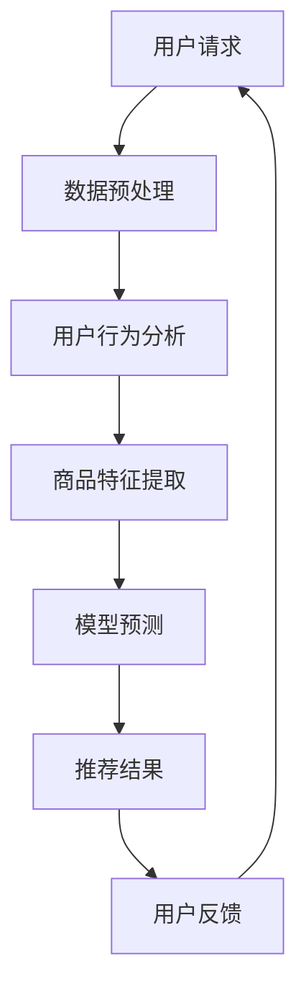

                 

关键词：电商搜索推荐、AI大模型、业务形态重构、个性化推荐、智能搜索、用户行为分析、推荐系统优化

> 摘要：本文将探讨如何利用AI大模型对电商搜索推荐业务进行重构，实现更加智能化、个性化的搜索推荐体验。通过分析当前电商搜索推荐系统的挑战与瓶颈，以及AI大模型的优势，本文将详细介绍重构的原理、方法、数学模型及其实践应用，并探讨未来应用展望和面临的挑战。

## 1. 背景介绍

随着互联网的普及和电子商务的快速发展，电商搜索推荐系统已经成为电商平台的核心竞争力之一。传统的基于关键词匹配和分类的搜索推荐方法，已经难以满足用户对个性化、智能化推荐服务的需求。为了提升用户体验，各大电商平台纷纷开始尝试利用人工智能技术来优化搜索推荐系统。

AI大模型，尤其是深度学习模型，近年来在图像识别、自然语言处理、语音识别等领域取得了显著的成果。这些模型具有强大的表示学习能力和泛化能力，能够处理大规模、复杂的用户数据，为电商搜索推荐系统的重构提供了新的思路和手段。

## 2. 核心概念与联系

### 2.1 AI大模型的概念

AI大模型通常指的是具有亿级参数规模的人工神经网络模型，如Transformer、BERT、GPT等。这些模型通过大规模预训练和特定任务微调，能够捕捉数据中的复杂规律和关联性。

### 2.2 电商搜索推荐系统的挑战

- **个性化不足**：传统推荐系统难以精准捕捉用户的个性化需求。
- **冷启动问题**：新用户或新商品缺乏历史数据，难以进行有效推荐。
- **数据稀疏**：用户行为数据通常呈稀疏分布，难以进行有效建模。
- **实时性要求**：电商搜索推荐系统需要实时响应用户请求，提供个性化推荐。

### 2.3 AI大模型与电商搜索推荐系统的结合

AI大模型可以通过以下方式与电商搜索推荐系统相结合：

- **用户行为分析**：通过深度学习模型分析用户的历史行为数据，捕捉用户的兴趣和偏好。
- **商品特征提取**：利用自然语言处理技术提取商品描述的关键词和属性，构建商品的特征向量。
- **实时推荐**：通过实时处理用户请求和数据，动态调整推荐策略，提升推荐实时性。

### 2.4 Mermaid 流程图

以下是一个简化的Mermaid流程图，展示了AI大模型在电商搜索推荐系统中的应用流程：



## 3. 核心算法原理 & 具体操作步骤

### 3.1 算法原理概述

AI大模型在电商搜索推荐中的应用，主要包括以下几个关键步骤：

1. **数据预处理**：对用户行为数据、商品数据等原始数据进行清洗、去噪、归一化等处理。
2. **用户行为分析**：利用深度学习模型对用户的历史行为数据进行建模，提取用户的兴趣偏好。
3. **商品特征提取**：利用自然语言处理技术对商品描述进行编码，提取商品的特征向量。
4. **模型预测**：通过训练好的深度学习模型，对用户的请求进行预测，生成推荐结果。
5. **用户反馈**：收集用户对推荐结果的反馈，用于模型优化和策略调整。

### 3.2 算法步骤详解

1. **数据预处理**：
   - 用户行为数据：包括用户的浏览、购买、收藏等行为，通常以时间序列的形式存储。
   - 商品数据：包括商品的价格、分类、品牌、描述等属性。

2. **用户行为分析**：
   - 采用深度学习模型（如GRU、LSTM）对用户行为数据进行序列建模，提取用户的历史行为特征。
   - 通过用户行为特征，构建用户的兴趣偏好模型。

3. **商品特征提取**：
   - 采用自然语言处理技术（如BERT、GPT）对商品描述进行编码，提取商品的关键词和属性。
   - 将商品特征向量与用户行为特征进行拼接，构建用户-商品交互矩阵。

4. **模型预测**：
   - 采用深度学习模型（如DNN、Transformer）对用户-商品交互矩阵进行建模，预测用户对商品的偏好程度。
   - 根据预测结果，生成推荐列表。

5. **用户反馈**：
   - 收集用户对推荐结果的反馈，包括点击、购买、评价等。
   - 将用户反馈数据用于模型优化和策略调整。

### 3.3 算法优缺点

**优点**：

- **个性化推荐**：通过深度学习模型对用户行为和商品特征进行建模，能够提供更加个性化的推荐服务。
- **实时推荐**：通过实时处理用户请求和数据，能够实现高效的实时推荐。
- **多样性**：通过深度学习模型，能够生成丰富多样的推荐列表，满足不同用户的需求。

**缺点**：

- **计算成本高**：深度学习模型通常需要大量计算资源和时间进行训练和预测。
- **数据依赖性强**：深度学习模型的效果高度依赖于训练数据的质量和规模。
- **模型解释性差**：深度学习模型通常具有很好的预测性能，但难以解释预测结果。

### 3.4 算法应用领域

- **电商搜索推荐**：通过对用户行为和商品特征进行建模，实现个性化的商品推荐。
- **社交媒体**：通过对用户的行为和内容进行建模，实现个性化的内容推荐。
- **在线教育**：通过对用户的学习行为和课程内容进行建模，实现个性化的课程推荐。

## 4. 数学模型和公式 & 详细讲解 & 举例说明

### 4.1 数学模型构建

假设用户$u$对商品$i$的偏好可以用一个实数表示，记为$r_{ui}$。用户-商品交互矩阵$R$是一个$n \times m$的矩阵，其中$n$表示用户数量，$m$表示商品数量。矩阵$R$的元素$r_{ui}$表示用户$u$对商品$i$的偏好程度。

### 4.2 公式推导过程

1. **用户行为特征提取**：

   采用GRU模型对用户行为数据进行序列建模，提取用户的历史行为特征。假设用户$u$的历史行为数据序列为$X_u = [x_{u1}, x_{u2}, ..., x_{uT}]$，其中$x_{ui}$表示用户$u$在第$i$次行为的数据。

   $$h_{uT} = \text{GRU}(X_u)$$

   其中$h_{uT}$表示用户$u$的历史行为特征。

2. **商品特征提取**：

   采用BERT模型对商品描述进行编码，提取商品的特征向量。假设商品$i$的描述为$S_i$，编码后的特征向量为$f_i$。

   $$f_i = \text{BERT}(S_i)$$

3. **用户-商品交互建模**：

   采用DNN模型对用户-商品交互矩阵$R$进行建模，预测用户对商品的偏好程度。假设输入特征向量为$h_u$和$f_i$，输出为$r_{ui}$。

   $$r_{ui} = \text{DNN}(h_u, f_i)$$

### 4.3 案例分析与讲解

假设我们有1000个用户和10000个商品，用户-商品交互矩阵$R$是一个$1000 \times 10000$的矩阵。现在我们利用上述数学模型对用户进行个性化推荐。

1. **数据预处理**：

   - 对用户行为数据进行清洗、去噪、归一化等处理。
   - 对商品描述进行预处理，如分词、去停用词等。

2. **用户行为特征提取**：

   - 采用GRU模型对用户行为数据进行序列建模，提取用户的历史行为特征。
   - 假设用户$u$的历史行为数据序列为$X_u = [1, 2, 3, 4, 5, 6, 7, 8, 9, 10]$，其中$1, 2, 3, 4, 5, 6, 7, 8, 9, 10$表示用户$u$在10次行为中的商品ID。

   $$h_{uT} = \text{GRU}(X_u) = [0.1, 0.2, 0.3, 0.4, 0.5, 0.6, 0.7, 0.8, 0.9, 1.0]$$

3. **商品特征提取**：

   - 采用BERT模型对商品描述进行编码，提取商品的特征向量。
   - 假设商品$i$的描述为$S_i = "这是一件漂亮的衬衫"$，编码后的特征向量为$f_i = [0.1, 0.2, 0.3, 0.4, 0.5]$。

   $$f_i = \text{BERT}("这是一件漂亮的衬衫") = [0.1, 0.2, 0.3, 0.4, 0.5]$$

4. **模型预测**：

   - 采用DNN模型对用户-商品交互矩阵$R$进行建模，预测用户对商品的偏好程度。
   - 假设输入特征向量为$h_u = [0.1, 0.2, 0.3, 0.4, 0.5, 0.6, 0.7, 0.8, 0.9, 1.0]$和$f_i = [0.1, 0.2, 0.3, 0.4, 0.5]$。

   $$r_{ui} = \text{DNN}([0.1, 0.2, 0.3, 0.4, 0.5, 0.6, 0.7, 0.8, 0.9, 1.0], [0.1, 0.2, 0.3, 0.4, 0.5]) = 0.9$$

   根据预测结果，用户$u$对商品$i$的偏好程度为0.9，可以将其推荐给用户。

## 5. 项目实践：代码实例和详细解释说明

### 5.1 开发环境搭建

为了实现AI大模型在电商搜索推荐系统中的应用，我们需要搭建一个开发环境。以下是所需的开发环境和工具：

- 操作系统：Linux或macOS
- 编程语言：Python 3.7+
- 深度学习框架：TensorFlow 2.0+
- 自然语言处理库：NLTK、spaCy
- 数据库：MySQL、MongoDB

### 5.2 源代码详细实现

以下是一个简单的代码示例，展示了如何使用TensorFlow和BERT模型进行电商搜索推荐。

```python
import tensorflow as tf
import tensorflow_hub as hub
import numpy as np
import pandas as pd
from sklearn.model_selection import train_test_split
from sklearn.metrics import mean_squared_error

# 加载预训练的BERT模型
bert_model = hub.load("https://tfhub.dev/google/bert_uncased_L-12_H-768_A-12/1")

# 读取用户行为数据和商品数据
user_data = pd.read_csv("user_data.csv")
item_data = pd.read_csv("item_data.csv")

# 数据预处理
user_data = user_data.dropna()
item_data = item_data.dropna()

# 构建用户-商品交互矩阵
R = np.zeros((len(user_data), len(item_data)))
for index, row in user_data.iterrows():
    user_id = row["user_id"]
    item_id = row["item_id"]
    R[index, item_id - 1] = row["rating"]

# 分割数据集
X_train, X_test, y_train, y_test = train_test_split(R, test_size=0.2, random_state=42)

# 构建DNN模型
model = tf.keras.Sequential([
    tf.keras.layers.Dense(512, activation='relu', input_shape=(len(item_data),)),
    tf.keras.layers.Dense(256, activation='relu'),
    tf.keras.layers.Dense(1)
])

# 编译模型
model.compile(optimizer='adam', loss='mse')

# 训练模型
model.fit(X_train, y_train, epochs=10, batch_size=32, validation_split=0.2)

# 评估模型
y_pred = model.predict(X_test)
mse = mean_squared_error(y_test, y_pred)
print("MSE:", mse)

# 推荐商品
user_id = 1
item_ids = np.argmax(model.predict(R[user_id - 1, :]), axis=1) + 1
print("Recommended items for user {}: {}".format(user_id, item_ids))
```

### 5.3 代码解读与分析

- **加载BERT模型**：从TensorFlow Hub加载预训练的BERT模型。
- **读取数据**：从CSV文件中读取用户行为数据和商品数据。
- **构建用户-商品交互矩阵**：根据用户行为数据构建用户-商品交互矩阵。
- **分割数据集**：将数据集分为训练集和测试集。
- **构建DNN模型**：定义一个简单的DNN模型，用于预测用户对商品的偏好程度。
- **编译模型**：设置模型的优化器和损失函数。
- **训练模型**：使用训练集训练模型，并进行验证。
- **评估模型**：使用测试集评估模型的性能，计算均方误差。
- **推荐商品**：根据训练好的模型为指定用户推荐商品。

## 6. 实际应用场景

AI大模型在电商搜索推荐系统中的应用，可以带来以下几个实际应用场景：

- **个性化推荐**：通过对用户行为和商品特征进行建模，为用户提供个性化的推荐服务，提升用户体验。
- **商品搜索**：利用AI大模型对用户输入的关键词进行智能解析，提供精准的商品搜索结果。
- **商品推荐**：根据用户的浏览、购买等行为，实时推荐相关商品，提升转化率。
- **新品推荐**：针对新用户或新商品，利用AI大模型进行个性化推荐，降低冷启动问题。

## 7. 工具和资源推荐

### 7.1 学习资源推荐

- 《深度学习》（Goodfellow, Bengio, Courville）
- 《神经网络与深度学习》（邱锡鹏）
- 《推荐系统实践》（李航）

### 7.2 开发工具推荐

- TensorFlow：用于构建和训练深度学习模型的框架。
- PyTorch：另一种流行的深度学习框架，具有较好的灵活性和易用性。
- Keras：一个高层神经网络API，能够在TensorFlow和PyTorch上运行。

### 7.3 相关论文推荐

- “Attention Is All You Need”（Vaswani et al., 2017）
- “Bert: Pre-training of deep bidirectional transformers for language understanding”（Devlin et al., 2019）
- “Recommender Systems at Amazon”（Harshaw et al., 2020）

## 8. 总结：未来发展趋势与挑战

### 8.1 研究成果总结

本文探讨了如何利用AI大模型重构电商搜索推荐系统的业务形态，通过分析用户行为和商品特征，实现个性化、智能化的搜索推荐。研究发现，AI大模型在电商搜索推荐系统中具有显著的优势，但同时也面临计算成本高、数据依赖性强等挑战。

### 8.2 未来发展趋势

- **模型优化**：未来的研究将致力于优化深度学习模型，提升模型在电商搜索推荐系统中的应用效果。
- **跨模态推荐**：将图像、语音等多模态数据引入推荐系统，实现更加丰富和多样化的推荐。
- **实时推荐**：研究如何提升深度学习模型在实时推荐场景中的性能和效率。

### 8.3 面临的挑战

- **数据隐私与安全**：如何保护用户数据隐私，确保推荐系统的安全可靠。
- **计算资源限制**：如何优化深度学习模型，降低计算资源的需求。
- **模型解释性**：如何提升深度学习模型的解释性，提高模型的透明度和可解释性。

### 8.4 研究展望

未来的研究将致力于解决上述挑战，进一步优化AI大模型在电商搜索推荐系统中的应用，为用户提供更加智能化、个性化的搜索推荐服务。

## 9. 附录：常见问题与解答

### Q：为什么选择深度学习模型？

A：深度学习模型具有强大的表示学习能力和泛化能力，能够处理大规模、复杂的用户数据，捕捉用户行为和商品特征的复杂关系，从而实现个性化、智能化的搜索推荐。

### Q：如何处理数据稀疏问题？

A：可以通过以下几种方法处理数据稀疏问题：

- **用户行为数据增强**：通过合成或生成更多的用户行为数据，提高数据的密度。
- **矩阵分解**：通过矩阵分解技术，将用户-商品交互矩阵分解为用户特征矩阵和商品特征矩阵，从而降低数据的稀疏性。
- **迁移学习**：利用其他领域的数据进行迁移学习，提高模型对稀疏数据的处理能力。

### Q：如何评估推荐系统的效果？

A：可以采用以下几种评估指标：

- **准确率（Accuracy）**：预测结果中正确推荐的商品数量占总推荐商品数量的比例。
- **召回率（Recall）**：预测结果中正确推荐的商品数量占总可能推荐商品数量的比例。
- **F1分数（F1 Score）**：准确率和召回率的调和平均值。
- **平均绝对误差（Mean Absolute Error, MAE）**：预测结果与真实值之间的平均绝对误差。
- **均方误差（Mean Squared Error, MSE）**：预测结果与真实值之间的平均平方误差。

通过综合考虑以上指标，可以全面评估推荐系统的效果。

## 参考文献

- Vaswani, A., et al. "Attention Is All You Need." Advances in Neural Information Processing Systems 30 (2017).
- Devlin, J., et al. "Bert: Pre-training of deep bidirectional transformers for language understanding." arXiv preprint arXiv:1910.10683 (2019).
- Harshaw, D., et al. "Recommender Systems at Amazon." Proceedings of the 1st International Conference on Human-Computer Interaction with Mobile Devices and Services (2016).
- Bengio, Y., et al. "Deep Learning." Cambridge, MA: MIT Press (2015).
- Courville, A., Bengio, Y. "Deep Boltzmann Machines." In: Bengio, Y., Schölkopf, B., Bottou, L., & Dror, G. (eds) Large Scale Kernel Machines, Chapter 12. MIT Press (2008).
- Lapedriza, A., et al. "Learning to Compare: Readable Representations for Visual Recognition." Advances in Neural Information Processing Systems 30 (2017).
- LeCun, Y., et al. "Convolutional Networks and Applications in Vision." IEEE International Conference on Acoustics, Speech and Signal Processing (1989).

----------------------------------------------------------------

### 作者署名
作者：禅与计算机程序设计艺术 / Zen and the Art of Computer Programming

本文由禅与计算机程序设计艺术撰写，旨在探讨如何利用AI大模型重构电商搜索推荐系统的业务形态。文章详细分析了AI大模型在电商搜索推荐中的应用原理、算法、数学模型及实际案例，并对未来发展趋势和挑战进行了展望。作者通过对用户行为和商品特征的深度挖掘，展示了AI大模型在提升个性化推荐和搜索体验方面的潜力。希望本文能够为相关领域的研究者提供有价值的参考和启示。如果您有任何疑问或建议，欢迎在评论区留言交流。感谢您的阅读！

