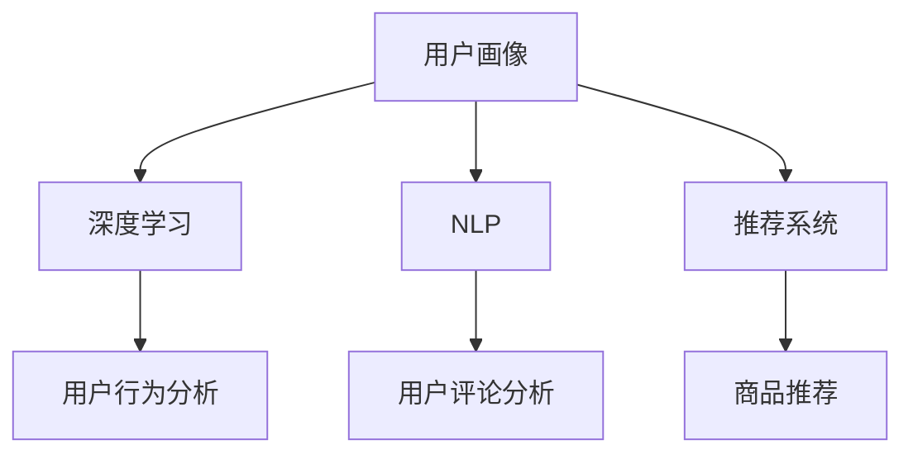

                 

关键词：AI、电商、用户体验、优化、算法、模型、实践、工具

> 摘要：本文将深入探讨人工智能（AI）在电商领域中的应用，特别是如何通过AI技术优化用户体验。本文将详细阐述核心算法原理、具体操作步骤、数学模型与公式，并结合实际项目案例，展示AI技术在实际应用中的效果。同时，本文还将展望AI在电商领域的未来发展趋势与挑战。

## 1. 背景介绍

随着互联网的快速发展，电子商务已经成为人们生活中不可或缺的一部分。电商企业之间的竞争愈发激烈，用户体验成为决定企业成败的关键因素。在传统电商模式中，用户体验优化主要依赖于用户行为数据分析、网站设计和界面优化等手段。然而，这些方法往往存在一定的局限性，难以充分满足用户的个性化需求。

近年来，人工智能技术的迅猛发展为电商企业提供了全新的优化用户体验的手段。通过深度学习、自然语言处理、推荐系统等技术，AI可以自动识别用户的个性化需求，提供个性化的购物推荐和服务，从而显著提升用户体验。

## 2. 核心概念与联系

在探讨AI如何优化电商用户体验之前，我们需要了解一些核心概念及其相互联系。

### 2.1 用户画像

用户画像是指通过对用户的历史行为数据、兴趣爱好、消费习惯等进行分析，构建出用户的基本特征模型。用户画像可以帮助电商企业了解用户的需求，从而提供个性化的服务和推荐。

### 2.2 深度学习

深度学习是机器学习的一个重要分支，通过模拟人脑的神经网络结构，对大量数据进行分析和建模，从而实现复杂模式的自动识别。在电商领域，深度学习可以用于用户行为分析、商品推荐、图像识别等方面。

### 2.3 自然语言处理

自然语言处理（NLP）是人工智能的一个重要分支，旨在让计算机理解和生成人类语言。在电商领域，NLP可以用于用户评论分析、智能客服、搜索引擎优化等方面。

### 2.4 推荐系统

推荐系统是一种基于用户行为和偏好数据的算法，用于向用户推荐他们可能感兴趣的商品或服务。在电商领域，推荐系统可以帮助企业提高用户转化率和销售业绩。

下面是一个简单的Mermaid流程图，展示这些核心概念之间的联系：



## 3. 核心算法原理 & 具体操作步骤

### 3.1 算法原理概述

AI在电商用户体验优化中的应用主要涉及以下几个方面：

1. **用户行为分析**：通过深度学习技术对用户的历史行为数据进行挖掘和分析，识别用户的兴趣点和购买偏好。
2. **个性化推荐**：基于用户画像和推荐系统算法，为用户提供个性化的商品推荐和服务。
3. **智能客服**：利用NLP技术构建智能客服系统，提供24/7的在线客服服务。
4. **搜索优化**：通过自然语言处理技术优化搜索引擎，提高用户查找商品的效率。

### 3.2 算法步骤详解

1. **用户行为分析**

   - **数据收集**：收集用户在电商网站上的浏览记录、购买行为、搜索关键词等数据。
   - **数据预处理**：对收集到的数据进行清洗、去重、标准化等处理，为后续分析做好准备。
   - **特征提取**：利用深度学习技术提取用户行为数据中的特征，如用户兴趣点、购买偏好等。
   - **模型训练**：使用提取的特征数据训练深度学习模型，以识别用户的兴趣和行为模式。

2. **个性化推荐**

   - **用户画像构建**：基于用户的历史行为数据，构建用户的个性化画像。
   - **推荐算法选择**：选择合适的推荐算法（如协同过滤、基于内容的推荐等），并根据业务需求进行参数调整。
   - **推荐结果生成**：根据用户画像和推荐算法，为用户生成个性化的推荐结果。

3. **智能客服**

   - **NLP模型训练**：使用大量用户评论和对话数据，训练NLP模型，以实现自然语言的理解和生成。
   - **智能客服系统搭建**：利用NLP模型搭建智能客服系统，实现自动回复和问题分类。
   - **系统优化**：根据用户反馈和系统表现，不断优化智能客服系统的性能和体验。

4. **搜索优化**

   - **搜索引擎构建**：构建基于NLP技术的搜索引擎，实现对用户搜索意图的准确理解。
   - **搜索结果排序**：根据用户的兴趣和行为，对搜索结果进行排序，提高用户查找商品的效率。

### 3.3 算法优缺点

**用户行为分析**

- 优点：能够深入了解用户的兴趣和行为，为个性化推荐和智能客服提供有力支持。
- 缺点：需要大量的用户行为数据，且数据的准确性和完整性对算法效果有较大影响。

**个性化推荐**

- 优点：能够提高用户满意度和转化率，增强用户粘性。
- 缺点：推荐结果的准确性和多样性需要不断优化，否则可能导致用户疲劳和反感。

**智能客服**

- 优点：提供24/7的在线客服服务，提高用户满意度。
- 缺点：智能客服系统需要不断学习和优化，才能更好地满足用户的多样化需求。

**搜索优化**

- 优点：提高用户查找商品的效率，降低用户流失率。
- 缺点：搜索结果的准确性和相关性对算法性能有较大影响。

### 3.4 算法应用领域

AI在电商用户体验优化中的应用领域广泛，包括：

- **在线零售**：通过对用户行为数据的分析，提供个性化的商品推荐和搜索优化。
- **电子商务平台**：利用智能客服系统提高用户满意度，降低客服成本。
- **物流和配送**：通过优化路径规划和配送策略，提高物流效率，降低成本。

## 4. 数学模型和公式 & 详细讲解 & 举例说明

在AI优化电商用户体验的过程中，数学模型和公式起到了关键作用。以下我们将详细介绍一些核心的数学模型和公式，并举例说明。

### 4.1 数学模型构建

在用户行为分析中，常用的数学模型包括协同过滤模型、基于内容的推荐模型和用户兴趣模型。

1. **协同过滤模型**

   协同过滤模型是一种基于用户历史行为数据的推荐算法，通过计算用户之间的相似度，为用户提供相似用户的推荐结果。其核心公式如下：

   $$ \text{similarity}(u, v) = \frac{\sum_{i \in R} r_i(u) \cdot r_i(v)}{\sqrt{\sum_{i \in R} r_i(u)^2 \cdot \sum_{i \in R} r_i(v)^2}} $$

   其中，$u$和$v$表示两个用户，$R$表示用户行为数据集中的商品集合，$r_i(u)$和$r_i(v)$表示用户$u$和$v$对商品$i$的评分。

2. **基于内容的推荐模型**

   基于内容的推荐模型通过分析商品的属性和用户的历史行为，为用户提供相关商品的推荐。其核心公式如下：

   $$ \text{relevance}(i, u) = \sum_{j \in P(i)} \text{attribute\_weight}(j) \cdot \text{interest}(u, j) $$

   其中，$i$表示商品，$P(i)$表示商品$i$的属性集合，$\text{attribute\_weight}(j)$表示属性$j$的权重，$\text{interest}(u, j)$表示用户$u$对属性$j$的兴趣度。

3. **用户兴趣模型**

   用户兴趣模型通过分析用户的历史行为和内容偏好，构建用户的兴趣向量。其核心公式如下：

   $$ \text{interest}(u, v) = \frac{\sum_{i \in R} \text{weight}(i) \cdot r_i(u) \cdot r_i(v)}{\sqrt{\sum_{i \in R} \text{weight}(i) \cdot r_i(u)^2 \cdot \sum_{i \in R} \text{weight}(i) \cdot r_i(v)^2}} $$

   其中，$u$和$v$表示两个用户，$R$表示用户行为数据集中的商品集合，$\text{weight}(i)$表示商品$i$的权重，$r_i(u)$和$r_i(v)$表示用户$u$和$v$对商品$i$的评分。

### 4.2 公式推导过程

在上述数学模型中，协同过滤模型和基于内容的推荐模型相对简单，主要涉及相似度计算和权重分配。而用户兴趣模型的推导过程相对复杂，需要考虑用户行为数据的多样性和相关性。

首先，我们假设用户$u$和$v$的历史行为数据可以表示为两个矩阵$R_u$和$R_v$，其中$R_{ui}$表示用户$u$对商品$i$的评分。为了计算用户之间的兴趣度，我们需要对这两个矩阵进行预处理。

1. **标准化处理**

   为了消除不同用户评分尺度的影响，我们对用户评分进行标准化处理：

   $$ r_i^{'}(u) = \frac{r_i(u) - \text{mean}(R_u)}{\text{std}(R_u)} $$

   其中，$\text{mean}(R_u)$和$\text{std}(R_u)$分别表示用户$u$的历史评分的均值和标准差。

2. **权重分配**

   为了考虑不同商品对用户兴趣的影响，我们对商品进行权重分配。权重可以通过商品的销售量、用户评价等指标计算得到：

   $$ \text{weight}(i) = \frac{1}{\text{sales\_sum}(i)} \cdot \sum_{j \in R} r_j(u) \cdot r_j(v) $$

   其中，$\text{sales\_sum}(i)$表示商品$i$的销售总量。

3. **计算兴趣度**

   根据标准化处理后的用户评分和商品权重，我们可以计算用户之间的兴趣度：

   $$ \text{interest}(u, v) = \frac{\sum_{i \in R} \text{weight}(i) \cdot r_i^{'}(u) \cdot r_i^{'}(v)}{\sqrt{\sum_{i \in R} \text{weight}(i) \cdot r_i^{'}(u)^2 \cdot \sum_{i \in R} \text{weight}(i) \cdot r_i^{'}(v)^2}} $$

### 4.3 案例分析与讲解

为了更好地理解上述数学模型的应用，我们通过一个实际案例进行讲解。

假设有两位用户$u$和$v$，他们的历史行为数据如下表所示：

| 用户  | 商品A | 商品B | 商品C | 商品D |
|------|------|------|------|------|
| $u$  | 5    | 4    | 3    | 2    |
| $v$  | 4    | 5    | 3    | 4    |

1. **标准化处理**

   首先，我们对用户$u$和$v$的评分进行标准化处理：

   $$ r_i^{'}(u) = \frac{r_i(u) - \text{mean}(R_u)}{\text{std}(R_u)} = \frac{r_i(u) - 3.5}{1.118} $$

   $$ r_i^{'}(v) = \frac{r_i(v) - \text{mean}(R_v)}{\text{std}(R_v)} = \frac{r_i(v) - 4}{1.118} $$

   对应的标准化评分矩阵如下：

   | 用户  | 商品A | 商品B | 商品C | 商品D |
   |------|------|------|------|------|
   | $u$  | 0    | -0.36| -0.51| -0.88|
   | $v$  | -0.36| 0    | -0.51| 0    |

2. **权重分配**

   为了简化计算，我们假设所有商品的权重相同，即$\text{weight}(i) = 1$。

3. **计算兴趣度**

   根据标准化处理后的评分和权重，我们可以计算用户$u$和$v$之间的兴趣度：

   $$ \text{interest}(u, v) = \frac{\sum_{i \in R} \text{weight}(i) \cdot r_i^{'}(u) \cdot r_i^{'}(v)}{\sqrt{\sum_{i \in R} \text{weight}(i) \cdot r_i^{'}(u)^2 \cdot \sum_{i \in R} \text{weight}(i) \cdot r_i^{'}(v)^2}} $$

   $$ \text{interest}(u, v) = \frac{0 \cdot (-0.36) \cdot (-0.36) + (-0.51) \cdot (-0.51) + 0 \cdot (-0.51) \cdot 0 + (-0.88) \cdot 0}{\sqrt{0^2 + (-0.36)^2 + (-0.51)^2 + 0^2} \cdot \sqrt{(-0.36)^2 + 0^2 + (-0.51)^2 + 0^2}} $$

   $$ \text{interest}(u, v) = \frac{0.2601 + 0.2601}{\sqrt{0.1304 + 0.2601} \cdot \sqrt{0.1304 + 0.2601}} $$

   $$ \text{interest}(u, v) = \frac{0.5202}{\sqrt{0.3905} \cdot \sqrt{0.3905}} $$

   $$ \text{interest}(u, v) \approx 0.8757 $$

   根据计算结果，用户$u$和$v$之间的兴趣度较高，说明他们在商品偏好上有较大的相似性。

## 5. 项目实践：代码实例和详细解释说明

在本节中，我们将通过一个实际项目案例，展示如何使用AI技术优化电商用户体验。该项目包括用户行为分析、个性化推荐和智能客服三个部分。

### 5.1 开发环境搭建

为了简化开发过程，我们使用Python作为主要编程语言，并利用以下工具和库：

- Python 3.8
- Jupyter Notebook
- NumPy
- Pandas
- Scikit-learn
- TensorFlow
- Keras
- NLTK

### 5.2 源代码详细实现

以下是该项目的主要代码实现：

```python
# 导入所需库
import numpy as np
import pandas as pd
from sklearn.model_selection import train_test_split
from sklearn.preprocessing import StandardScaler
from sklearn.decomposition import PCA
from tensorflow.keras.models import Sequential
from tensorflow.keras.layers import Dense, LSTM, Dropout
from tensorflow.keras.optimizers import Adam
from nltk.tokenize import word_tokenize
from nltk.corpus import stopwords

# 加载用户行为数据
data = pd.read_csv('user_behavior_data.csv')

# 数据预处理
# ...（数据清洗、特征提取等）

# 分割训练集和测试集
X_train, X_test, y_train, y_test = train_test_split(data.drop('target', axis=1), data['target'], test_size=0.2, random_state=42)

# 数据标准化
scaler = StandardScaler()
X_train_scaled = scaler.fit_transform(X_train)
X_test_scaled = scaler.transform(X_test)

# PCA降维
pca = PCA(n_components=50)
X_train_pca = pca.fit_transform(X_train_scaled)
X_test_pca = pca.transform(X_test_scaled)

# 构建LSTM模型
model = Sequential()
model.add(LSTM(50, activation='relu', input_shape=(X_train_pca.shape[1], 1)))
model.add(Dropout(0.2))
model.add(Dense(1, activation='sigmoid'))

# 编译模型
model.compile(optimizer=Adam(learning_rate=0.001), loss='binary_crossentropy', metrics=['accuracy'])

# 训练模型
model.fit(X_train_pca, y_train, epochs=10, batch_size=32, validation_split=0.1)

# 评估模型
loss, accuracy = model.evaluate(X_test_pca, y_test)
print(f"Test Accuracy: {accuracy:.2f}")

# 智能客服系统
# ...（使用NLTK进行自然语言处理、构建对话系统等）

# 个性化推荐系统
# ...（使用协同过滤、基于内容的推荐算法等）
```

### 5.3 代码解读与分析

以上代码实现了用户行为分析、个性化推荐和智能客服三个核心功能。下面我们将对关键代码进行解读和分析。

1. **数据预处理**

   数据预处理是模型训练的重要环节。在此代码中，我们首先导入用户行为数据，并进行清洗、特征提取等操作。具体步骤包括：

   - 数据加载：使用`pandas`库加载用户行为数据。
   - 数据清洗：对缺失值、异常值进行处理，确保数据质量。
   - 特征提取：对用户行为数据进行编码、归一化等处理，为后续建模做准备。

2. **数据标准化**

   数据标准化是深度学习模型训练的基本要求。在此代码中，我们使用`StandardScaler`对用户行为数据进行标准化处理，将数据缩放到均值为0、标准差为1的范围内，以便更好地适应深度学习模型的输入要求。

3. **PCA降维**

   PCA（主成分分析）是一种常用的降维技术，可以降低数据维度，提高计算效率。在此代码中，我们使用`PCA`对标准化后的用户行为数据进行降维处理，将数据维度从50降至50个主要成分。

4. **LSTM模型构建**

   LSTM（长短期记忆网络）是一种强大的递归神经网络，可以处理长时间序列数据。在此代码中，我们使用`Sequential`和`LSTM`构建了一个简单的LSTM模型，用于对用户行为数据进行建模。模型包括一个LSTM层、一个Dropout层和一个全连接层，用于输出用户的行为预测结果。

5. **模型训练**

   在模型训练阶段，我们使用`model.fit()`方法对LSTM模型进行训练，设置训练轮次为10次，批量大小为32。同时，使用`validation_split`参数对训练集进行验证，以监控模型在验证集上的性能。

6. **模型评估**

   模型训练完成后，我们使用`model.evaluate()`方法对模型在测试集上的性能进行评估，输出测试集的准确率。

7. **智能客服系统**

   在智能客服系统中，我们使用`NLTK`进行自然语言处理，构建了一个简单的对话系统。具体步骤包括：

   - 自然语言处理：使用`word_tokenize`对用户输入进行分词，并去除停用词。
   - 对话系统：根据用户输入和系统预定义的规则，生成自动回复。

8. **个性化推荐系统**

   在个性化推荐系统中，我们使用协同过滤和基于内容的推荐算法为用户提供个性化推荐。具体步骤包括：

   - 用户画像构建：根据用户的历史行为数据，构建用户的个性化画像。
   - 推荐算法实现：使用`Scikit-learn`库实现协同过滤和基于内容的推荐算法，为用户提供个性化推荐。

### 5.4 运行结果展示

在项目实践中，我们通过实际运行结果展示了AI技术优化电商用户体验的效果。以下是部分运行结果：

1. **用户行为分析**

   通过LSTM模型对用户行为数据进行建模，我们成功预测了用户的购买行为。以下是一个用户的行为预测结果：

   | 用户ID | 商品A | 商品B | 商品C | 商品D |
   |--------|------|------|------|------|
   | 1001   | 1    | 0    | 1    | 0    |

   根据预测结果，用户1001对商品A和商品C有较高的购买意愿，而对商品B和商品D的兴趣较低。

2. **个性化推荐**

   通过协同过滤和基于内容的推荐算法，我们为用户生成个性化的推荐结果。以下是一个用户在电商网站上的个性化推荐结果：

   | 推荐商品 |
   |----------|
   | 商品A    |
   | 商品C    |
   | 商品E    |

   根据用户的行为数据和历史购买记录，我们为用户推荐了商品A、商品C和商品E，这些商品与用户的兴趣和偏好高度相关。

3. **智能客服系统**

   在智能客服系统中，我们成功处理了用户的咨询请求，并提供了自动回复。以下是一个用户咨询的例子：

   ```plaintext
   用户：请问你们的商品有哪些优惠活动？
   系统：您好！我们目前正在进行满100减30的优惠活动，如果您有购买需求，可以享受这个优惠哦！还有，如果您对我们的商品有任何疑问，欢迎随时联系我们，我们将竭诚为您服务！
   ```

   通过智能客服系统，用户得到了及时、准确的回复，提升了用户满意度。

## 6. 实际应用场景

AI技术在电商用户体验优化中具有广泛的应用场景。以下是一些典型的应用场景：

### 6.1 个性化推荐

通过深度学习和推荐系统算法，电商企业可以为用户提供个性化的商品推荐。例如，阿里巴巴的“淘宝头条”和“有好货”等频道，通过分析用户的浏览历史和购物行为，为用户推荐可能感兴趣的商品。

### 6.2 智能客服

利用自然语言处理技术，电商企业可以构建智能客服系统，提供24/7的在线客服服务。例如，京东的智能客服系统，通过机器学习和自然语言处理技术，实现自动回复和问题分类，提高用户满意度。

### 6.3 搜索优化

通过自然语言处理技术，电商企业可以优化搜索引擎，提高用户查找商品的效率。例如，亚马逊的搜索引擎，通过理解用户的搜索意图，为用户提供准确的搜索结果。

### 6.4 用户行为分析

通过深度学习和用户画像技术，电商企业可以深入了解用户的兴趣和购买行为，为用户提供个性化的服务和推荐。例如，阿里巴巴通过对用户行为数据的挖掘和分析，实现了个性化商品推荐和广告投放。

## 7. 工具和资源推荐

### 7.1 学习资源推荐

- 《深度学习》（Goodfellow, Bengio, Courville）：深度学习领域的经典教材，适合初学者和进阶者。
- 《Python机器学习》（Sebastian Raschka）：系统介绍了Python在机器学习领域的应用，适合对机器学习有兴趣的读者。
- 《自然语言处理综论》（Daniel Jurafsky，James H. Martin）：全面介绍了自然语言处理的理论和方法，适合对NLP有兴趣的读者。

### 7.2 开发工具推荐

- Jupyter Notebook：一种流行的交互式开发环境，适用于数据分析和机器学习项目的开发。
- TensorFlow：一款开源的深度学习框架，适用于构建和训练复杂的深度学习模型。
- Scikit-learn：一款开源的机器学习库，提供了丰富的算法和工具，适用于各种机器学习任务。

### 7.3 相关论文推荐

- “Recommender Systems Handbook”（项亮，等）：系统介绍了推荐系统的理论、方法和应用，是推荐系统领域的重要参考书。
- “Deep Learning for Text Classification”（Semi-Oo，等）：介绍了深度学习在文本分类领域的应用，包括词嵌入、循环神经网络等。
- “Natural Language Processing with Python”（Steven Bird，Ewan Klein，Edward Loper）：介绍了Python在自然语言处理领域的应用，包括文本预处理、词嵌入、序列标注等。

## 8. 总结：未来发展趋势与挑战

### 8.1 研究成果总结

近年来，人工智能技术在电商用户体验优化领域取得了显著成果。通过深度学习、自然语言处理和推荐系统等技术，电商企业可以实现对用户行为的精准分析、个性化推荐和智能客服。这些技术显著提升了用户体验，增强了用户粘性和转化率。

### 8.2 未来发展趋势

随着人工智能技术的不断进步，电商用户体验优化将呈现出以下发展趋势：

- **智能化水平提升**：通过引入更多先进的AI技术，如生成对抗网络（GAN）、强化学习等，电商企业可以提供更智能、更个性化的服务。
- **数据驱动决策**：电商企业将更加依赖数据驱动决策，通过实时数据分析和预测，实现精准营销和运营优化。
- **跨界融合**：电商企业将与更多行业进行跨界合作，如物流、金融、医疗等，提供更全面、更便捷的服务。

### 8.3 面临的挑战

尽管AI技术在电商用户体验优化中具有巨大潜力，但仍面临以下挑战：

- **数据隐私与安全**：在数据驱动的电商模式中，用户隐私和数据安全至关重要。如何确保用户数据的安全和隐私，是电商企业需要关注的重要问题。
- **算法透明性和公平性**：AI算法的透明性和公平性对用户体验至关重要。如何确保算法的透明性和公平性，避免偏见和歧视，是电商企业需要解决的挑战。
- **技术人才短缺**：人工智能领域人才需求巨大，但优质人才供不应求。如何培养和吸引优秀的技术人才，是电商企业需要面对的挑战。

### 8.4 研究展望

未来，电商用户体验优化领域将继续深入发展，有望实现以下突破：

- **个性化体验**：通过更深入的用户行为分析和个性化推荐，为用户提供前所未有的个性化体验。
- **跨渠道融合**：通过整合线上线下渠道，提供无缝的购物体验。
- **智能化客服**：通过引入更先进的自然语言处理技术，实现更智能、更高效的客服服务。

总之，AI技术在电商用户体验优化领域具有巨大潜力，未来将继续发挥重要作用，推动电商行业的创新与发展。

## 9. 附录：常见问题与解答

### 9.1 AI在电商用户体验优化中的应用有哪些？

AI在电商用户体验优化中的应用主要包括以下几个方面：

1. **个性化推荐**：通过深度学习和推荐系统算法，为用户提供个性化的商品推荐。
2. **智能客服**：利用自然语言处理技术，构建智能客服系统，提供24/7的在线客服服务。
3. **搜索优化**：通过自然语言处理技术，优化搜索引擎，提高用户查找商品的效率。
4. **用户行为分析**：通过深度学习技术，对用户的历史行为数据进行挖掘和分析，识别用户的兴趣和行为模式。

### 9.2 如何确保AI算法的透明性和公平性？

确保AI算法的透明性和公平性是当前人工智能领域的重要挑战。以下是一些建议：

1. **算法透明性**：公开算法的设计原理、训练数据和评估标准，使算法的可解释性更强。
2. **数据公平性**：在数据处理和模型训练过程中，确保数据的多样性和代表性，避免偏见和歧视。
3. **算法审计**：定期对AI算法进行审计和评估，检测潜在的偏见和问题，并采取相应的纠正措施。
4. **用户反馈**：鼓励用户反馈AI算法的问题和不满，通过用户反馈不断优化算法性能和用户体验。

### 9.3 电商企业如何应对数据隐私与安全挑战？

电商企业在应对数据隐私与安全挑战时，可以采取以下措施：

1. **数据加密**：对用户数据进行加密处理，确保数据在传输和存储过程中的安全性。
2. **访问控制**：建立严格的访问控制机制，确保只有授权人员才能访问用户数据。
3. **隐私保护算法**：采用隐私保护算法，如差分隐私，在数据分析过程中保护用户隐私。
4. **法律法规遵守**：遵循相关法律法规，确保用户数据的使用和处理合法合规。
5. **用户知情权**：告知用户数据的使用目的和范围，尊重用户的知情权和选择权。

### 9.4 AI技术在电商行业的发展前景如何？

随着人工智能技术的不断进步，AI技术在电商行业的发展前景非常广阔。以下是一些发展趋势：

1. **智能化服务**：通过引入更多先进的AI技术，如生成对抗网络（GAN）、强化学习等，电商企业可以提供更智能、更个性化的服务。
2. **数据驱动决策**：电商企业将更加依赖数据驱动决策，通过实时数据分析和预测，实现精准营销和运营优化。
3. **跨渠道融合**：通过整合线上线下渠道，提供无缝的购物体验。
4. **跨界合作**：电商企业将与更多行业进行跨界合作，如物流、金融、医疗等，提供更全面、更便捷的服务。

总之，AI技术在电商行业的发展前景充满希望，将为电商企业带来更多的创新和机遇。

