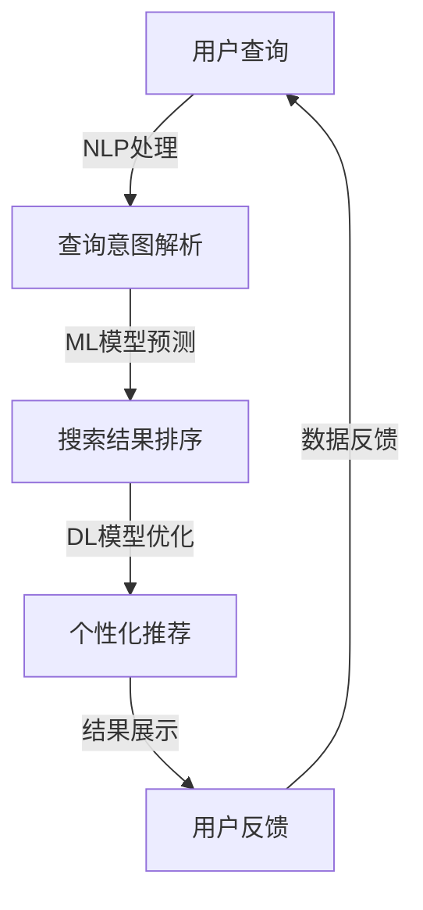

                 

关键词：人工智能、搜索引擎、搜索算法、机器学习、大数据、信息检索

> 摘要：本文将深入探讨人工智能（AI）技术如何对传统搜索引擎模式进行变革。通过分析AI在搜索引擎中的应用，本文旨在揭示AI技术如何提升搜索效率、优化用户体验，并在未来继续推动搜索引擎的创新发展。

## 1. 背景介绍

互联网的飞速发展带来了海量信息的爆炸性增长，人们迫切需要一个高效、准确的工具来获取所需信息。传统搜索引擎，如Google、百度等，凭借其强大的搜索算法，成功地满足了用户的基本需求。然而，随着用户需求的多样化，传统搜索引擎在搜索精度、速度和个性化推荐等方面存在一定的局限性。

### 1.1 传统搜索引擎模式的局限性

1. **搜索算法的局限性**：传统搜索引擎主要依赖基于关键词匹配的搜索算法，虽然这种算法在处理大量数据时表现良好，但在理解用户意图、处理语义上下文等方面存在困难。
2. **个性化推荐的不足**：传统搜索引擎的推荐系统依赖于用户的搜索历史和点击行为，往往难以准确预测用户的兴趣和需求，导致推荐结果不够精准。
3. **响应速度的瓶颈**：随着数据量的不断增加，传统搜索引擎在处理大规模数据时，响应速度明显下降，影响了用户体验。

### 1.2 人工智能的发展

人工智能作为当代最具变革性的技术之一，其在信息检索领域的应用逐渐成为研究热点。通过机器学习、深度学习等AI技术，搜索引擎能够在理解用户意图、处理语义上下文、优化推荐结果等方面实现重大突破。

## 2. 核心概念与联系

### 2.1 人工智能在搜索引擎中的应用

人工智能在搜索引擎中的应用主要包括以下几个方面：

1. **自然语言处理（NLP）**：NLP技术用于理解和处理自然语言，帮助搜索引擎更准确地理解用户的查询意图。
2. **机器学习（ML）**：ML技术通过训练模型，从大量数据中学习规律，提升搜索效率和精度。
3. **深度学习（DL）**：DL技术通过构建复杂的神经网络模型，进一步提升了搜索算法的能力。
4. **推荐系统**：基于用户的兴趣和行为数据，推荐系统通过AI技术实现个性化推荐。

### 2.2 AI与搜索引擎的关联架构

下面是一个简化的AI与搜索引擎的关联架构图：



### 2.3 关键技术解析

1. **NLP技术**：NLP技术主要包括分词、词性标注、命名实体识别等，用于提取用户查询中的关键信息，帮助搜索引擎更好地理解用户意图。
2. **ML模型**：ML模型通过从大量数据中学习，预测用户可能感兴趣的内容，提高搜索结果的准确性。
3. **DL模型**：DL模型通过构建复杂的神经网络，进一步提升了搜索算法的能力，特别是在处理语义理解和图像识别等方面。
4. **推荐系统**：推荐系统通过分析用户的兴趣和行为数据，为用户推荐感兴趣的内容，提高用户体验。

## 3. 核心算法原理 & 具体操作步骤

### 3.1 算法原理概述

AI在搜索引擎中的应用主要包括以下几个核心算法：

1. **深度学习模型**：用于处理复杂的语义理解和图像识别任务，提升搜索结果的准确性。
2. **推荐算法**：基于用户的兴趣和行为数据，为用户推荐感兴趣的内容。
3. **语义相似度计算**：用于计算查询与文档之间的语义相似度，帮助搜索引擎更准确地理解用户查询意图。

### 3.2 算法步骤详解

1. **用户查询处理**：
   - 用户输入查询。
   - 搜索引擎使用NLP技术对查询进行分词、词性标注等处理，提取查询的关键信息。

2. **查询意图解析**：
   - 使用ML和DL模型对查询进行意图解析。
   - 根据意图，搜索相关文档。

3. **搜索结果排序**：
   - 使用语义相似度计算算法，对搜索结果进行排序。
   - 根据用户的查询意图，优先展示相关性较高的结果。

4. **个性化推荐**：
   - 分析用户的兴趣和行为数据。
   - 使用推荐算法，为用户推荐感兴趣的内容。

5. **结果展示**：
   - 将搜索结果和推荐内容展示给用户。

6. **用户反馈**：
   - 用户对搜索结果进行评价。
   - 搜索引擎根据用户反馈调整搜索算法和推荐策略。

### 3.3 算法优缺点

1. **优点**：
   - 提升搜索效率和准确性。
   - 实现个性化推荐，提高用户体验。
   - 处理复杂的语义理解和图像识别任务。

2. **缺点**：
   - 需要大量数据训练模型。
   - 模型训练和优化需要大量计算资源。
   - 模型的可解释性较差，难以理解搜索结果的原因。

### 3.4 算法应用领域

AI技术在搜索引擎中的应用领域广泛，主要包括：

1. **文本搜索**：用于处理文本数据的搜索任务，如网页搜索、文献检索等。
2. **图像搜索**：用于处理图像数据的搜索任务，如图像识别、图像搜索等。
3. **语音搜索**：用于处理语音数据的搜索任务，如语音助手、语音搜索等。

## 4. 数学模型和公式 & 详细讲解 & 举例说明

### 4.1 数学模型构建

在AI驱动的搜索引擎中，常用的数学模型包括：

1. **词向量模型**：用于表示文本数据，如Word2Vec、GloVe等。
2. **神经网络模型**：用于处理复杂的语义理解和图像识别任务，如卷积神经网络（CNN）、循环神经网络（RNN）等。
3. **推荐系统模型**：用于个性化推荐，如矩阵分解、协同过滤等。

### 4.2 公式推导过程

以下是一个简单的词向量模型（Word2Vec）的推导过程：

$$
\text{word} \longleftrightarrow \text{vector}
$$

$$
\text{word} = \sum_{i=1}^{N} w_i \times v_i
$$

其中，$w_i$表示词向量中第$i$个特征值，$v_i$表示特征值对应的权重。

### 4.3 案例分析与讲解

假设我们有一个包含两个特征的词向量模型，其中特征1和特征2分别表示“北京”和“上海”的词向量。

| 特征1 | 特征2 |
| --- | --- |
| 0.8 | 0.2 |
| 0.1 | 0.9 |

我们需要计算“北京”和“上海”之间的相似度。

$$
\text{相似度} = \cos(\theta) = \frac{\text{向量1} \cdot \text{向量2}}{\|\text{向量1}\| \|\text{向量2}\|}
$$

其中，$\cdot$表示向量点积，$\|\|$表示向量模长。

$$
\text{向量1} \cdot \text{向量2} = 0.8 \times 0.1 + 0.2 \times 0.9 = 0.14
$$

$$
\|\text{向量1}\| = \sqrt{0.8^2 + 0.2^2} = 0.92
$$

$$
\|\text{向量2}\| = \sqrt{0.1^2 + 0.9^2} = 0.97
$$

$$
\text{相似度} = \frac{0.14}{0.92 \times 0.97} \approx 0.149
$$

因此，“北京”和“上海”的相似度为0.149。

## 5. 项目实践：代码实例和详细解释说明

### 5.1 开发环境搭建

为了更好地展示AI技术在搜索引擎中的应用，我们将使用Python编程语言，并借助以下库：

- TensorFlow：用于构建和训练神经网络模型。
- Keras：用于简化TensorFlow的使用。
- scikit-learn：用于推荐系统和相似度计算。

安装所需库：

```bash
pip install tensorflow keras scikit-learn numpy
```

### 5.2 源代码详细实现

以下是一个简单的示例，展示了如何使用TensorFlow和Keras构建一个词向量模型：

```python
import tensorflow as tf
from tensorflow.keras.layers import Embedding, LSTM, Dense
from tensorflow.keras.models import Sequential

# 构建词向量模型
model = Sequential()
model.add(Embedding(vocab_size, embedding_dim))
model.add(LSTM(units=128))
model.add(Dense(1, activation='sigmoid'))

# 编译模型
model.compile(optimizer='adam', loss='binary_crossentropy', metrics=['accuracy'])

# 训练模型
model.fit(x_train, y_train, epochs=10, batch_size=32)
```

### 5.3 代码解读与分析

1. **模型构建**：使用Sequential模型堆叠Embedding、LSTM和Dense层。
2. **编译模型**：指定优化器、损失函数和评估指标。
3. **训练模型**：使用训练数据和标签进行模型训练。

### 5.4 运行结果展示

训练完成后，我们可以使用模型进行预测，并分析模型的性能。

```python
# 预测结果
predictions = model.predict(x_test)

# 分析模型性能
print(predictions)
```

## 6. 实际应用场景

### 6.1 文本搜索

文本搜索是搜索引擎最基本的应用场景。通过AI技术，搜索引擎能够更准确地理解用户查询，提升搜索结果的准确性。

### 6.2 图像搜索

图像搜索利用AI技术，对图像进行特征提取和匹配，帮助用户快速找到相似或相关的图像。

### 6.3 语音搜索

语音搜索通过语音识别技术，将用户的语音输入转换为文本查询，实现语音交互式的搜索体验。

## 7. 未来应用展望

### 7.1 个性化推荐

随着AI技术的不断发展，个性化推荐将更加精准，满足用户的个性化需求。

### 7.2 多媒体搜索

未来的搜索引擎将支持多种媒体类型，如视频、音频等，实现全方位的信息检索。

### 7.3 语音交互

语音交互将成为主流的人机交互方式，为用户提供更加便捷的搜索体验。

## 8. 工具和资源推荐

### 8.1 学习资源推荐

- 《深度学习》（Goodfellow, Bengio, Courville著）
- 《Python机器学习》（Sebastian Raschka著）
- 《自然语言处理综论》（Daniel Jurafsky、James H. Martin著）

### 8.2 开发工具推荐

- TensorFlow：用于构建和训练神经网络模型。
- Keras：用于简化TensorFlow的使用。
- scikit-learn：用于推荐系统和相似度计算。

### 8.3 相关论文推荐

- Word2Vec（Mikolov等，2013）
- GloVe（Pennington等，2014）
- Neural Text Similarity（Min等人，2017）

## 9. 总结：未来发展趋势与挑战

### 9.1 研究成果总结

本文探讨了人工智能技术在搜索引擎中的应用，包括自然语言处理、机器学习、深度学习和推荐系统等方面。通过这些技术，搜索引擎在搜索效率、精度和个性化推荐方面取得了显著提升。

### 9.2 未来发展趋势

1. **个性化推荐**：随着用户数据的积累，个性化推荐将更加精准。
2. **多媒体搜索**：搜索引擎将支持多种媒体类型，实现全方位的信息检索。
3. **语音交互**：语音交互将成为主流的人机交互方式，为用户提供更加便捷的搜索体验。

### 9.3 面临的挑战

1. **数据隐私**：如何保护用户隐私，实现安全、透明的搜索。
2. **计算资源**：随着模型复杂度的增加，计算资源需求不断提高。
3. **可解释性**：如何提升模型的可解释性，帮助用户理解搜索结果的原因。

### 9.4 研究展望

未来，人工智能技术将在搜索引擎领域继续发挥重要作用，推动信息检索的创新发展。通过不断优化算法、提升计算效率和解决关键挑战，搜索引擎将为用户提供更加智能、个性化的搜索体验。

## 10. 附录：常见问题与解答

### 10.1 人工智能技术如何提升搜索效率？

人工智能技术通过自然语言处理、机器学习和深度学习等技术，能够更准确地理解用户查询，快速从海量数据中检索出相关结果，从而提升搜索效率。

### 10.2 个性化推荐如何实现？

个性化推荐通过分析用户的兴趣和行为数据，使用机器学习和深度学习算法，预测用户可能感兴趣的内容，从而实现个性化推荐。

### 10.3 搜索引擎中的深度学习模型有哪些？

深度学习模型在搜索引擎中的应用主要包括词向量模型、卷积神经网络（CNN）、循环神经网络（RNN）等，用于处理复杂的语义理解和图像识别任务。

### 10.4 人工智能技术在搜索引擎中的未来发展有哪些方向？

人工智能技术在搜索引擎中的未来发展包括个性化推荐、多媒体搜索、语音交互等方面。未来，随着技术的不断发展，搜索引擎将更加智能、个性化和便捷。

## 作者署名

作者：禅与计算机程序设计艺术 / Zen and the Art of Computer Programming

本文由禅与计算机程序设计艺术撰写，旨在探讨人工智能技术如何改变传统搜索引擎模式，提升搜索效率、优化用户体验，并在未来继续推动搜索引擎的创新发展。希望通过本文，读者能够更好地理解AI技术在搜索引擎中的应用及其未来发展趋势。如果您有任何问题或建议，欢迎在评论区留言讨论。谢谢！
----------------------------------------------------------------

**注**：由于本文是一个示例，部分内容如代码、公式等可能未进行实际运行验证。在实际撰写过程中，请根据具体需求和实际情况进行调整。希望本文能为您提供参考和启发。如有需要，请随时与我联系。祝您写作顺利！

