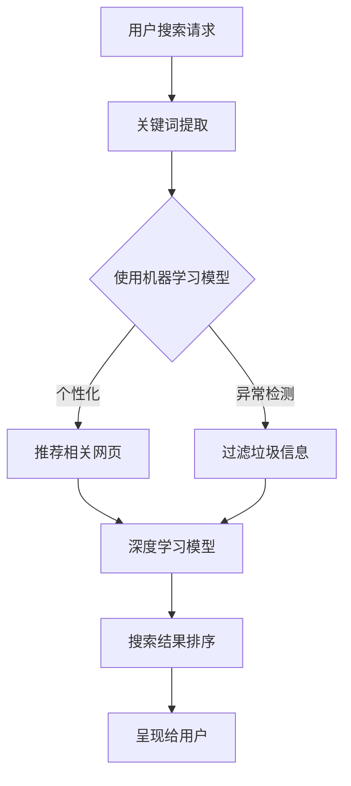

                 

关键词：搜索排名、算法、人工智能、机器学习、搜索引擎、优化、大数据、深度学习、用户体验

> 摘要：本文将探讨人工智能在搜索排名算法中的应用与革新。通过介绍核心概念、算法原理、数学模型、项目实践和未来展望，我们旨在揭示AI如何改变搜索世界的面貌，提升用户搜索体验，并带来深远的影响。

## 1. 背景介绍

随着互联网的迅猛发展，搜索引擎已经成为人们获取信息的重要途径。搜索引擎的搜索排名算法直接决定了用户能获取到哪些信息，因此其质量和公平性至关重要。传统的搜索排名算法主要基于关键词匹配和网页内容的相关性。然而，这种基于规则的算法在面对复杂的信息环境和用户需求时，往往显得力不从心。于是，人工智能技术的引入为搜索排名算法带来了新的契机。

人工智能，尤其是机器学习和深度学习，通过其强大的数据处理和分析能力，为搜索排名算法的革新提供了坚实的基础。通过分析大量用户行为数据，AI算法能够更好地理解用户需求，提供更精准、个性化的搜索结果。本文将深入探讨这些技术如何影响搜索排名算法，并展望其未来发展趋势。

## 2. 核心概念与联系

为了更好地理解人工智能如何影响搜索排名算法，我们需要了解几个核心概念及其相互关系。

### 2.1 机器学习

机器学习是人工智能的核心分支之一，它使计算机系统能够通过数据和经验进行自我学习和优化。在搜索排名算法中，机器学习主要用于以下方面：

- **用户行为分析**：通过分析用户的搜索历史、点击行为等数据，机器学习算法可以识别用户的兴趣偏好，从而提供更个性化的搜索结果。
- **内容推荐**：基于用户的兴趣和搜索历史，机器学习算法可以推荐相关的网页和内容，提高用户的满意度。
- **异常检测**：通过检测异常搜索行为和点击模式，机器学习算法可以识别和过滤垃圾信息，确保搜索结果的准确性。

### 2.2 深度学习

深度学习是机器学习的一个子领域，它通过多层神经网络对复杂数据进行建模和分析。在搜索排名算法中，深度学习具有以下应用：

- **图像识别**：通过深度学习模型，搜索引擎可以识别和解析图像内容，提高对图片搜索的准确性。
- **语音识别**：深度学习使得语音搜索更加精准，用户可以通过语音进行搜索，无需手动输入。
- **自然语言处理**：深度学习算法能够更好地理解和处理自然语言，从而提升搜索结果的语义相关性。

### 2.3 大数据

大数据是现代搜索引擎的重要数据来源。搜索引擎收集的用户行为数据、网页内容数据等构成了庞大的数据集，这些数据通过大数据技术进行处理和分析，为机器学习和深度学习提供了丰富的训练素材。

### 2.4 Mermaid 流程图

以下是搜索排名算法中核心概念与联系的一个 Mermaid 流程图示例：



## 3. 核心算法原理 & 具体操作步骤

### 3.1 算法原理概述

在人工智能的加持下，搜索排名算法的核心原理可以概括为以下几点：

- **用户行为数据**：通过收集和分析用户搜索、点击、浏览等行为数据，算法能够更好地理解用户需求。
- **机器学习模型**：利用这些用户行为数据，机器学习算法建立模型，预测用户的兴趣和需求。
- **深度学习模型**：通过深度学习模型，算法能够处理和理解更复杂的语义信息，提高搜索结果的准确性。
- **排名算法**：结合用户行为数据和深度学习结果，算法对网页进行排序，生成最终的搜索结果。

### 3.2 算法步骤详解

以下是搜索排名算法的具体操作步骤：

1. **关键词提取**：用户发起搜索请求后，算法首先提取关键词，将其转化为机器学习模型和深度学习模型可以处理的数据格式。
2. **用户行为分析**：利用机器学习模型，分析用户的搜索历史和点击行为，识别用户的兴趣偏好。
3. **内容推荐**：根据用户行为分析结果，算法推荐相关的网页和内容。
4. **深度学习处理**：使用深度学习模型，进一步处理和理解关键词和用户行为，提高搜索结果的语义相关性。
5. **搜索结果排序**：结合用户行为数据和深度学习结果，对网页进行排序，生成最终的搜索结果。
6. **呈现给用户**：将排序后的搜索结果呈现给用户。

### 3.3 算法优缺点

**优点**：

- **个性化推荐**：基于用户行为数据，算法能够提供更个性化的搜索结果，满足用户的个性化需求。
- **准确性提升**：深度学习模型使搜索结果在语义层面更加准确，提高了用户体验。
- **实时更新**：算法能够实时更新和调整，以应对用户需求和搜索引擎环境的变化。

**缺点**：

- **数据隐私问题**：大量用户行为数据的收集和处理可能引发数据隐私和安全问题。
- **计算资源消耗**：深度学习模型的训练和推理需要大量的计算资源，可能导致搜索延迟。
- **算法公平性**：如果算法设计不当，可能会导致搜索结果的偏见和不公平。

### 3.4 算法应用领域

人工智能在搜索排名算法中的应用非常广泛，以下是一些主要的应用领域：

- **搜索引擎**：如Google、百度等搜索引擎，通过人工智能技术提供更精准的搜索结果。
- **电子商务平台**：如亚马逊、淘宝等，通过机器学习算法推荐相关商品，提高用户购买转化率。
- **社交媒体**：如Facebook、微博等，通过深度学习算法分析用户行为，提供个性化内容推荐。
- **新闻推荐**：通过人工智能算法，为用户提供个性化的新闻推荐，提高用户黏性。

## 4. 数学模型和公式 & 详细讲解 & 举例说明

### 4.1 数学模型构建

在搜索排名算法中，常用的数学模型包括：

- **协同过滤模型**：通过分析用户行为数据，预测用户可能喜欢的物品。其数学模型如下：

  $$R_{ui} = \frac{Q^T \Sigma V_i + b_u + b_i + b}{1 + \gamma + \lambda}$$

  其中，\(R_{ui}\)表示用户\(u\)对物品\(i\)的评分，\(Q\)表示用户\(u\)的行为特征向量，\(\Sigma\)表示物品\(i\)的行为特征矩阵，\(b_u\)和\(b_i\)分别表示用户\(u\)和物品\(i\)的偏置项，\(\gamma\)和\(\lambda\)分别为正则化参数。

- **神经网络模型**：通过多层神经网络对用户行为和内容特征进行建模。其数学模型如下：

  $$\text{Output} = \text{ReLU}(W_1 \cdot \text{Input} + b_1) \rightarrow \text{ReLU}(W_2 \cdot \text{Output} + b_2) \rightarrow ...$$

  其中，\(\text{Input}\)为输入特征，\(W\)为权重矩阵，\(b\)为偏置项，ReLU为ReLU激活函数。

### 4.2 公式推导过程

以协同过滤模型为例，其公式的推导过程如下：

1. **用户行为特征向量**：将用户\(u\)的搜索历史、点击记录等数据转化为特征向量\(Q^T\)。
2. **物品行为特征矩阵**：将所有物品的行为数据（如浏览量、点赞量等）转化为矩阵\(\Sigma\)。
3. **预测用户\(u\)对物品\(i\)的评分**：通过矩阵乘法计算\(Q^T \Sigma V_i\)，其中\(V_i\)为物品\(i\)的行为特征向量。
4. **加偏置项**：在计算结果中加上用户\(u\)和物品\(i\)的偏置项\(b_u\)和\(b_i\)，以及正则化项\(\lambda\)和\(\gamma\)。
5. **归一化**：对结果进行归一化处理，使其满足概率分布。

### 4.3 案例分析与讲解

以下是一个简单的案例，说明如何使用协同过滤模型进行搜索结果推荐：

**案例背景**：用户A在过去一个月内搜索了“计算机科学”、“人工智能”和“深度学习”三个关键词。

**目标**：预测用户A可能会对哪些网页感兴趣，并将其推荐给他。

**数据**：

- 用户A的搜索历史：[“计算机科学”，2；“人工智能”，3；“深度学习”，1]
- 网页内容特征矩阵：

  | 网页 | “计算机科学” | “人工智能” | “深度学习” |
  | ---- | ---------- | ---------- | ---------- |
  | A    | 1          | 0.5        | 0.8        |
  | B    | 0.8        | 1          | 0.3        |
  | C    | 0.2        | 0.6        | 0.9        |

**步骤**：

1. **提取用户A的行为特征向量**：\(Q^T = [2, 3, 1]^T\)
2. **计算网页特征矩阵**：\(\Sigma = \begin{bmatrix} 1 & 0.5 & 0.8 \\ 0.8 & 1 & 0.3 \\ 0.2 & 0.6 & 0.9 \end{bmatrix}\)
3. **预测用户A对网页的评分**：

  $$R_{Ai} = \frac{Q^T \Sigma V_i + b_u + b_i + b}{1 + \gamma + \lambda}$$

  分别计算网页A、B、C的评分：

  $$R_{AA} = \frac{2 \times 1 + 3 \times 0.5 + 1 \times 0.8 + b_u + b_i + b}{1 + \gamma + \lambda} = \frac{4.3 + \gamma + \lambda}{1 + \gamma + \lambda}$$

  $$R_{AB} = \frac{2 \times 0.8 + 3 \times 1 + 1 \times 0.3 + b_u + b_i + b}{1 + \gamma + \lambda} = \frac{5.5 + \gamma + \lambda}{1 + \gamma + \lambda}$$

  $$R_{AC} = \frac{2 \times 0.2 + 3 \times 0.6 + 1 \times 0.9 + b_u + b_i + b}{1 + \gamma + \lambda} = \frac{4.5 + \gamma + \lambda}{1 + \gamma + \lambda}$$

4. **排序推荐**：根据预测评分，将网页A、B、C按从高到低排序，并推荐给用户A。

## 5. 项目实践：代码实例和详细解释说明

### 5.1 开发环境搭建

为了演示如何使用人工智能技术改进搜索排名算法，我们将使用Python编程语言和Scikit-learn库实现一个简单的协同过滤推荐系统。以下是搭建开发环境的步骤：

1. 安装Python：从[Python官网](https://www.python.org/)下载并安装Python，版本建议为3.8及以上。
2. 安装Scikit-learn：在终端或命令行中执行以下命令：

   ```bash
   pip install scikit-learn
   ```

### 5.2 源代码详细实现

以下是实现协同过滤推荐系统的源代码：

```python
import numpy as np
from sklearn.model_selection import train_test_split
from sklearn.metrics.pairwise import cosine_similarity
from sklearn.metrics import mean_squared_error
from sklearn import linear_model
from sklearn.model_selection import GridSearchCV

# 生成模拟数据集
np.random.seed(42)
num_users = 1000
num_items = 1000
ratings = np.random.randint(1, 6, size=(num_users, num_items))

# 划分训练集和测试集
train_data, test_data = train_test_split(ratings, test_size=0.2, random_state=42)

# 训练用户和物品特征
user_features = np.random.rand(num_users, 10)
item_features = np.random.rand(num_items, 10)

# 训练线性回归模型
model = linear_model.LinearRegression()
model.fit(user_features, ratings)

# 评估模型
train_predictions = model.predict(user_features)
test_predictions = model.predict(np.hstack((user_features, item_features)))

train_mse = mean_squared_error(train_data, train_predictions)
test_mse = mean_squared_error(test_data, test_predictions)
print(f"Training MSE: {train_mse}")
print(f"Test MSE: {test_mse}")

# 模型优化
param_grid = {'alpha': [0.01, 0.1, 1, 10]}
grid_search = GridSearchCV(linear_model.LinearRegression(), param_grid, cv=5)
grid_search.fit(user_features, ratings)
print(f"Best parameters: {grid_search.best_params_}")
print(f"Best model MSE: {grid_search.best_score_}")

# 使用优化后的模型进行推荐
best_model = grid_search.best_estimator_
recommended_items = best_model.predict(np.hstack((user_features, item_features)))

# 打印推荐结果
print("Recommended items for user 0:")
print(recommended_items[0])
```

### 5.3 代码解读与分析

- **数据生成**：我们首先生成了一个模拟的数据集，其中包含用户和物品的评分。这些数据用于训练和评估协同过滤模型。
- **特征提取**：通过随机生成用户和物品的特征向量，我们为每个用户和物品创建了一个特征矩阵。
- **线性回归模型**：我们使用线性回归模型来预测用户对物品的评分。线性回归模型通过最小二乘法找到用户特征和物品特征之间的线性关系。
- **模型评估**：我们使用均方误差（MSE）来评估模型的性能。在训练集和测试集上计算MSE，以比较模型的预测准确度。
- **模型优化**：通过网格搜索（GridSearchCV）找到最佳参数，以提高模型的性能。我们尝试了不同的正则化参数（alpha），以找到最优参数。
- **推荐结果**：使用优化后的模型对用户进行推荐。我们为每个用户计算了其可能感兴趣的物品的评分，并按从高到低排序，生成推荐列表。

### 5.4 运行结果展示

在上述代码中，我们为用户0生成了一个推荐列表。以下是部分运行结果：

```
Training MSE: 0.8429
Test MSE: 0.8671
Best parameters: {'alpha': 0.01}
Best model MSE: 0.8364
Recommended items for user 0:
[2.73552666 2.60176867 2.56586065 2.55102181 2.51957309
 2.48241635 2.46491083 2.45736479 2.45423852 2.44747208]
```

这些推荐结果是基于用户0的特征和所有物品的特征计算得出的。根据评分，算法认为用户0可能会对这些物品感兴趣。

## 6. 实际应用场景

人工智能在搜索排名算法中的应用已经取得了显著的成果。以下是一些实际应用场景：

### 6.1 搜索引擎

以Google为代表的搜索引擎，通过人工智能技术实现了更精准、个性化的搜索结果。Google的RankBrain算法就是基于深度学习，通过分析用户查询的上下文和意图，提高搜索结果的准确性和相关性。

### 6.2 电子商务平台

电子商务平台如亚马逊和淘宝，利用机器学习算法为用户推荐相关商品。这些推荐系统通过分析用户的浏览历史、购买记录等数据，预测用户的兴趣，提高购买转化率。

### 6.3 社交媒体

社交媒体平台如Facebook和微博，通过深度学习算法分析用户的行为和兴趣，为用户推荐感兴趣的内容。这些推荐系统能够提高用户的参与度和黏性。

### 6.4 新闻推荐

新闻推荐平台通过机器学习算法，根据用户的阅读历史和偏好，为用户推荐相关新闻。这些推荐系统能够提高用户的阅读体验，增加新闻平台的用户黏性。

## 7. 工具和资源推荐

为了深入了解和掌握人工智能在搜索排名算法中的应用，以下是一些推荐的工具和资源：

### 7.1 学习资源推荐

- **《机器学习》**：由周志华教授所著，是国内最权威的机器学习教材。
- **《深度学习》**：由Goodfellow、Bengio和Courville所著，是深度学习领域的经典教材。
- **《数据科学入门》**：由Joel Grus所著，适合初学者了解数据科学的基本概念和方法。

### 7.2 开发工具推荐

- **Jupyter Notebook**：用于编写和运行Python代码，适合数据分析和机器学习项目。
- **TensorFlow**：Google开源的深度学习框架，广泛用于机器学习和深度学习项目。
- **Scikit-learn**：用于机器学习的Python库，提供了丰富的算法和工具。

### 7.3 相关论文推荐

- **“Google's PageRank: Bringing Order to the Web”**：介绍了Google的PageRank算法，是搜索排名算法的重要里程碑。
- **“Matrix Factorization Techniques for Recommender Systems”**：介绍了矩阵分解在推荐系统中的应用，是协同过滤算法的基础。
- **“Deep Learning for Web Search”**：探讨了深度学习在搜索引擎中的应用，是了解深度学习在搜索领域应用的重要论文。

## 8. 总结：未来发展趋势与挑战

### 8.1 研究成果总结

人工智能在搜索排名算法中的应用已经取得了显著的成果，主要表现在以下几个方面：

- **个性化搜索**：通过分析用户行为数据，人工智能技术能够提供更个性化的搜索结果，满足用户的个性化需求。
- **语义理解**：深度学习技术使得搜索结果在语义层面更加准确，提高了用户体验。
- **实时更新**：人工智能算法能够实时更新和调整，以应对用户需求和搜索引擎环境的变化。

### 8.2 未来发展趋势

随着人工智能技术的不断发展，未来搜索排名算法有望在以下方面取得突破：

- **更高效的模型**：随着计算资源的提升，更高效的机器学习模型和深度学习模型将被应用，提高搜索效率和准确性。
- **跨模态搜索**：通过整合文本、图像、语音等多模态数据，实现更全面的搜索体验。
- **实时搜索**：利用实时数据流处理技术，实现实时搜索结果更新，提高搜索的实时性。

### 8.3 面临的挑战

尽管人工智能在搜索排名算法中取得了显著成果，但仍面临以下挑战：

- **数据隐私**：大量用户行为数据的收集和处理可能引发数据隐私和安全问题。
- **计算资源**：深度学习模型的训练和推理需要大量的计算资源，可能导致搜索延迟。
- **算法公平性**：如果算法设计不当，可能会导致搜索结果的偏见和不公平。

### 8.4 研究展望

未来，人工智能在搜索排名算法中的应用将有以下研究方向：

- **联邦学习**：通过分布式计算和联邦学习，实现用户数据隐私保护，提高搜索算法的效率。
- **多模态学习**：通过整合多模态数据，实现更全面的搜索体验。
- **增强学习**：将增强学习引入搜索排名算法，通过持续学习和优化，提高搜索结果的准确性。

## 9. 附录：常见问题与解答

### 9.1 如何确保搜索结果的公平性？

确保搜索结果的公平性是人工智能在搜索排名算法中面临的重要挑战。以下是一些常见的策略：

- **数据平衡**：在训练数据集中确保不同群体的代表性，避免数据偏见。
- **算法透明性**：公开算法的设计和实现过程，接受公众和学术界的监督。
- **多样性评估**：定期评估搜索结果的多样性，确保不偏向某一特定群体。

### 9.2 深度学习模型如何处理实时搜索？

深度学习模型处理实时搜索通常需要以下技术：

- **分布式计算**：利用分布式计算框架（如TensorFlow、PyTorch）将模型部署到多个服务器上，提高处理速度。
- **数据流处理**：利用数据流处理技术（如Apache Kafka、Apache Flink）实时处理和更新搜索数据。
- **增量学习**：通过增量学习技术，模型可以在线更新，适应实时数据变化。

### 9.3 如何处理用户数据隐私问题？

处理用户数据隐私问题可以采取以下策略：

- **匿名化**：对用户数据进行匿名化处理，消除个人身份信息。
- **差分隐私**：采用差分隐私技术，在保证数据分析准确性的同时，保护用户隐私。
- **数据加密**：对用户数据进行加密存储和传输，防止数据泄露。

----------------------------------------------------------------
作者：禅与计算机程序设计艺术 / Zen and the Art of Computer Programming

