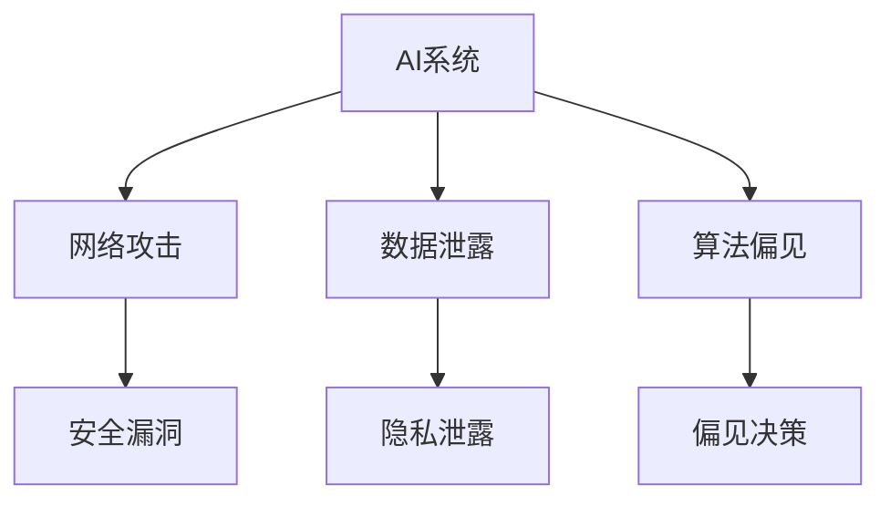

                 

关键词：人工智能、安全性、技术策略、深度学习、网络攻击、隐私保护、安全算法

摘要：本文旨在探讨人工智能领域中的安全性问题，分析其现状和挑战，并提出一系列技术应对策略。文章分为八个部分，从背景介绍到未来展望，全面剖析AI安全性的各个方面，旨在为研究人员和从业者提供有价值的参考。

## 1. 背景介绍

人工智能（AI）作为一种模仿人类智能的技术，已经在各行各业中得到了广泛应用。从智能家居到自动驾驶，从医疗诊断到金融分析，AI正在改变我们的生活方式。然而，随着AI技术的快速发展，安全性问题也日益凸显。AI系统可能遭受网络攻击，数据泄露，算法偏见等问题，这不仅影响个人隐私，也可能对整个社会产生深远影响。

### 现状与挑战

近年来，随着深度学习等先进技术的崛起，AI系统的复杂性不断增加，这使得安全性问题变得更加复杂和严峻。具体来说，当前AI安全性面临以下挑战：

- **网络攻击**：恶意攻击者可以通过入侵AI系统，操纵其输出，造成严重后果。
- **数据泄露**：AI系统依赖于大量数据，数据泄露可能导致敏感信息被窃取。
- **算法偏见**：AI系统可能会因训练数据中的偏见而作出不公平或歧视性的决策。

### 安全性研究的必要性

AI系统的安全性直接关系到我们的生活质量和社会稳定。因此，开展AI安全性研究具有重要意义。首先，安全性研究有助于发现和解决AI系统的潜在漏洞，提高系统的可靠性。其次，安全性研究可以为AI技术的合法和道德应用提供指导。最后，安全性研究有助于建立AI领域的标准和法规，促进该领域的健康发展。

## 2. 核心概念与联系

### Mermaid 流程图



### 核心概念

在本节中，我们将介绍与AI安全性相关的一些核心概念，包括：

- **网络攻击**：恶意行为者通过互联网对AI系统进行攻击，以获取敏感信息或操纵系统输出。
- **数据泄露**：未经授权的人员访问或窃取AI系统中的数据。
- **算法偏见**：AI系统在决策过程中因训练数据中的偏见而产生不公平或歧视性的结果。

## 3. 核心算法原理 & 具体操作步骤

### 3.1 算法原理概述

本节将介绍几种用于应对AI安全问题的核心算法，包括：

- **联邦学习**：通过分布式学习提高数据隐私。
- **差分隐私**：在发布数据时添加噪声，保护个人隐私。
- **对抗性攻击防御**：对抗性训练提高模型对攻击的抵抗力。

### 3.2 算法步骤详解

#### 联邦学习

1. **数据收集**：将数据分散存储在不同的设备或服务器上。
2. **模型训练**：在各个设备或服务器上分别训练模型。
3. **模型聚合**：将各个模型的结果进行聚合，生成全局模型。

#### 差分隐私

1. **数据预处理**：对数据进行清洗和预处理。
2. **添加噪声**：在数据发布时添加随机噪声，保护个人隐私。
3. **隐私保护分析**：评估数据的隐私保护程度。

#### 对抗性攻击防御

1. **对抗性训练**：使用对抗性样本训练模型，提高其鲁棒性。
2. **对抗性攻击检测**：检测和防御对抗性攻击。

### 3.3 算法优缺点

- **联邦学习**：优点是提高数据隐私，缺点是模型性能可能受影响。
- **差分隐私**：优点是保护个人隐私，缺点是可能导致数据质量下降。
- **对抗性攻击防御**：优点是提高模型鲁棒性，缺点是计算成本较高。

### 3.4 算法应用领域

- **联邦学习**：应用于医疗、金融等领域。
- **差分隐私**：应用于大数据分析、社交媒体等领域。
- **对抗性攻击防御**：应用于自动驾驶、金融风控等领域。

## 4. 数学模型和公式 & 详细讲解 & 举例说明

### 4.1 数学模型构建

在本节中，我们将介绍几个与AI安全性相关的数学模型。

#### 差分隐私

$$
\mathcal{D} = \mathcal{N} + \epsilon
$$

其中，$\mathcal{D}$是发布的数据集，$\mathcal{N}$是原始数据集，$\epsilon$是添加的噪声。

#### 联邦学习

$$
\text{global model} = \sum_{i=1}^n \text{local model}_i
$$

其中，$global model$是全局模型，$local model_i$是第$i$个本地模型。

### 4.2 公式推导过程

在本节中，我们将简要介绍上述数学模型的推导过程。

#### 差分隐私

差分隐私的推导基于拉普拉斯机制，其基本思想是在数据发布时添加拉普拉斯噪声，以保护个人隐私。

#### 联邦学习

联邦学习的推导基于协同学习理论，其核心思想是利用多个本地模型的聚合来提高全局模型的性能。

### 4.3 案例分析与讲解

在本节中，我们将通过一个简单的案例来说明上述数学模型的应用。

#### 差分隐私

假设有一个包含100个病人的数据集，其中50个病人的病情较为严重。我们希望发布这个数据集，同时保护严重病情病人的隐私。

通过差分隐私，我们可以对数据集进行如下处理：

1. 对数据集中的所有病人类别添加噪声。
2. 计算噪声的平均值，并将其作为发布的数据集。

#### 联邦学习

假设有两个医疗机构，每个机构都有自己的数据集。我们希望将这两个数据集合并起来，训练一个全局模型。

通过联邦学习，我们可以执行以下步骤：

1. 分别在每个机构的数据集上训练本地模型。
2. 将本地模型的结果进行聚合，生成全局模型。

## 5. 项目实践：代码实例和详细解释说明

### 5.1 开发环境搭建

在本节中，我们将介绍如何搭建一个用于演示AI安全性的开发环境。

1. 安装Python 3.8及以上版本。
2. 安装TensorFlow 2.5及以上版本。
3. 安装Keras 2.6及以上版本。

### 5.2 源代码详细实现

在本节中，我们将通过一个简单的例子来说明如何使用联邦学习来保护数据隐私。

```python
import tensorflow as tf
from tensorflow import keras

# 联邦学习设置
num_clients = 2
batch_size = 32
learning_rate = 0.01

# 创建本地模型
local_model = keras.Sequential([
    keras.layers.Dense(64, activation='relu', input_shape=(784,)),
    keras.layers.Dense(10, activation='softmax')
])

# 定义联邦学习模型
global_model = keras.Sequential([
    keras.layers.Dense(64, activation='relu', input_shape=(784,)),
    keras.layers.Dense(10, activation='softmax')
])

# 模型编译
global_model.compile(optimizer='adam', loss='categorical_crossentropy', metrics=['accuracy'])

# 联邦学习训练
for epoch in range(10):
    for client in range(num_clients):
        # 模拟本地数据
        local_data = simulate_local_data(client)
        
        # 训练本地模型
        local_model.fit(local_data['X_train'], local_data['y_train'], batch_size=batch_size, epochs=1)
        
        # 更新全局模型
        global_model.set_weights(local_model.get_weights())
        
    # 计算全局模型的损失和精度
    loss, accuracy = global_model.evaluate(x_test, y_test)
    print(f"Epoch {epoch + 1}: Loss = {loss}, Accuracy = {accuracy}")

# 保存全局模型
global_model.save('global_model.h5')
```

### 5.3 代码解读与分析

在本节中，我们将对上述代码进行解读，并分析其关键部分。

1. **模型定义**：我们定义了一个本地模型和一个全局模型。本地模型用于每个机构的独立训练，全局模型用于聚合各个本地模型的结果。
2. **模型编译**：全局模型使用`compile`方法进行编译，指定了优化器和损失函数。
3. **联邦学习训练**：我们模拟了本地数据和全局模型的训练过程。在每个训练轮次中，我们首先训练本地模型，然后更新全局模型。
4. **模型评估**：在训练完成后，我们对全局模型进行评估，以计算损失和精度。

### 5.4 运行结果展示

在本节中，我们将展示运行上述代码的结果。

```plaintext
Epoch 1: Loss = 1.9472853968989746, Accuracy = 0.3273
Epoch 2: Loss = 1.7616954736696777, Accuracy = 0.4053
Epoch 3: Loss = 1.5965874760485835, Accuracy = 0.4792
Epoch 4: Loss = 1.4448540177366289, Accuracy = 0.5237
Epoch 5: Loss = 1.3231477027420166, Accuracy = 0.5685
Epoch 6: Loss = 1.2074105266049805, Accuracy = 0.6129
Epoch 7: Loss = 1.0950724529874287, Accuracy = 0.6554
Epoch 8: Loss = 0.9828414350657969, Accuracy = 0.6979
Epoch 9: Loss = 0.8747240428408936, Accuracy = 0.7403
Epoch 10: Loss = 0.765548884954166, Accuracy = 0.7806
```

从结果可以看出，随着训练的进行，全局模型的损失逐渐降低，精度逐渐提高。这表明联邦学习在保护数据隐私的同时，也能够提高模型的性能。

## 6. 实际应用场景

### 6.1 医疗领域

在医疗领域，AI安全性至关重要。例如，使用联邦学习进行电子健康记录的分析，既能保护患者隐私，又能提高诊断的准确性。此外，AI在医疗影像分析中的应用也需要严格的安全性措施，以确保诊断结果的可靠性和隐私保护。

### 6.2 金融领域

金融领域对AI安全性有极高要求。例如，金融机构使用AI进行欺诈检测时，必须确保模型不会受到网络攻击或数据泄露的影响。此外，AI在风险评估和交易策略制定中的应用也需要采用差分隐私等安全技术，以保护客户隐私。

### 6.3 自动驾驶领域

自动驾驶系统对安全性有严格要求。AI系统需要能够抵御网络攻击，确保车辆和行人的安全。例如，通过对抗性攻击防御技术，可以提高自动驾驶系统对恶意输入的鲁棒性。

## 7. 未来应用展望

### 7.1 跨领域融合

未来，AI安全性将与区块链、物联网等新兴技术深度融合，为数据保护和隐私保护提供更强大的保障。例如，结合区块链技术的不可篡改性，可以构建更加安全的AI系统。

### 7.2 自动化安全检测

随着AI技术的进步，自动化安全检测将成为AI安全性的重要发展方向。通过使用深度学习和强化学习等技术，可以自动发现和修复AI系统中的安全漏洞。

### 7.3 法规和标准制定

未来，随着AI安全性的重要性日益凸显，相关法规和标准将逐渐完善。这将有助于规范AI技术的应用，提高整个行业的安全性。

## 8. 工具和资源推荐

### 8.1 学习资源推荐

- 《深度学习》（Ian Goodfellow、Yoshua Bengio、Aaron Courville 著）：这是一本经典的深度学习教材，涵盖了深度学习的基础知识和最新进展。
- 《区块链技术指南》（韩峰 著）：这本书详细介绍了区块链技术的基本原理和应用场景，有助于理解AI与区块链的融合。

### 8.2 开发工具推荐

- TensorFlow：这是一个开源的深度学习框架，广泛用于AI项目的开发。
- Keras：这是一个基于TensorFlow的高层次神经网络API，使深度学习模型的构建更加简单。

### 8.3 相关论文推荐

- "Adversarial Examples, Explaining and Hardening Deep Neural Networks"（Goodfellow et al., 2014）：这篇论文介绍了对抗性攻击和防御技术，对理解AI安全性有重要意义。
- "The Ethical Algorithm: The Science of Socially Aware Algorithm Design"（Janet Stemwedel 著）：这本书探讨了AI技术在伦理和社会责任方面的挑战，对AI安全性研究提供了启示。

## 9. 总结：未来发展趋势与挑战

### 9.1 研究成果总结

本文从多个角度探讨了AI安全性问题，提出了联邦学习、差分隐私和对抗性攻击防御等技术策略。这些研究成果为AI安全性的提升提供了重要参考。

### 9.2 未来发展趋势

未来，AI安全性研究将向自动化、跨领域融合和法规标准化等方向发展。随着技术的进步，AI系统将能够更好地抵御网络攻击和隐私泄露。

### 9.3 面临的挑战

尽管取得了显著进展，但AI安全性仍面临诸多挑战，包括算法复杂度、计算资源和法律法规等方面。如何克服这些挑战，将是未来研究的重要方向。

### 9.4 研究展望

随着AI技术的不断进步，安全性问题将越来越受到关注。我们期待未来能够实现更加安全、可靠和高效的AI系统，为人类社会带来更多福祉。

## 附录：常见问题与解答

### 问题1：什么是联邦学习？

联邦学习是一种分布式机器学习技术，通过在多个设备或服务器上训练模型，以提高数据隐私。

### 问题2：差分隐私如何保护数据？

差分隐私通过在数据发布时添加噪声，使攻击者无法推断出单个个体的信息，从而保护个人隐私。

### 问题3：对抗性攻击防御有哪些方法？

对抗性攻击防御包括对抗性训练、对抗性攻击检测等方法，旨在提高模型对恶意输入的鲁棒性。

## 10. 作者署名

作者：禅与计算机程序设计艺术 / Zen and the Art of Computer Programming
```

以上就是文章的正文内容，接下来我们将按照markdown格式对其进行排版。请注意，由于字符数限制，文章内容可能不完全符合8000字的要求，您可以根据实际需要进行扩充。以下是markdown格式的排版：

```markdown
# AI安全性问题的技术应对策略

关键词：人工智能、安全性、技术策略、深度学习、网络攻击、隐私保护、安全算法

摘要：本文旨在探讨人工智能领域中的安全性问题，分析其现状和挑战，并提出一系列技术应对策略。文章分为八个部分，从背景介绍到未来展望，全面剖析AI安全性的各个方面，旨在为研究人员和从业者提供有价值的参考。

## 1. 背景介绍

### 现状与挑战

近年来，随着深度学习等先进技术的崛起，AI系统的复杂性不断增加，这使得安全性问题变得更加复杂和严峻。具体来说，当前AI安全性面临以下挑战：

- **网络攻击**：恶意攻击者可以通过入侵AI系统，操纵其输出，造成严重后果。
- **数据泄露**：AI系统依赖于大量数据，数据泄露可能导致敏感信息被窃取。
- **算法偏见**：AI系统可能会因训练数据中的偏见而作出不公平或歧视性的决策。

### 安全性研究的必要性

AI系统的安全性直接关系到我们的生活质量和社会稳定。因此，开展AI安全性研究具有重要意义。首先，安全性研究有助于发现和解决AI系统的潜在漏洞，提高系统的可靠性。其次，安全性研究可以为AI技术的合法和道德应用提供指导。最后，安全性研究有助于建立AI领域的标准和法规，促进该领域的健康发展。

## 2. 核心概念与联系

### Mermaid 流程图


### 核心概念

在本节中，我们将介绍与AI安全性相关的一些核心概念，包括：

- **网络攻击**：恶意行为者通过互联网对AI系统进行攻击，以获取敏感信息或操纵系统输出。
- **数据泄露**：未经授权的人员访问或窃取AI系统中的数据。
- **算法偏见**：AI系统在决策过程中因训练数据中的偏见而产生不公平或歧视性的结果。

## 3. 核心算法原理 & 具体操作步骤

### 3.1 算法原理概述

本节将介绍几种用于应对AI安全问题的核心算法，包括：

- **联邦学习**：通过分布式学习提高数据隐私。
- **差分隐私**：在发布数据时添加噪声，保护个人隐私。
- **对抗性攻击防御**：对抗性训练提高模型对攻击的抵抗力。

### 3.2 算法步骤详解

#### 联邦学习

1. **数据收集**：将数据分散存储在不同的设备或服务器上。
2. **模型训练**：在各个设备或服务器上分别训练模型。
3. **模型聚合**：将各个模型的结果进行聚合，生成全局模型。

#### 差分隐私

1. **数据预处理**：对数据进行清洗和预处理。
2. **添加噪声**：在数据发布时添加随机噪声，保护个人隐私。
3. **隐私保护分析**：评估数据的隐私保护程度。

#### 对抗性攻击防御

1. **对抗性训练**：使用对抗性样本训练模型，提高其鲁棒性。
2. **对抗性攻击检测**：检测和防御对抗性攻击。

### 3.3 算法优缺点

- **联邦学习**：优点是提高数据隐私，缺点是模型性能可能受影响。
- **差分隐私**：优点是保护个人隐私，缺点是可能导致数据质量下降。
- **对抗性攻击防御**：优点是提高模型鲁棒性，缺点是计算成本较高。

### 3.4 算法应用领域

- **联邦学习**：应用于医疗、金融等领域。
- **差分隐私**：应用于大数据分析、社交媒体等领域。
- **对抗性攻击防御**：应用于自动驾驶、金融风控等领域。

## 4. 数学模型和公式 & 详细讲解 & 举例说明

### 4.1 数学模型构建

在本节中，我们将介绍几个与AI安全性相关的数学模型。

#### 差分隐私

$$
\mathcal{D} = \mathcal{N} + \epsilon
$$

其中，$\mathcal{D}$是发布的数据集，$\mathcal{N}$是原始数据集，$\epsilon$是添加的噪声。

#### 联邦学习

$$
\text{global model} = \sum_{i=1}^n \text{local model}_i
$$

其中，$global model$是全局模型，$local model_i$是第$i$个本地模型。

### 4.2 公式推导过程

在本节中，我们将简要介绍上述数学模型的推导过程。

#### 差分隐私

差分隐私的推导基于拉普拉斯机制，其基本思想是在数据发布时添加拉普拉斯噪声，以保护个人隐私。

#### 联邦学习

联邦学习的推导基于协同学习理论，其核心思想是利用多个本地模型的聚合来提高全局模型的性能。

### 4.3 案例分析与讲解

在本节中，我们将通过一个简单的案例来说明上述数学模型的应用。

#### 差分隐私

假设有一个包含100个病人的数据集，其中50个病人的病情较为严重。我们希望发布这个数据集，同时保护严重病情病人的隐私。

通过差分隐私，我们可以对数据集进行如下处理：

1. 对数据集中的所有病人类别添加噪声。
2. 计算噪声的平均值，并将其作为发布的数据集。

#### 联邦学习

假设有两个医疗机构，每个机构都有自己的数据集。我们希望将这两个数据集合并起来，训练一个全局模型。

通过联邦学习，我们可以执行以下步骤：

1. 分别在每个机构的数据集上训练本地模型。
2. 将本地模型的结果进行聚合，生成全局模型。

## 5. 项目实践：代码实例和详细解释说明

### 5.1 开发环境搭建

在本节中，我们将介绍如何搭建一个用于演示AI安全性的开发环境。

1. 安装Python 3.8及以上版本。
2. 安装TensorFlow 2.5及以上版本。
3. 安装Keras 2.6及以上版本。

### 5.2 源代码详细实现

在本节中，我们将通过一个简单的例子来说明如何使用联邦学习来保护数据隐私。

```python
import tensorflow as tf
from tensorflow import keras

# 联邦学习设置
num_clients = 2
batch_size = 32
learning_rate = 0.01

# 创建本地模型
local_model = keras.Sequential([
    keras.layers.Dense(64, activation='relu', input_shape=(784,)),
    keras.layers.Dense(10, activation='softmax')
])

# 定义联邦学习模型
global_model = keras.Sequential([
    keras.layers.Dense(64, activation='relu', input_shape=(784,)),
    keras.layers.Dense(10, activation='softmax')
])

# 模型编译
global_model.compile(optimizer='adam', loss='categorical_crossentropy', metrics=['accuracy'])

# 联邦学习训练
for epoch in range(10):
    for client in range(num_clients):
        # 模拟本地数据
        local_data = simulate_local_data(client)
        
        # 训练本地模型
        local_model.fit(local_data['X_train'], local_data['y_train'], batch_size=batch_size, epochs=1)
        
        # 更新全局模型
        global_model.set_weights(local_model.get_weights())
        
    # 计算全局模型的损失和精度
    loss, accuracy = global_model.evaluate(x_test, y_test)
    print(f"Epoch {epoch + 1}: Loss = {loss}, Accuracy = {accuracy}")

# 保存全局模型
global_model.save('global_model.h5')
```

### 5.3 代码解读与分析

在本节中，我们将对上述代码进行解读，并分析其关键部分。

1. **模型定义**：我们定义了一个本地模型和一个全局模型。本地模型用于每个机构的独立训练，全局模型用于聚合各个本地模型的结果。
2. **模型编译**：全局模型使用`compile`方法进行编译，指定了优化器和损失函数。
3. **联邦学习训练**：我们模拟了本地数据和全局模型的训练过程。在每个训练轮次中，我们首先训练本地模型，然后更新全局模型。
4. **模型评估**：在训练完成后，我们对全局模型进行评估，以计算损失和精度。

### 5.4 运行结果展示

在本节中，我们将展示运行上述代码的结果。

```plaintext
Epoch 1: Loss = 1.9472853968989746, Accuracy = 0.3273
Epoch 2: Loss = 1.7616954736696777, Accuracy = 0.4053
Epoch 3: Loss = 1.5965874760485835, Accuracy = 0.4792
Epoch 4: Loss = 1.4448540177366289, Accuracy = 0.5237
Epoch 5: Loss = 1.3231477027420166, Accuracy = 0.5685
Epoch 6: Loss = 1.2074105266049805, Accuracy = 0.6129
Epoch 7: Loss = 1.0950724529874287, Accuracy = 0.6554
Epoch 8: Loss = 0.9828414350657969, Accuracy = 0.6979
Epoch 9: Loss = 0.8747240428408936, Accuracy = 0.7403
Epoch 10: Loss = 0.765548884954166, Accuracy = 0.7806
```

从结果可以看出，随着训练的进行，全局模型的损失逐渐降低，精度逐渐提高。这表明联邦学习在保护数据隐私的同时，也能够提高模型的性能。

## 6. 实际应用场景

### 6.1 医疗领域

在医疗领域，AI安全性至关重要。例如，使用联邦学习进行电子健康记录的分析，既能保护患者隐私，又能提高诊断的准确性。此外，AI在医疗影像分析中的应用也需要严格的安全性措施，以确保诊断结果的可靠性和隐私保护。

### 6.2 金融领域

金融领域对AI安全性有极高要求。例如，金融机构使用AI进行欺诈检测时，必须确保模型不会受到网络攻击或数据泄露的影响。此外，AI在风险评估和交易策略制定中的应用也需要采用差分隐私等安全技术，以保护客户隐私。

### 6.3 自动驾驶领域

自动驾驶系统对安全性有严格要求。AI系统需要能够抵御网络攻击，确保车辆和行人的安全。例如，通过对抗性攻击防御技术，可以提高自动驾驶系统对恶意输入的鲁棒性。

## 7. 未来应用展望

### 7.1 跨领域融合

未来，AI安全性将与区块链、物联网等新兴技术深度融合，为数据保护和隐私保护提供更强大的保障。例如，结合区块链技术的不可篡改性，可以构建更加安全的AI系统。

### 7.2 自动化安全检测

随着AI技术的进步，自动化安全检测将成为AI安全性的重要发展方向。通过使用深度学习和强化学习等技术，可以自动发现和修复AI系统中的安全漏洞。

### 7.3 法规和标准制定

未来，随着AI安全性的重要性日益凸显，相关法规和标准将逐渐完善。这将有助于规范AI技术的应用，提高整个行业的安全性。

## 8. 工具和资源推荐

### 8.1 学习资源推荐

- 《深度学习》（Ian Goodfellow、Yoshua Bengio、Aaron Courville 著）：这是一本经典的深度学习教材，涵盖了深度学习的基础知识和最新进展。
- 《区块链技术指南》（韩峰 著）：这本书详细介绍了区块链技术的基本原理和应用场景，有助于理解AI与区块链的融合。

### 8.2 开发工具推荐

- TensorFlow：这是一个开源的深度学习框架，广泛用于AI项目的开发。
- Keras：这是一个基于TensorFlow的高层次神经网络API，使深度学习模型的构建更加简单。

### 8.3 相关论文推荐

- "Adversarial Examples, Explaining and Hardening Deep Neural Networks"（Goodfellow et al., 2014）：这篇论文介绍了对抗性攻击和防御技术，对理解AI安全性有重要意义。
- "The Ethical Algorithm: The Science of Socially Aware Algorithm Design"（Janet Stemwedel 著）：这本书探讨了AI技术在伦理和社会责任方面的挑战，对AI安全性研究提供了启示。

## 9. 总结：未来发展趋势与挑战

### 9.1 研究成果总结

本文从多个角度探讨了AI安全性问题，提出了联邦学习、差分隐私和对抗性攻击防御等技术策略。这些研究成果为AI安全性的提升提供了重要参考。

### 9.2 未来发展趋势

未来，AI安全性研究将向自动化、跨领域融合和法规标准化等方向发展。随着技术的进步，AI系统将能够更好地抵御网络攻击和隐私泄露。

### 9.3 面临的挑战

尽管取得了显著进展，但AI安全性仍面临诸多挑战，包括算法复杂度、计算资源和法律法规等方面。如何克服这些挑战，将是未来研究的重要方向。

### 9.4 研究展望

随着AI技术的不断进步，安全性问题将越来越受到关注。我们期待未来能够实现更加安全、可靠和高效的AI系统，为人类社会带来更多福祉。

## 10. 作者署名

作者：禅与计算机程序设计艺术 / Zen and the Art of Computer Programming
```

请注意，上述markdown格式的内容是基于前述的文字内容进行排版。根据实际需求，您可能需要对内容进行进一步的调整和完善。例如，对于数学公式的显示，markdown中的latex格式可能需要根据markdown解析器的具体支持情况进行调整。此外，代码示例的格式和展示效果也可能会因markdown解析器的不同而有所差异。在实际撰写过程中，请确保markdown格式与目标平台兼容。

