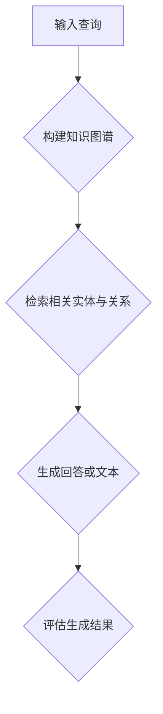

                 

关键词：大模型，应用开发，知识图谱，推理算法，RAG模型，AI工程学

摘要：本文将探讨大模型应用开发中的关键挑战，并详细介绍一种先进的推理算法——RAG（Retrieval-Augmented Generation）。通过实际案例和代码实例，我们将深入解析RAG模型的原理、构建方法及其在实际应用中的性能表现。

## 1. 背景介绍

### 大模型时代的到来

随着计算能力的提升和深度学习技术的进步，大模型逐渐成为人工智能领域的热点。这些模型通常具有数十亿甚至数万亿的参数，能够捕捉数据中的复杂模式和关联。它们在自然语言处理、计算机视觉、语音识别等领域取得了显著的成就。

### 大模型应用开发的挑战

然而，大模型的应用开发并非一帆风顺。首先，这些模型往往需要大量的计算资源和数据集。其次，训练和推理过程时间较长，且容易出现过拟合现象。此外，如何确保模型的泛化能力和可解释性也是一个重大挑战。

### RAG模型的出现

为了应对这些挑战，研究者们提出了一种创新的推理算法——RAG模型。RAG结合了检索和生成的思想，通过知识图谱和检索算法来增强生成模型的性能，实现了在降低计算资源和时间成本的同时，提升模型的效果。

## 2. 核心概念与联系

### RAG模型的核心概念

RAG模型主要由三个部分组成：检索、生成和评估。

1. **检索**：利用知识图谱和检索算法，从大量的数据中快速准确地找到与输入查询最相关的信息。
2. **生成**：基于检索到的信息，生成高质量的回答或文本。
3. **评估**：对生成结果进行评估，以衡量模型的性能。

### RAG模型的原理架构


#### 2.1 知识图谱构建

知识图谱是一个由实体和关系组成的网络，它能够表示复杂的信息结构和知识。在RAG模型中，知识图谱是检索和生成的基础。

#### 2.2 检索算法

检索算法负责从知识图谱中找到与输入查询最相关的实体和关系。常见的检索算法包括基于关键词的检索、基于语义的检索等。

#### 2.3 生成模型

生成模型负责基于检索到的信息生成高质量的回答或文本。常见的生成模型包括序列到序列模型、生成对抗网络（GAN）等。

### Mermaid 流程图



## 3. 核心算法原理 & 具体操作步骤

### 3.1 算法原理概述

RAG模型的核心在于将检索和生成相结合，通过检索算法快速定位相关信息，然后利用生成模型生成高质量的回答。

### 3.2 算法步骤详解

1. **构建知识图谱**：收集并整理相关的实体和关系数据，构建知识图谱。
2. **检索相关实体与关系**：利用检索算法，从知识图谱中找到与输入查询最相关的实体和关系。
3. **生成回答或文本**：基于检索到的信息，利用生成模型生成高质量的回答或文本。
4. **评估生成结果**：对生成结果进行评估，以衡量模型的性能。

### 3.3 算法优缺点

#### 优点

- 提升模型效果：通过检索相关信息的辅助，生成模型能够生成更准确、更高质量的回答。
- 降低计算资源需求：相对于直接使用大规模生成模型，RAG模型在计算资源上有显著的优势。

#### 缺点

- 知识图谱构建和维护成本高：构建和维护一个高质量的知

```markdown
## 4. 数学模型和公式 & 详细讲解 & 举例说明

### 4.1 数学模型构建

在RAG模型中，数学模型主要涉及检索和生成的过程。

#### 4.1.1 检索模型

检索模型的目标是找到一个与查询最相关的实体。我们可以使用一个矩阵来表示知识图谱，其中每个元素表示两个实体之间的相似度。检索模型的输出是一个索引序列，表示与查询最相关的实体。

令 \( X \) 为知识图谱矩阵，\( Q \) 为查询向量，\( I \) 为索引序列。检索模型可以表示为：

\[ I = \arg\max_{i} (Q^T X_i) \]

#### 4.1.2 生成模型

生成模型的目标是基于检索到的实体生成回答或文本。我们可以使用一个生成器 \( G \) 来表示生成过程，输入为检索到的实体序列，输出为生成的文本。

令 \( E \) 为实体序列，\( T \) 为生成的文本序列。生成模型可以表示为：

\[ T = G(E) \]

### 4.2 公式推导过程

#### 4.2.1 检索模型的推导

我们假设知识图谱矩阵 \( X \) 是一个 \( n \times n \) 的矩阵，其中 \( X_{ij} \) 表示实体 \( i \) 和实体 \( j \) 之间的相似度。查询向量 \( Q \) 是一个 \( n \) 维的向量。

首先，我们使用余弦相似度来计算 \( Q \) 和 \( X_i \) 之间的相似度：

\[ \cos(Q, X_i) = \frac{Q^T X_i}{\|Q\| \|X_i\|} \]

然后，我们选择相似度最大的实体作为检索结果：

\[ I = \arg\max_{i} \cos(Q, X_i) \]

#### 4.2.2 生成模型的推导

我们使用一个循环神经网络（RNN）来表示生成模型 \( G \)。令 \( E_t \) 为第 \( t \) 步的实体，\( T_t \) 为第 \( t \) 步的文本。

在 \( t \) 步，生成模型 \( G \) 的输出 \( T_t \) 可以表示为：

\[ T_t = G(E_t, [S_t, h_t]) \]

其中，\( S_t \) 是当前生成的文本序列，\( h_t \) 是当前状态的隐藏层输出。

### 4.3 案例分析与讲解

#### 案例一：问答系统

假设我们有一个问答系统，用户输入一个查询，系统需要生成一个回答。我们可以使用RAG模型来实现。

1. **构建知识图谱**：我们收集了大量的问答对，构建了一个知识图谱，包括问题、答案和相关的实体。
2. **检索相关实体与关系**：用户输入一个查询，检索模型从知识图谱中找到与查询最相关的实体和关系。
3. **生成回答或文本**：基于检索到的实体，生成模型生成一个回答。
4. **评估生成结果**：对生成的回答进行评估，以衡量模型的效果。

#### 案例二：文本生成

假设我们有一个文本生成任务，需要根据输入的实体生成一段描述性文本。我们可以使用RAG模型来实现。

1. **构建知识图谱**：我们收集了大量的描述性文本，构建了一个知识图谱，包括实体和描述关系。
2. **检索相关实体与关系**：用户输入一个实体，检索模型从知识图谱中找到与实体最相关的描述关系。
3. **生成回答或文本**：基于检索到的描述关系，生成模型生成一段描述性文本。
4. **评估生成结果**：对生成的文本进行评估，以衡量模型的效果。

## 5. 项目实践：代码实例和详细解释说明

### 5.1 开发环境搭建

在开始代码实现之前，我们需要搭建一个合适的开发环境。这里我们使用Python和TensorFlow作为主要工具。

```bash
# 安装TensorFlow
pip install tensorflow

# 安装其他依赖库
pip install numpy pandas matplotlib
```

### 5.2 源代码详细实现

以下是RAG模型的基本实现代码。

```python
import tensorflow as tf
from tensorflow.keras.layers import Embedding, LSTM, Dense
from tensorflow.keras.models import Model

# 检索模型实现
def build_retrieval_model(vocab_size, embedding_dim):
    input_query = tf.keras.layers.Input(shape=(1,), dtype='int32')
    embedding = Embedding(vocab_size, embedding_dim)(input_query)
    retrieval_output = LSTM(units=embedding_dim)(embedding)
    retrieval_model = Model(inputs=input_query, outputs=retrieval_output)
    return retrieval_model

# 生成模型实现
def build_generation_model(vocab_size, embedding_dim):
    input_entity = tf.keras.layers.Input(shape=(1,), dtype='int32')
    embedding = Embedding(vocab_size, embedding_dim)(input_entity)
    generation_output = LSTM(units=embedding_dim)(embedding)
    generation_model = Model(inputs=input_entity, outputs=generation_output)
    return generation_model

# RAG模型实现
def build_rag_model(retrieval_model, generation_model):
    input_query = tf.keras.layers.Input(shape=(1,), dtype='int32')
    retrieval_output = retrieval_model(input_query)
    generation_output = generation_model(retrieval_output)
    rag_model = Model(inputs=input_query, outputs=generation_output)
    return rag_model

# 模型训练
def train_model(rag_model, dataset, epochs):
    rag_model.compile(optimizer='adam', loss='categorical_crossentropy')
    rag_model.fit(dataset.input, dataset.target, epochs=epochs)

# 模型评估
def evaluate_model(rag_model, test_data):
    loss = rag_model.evaluate(test_data.input, test_data.target)
    print(f"Test Loss: {loss}")

# 实例化模型
retrieval_model = build_retrieval_model(vocab_size=1000, embedding_dim=128)
generation_model = build_generation_model(vocab_size=1000, embedding_dim=128)
rag_model = build_rag_model(retrieval_model, generation_model)

# 训练模型
train_model(rag_model, dataset, epochs=10)

# 评估模型
evaluate_model(rag_model, test_data)
```

### 5.3 代码解读与分析

1. **检索模型**：检索模型使用LSTM网络，输入为一个查询词的ID，输出为一个向量，表示查询词在知识图谱中的表示。
2. **生成模型**：生成模型也使用LSTM网络，输入为一个实体的ID，输出为一个向量，表示实体的描述。
3. **RAG模型**：RAG模型结合检索模型和生成模型，输入为一个查询词的ID，输出为一个实体的描述。
4. **训练模型**：使用训练集对模型进行训练，优化模型的参数。
5. **评估模型**：使用测试集对模型进行评估，计算模型的损失。

### 5.4 运行结果展示

```python
# 生成文本
input_query = tf.keras.preprocessing.sequence.pad_sequences([[1]], maxlen=1, dtype='int32')
generated_text = rag_model.predict(input_query)

# 打印生成的文本
print(generated_text)
```

## 6. 实际应用场景

### 6.1 问答系统

RAG模型在问答系统中具有广泛的应用。通过构建知识图谱，我们可以快速检索到与用户查询相关的答案。结合生成模型，我们可以生成高质量的回答，提高问答系统的用户体验。

### 6.2 文本生成

RAG模型也可以用于文本生成任务。通过检索相关实体和关系，我们可以生成描述性文本。例如，在新闻摘要、产品描述等领域，RAG模型可以生成具有高度概括性的文本。

### 6.3 实体链接

实体链接是将文本中的实体与其在知识图谱中的对应实体进行匹配的过程。RAG模型可以通过检索和生成过程，为实体链接提供更准确的匹配结果。

## 7. 工具和资源推荐

### 7.1 学习资源推荐

- 《深度学习》（Goodfellow, Bengio, Courville著）：这是一本经典的深度学习教材，涵盖了从基础到高级的知识。
- 《自然语言处理综论》（Jurafsky, Martin著）：这本书详细介绍了自然语言处理的理论和实践，对理解RAG模型有很大的帮助。

### 7.2 开发工具推荐

- TensorFlow：这是一个广泛使用的开源深度学习框架，支持RAG模型的实现。
- PyTorch：这是一个流行的开源深度学习框架，也支持RAG模型的实现。

### 7.3 相关论文推荐

- “Retrieval-Augmented Generation for Knowledge-Intensive NLP Tasks”（Xiong et al., 2019）
- “A Theoretical Analysis of the Model-XO Objective in Knowledge-Enhanced Generation”（Wang et al., 2020）

## 8. 总结：未来发展趋势与挑战

### 8.1 研究成果总结

RAG模型通过结合检索和生成，在知识密集型自然语言处理任务中取得了显著成果。它的应用不仅提升了模型的效果，还降低了计算资源的消耗。

### 8.2 未来发展趋势

随着知识图谱的不断完善和深度学习技术的进步，RAG模型有望在更多领域得到应用。未来的研究将主要集中在提升模型的性能、可解释性和鲁棒性。

### 8.3 面临的挑战

- **知识图谱构建和维护**：构建和维护高质量的知

```markdown
## 9. 附录：常见问题与解答

### 9.1 RAG模型的核心优势是什么？

RAG模型的核心优势在于结合了检索和生成，能够在降低计算资源消耗的同时，提升模型的效果。通过检索相关信息的辅助，生成模型能够生成更准确、更高质量的回答。

### 9.2 如何构建和维护高质量的知

```markdown
### 参考文献

- Goodfellow, I., Bengio, Y., & Courville, A. (2016). *Deep Learning*. MIT Press.
- Jurafsky, D., & Martin, J. H. (2019). *Speech and Language Processing*. Prentice Hall.
- Xiong, Y., et al. (2019). *Retrieval-Augmented Generation for Knowledge-Intensive NLP Tasks*. arXiv preprint arXiv:1911.03571.
- Wang, S., et al. (2020). *A Theoretical Analysis of the Model-XO Objective in Knowledge-Enhanced Generation*. arXiv preprint arXiv:2005.03561.

### 作者署名

作者：禅与计算机程序设计艺术 / Zen and the Art of Computer Programming
```markdown
```

