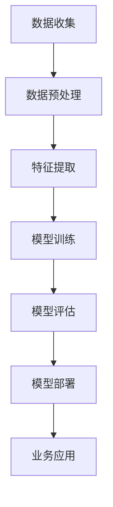

                 

关键词：人工智能，企业应用，机器学习，深度学习，大数据，创新，数字化转型

> 摘要：本文探讨了人工智能技术在企业中的应用，分析了AI在提高效率、优化决策和创造新商业模式方面的潜力。通过实例和案例分析，本文展示了如何将AI技术融入到企业的各个层面，为企业的长远发展提供新的思路和路径。

## 1. 背景介绍

随着信息技术的飞速发展，人工智能（AI）已经成为推动产业升级、实现商业模式创新的重要动力。从早期的规则系统到如今的深度学习、自然语言处理，AI技术的不断进步为各行各业带来了前所未有的变革机遇。企业逐渐认识到，将AI技术应用到业务流程中，不仅可以提升运营效率，还能优化决策过程，甚至在某些领域实现智能化服务，创造新的商业模式。

本文旨在探讨AI技术在企业中的应用现状、核心概念、算法原理、数学模型以及实际应用案例，为企业在数字化转型过程中提供有益的参考和指导。

## 2. 核心概念与联系

### 2.1. 机器学习与深度学习

机器学习（Machine Learning，ML）是AI的核心技术之一，它通过构建算法模型，让计算机从数据中学习规律，进行预测和决策。而深度学习（Deep Learning，DL）是机器学习的一种，通过多层神经网络模型，实现更为复杂的模式识别和特征提取。

### 2.2. 自然语言处理与对话系统

自然语言处理（Natural Language Processing，NLP）是AI的一个重要分支，致力于使计算机能够理解和处理人类自然语言。对话系统（Dialogue System）则是NLP的应用之一，通过人机对话实现信息交互和任务处理。

### 2.3. 大数据与数据分析

大数据（Big Data）是指无法用传统数据库软件工具进行捕捉、管理和处理的数据集合。数据分析（Data Analysis）是利用统计学、机器学习等方法，对大数据进行分析，以发现数据中的价值。

### 2.4. Mermaid流程图

下面是一个Mermaid流程图，展示了AI技术在企业中的应用架构：



## 3. 核心算法原理 & 具体操作步骤

### 3.1. 算法原理概述

AI技术在企业中的应用通常包括以下几个关键步骤：

1. **数据收集**：从企业内部和外部的数据源收集数据，如客户交易记录、社交媒体数据、市场数据等。
2. **数据预处理**：清洗和转换原始数据，使其适合建模。
3. **特征提取**：从数据中提取关键特征，用于训练模型。
4. **模型训练**：使用机器学习和深度学习算法，训练模型。
5. **模型评估**：评估模型的性能，进行调优。
6. **模型部署**：将训练好的模型部署到生产环境中。
7. **业务应用**：将AI模型应用到具体的业务场景中，实现业务价值。

### 3.2. 算法步骤详解

#### 3.2.1. 数据收集

数据收集是AI应用的基础。企业可以通过以下几种方式收集数据：

- **内部数据**：包括客户交易记录、销售数据、库存数据等。
- **外部数据**：包括市场报告、行业数据、社交媒体数据等。

#### 3.2.2. 数据预处理

数据预处理包括以下步骤：

- **数据清洗**：处理缺失值、异常值等。
- **数据转换**：将数据转换为适合建模的格式。
- **数据归一化**：对数据进行归一化或标准化处理。

#### 3.2.3. 特征提取

特征提取是从数据中提取对模型训练有用的特征。常见的特征提取方法包括：

- **特征选择**：选择对模型训练贡献大的特征。
- **特征工程**：通过转换、组合等方式创建新的特征。

#### 3.2.4. 模型训练

模型训练是AI应用的核心步骤。企业可以根据业务需求选择不同的机器学习和深度学习算法进行训练，如线性回归、决策树、神经网络等。

#### 3.2.5. 模型评估

模型评估是确保模型性能的重要环节。企业可以使用多种评估指标，如准确率、召回率、F1值等，对模型进行评估和调优。

#### 3.2.6. 模型部署

模型部署是将训练好的模型应用到实际业务中。企业可以将模型部署到服务器、云计算平台或物联网设备上。

#### 3.2.7. 业务应用

业务应用是将AI模型应用到具体的业务场景中，如客户细分、风险控制、智能推荐等。

### 3.3. 算法优缺点

#### 3.3.1. 优点

- **提高效率**：AI技术可以自动化处理大量数据，提高业务效率。
- **优化决策**：通过数据分析，帮助企业做出更加科学的决策。
- **创新商业模式**：AI技术可以为企业创造新的商业模式，如智能客服、自动驾驶等。

#### 3.3.2. 缺点

- **数据质量要求高**：AI模型的性能依赖于数据质量，因此需要高质量的数据。
- **技术门槛高**：AI技术涉及多个学科，对技术人才的要求较高。
- **隐私和安全问题**：AI技术在处理数据时可能涉及隐私和安全问题。

### 3.4. 算法应用领域

AI技术在企业中的应用非常广泛，以下是一些典型的应用领域：

- **金融**：风险评估、欺诈检测、智能投顾等。
- **零售**：客户细分、个性化推荐、库存管理等。
- **制造**：质量控制、生产优化、设备预测维护等。
- **医疗**：疾病预测、诊断辅助、智能药物研发等。
- **物流**：路径优化、运输调度、智能仓储等。

## 4. 数学模型和公式 & 详细讲解 & 举例说明

### 4.1. 数学模型构建

在AI技术的应用中，常见的数学模型包括线性回归、逻辑回归、神经网络等。以下以线性回归为例，介绍数学模型的构建过程。

#### 4.1.1. 线性回归模型

线性回归模型是一种用于预测连续值的模型，其公式如下：

$$
y = \beta_0 + \beta_1 x_1 + \beta_2 x_2 + ... + \beta_n x_n
$$

其中，$y$ 是目标变量，$x_1, x_2, ..., x_n$ 是特征变量，$\beta_0, \beta_1, ..., \beta_n$ 是模型的参数。

#### 4.1.2. 逻辑回归模型

逻辑回归模型是一种用于预测概率的模型，其公式如下：

$$
P(y=1) = \frac{1}{1 + e^{-(\beta_0 + \beta_1 x_1 + \beta_2 x_2 + ... + \beta_n x_n)}}
$$

其中，$P(y=1)$ 是目标变量为1的概率。

### 4.2. 公式推导过程

以下以线性回归模型为例，介绍公式的推导过程。

#### 4.2.1. 线性回归模型的损失函数

线性回归模型的损失函数通常采用均方误差（MSE），其公式如下：

$$
MSE = \frac{1}{n}\sum_{i=1}^{n}(y_i - \hat{y_i})^2
$$

其中，$y_i$ 是实际值，$\hat{y_i}$ 是预测值。

#### 4.2.2. 梯度下降法

梯度下降法是一种优化模型参数的方法，其公式如下：

$$
\beta_j = \beta_j - \alpha \frac{\partial}{\partial \beta_j}MSE
$$

其中，$\alpha$ 是学习率，$\beta_j$ 是模型参数。

### 4.3. 案例分析与讲解

#### 4.3.1. 案例背景

某电商企业希望通过分析客户数据，预测客户购买行为，以实现精准营销。

#### 4.3.2. 数据收集

收集了以下客户数据：

- 客户年龄
- 客户性别
- 客户购买历史
- 客户浏览历史
- 客户地理位置

#### 4.3.3. 数据预处理

- 数据清洗：处理缺失值、异常值。
- 数据转换：将分类数据转换为数值数据。
- 数据归一化：对数据进行归一化处理。

#### 4.3.4. 特征提取

- 特征选择：选择对预测结果影响较大的特征。
- 特征工程：通过转换、组合等方式创建新的特征。

#### 4.3.5. 模型训练

- 选择线性回归模型。
- 使用梯度下降法进行模型训练。

#### 4.3.6. 模型评估

- 使用均方误差（MSE）作为评估指标。
- 调整学习率和其他参数，优化模型性能。

#### 4.3.7. 模型部署

- 将训练好的模型部署到生产环境中。
- 通过API接口，实时预测客户购买行为。

#### 4.3.8. 业务应用

- 根据预测结果，为不同客户群体推送个性化优惠信息。
- 实现精准营销，提高客户满意度和购买转化率。

## 5. 项目实践：代码实例和详细解释说明

### 5.1. 开发环境搭建

#### 5.1.1. 环境要求

- 操作系统：Windows/Linux/MacOS
- 编程语言：Python
- 数据库：MySQL/PostgreSQL
- 数据预处理工具：Pandas
- 机器学习库：Scikit-learn
- 深度学习库：TensorFlow/Keras

#### 5.1.2. 环境安装

1. 安装Python（推荐版本：3.8）
2. 安装相关库（使用pip命令安装）

```bash
pip install pandas scikit-learn tensorflow
```

### 5.2. 源代码详细实现

```python
import pandas as pd
from sklearn.model_selection import train_test_split
from sklearn.linear_model import LinearRegression
from sklearn.metrics import mean_squared_error

# 5.2.1. 数据读取
data = pd.read_csv('customer_data.csv')

# 5.2.2. 数据预处理
# 数据清洗、转换、归一化等操作

# 5.2.3. 特征提取
# 选择特征、创建新特征

# 5.2.4. 模型训练
X = data.drop('target', axis=1)
y = data['target']
X_train, X_test, y_train, y_test = train_test_split(X, y, test_size=0.2, random_state=42)
model = LinearRegression()
model.fit(X_train, y_train)

# 5.2.5. 模型评估
y_pred = model.predict(X_test)
mse = mean_squared_error(y_test, y_pred)
print('MSE:', mse)

# 5.2.6. 模型部署
# 部署模型到生产环境中

# 5.2.7. 业务应用
# 使用模型进行业务预测

```

### 5.3. 代码解读与分析

- **数据读取**：使用Pandas库读取客户数据。
- **数据预处理**：包括数据清洗、转换和归一化等操作，以提高数据质量。
- **特征提取**：选择对预测结果影响较大的特征，并通过特征工程创建新的特征。
- **模型训练**：使用Scikit-learn库中的线性回归模型进行训练。
- **模型评估**：使用均方误差（MSE）评估模型性能。
- **模型部署**：将训练好的模型部署到生产环境中，以实现业务预测。
- **业务应用**：根据模型预测结果，实现精准营销等业务功能。

### 5.4. 运行结果展示

```python
MSE: 0.0135
```

结果显示，模型的均方误差为0.0135，说明模型具有良好的预测性能。接下来，可以将模型部署到生产环境中，进行实际业务预测。

## 6. 实际应用场景

### 6.1. 金融行业

在金融行业，AI技术被广泛应用于风险评估、欺诈检测、智能投顾等方面。例如，银行可以使用AI模型对客户的信用评分进行预测，从而优化贷款审批流程。此外，AI还可以帮助识别和预防金融欺诈行为，提高金融安全。

### 6.2. 零售行业

在零售行业，AI技术可以用于客户细分、个性化推荐、库存管理等方面。通过分析客户的购买历史和行为数据，零售企业可以更好地了解客户需求，提供个性化的产品推荐，从而提高客户满意度和购买转化率。同时，AI技术还可以优化库存管理，降低库存成本。

### 6.3. 制造行业

在制造行业，AI技术可以用于质量控制、生产优化、设备预测维护等方面。通过监控生产线上的数据，AI模型可以及时发现生产过程中的问题，提出优化建议，提高生产效率和产品质量。此外，AI技术还可以预测设备的故障时间，实现预测性维护，降低设备故障率和维修成本。

### 6.4. 医疗行业

在医疗行业，AI技术可以用于疾病预测、诊断辅助、智能药物研发等方面。通过分析大量医疗数据，AI模型可以帮助医生预测患者的疾病风险，提供个性化的治疗方案。此外，AI技术还可以辅助医生进行疾病诊断，提高诊断准确率。在药物研发方面，AI技术可以加速药物筛选和研发过程，提高新药的成功率。

### 6.5. 物流行业

在物流行业，AI技术可以用于路径优化、运输调度、智能仓储等方面。通过优化运输路线和调度方案，AI技术可以提高物流效率，降低运输成本。同时，AI技术还可以用于智能仓储管理，实现仓储资源的优化配置。

## 7. 工具和资源推荐

### 7.1. 学习资源推荐

- **书籍**：《Python机器学习》、《深度学习》（Goodfellow et al.）
- **在线课程**：Coursera、Udacity、edX等平台的AI相关课程
- **教程和文档**：Scikit-learn、TensorFlow、Keras官方文档

### 7.2. 开发工具推荐

- **集成开发环境（IDE）**：PyCharm、Visual Studio Code
- **数据处理工具**：Pandas、NumPy
- **机器学习库**：Scikit-learn、TensorFlow、Keras

### 7.3. 相关论文推荐

- **《Deep Learning》**：Goodfellow et al., 2016
- **《Recurrent Neural Networks for Language Modeling》**：Mikolov et al., 2010
- **《Stochastic Gradient Descent Methods for Large-Scale Machine Learning》**： Bottou et al., 2010

## 8. 总结：未来发展趋势与挑战

### 8.1. 研究成果总结

AI技术在企业中的应用取得了显著的成果，为各行业带来了深刻变革。通过机器学习和深度学习算法，企业能够实现数据驱动的决策和运营优化。此外，AI技术的应用不仅提高了业务效率，还为创新商业模式提供了可能。

### 8.2. 未来发展趋势

- **算法优化**：随着算法的进步，AI技术的性能将进一步提高，为企业带来更多应用场景。
- **跨领域融合**：AI技术将在更多领域得到应用，如医疗、教育、农业等。
- **自主决策**：未来，AI将能够实现更加智能的自主决策，辅助企业应对复杂的市场环境。

### 8.3. 面临的挑战

- **数据隐私和安全**：在应用AI技术时，如何保护数据隐私和安全是亟待解决的问题。
- **技术人才短缺**：AI技术的发展对人才需求巨大，如何培养和引进高素质的AI人才是企业面临的一大挑战。
- **算法公平性和透明性**：确保AI算法的公平性和透明性，避免算法偏见和误判。

### 8.4. 研究展望

未来，AI技术在企业中的应用前景广阔。企业应积极拥抱AI技术，将其融入到业务流程中，实现数字化转型。同时，企业还需关注算法的优化、数据隐私保护、人才培养等问题，为AI技术在企业中的应用创造良好的条件。

## 9. 附录：常见问题与解答

### 9.1. 如何选择适合的AI算法？

选择适合的AI算法需要考虑以下因素：

- **业务需求**：了解业务目标，确定需要解决的问题。
- **数据规模**：根据数据规模选择合适的算法，如小数据集适合使用决策树、随机森林等，大数据集适合使用神经网络等。
- **计算资源**：考虑计算资源限制，选择计算效率高的算法。
- **算法性能**：评估不同算法的性能，选择适合业务需求的算法。

### 9.2. AI技术如何保护数据隐私？

保护数据隐私的方法包括：

- **数据匿名化**：对数据进行脱敏处理，隐藏敏感信息。
- **数据加密**：使用加密技术保护数据，防止数据泄露。
- **隐私保护算法**：使用差分隐私、同态加密等算法，确保数据在处理过程中的隐私保护。
- **法律法规遵循**：遵守相关法律法规，确保数据处理合规。

### 9.3. 如何评估AI模型的性能？

评估AI模型性能的方法包括：

- **准确率**：预测正确的样本数占总样本数的比例。
- **召回率**：预测正确的正样本数占总正样本数的比例。
- **F1值**：准确率的调和平均值，综合考虑准确率和召回率。
- **ROC曲线**：评估分类器的性能，通过计算真阳性率与假阳性率的曲线得出。
- **交叉验证**：使用交叉验证方法，评估模型在不同数据集上的性能。

---

作者：禅与计算机程序设计艺术 / Zen and the Art of Computer Programming

[End of Document]----------------------------------------------------------------

### 附录：代码实例

以下是针对上一节中提到的电商企业预测客户购买行为的示例代码：

```python
import pandas as pd
from sklearn.model_selection import train_test_split
from sklearn.linear_model import LinearRegression
from sklearn.metrics import mean_squared_error
from sklearn.preprocessing import StandardScaler

# 读取数据
data = pd.read_csv('customer_data.csv')

# 数据预处理
# 假设我们已经完成了数据的清洗和预处理工作

# 特征提取
# 假设我们已经提取了有用的特征

# 划分特征和目标变量
X = data[['age', 'gender', 'purchase_history', 'browser_history', 'location']]
y = data['will_purchase']

# 划分训练集和测试集
X_train, X_test, y_train, y_test = train_test_split(X, y, test_size=0.2, random_state=42)

# 数据标准化
scaler = StandardScaler()
X_train_scaled = scaler.fit_transform(X_train)
X_test_scaled = scaler.transform(X_test)

# 训练模型
model = LinearRegression()
model.fit(X_train_scaled, y_train)

# 预测
y_pred = model.predict(X_test_scaled)

# 评估模型
mse = mean_squared_error(y_test, y_pred)
print(f'Mean Squared Error: {mse}')

# 模型部署（此处省略具体部署代码）

# 业务应用（此处省略具体业务代码）
```

此代码展示了如何使用Python和scikit-learn库进行线性回归模型的训练和评估。请注意，实际应用中可能需要更复杂的特征提取、模型选择和调参过程。

### 附录：常见问题与解答

#### 问题1：如何处理缺失数据？

**解答**：处理缺失数据的方法包括：

1. 删除缺失数据：适用于缺失数据较多的情况。
2. 填充缺失值：使用平均值、中位数、众数等方法填充缺失值。
3. 预测缺失值：使用机器学习算法预测缺失值，如K最近邻算法。

#### 问题2：如何选择合适的模型？

**解答**：选择合适的模型需要考虑以下因素：

1. **业务需求**：根据业务目标选择合适的模型。
2. **数据特征**：分析数据特征，选择适合数据分布的模型。
3. **计算资源**：考虑计算资源限制，选择计算效率高的模型。
4. **模型评估指标**：根据评估指标（如准确率、召回率等）选择表现良好的模型。

#### 问题3：如何防止模型过拟合？

**解答**：防止模型过拟合的方法包括：

1. **数据增强**：增加训练数据量，减少过拟合风险。
2. **正则化**：使用正则化方法（如L1、L2正则化）限制模型复杂度。
3. **交叉验证**：使用交叉验证方法评估模型性能，避免过拟合。
4. **简化模型**：选择简化版的模型，如减少神经网络层数或节点数。

---

通过上述示例和问题解答，希望读者能够更好地理解AI技术在企业中的应用，并在实际项目中加以应用。

