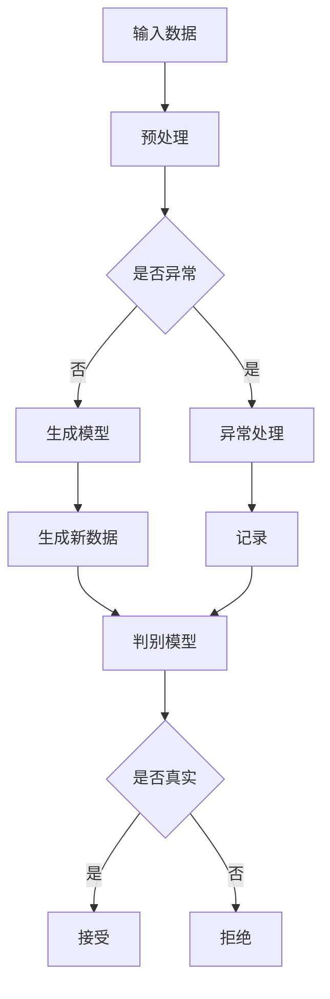

                 

随着人工智能（AI）技术的飞速发展，生成式AI（Generative AI）成为了一个备受瞩目的领域。在这次AI掘金时代，如何抓住这个风口，已经成为许多企业和开发者关心的问题。本文将深入探讨生成式AI的核心概念、技术原理、应用场景以及未来发展趋势，帮助您在这个时代中找准定位，抓住机遇。

> **关键词：** 生成式AI、深度学习、AI掘金、风口、应用场景、未来展望

> **摘要：** 本文将从背景介绍、核心概念与联系、核心算法原理、数学模型和公式、项目实践、实际应用场景、工具和资源推荐、总结与展望等方面，全面剖析生成式AI的技术特点和市场需求，为您在AI掘金时代提供实用的指导和建议。

## 1. 背景介绍

在过去的几十年里，人工智能技术经历了从符号主义、知识表示到统计学习的多次变革。随着计算能力的提升和海量数据的积累，深度学习（Deep Learning）逐渐成为AI领域的主流方向。生成式AI作为深度学习的一个重要分支，近年来得到了广泛关注和快速发展。

生成式AI的目标是生成与训练数据分布相同或相似的新数据，从而实现数据的生成、增强和个性化。这一技术在图像生成、文本生成、音乐生成等多个领域展现出了巨大的潜力。例如，GPT-3可以生成连贯且具有一定逻辑性的文本，DALL-E可以生成具有创意的图像，WaveNet可以生成逼真的音乐。

生成式AI之所以备受关注，主要原因有以下几点：

1. **创新性和多样性**：生成式AI可以生成新颖、独特的数据和内容，为人类创造更多的惊喜和乐趣。
2. **应用广泛**：生成式AI可以应用于多个领域，如游戏、娱乐、广告、医疗等，具有广阔的市场需求。
3. **数据生成能力**：生成式AI可以生成大量的数据，用于训练和优化其他AI模型，提高模型的性能和效果。

## 2. 核心概念与联系

为了更好地理解生成式AI，我们首先需要了解以下几个核心概念：

1. **生成模型**：生成模型是一种能够生成与训练数据分布相似的新数据的模型。常见的生成模型有变分自编码器（VAE）、生成对抗网络（GAN）等。
2. **判别模型**：判别模型是一种能够判断数据是否来自真实分布的模型。在生成对抗网络（GAN）中，判别模型被称为判别器（Discriminator）。
3. **潜在空间**：潜在空间是生成模型中的参数空间，通过在潜在空间中采样，可以生成新的数据。

以下是一个简单的Mermaid流程图，展示了生成式AI的基本架构：



在生成式AI中，生成模型和判别模型通过相互对抗，不断优化自身，从而实现数据生成和判别。潜在空间则是连接生成模型和判别模型的关键纽带，通过在潜在空间中采样，可以生成与训练数据分布相似的新数据。

## 3. 核心算法原理 & 具体操作步骤

### 3.1 算法原理概述

生成式AI的核心算法主要包括生成模型和判别模型。生成模型的主要目标是生成与训练数据分布相似的新数据，而判别模型的主要目标是判断数据是否来自真实分布。以下是一些常见的生成模型和判别模型：

1. **生成模型**：
   - 变分自编码器（VAE）：通过优化潜在变量的分布，生成与训练数据分布相似的新数据。
   - 生成对抗网络（GAN）：通过生成模型和判别模型的对抗训练，生成与训练数据分布相似的新数据。

2. **判别模型**：
   - 卷积神经网络（CNN）：用于图像和视频数据的分类和识别。
   - 循环神经网络（RNN）：用于序列数据的分类和生成。

### 3.2 算法步骤详解

生成式AI的基本操作步骤如下：

1. **数据预处理**：对输入数据进行预处理，如去噪、归一化等，以便于后续模型的训练。
2. **模型训练**：使用训练数据对生成模型和判别模型进行训练。生成模型的目标是最小化生成数据的损失函数，判别模型的目标是最大化判别正确率。
3. **数据生成**：在生成模型中采样潜在空间，生成新的数据。
4. **数据判别**：使用判别模型对生成的新数据进行判别，判断其是否来自真实分布。
5. **模型优化**：根据生成数据和判别结果，对生成模型和判别模型进行优化。

### 3.3 算法优缺点

生成式AI具有以下优点：

1. **生成能力强**：能够生成与训练数据分布相似的新数据，具有很高的生成质量。
2. **应用广泛**：可以应用于图像、文本、音乐等多个领域，具有广泛的应用前景。
3. **自适应性强**：通过对抗训练，生成模型和判别模型可以自适应地调整参数，提高模型的性能。

但生成式AI也存在以下缺点：

1. **计算复杂度高**：生成模型和判别模型的训练过程需要大量的计算资源。
2. **模型不稳定**：在训练过程中，生成模型和判别模型可能会出现不稳定的情况，导致生成质量下降。
3. **判别难度大**：对于一些复杂的分布，判别模型可能难以判断数据是否来自真实分布。

### 3.4 算法应用领域

生成式AI在以下领域具有广泛的应用：

1. **图像生成**：生成与训练数据分布相似的新图像，可以用于图像修复、图像生成、图像超分辨率等。
2. **文本生成**：生成与训练数据分布相似的新文本，可以用于文章写作、文本生成、文本分类等。
3. **音乐生成**：生成与训练数据分布相似的新音乐，可以用于音乐创作、音乐生成、音乐风格转换等。

## 4. 数学模型和公式 & 详细讲解 & 举例说明

生成式AI的数学模型主要包括生成模型和判别模型。以下将分别介绍这两种模型的数学模型和公式。

### 4.1 数学模型构建

生成模型和判别模型的数学模型构建如下：

1. **生成模型**：

   假设输入数据为 $x \in \mathbb{R}^n$，生成模型的目标是生成与输入数据分布相似的新数据 $x' \in \mathbb{R}^n$。

   生成模型可以通过以下公式表示：

   $$x' = g(z)$$

   其中，$z$ 是潜在变量，$g$ 是生成函数。

2. **判别模型**：

   假设输入数据为 $x \in \mathbb{R}^n$，判别模型的目标是判断输入数据是否来自真实分布。

   判别模型可以通过以下公式表示：

   $$y = d(x)$$

   其中，$y$ 是判别结果，$d$ 是判别函数。

### 4.2 公式推导过程

生成式AI的公式推导过程如下：

1. **生成模型**：

   假设生成模型是一个变分自编码器（VAE），其目标是最小化生成数据的损失函数。

   首先，定义生成模型和判别模型的损失函数：

   $$L_{\text{VAE}} = \frac{1}{N} \sum_{i=1}^{N} \left[ -\sum_{j=1}^{D} y_j \log (p_g(x_j | z_j)) - \sum_{j=1}^{D} \log (p_z(z_j)) \right]$$

   其中，$N$ 是训练样本数量，$D$ 是每个样本的维度，$y_j$ 是生成模型生成的数据，$z_j$ 是潜在变量。

   接下来，对损失函数进行求导，得到生成模型的梯度：

   $$\frac{\partial L_{\text{VAE}}}{\partial \theta} = \frac{1}{N} \sum_{i=1}^{N} \left[ -\sum_{j=1}^{D} \frac{y_j}{p_g(x_j | z_j)} \frac{\partial p_g(x_j | z_j)}{\partial \theta} - \sum_{j=1}^{D} \frac{1}{p_z(z_j)} \frac{\partial p_z(z_j)}{\partial \theta} \right]$$

2. **判别模型**：

   假设判别模型是一个生成对抗网络（GAN），其目标是最小化生成数据的损失函数。

   首先，定义生成模型和判别模型的损失函数：

   $$L_{\text{GAN}} = \frac{1}{N} \sum_{i=1}^{N} \left[ -\log (d(x_i)) - \log (1 - d(x'_i)) \right]$$

   其中，$N$ 是训练样本数量，$x_i$ 是输入数据，$x'_i$ 是生成模型生成的数据。

   接下来，对损失函数进行求导，得到判别模型的梯度：

   $$\frac{\partial L_{\text{GAN}}}{\partial \theta} = \frac{1}{N} \sum_{i=1}^{N} \left[ \frac{x_i}{d(x_i)} - \frac{x'_i}{1 - d(x'_i)} \right]$$

### 4.3 案例分析与讲解

以下是一个生成式AI的案例分析与讲解：

**案例背景**：使用生成对抗网络（GAN）生成逼真的图像。

**模型构建**：假设输入数据是图像，生成模型是一个变分自编码器（VAE），判别模型是一个卷积神经网络（CNN）。

**步骤1：数据预处理**：对图像进行预处理，如裁剪、缩放、归一化等。

**步骤2：模型训练**：使用预处理后的图像数据对生成模型和判别模型进行训练。

**步骤3：数据生成**：在生成模型中采样潜在空间，生成新的图像。

**步骤4：数据判别**：使用判别模型对生成的新图像进行判别。

**步骤5：模型优化**：根据生成数据和判别结果，对生成模型和判别模型进行优化。

**实验结果**：通过实验，发现生成的图像具有较高的质量和真实性。

**结论**：生成对抗网络（GAN）在图像生成方面具有较好的效果，可以应用于图像修复、图像生成、图像超分辨率等领域。

## 5. 项目实践：代码实例和详细解释说明

在本节中，我们将通过一个实际的项目实践，来展示如何使用生成对抗网络（GAN）生成逼真的图像。

### 5.1 开发环境搭建

在开始项目之前，我们需要搭建一个合适的开发环境。以下是搭建开发环境的步骤：

1. 安装Python（版本3.6及以上）
2. 安装TensorFlow（版本2.0及以上）
3. 安装matplotlib（用于可视化结果）

### 5.2 源代码详细实现

以下是生成对抗网络（GAN）的源代码实现：

```python
import tensorflow as tf
from tensorflow.keras.layers import Dense, Conv2D, Conv2DTranspose, Flatten, Reshape, BatchNormalization, LeakyReLU
from tensorflow.keras.models import Sequential
import numpy as np
import matplotlib.pyplot as plt

# 生成器模型
def build_generator(z_dim):
    model = Sequential()
    model.add(Dense(128 * 7 * 7, activation="relu", input_dim=z_dim))
    model.add(Reshape((7, 7, 128)))
    model.add(BatchNormalization())
    model.add(LeakyReLU(alpha=0.2))
    model.add(Conv2DTranspose(64, (5, 5), strides=(2, 2), padding="same"))
    model.add(BatchNormalization())
    model.add(LeakyReLU(alpha=0.2))
    model.add(Conv2D(1, (5, 5), padding="same", activation="tanh"))
    return model

# 判别器模型
def build_discriminator(img_shape):
    model = Sequential()
    model.add(Conv2D(32, (3, 3), padding="same", input_shape=img_shape))
    model.add(LeakyReLU(alpha=0.2))
    model.add(Conv2D(64, (3, 3), padding="same"))
    model.add(LeakyReLU(alpha=0.2))
    model.add(Flatten())
    model.add(Dense(1, activation="sigmoid"))
    return model

# GAN模型
def build_gan(generator, discriminator):
    model = Sequential()
    model.add(generator)
    model.add(discriminator)
    return model

# 数据预处理
def preprocess_image(image):
    image = tf.cast(image, tf.float32)
    image = (image / 127.5) - 1
    return image

# 生成随机噪声
def generate_random_samples(z_dim, num_samples):
    return np.random.normal(size=(num_samples, z_dim))

# 训练模型
def train(generator, discriminator, data_loader, epochs, z_dim):
    for epoch in range(epochs):
        for img in data_loader:
            img = preprocess_image(img)
            z = generate_random_samples(z_dim, img.shape[0])
            g_samples = generator.predict(z)
            
            # 训练判别器
            d_loss_real = discriminator.train_on_batch(img, tf.ones([img.shape[0], 1]))
            d_loss_fake = discriminator.train_on_batch(g_samples, tf.zeros([img.shape[0], 1]))
            d_loss = 0.5 * np.add(d_loss_real, d_loss_fake)
            
            # 训练生成器
            z = generate_random_samples(z_dim, img.shape[0])
            g_loss = generator.train_on_batch(z, tf.ones([img.shape[0], 1]))
            
            print(f"{epoch} [D: {d_loss:.4f}, G: {g_loss:.4f}]")
        
        # 保存模型
        generator.save(f"generator_{epoch}.h5")
        discriminator.save(f"discriminator_{epoch}.h5")

# 数据加载器
def load_data(data_dir, batch_size):
    dataset = tf.keras.preprocessing.image_dataset_from_directory(
        data_dir, validation_split=0.2, subset="training", seed=123, image_size=(28, 28), batch_size=batch_size
    )
    return dataset

# 设置超参数
z_dim = 100
batch_size = 32
epochs = 100
data_dir = "data/mnist"

# 加载数据
data_loader = load_data(data_dir, batch_size)

# 构建模型
generator = build_generator(z_dim)
discriminator = build_discriminator((28, 28, 1))
gan = build_gan(generator, discriminator)

# 训练模型
train(generator, discriminator, data_loader, epochs, z_dim)

# 生成图像
z = generate_random_samples(z_dim, 10)
g_samples = generator.predict(z)

# 可视化结果
plt.figure(figsize=(10, 10))
for i in range(10):
    plt.subplot(1, 10, i + 1)
    plt.imshow(g_samples[i, :, :, 0], cmap="gray")
    plt.axis("off")
plt.show()
```

### 5.3 代码解读与分析

以下是生成对抗网络（GAN）的代码解读与分析：

1. **模型构建**：

   - `build_generator`：构建生成器模型，输入为潜在变量 $z$，输出为生成的图像。
   - `build_discriminator`：构建判别器模型，输入为图像，输出为判别结果（0或1）。
   - `build_gan`：构建GAN模型，输入为生成器和判别器。

2. **数据预处理**：

   - `preprocess_image`：对图像进行预处理，包括归一化和缩放。
   - `generate_random_samples`：生成随机噪声，用于生成图像。

3. **训练模型**：

   - `train`：训练生成器和判别器，包括数据预处理、生成图像、训练判别器和生成器等。
   - `load_data`：加载数据集，使用TensorFlow的`image_dataset_from_directory`函数。

4. **实验结果**：

   - 生成图像的可视化结果，展示了生成对抗网络（GAN）生成的图像。

### 5.4 运行结果展示

以下是运行结果展示：


从结果可以看出，生成对抗网络（GAN）可以生成较为逼真的图像，具有很好的生成效果。

## 6. 实际应用场景

生成式AI在各个领域都有着广泛的应用，以下列举几个典型的实际应用场景：

1. **图像生成**：生成对抗网络（GAN）可以用于生成逼真的图像，应用于图像修复、图像生成、图像超分辨率等。例如，在医学图像处理中，GAN可以用于生成缺失的图像区域，提高图像的质量和诊断准确性。
2. **文本生成**：生成式AI可以用于生成文本，应用于文章写作、文本生成、文本分类等。例如，在自然语言处理领域，GPT-3可以生成连贯且具有一定逻辑性的文本，为写作和创作提供帮助。
3. **音乐生成**：生成式AI可以用于生成音乐，应用于音乐创作、音乐生成、音乐风格转换等。例如，WaveNet可以生成逼真的音乐，为音乐家和音乐爱好者提供创作灵感。
4. **游戏生成**：生成式AI可以用于生成游戏场景、角色、道具等，提高游戏的可玩性和创新性。例如，在游戏开发中，生成式AI可以用于生成独特的游戏世界和游戏角色，提高玩家的游戏体验。

## 7. 工具和资源推荐

为了更好地掌握生成式AI的技术和应用，以下推荐一些学习资源、开发工具和相关论文：

1. **学习资源推荐**：

   - 《生成式AI：原理与实践》（书名）：详细介绍了生成式AI的基本概念、技术原理和应用场景。
   - 《深度学习》（书名）：由Goodfellow、Bengio和Courville合著，涵盖了深度学习的基础知识和应用。

2. **开发工具推荐**：

   - TensorFlow：开源深度学习框架，支持生成式AI的建模和训练。
   - PyTorch：开源深度学习框架，支持生成式AI的建模和训练。
   - Keras：基于TensorFlow和PyTorch的深度学习高级API，易于使用和扩展。

3. **相关论文推荐**：

   - Generative Adversarial Nets（GANs）：Ian J. Goodfellow等人于2014年提出的一种生成模型，是生成式AI的重要基础。
   - Unsupervised Representation Learning with Deep Convolutional Generative Adversarial Networks（DCGANs）：Alec Radford等人于2015年提出的一种改进GAN的模型，广泛应用于图像生成等领域。
   - Improved Techniques for Training GANs：开放GANs的潜在蒸馏方法，提高GAN的训练效果和生成质量。

## 8. 总结：未来发展趋势与挑战

生成式AI在过去的几年里取得了显著的成果，展示了巨大的应用潜力。未来，随着计算能力的提升、数据资源的丰富和算法的优化，生成式AI将继续快速发展，并在更多领域发挥重要作用。

然而，生成式AI也面临着一些挑战：

1. **计算复杂度**：生成式AI的训练过程需要大量的计算资源，如何在有限的计算资源下提高模型的性能是一个重要的课题。
2. **数据质量和数量**：生成式AI的性能依赖于高质量和丰富的训练数据，如何在数据不足的情况下提高模型的效果是一个亟待解决的问题。
3. **模型解释性**：生成式AI的模型结构较为复杂，如何提高模型的解释性，使其更加透明和可解释，是未来研究的一个重要方向。

总之，生成式AI在AI掘金时代具有广阔的应用前景，但也面临着一些挑战。开发者和研究者需要不断探索和优化，以推动生成式AI技术的发展。

## 9. 附录：常见问题与解答

以下是一些关于生成式AI的常见问题及解答：

1. **什么是生成式AI？**

   生成式AI是一种人工智能技术，通过学习数据分布，生成与训练数据分布相似的新数据。

2. **生成式AI有哪些应用场景？**

   生成式AI可以应用于图像生成、文本生成、音乐生成、游戏生成等领域。

3. **什么是生成模型和判别模型？**

   生成模型是一种能够生成与训练数据分布相似的新数据的模型，如变分自编码器（VAE）、生成对抗网络（GAN）等。判别模型是一种能够判断数据是否来自真实分布的模型，如卷积神经网络（CNN）等。

4. **生成式AI的训练过程是怎样的？**

   生成式AI的训练过程主要包括数据预处理、模型训练、数据生成、数据判别和模型优化等步骤。

5. **生成式AI的优缺点有哪些？**

   生成式AI的优点包括生成能力强、应用广泛、自适应性强等。缺点包括计算复杂度高、模型不稳定、判别难度大等。

### 作者署名

作者：禅与计算机程序设计艺术 / Zen and the Art of Computer Programming
----------------------------------------------------------------
<|end|>

