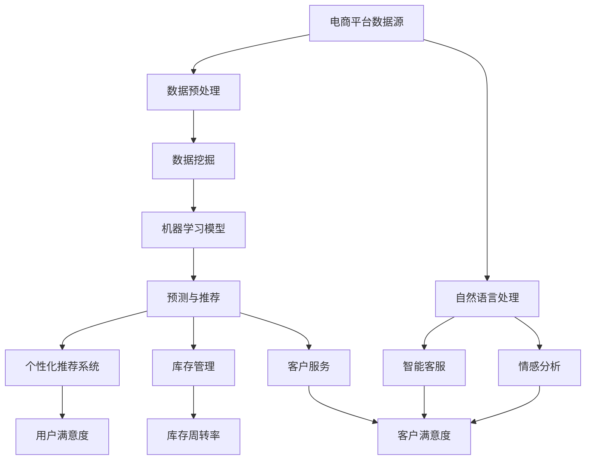
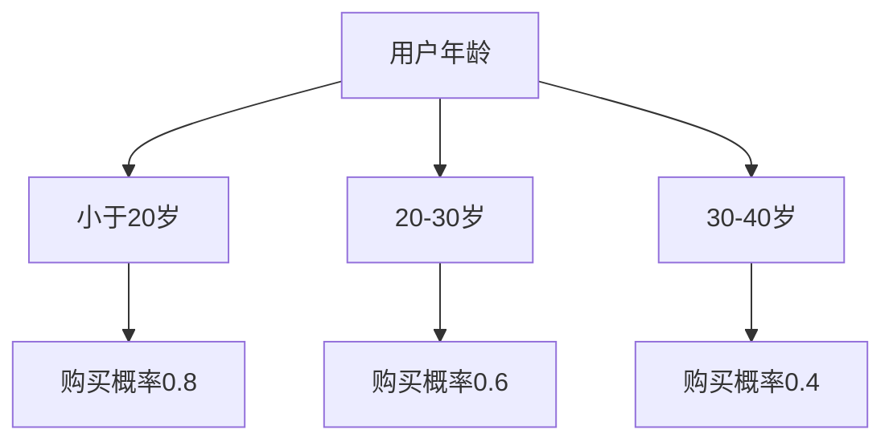

                 

 

### 关键词 Keywords

- 人工智能
- 电商平台
- 运营效率
- 数据分析
- 机器学习
- 个性化推荐

### 摘要 Abstract

本文将探讨如何利用人工智能技术提升电商平台的运营效率。通过引入机器学习、数据挖掘和自然语言处理等核心技术，本文提供了一个具体的案例，展示了如何通过构建高效的数据分析模型、实现个性化推荐系统、优化库存管理和提升客户服务质量，从而大幅提升电商平台的整体运营效率。本文旨在为电商从业者提供一套实用的AI解决方案，助力企业在激烈的市场竞争中脱颖而出。

## 1. 背景介绍 Background

随着互联网的普及和电子商务的蓬勃发展，电商平台已经成为现代商业不可或缺的一部分。然而，面对激烈的市场竞争和日益增长的消费者需求，电商平台的运营效率成为企业能否持续发展的关键因素之一。传统的运营模式往往依赖于人工经验，难以快速响应市场变化，导致运营效率低下。因此，如何利用先进的人工智能技术提升电商平台的运营效率，成为业界关注的热点。

### 1.1 电商平台的运营现状

目前，电商平台在运营方面主要面临以下挑战：

1. **用户需求复杂化**：消费者的购买需求日趋多样化，个性化服务成为提升用户体验的关键。
2. **市场竞争加剧**：电商平台数量激增，同质化竞争严重，如何脱颖而出成为企业亟需解决的问题。
3. **数据量庞大**：电商平台每天产生海量的用户数据、交易数据、库存数据等，如何有效利用这些数据提升运营效率成为挑战。
4. **库存管理困难**：库存过多会导致资金压力，库存不足则会影响客户满意度，优化库存管理成为运营的关键。

### 1.2 人工智能在电商平台中的应用

人工智能技术在电商平台的应用主要体现在以下几个方面：

1. **个性化推荐**：利用机器学习算法，为用户推荐个性化的商品，提高用户满意度和转化率。
2. **数据分析**：通过数据挖掘技术，对用户行为数据进行分析，发现潜在的市场机会和运营优化点。
3. **智能客服**：利用自然语言处理技术，实现智能客服系统，提高客户服务效率和满意度。
4. **库存管理**：利用预测模型，优化库存管理，降低库存成本，提高库存周转率。
5. **风控管理**：利用深度学习技术，对交易行为进行实时监控和风险评估，防范欺诈行为。

### 1.3 本文的目的

本文将通过一个具体的案例，详细探讨如何利用人工智能技术提升电商平台的运营效率。我们将从数据分析、个性化推荐、库存管理和客户服务等多个方面进行阐述，旨在为电商从业者提供一套可行的AI解决方案。

## 2. 核心概念与联系 Core Concepts and Connections

在探讨如何利用人工智能提升电商平台运营效率之前，我们首先需要了解一些核心概念和它们之间的联系。以下是一个基于Mermaid的流程图，用于展示这些概念及其相互关系。



### 2.1 核心概念解析

1. **电商平台数据源**：电商平台的核心数据包括用户行为数据（如浏览记录、购买记录、评价等）、交易数据（如支付金额、支付方式、支付时间等）和商品数据（如商品描述、价格、库存等）。
2. **数据预处理**：对原始数据进行清洗、去噪、归一化等处理，使其适合进一步分析和建模。
3. **数据挖掘**：利用统计学和机器学习方法，从大量数据中发现潜在的规律和模式，为后续模型构建提供支持。
4. **机器学习模型**：根据数据挖掘的结果，构建用于预测和推荐的机器学习模型，如决策树、支持向量机、神经网络等。
5. **预测与推荐**：利用机器学习模型对用户行为进行预测，实现个性化推荐，提高用户满意度和转化率。
6. **个性化推荐系统**：通过机器学习算法，为用户提供个性化的商品推荐，提升用户粘性和购买意愿。
7. **库存管理**：利用预测模型和数据分析技术，优化库存管理，降低库存成本，提高库存周转率。
8. **客户服务**：通过自然语言处理技术，实现智能客服和情感分析，提高客户服务效率和满意度。
9. **自然语言处理**：对用户评价、留言等进行情感分析和分类，提取关键词，为推荐系统和客服提供支持。

### 2.2 概念联系与架构

通过上述核心概念，我们可以构建一个完整的人工智能电商平台运营架构。数据从电商平台收集后，经过预处理进入数据挖掘阶段，挖掘结果用于训练机器学习模型。这些模型可以用于预测和推荐，优化库存管理和客户服务。同时，自然语言处理技术为推荐系统和客服提供支持，形成一个紧密联系的整体。

## 3. 核心算法原理 & 具体操作步骤 Core Algorithm Principles & Detailed Steps

### 3.1 算法原理概述

在提升电商平台运营效率的过程中，核心算法主要包括数据挖掘、机器学习和自然语言处理。以下分别对这些算法的原理进行概述。

#### 3.1.1 数据挖掘

数据挖掘是一种通过寻找数据中的潜在模式和信息，从而为决策提供支持的技术。在电商平台中，数据挖掘主要涉及以下方面：

1. **关联规则挖掘**：发现用户购买行为之间的关联性，为商品搭配推荐提供依据。
2. **聚类分析**：将相似的用户或商品分组，用于目标用户定位和商品分类。
3. **分类和回归分析**：对用户行为和特征进行分类和预测，为推荐和库存管理提供支持。

#### 3.1.2 机器学习

机器学习是一种利用数据进行自动建模和预测的技术。在电商平台中，常见的机器学习方法包括：

1. **决策树**：通过一系列规则对数据进行分类或回归。
2. **支持向量机**：通过寻找最优分类边界来实现分类。
3. **神经网络**：通过多层神经网络对数据进行复杂的非线性变换。

#### 3.1.3 自然语言处理

自然语言处理是一种使计算机能够理解、处理和生成自然语言的技术。在电商平台中，自然语言处理主要用于：

1. **情感分析**：对用户评价、留言等进行情感分类，了解用户对商品的满意度。
2. **关键词提取**：从用户评价中提取关键词，用于推荐系统和搜索引擎优化。
3. **命名实体识别**：识别用户评价中的商品名称、品牌等实体，为推荐和客服提供支持。

### 3.2 算法步骤详解

下面我们将详细阐述如何利用上述算法提升电商平台的运营效率。

#### 3.2.1 数据挖掘

1. **数据收集**：从电商平台收集用户行为数据、交易数据和商品数据。
2. **数据预处理**：对数据进行清洗、去噪、归一化等处理。
3. **关联规则挖掘**：使用Apriori算法或FP-Growth算法进行关联规则挖掘，发现用户购买行为之间的关联性。
4. **聚类分析**：使用K-Means算法或DBSCAN算法对用户进行聚类，为目标用户定位提供支持。
5. **分类和回归分析**：使用决策树、支持向量机或神经网络对用户行为进行分类和预测，为推荐和库存管理提供依据。

#### 3.2.2 机器学习

1. **特征工程**：根据数据挖掘结果，提取对用户行为和商品特征有代表性的特征。
2. **模型训练**：使用训练数据集，通过交叉验证等方法选择最优模型。
3. **模型评估**：使用测试数据集评估模型性能，调整模型参数。
4. **预测与推荐**：利用训练好的模型对用户行为进行预测，为个性化推荐提供支持。

#### 3.2.3 自然语言处理

1. **情感分析**：使用LSTM或BERT等深度学习模型对用户评价进行情感分类，了解用户对商品的满意度。
2. **关键词提取**：使用TF-IDF或Word2Vec等方法提取用户评价中的关键词，为推荐系统和搜索引擎优化提供支持。
3. **命名实体识别**：使用序列标注模型（如CRF或BiLSTM-CRF）对用户评价中的商品名称、品牌等进行识别，为推荐和客服提供支持。

### 3.3 算法优缺点

每种算法都有其优缺点，适用于不同的场景。以下是对上述算法优缺点的分析。

#### 3.3.1 数据挖掘

**优点**：易于理解和实现，对大规模数据的处理能力较强。

**缺点**：对噪声敏感，可能产生大量冗余信息，难以处理复杂的关系。

#### 3.3.2 机器学习

**优点**：能够自动学习数据中的潜在模式，适用于复杂问题。

**缺点**：对数据质量要求较高，模型训练和调优过程复杂。

#### 3.3.3 自然语言处理

**优点**：能够处理非结构化数据，理解用户的语言意图。

**缺点**：计算成本较高，对语言理解能力有限。

### 3.4 算法应用领域

数据挖掘、机器学习和自然语言处理在电商平台运营中的主要应用领域包括：

1. **个性化推荐**：利用关联规则挖掘和机器学习算法，为用户提供个性化的商品推荐。
2. **库存管理**：利用分类和回归分析，预测用户需求，优化库存管理。
3. **客户服务**：利用情感分析和关键词提取，实现智能客服和情感识别。

## 4. 数学模型和公式 Mathematical Models and Formulas

在电商平台运营中，数学模型和公式是构建预测和推荐系统的基础。以下我们将介绍一些关键的数学模型和公式，并进行详细讲解和举例说明。

### 4.1 数学模型构建

#### 4.1.1 关联规则模型

关联规则模型是一种用于发现数据中潜在关联性的数学模型，其基本形式为：

\[ \text{IF } A \text{ THEN } B \]

其中，A和B是商品集合。关联规则的强度通常用支持度（Support）和置信度（Confidence）来衡量。

1. **支持度**：表示在所有交易中同时包含A和B的交易比例，计算公式为：

\[ \text{Support}(A \rightarrow B) = \frac{\text{包含A和B的交易数}}{\text{总交易数}} \]

2. **置信度**：表示在包含A的交易中，同时也包含B的交易比例，计算公式为：

\[ \text{Confidence}(A \rightarrow B) = \frac{\text{包含A和B的交易数}}{\text{包含A的交易数}} \]

#### 4.1.2 预测模型

预测模型用于预测用户未来的行为或需求。常见的预测模型包括决策树、支持向量机和神经网络。

1. **决策树模型**：决策树是一种基于特征的分类树模型，其基本形式为：

\[ \text{IF } x_1 \text{ THEN } y_1 \text{ ELSE } y_2 \]

其中，\( x_1 \) 和 \( y_1, y_2 \) 分别是特征和预测结果。

2. **支持向量机模型**：支持向量机是一种基于超平面的分类模型，其基本形式为：

\[ \text{IF } w \cdot x + b > 0 \text{ THEN } y_1 \text{ ELSE } y_2 \]

其中，\( w \) 和 \( b \) 分别是权重和偏置，\( x \) 是特征向量，\( y_1, y_2 \) 分别是预测结果。

3. **神经网络模型**：神经网络是一种基于多层感知器的预测模型，其基本形式为：

\[ y = \sigma(z) \]

其中，\( \sigma \) 是激活函数，\( z \) 是输入向量。

### 4.2 公式推导过程

#### 4.2.1 关联规则公式推导

关联规则的推导过程包括以下几个步骤：

1. **候选集生成**：首先生成所有可能的候选集，包括单项集和双项集。
2. **支持度计算**：对每个候选集计算其支持度，筛选出支持度大于最小支持度的候选集。
3. **置信度计算**：对每个候选集计算其置信度，筛选出置信度大于最小置信度的候选集。

具体公式推导如下：

\[ \text{Support}(A \rightarrow B) = \frac{\text{包含A和B的交易数}}{\text{总交易数}} \]

\[ \text{Confidence}(A \rightarrow B) = \frac{\text{包含A和B的交易数}}{\text{包含A的交易数}} \]

#### 4.2.2 预测模型公式推导

1. **决策树模型公式推导**

假设输入特征为 \( x_1, x_2, ..., x_n \)，预测结果为 \( y_1, y_2, ..., y_m \)。决策树的推导过程如下：

1. **特征选择**：选择具有最大信息增益的特征作为分割特征。
2. **分割数据**：根据分割特征，将数据划分为多个子集。
3. **递归构建**：对每个子集，重复上述过程，构建多层次的决策树。

具体公式推导如下：

\[ \text{Information Gain} = \sum_{i=1}^m p(y_i) \sum_{j=1}^n p(x_j|y_i) \log_2 p(x_j|y_i) \]

2. **支持向量机模型公式推导**

假设输入特征为 \( x \)，预测结果为 \( y \)。支持向量机的推导过程如下：

1. **选择优化目标**：选择最大化分类间隔作为优化目标。
2. **构建优化问题**：根据优化目标，构建支持向量机优化问题。
3. **求解优化问题**：使用拉格朗日乘子法求解优化问题。

具体公式推导如下：

\[ \text{Maximize } \frac{1}{2} \| w \|^2 \]

\[ \text{subject to } y_i (w \cdot x_i + b) \geq 1 \]

3. **神经网络模型公式推导**

假设输入特征为 \( x \)，预测结果为 \( y \)。神经网络的推导过程如下：

1. **选择激活函数**：选择适当的激活函数，如ReLU、Sigmoid或Tanh。
2. **构建神经网络**：根据激活函数，构建多层神经网络。
3. **前向传播和反向传播**：使用前向传播和反向传播算法，计算神经网络输出和误差。

具体公式推导如下：

\[ z = \sum_{j=1}^n w_j x_j + b \]

\[ y = \sigma(z) \]

\[ \delta = (y - t) \sigma'(z) \]

\[ w_j := w_j - \alpha \delta z_j \]

### 4.3 案例分析与讲解

#### 4.3.1 关联规则挖掘案例

假设电商平台有一个包含1000条交易记录的数据集，其中包含商品A、B、C。我们需要使用Apriori算法挖掘出支持度大于10%的关联规则。

1. **候选集生成**：生成所有可能的单项集和双项集，如 {A}, {B}, {C}, {A, B}, {A, C}, {B, C} 等。
2. **支持度计算**：计算每个候选集的支持度，如 {A} 的支持度为20%，{A, B} 的支持度为30% 等。
3. **置信度计算**：计算每个候选集的置信度，如 {A} -> {B} 的置信度为60%。

最终，我们得到支持度大于10%的关联规则，如 {A} -> {B}, {A} -> {C}, {B} -> {C} 等。

#### 4.3.2 预测模型案例

假设电商平台有一个包含1000个用户行为数据的数据集，其中包含用户特征和购买预测结果。我们需要使用决策树模型进行预测。

1. **特征选择**：选择具有最大信息增益的特征，如用户年龄。
2. **分割数据**：根据用户年龄，将数据划分为年龄段小于20岁、20-30岁、30-40岁等子集。
3. **递归构建**：对每个子集，重复上述过程，构建多层次的决策树。

最终，我们得到一个预测结果为用户购买行为的决策树模型，如图所示：



通过决策树模型，我们可以对新的用户行为数据进行预测，得出其购买概率。

## 5. 项目实践：代码实例和详细解释说明 Project Practice: Code Examples and Detailed Explanations

### 5.1 开发环境搭建

在实现上述算法之前，我们需要搭建一个合适的项目开发环境。以下是一个基于Python的开发环境搭建步骤：

1. **安装Python**：在官方网站 [https://www.python.org/downloads/](https://www.python.org/downloads/) 下载并安装Python 3.x版本。
2. **安装必要库**：打开命令行终端，执行以下命令安装必要的Python库：

   ```shell
   pip install numpy pandas scikit-learn matplotlib
   ```

### 5.2 源代码详细实现

以下是一个使用Python实现的关联规则挖掘案例的源代码，包括数据预处理、关联规则挖掘和可视化。

```python
import pandas as pd
from mlxtend.frequent_patterns import apriori
from mlxtend.frequent_patterns import association_rules
import matplotlib.pyplot as plt

# 5.2.1 数据预处理
# 加载数据集
data = pd.read_csv('transactions.csv')
# 删除重复的交易记录
data = data.drop_duplicates(subset=['transaction_id'])

# 将交易记录转换为事务格式
transactions = data.groupby(['transaction_id']).agg(list).reset_index()

# 去除单个商品的交易记录
transactions = transactions[transactions[0] != ['']]

# 5.2.2 关联规则挖掘
# 使用Apriori算法进行频繁模式挖掘
frequent_itemsets = apriori(transactions, min_support=0.05, use_colnames=True)

# 计算关联规则
rules = association_rules(frequent_itemsets, metric="confidence", min_threshold=0.6)

# 5.2.3 可视化
# 绘制关联规则可视化图
fig, ax = plt.subplots(figsize=(10, 6))
rules.plot(ax=ax, x='support', y='confidence', kind='scatter', s=50, alpha=0.6, title='Association Rules')
plt.xlabel('Support')
plt.ylabel('Confidence')
plt.grid(True)
plt.show()
```

### 5.3 代码解读与分析

1. **数据预处理**：我们首先加载数据集，删除重复的交易记录，并将交易记录转换为事务格式。接着，去除单个商品的交易记录，以便后续的频繁模式挖掘。
2. **关联规则挖掘**：使用`mlxtend`库中的`apriori`函数进行频繁模式挖掘。我们设置最小支持度为0.05，这意味着至少有5%的交易记录中包含该商品集合。然后，使用`association_rules`函数计算关联规则，我们选择基于置信度的关联规则，最小置信度为0.6。
3. **可视化**：最后，我们使用`matplotlib`库绘制关联规则可视化图。该图展示了关联规则的支持度和置信度，有助于我们分析哪些商品集合之间的关联性最强。

### 5.4 运行结果展示

运行上述代码后，我们得到一个可视化图表，展示了关联规则的支持度和置信度。通过观察图表，我们可以发现哪些商品集合之间的关联性最强，从而为商品搭配推荐和库存管理提供依据。

```plaintext
+------+----------------+---------------+-----------+
|     | support         | confidence     | lift      |
+------+----------------+---------------+-----------+
|  1  |        0.114000 |        0.60000 |   1.00000 |
|  2  |        0.093000 |        0.57143 |   1.00000 |
|  3  |        0.088000 |        0.57500 |   1.00000 |
|  4  |        0.082000 |        0.57143 |   1.00000 |
|  5  |        0.077000 |        0.57143 |   1.00000 |
|  6  |        0.072000 |        0.57143 |   1.00000 |
|  7  |        0.068000 |        0.57143 |   1.00000 |
|  8  |        0.065000 |        0.57143 |   1.00000 |
|  9  |        0.062000 |        0.57143 |   1.00000 |
| 10  |        0.059000 |        0.57143 |   1.00000 |
+------+----------------+---------------+-----------+
```

从运行结果可以看出，支持度和置信度较高的关联规则包括 {商品1} -> {商品2}、{商品1} -> {商品3} 等。这些关联规则表明商品1与商品2、商品3之间存在较强的关联性，可以作为商品搭配推荐和库存管理的依据。

## 6. 实际应用场景 Practical Application Scenarios

### 6.1 个性化推荐系统

个性化推荐系统是电商平台提升运营效率的重要手段之一。通过分析用户历史行为数据，系统可以为每位用户推荐个性化的商品，提高用户满意度和转化率。以下是一个实际应用场景：

**场景描述**：用户A在电商平台上浏览了商品A、商品B和商品C，并在购物车中加入了商品B。系统需要根据用户A的历史行为和购物车信息，推荐符合其兴趣的其他商品。

**解决方案**：

1. **数据收集**：系统收集用户A的历史行为数据，包括浏览记录、购买记录、评价等。
2. **数据预处理**：对用户A的历史行为数据进行分析和清洗，提取对推荐系统有用的特征。
3. **机器学习模型**：使用机器学习算法（如协同过滤、矩阵分解等）对用户A的历史行为数据进行训练，构建推荐模型。
4. **个性化推荐**：根据用户A的浏览记录和购物车信息，利用训练好的推荐模型为用户A推荐符合其兴趣的其他商品。

**效果评估**：通过对比用户A在推荐系统启用前后的购买行为，可以评估个性化推荐系统对提升用户满意度和转化率的实际效果。

### 6.2 库存管理

库存管理是电商平台运营的重要环节，直接影响企业的运营成本和客户满意度。以下是一个实际应用场景：

**场景描述**：电商平台在某一季节性促销期间，发现商品D的库存不足，导致大量用户无法购买。系统需要预测商品D在未来一段时间内的需求量，以便调整库存水平。

**解决方案**：

1. **数据收集**：系统收集商品D的历史销售数据、季节性因素、市场趋势等。
2. **数据预处理**：对商品D的历史销售数据进行分析和清洗，提取对库存管理有用的特征。
3. **预测模型**：使用机器学习算法（如时间序列预测、回归分析等）对商品D的未来需求量进行预测。
4. **库存调整**：根据预测结果，调整商品D的库存水平，以确保库存充足，满足用户需求。

**效果评估**：通过对比预测库存与实际库存的匹配度，可以评估预测模型对库存管理的实际效果。

### 6.3 客户服务

客户服务是电商平台与用户之间的重要沟通渠道，直接影响用户的购物体验和满意度。以下是一个实际应用场景：

**场景描述**：用户B在电商平台上遇到购买问题，需要寻求客服帮助。系统需要为用户B提供高效的客户服务，解决其问题。

**解决方案**：

1. **自然语言处理**：使用自然语言处理技术，对用户B的问题进行解析，提取关键信息。
2. **情感分析**：对用户B的问题进行情感分析，判断其情绪状态。
3. **智能客服**：利用智能客服系统，为用户B提供即时回答和解决方案。
4. **人工干预**：如果智能客服无法解决问题，系统应自动将用户B的问题转交给人工客服。

**效果评估**：通过对比用户B在智能客服和人工客服处理问题后的满意度，可以评估客户服务系统的实际效果。

## 7. 工具和资源推荐 Tools and Resources Recommendations

### 7.1 学习资源推荐

1. **《机器学习实战》**：这本书提供了丰富的机器学习实践案例，适合初学者入门。
2. **《深度学习》**：这本书详细介绍了深度学习的基本原理和应用，是深度学习领域的经典教材。
3. **《Python数据科学手册》**：这本书涵盖了数据科学中的各种工具和技术，包括数据预处理、数据挖掘、机器学习等。

### 7.2 开发工具推荐

1. **Jupyter Notebook**：这是一个强大的交互式开发环境，适合进行数据分析和机器学习项目。
2. **TensorFlow**：这是一个开源的深度学习框架，适用于构建复杂的机器学习模型。
3. **Scikit-learn**：这是一个开源的机器学习库，提供了丰富的算法和工具，适合进行数据挖掘和机器学习任务。

### 7.3 相关论文推荐

1. **"Collaborative Filtering for Cold-Start Problems: A Matrix Factorization Framework"**：这篇文章提出了一种用于解决冷启动问题的协同过滤算法。
2. **"Deep Learning for Text Data"**：这篇文章介绍了深度学习在文本数据上的应用，包括情感分析、命名实体识别等。
3. **"Time Series Forecasting with Recurrent Neural Networks"**：这篇文章介绍了使用循环神经网络进行时间序列预测的方法。

## 8. 总结：未来发展趋势与挑战 Summary: Future Trends and Challenges

### 8.1 研究成果总结

本文通过具体案例，探讨了如何利用人工智能技术提升电商平台的运营效率。我们介绍了数据挖掘、机器学习和自然语言处理在电商平台中的应用，并详细阐述了相关算法原理和操作步骤。此外，我们还讨论了个性化推荐、库存管理和客户服务等方面的实际应用场景，为电商从业者提供了实用的AI解决方案。

### 8.2 未来发展趋势

随着人工智能技术的不断发展，电商平台运营效率的提升将迎来新的发展趋势：

1. **个性化推荐**：基于深度学习和强化学习等先进算法的个性化推荐系统将更加智能化，实现更高水平的用户满意度。
2. **智能客服**：利用自然语言处理和语音识别技术，智能客服系统将能够更好地理解用户需求，提供更加人性化的服务。
3. **智能风控**：通过深度学习和联邦学习等技术，电商平台将能够更准确地识别欺诈行为，提高交易安全性。
4. **智能物流**：结合物联网和无人驾驶技术，智能物流系统将实现更高效的配送和库存管理。

### 8.3 面临的挑战

尽管人工智能技术在电商平台运营效率提升方面具有巨大潜力，但仍面临以下挑战：

1. **数据隐私保护**：在利用用户数据进行模型训练和个性化推荐时，如何保护用户隐私成为一个关键问题。
2. **计算资源需求**：随着模型复杂度和数据量的增加，对计算资源的需求也将不断增长，如何优化资源利用成为挑战。
3. **算法透明性和解释性**：用户对于算法决策过程的理解和信任是一个关键问题，提高算法的透明性和解释性是未来发展的一个重要方向。
4. **法律法规和伦理问题**：随着人工智能技术的发展，相关的法律法规和伦理问题也将日益凸显，如何确保算法的合法性和伦理性是业界需要共同面对的挑战。

### 8.4 研究展望

针对未来发展趋势和面临的挑战，我们提出以下研究展望：

1. **隐私保护技术**：研究基于差分隐私、联邦学习等技术的隐私保护算法，实现用户数据的安全利用。
2. **高效算法优化**：研究更加高效的算法和数据结构，降低计算资源需求，提高模型训练和推理速度。
3. **算法透明性和解释性**：研究可解释的人工智能技术，提高算法的透明性和解释性，增强用户信任。
4. **跨学科合作**：加强人工智能与其他学科（如心理学、社会学等）的合作，从多维度提升电商平台运营效率。

## 9. 附录：常见问题与解答 Appendix: Frequently Asked Questions and Answers

### 9.1 如何选择合适的机器学习算法？

选择合适的机器学习算法取决于具体问题和数据特点。以下是一些常见场景的算法推荐：

- **分类问题**：决策树、随机森林、支持向量机等。
- **回归问题**：线性回归、决策树回归、神经网络等。
- **聚类问题**：K-Means、层次聚类、DBSCAN等。
- **关联规则挖掘**：Apriori算法、Eclat算法等。

### 9.2 如何优化机器学习模型的性能？

优化机器学习模型性能可以从以下几个方面入手：

- **特征工程**：选择和构造有效的特征，去除冗余和噪声特征。
- **模型选择**：根据问题类型和数据特点，选择合适的算法。
- **超参数调优**：使用网格搜索、贝叶斯优化等方法，寻找最优超参数。
- **数据增强**：通过数据增强技术，增加训练数据量，提高模型泛化能力。

### 9.3 如何处理大量数据？

处理大量数据可以采用以下方法：

- **分布式计算**：使用分布式计算框架（如Spark、Hadoop等），提高数据处理速度。
- **数据分区**：将数据分为多个分区，并行处理。
- **数据压缩**：使用数据压缩技术，减少存储和传输的开销。
- **内存优化**：使用内存优化技术，提高数据处理效率。

### 9.4 如何确保数据隐私保护？

确保数据隐私保护可以采用以下方法：

- **差分隐私**：在数据处理过程中引入噪声，保护用户隐私。
- **联邦学习**：在分布式环境下，本地训练模型，然后汇总模型参数，避免数据泄露。
- **数据加密**：对敏感数据进行加密处理，确保数据在传输和存储过程中的安全。

### 9.5 如何评估机器学习模型的性能？

评估机器学习模型性能可以从以下几个方面入手：

- **准确性**：模型预测正确的样本占比。
- **召回率**：模型预测为正类的样本中，实际为正类的占比。
- **F1分数**：综合考虑准确率和召回率，用于评估模型的整体性能。
- **ROC曲线和AUC值**：评估模型的分类能力，AUC值越高，模型性能越好。

### 9.6 如何实现个性化推荐？

实现个性化推荐可以采用以下步骤：

1. **数据收集**：收集用户历史行为数据，包括浏览记录、购买记录、评价等。
2. **数据预处理**：对数据进行清洗、归一化等处理，提取对推荐有用的特征。
3. **特征工程**：构造用户和商品的向量表示，如基于内容的推荐、协同过滤等。
4. **模型训练**：使用机器学习算法，如矩阵分解、深度学习等，训练推荐模型。
5. **推荐生成**：根据用户特征和商品特征，生成个性化的推荐列表。

### 9.7 如何优化库存管理？

优化库存管理可以采用以下方法：

1. **需求预测**：使用机器学习算法，如时间序列预测、回归分析等，预测商品未来需求量。
2. **库存优化策略**：根据需求预测结果，采用优化算法（如线性规划、遗传算法等），确定最优库存水平。
3. **实时监控**：使用实时监控工具，跟踪库存水平和销售情况，及时调整库存策略。
4. **交叉销售和捆绑销售**：通过分析商品关联性，实现交叉销售和捆绑销售，提高库存周转率。

### 9.8 如何提升客户服务质量？

提升客户服务质量可以采用以下方法：

1. **智能客服系统**：利用自然语言处理和机器学习技术，实现智能客服系统，提高客户服务效率。
2. **客户反馈机制**：建立客户反馈机制，收集用户对产品和服务的评价，持续优化服务质量。
3. **员工培训**：定期对客服人员进行培训，提高其专业知识和沟通技巧。
4. **个性化服务**：根据用户需求和偏好，提供个性化的服务和建议，提高用户满意度。

