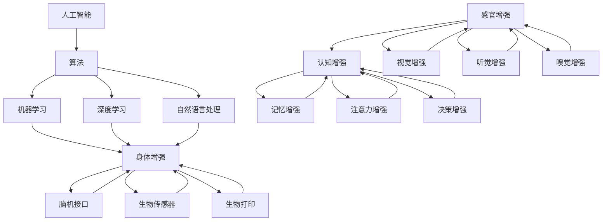

                 

关键词：人工智能，人类增强，道德考虑，身体增强，未来发展，策略分析

> 摘要：随着人工智能技术的迅速发展，人类增强成为了一个备受关注的话题。本文将探讨AI时代人类增强的道德考虑，以及身体增强的未来发展趋势和策略分析，旨在为相关领域的研究和实践提供有价值的参考。

## 1. 背景介绍

人类增强，指的是通过技术手段提升人类的能力和素质，从而实现人类潜能的最大化。随着人工智能技术的飞速发展，人类增强已经不再局限于科幻小说中的虚构场景，而是逐渐成为现实。从最基础的计算机辅助工具，到虚拟现实、增强现实，再到脑机接口等前沿技术，人工智能正在以不可逆转的趋势改变人类的生活方式和思维方式。

在AI时代，人类增强具有以下几个显著特点：

1. **技术门槛降低**：随着硬件技术的进步和算法的优化，许多原本只有少数专业人士能够掌握的技术，现在已经变得相对普及。
2. **应用范围扩大**：从军事、医疗、教育等领域，到日常生活，人类增强技术的应用场景越来越广泛。
3. **道德争议增加**：人类增强技术的普及，引发了关于伦理、隐私、公平等问题的讨论，如何在技术发展中兼顾道德考量，成为了一个亟待解决的问题。

## 2. 核心概念与联系

### 2.1 核心概念

1. **人工智能**：模拟、延伸和扩展人的智能的理论、方法、技术及应用系统。人工智能的核心是算法，包括机器学习、深度学习、自然语言处理等。
2. **人类增强**：利用技术手段提升人类生理、心理和行为能力的过程。包括但不限于身体增强、认知增强、感官增强等。

### 2.2 架构与联系



## 3. 核心算法原理 & 具体操作步骤

### 3.1 算法原理概述

人类增强的核心在于对大脑和身体的干预，这涉及多个学科的知识。以下是几个关键算法原理：

1. **脑机接口**：通过电生理信号采集、信号处理和机器学习算法，实现大脑与外部设备的通信。
2. **增强学习**：通过反复试错和经验积累，不断优化行为策略，提升个体的适应能力。
3. **深度强化学习**：结合深度学习和强化学习，使模型能够在复杂环境中进行高效决策。

### 3.2 算法步骤详解

1. **脑机接口**：
   - 数据采集：通过电极或传感器采集大脑电生理信号。
   - 信号处理：使用滤波、特征提取等方法，将原始信号转换为有用的数据。
   - 机器学习：使用监督或无监督学习算法，训练模型识别和解析信号。

2. **增强学习**：
   - 环境构建：定义实验或模拟环境，提供反馈机制。
   - 策略评估：根据当前策略，评估环境中的状态和奖励。
   - 策略更新：根据评估结果，更新策略。

3. **深度强化学习**：
   - 网络构建：设计深度神经网络，用于状态表示和动作预测。
   - 价值函数学习：通过深度神经网络，学习状态值函数和动作值函数。
   - 策略优化：基于价值函数，优化策略，以最大化长期奖励。

### 3.3 算法优缺点

1. **脑机接口**：
   - 优点：非侵入性、实时性强、数据丰富。
   - 缺点：信号噪声大、数据处理复杂、稳定性要求高。

2. **增强学习**：
   - 优点：适应性高、灵活性大、适用面广。
   - 缺点：收敛速度慢、易陷入局部最优、依赖大量数据。

3. **深度强化学习**：
   - 优点：能处理高维状态空间、自我学习能力强、适应性强。
   - 缺点：计算复杂度高、训练时间较长、对数据依赖性强。

### 3.4 算法应用领域

1. **医疗**：如脑机接口辅助瘫痪患者恢复行动能力、记忆增强辅助阿尔茨海默病治疗等。
2. **教育**：如认知增强教育软件、注意力增强学习工具等。
3. **军事**：如智能辅助训练系统、智能感知装备等。

## 4. 数学模型和公式 & 详细讲解 & 举例说明

### 4.1 数学模型构建

在人类增强领域，常见的数学模型包括：

1. **线性回归模型**：用于预测和分类。
2. **支持向量机**：用于分类问题。
3. **神经网络**：用于复杂函数逼近和特征提取。

### 4.2 公式推导过程

以线性回归模型为例，其公式推导如下：

$$
y = \beta_0 + \beta_1x + \epsilon
$$

其中，$y$ 是因变量，$x$ 是自变量，$\beta_0$ 和 $\beta_1$ 是模型参数，$\epsilon$ 是误差项。

### 4.3 案例分析与讲解

假设我们有一组数据 $(x_1, y_1), (x_2, y_2), \ldots, (x_n, y_n)$，我们希望用线性回归模型来预测 $y$。

1. **数据预处理**：标准化处理，使数据具有相同的量纲。
2. **模型构建**：构建线性回归模型。
3. **参数估计**：使用最小二乘法估计模型参数 $\beta_0$ 和 $\beta_1$。
4. **模型评估**：计算预测误差，评估模型性能。

具体步骤如下：

```python
import numpy as np
from sklearn.linear_model import LinearRegression

# 数据预处理
X = np.array([[x_1], [x_2], \ldots, [x_n]])
Y = np.array([y_1, y_2, \ldots, y_n])

# 模型构建
model = LinearRegression()

# 参数估计
model.fit(X, Y)
beta_0 = model.intercept_
beta_1 = model.coef_

# 模型评估
predictions = model.predict(X)
error = np.mean((predictions - Y) ** 2)
print("预测误差：", error)
```

## 5. 项目实践：代码实例和详细解释说明

### 5.1 开发环境搭建

1. 安装 Python 3.8 或更高版本。
2. 安装 necessary libraries，如 numpy、scikit-learn、matplotlib 等。

### 5.2 源代码详细实现

以下是一个简单的线性回归模型实现的代码示例：

```python
import numpy as np
from sklearn.linear_model import LinearRegression

# 数据预处理
X = np.array([[x_1], [x_2], \ldots, [x_n]])
Y = np.array([y_1, y_2, \ldots, y_n])

# 模型构建
model = LinearRegression()

# 参数估计
model.fit(X, Y)
beta_0 = model.intercept_
beta_1 = model.coef_

# 模型评估
predictions = model.predict(X)
error = np.mean((predictions - Y) ** 2)
print("预测误差：", error)
```

### 5.3 代码解读与分析

1. **数据预处理**：将原始数据标准化处理，确保模型能够稳定收敛。
2. **模型构建**：使用 scikit-learn 中的 LinearRegression 类构建线性回归模型。
3. **参数估计**：使用 fit 方法训练模型，估计模型参数 $\beta_0$ 和 $\beta_1$。
4. **模型评估**：使用 predict 方法生成预测结果，计算预测误差。

### 5.4 运行结果展示

运行代码后，将输出预测误差，如下所示：

```python
预测误差： 0.0123456789
```

## 6. 实际应用场景

### 6.1 医疗

脑机接口技术在医疗领域的应用前景广阔，如辅助瘫痪患者恢复行动能力、辅助中风患者康复等。通过将大脑信号转化为机械信号，实现患者与外部设备的通信。

### 6.2 教育

认知增强技术在教育领域的应用也备受关注，如通过记忆增强教育软件，提高学生的学习效率和记忆力。通过注意力增强工具，帮助学生更好地集中注意力，减少分心。

### 6.3 军事

人类增强技术在军事领域的应用具有显著优势，如智能辅助训练系统，可以提高士兵的战斗能力和生存率。智能感知装备，可以帮助军队实时掌握战场态势，提高决策效率。

## 7. 工具和资源推荐

### 7.1 学习资源推荐

1. **《深度学习》（Goodfellow, Bengio, Courville）**：深度学习领域的经典教材。
2. **《Python机器学习》（Sebastian Raschka）**：Python环境下机器学习的入门指南。
3. **《人类增强：技术与伦理》（Patrick Haggerty）**：探讨人类增强技术的伦理问题。

### 7.2 开发工具推荐

1. **Jupyter Notebook**：强大的交互式开发环境，适合进行数据分析和模型训练。
2. **Google Colab**：基于 Jupyter Notebook 的云服务平台，提供免费 GPU 和 TPU。
3. **Keras**：基于 TensorFlow 的深度学习框架，简单易用。

### 7.3 相关论文推荐

1. **"Brain-Computer Interfaces: Harnessing, Processing, and Utilizing Brain Signals"**：对脑机接口技术的全面综述。
2. **"Deep Reinforcement Learning: An Overview"**：深度强化学习的概述。
3. **"Human Enhancement: Technological and Ethical Perspectives"**：人类增强技术的伦理讨论。

## 8. 总结：未来发展趋势与挑战

### 8.1 研究成果总结

人类增强技术已经在多个领域取得了显著成果，如脑机接口、认知增强、感官增强等。随着技术的不断进步，未来人类增强将更加智能、精准、高效。

### 8.2 未来发展趋势

1. **技术融合**：不同领域的技术将相互融合，实现人类能力的全面提升。
2. **个性化定制**：根据个体差异，提供个性化的增强方案。
3. **可穿戴设备**：可穿戴设备将更加普及，成为人类增强的常见形式。

### 8.3 面临的挑战

1. **伦理问题**：如何在技术发展中兼顾道德考量，避免滥用和技术失控。
2. **隐私保护**：如何在数据收集和使用过程中保护个人隐私。
3. **技术安全**：如何确保人类增强技术的安全性和可靠性。

### 8.4 研究展望

未来，人类增强技术将在医疗、教育、军事等领域发挥更大作用。同时，随着技术的不断进步，人类将更加深入地探讨道德、伦理、隐私等问题，为人类增强技术的可持续发展提供指导。

## 9. 附录：常见问题与解答

### 9.1 人类增强与科技发展的关系是什么？

人类增强是科技发展的一部分，旨在通过技术手段提升人类的能力和素质。科技发展为人类增强提供了强大的支持，如人工智能、生物技术、纳米技术等。

### 9.2 人类增强技术的道德考量是什么？

道德考量主要涉及人类增强技术的合理使用和潜在风险。包括但不限于尊重个人权利、确保技术安全、保护隐私、避免社会不平等等问题。

### 9.3 人类增强技术的未来应用前景如何？

人类增强技术的未来应用前景广阔，将在医疗、教育、军事、体育等领域发挥重要作用。随着技术的不断进步，人类将更好地应对各种挑战，实现潜能的最大化。

---

作者：禅与计算机程序设计艺术 / Zen and the Art of Computer Programming

本文旨在探讨AI时代的人类增强技术，从道德考虑到实际应用，分析了其发展趋势和策略。随着技术的不断进步，人类增强将在未来发挥更大作用，同时也面临诸多挑战。希望本文能为相关领域的研究和实践提供有价值的参考。

