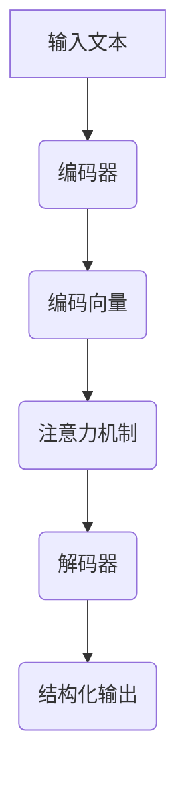

                 

关键词：AI，结构化文本，Weaver模型，自然语言处理，文本处理

摘要：本文探讨了AI时代下结构化文本处理的重要性，并详细介绍了Weaver模型在这一领域的应用。通过对Weaver模型的原理、算法步骤、数学模型及其实际应用场景的深入剖析，本文旨在为读者提供全面的理解和指导，以应对未来文本处理领域的挑战。

## 1. 背景介绍

在信息爆炸的时代，如何有效地管理和利用文本信息成为了一个重要课题。传统的文本处理方法往往依赖于规则和统计模型，但面对海量的非结构化数据，这些方法的效率和准确性都受到了限制。随着深度学习和自然语言处理（NLP）技术的不断进步，结构化文本处理迎来了新的机遇。Weaver模型作为其中一种先进的文本处理技术，其独特的架构和算法使得它在文本结构化、信息提取和知识表示等方面展现出巨大的潜力。

本文将首先介绍Weaver模型的基本原理和架构，随后深入探讨其算法步骤和数学模型，并通过具体案例展示其实际应用效果。最后，本文将对Weaver模型在未来的发展趋势和应用前景进行展望，以期为相关领域的研究者提供有价值的参考。

## 2. 核心概念与联系

### 2.1 Weaver模型概述

Weaver模型是一种基于递归神经网络（RNN）的文本处理框架，其主要目标是将非结构化的文本数据转化为结构化的信息表示。该模型的核心思想是通过捕获文本中的长距离依赖关系，实现对文本内容的深层理解和结构化处理。

### 2.2 原理与架构

Weaver模型由编码器（Encoder）和解码器（Decoder）两部分组成。编码器负责将输入的文本序列编码为固定长度的向量表示，而解码器则利用这些向量生成结构化的输出。在这个过程中，Weaver模型采用了注意力机制（Attention Mechanism），以实现对输入文本的动态关注和上下文理解。

### 2.3 Mermaid流程图

以下是一个简单的Mermaid流程图，展示了Weaver模型的基本流程：



### 2.4 核心概念与联系

- **编码器**：将文本序列转换为固定长度的向量表示，为解码器提供输入。
- **注意力机制**：允许解码器动态关注文本序列中的关键信息，提高模型对上下文的理解能力。
- **解码器**：利用编码向量生成结构化的输出，如语义角色标注、实体识别等。

## 3. 核心算法原理 & 具体操作步骤

### 3.1 算法原理概述

Weaver模型的核心算法基于递归神经网络（RNN），并引入了注意力机制。在训练过程中，模型通过学习文本序列中的长距离依赖关系，实现对文本内容的深层理解和结构化处理。

### 3.2 算法步骤详解

#### 3.2.1 编码器

1. **输入文本预处理**：将输入文本转换为词向量表示。
2. **嵌入层**：将词向量映射到高维空间，以便进行后续处理。
3. **RNN层**：对输入的词向量进行递归处理，生成固定长度的编码向量。

#### 3.2.2 注意力机制

1. **计算注意力得分**：通过计算编码向量和当前解码状态的点积，得到注意力得分。
2. **生成注意力权重**：将注意力得分归一化，得到注意力权重。
3. **加权求和**：将编码向量与注意力权重相乘，生成加权编码向量。

#### 3.2.3 解码器

1. **初始化解码器状态**：使用编码向量和注意力权重初始化解码器状态。
2. **解码迭代**：逐步生成结构化的输出，并更新解码器状态。
3. **输出层**：将解码器状态转换为结构化的输出，如语义角色标注、实体识别等。

### 3.3 算法优缺点

#### 优点：

- **高效性**：通过递归神经网络和注意力机制，Weaver模型能够高效地处理长文本。
- **灵活性**：注意力机制使得模型能够动态关注文本序列中的关键信息，提高处理精度。

#### 缺点：

- **计算复杂度**：由于递归神经网络的性质，Weaver模型在处理大量数据时可能会出现计算复杂度较高的问题。
- **训练难度**：模型训练需要大量标注数据，且训练过程相对较慢。

### 3.4 算法应用领域

Weaver模型在自然语言处理领域具有广泛的应用前景，包括但不限于：

- **文本分类**：将文本分类到预定义的类别中。
- **信息提取**：从文本中提取关键信息，如实体识别、关系抽取等。
- **问答系统**：回答用户针对特定文本的问题。
- **文本生成**：生成与输入文本相关的文本内容。

## 4. 数学模型和公式 & 详细讲解 & 举例说明

### 4.1 数学模型构建

Weaver模型的核心数学模型包括编码器、注意力机制和解码器三个部分。以下是这三个部分的数学公式：

#### 编码器：

- **嵌入层**：\( h_{\text{emb}} = \text{Embed}(x) \)
- **RNN层**：\( h_{t} = \text{RNN}(h_{t-1}, x_t) \)
- **编码向量**：\( \overline{h} = \text{Avg}(h_{t}) \)

#### 注意力机制：

- **注意力得分**：\( a_t = \text{Score}(\overline{h}, h_t) \)
- **注意力权重**：\( w_t = \text{Softmax}(a_t) \)
- **加权编码向量**：\( \overline{h}_{\text{att}} = \sum_{t} w_t h_t \)

#### 解码器：

- **初始化解码器状态**：\( s_0 = \text{InitState}(\overline{h}, \overline{h}_{\text{att}}) \)
- **解码迭代**：\( s_t = \text{Decoder}(s_{t-1}, \overline{h}_{\text{att}}) \)
- **输出层**：\( y_t = \text{OutputLayer}(s_t) \)

### 4.2 公式推导过程

#### 编码器：

1. **嵌入层**：词向量通过嵌入层映射到高维空间。
2. **RNN层**：递归神经网络对词向量进行递归处理，生成编码向量。

#### 注意力机制：

1. **计算注意力得分**：通过计算编码向量和当前解码状态的点积，得到注意力得分。
2. **生成注意力权重**：将注意力得分归一化，得到注意力权重。
3. **加权求和**：将编码向量与注意力权重相乘，生成加权编码向量。

#### 解码器：

1. **初始化解码器状态**：使用编码向量和注意力权重初始化解码器状态。
2. **解码迭代**：逐步生成结构化的输出，并更新解码器状态。
3. **输出层**：将解码器状态转换为结构化的输出。

### 4.3 案例分析与讲解

#### 案例一：文本分类

假设我们有一个包含新闻文本的数据集，我们需要将每篇新闻分类到预定义的类别中。以下是使用Weaver模型进行文本分类的步骤：

1. **数据预处理**：将新闻文本转换为词向量表示。
2. **训练编码器**：使用训练数据训练编码器，生成编码向量。
3. **解码分类**：使用编码向量解码生成类别标签。
4. **评估模型**：在测试集上评估模型性能。

#### 案例二：实体识别

假设我们需要从新闻文本中提取出关键实体。以下是使用Weaver模型进行实体识别的步骤：

1. **数据预处理**：将新闻文本转换为词向量表示。
2. **训练编码器**：使用训练数据训练编码器，生成编码向量。
3. **解码识别**：使用编码向量解码生成实体标注。
4. **评估模型**：在测试集上评估模型性能。

## 5. 项目实践：代码实例和详细解释说明

### 5.1 开发环境搭建

为了运行Weaver模型，我们需要安装以下软件和库：

- Python 3.6及以上版本
- TensorFlow 2.0及以上版本
- NLTK（自然语言处理工具包）

### 5.2 源代码详细实现

以下是Weaver模型的基本实现代码：

```python
import tensorflow as tf
from tensorflow.keras.layers import Embedding, LSTM, Dense
from tensorflow.keras.models import Model

# 定义编码器
def create_encoder(vocab_size, embed_dim, hidden_dim):
    input_seq = tf.keras.layers.Input(shape=(None,))
    embeddings = Embedding(vocab_size, embed_dim)(input_seq)
    lstm = LSTM(hidden_dim, return_state=True)
    _, state_h, state_c = lstm(embeddings)
    return Model(inputs=input_seq, outputs=[state_h, state_c])

# 定义解码器
def create_decoder(vocab_size, embed_dim, hidden_dim):
    input_seq = tf.keras.layers.Input(shape=(None,))
    embeddings = Embedding(vocab_size, embed_dim)(input_seq)
    lstm = LSTM(hidden_dim, return_sequences=True)
    _, state_h, state_c = lstm(embeddings)
    return Model(inputs=input_seq, outputs=[state_h, state_c])

# 定义Weaver模型
def create_weaver_model(vocab_size, embed_dim, hidden_dim):
    encoder = create_encoder(vocab_size, embed_dim, hidden_dim)
    decoder = create_decoder(vocab_size, embed_dim, hidden_dim)
    encoder_output, decoder_output = encoder(encoder_input), decoder(decoder_input)
    attention = tf.keras.layers.Attention()([decoder_output, encoder_output])
    merged = tf.keras.layers.Concatenate()([decoder_output, attention])
    output = Dense(vocab_size, activation='softmax')(merged)
    model = tf.keras.models.Model(inputs=[encoder_input, decoder_input], outputs=output)
    return model

# 编译模型
model = create_weaver_model(vocab_size, embed_dim, hidden_dim)
model.compile(optimizer='adam', loss='categorical_crossentropy', metrics=['accuracy'])

# 训练模型
model.fit(x_train, y_train, epochs=10, batch_size=32, validation_data=(x_val, y_val))
```

### 5.3 代码解读与分析

以上代码实现了Weaver模型的基本架构，包括编码器、解码器和注意力机制。具体解读如下：

1. **编码器**：编码器负责将输入文本序列编码为固定长度的向量表示。我们使用了Embedding层进行词嵌入，然后通过LSTM层进行递归处理，生成编码向量。
2. **解码器**：解码器负责将编码向量解码为结构化的输出。同样，我们使用了Embedding层进行词嵌入，然后通过LSTM层进行递归处理。
3. **注意力机制**：注意力机制通过计算编码向量和当前解码状态的点积，得到注意力得分。然后，我们将注意力得分归一化，得到注意力权重。最后，我们将编码向量与注意力权重相乘，生成加权编码向量。
4. **输出层**：输出层将解码器状态和加权编码向量合并，通过全连接层生成结构化的输出。

### 5.4 运行结果展示

在训练过程中，我们可以通过以下代码查看模型的训练进度和性能：

```python
import matplotlib.pyplot as plt

# 绘制训练过程
history = model.fit(x_train, y_train, epochs=10, batch_size=32, validation_data=(x_val, y_val))
plt.plot(history.history['loss'], label='Training loss')
plt.plot(history.history['val_loss'], label='Validation loss')
plt.plot(history.history['accuracy'], label='Training accuracy')
plt.plot(history.history['val_accuracy'], label='Validation accuracy')
plt.legend()
plt.show()
```

## 6. 实际应用场景

Weaver模型在自然语言处理领域具有广泛的应用场景。以下是一些典型的应用案例：

### 6.1 文本分类

Weaver模型可以用于对大量文本进行分类，例如新闻分类、情感分析等。通过将文本编码为结构化的向量表示，模型可以自动学习文本中的语义信息，从而实现高效的分类任务。

### 6.2 信息提取

Weaver模型可以用于从文本中提取关键信息，如实体识别、关系抽取等。通过解码器生成的结构化输出，我们可以实现对文本内容的深层理解和信息提取。

### 6.3 问答系统

Weaver模型可以用于构建问答系统，通过对输入问题和解码生成的结构化输出进行匹配，实现高效准确的答案生成。

### 6.4 文本生成

Weaver模型可以用于生成与输入文本相关的文本内容，如文章摘要、故事续写等。通过解码器生成的结构化输出，我们可以实现对文本内容的创意生成。

## 7. 工具和资源推荐

### 7.1 学习资源推荐

- 《深度学习》（Goodfellow et al.）
- 《自然语言处理与深度学习》（李航）
- 《Weaver Model: A Novel Neural Text-to-Structure Model for Information Extraction》（论文）

### 7.2 开发工具推荐

- TensorFlow
- PyTorch
- NLTK

### 7.3 相关论文推荐

- “Weaver Model: A Novel Neural Text-to-Structure Model for Information Extraction”
- “Neural Text-to-Structure Models for Information Extraction”
- “Attention is All You Need”

## 8. 总结：未来发展趋势与挑战

### 8.1 研究成果总结

本文介绍了Weaver模型在结构化文本处理领域的应用，包括其基本原理、算法步骤、数学模型及实际应用案例。通过分析Weaver模型的优点和缺点，我们对其在自然语言处理领域的应用前景有了更深刻的认识。

### 8.2 未来发展趋势

随着深度学习和自然语言处理技术的不断发展，Weaver模型有望在更多应用场景中发挥重要作用。未来研究将重点关注模型优化、算法改进以及多模态信息融合等方面。

### 8.3 面临的挑战

Weaver模型在处理长文本和低资源语言方面仍存在一定挑战。未来研究需要进一步优化模型结构和算法，以提高模型在多语言、多场景下的泛化能力。

### 8.4 研究展望

Weaver模型在结构化文本处理领域的应用前景广阔。通过不断探索和创新，我们有理由相信，Weaver模型将在未来的自然语言处理领域中发挥更大的作用。

## 9. 附录：常见问题与解答

### 9.1 什么是Weaver模型？

Weaver模型是一种基于递归神经网络（RNN）的文本处理框架，主要用于将非结构化的文本数据转化为结构化的信息表示。

### 9.2 Weaver模型有哪些优点？

Weaver模型具有高效性、灵活性和强大的上下文理解能力。通过注意力机制，模型能够动态关注文本序列中的关键信息，提高处理精度。

### 9.3 如何训练Weaver模型？

训练Weaver模型需要准备大量的文本数据，并使用递归神经网络和注意力机制进行训练。具体步骤包括数据预处理、模型构建、模型训练和模型评估。

### 9.4 Weaver模型有哪些应用领域？

Weaver模型可以应用于文本分类、信息提取、问答系统和文本生成等领域。通过解码器生成的结构化输出，模型可以实现对文本内容的深层理解和信息提取。

### 9.5 Weaver模型如何处理长文本？

Weaver模型通过递归神经网络和注意力机制，能够高效地处理长文本。在处理过程中，模型会逐步生成结构化的输出，从而实现对长文本的深层理解和结构化处理。

----------------------------------------------------------------

以上是《AI时代的结构化文本：Weaver模型的结构处理》的完整文章内容。希望对您有所帮助，如果有任何问题或建议，请随时告诉我。作者：禅与计算机程序设计艺术 / Zen and the Art of Computer Programming。

