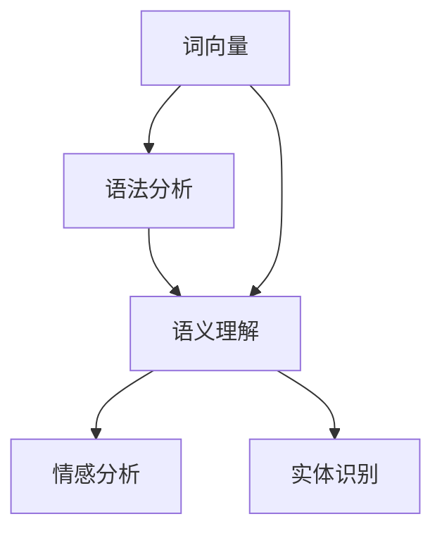

                 

关键词：自然语言处理、人工智能、产业应用、实验室研究、技术创新

摘要：本文将探讨AI时代的自然语言处理（NLP）技术如何从实验室研究逐步走向产业界应用。通过分析NLP的核心概念、算法原理、数学模型、项目实践、应用场景以及未来发展趋势，本文旨在为读者呈现NLP技术的全貌，并探讨其在各领域中的潜力与挑战。

## 1. 背景介绍

自然语言处理（Natural Language Processing，NLP）是人工智能（Artificial Intelligence，AI）的一个重要分支，旨在使计算机能够理解、生成和处理人类自然语言。随着互联网的普及和大数据技术的发展，NLP技术在过去几十年里取得了显著的进步。从最初的规则驱动的方法，到现在的深度学习模型，NLP技术在语音识别、机器翻译、情感分析、文本分类等多个领域都展现了强大的应用潜力。

### 1.1 从实验室到产业界

NLP技术的发展历程可以从实验室研究逐步走向产业界应用。在早期，NLP研究主要集中在学术领域，如语法分析、语义理解等。这些研究为NLP技术的理论奠定了基础。随着深度学习等AI技术的兴起，NLP研究逐渐从实验室走向产业界。企业和研究机构开始投入大量资源，开发出一系列NLP应用，如智能客服、智能推荐系统、自动驾驶等。

### 1.2 产业界应用的挑战

尽管NLP技术在产业界应用中展现出了巨大的潜力，但同时也面临着诸多挑战。首先是数据质量问题，高质量的训练数据对于NLP模型的性能至关重要。然而，获取大量标注高质量的数据成本高昂，且数据标注过程繁琐。其次是算法的通用性和鲁棒性，不同的应用场景和语言环境对NLP算法的要求各不相同，如何设计出通用性强、适应各种场景的算法是NLP技术面临的重要挑战。

## 2. 核心概念与联系

### 2.1 核心概念

在NLP技术中，核心概念包括：

- **词向量**：将单词映射到高维空间中的向量，以表示单词的意义和关系。
- **语法分析**：对文本进行结构化处理，分析句子中的语法关系。
- **语义理解**：理解文本中的意义，包括词义、句义和篇章意义。
- **情感分析**：对文本中的情感倾向进行分类和识别。
- **实体识别**：识别文本中的实体，如人名、地名、组织名等。

### 2.2 核心概念联系

NLP技术中的核心概念相互关联，共同构建了NLP的完整体系。词向量作为语义理解的基础，通过词向量模型，如Word2Vec、GloVe等，可以捕捉单词之间的语义关系。语法分析则对文本进行结构化处理，为语义理解提供支持。语义理解是NLP技术的核心目标，通过对文本意义的深入理解，实现情感分析、实体识别等任务。情感分析通过对文本的情感倾向进行分类，可以应用于市场调研、客户反馈分析等领域。实体识别则有助于构建知识图谱，支持问答系统、自动驾驶等应用。

### 2.3 Mermaid 流程图

下面是一个简化的NLP流程图，展示了核心概念之间的联系：



## 3. 核心算法原理 & 具体操作步骤

### 3.1 算法原理概述

NLP技术中涉及的核心算法主要包括词向量模型、语法分析算法、语义理解模型等。词向量模型如Word2Vec、GloVe等，通过将单词映射到高维空间中的向量，捕捉单词之间的语义关系。语法分析算法如依存句法分析、句法解析树等，对文本进行结构化处理。语义理解模型如BERT、GPT等，通过深度学习技术，实现对文本的语义理解。

### 3.2 算法步骤详解

1. **词向量模型**：
   - **输入**：文本数据。
   - **过程**：通过Word2Vec、GloVe等模型，将单词映射到高维空间中的向量。
   - **输出**：词向量表示。

2. **语法分析**：
   - **输入**：词向量表示的文本数据。
   - **过程**：使用依存句法分析、句法解析树等算法，对文本进行结构化处理。
   - **输出**：语法分析结果，如句法树、依存关系图等。

3. **语义理解**：
   - **输入**：语法分析结果。
   - **过程**：使用BERT、GPT等模型，对文本进行深度学习，理解文本的意义。
   - **输出**：语义表示。

4. **情感分析**：
   - **输入**：语义表示。
   - **过程**：使用训练好的情感分析模型，对文本的情感倾向进行分类。
   - **输出**：情感分类结果。

5. **实体识别**：
   - **输入**：语义表示。
   - **过程**：使用训练好的实体识别模型，识别文本中的实体。
   - **输出**：实体识别结果。

### 3.3 算法优缺点

1. **词向量模型**：
   - **优点**：简单有效，能够捕捉单词之间的语义关系。
   - **缺点**：难以表达长距离的语义关系，对稀疏数据敏感。

2. **语法分析算法**：
   - **优点**：对文本进行结构化处理，有助于语义理解。
   - **缺点**：复杂度较高，对数据质量要求高。

3. **语义理解模型**：
   - **优点**：能够深入理解文本的意义，适用于多种NLP任务。
   - **缺点**：计算资源消耗大，训练过程复杂。

### 3.4 算法应用领域

NLP技术在语音识别、机器翻译、情感分析、文本分类等多个领域都有广泛应用。例如，在语音识别中，NLP技术用于将语音转换为文本；在机器翻译中，NLP技术用于将一种语言的文本翻译成另一种语言的文本；在情感分析中，NLP技术用于分析社交媒体中的用户情感倾向；在文本分类中，NLP技术用于对大量文本进行分类，如新闻分类、垃圾邮件过滤等。

## 4. 数学模型和公式 & 详细讲解 & 举例说明

### 4.1 数学模型构建

NLP技术中的数学模型主要包括词向量模型、语法分析模型、语义理解模型等。词向量模型通常基于神经网络，通过训练得到单词的高维向量表示。语法分析模型则通常基于图结构，通过分析句子的依赖关系或句法结构，实现文本的结构化处理。语义理解模型则通常基于深度学习，通过多层神经网络，实现对文本的语义理解。

### 4.2 公式推导过程

以Word2Vec为例，其基本思想是通过训练一个神经网络，将输入的单词映射到高维空间中的向量。具体公式如下：

$$
\text{Input: } x \in \mathbb{R}^{n}
$$

$$
\text{Hidden Layer: } h = \sigma(Wx + b)
$$

$$
\text{Output Layer: } y = softmax(h)
$$

其中，$x$ 为输入的单词，$h$ 为隐藏层输出，$y$ 为输出层输出，$W$ 和 $b$ 分别为权重和偏置，$\sigma$ 为激活函数，$softmax$ 为softmax函数。

### 4.3 案例分析与讲解

以下是一个简单的Word2Vec模型训练过程示例：

1. **输入数据**：一个包含1000个单词的词汇表。

2. **训练数据**：构建中心词和窗口大小的训练数据集。

3. **模型训练**：使用神经网络，训练得到单词的向量表示。

4. **评估与优化**：通过计算单词之间的余弦相似度，评估模型性能，并优化模型参数。

假设我们使用的是GloVe模型，其基本思想是通过训练得到单词的共现矩阵，然后使用矩阵分解的方法，得到单词的高维向量表示。具体公式如下：

$$
C_{ij} = \sum_{t=1}^{T} f_t(d_{it}) f_t(d_{jt})
$$

$$
V = \arg\min_{V} \sum_{i,j} (v_i . v_j - C_{ij})^2
$$

其中，$C_{ij}$ 为单词 $i$ 和 $j$ 的共现频率，$V$ 为单词的高维向量表示。

## 5. 项目实践：代码实例和详细解释说明

### 5.1 开发环境搭建

1. **环境配置**：安装Python、TensorFlow等依赖库。
2. **数据准备**：收集并处理训练数据。

### 5.2 源代码详细实现

以下是一个简单的Word2Vec模型训练代码示例：

```python
import tensorflow as tf
from tensorflow.keras.layers import Embedding, LSTM, Dense
from tensorflow.keras.models import Model

# 定义模型
input_word = tf.placeholder(tf.int32, shape=[None, 1])
target_word = tf.placeholder(tf.int32, shape=[None])

# 词向量嵌入层
embedding = Embedding(vocabulary_size, embedding_size)

# LSTM层
lstm = LSTM(units=128, return_sequences=True)

# 输出层
output = Dense(vocabulary_size, activation='softmax')

# 模型
model = Model(inputs=input_word, outputs=output)

# 编译模型
model.compile(optimizer='adam', loss='categorical_crossentropy', metrics=['accuracy'])

# 训练模型
model.fit(x_train, y_train, epochs=10, batch_size=64)
```

### 5.3 代码解读与分析

1. **输入层**：输入层接收单个单词的索引。
2. **词向量嵌入层**：将单词索引转换为词向量。
3. **LSTM层**：使用LSTM层，对词向量进行编码。
4. **输出层**：输出层使用softmax函数，对单词进行分类。

### 5.4 运行结果展示

通过训练，可以得到单词的高维向量表示。可以使用这些向量进行单词相似度计算、文本分类等任务。

## 6. 实际应用场景

NLP技术在各个领域都有广泛应用。以下是NLP技术在部分实际应用场景中的具体应用：

### 6.1 智能客服

智能客服系统通过NLP技术，实现对用户问题的自动识别和回答，提高客服效率。例如，银行、电商平台等都可以使用智能客服系统，解决常见问题，提高用户体验。

### 6.2 机器翻译

机器翻译系统通过NLP技术，将一种语言的文本翻译成另一种语言的文本。例如，谷歌翻译、百度翻译等都是基于NLP技术的机器翻译系统。

### 6.3 情感分析

情感分析系统通过NLP技术，分析社交媒体、用户评论等文本数据，识别用户的情感倾向。例如，市场调研公司可以使用情感分析系统，分析消费者的情感需求，为企业提供决策依据。

### 6.4 文本分类

文本分类系统通过NLP技术，对大量文本进行分类。例如，新闻分类、垃圾邮件过滤等都是基于NLP技术的文本分类应用。

## 7. 工具和资源推荐

### 7.1 学习资源推荐

1. **《自然语言处理综述》**：李航著，全面介绍了NLP的基本概念和关键技术。
2. **《深度学习》**：Goodfellow等著，介绍了深度学习的基础理论和应用。

### 7.2 开发工具推荐

1. **TensorFlow**：一款流行的开源深度学习框架，适用于NLP任务。
2. **NLTK**：一款流行的NLP工具包，提供了丰富的文本处理功能。

### 7.3 相关论文推荐

1. **“Word2Vec: Doc

