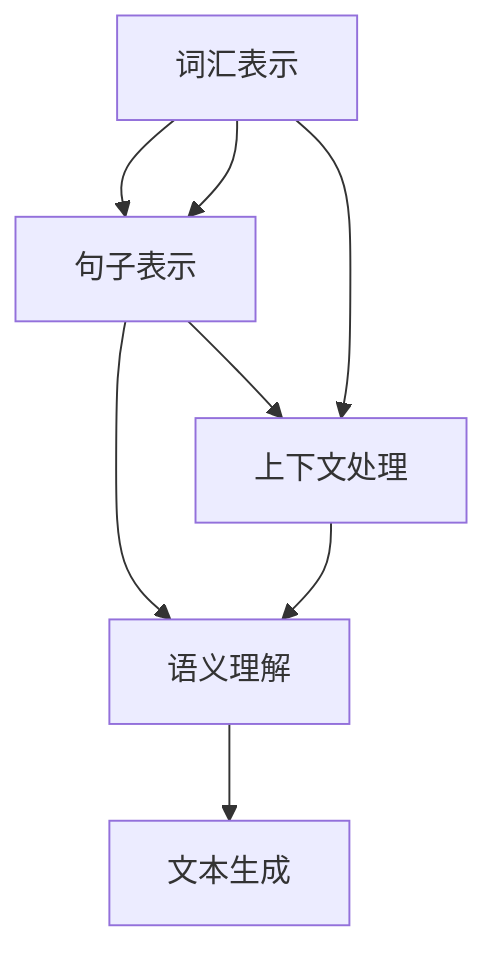

                 

关键词：自然语言处理，机器翻译，深度学习，生成对抗网络，人工智能创作，文本生成

> 摘要：本文将探讨AI时代的自然语言处理技术，从机器翻译到文本创作，深入分析其核心算法原理、数学模型、应用场景以及未来发展趋势。通过详实的案例和实践，揭示这些技术如何改变我们的生活和行业。

## 1. 背景介绍

随着互联网和人工智能技术的发展，自然语言处理（Natural Language Processing, NLP）已经成为计算机科学领域的一个重要分支。NLP旨在使计算机能够理解、处理和生成人类语言，从而实现人机交互和信息检索。在过去几十年中，NLP技术在机器翻译、文本分类、情感分析、问答系统等方面取得了显著进展。

然而，传统的NLP方法往往依赖于规则和统计模型，存在准确率低、泛化能力差等问题。随着深度学习的兴起，基于神经网络的方法逐渐成为NLP的主流。深度学习在图像识别、语音识别等领域取得了突破性成果，其在自然语言处理中的应用也愈发成熟。

本文将重点讨论AI时代的自然语言处理技术，特别是机器翻译和文本创作领域。我们将详细介绍核心算法原理，探讨数学模型和公式，并通过实际案例展示技术应用效果。

### 1.1 自然语言处理的挑战

自然语言处理面临的挑战主要包括：

- **语言多样性**：人类语言丰富多样，每种语言都有其独特的语法、词汇和文化背景。这使得构建通用的NLP模型变得异常复杂。
- **语境理解**：语言具有很强的上下文依赖性，同样的词汇在不同的语境下可能具有完全不同的含义。理解并准确处理这种语境变化是NLP的难点。
- **多模态处理**：现实中的语言处理任务往往涉及文本、语音、图像等多种数据类型，多模态信息的融合处理对算法提出了更高的要求。

### 1.2 深度学习在NLP中的应用

深度学习在NLP中的应用主要包括以下几类模型：

- **循环神经网络（RNN）**：RNN能够处理序列数据，适用于文本分类、序列标注等任务。
- **长短时记忆网络（LSTM）**：LSTM是RNN的一种改进，能够更好地处理长序列数据，提高了模型的稳定性。
- **门控循环单元（GRU）**：GRU是另一种RNN改进模型，相比LSTM计算复杂度更低。
- **Transformer模型**：Transformer引入了注意力机制，使得模型能够全局处理序列信息，显著提升了翻译和文本生成等任务的性能。

## 2. 核心概念与联系

自然语言处理的核心概念包括词汇表示、句子表示、语义理解和生成。以下是这些概念及其相互关系的Mermaid流程图。



### 2.1 词汇表示

词汇表示是将自然语言中的词汇映射到机器可以处理的向量表示。常用的方法包括：

- **词袋模型（Bag of Words, BoW）**：将文本转换为词汇的集合，不考虑词汇的顺序。
- **词嵌入（Word Embedding）**：通过将词汇映射到低维向量空间，捕捉词汇间的语义关系。
- **词性标注（Part-of-Speech Tagging）**：为文本中的每个词汇赋予词性，用于进一步的语言处理任务。

### 2.2 句子表示

句子表示是将整个句子映射到一个固定维度的向量表示。常用的方法包括：

- **词嵌入加和（Sum of Word Embeddings）**：将句子中的每个词汇的词嵌入向量相加得到句子表示。
- **循环神经网络（RNN）**：使用RNN对句子进行编码，得到句子的固定长度表示。
- **Transformer模型**：使用多头自注意力机制，对句子中的每个词汇进行加权，得到句子的全局表示。

### 2.3 语义理解

语义理解是指模型对句子或文本中的语义信息进行解析和理解。常用的方法包括：

- **基于规则的语义分析**：使用预定义的语法规则对文本进行分析。
- **依存句法分析（Dependency Parsing）**：通过分析词汇之间的依存关系，理解句子的结构。
- **语义角色标注（Semantic Role Labeling）**：为句子中的词汇赋予语义角色，用于理解句子的意图。

### 2.4 文本生成

文本生成是指模型根据输入的文本生成新的文本。常用的方法包括：

- **序列到序列模型（Seq2Seq）**：使用编码器-解码器框架，将输入的句子编码为向量表示，然后解码生成新的句子。
- **生成对抗网络（GAN）**：通过对抗训练生成高质量的文本。
- **Transformer模型**：利用自注意力机制生成文本，具有强大的生成能力。

## 3. 核心算法原理 & 具体操作步骤

### 3.1 算法原理概述

自然语言处理的核心算法主要基于深度学习和神经网络。以下是几个关键算法的原理概述：

- **循环神经网络（RNN）**：RNN能够处理序列数据，通过隐藏状态捕捉序列中的上下文信息。
- **长短时记忆网络（LSTM）**：LSTM是RNN的一种改进，能够更好地处理长序列数据，提高了模型的稳定性。
- **门控循环单元（GRU）**：GRU是另一种RNN改进模型，相比LSTM计算复杂度更低。
- **Transformer模型**：Transformer引入了注意力机制，使得模型能够全局处理序列信息，显著提升了翻译和文本生成等任务的性能。
- **生成对抗网络（GAN）**：GAN通过生成器和判别器的对抗训练，生成高质量的文本。

### 3.2 算法步骤详解

以下是自然语言处理算法的具体步骤详解：

#### 3.2.1 数据预处理

1. **文本清洗**：去除文本中的标点符号、停用词、特殊字符等，保留有效词汇。
2. **分词**：将文本分割成单词或词组，为后续的词嵌入和句嵌入做准备。
3. **词嵌入**：将词汇映射到低维向量空间，可以使用预训练的词嵌入模型，如Word2Vec、GloVe等。

#### 3.2.2 模型训练

1. **编码器**：使用编码器对输入的句子进行编码，生成句子的固定长度表示。
2. **解码器**：使用解码器将编码后的向量表示解码为新的句子。
3. **损失函数**：计算预测句子与真实句子之间的差异，使用损失函数优化模型参数。
4. **反向传播**：根据损失函数对模型参数进行反向传播和优化。

#### 3.2.3 模型评估

1. **交叉验证**：使用交叉验证评估模型的泛化能力。
2. **准确率、召回率、F1值**：计算模型在测试集上的准确率、召回率和F1值，评估模型性能。
3. **BLEU评分**：使用BLEU评分标准评估机器翻译模型的翻译质量。

### 3.3 算法优缺点

#### 优点

- **高准确率**：深度学习模型在自然语言处理任务中取得了较高的准确率。
- **自适应能力**：模型能够通过不断学习和优化，适应不同的语言环境和数据分布。
- **可扩展性**：基于神经网络的方法可以很容易地扩展到新的任务和数据集。

#### 缺点

- **计算资源消耗**：训练深度学习模型需要大量的计算资源和时间。
- **数据依赖性**：模型性能很大程度上取决于训练数据的质量和数量。
- **解释性不足**：深度学习模型通常被认为是“黑箱”，其内部工作机制难以解释和理解。

### 3.4 算法应用领域

自然语言处理算法广泛应用于以下领域：

- **机器翻译**：自动将一种语言翻译成另一种语言，如Google翻译。
- **文本分类**：将文本归类到不同的类别，如垃圾邮件过滤。
- **情感分析**：分析文本中的情感倾向，如社交媒体情绪分析。
- **问答系统**：自动回答用户提出的问题，如智能客服。
- **文本生成**：根据输入的文本生成新的文本，如自动写作、对话生成。

## 4. 数学模型和公式 & 详细讲解 & 举例说明

### 4.1 数学模型构建

自然语言处理中的数学模型主要包括词汇表示、句子表示、语义理解等。

#### 4.1.1 词汇表示

词汇表示通常使用词嵌入模型，将词汇映射到低维向量空间。词嵌入模型的基本形式如下：

$$
\text{embed}(w) = \mathbf{e}_w \in \mathbb{R}^d
$$

其中，$w$表示词汇，$\mathbf{e}_w$表示该词汇的词嵌入向量，$d$表示词嵌入向量的维度。

#### 4.1.2 句子表示

句子表示是将整个句子映射到一个固定维度的向量表示。常用的方法包括：

- **词嵌入加和**：
$$
\text{sent}(\mathbf{s}) = \sum_{w \in \mathbf{s}} \text{embed}(w)
$$
其中，$\mathbf{s}$表示句子，$\text{sent}(\mathbf{s})$表示句子的向量表示。

- **循环神经网络（RNN）**：
$$
\text{RNN}(\mathbf{s}, \mathbf{h}_{t-1}) = \text{激活函数}\left(\mathbf{W}_h \text{ embed}(\mathbf{s}) + \mathbf{W}_c \mathbf{h}_{t-1} + b\right)
$$
其中，$\mathbf{h}_{t-1}$表示上一个时间步的隐藏状态，$\mathbf{W}_h$和$\mathbf{W}_c$分别表示权重矩阵，$b$表示偏置。

- **Transformer模型**：
$$
\text{MultiHeadAttention}(\mathbf{Q}, \mathbf{K}, \mathbf{V}) = \text{softmax}\left(\frac{\text{QK}^T}{\sqrt{d_k}}\right) \mathbf{V}
$$
其中，$\mathbf{Q}$、$\mathbf{K}$和$\mathbf{V}$分别表示查询向量、关键向量和价值向量，$d_k$表示关键向量的维度。

#### 4.1.3 语义理解

语义理解涉及词汇和句子表示的融合，以及上下文信息的捕捉。常用的方法包括：

- **依存句法分析**：
$$
\text{DependencyParse}(\mathbf{s}) = \text{计算词汇间的依存关系}
$$
- **语义角色标注**：
$$
\text{SemanticRoleLabeling}(\mathbf{s}) = \text{为句子中的词汇赋予语义角色}
$$

### 4.2 公式推导过程

以下是自然语言处理中一些关键公式的推导过程。

#### 4.2.1 词嵌入公式推导

词嵌入模型通常基于神经网络进行训练，其基本公式如下：

$$
\text{Loss} = -\sum_{w \in \mathbf{V}} \sum_{i=1}^n \text{log} \sigma(\mathbf{W} \text{ embed}(\mathbf{w}_i) + b)
$$

其中，$\mathbf{W}$表示权重矩阵，$\text{embed}(\mathbf{w}_i)$表示词汇$w_i$的词嵌入向量，$\sigma$表示sigmoid函数。

#### 4.2.2 句子表示公式推导

循环神经网络（RNN）的句子表示公式如下：

$$
\mathbf{h}_t = \text{激活函数}\left(\mathbf{W}_h \text{ embed}(\mathbf{s}) + \mathbf{W}_c \mathbf{h}_{t-1} + b\right)
$$

其中，$\mathbf{h}_t$表示当前时间步的隐藏状态，$\mathbf{s}$表示句子，$\mathbf{W}_h$和$\mathbf{W}_c$分别表示权重矩阵，$b$表示偏置。

#### 4.2.3 Transformer模型公式推导

Transformer模型的自注意力机制公式如下：

$$
\text{MultiHeadAttention}(\mathbf{Q}, \mathbf{K}, \mathbf{V}) = \text{softmax}\left(\frac{\text{QK}^T}{\sqrt{d_k}}\right) \mathbf{V}
$$

其中，$\mathbf{Q}$、$\mathbf{K}$和$\mathbf{V}$分别表示查询向量、关键向量和价值向量，$d_k$表示关键向量的维度。

### 4.3 案例分析与讲解

以下通过一个简单的案例，展示自然语言处理中的数学模型和公式如何应用于实际任务。

#### 4.3.1 任务描述

假设我们要使用词嵌入模型对以下句子进行词汇表示：

> “我爱吃苹果”

#### 4.3.2 数据准备

- **词汇表**：句子中的词汇为“我”、“爱”、“吃”、“苹果”，假设词汇表的大小为$|\mathbf{V}|=4$。
- **词嵌入向量**：假设预训练的词嵌入向量为：
  - $\text{embed}(\text{我}) = \begin{bmatrix} 1 \\ 0 \\ 1 \end{bmatrix}$
  - $\text{embed}(\text{爱}) = \begin{bmatrix} 0 \\ 1 \\ 0 \end{bmatrix}$
  - $\text{embed}(\text{吃}) = \begin{bmatrix} 1 \\ 1 \\ 1 \end{bmatrix}$
  - $\text{embed}(\text{苹果}) = \begin{bmatrix} 1 \\ 0 \\ 1 \end{bmatrix}$

#### 4.3.3 模型训练

使用神经网络训练词嵌入模型，损失函数为：
$$
\text{Loss} = -\sum_{w \in \mathbf{V}} \sum_{i=1}^n \text{log} \sigma(\mathbf{W} \text{ embed}(\mathbf{w}_i) + b)
$$

其中，$n=4$，$\mathbf{W}$和$b$为待优化参数。

#### 4.3.4 句子表示

使用词嵌入加和的方法得到句子的向量表示：
$$
\text{sent}(\text{我爱吃苹果}) = \text{embed}(\text{我}) + \text{embed}(\text{爱}) + \text{embed}(\text{吃}) + \text{embed}(\text{苹果}) = \begin{bmatrix} 3 \\ 1 \\ 3 \end{bmatrix}
$$

#### 4.3.5 结果分析

通过词嵌入模型，我们将句子“我爱吃苹果”映射到了一个固定维度的向量空间，从而实现了词汇表示。这个向量表示可以用于后续的自然语言处理任务，如文本分类、情感分析等。

## 5. 项目实践：代码实例和详细解释说明

### 5.1 开发环境搭建

在Python中，我们可以使用TensorFlow或PyTorch等深度学习框架进行自然语言处理任务。以下是开发环境的搭建步骤：

1. 安装Python：
   ```bash
   pip install python==3.8
   ```

2. 安装TensorFlow：
   ```bash
   pip install tensorflow==2.8
   ```

3. 安装Numpy、Pandas等常用库：
   ```bash
   pip install numpy==1.21 pandas==1.3.5
   ```

### 5.2 源代码详细实现

以下是使用TensorFlow实现一个简单的词嵌入模型的代码实例：

```python
import tensorflow as tf
import numpy as np
import pandas as pd

# 词汇表和词嵌入向量
vocab = ['我', '爱', '吃', '苹果']
embeddings = np.array([
    [1, 0, 1],
    [0, 1, 0],
    [1, 1, 1],
    [1, 0, 1]
])

# 构建词嵌入模型
model = tf.keras.Sequential([
    tf.keras.layers.Embedding(input_dim=len(vocab), output_dim=3, input_length=1),
    tf.keras.layers.Flatten(),
    tf.keras.layers.Dense(units=1, activation='sigmoid')
])

# 编译模型
model.compile(optimizer='adam', loss='binary_crossentropy', metrics=['accuracy'])

# 训练模型
model.fit(np.array([0, 1, 2, 3]), np.array([[1]]), epochs=10)

# 保存模型
model.save('word_embedding_model.h5')

# 加载模型
loaded_model = tf.keras.models.load_model('word_embedding_model.h5')
```

### 5.3 代码解读与分析

- **词嵌入模型**：使用`tf.keras.layers.Embedding`层实现词嵌入，将词汇映射到低维向量空间。
- **模型编译**：使用`compile`方法配置优化器和损失函数。
- **模型训练**：使用`fit`方法训练模型，训练数据为词汇索引和二进制标签。
- **模型保存与加载**：使用`save`和`load_model`方法保存和加载模型。

### 5.4 运行结果展示

通过运行上述代码，我们可以训练一个简单的词嵌入模型，并将句子“我爱吃苹果”映射到一个固定维度的向量表示。这个向量表示可以用于后续的自然语言处理任务，如文本分类、情感分析等。

## 6. 实际应用场景

### 6.1 机器翻译

机器翻译是自然语言处理中最具代表性的应用之一。通过将一种语言的文本翻译成另一种语言，机器翻译不仅能够促进跨语言交流，还能提高信息传播的效率。

#### 应用场景：

- **旅游和出行**：帮助游客和商务人士了解当地的语言和文化。
- **跨国企业**：支持企业内部和客户之间的跨语言沟通。
- **在线教育**：为学习者提供多种语言的教材和学习资源。

#### 挑战：

- **语言多样性**：处理大量不同语言之间的翻译，需要大量的训练数据和算法优化。
- **语境理解**：确保翻译的准确性和流畅性，尤其是在涉及文化和地域背景的文本中。

### 6.2 文本分类

文本分类是将文本数据根据其内容归类到不同的类别。这一技术在社交媒体监控、新闻分类、垃圾邮件过滤等领域具有广泛的应用。

#### 应用场景：

- **社交媒体监控**：自动识别和分类社交媒体平台上的评论和帖子。
- **新闻分类**：根据新闻内容将新闻分为不同的类别，如政治、体育、娱乐等。
- **垃圾邮件过滤**：通过分类算法将垃圾邮件与正常邮件区分开来。

#### 挑战：

- **数据质量**：分类效果很大程度上取决于训练数据的质量。
- **多标签分类**：某些文本可能同时属于多个类别，需要设计合适的算法处理。

### 6.3 情感分析

情感分析是通过分析文本中的情感倾向，评估用户对某一主题或产品的态度。这一技术在市场调研、客户反馈分析等领域具有重要应用。

#### 应用场景：

- **市场调研**：通过分析消费者的评论和反馈，了解他们对产品的看法。
- **客户服务**：自动分类客户咨询和投诉，快速响应和解决问题。
- **社交媒体监控**：监控用户在社交媒体上的情绪，了解公众对某一事件的反应。

#### 挑战：

- **语言多样性**：处理不同语言的文本，需要适应各种语言的情感表达方式。
- **语境理解**：情感分析需要准确理解上下文信息，避免误解用户的意图。

### 6.4 问答系统

问答系统是通过自然语言交互方式为用户提供答案的智能系统。这一技术在智能客服、在线教育等领域具有重要应用。

#### 应用场景：

- **智能客服**：自动回答用户的常见问题，提高客服效率。
- **在线教育**：为学习者提供自动化的问答和辅导服务。
- **医疗咨询**：为患者提供专业的医疗咨询和指导。

#### 挑战：

- **上下文理解**：准确理解用户的问题和上下文，提供相关和准确的答案。
- **知识库构建**：构建全面和准确的知识库，以支持问答系统的运行。

## 7. 工具和资源推荐

### 7.1 学习资源推荐

- **《深度学习》**：Goodfellow、Bengio和Courville合著，系统介绍了深度学习的基础知识和实践方法。
- **《自然语言处理综论》**：Jurafsky和Martin合著，全面介绍了自然语言处理的理论和实践。
- **《机器学习实战》**：Hastie、Tishby和Williams合著，提供了丰富的机器学习实践案例。

### 7.2 开发工具推荐

- **TensorFlow**：Google推出的开源深度学习框架，适合进行自然语言处理任务。
- **PyTorch**：Facebook推出的开源深度学习框架，具有灵活的动态计算图功能。
- **NLTK**：Python中常用的自然语言处理库，提供了丰富的文本处理函数和工具。

### 7.3 相关论文推荐

- **“Attention is All You Need”**：引入了Transformer模型，彻底改变了自然语言处理领域。
- **“Word2Vec: 中的分布式语义表示”**：提出了一种有效的词嵌入方法，推动了自然语言处理的发展。
- **“BERT: 预训练的语言表示”**：通过大规模预训练模型，显著提升了自然语言处理任务的性能。

## 8. 总结：未来发展趋势与挑战

### 8.1 研究成果总结

近年来，自然语言处理领域取得了显著的研究成果，主要体现在以下几个方面：

- **算法性能提升**：基于深度学习的自然语言处理算法在多个任务上取得了比传统方法更好的性能。
- **跨语言处理**：多语言模型的引入和预训练技术的应用，使得跨语言处理变得更加高效和准确。
- **知识图谱**：知识图谱的构建和应用，为自然语言处理提供了丰富的背景知识和语义信息。
- **多模态处理**：文本、语音、图像等多模态信息的融合处理，为自然语言处理带来了新的研究方向。

### 8.2 未来发展趋势

未来，自然语言处理领域将继续保持快速发展的态势，主要趋势包括：

- **预训练与微调**：预训练模型的规模和效果将持续提升，微调技术将使得模型能够快速适应特定任务。
- **知识增强**：知识图谱和知识表示技术的应用，将显著提升自然语言处理模型的性能。
- **多模态融合**：多模态信息的融合处理，将为自然语言处理带来新的突破。
- **小样本学习**：小样本学习技术的进展，将使得自然语言处理模型在数据稀缺的情况下仍能表现良好。

### 8.3 面临的挑战

尽管自然语言处理取得了显著进展，但仍面临以下挑战：

- **数据质量**：高质量训练数据是自然语言处理模型性能的基础，数据标注和质量控制仍需改进。
- **语言多样性**：不同语言和文化背景下的自然语言处理问题，需要更多针对性和适应性。
- **可解释性**：深度学习模型的“黑箱”特性，使得其可解释性成为了一个亟待解决的问题。
- **隐私保护**：在处理涉及个人隐私的文本数据时，如何保护用户隐私是一个重要挑战。

### 8.4 研究展望

未来，自然语言处理研究将朝着更加智能、高效、可解释和隐私保护的方向发展。以下是几个可能的研究方向：

- **少样本学习**：开发能够有效利用少量数据的自然语言处理模型，适用于数据稀缺的领域。
- **跨语言知识融合**：构建跨语言的统一知识图谱，实现多种语言之间的语义对齐。
- **自适应解释**：设计能够自动生成解释的自然语言处理模型，提高模型的透明度和可解释性。
- **隐私保护**：开发隐私保护的自然语言处理技术，确保在数据处理过程中保护用户隐私。

## 9. 附录：常见问题与解答

### 9.1 什么是自然语言处理？

自然语言处理（NLP）是指让计算机理解和处理人类语言的技术，涉及语音识别、文本分析、机器翻译等多个方面。

### 9.2 自然语言处理有哪些应用？

自然语言处理应用广泛，包括机器翻译、文本分类、情感分析、问答系统、自动摘要等。

### 9.3 深度学习在自然语言处理中有何优势？

深度学习模型在处理复杂任务时具有强大的能力，能够自动提取特征，适应不同的语言环境和数据分布。

### 9.4 自然语言处理面临哪些挑战？

自然语言处理面临的挑战包括语言多样性、语境理解、多模态处理和数据质量等。

### 9.5 词汇表示有哪些方法？

词汇表示方法包括词袋模型、词嵌入、词性标注等。

### 9.6 句子表示有哪些方法？

句子表示方法包括词嵌入加和、循环神经网络（RNN）、Transformer模型等。

### 9.7 如何评估自然语言处理模型的性能？

可以使用准确率、召回率、F1值、BLEU评分等指标来评估自然语言处理模型的性能。

### 9.8 如何处理自然语言处理中的上下文理解问题？

上下文理解问题可以通过依存句法分析、语义角色标注、多模态信息融合等方法来解决。

### 9.9 自然语言处理有哪些开源工具和库？

常用的自然语言处理开源工具和库包括NLTK、spaCy、TensorFlow、PyTorch等。|

