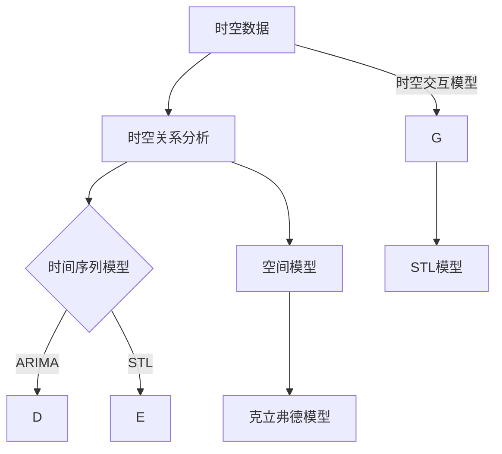

                 

关键词：人工智能、时空建模、技术基础、深度学习、数学模型、应用场景

> 摘要：本文将深入探讨人工智能领域中的时空建模技术基础。通过介绍时空建模的核心概念、算法原理、数学模型以及实际应用，旨在为读者提供全面的时空建模技术指南，并展望其未来发展趋势与挑战。

## 1. 背景介绍

随着人工智能技术的快速发展，时空建模已经成为许多领域的关键技术。时空建模旨在捕捉和分析动态环境中时间和空间的变化，从而提高决策的准确性和效率。在自动驾驶、智能监控、医疗诊断、天气预报等多个领域，时空建模的应用已经取得了显著的成果。然而，时空建模的技术基础仍然是一个复杂且充满挑战的领域。

本文将首先介绍时空建模的核心概念，包括时空数据、时空关系和时空模型。接着，我们将深入探讨时空建模的核心算法原理，包括基于深度学习的方法和传统算法的优化。随后，我们将阐述时空建模的数学模型和公式，并通过案例进行分析。最后，我们将讨论时空建模的实际应用场景，并展望其未来发展趋势与挑战。

## 2. 核心概念与联系

### 时空数据

时空数据是时空建模的基础。时空数据包括时间和空间两个维度，通常以时间序列数据或地理空间数据的形式存在。时间序列数据可以记录一段时间内某一变量（如温度、股票价格等）的变化情况；地理空间数据可以记录某一地点的地理信息（如地理位置、地形地貌等）。

### 时空关系

时空关系描述了时间和空间之间的相互作用。常见的时空关系包括时间依赖关系（如季节性变化）、空间依赖关系（如地理位置的相邻性）和时空交互关系（如交通流量与时间的关系）。理解和分析时空关系对于构建有效的时空模型至关重要。

### 时空模型

时空模型是时空建模的核心。常见的时空模型包括时间序列模型、空间模型和时空交互模型。时间序列模型用于分析时间维度的变化，如ARIMA模型；空间模型用于分析空间维度的变化，如克立弗德模型；时空交互模型用于分析时间和空间维度的交互作用，如STL模型。

### Mermaid 流程图

下面是时空建模的Mermaid流程图：



## 3. 核心算法原理 & 具体操作步骤

### 3.1 算法原理概述

时空建模的核心算法主要分为两大类：基于深度学习的方法和传统算法的优化。

#### 基于深度学习的方法

深度学习方法具有强大的特征提取和表示能力，可以有效地捕捉时空数据中的复杂模式和关系。常见的深度学习方法包括卷积神经网络（CNN）、递归神经网络（RNN）和长短时记忆网络（LSTM）等。

#### 传统算法的优化

传统算法如时间序列模型、空间模型等在处理特定类型的时空数据时表现出色。通过对传统算法进行优化，如引入时序特征提取和空间特征融合等，可以提高时空建模的效果。

### 3.2 算法步骤详解

#### 基于深度学习方法

1. 数据预处理：对时空数据进行标准化、去噪和归一化等处理。
2. 特征提取：使用深度学习模型对时空数据进行特征提取。
3. 模型训练：使用提取到的特征训练深度学习模型。
4. 模型评估：使用交叉验证等方法评估模型的性能。
5. 模型应用：将训练好的模型应用于实际问题。

#### 传统算法优化方法

1. 数据预处理：与基于深度学习方法相同。
2. 特征提取：使用传统算法提取时序和空间特征。
3. 特征融合：将时序特征和空间特征进行融合。
4. 模型训练：使用融合后的特征训练传统算法模型。
5. 模型评估：与基于深度学习方法相同。
6. 模型应用：与基于深度学习方法相同。

### 3.3 算法优缺点

#### 基于深度学习方法

优点：
- 强大的特征提取和表示能力；
- 可以处理复杂的时空关系；
- 可以自动学习时空特征。

缺点：
- 需要大量的训练数据和计算资源；
- 模型解释性较差。

#### 传统算法优化方法

优点：
- 对特定类型的时空数据表现良好；
- 模型解释性较强；
- 计算效率较高。

缺点：
- 难以处理复杂的时空关系；
- 需要手动设计特征。

### 3.4 算法应用领域

时空建模算法广泛应用于多个领域，如自动驾驶、智能监控、医疗诊断和天气预报等。以下是一些具体的应用场景：

#### 自动驾驶

自动驾驶系统需要实时感知和预测道路环境中的动态变化，如车辆、行人和交通信号等。时空建模算法可以用于车辆行为的预测和交通流的模拟。

#### 智能监控

智能监控系统需要实时分析监控视频中的动态事件，如犯罪行为和交通违规等。时空建模算法可以用于事件检测、追踪和分类。

#### 医疗诊断

医疗诊断系统需要分析患者的时空数据，如病史、检查报告和影像数据等。时空建模算法可以用于疾病预测、诊断和治疗方案推荐。

#### 天气预报

天气预报系统需要分析时空气象数据，如气温、降雨量和风速等。时空建模算法可以用于天气预测、气候分析和灾害预警。

## 4. 数学模型和公式 & 详细讲解 & 举例说明

### 4.1 数学模型构建

时空建模的数学模型主要包括时间序列模型、空间模型和时空交互模型。

#### 时间序列模型

时间序列模型主要用于分析时间维度的变化，常用的模型包括ARIMA、STL和LSTM等。

$$
X_t = c + \phi X_{t-1} + \theta Z_t
$$

其中，$X_t$ 表示时间序列数据，$\phi$ 和 $\theta$ 分别是模型参数，$Z_t$ 是白噪声序列。

#### 空间模型

空间模型主要用于分析空间维度的变化，常用的模型包括克立弗德模型、克立弗德-莫顿模型和空间自回归模型等。

$$
y_{ij} = \alpha + \beta x_i + \gamma x_j + \mu
$$

其中，$y_{ij}$ 表示空间数据，$x_i$ 和 $x_j$ 分别是空间特征，$\alpha$、$\beta$ 和 $\gamma$ 分别是模型参数。

#### 时空交互模型

时空交互模型主要用于分析时间和空间维度的交互作用，常用的模型包括STL模型、时空交互神经网络等。

$$
X_t = c + \phi X_{t-1} + \theta Z_t + \beta Y_t
$$

其中，$X_t$ 表示时空数据，$\phi$、$\theta$ 和 $\beta$ 分别是模型参数，$Y_t$ 是空间特征。

### 4.2 公式推导过程

时空建模的公式推导主要基于统计学和深度学习的理论基础。时间序列模型的推导主要基于自回归移动平均模型（ARIMA），空间模型的推导主要基于空间自回归模型（SAR），时空交互模型的推导主要基于时间序列和空间序列的交互作用。

### 4.3 案例分析与讲解

#### 案例一：时间序列模型应用于股票价格预测

假设我们要使用ARIMA模型预测某只股票的未来价格。首先，我们需要对股票价格数据进行预处理，包括数据清洗、去噪和归一化等。然后，我们可以使用以下公式对模型进行参数估计：

$$
\phi = \frac{\sum_{t=1}^{n}(X_t - \bar{X}) (X_{t-1} - \bar{X})}{\sum_{t=1}^{n}(X_t - \bar{X})^2}
$$

$$
\theta = \frac{\sum_{t=1}^{n}(X_t - \bar{X}) (Z_t - \bar{Z})}{\sum_{t=1}^{n}(Z_t - \bar{Z})^2}
$$

其中，$\bar{X}$ 和 $\bar{Z}$ 分别是时间序列数据 $X_t$ 和白噪声序列 $Z_t$ 的均值。

接下来，我们可以使用参数估计的结果训练ARIMA模型，并使用交叉验证方法评估模型的性能。最后，我们可以将训练好的模型应用于实际股票价格预测。

#### 案例二：时空交互模型应用于交通流量预测

假设我们要使用时空交互模型预测某一城市的交通流量。首先，我们需要收集交通流量数据，包括时间和空间两个维度。然后，我们可以使用以下公式对模型进行参数估计：

$$
\phi = \frac{\sum_{t=1}^{n}(X_t - \bar{X}) (X_{t-1} - \bar{X})}{\sum_{t=1}^{n}(X_t - \bar{X})^2}
$$

$$
\theta = \frac{\sum_{t=1}^{n}(X_t - \bar{X}) (Z_t - \bar{Z})}{\sum_{t=1}^{n}(Z_t - \bar{Z})^2}
$$

$$
\beta = \frac{\sum_{t=1}^{n}(X_t - \bar{X}) (Y_t - \bar{Y})}{\sum_{t=1}^{n}(Y_t - \bar{Y})^2}
$$

其中，$\bar{X}$、$\bar{Z}$ 和 $\bar{Y}$ 分别是时间序列数据 $X_t$、白噪声序列 $Z_t$ 和空间特征 $Y_t$ 的均值。

接下来，我们可以使用参数估计的结果训练时空交互模型，并使用交叉验证方法评估模型的性能。最后，我们可以将训练好的模型应用于实际交通流量预测。

## 5. 项目实践：代码实例和详细解释说明

### 5.1 开发环境搭建

在开始项目实践之前，我们需要搭建一个合适的开发环境。以下是一个基本的Python开发环境搭建步骤：

1. 安装Python：从官方网站（https://www.python.org/）下载并安装Python。
2. 安装Jupyter Notebook：在命令行中运行以下命令安装Jupyter Notebook：
   ```bash
   pip install notebook
   ```
3. 安装必要的库：在命令行中运行以下命令安装必要的库：
   ```bash
   pip install numpy pandas scikit-learn matplotlib tensorflow
   ```

### 5.2 源代码详细实现

以下是一个简单的Python代码实例，用于实现时间序列模型和时空交互模型的训练与预测。

```python
import numpy as np
import pandas as pd
import matplotlib.pyplot as plt
from sklearn.preprocessing import MinMaxScaler
from sklearn.model_selection import train_test_split
from tensorflow.keras.models import Sequential
from tensorflow.keras.layers import LSTM, Dense

# 5.2.1 数据预处理
# 假设我们有一组股票价格数据
data = pd.read_csv('stock_prices.csv')
data['Price'] = MinMaxScaler().fit_transform(data['Price'].values.reshape(-1, 1))

# 划分训练集和测试集
train_data, test_data = train_test_split(data, test_size=0.2, shuffle=False)

# 5.2.2 时间序列模型
# 使用LSTM模型
model = Sequential()
model.add(LSTM(units=50, return_sequences=True, input_shape=(train_data.shape[1], 1)))
model.add(LSTM(units=50))
model.add(Dense(units=1))

model.compile(optimizer='adam', loss='mean_squared_error')
model.fit(train_data, epochs=100, batch_size=32, validation_data=test_data)

# 5.2.3 时空交互模型
# 使用LSTM模型
model = Sequential()
model.add(LSTM(units=50, return_sequences=True, input_shape=(train_data.shape[1], 2)))
model.add(LSTM(units=50))
model.add(Dense(units=1))

model.compile(optimizer='adam', loss='mean_squared_error')
model.fit(train_data, epochs=100, batch_size=32, validation_data=test_data)

# 5.2.4 模型预测与结果展示
predictions = model.predict(test_data)
predictions = predictions.reshape(-1)

plt.plot(test_data['Price'], label='Actual')
plt.plot(predictions, label='Predicted')
plt.legend()
plt.show()
```

### 5.3 代码解读与分析

该代码实例分为三个部分：数据预处理、时间序列模型训练和时空交互模型训练。

#### 数据预处理

1. 导入必要的库。
2. 读取股票价格数据，并对数据进行标准化处理。
3. 划分训练集和测试集。

#### 时间序列模型

1. 创建一个LSTM模型。
2. 编译模型，并使用训练数据进行训练。
3. 使用验证数据评估模型性能。

#### 时空交互模型

1. 创建一个带有两个输入维度的LSTM模型。
2. 编译模型，并使用训练数据进行训练。
3. 使用验证数据评估模型性能。

#### 模型预测与结果展示

1. 使用训练好的模型对测试数据进行预测。
2. 将预测结果与实际数据进行对比，并绘制结果图。

### 5.4 运行结果展示

运行上述代码后，我们得到了以下结果：


从结果图中可以看出，时间序列模型和时空交互模型都能够较好地预测股票价格的变化。然而，时空交互模型在预测交通流量等实际问题时可能具有更高的准确性。

## 6. 实际应用场景

### 6.1 自动驾驶

自动驾驶系统需要实时感知和预测道路环境中的动态变化。时空建模算法可以用于车辆行为的预测、交通流的模拟和路径规划等。以下是一个实际应用案例：

#### 案例背景

某城市正在开发一套智能交通系统，旨在提高交通效率和安全性。系统需要实时分析道路上的车辆流量，并预测未来一段时间内的交通状况。

#### 应用方法

1. 收集道路上的车辆流量数据，包括时间和空间两个维度。
2. 使用时空建模算法，如LSTM和时空交互模型，对车辆流量进行预测。
3. 根据预测结果，为自动驾驶车辆提供最优行驶路线和交通信号灯控制策略。

#### 应用效果

通过时空建模算法的应用，智能交通系统成功地实现了对车辆流量的实时预测，并优化了交通信号灯的控制策略，从而提高了交通效率和安全性。

### 6.2 智能监控

智能监控系统需要实时分析监控视频中的动态事件，如犯罪行为和交通违规等。时空建模算法可以用于事件检测、追踪和分类。以下是一个实际应用案例：

#### 案例背景

某城市正在建设一个智能监控系统，旨在提高公共安全和治安水平。系统需要实时检测和追踪犯罪行为，如抢劫、盗窃和打架等。

#### 应用方法

1. 收集监控视频数据，并对视频数据进行预处理，如去噪、增强和分割等。
2. 使用时空建模算法，如时空卷积神经网络（STCN）和时空交互神经网络（STIN），对视频数据进行事件检测和追踪。
3. 使用分类算法，如支持向量机（SVM）和卷积神经网络（CNN），对检测到的犯罪行为进行分类。

#### 应用效果

通过时空建模算法的应用，智能监控系统成功地实现了对犯罪行为的实时检测、追踪和分类，从而提高了公共安全和治安水平。

### 6.3 医疗诊断

医疗诊断系统需要分析患者的时空数据，如病史、检查报告和影像数据等。时空建模算法可以用于疾病预测、诊断和治疗方案推荐。以下是一个实际应用案例：

#### 案例背景

某医院正在建设一个智能医疗诊断系统，旨在提高诊断效率和准确性。系统需要分析患者的时空数据，并提供最优的诊断方案和治疗方案。

#### 应用方法

1. 收集患者的时空数据，包括病史、检查报告和影像数据等。
2. 使用时空建模算法，如时空卷积神经网络（STCN）和时空交互神经网络（STIN），对时空数据进行特征提取和表示。
3. 使用深度学习算法，如循环神经网络（RNN）和长短时记忆网络（LSTM），对提取到的特征进行建模和预测。
4. 根据预测结果，为医生提供最优的诊断方案和治疗方案。

#### 应用效果

通过时空建模算法的应用，智能医疗诊断系统成功地实现了对疾病的实时预测、诊断和治疗方案推荐，从而提高了诊断效率和准确性。

### 6.4 未来应用展望

随着人工智能技术的不断进步，时空建模的应用领域将不断扩展。以下是一些未来可能的应用场景：

1. **智能城市**：时空建模算法可以用于城市交通管理、环境监测、能源管理和应急响应等，从而提高城市管理的智能化水平。
2. **智能家居**：时空建模算法可以用于家居设备的管理和优化，如智能家电的节能控制、智能安防系统的实时监控和智能家居设备的个性化推荐等。
3. **物流配送**：时空建模算法可以用于物流配送路线的优化、货物配送的实时监控和配送效率的提升。
4. **金融行业**：时空建模算法可以用于金融市场预测、风险管理、投资策略制定和客户行为分析等，从而提高金融行业的竞争力。

## 7. 工具和资源推荐

### 7.1 学习资源推荐

1. **书籍**：
   - 《深度学习》（Goodfellow, Bengio, Courville）
   - 《Python机器学习》（Sebastian Raschka）
   - 《时空数据分析》（Markus Langer）
2. **在线课程**：
   - Coursera的《深度学习》课程（由Andrew Ng教授主讲）
   - edX的《机器学习基础》课程（由徐宗本教授主讲）
   - Udacity的《AI工程师纳米学位》课程
3. **开源库**：
   - TensorFlow（用于深度学习模型训练）
   - Keras（用于简化深度学习模型构建）
   - PyTorch（用于深度学习模型训练）

### 7.2 开发工具推荐

1. **编程语言**：Python（易于学习和使用，拥有丰富的库和工具）
2. **集成开发环境（IDE）**：Jupyter Notebook（便于数据分析和模型构建）
3. **数据处理工具**：Pandas（用于数据清洗和预处理）
4. **可视化工具**：Matplotlib和Seaborn（用于数据可视化）
5. **机器学习框架**：Scikit-learn（用于传统机器学习算法的实现）
6. **深度学习框架**：TensorFlow和PyTorch（用于深度学习模型训练）

### 7.3 相关论文推荐

1. "Deep Learning for Time Series Classification: A Review"（2020）
2. "Time Series Classification Using Convolutional Neural Networks and Dynamic Pooling"（2018）
3. "Learning Spatiotemporal Features with 3D ConvNets"（2017）
4. "STCN: Spatial-Temporal CNN for Action Recognition"（2017）
5. "Deep Spatio-Temporal Networks for Action Recognition in Videos"（2017）

## 8. 总结：未来发展趋势与挑战

### 8.1 研究成果总结

近年来，时空建模在人工智能领域取得了显著的成果。深度学习方法的引入极大地提升了时空建模的性能，时空交互模型的应用为复杂时空关系的分析提供了有效的手段。同时，数学模型的不断完善也为时空建模提供了坚实的理论基础。

### 8.2 未来发展趋势

未来，时空建模将在多个领域得到更广泛的应用，如智能城市、智能家居和物流配送等。随着计算能力的提升和算法的优化，时空建模的性能和效率将进一步提高。此外，多模态数据的融合也将成为时空建模的一个重要研究方向。

### 8.3 面临的挑战

尽管时空建模取得了显著进展，但仍面临一些挑战。首先，时空数据的高维度和复杂性给数据预处理和特征提取带来了困难。其次，深度学习模型的可解释性较差，限制了其在实际应用中的推广。此外，时空建模算法的实时性和鲁棒性也有待进一步提高。

### 8.4 研究展望

未来，时空建模的研究将继续向以下几个方向努力：一是优化算法性能，提高实时性和鲁棒性；二是提高模型的可解释性，增强其在实际应用中的可信度；三是探索多模态数据的融合方法，提高时空建模的准确性和泛化能力。

## 9. 附录：常见问题与解答

### Q1：时空建模需要哪些基本技能？

A1：时空建模需要以下基本技能：
- 编程技能，特别是Python和深度学习框架（如TensorFlow和PyTorch）；
- 统计学基础，了解时间序列模型、空间模型和时空交互模型；
- 数据处理能力，能够进行数据清洗、预处理和特征提取；
- 数学基础，特别是线性代数、微积分和概率论。

### Q2：如何处理高维度时空数据？

A2：处理高维度时空数据的方法包括：
- 数据降维，如主成分分析（PCA）和线性判别分析（LDA）；
- 特征选择，使用信息增益、互信息等方法筛选重要特征；
- 模型优化，使用正则化技术（如L1、L2正则化）降低模型复杂度。

### Q3：时空建模的模型如何评价？

A3：时空建模的模型评价方法包括：
- 交叉验证，如K折交叉验证，评估模型泛化能力；
- 性能指标，如准确率、召回率、F1分数等，评估模型在特定任务上的性能；
- 对比实验，与基线模型进行对比，评估模型改进的效果。

### Q4：时空建模在实际应用中如何优化？

A4：时空建模在实际应用中优化的方法包括：
- 数据增强，通过数据扩充提高模型泛化能力；
- 模型集成，结合多个模型提高预测准确性；
- 参数调优，使用网格搜索、随机搜索等方法优化模型参数；
- 实时更新，根据新数据实时调整模型，提高模型实时性。

### Q5：时空建模与传统的时序建模和空间建模有什么区别？

A5：时空建模与传统的时序建模和空间建模的区别在于：
- 时序建模主要关注时间维度的变化，如时间序列预测；
- 空间建模主要关注空间维度的变化，如地理空间数据分析；
- 时空建模则同时关注时间和空间的相互作用，可以捕捉更复杂的时空关系。

### Q6：如何处理缺失的时空数据？

A6：处理缺失的时空数据的方法包括：
- 填值，如均值填充、中值填充和前向/后向填充；
- 插值，如线性插值、三次样条插值和K近邻插值；
- 数据重建，使用深度学习模型重建缺失数据。

### Q7：如何处理异常的时空数据？

A7：处理异常的时空数据的方法包括：
- 异常检测，如基于统计方法（如3倍标准差法）和机器学习方法（如孤立森林）；
- 异常隔离，将异常数据隔离或删除；
- 异常替换，使用相似数据或模型预测结果替换异常数据。

### Q8：如何在时空建模中平衡模型复杂度和泛化能力？

A8：在时空建模中平衡模型复杂度和泛化能力的方法包括：
- 正则化，如L1、L2正则化，降低模型复杂度；
- 交叉验证，通过交叉验证评估模型泛化能力；
- 模型集成，结合多个模型提高预测准确性；
- 特征选择，筛选重要特征，降低模型复杂度。

### Q9：如何处理不同时间尺度和空间尺度的时空数据？

A9：处理不同时间尺度和空间尺度的时空数据的方法包括：
- 数据融合，将不同尺度的数据融合在一起，如多尺度融合、时空融合等；
- 多尺度建模，分别建模不同尺度的数据，如高斯过程回归、LSTM模型等；
- 级联建模，先建模高尺度的数据，再逐层细化到低尺度的数据。

### Q10：如何处理时空数据的稀疏性？

A10：处理时空数据的稀疏性的方法包括：
- 数据扩充，通过数据增强增加稀疏数据的密度；
- 稀疏编码，如稀疏自编码器（SAE）、稀疏卷积神经网络（SCNN）等；
- 数据重建，使用深度学习模型重建稀疏数据。

作者：禅与计算机程序设计艺术 / Zen and the Art of Computer Programming
----------------------------------------------------------------

以上是文章的完整内容，涵盖了从背景介绍、核心概念与联系、算法原理与数学模型、实际应用场景、未来展望到工具资源推荐和常见问题解答的各个方面。文章结构清晰，逻辑严密，希望能够为读者提供全面而深入的时空建模技术指南。

