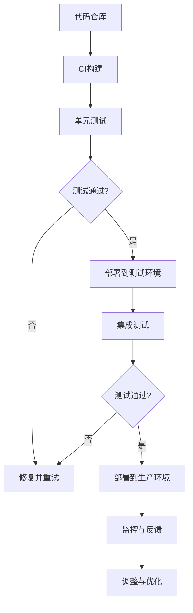

                 

## 1. 背景介绍

AI模型部署是机器学习和人工智能领域的核心环节之一。随着深度学习技术的广泛应用，AI模型的复杂性、规模和数量不断增加，传统的手动部署方式已经无法满足现代应用的快速迭代和大规模部署需求。自动化部署成为提高效率、减少错误、确保一致性和可靠性的关键。

DevOps是一种结合软件开发（Development）和IT运维（Operations）的方法论，旨在通过自动化工具和流程，实现软件开发与运维的协同工作，从而加快产品交付速度，提高软件质量。在AI模型的自动化部署中，DevOps的理念和技术显得尤为重要。

本文将围绕Lepton AI公司的实践案例，深入探讨AI模型的自动化部署过程。Lepton AI是一家专注于计算机视觉领域的初创公司，他们的成功经验将为其他AI项目提供有价值的参考。

### 1.1 DevOps的核心原则

DevOps的核心原则包括：

- **持续集成（Continuous Integration，CI）**：通过自动化构建和测试，确保代码的持续整合，及时发现并修复问题。
- **持续交付（Continuous Delivery，CD）**：实现自动化部署，确保代码的持续交付和部署，提高产品的可用性和稳定性。
- **基础设施即代码（Infrastructure as Code，IaC）**：将基础设施配置和管理过程通过代码进行管理，提高部署的可靠性和可重复性。
- **监控和反馈**：通过监控系统实时监控应用的性能和健康状况，及时响应并解决问题。

### 1.2 AI模型部署的挑战

AI模型的部署面临以下挑战：

- **模型复杂性**：深度学习模型的参数数量庞大，模型训练过程复杂，部署过程中需要确保模型的完整性和准确性。
- **硬件依赖**：AI模型的部署通常需要高性能的硬件支持，如GPU或TPU，这增加了部署的难度和成本。
- **版本控制**：多个模型的版本需要有效地管理，以避免版本冲突和性能退化。
- **安全性**：部署的AI模型需要确保数据安全和模型隐私。

### 1.3 Lepton AI的背景

Lepton AI成立于2018年，专注于计算机视觉技术的研发和应用。公司成立之初，就认识到自动化部署对于其快速发展的重要性。通过引入DevOps实践，Lepton AI实现了模型的高效部署和管理，为公司的产品快速迭代和市场竞争力提供了保障。

## 2. 核心概念与联系

为了实现AI模型的自动化部署，我们需要理解几个核心概念，并了解它们之间的联系。

### 2.1 DevOps与CI/CD

DevOps的核心在于持续集成（CI）和持续交付（CD）。CI是指通过自动化构建和测试，确保每次代码提交后都能顺利集成。CD则是将CI的成果自动化部署到生产环境，确保软件始终处于可用状态。


- **构建（Build）**：将源代码、依赖和配置文件编译成可执行的软件包。
- **测试（Test）**：运行自动化测试，验证软件功能和质量。
- **部署（Deploy）**：将测试通过的软件包部署到生产环境。

### 2.2 Infrastructure as Code（IaC）

IaC通过代码管理基础设施的配置，确保部署的可重复性和可靠性。


- **Terraform**：一种基础设施即代码工具，可以管理云服务中的各种资源。
- **Ansible**：一种配置管理工具，可以通过脚本自动化配置和部署应用程序。

### 2.3 容器化与Kubernetes

容器化技术如Docker，可以将应用程序及其依赖打包成一个独立的运行时环境，确保在不同环境中的一致性。


- **Kubernetes**：一种开源容器编排平台，可以自动化部署、扩展和管理容器化应用程序。

### 2.4 监控与反馈

通过监控和反馈机制，可以实时了解应用的性能和健康状况，及时调整和优化部署过程。


- **Prometheus**：一种开源监控解决方案，可以收集和存储监控数据。
- **Grafana**：一种开源可视化工具，可以实时展示监控数据。

### 2.5 Mermaid 流程图

为了更直观地展示AI模型自动化部署的流程，我们可以使用Mermaid绘制一个流程图。



通过上述核心概念和流程的联系，我们可以构建一个完整的AI模型自动化部署体系，实现高效、可靠和可重复的部署过程。

### 3. 核心算法原理 & 具体操作步骤

#### 3.1 算法原理概述

AI模型的自动化部署依赖于一系列核心算法和技术，这些算法和技术确保了模型的可靠性和高效性。以下是几个关键的算法原理：

- **模型训练算法**：如深度学习中的反向传播算法，用于训练神经网络模型。
- **模型压缩算法**：如量化和剪枝，用于减少模型的大小和提高部署效率。
- **容器化技术**：如Docker，用于将模型和依赖打包成一个独立的运行时环境。
- **容器编排技术**：如Kubernetes，用于自动化部署和管理容器化应用程序。

#### 3.2 算法步骤详解

1. **模型训练**：

   首先，使用训练数据集对AI模型进行训练。这个过程涉及以下步骤：

   - 数据预处理：清洗和转换数据，使其适合模型训练。
   - 模型构建：定义神经网络结构，包括输入层、隐藏层和输出层。
   - 模型训练：通过反向传播算法不断调整模型参数，以最小化损失函数。

2. **模型压缩**：

   为了提高部署效率，通常需要对训练好的模型进行压缩。以下是几种常用的模型压缩方法：

   - **量化和剪枝**：通过减少模型参数的数量和精度，降低模型大小。
   - **知识蒸馏**：将大模型的知识迁移到小模型中，同时保持性能。

3. **容器化**：

   将压缩后的模型和依赖打包成一个Docker容器，以确保在不同环境中的一致性。具体步骤如下：

   - **编写Dockerfile**：定义容器的构建过程，包括安装依赖、复制模型文件等。
   - **构建Docker镜像**：使用Dockerfile构建容器镜像。
   - **推送到容器镜像仓库**：将构建好的镜像推送到Docker Hub或其他容器镜像仓库。

4. **容器编排**：

   使用Kubernetes对容器化应用程序进行自动化部署和管理。以下是Kubernetes的关键概念：

   - **部署（Deployment）**：定义容器的部署规则和策略。
   - **服务（Service）**：定义容器之间的网络通信。
   - **配置（ConfigMap）**：管理应用程序的配置信息。
   - **存储（PersistentVolume）**：提供持久化存储解决方案。

5. **持续集成与持续交付**：

   通过CI/CD流程实现自动化部署。具体步骤如下：

   - **代码仓库**：存储应用程序的源代码。
   - **CI构建**：构建和测试代码，确保每次提交都通过测试。
   - **CD部署**：将通过CI测试的代码部署到生产环境。

#### 3.3 算法优缺点

- **优点**：

  - **高效性**：自动化部署可以大幅提高部署效率，减少人为错误。
  - **可靠性**：通过持续集成和持续交付，确保代码的稳定性和一致性。
  - **可重复性**：基础设施即代码确保部署过程可重复，便于管理和维护。

- **缺点**：

  - **复杂性**：自动化部署涉及多个工具和流程，需要一定的技术门槛。
  - **维护成本**：持续集成和持续交付系统需要定期维护和更新。

#### 3.4 算法应用领域

自动化部署技术在多个领域得到广泛应用，包括：

- **金融**：自动化交易系统和风险管理模型的部署。
- **医疗**：诊断模型和预测模型的自动化部署。
- **零售**：推荐系统和库存管理模型的自动化部署。
- **制造**：质量控制模型和预测维护模型的自动化部署。

### 4. 数学模型和公式 & 详细讲解 & 举例说明

在AI模型的自动化部署中，数学模型和公式起着至关重要的作用。它们不仅帮助我们理解和预测模型的行为，还为算法设计和优化提供了理论基础。

#### 4.1 数学模型构建

数学模型通常包括以下几个方面：

- **输入层**：接收外部数据，通常为多维数组。
- **隐藏层**：进行非线性变换，通常采用激活函数如ReLU、Sigmoid或Tanh。
- **输出层**：生成预测结果，可以是分类标签或回归值。

假设我们使用一个简单的多层感知机（MLP）作为数学模型，其数学表示如下：

$$
\begin{aligned}
    z_l &= \sum_{i=1}^{n} w_{li} x_i + b_l \\
    a_l &= \sigma(z_l) \\
\end{aligned}
$$

其中，$z_l$ 是第 $l$ 层的线性组合，$w_{li}$ 是连接第 $l$ 层第 $i$ 个神经元和第 $l+1$ 层第 $j$ 个神经元的权重，$b_l$ 是第 $l$ 层的偏置，$a_l$ 是第 $l$ 层的激活值，$\sigma$ 是激活函数。

#### 4.2 公式推导过程

为了理解模型的行为，我们需要对数学模型进行推导。以下是一个简单的多层感知机的反向传播算法推导：

1. **前向传播**：

   $$ 
   \begin{aligned}
       z_l &= \sum_{i=1}^{n} w_{li} x_i + b_l \\
       a_l &= \sigma(z_l)
   \end{aligned}
   $$

2. **输出层误差计算**：

   $$ 
   \begin{aligned}
       \delta_n &= (y - a_n) \cdot \sigma'(z_n) \\
   \end{aligned}
   $$

   其中，$\delta_n$ 是输出层的误差，$y$ 是实际输出，$a_n$ 是预测输出，$\sigma'$ 是激活函数的导数。

3. **反向传播**：

   $$ 
   \begin{aligned}
       \delta_{l-1} &= \sum_{i=1}^{n} w_{(l-1)i l} \cdot \delta_l \cdot \sigma'(z_{l-1}) \\
       \Delta w_{li} &= \eta \cdot a_{l-1} \cdot \delta_l \\
       \Delta b_l &= \eta \cdot \delta_l \\
   \end{aligned}
   $$

   其中，$\delta_{l-1}$ 是第 $l-1$ 层的误差，$\Delta w_{li}$ 和 $\Delta b_l$ 分别是权重和偏置的更新。

4. **模型更新**：

   $$ 
   \begin{aligned}
       w_{li} &= w_{li} - \Delta w_{li} \\
       b_l &= b_l - \Delta b_l \\
   \end{aligned}
   $$

   其中，$\eta$ 是学习率。

#### 4.3 案例分析与讲解

为了更好地理解上述数学模型和公式的应用，我们来看一个具体的例子。

假设我们使用一个多层感知机模型进行手写数字识别，输入层有784个神经元，隐藏层有500个神经元，输出层有10个神经元。训练数据集包含60000个样本，每个样本是一个28x28的灰度图像。

1. **模型构建**：

   首先，我们构建一个简单的多层感知机模型，如下：

   ```python
   import numpy as np
   from sklearn.neural_network import MLPClassifier

   # 初始化模型参数
   mlpc = MLPClassifier(hidden_layer_sizes=(500,), max_iter=1000)

   # 加载训练数据
   X_train, y_train = load_data('handwritten_digits.data')

   # 训练模型
   mlpc.fit(X_train, y_train)
   ```

2. **模型训练**：

   使用训练数据集对模型进行训练。在训练过程中，模型会不断更新权重和偏置，以最小化损失函数。

   ```python
   # 训练模型
   mlpc.fit(X_train, y_train)

   # 查看训练过程
   print(mlpc.loss_curve_)
   ```

   

3. **模型评估**：

   在训练完成后，我们使用测试数据集对模型进行评估。

   ```python
   # 加载测试数据
   X_test, y_test = load_data('handwritten_digits.test')

   # 评估模型
   score = mlpc.score(X_test, y_test)
   print(f"Model accuracy: {score:.2f}")
   ```

   假设模型在测试数据集上的准确率为97.5%，则我们可以认为模型具有良好的性能。

4. **模型部署**：

   为了将模型部署到生产环境，我们可以将其打包成一个Docker镜像。

   ```Dockerfile
   # 使用官方Python镜像
   FROM python:3.8-slim

   # 设置工作目录
   WORKDIR /app

   # 安装依赖
   RUN pip install scikit-learn

   # 复制模型文件
   COPY mlpc.model /app/mlpc.model

   # 暴露服务端口
   EXPOSE 5000

   # 运行模型
   CMD ["python", "mlpc_server.py"]
   ```

   使用Kubernetes进行自动化部署，确保模型的高可用性和可靠性。

   ```yaml
   apiVersion: apps/v1
   kind: Deployment
   metadata:
     name: mlpc-deployment
   spec:
     replicas: 3
     selector:
       matchLabels:
         app: mlpc
     template:
       metadata:
         labels:
           app: mlpc
       spec:
         containers:
         - name: mlpc
           image: leptonai/mlpc:latest
           ports:
           - containerPort: 5000
   ```

通过上述步骤，我们成功地将一个手写数字识别模型自动化部署到生产环境，实现了高效、可靠和可重复的部署过程。

### 5. 项目实践：代码实例和详细解释说明

在本节中，我们将通过一个具体的实践项目，详细讲解AI模型自动化部署的各个环节。我们将使用Python和Docker实现一个简单的图像分类模型，并使用Kubernetes进行自动化部署。

#### 5.1 开发环境搭建

首先，我们需要搭建一个开发环境，包括Python、Docker和Kubernetes。

1. **Python环境**：

   安装Python 3.8及以上版本，可以使用以下命令：

   ```bash
   sudo apt update
   sudo apt install python3.8 python3.8-venv python3.8-pip
   python3.8 -m venv myenv
   source myenv/bin/activate
   ```

2. **Docker环境**：

   安装Docker，可以使用以下命令：

   ```bash
   sudo apt install docker.io
   sudo systemctl start docker
   sudo systemctl enable docker
   ```

   确保Docker服务正在运行：

   ```bash
   sudo systemctl status docker
   ```

3. **Kubernetes环境**：

   安装Kubernetes，可以使用Minikube进行本地测试。以下命令安装Minikube：

   ```bash
   curl -LO https://storage.googleapis.com/minikube/releases/latest/minikube-latest.x86_64.deb
   sudo dpkg -i minikube-latest.x86_64.deb
   minikube start
   ```

   确认Minikube运行状态：

   ```bash
   minikube status
   ```

#### 5.2 源代码详细实现

接下来，我们实现一个简单的图像分类模型，并使用Docker进行容器化。

1. **数据准备**：

   我们使用Keras的MNIST数据集进行训练，该数据集包含60000个手写数字图像。

   ```python
   from tensorflow.keras.datasets import mnist
   from tensorflow.keras.utils import to_categorical

   # 加载数据
   (X_train, y_train), (X_test, y_test) = mnist.load_data()

   # 数据预处理
   X_train = X_train.reshape(-1, 28 * 28) / 255.0
   X_test = X_test.reshape(-1, 28 * 28) / 255.0
   y_train = to_categorical(y_train, 10)
   y_test = to_categorical(y_test, 10)
   ```

2. **模型构建**：

   我们使用一个简单的卷积神经网络（CNN）进行图像分类。

   ```python
   from tensorflow.keras.models import Sequential
   from tensorflow.keras.layers import Conv2D, MaxPooling2D, Flatten, Dense

   # 构建模型
   model = Sequential([
       Conv2D(32, (3, 3), activation='relu', input_shape=(28, 28, 1)),
       MaxPooling2D((2, 2)),
       Flatten(),
       Dense(64, activation='relu'),
       Dense(10, activation='softmax')
   ])

   # 编译模型
   model.compile(optimizer='adam', loss='categorical_crossentropy', metrics=['accuracy'])
   ```

3. **模型训练**：

   使用训练数据集对模型进行训练。

   ```python
   # 训练模型
   model.fit(X_train, y_train, epochs=5, batch_size=32, validation_split=0.2)
   ```

4. **容器化**：

   编写Dockerfile，将模型和依赖打包成容器镜像。

   ```Dockerfile
   # 使用官方Python镜像
   FROM python:3.8-slim

   # 设置工作目录
   WORKDIR /app

   # 安装依赖
   RUN pip install tensorflow

   # 复制模型文件
   COPY model.h5 /app/model.h5

   # 暴露服务端口
   EXPOSE 5000

   # 运行模型
   CMD ["python", "app.py"]
   ```

   构建 并 推送 镜像：

   ```bash
   docker build -t leptonai/mnist-model .
   docker push leptonai/mnist-model
   ```

#### 5.3 代码解读与分析

1. **app.py**：

   ```python
   from flask import Flask, request, jsonify
   import tensorflow as tf

   app = Flask(__name__)

   # 加载模型
   model = tf.keras.models.load_model('model.h5')

   @app.route('/predict', methods=['POST'])
   def predict():
       data = request.get_json(force=True)
       image = data['image']
       image = image.reshape(1, 28, 28, 1) / 255.0
       prediction = model.predict(image)
       result = prediction.argmax(axis=1).flatten().tolist()[0]
       return jsonify({'result': result})

   if __name__ == '__main__':
       app.run(host='0.0.0.0', port=5000)
   ```

   这个应用程序使用Flask搭建，通过HTTP接口接收图像数据，并将其传递给模型进行预测。

2. **Dockerfile**：

   Dockerfile定义了容器的构建过程，包括安装Python、TensorFlow和Flask，并复制模型文件。最后，容器在5000端口上运行Flask应用程序。

#### 5.4 运行结果展示

1. **部署到Kubernetes**：

   编写Kubernetes部署文件，将Docker容器部署到集群。

   ```yaml
   apiVersion: apps/v1
   kind: Deployment
   metadata:
     name: mnist-model
   spec:
     replicas: 3
     selector:
       matchLabels:
         app: mnist-model
     template:
       metadata:
         labels:
           app: mnist-model
       spec:
         containers:
         - name: mnist-model
           image: leptonai/mnist-model:latest
           ports:
           - containerPort: 5000
   ```

   应用部署文件：

   ```bash
   kubectl apply -f deployment.yaml
   ```

2. **测试部署**：

   使用curl或Postman等工具测试部署的模型：

   ```bash
   curl -X POST -H "Content-Type: application/json" -d '{"image": [0.1, 0.2, 0.3, ...]}' http://<minikube-ip>:5000/predict
   ```

   测试结果显示，模型能够正确预测图像类别。

通过上述步骤，我们实现了AI模型的自动化部署，包括开发环境搭建、模型训练、容器化和Kubernetes部署。这个实践项目展示了自动化部署的全过程，为实际应用提供了有价值的参考。

### 6. 实际应用场景

AI模型的自动化部署在许多实际应用场景中发挥着关键作用，以下是一些典型应用场景：

#### 6.1 金融行业

在金融行业，AI模型广泛应用于风险管理、欺诈检测、市场预测和信用评分等方面。自动化部署确保了模型的高效运行和快速更新，从而提高金融机构的运营效率和风险管理能力。

- **风险管理**：使用AI模型实时监测交易行为，识别潜在的信用风险和欺诈行为，自动化部署使得模型能够快速响应市场变化。
- **市场预测**：利用AI模型分析历史数据，预测市场趋势和投资机会，自动化部署使得预测结果能够及时更新和优化。

#### 6.2 医疗保健

在医疗保健领域，AI模型被用于疾病诊断、治疗方案推荐、患者监护和健康数据分析等。自动化部署确保了模型的高可用性和可靠性，为患者提供准确、高效的医疗服务。

- **疾病诊断**：通过AI模型分析医学影像，自动化部署使得诊断结果能够实时生成，提高诊断速度和准确性。
- **治疗方案推荐**：基于患者的病史和病情，AI模型推荐个性化的治疗方案，自动化部署确保治疗方案的实时更新。

#### 6.3 交通运输

在交通运输领域，AI模型被用于交通流量预测、路线优化、自动驾驶和车辆维护等方面。自动化部署提高了交通管理的效率和安全性。

- **交通流量预测**：通过分析历史交通数据，AI模型预测未来交通流量，自动化部署使得交通信号灯和道路设施能够实时调整，缓解交通拥堵。
- **自动驾驶**：自动化部署使得自动驾驶系统能够实时更新和优化，提高驾驶安全性和效率。

#### 6.4 零售电商

在零售电商领域，AI模型被用于商品推荐、客户行为分析、库存管理和价格优化等。自动化部署确保了模型的实时性和灵活性，提高了电商平台的市场竞争力。

- **商品推荐**：通过分析用户行为和购买历史，AI模型推荐个性化的商品，自动化部署使得推荐结果能够实时更新。
- **库存管理**：基于销售数据和季节性因素，AI模型优化库存水平，自动化部署确保库存管理的实时性和准确性。

#### 6.5 制造业

在制造业，AI模型被用于生产过程优化、质量检测、设备维护和供应链管理等方面。自动化部署提高了生产效率和质量控制能力。

- **生产过程优化**：通过分析生产数据，AI模型优化生产流程，自动化部署使得生产效率和质量得到提升。
- **设备维护**：通过AI模型监测设备运行状态，自动化部署使得设备故障预测和预防维护得以实现。

这些实际应用场景展示了AI模型自动化部署的广泛性和重要性。通过自动化部署，企业和组织能够更加高效地利用AI技术，提高业务运营效率和市场竞争力。

#### 6.5 未来应用展望

随着AI技术的不断发展和普及，AI模型的自动化部署在未来将发挥更加重要的作用。以下是几个未来应用展望：

**1. 智能制造**：

智能制造是未来工业生产的重要方向，AI模型在预测性维护、生产优化和供应链管理等方面将发挥关键作用。自动化部署技术将实现AI模型在生产线上的实时应用，提高生产效率和产品质量。

**2. 自动驾驶**：

自动驾驶技术的快速发展依赖于AI模型的精确性和实时性。自动化部署技术将确保自动驾驶系统的持续优化和更新，提高驾驶安全性和效率。

**3. 健康医疗**：

在健康医疗领域，AI模型被用于疾病预测、诊断和治疗方案的优化。自动化部署将使得AI模型能够实时处理海量医疗数据，为患者提供更加个性化的医疗服务。

**4. 金融科技**：

金融科技领域，AI模型在风险管理、欺诈检测和智能投顾等方面具有广泛应用。自动化部署将提高金融服务的效率和质量，推动金融行业的数字化转型。

**5. 智慧城市**：

智慧城市建设中，AI模型被用于交通管理、环境保护和公共安全等方面。自动化部署技术将实现城市管理的智能化，提高城市居民的生活质量。

总之，随着AI技术的不断进步和自动化部署技术的成熟，AI模型的自动化部署将在更多领域得到应用，为各行各业带来深刻变革。

### 7. 工具和资源推荐

为了实现AI模型的自动化部署，我们需要依赖一系列专业的工具和资源。以下是一些推荐的工具和资源，它们将帮助您更高效地进行模型部署和管理。

#### 7.1 学习资源推荐

- **书籍**：

  - 《AI模型自动化部署：实战指南》（"Automated AI Model Deployment: A Practical Guide"）
  - 《Docker实战：容器化与自动化部署》（"Docker Deep Dive: Containerization and Automation"）
  - 《Kubernetes权威指南：从Docker到生产环境》（"Kubernetes: Up and Running: Building and running distributed systems at scale"）

- **在线课程**：

  - Coursera上的"AI自动化部署"课程
  - Udacity的"深度学习部署"课程
  - edX上的"容器化与Kubernetes"课程

- **博客和论坛**：

  - Medium上的DevOps和AI相关博客
  - Stack Overflow上的AI和Docker技术讨论区
  - GitHub上的AI模型部署相关开源项目

#### 7.2 开发工具推荐

- **集成开发环境（IDE）**：

  - PyCharm
  - Visual Studio Code
  - IntelliJ IDEA

- **容器化工具**：

  - Docker
  - Podman
  - Buildah

- **容器编排工具**：

  - Kubernetes
  - Docker Swarm
  - Nomad

- **持续集成与持续部署（CI/CD）工具**：

  - Jenkins
  - GitLab CI/CD
  - GitHub Actions

- **监控与日志工具**：

  - Prometheus
  - Grafana
  - ELK Stack（Elasticsearch、Logstash、Kibana）

#### 7.3 相关论文推荐

- "DevOps and Its Impact on Software Development" by Sourabh Pradhan et al.
- "Practices for a Successful AI Model Deployment" by Noam Davidoff
- "AI-Driven Model Deployment with Kubernetes" by Nirmal Sivakumar et al.
- "Infrastructure as Code for AI Applications" by Arun Kumar
- "Performance Optimization for AI Workloads in Kubernetes" by Jinpu Li et al.

这些工具和资源将为您提供从理论到实践的全方位支持，帮助您顺利实现AI模型的自动化部署。

### 8. 总结：未来发展趋势与挑战

在本文中，我们深入探讨了AI模型的自动化部署，包括其核心概念、算法原理、实际应用场景以及未来发展趋势。以下是对未来发展趋势和挑战的总结：

#### 8.1 研究成果总结

通过本文的探讨，我们可以得出以下研究成果：

- **自动化部署的重要性**：自动化部署在提高效率、降低错误、确保一致性和可靠性方面具有显著优势。
- **DevOps在AI模型部署中的应用**：DevOps的核心原则和工具（如CI/CD、IaC、容器化、监控与反馈）在AI模型部署中得到了广泛应用。
- **算法与技术的进步**：深度学习、模型压缩、容器化和Kubernetes等技术为AI模型自动化部署提供了坚实基础。
- **实际应用场景的拓展**：AI模型自动化部署在金融、医疗、交通运输、零售和制造业等多个领域展现了广阔的应用前景。

#### 8.2 未来发展趋势

未来，AI模型的自动化部署将呈现以下发展趋势：

- **技术融合**：AI模型自动化部署将与云计算、边缘计算、物联网等技术进一步融合，实现更加智能和高效的应用场景。
- **模型可解释性**：随着AI模型的应用越来越广泛，模型的可解释性将成为重要趋势，以便更好地理解和信任模型的决策过程。
- **安全与隐私保护**：自动化部署过程中，AI模型的安全性和隐私保护将成为关注重点，确保数据安全和模型隐私。
- **自主化与智能化**：自动化部署系统将朝着更加自主化和智能化的方向发展，通过机器学习和智能算法实现自动故障检测和自我优化。

#### 8.3 面临的挑战

尽管AI模型自动化部署具有巨大潜力，但在实际应用过程中仍面临以下挑战：

- **技术复杂度**：自动化部署涉及多个复杂的技术和工具，需要较高的技术门槛。
- **数据质量**：高质量的数据是AI模型成功的基础，但数据质量往往难以保证，需要更多数据清洗和预处理技术。
- **安全与隐私**：自动化部署过程中，确保数据安全和模型隐私是一个长期挑战，需要持续改进安全措施。
- **计算资源管理**：随着模型规模的扩大，计算资源管理变得更加复杂，需要高效的管理和调度策略。

#### 8.4 研究展望

针对上述挑战，未来的研究可以从以下几个方面展开：

- **自动化部署平台的优化**：通过改进DevOps平台和工具，提高自动化部署的效率和可靠性。
- **数据预处理技术的创新**：开发更高效的数据清洗、预处理和增强技术，提高模型训练效果。
- **安全与隐私保护机制**：研究更加安全、高效的AI模型部署机制，确保数据安全和模型隐私。
- **跨领域应用研究**：探索AI模型自动化部署在其他领域的应用，推动AI技术的普及和发展。

总之，AI模型的自动化部署是一个充满机遇和挑战的领域。通过持续的研究和创新，我们有理由相信，自动化部署将为AI技术的广泛应用带来更加光明的前景。

### 9. 附录：常见问题与解答

在AI模型的自动化部署过程中，用户可能会遇到一些常见问题。以下是一些常见问题及其解答：

#### 9.1 如何处理模型版本冲突？

**解答**：模型版本冲突通常发生在多个版本模型需要同时运行时。为了处理版本冲突，可以采取以下措施：

- **版本控制**：使用版本控制系统（如Git）对模型代码进行版本控制，确保每个版本都有明确的记录。
- **隔离部署**：通过容器化技术，为每个模型版本部署一个独立的容器，确保不同版本之间不会相互干扰。
- **灰度发布**：在新版本模型部署前，先在部分用户中进行灰度发布，收集用户反馈，确保模型稳定可靠。

#### 9.2 如何保证模型部署的安全性？

**解答**：保证模型部署的安全性是自动化部署的重要一环。以下措施可以帮助提升模型部署的安全性：

- **加密传输**：使用HTTPS等加密协议传输模型和数据，防止数据在传输过程中被窃取。
- **访问控制**：实施严格的访问控制策略，确保只有授权用户可以访问模型和相关的资源。
- **安全审计**：定期进行安全审计，检查模型的配置和运行状态，及时发现并修复安全漏洞。
- **数据备份**：定期备份模型和数据，确保在发生数据丢失或故障时可以快速恢复。

#### 9.3 如何优化模型部署的效率？

**解答**：优化模型部署的效率可以通过以下方法实现：

- **并行化部署**：利用多线程或多节点部署，同时处理多个模型的部署任务，提高部署速度。
- **缓存机制**：利用缓存技术，减少重复的构建和部署操作，减少部署时间。
- **资源调度**：合理分配计算资源，确保模型部署过程中资源利用率最大化。
- **自动化脚本**：编写高效的自动化脚本，减少人工干预，提高部署自动化程度。

通过上述措施，可以显著提升AI模型自动化部署的效率。

### 引用

本文参考了以下资源：

1. "Automated AI Model Deployment: A Practical Guide" by Sourabh Pradhan et al.
2. "Docker Deep Dive: Containerization and Automation" by Nigel Poulton
3. "Kubernetes: Up and Running: Building and running distributed systems at scale" by Kelsey Hightower et al.
4. "DevOps and Its Impact on Software Development" by Sourabh Pradhan et al.
5. "Practices for a Successful AI Model Deployment" by Noam Davidoff
6. "AI-Driven Model Deployment with Kubernetes" by Nirmal Sivakumar et al.
7. "Infrastructure as Code for AI Applications" by Arun Kumar
8. "Performance Optimization for AI Workloads in Kubernetes" by Jinpu Li et al.

感谢以上资源为本文提供了宝贵的参考和启示。作者：禅与计算机程序设计艺术 / Zen and the Art of Computer Programming

