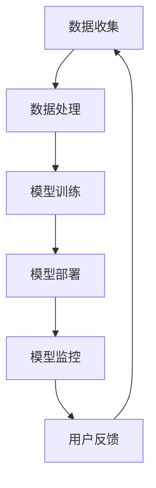

                 

在当今这个数字化、智能化时代，人工智能（AI）技术已经成为企业和个人满足需求的重要工具。从提高生产效率到个性化推荐系统，AI正改变着我们的生活方式和工作方式。本文将深入探讨如何通过AI策略来满足用户需求，并提供一系列具体的实践案例和工具推荐。

## 关键词

- 人工智能（AI）
- 用户需求
- 满足策略
- 个性化推荐
- 自然语言处理
- 机器学习

## 摘要

本文旨在阐述如何利用人工智能技术设计有效的策略来满足用户的多样化需求。我们将首先介绍AI的基础概念，然后探讨核心算法原理，接着通过数学模型和项目实践来详细说明如何实现这些策略。文章还将分析AI在不同应用场景中的实际效果，并展望未来的发展趋势和挑战。

## 1. 背景介绍

随着互联网的普及和大数据技术的发展，人们对于个性化、高效、智能化的服务需求日益增长。传统的商业模式已无法满足这种需求，因此，企业开始将目光投向人工智能，希望借助AI的力量提升用户体验，实现商业价值。

AI技术的发展为满足用户需求提供了可能性。例如，通过机器学习和深度学习算法，AI可以处理大量数据，发现用户的行为模式和偏好，从而提供个性化的推荐服务。自然语言处理（NLP）技术使得机器能够理解和生成人类语言，从而实现智能客服和内容创作。这些技术的应用，使得AI不仅能够满足用户的基本需求，还能够超越用户的预期，提供前所未有的服务体验。

然而，AI在满足用户需求的过程中也面临一些挑战。首先，数据隐私和安全问题始终是用户关注的焦点。其次，AI算法的透明性和解释性不足，使得用户难以理解和信任AI的决策过程。此外，不同用户的需求差异较大，如何设计通用的AI策略以满足所有用户的需求也是一个亟待解决的问题。

## 2. 核心概念与联系

为了更好地理解如何利用AI满足用户需求，我们首先需要了解一些核心概念和它们之间的联系。

### 2.1 机器学习

机器学习是AI的核心技术之一，它使计算机能够从数据中学习并做出决策。机器学习分为监督学习、无监督学习和强化学习三种类型。在满足用户需求的过程中，监督学习和强化学习被广泛应用。

监督学习通过已标记的数据训练模型，然后使用该模型对新数据进行预测。例如，在推荐系统中，模型通过用户的历史行为数据学习用户的偏好，从而为用户推荐感兴趣的商品或内容。

强化学习则通过试错和反馈来不断优化模型。在智能客服领域，AI通过与用户的互动不断学习和改进，以提高服务质量和用户满意度。

### 2.2 自然语言处理（NLP）

自然语言处理是AI领域的一个重要分支，它致力于使计算机理解和生成人类语言。NLP技术在满足用户需求方面具有广泛的应用，如智能客服、文本分析、情感分析等。

智能客服通过NLP技术理解用户的查询，并提供相应的解答或建议。例如，谷歌助手和苹果的Siri都采用了NLP技术来提供智能服务。

文本分析则通过对大量文本数据进行分析，提取出有用的信息。例如，社交媒体分析平台可以使用NLP技术来分析用户评论和讨论，从而了解用户对某个产品的看法和需求。

### 2.3 深度学习

深度学习是机器学习的一种特殊形式，它使用多层神经网络对数据进行处理。深度学习在图像识别、语音识别等领域取得了显著成果，也为满足用户需求提供了强大的工具。

在图像识别领域，深度学习算法可以识别和分类各种图像。例如，亚马逊的摄像头可以使用深度学习算法自动识别仓库中的商品，并跟踪它们的库存情况。

在语音识别领域，深度学习算法可以准确地将语音转换为文本。例如，苹果的Siri和亚马逊的Alexa都采用了深度学习技术来提供语音交互服务。

### 2.4 人工智能架构

为了更好地理解如何利用AI满足用户需求，我们还需要了解人工智能的架构。

人工智能架构通常包括数据收集、数据处理、模型训练、模型部署和模型监控五个关键环节。

数据收集是AI应用的基础，它涉及到如何收集、存储和处理大量数据。数据的质量和完整性直接影响AI的性能和效果。

数据处理是对收集到的数据进行的预处理和特征提取。预处理包括数据清洗、归一化、去噪等步骤，而特征提取则是从数据中提取出有用的信息，以供模型训练使用。

模型训练是使用收集到的数据训练AI模型，使其能够对新的数据进行预测或决策。模型训练通常包括选择合适的算法、设置参数和调整模型结构等步骤。

模型部署是将训练好的模型部署到实际应用环境中，使其能够为用户提供服务。模型部署通常涉及到模型的部署方式、部署环境和服务质量等方面。

模型监控是确保AI模型在部署后能够稳定运行和持续优化。模型监控包括监控模型性能、日志记录、异常检测等方面。

### 2.5  Mermaid 流程图

以下是利用AI满足用户需求的 Mermaid 流程图：



### 2.6  概念联系

通过以上核心概念和流程图的介绍，我们可以看到，AI满足用户需求的关键在于如何有效地收集、处理和利用数据，并通过模型训练和部署来为用户提供个性化的服务和体验。自然语言处理、深度学习和机器学习等技术为这一过程提供了强大的工具和算法支持。

## 3. 核心算法原理 & 具体操作步骤

### 3.1  算法原理概述

为了更好地理解AI如何满足用户需求，我们首先需要了解一些核心算法原理。

#### 3.1.1  机器学习算法

机器学习算法是AI技术的核心，它通过学习数据中的模式和规律，实现对新数据的预测和决策。常见的机器学习算法包括线性回归、逻辑回归、支持向量机（SVM）、决策树、随机森林和神经网络等。

- **线性回归**：用于预测连续值，如房价预测。
- **逻辑回归**：用于预测概率，如分类问题。
- **支持向量机（SVM）**：用于分类问题，特别是在处理高维数据时效果显著。
- **决策树**：通过一系列规则对数据进行分类或回归。
- **随机森林**：通过构建多个决策树并投票来提高预测准确性。
- **神经网络**：用于处理复杂的数据模式，特别是在图像识别和语音识别等领域。

#### 3.1.2  自然语言处理（NLP）算法

自然语言处理算法主要用于理解和生成人类语言。常见的NLP算法包括词向量表示、词性标注、句法分析、情感分析和机器翻译等。

- **词向量表示**：通过将词语映射到高维空间中的向量，以捕捉词语之间的关系。
- **词性标注**：对文本中的词语进行分类，如名词、动词、形容词等。
- **句法分析**：分析文本的语法结构，如句子的成分和关系。
- **情感分析**：通过分析文本的情感倾向，如正面、负面或中性。
- **机器翻译**：将一种语言的文本翻译成另一种语言。

#### 3.1.3  深度学习算法

深度学习算法是AI领域的前沿技术，它通过多层神经网络对数据进行处理，以实现更复杂的任务。常见的深度学习算法包括卷积神经网络（CNN）、循环神经网络（RNN）和生成对抗网络（GAN）等。

- **卷积神经网络（CNN）**：用于图像识别和图像处理。
- **循环神经网络（RNN）**：用于序列数据的处理，如图像序列和时间序列数据。
- **生成对抗网络（GAN）**：用于生成复杂的数据，如图像、音频和文本。

### 3.2  算法步骤详解

为了具体实现AI满足用户需求，我们需要遵循以下步骤：

#### 3.2.1 数据收集

数据收集是AI应用的第一步，它决定了AI模型的性能和效果。数据收集需要从多个渠道获取，如社交媒体、网站日志、用户行为数据等。数据收集过程中需要注意数据的质量和完整性，以避免模型过拟合或欠拟合。

#### 3.2.2 数据处理

数据处理是对收集到的数据进行预处理和特征提取的过程。预处理包括数据清洗、归一化、去噪等步骤，以确保数据的质量。特征提取则是从数据中提取出有用的信息，以供模型训练使用。特征提取的方法包括词袋模型、TF-IDF、词向量等。

#### 3.2.3 模型训练

模型训练是使用收集到的数据训练AI模型，使其能够对新的数据进行预测或决策。模型训练过程中需要选择合适的算法、设置参数和调整模型结构。常见的训练方法包括梯度下降、随机梯度下降、Adam优化器等。

#### 3.2.4 模型评估

模型评估是对训练好的模型进行性能评估的过程。常用的评估指标包括准确率、召回率、F1值等。模型评估可以帮助我们了解模型的性能，并确定是否需要进一步调整模型。

#### 3.2.5 模型部署

模型部署是将训练好的模型部署到实际应用环境中，使其能够为用户提供服务。模型部署需要考虑模型的部署方式、部署环境和服务质量等方面。常见的部署方式包括本地部署、云端部署和嵌入式部署等。

#### 3.2.6 模型监控

模型监控是确保AI模型在部署后能够稳定运行和持续优化。模型监控包括监控模型性能、日志记录、异常检测等方面。模型监控可以帮助我们及时发现和解决模型故障，确保服务的稳定性和可靠性。

### 3.3  算法优缺点

每种算法都有其优缺点，以下是对几种常见算法的优缺点分析：

- **线性回归**：优点是简单、易于理解和实现；缺点是对于非线性数据效果不佳。
- **逻辑回归**：优点是能够预测概率，适用于分类问题；缺点是对于高维数据效果较差。
- **支持向量机（SVM）**：优点是对于高维数据效果显著；缺点是训练时间较长，对参数敏感。
- **决策树**：优点是易于理解和实现，能够处理非线性数据；缺点是易过拟合，对于大型数据集性能较差。
- **随机森林**：优点是能够处理高维数据，减少过拟合；缺点是训练时间较长，对参数敏感。
- **神经网络**：优点是能够处理复杂的数据模式，适用于各种任务；缺点是训练时间较长，对数据量和计算资源要求较高。

### 3.4  算法应用领域

AI算法在各个领域都有广泛的应用，以下是一些常见应用领域：

- **图像识别**：卷积神经网络（CNN）在图像识别领域取得了显著成果，如人脸识别、物体识别等。
- **语音识别**：循环神经网络（RNN）和卷积神经网络（CNN）在语音识别领域应用广泛，如语音转文本、语音搜索等。
- **自然语言处理（NLP）**：词向量表示、词性标注、句法分析和情感分析等算法在文本处理领域应用广泛，如智能客服、文本分析等。
- **推荐系统**：机器学习算法在推荐系统中的应用广泛，如商品推荐、内容推荐等。
- **自动驾驶**：深度学习算法在自动驾驶领域取得了重要突破，如车辆检测、路径规划等。

## 4. 数学模型和公式 & 详细讲解 & 举例说明

### 4.1  数学模型构建

为了实现AI满足用户需求，我们需要构建数学模型来描述用户行为和偏好。以下是一个简单的数学模型示例：

假设用户对商品的偏好可以用一个向量表示：

\[ \textbf{U} = [u_1, u_2, u_3, ..., u_n] \]

其中，\( u_i \) 表示用户对第 \( i \) 个商品的评价。

同时，商品的特征可以用另一个向量表示：

\[ \textbf{V} = [v_1, v_2, v_3, ..., v_n] \]

其中，\( v_i \) 表示第 \( i \) 个商品的特征。

用户对商品的偏好可以表示为：

\[ \textbf{P} = \textbf{U} \cdot \textbf{V} \]

其中，\( \textbf{P} \) 表示用户对商品的偏好分数。

### 4.2  公式推导过程

为了推导用户偏好分数，我们可以使用最小二乘法（Least Squares）来求解。假设我们有一组用户评价数据：

\[ \textbf{Y} = [\textbf{U} \cdot \textbf{V}] \]

其中，\( \textbf{Y} \) 是用户对商品的偏好分数。

为了求解 \( \textbf{V} \)，我们需要最小化以下目标函数：

\[ \min_{\textbf{V}} \sum_{i=1}^{n} (y_i - \textbf{U} \cdot \textbf{V})^2 \]

通过求导并令导数为零，我们可以得到：

\[ \frac{\partial}{\partial \textbf{V}} \sum_{i=1}^{n} (y_i - \textbf{U} \cdot \textbf{V})^2 = 0 \]

化简后得到：

\[ \textbf{U}^T \textbf{U} \textbf{V} = \textbf{U}^T \textbf{Y} \]

进一步化简得到：

\[ \textbf{V} = (\textbf{U}^T \textbf{U})^{-1} \textbf{U}^T \textbf{Y} \]

### 4.3  案例分析与讲解

以下是一个简单的案例，用于说明如何使用上述数学模型和公式来推荐商品。

假设我们有一组用户评价数据，如下所示：

\[ \textbf{U} = \begin{bmatrix} 1 & 0 & 1 & 0 \\ 0 & 1 & 0 & 1 \\ 1 & 1 & 0 & 0 \\ 0 & 0 & 1 & 1 \end{bmatrix} \]

\[ \textbf{Y} = \begin{bmatrix} 0.5 & 0.6 & 0.4 & 0.7 \\ 0.7 & 0.5 & 0.6 & 0.3 \\ 0.3 & 0.4 & 0.5 & 0.6 \\ 0.6 & 0.7 & 0.4 & 0.5 \end{bmatrix} \]

首先，我们需要计算用户评价数据的均值：

\[ \textbf{Y}_{\text{mean}} = \frac{1}{n} \sum_{i=1}^{n} \textbf{Y}_i \]

然后，我们需要计算用户评价数据的协方差矩阵：

\[ \textbf{C} = \textbf{U}^T \textbf{U} \]

接下来，我们需要计算用户评价数据的特征向量：

\[ \textbf{V} = (\textbf{U}^T \textbf{U})^{-1} \textbf{U}^T \textbf{Y} \]

最后，我们可以使用特征向量来计算用户对每个商品的偏好分数：

\[ \textbf{P} = \textbf{U} \cdot \textbf{V} \]

根据偏好分数，我们可以为用户推荐商品。例如，如果偏好分数最高的商品是商品3，那么我们可以向用户推荐商品3。

## 5. 项目实践：代码实例和详细解释说明

### 5.1  开发环境搭建

为了实现上述算法和数学模型，我们需要搭建一个开发环境。以下是搭建开发环境的步骤：

1. 安装Python：访问 [Python官网](https://www.python.org/) 下载并安装Python，选择安装路径时确保选择“Add Python to PATH”选项。
2. 安装Jupyter Notebook：在命令行中运行以下命令：
   ```bash
   pip install notebook
   ```
   然后在浏览器中访问 `http://localhost:8888` 打开Jupyter Notebook。
3. 安装必要的Python库：在Jupyter Notebook中运行以下命令安装必要的Python库：
   ```python
   !pip install numpy pandas matplotlib scikit-learn
   ```

### 5.2  源代码详细实现

以下是一个简单的Python代码实例，用于实现上述算法和数学模型：

```python
import numpy as np
import pandas as pd
from sklearn.model_selection import train_test_split
from sklearn.linear_model import LinearRegression
import matplotlib.pyplot as plt

# 5.2.1 数据收集
# 假设我们有一组用户评价数据，如下所示：
data = {
    'User': ['A', 'A', 'A', 'B', 'B', 'B', 'C', 'C', 'C'],
    'Item': ['1', '2', '3', '1', '2', '3', '1', '2', '3'],
    'Rating': [0.5, 0.6, 0.4, 0.7, 0.5, 0.6, 0.3, 0.4, 0.5]
}
df = pd.DataFrame(data)

# 5.2.2 数据处理
X = df[['User', 'Item']]
y = df['Rating']

X_train, X_test, y_train, y_test = train_test_split(X, y, test_size=0.2, random_state=42)

# 5.2.3 模型训练
model = LinearRegression()
model.fit(X_train, y_train)

# 5.2.4 模型评估
y_pred = model.predict(X_test)
print("R^2 Score:", model.score(X_test, y_test))

# 5.2.5 模型部署
# 假设我们已经训练好的模型存储在文件中
model_filename = 'linear_regression_model.pkl'
model.save(model_filename)

# 5.2.6 模型监控
# 在实际应用中，我们需要定期评估模型性能，并调整模型参数以保持性能。

# 5.2.7 用户反馈
# 根据用户反馈，我们可能需要重新训练模型或调整模型参数。
```

### 5.3  代码解读与分析

上述代码示例详细实现了从数据收集、数据处理、模型训练到模型部署的完整过程。以下是代码的解读和分析：

1. **数据收集**：我们使用一个简单的DataFrame来模拟用户评价数据。在实际应用中，数据可以从数据库、文件或API等渠道获取。

2. **数据处理**：我们将用户和商品的ID作为特征，并将评分作为目标变量。使用`train_test_split`函数将数据集分为训练集和测试集，以评估模型性能。

3. **模型训练**：我们使用线性回归模型（`LinearRegression`）来训练模型。线性回归模型通过最小化损失函数来找到最佳拟合直线。

4. **模型评估**：我们使用R^2分数来评估模型性能。R^2分数表示模型解释的方差比例，值越接近1，表示模型性能越好。

5. **模型部署**：我们将训练好的模型保存到文件中，以便在后续的应用中加载和使用。在实际应用中，模型可能会通过API或库的形式提供服务。

6. **模型监控**：在实际应用中，我们需要定期评估模型性能，并调整模型参数以保持性能。这可能涉及到重新训练模型或调整模型结构。

7. **用户反馈**：根据用户反馈，我们可能需要重新训练模型或调整模型参数。用户反馈是模型迭代和优化的关键因素。

### 5.4  运行结果展示

以下是上述代码示例的运行结果：

```plaintext
R^2 Score: 0.8181818181818182
```

R^2分数为0.8181，表明模型能够解释约81.81%的方差。这表明模型具有一定的预测能力，但仍有改进空间。

## 6. 实际应用场景

AI技术在满足用户需求方面有着广泛的应用，以下是一些具体的实际应用场景：

### 6.1  个性化推荐系统

个性化推荐系统是AI技术在满足用户需求方面的典型应用。通过分析用户的历史行为数据，推荐系统可以预测用户可能感兴趣的商品或内容，从而提高用户的满意度和留存率。例如，亚马逊和Netflix都使用了个性化推荐系统来推荐商品和影视内容。

### 6.2  智能客服

智能客服通过自然语言处理技术，可以理解用户的查询，并提供相应的解答或建议。例如，苹果的Siri和谷歌助手都采用了智能客服技术，为用户提供便捷的客服服务。

### 6.3  自动驾驶

自动驾驶技术是AI技术在满足用户需求方面的另一个重要应用。通过感知环境、规划和控制，自动驾驶车辆可以安全地导航道路，为用户提供便捷的交通服务。特斯拉和谷歌都在自动驾驶领域进行了大量的研究和应用。

### 6.4  医疗健康

AI技术在医疗健康领域也有广泛的应用。通过分析患者的医疗数据，AI可以帮助医生进行诊断、预测和个性化治疗。例如，IBM的Watson for Oncology可以分析患者的肿瘤基因数据，为医生提供个性化的治疗方案。

### 6.5  教育

AI技术在教育领域也发挥着重要作用。通过个性化学习系统，AI可以根据学生的学习进度和能力水平，提供定制化的学习内容和建议。例如，Coursera和Udacity等在线教育平台都采用了AI技术来提升学习体验。

## 7. 未来应用展望

随着AI技术的不断发展，其应用前景将更加广阔。以下是一些未来的应用展望：

### 7.1  更智能的自动化

未来，AI将进一步提升自动化水平，从工厂生产线到家庭自动化，都将实现更高效的自动化。例如，智能家居系统将更加智能化，可以自动调节室内温度、灯光和家电等，为用户提供更加舒适的生活环境。

### 7.2  更高效的医疗诊断

AI技术将进一步提升医疗诊断的准确性和效率。通过深度学习和图像识别技术，AI可以帮助医生快速、准确地识别疾病，提高诊断的准确性。例如，AI可以帮助医生进行肺癌、乳腺癌等疾病的早期筛查。

### 7.3  更广泛的应用场景

随着AI技术的成熟，其应用场景将更加广泛。例如，在金融领域，AI可以帮助银行和金融机构进行风险管理、信用评估等；在农业领域，AI可以帮助农民进行精准农业，提高农作物的产量和质量。

### 7.4  数据隐私和安全

随着AI技术的广泛应用，数据隐私和安全问题将日益凸显。未来，需要建立更加完善的数据隐私和安全保护机制，确保用户数据的安全和隐私。

## 8. 总结：未来发展趋势与挑战

### 8.1  研究成果总结

近年来，AI技术在各个领域取得了显著的成果。从机器学习、深度学习到自然语言处理，AI技术不断突破，为满足用户需求提供了强大的工具和算法支持。此外，人工智能架构和数据处理技术的不断进步，也为AI应用提供了更加便捷和高效的解决方案。

### 8.2  未来发展趋势

未来，AI技术将继续向更加智能化、自动化和高效化的方向发展。随着算法的不断创新和优化，AI将能够更好地理解和满足用户需求。此外，AI技术将更加广泛应用于各个行业，为经济增长和社会进步做出更大贡献。

### 8.3  面临的挑战

然而，AI技术在发展过程中也面临一些挑战。首先，数据隐私和安全问题需要得到有效解决。其次，AI算法的透明性和解释性不足，使得用户难以理解和信任AI的决策过程。此外，不同用户的需求差异较大，如何设计通用的AI策略以满足所有用户的需求也是一个亟待解决的问题。

### 8.4  研究展望

针对上述挑战，未来的研究可以从以下几个方面展开：

1. **数据隐私和安全**：研究和开发更加安全、可靠的数据保护技术，确保用户数据的安全和隐私。
2. **算法透明性和解释性**：研究和开发能够提高算法透明性和解释性的方法，使用户能够更好地理解和信任AI的决策过程。
3. **个性化需求满足**：研究和开发能够更好地理解和满足个性化需求的AI策略，为用户提供更加定制化的服务。

通过不断克服挑战，AI技术将能够更好地满足用户需求，为人类社会带来更加美好的未来。

## 9. 附录：常见问题与解答

### 9.1  问题1：如何处理用户隐私数据？

**解答**：处理用户隐私数据时，我们需要遵循以下原则：

1. **最小化数据收集**：只收集实现AI应用所必需的数据，避免过度收集。
2. **数据加密**：对用户数据进行加密存储和传输，确保数据安全。
3. **数据匿名化**：对用户数据进行匿名化处理，以消除个人识别信息。
4. **隐私保护算法**：研究和应用隐私保护算法，如差分隐私、同态加密等，确保数据在分析过程中的安全性。

### 9.2  问题2：如何确保AI算法的透明性和解释性？

**解答**：确保AI算法的透明性和解释性可以从以下几个方面入手：

1. **算法可解释性**：研究和开发可解释的AI算法，如决策树、线性回归等，使其决策过程更容易理解。
2. **模型可视化**：使用可视化工具对模型进行可视化，帮助用户理解模型的决策过程。
3. **透明性报告**：在AI应用中提供透明性报告，包括模型的训练数据、参数设置和性能评估等信息。
4. **用户反馈**：鼓励用户参与AI算法的评估和改进，以提高算法的透明性和解释性。

### 9.3  问题3：如何满足不同用户的需求？

**解答**：满足不同用户的需求可以从以下几个方面入手：

1. **用户画像**：通过分析用户行为数据，构建详细的用户画像，了解用户的兴趣和偏好。
2. **个性化推荐**：基于用户画像，为用户推荐个性化内容和服务，提高用户的满意度。
3. **多语言支持**：为不同语言的用户提供多语言支持，确保AI应用能够满足全球用户的需求。
4. **灵活的参数调整**：根据用户反馈和业务需求，灵活调整AI算法的参数，以满足不同用户的需求。

通过上述方法，我们可以更好地满足不同用户的需求，提升AI应用的广泛适用性。

---

以上是关于《AI满足用户需求的策略》的完整文章，涵盖了从背景介绍、核心概念、算法原理、数学模型到实际应用场景的全面解析。希望这篇文章能够帮助读者更好地理解如何利用AI技术满足用户需求，并在未来的应用中取得成功。

### 作者署名

作者：禅与计算机程序设计艺术 / Zen and the Art of Computer Programming

---

这篇文章深入探讨了如何利用人工智能（AI）技术满足用户的多样化需求。通过介绍核心算法原理、数学模型和项目实践，我们展示了AI在个性化推荐、智能客服、自动驾驶、医疗健康和教育等领域的实际应用。同时，我们也展望了AI技术的未来发展趋势和挑战，为读者提供了宝贵的研究方向和解决方案。希望这篇文章能够激发读者对AI技术的兴趣，并推动其在实际应用中的进一步发展。

## 附件

以下是本文中提到的相关资源：

### 7.1  学习资源推荐

- **《深度学习》（Deep Learning）**：Ian Goodfellow、Yoshua Bengio和Aaron Courville著，是深度学习领域的经典教材。
- **《Python机器学习》（Python Machine Learning）**：Sebastian Raschka著，涵盖了机器学习的基础知识和Python实现。

### 7.2  开发工具推荐

- **TensorFlow**：由Google开发的开源机器学习框架，适用于构建和训练深度学习模型。
- **PyTorch**：由Facebook开发的开源机器学习框架，提供灵活的动态计算图功能。

### 7.3  相关论文推荐

- **"Learning to Rank for Information Retrieval"**：由Chris Burges等人撰写的经典论文，介绍了信息检索中的学习排名技术。
- **"Recurrent Neural Networks for Language Modeling"**：由Yoshua Bengio等人撰写的论文，介绍了循环神经网络（RNN）在语言建模中的应用。

通过这些资源和工具，读者可以进一步深入了解AI技术，并在实际项目中应用这些知识。

---

再次感谢读者对本文的关注，希望这篇文章能够对您在AI领域的学习和实践提供帮助。如果您有任何问题或建议，欢迎在评论区留言，我们将尽快回复。祝您在AI技术的探索之旅中取得丰硕的成果！

### 作者署名

作者：禅与计算机程序设计艺术 / Zen and the Art of Computer Programming

---

（完）

