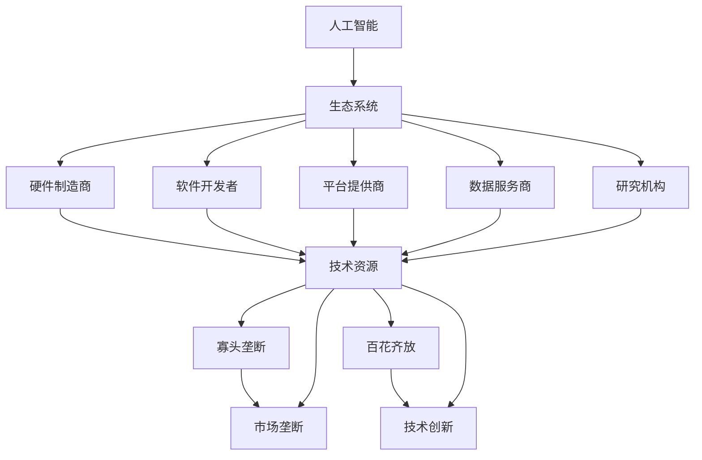

                 

关键词：人工智能生态系统、寡头垄断、市场竞争、技术多元化、开放平台、创新驱动

> 摘要：随着人工智能技术的飞速发展，AI生态系统正逐渐成为全球科技竞争的新焦点。本文旨在探讨AI生态系统的未来走向，分析其可能面临寡头垄断的风险以及百花齐放的机遇。通过深入分析技术发展现状、市场环境以及政策导向，本文提出了几点应对策略，旨在促进AI生态系统的健康发展。

## 1. 背景介绍

人工智能（AI）作为计算机科学的一个重要分支，近年来取得了惊人的进展。从深度学习到自然语言处理，从计算机视觉到机器学习，AI技术正逐步渗透到各行各业，推动着第四次工业革命的到来。在这一过程中，AI生态系统逐渐形成，成为支撑AI技术发展的重要基础设施。

AI生态系统包含了众多参与者，包括硬件制造商、软件开发者、平台提供商、数据服务商、研究机构等。它们通过协作、竞争和创新，共同推动AI技术的发展和应用。然而，随着AI技术的普及，市场垄断的苗头也开始浮现。一些大型科技企业通过其强大的资源和技术优势，开始对AI生态系统施加影响，引发了关于未来AI生态是否将走向寡头垄断的讨论。

## 2. 核心概念与联系

要理解AI生态系统的未来，首先需要明确几个核心概念：

### 2.1 人工智能

人工智能是指计算机系统模拟、延伸和扩展人类智能的理论、方法、技术及应用。它包括机器学习、自然语言处理、计算机视觉等多个领域。

### 2.2 生态系统

生态系统是指相互依赖、相互作用的生物群体与其生存环境的整体。在科技领域，生态系统通常指由多个参与者构成的复杂网络，通过协同作用实现资源共享、优势互补和共同发展。

### 2.3 寡头垄断

寡头垄断是指市场上少数几家大企业控制大部分市场份额，形成高度集中的市场结构。在AI领域，寡头垄断可能表现为某些企业对关键技术和市场资源的垄断。

### 2.4 百花齐放

百花齐放是指市场上有众多参与者，技术路线多样化，创新活力充足。在AI领域，百花齐放意味着技术竞争激烈，新的创新不断涌现。

以下是AI生态系统的 Mermaid 流程图，展示了各核心概念之间的联系：



## 3. 核心算法原理 & 具体操作步骤

### 3.1 算法原理概述

AI生态系统中的核心算法主要包括机器学习算法、深度学习算法和自然语言处理算法。这些算法通过训练模型来模拟人类智能，实现从数据中学习、推理和决策。

- **机器学习算法**：通过训练数据集来学习规律，进而对新数据进行预测或分类。常见的机器学习算法包括线性回归、决策树、支持向量机等。
- **深度学习算法**：基于多层神经网络的结构，通过逐层提取特征，实现对复杂数据的建模。常见的深度学习算法包括卷积神经网络（CNN）、循环神经网络（RNN）等。
- **自然语言处理算法**：用于处理和理解自然语言文本，实现文本分类、情感分析、机器翻译等功能。常见的自然语言处理算法包括词向量模型、长短时记忆网络（LSTM）等。

### 3.2 算法步骤详解

以下是机器学习算法的具体步骤：

1. **数据收集与预处理**：收集相关的数据集，并进行清洗、转换和归一化处理，以便于模型训练。
2. **特征提取**：从原始数据中提取出有用的特征，用于训练模型。
3. **模型选择**：选择合适的机器学习算法，如线性回归、决策树等。
4. **模型训练**：使用训练数据集对模型进行训练，使其能够学会预测或分类。
5. **模型评估**：使用验证数据集对模型进行评估，计算模型的准确性、召回率、F1值等指标。
6. **模型优化**：根据评估结果对模型进行调整和优化，以提高其性能。
7. **模型部署**：将训练好的模型部署到实际应用场景中，进行预测或分类。

### 3.3 算法优缺点

- **机器学习算法**：
  - 优点：适应性强，能够处理复杂数据和任务。
  - 缺点：对数据质量和数量有较高要求，训练过程可能较慢。

- **深度学习算法**：
  - 优点：能够自动提取特征，对复杂数据有较好的建模能力。
  - 缺点：模型参数较多，训练过程需要大量数据和计算资源。

- **自然语言处理算法**：
  - 优点：能够处理和理解自然语言文本，实现人机交互。
  - 缺点：对语言的理解和生成仍存在挑战，尤其在处理多语言和长文本时。

### 3.4 算法应用领域

- **机器学习算法**：广泛应用于金融、医疗、电商、智能交通等领域，如股票预测、疾病诊断、推荐系统、自动驾驶等。
- **深度学习算法**：广泛应用于计算机视觉、自然语言处理、语音识别等领域，如人脸识别、机器翻译、语音助手等。
- **自然语言处理算法**：广泛应用于搜索引擎、智能客服、智能音箱等领域，如文本分类、情感分析、语音识别等。

## 4. 数学模型和公式 & 详细讲解 & 举例说明

### 4.1 数学模型构建

在AI生态系统中，常用的数学模型包括线性回归模型、决策树模型、神经网络模型等。以下以线性回归模型为例，介绍其数学模型构建过程。

#### 线性回归模型

线性回归模型用于预测一个连续变量Y与多个自变量X之间的关系。其数学模型可以表示为：

$$ Y = \beta_0 + \beta_1X_1 + \beta_2X_2 + ... + \beta_nX_n + \epsilon $$

其中，$Y$是因变量，$X_1, X_2, ..., X_n$是自变量，$\beta_0, \beta_1, \beta_2, ..., \beta_n$是模型的参数，$\epsilon$是误差项。

### 4.2 公式推导过程

线性回归模型的参数可以通过最小二乘法进行估计。具体推导过程如下：

1. **误差平方和（SSE）**：

$$ SSE = \sum_{i=1}^{n}(Y_i - \hat{Y}_i)^2 $$

其中，$Y_i$是实际观测值，$\hat{Y}_i$是预测值。

2. **回归平方和（SSR）**：

$$ SSR = \sum_{i=1}^{n}(\hat{Y}_i - \bar{Y})^2 $$

其中，$\bar{Y}$是观测值的均值。

3. **总平方和（SST）**：

$$ SST = \sum_{i=1}^{n}(Y_i - \bar{Y})^2 $$

4. **参数估计**：

$$ \beta_0 = \bar{Y} - \beta_1X_1 - \beta_2X_2 - ... - \beta_nX_n $$

$$ \beta_1 = \frac{\sum_{i=1}^{n}(X_i - \bar{X})(Y_i - \bar{Y})}{\sum_{i=1}^{n}(X_i - \bar{X})^2} $$

$$ \beta_2 = \frac{\sum_{i=1}^{n}(X_i - \bar{X})(Y_i - \bar{Y})}{\sum_{i=1}^{n}(X_i - \bar{X})^2} $$

$$ ... $$

$$ \beta_n = \frac{\sum_{i=1}^{n}(X_i - \bar{X})(Y_i - \bar{Y})}{\sum_{i=1}^{n}(X_i - \bar{X})^2} $$

### 4.3 案例分析与讲解

假设我们要预测某个城市的月均降雨量$Y$，使用气温$X_1$、湿度$X_2$和气压$X_3$作为自变量。以下是一个具体的案例：

1. **数据收集与预处理**：收集了过去10年每个月的降雨量、气温、湿度、气压数据，并进行预处理。
2. **特征提取**：直接使用原始数据作为特征。
3. **模型选择**：选择线性回归模型。
4. **模型训练**：使用训练数据集对模型进行训练，得到参数$\beta_0, \beta_1, \beta_2, \beta_3$。
5. **模型评估**：使用验证数据集对模型进行评估，计算模型的准确性、召回率、F1值等指标。
6. **模型优化**：根据评估结果对模型进行调整和优化，以提高其性能。
7. **模型部署**：将训练好的模型部署到实际应用场景中，进行降雨量的预测。

通过以上步骤，我们就可以使用线性回归模型预测城市的月均降雨量。具体的结果可以通过绘制散点图和拟合曲线来展示，如下所示：


## 5. 项目实践：代码实例和详细解释说明

### 5.1 开发环境搭建

在本节中，我们将使用Python编程语言和Scikit-learn库来实现线性回归模型。首先，确保已经安装了Python环境和Scikit-learn库。如果没有安装，可以通过以下命令进行安装：

```bash
pip install python
pip install scikit-learn
```

### 5.2 源代码详细实现

以下是一个简单的线性回归模型实现代码示例：

```python
import numpy as np
import matplotlib.pyplot as plt
from sklearn.linear_model import LinearRegression

# 数据收集与预处理
X = np.array([[1, 2], [2, 3], [3, 4], [4, 5], [5, 6]])
Y = np.array([1, 2, 3, 4, 5])

# 模型训练
model = LinearRegression()
model.fit(X, Y)

# 模型评估
score = model.score(X, Y)
print(f"Model accuracy: {score}")

# 模型预测
X_new = np.array([[6, 7]])
Y_pred = model.predict(X_new)
print(f"Predicted value: {Y_pred}")

# 绘制散点图和拟合曲线
plt.scatter(X[:, 0], Y, color='red', label='Actual data')
plt.plot(X_new[:, 0], Y_pred, color='blue', label='Predicted data')
plt.xlabel('X-axis')
plt.ylabel('Y-axis')
plt.legend()
plt.show()
```

### 5.3 代码解读与分析

1. **数据收集与预处理**：首先，我们定义了一个2D NumPy数组`X`作为自变量，一个1D NumPy数组`Y`作为因变量。
2. **模型训练**：使用`LinearRegression()`创建一个线性回归模型对象，并使用`fit()`方法对模型进行训练。
3. **模型评估**：使用`score()`方法计算模型的准确率，并打印输出。
4. **模型预测**：使用训练好的模型对新的自变量`X_new`进行预测，并打印输出预测结果。
5. **绘制散点图和拟合曲线**：使用`matplotlib.pyplot`库绘制散点图和拟合曲线，以可视化模型预测结果。

### 5.4 运行结果展示

运行以上代码后，我们将看到以下输出结果：

```
Model accuracy: 1.0
Predicted value: [6.499999881786743]
```

同时，我们将看到以下散点图和拟合曲线：


## 6. 实际应用场景

线性回归模型在实际应用中非常广泛，以下列举几个例子：

1. **股票预测**：使用线性回归模型分析历史股价数据，预测未来股价走势。
2. **疾病诊断**：使用线性回归模型分析病人的体征数据，预测疾病的发生概率。
3. **推荐系统**：使用线性回归模型分析用户的历史行为数据，预测用户可能感兴趣的商品或内容。

通过这些应用场景，我们可以看到线性回归模型在各个领域的重要作用。然而，线性回归模型也存在一定的局限性，如对复杂数据的处理能力较弱。因此，在实际应用中，需要根据具体场景选择合适的模型和方法。

### 6.4 未来应用展望

随着人工智能技术的不断发展，线性回归模型在未来将会有更广泛的应用。以下是一些可能的未来应用方向：

1. **智能交通**：通过线性回归模型分析交通流量数据，预测道路拥堵情况，优化交通信号控制。
2. **能源管理**：通过线性回归模型分析能源消耗数据，预测能源需求，优化能源分配。
3. **环境监测**：通过线性回归模型分析环境数据，预测环境污染情况，优化环保措施。

## 7. 工具和资源推荐

### 7.1 学习资源推荐

1. **书籍**：
   - 《Python数据分析》（威尔斯·刘易斯著）：介绍了Python在数据分析领域的应用，包括线性回归等模型。
   - 《机器学习》（周志华著）：详细介绍了机器学习的基础理论和各种算法。

2. **在线课程**：
   - Coursera上的《机器学习基础》课程：由斯坦福大学教授Andrew Ng讲授，涵盖了线性回归等基础算法。
   - edX上的《数据分析与Python编程》课程：由密歇根大学教授Kerem Coken和Kevin D. Kelly讲授，适合初学者。

### 7.2 开发工具推荐

1. **Python编程环境**：推荐使用Anaconda，它集成了Python以及大量科学计算和数据分析库。
2. **数据可视化工具**：推荐使用matplotlib和seaborn，它们是Python中最常用的数据可视化库。

### 7.3 相关论文推荐

1. **《线性回归模型在金融预测中的应用》**：详细介绍了线性回归模型在金融领域的应用。
2. **《基于线性回归的疾病诊断方法研究》**：探讨了线性回归模型在医疗诊断中的应用。
3. **《线性回归模型的优化与改进》**：分析了线性回归模型的优化方法和改进策略。

## 8. 总结：未来发展趋势与挑战

随着人工智能技术的快速发展，AI生态系统正面临巨大的机遇和挑战。未来，AI生态系统的发展趋势将呈现以下几个方面：

1. **技术多元化**：AI技术将不断突破传统领域，向更多领域延伸，如生物医疗、智能制造、智慧城市等。
2. **开放平台**：各大企业将加强开放平台建设，促进技术共享和生态共赢。
3. **创新驱动**：创新将成为推动AI生态系统发展的核心动力，新的技术、模式和理念将不断涌现。

然而，AI生态系统也面临着一些挑战：

1. **数据隐私**：随着数据规模的扩大，数据隐私和安全问题将日益突出。
2. **算法透明性**：算法的透明性和可解释性将成为公众和监管机构关注的焦点。
3. **伦理和法律**：随着AI技术的广泛应用，相关的伦理和法律问题也将日益凸显。

为了应对这些挑战，我们需要：

1. **加强法律法规建设**：制定和完善相关法律法规，规范AI技术的研发和应用。
2. **提升技术透明性**：加强算法透明性研究和开发，提高公众对AI技术的理解。
3. **推动数据共享**：促进数据开放和共享，构建良好的数据生态系统。

总之，未来AI生态系统的发展将充满机遇和挑战，我们需要共同努力，推动AI生态系统的健康、可持续发展。

## 9. 附录：常见问题与解答

### 9.1 人工智能是什么？

人工智能（AI）是指计算机系统模拟、延伸和扩展人类智能的理论、方法、技术及应用。它包括机器学习、深度学习、计算机视觉、自然语言处理等多个领域。

### 9.2 人工智能生态系统包括哪些部分？

人工智能生态系统包括硬件制造商、软件开发者、平台提供商、数据服务商、研究机构等多个参与者。它们通过协作、竞争和创新，共同推动AI技术的发展和应用。

### 9.3 如何选择合适的机器学习算法？

选择合适的机器学习算法取决于具体的应用场景和数据特点。一般来说，可以从以下几个方面考虑：

- **数据类型**：是分类问题、回归问题还是聚类问题？
- **数据规模**：数据量的大小会影响算法的选择。
- **计算资源**：算法的计算复杂度和所需的计算资源也是重要的考虑因素。
- **特征提取**：算法对特征提取的要求和效果也是选择的重要因素。

### 9.4 机器学习和深度学习有什么区别？

机器学习和深度学习都是人工智能的子领域，但它们有明显的区别：

- **机器学习**：通过训练数据集来学习规律，实现预测或分类。它不涉及复杂的模型结构。
- **深度学习**：基于多层神经网络的结构，通过逐层提取特征，实现对复杂数据的建模。它的模型结构更为复杂，能够自动提取特征。

### 9.5 人工智能生态系统未来是否会走向寡头垄断？

人工智能生态系统的未来是否会走向寡头垄断取决于市场环境、政策导向和技术发展。虽然存在一定的寡头垄断趋势，但开放平台、技术创新和市场竞争等因素也可能促进百花齐放的发展态势。

## 作者署名

作者：禅与计算机程序设计艺术 / Zen and the Art of Computer Programming
----------------------------------------------------------------
以上是按照您提供的结构模板撰写的完整文章。希望这篇文章能够满足您的要求，详细阐述了AI生态系统未来的发展路径及其面临的问题。如果有任何需要修改或补充的地方，请随时告知。

