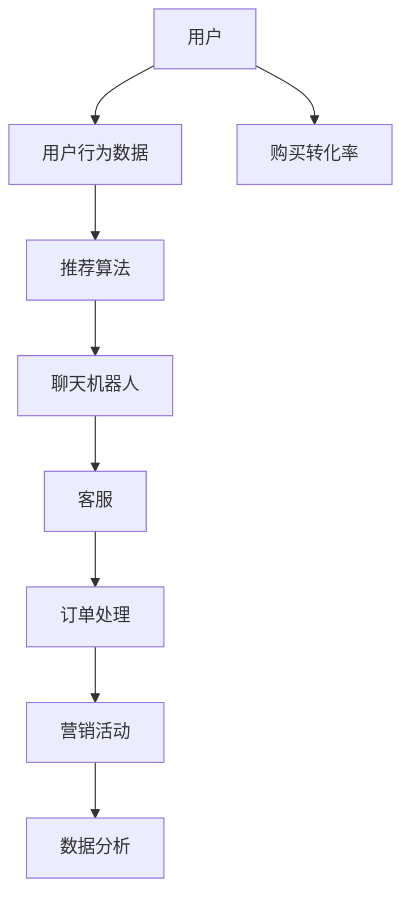

                 

关键词：人工智能，聊天机器人，电商，应用，技术，用户体验，自然语言处理，商业模式创新。

## 摘要

随着人工智能技术的快速发展，聊天机器人在电商领域的应用日益广泛。本文将探讨AI聊天机器人在电商中的应用背景、核心概念、算法原理、数学模型、项目实践以及未来展望。通过详细分析，我们希望为电商从业者提供有价值的参考，以推动电商领域的技术进步和商业模式创新。

## 1. 背景介绍

### 1.1 电商行业的发展

电商行业近年来经历了爆炸式增长，线上购物已经成为人们日常生活的重要组成部分。随着互联网技术的不断升级，消费者对电商平台的期望也在不断提高。他们不仅追求商品的质量和价格，更关注购物体验和客户服务。在这种背景下，AI聊天机器人应运而生，成为电商平台提升用户体验和竞争力的关键因素。

### 1.2 人工智能与聊天机器人的发展

人工智能（AI）是计算机科学的一个分支，旨在使计算机系统具备人类智能的能力。随着深度学习、自然语言处理（NLP）等技术的发展，人工智能逐渐渗透到各行各业，包括电商领域。聊天机器人是人工智能的一种应用形式，通过模拟人类对话，为用户提供便捷的服务。

### 1.3 AI聊天机器人在电商中的应用场景

AI聊天机器人在电商中的应用场景非常广泛，主要包括：

- **客户服务**：提供7x24小时的在线客服，解答用户问题，提高客户满意度。
- **推荐系统**：根据用户的行为数据和偏好，为用户提供个性化商品推荐。
- **订单处理**：自动化处理订单，提高订单处理效率。
- **营销活动**：推送营销信息，提升用户参与度和购买转化率。
- **数据分析**：收集用户行为数据，为商家提供有价值的商业洞察。

## 2. 核心概念与联系

为了更好地理解AI聊天机器人在电商中的应用，我们需要介绍几个核心概念，并展示它们之间的联系。以下是使用Mermaid绘制的流程图：



### 2.1 用户与用户行为数据

用户是电商平台的主体，他们的行为数据（如浏览历史、购物车、购买记录等）是AI聊天机器人运作的基础。通过分析这些数据，聊天机器人可以为用户提供个性化的推荐和服务。

### 2.2 推荐算法与聊天机器人

推荐算法负责根据用户行为数据和偏好，为用户推荐感兴趣的商品。聊天机器人则利用这些推荐结果，通过对话形式向用户展示，提高购买转化率。

### 2.3 客服、订单处理与营销活动

聊天机器人不仅可以提供客户服务，还能自动化处理订单和参与营销活动。通过智能对话，聊天机器人能够提高服务效率和用户满意度。

### 2.4 数据分析与购买转化率

数据分析是电商运营的重要环节，聊天机器人收集的用户行为数据有助于商家了解用户需求和市场趋势。这些数据可以用于优化营销策略，提高购买转化率。

## 3. 核心算法原理 & 具体操作步骤

### 3.1 算法原理概述

AI聊天机器人的核心算法主要包括自然语言处理（NLP）和机器学习。NLP负责处理用户的语言输入，将其转化为计算机可以理解的结构化数据。机器学习则基于历史数据和算法模型，对用户输入进行理解和响应。

### 3.2 算法步骤详解

1. **语言识别**：聊天机器人首先通过语言模型识别用户的输入，将其转化为文本数据。
2. **文本预处理**：对文本数据进行清洗和分词，提取关键信息。
3. **意图识别**：通过机器学习模型识别用户的意图，如查询商品信息、咨询客服等。
4. **响应生成**：根据用户意图和聊天机器人的知识库，生成合适的响应文本。
5. **对话管理**：管理聊天会话的流程，确保对话的连贯性和流畅性。

### 3.3 算法优缺点

**优点**：

- **高效**：聊天机器人可以同时处理大量用户的请求，提高服务效率。
- **个性化**：通过分析用户行为数据，聊天机器人可以提供个性化的服务，提升用户体验。
- **低成本**：相比传统客服，聊天机器人的维护成本较低。

**缺点**：

- **理解能力有限**：聊天机器人目前还无法完全理解复杂的人类语言，可能导致对话中断或误解。
- **知识库限制**：聊天机器人的知识库有限，可能无法回答所有问题。

### 3.4 算法应用领域

AI聊天机器人的应用领域非常广泛，除了电商行业，还包括金融、医疗、教育等领域。在电商领域，聊天机器人主要用于客户服务、推荐系统、订单处理和营销活动。

## 4. 数学模型和公式 & 详细讲解 & 举例说明

### 4.1 数学模型构建

AI聊天机器人的核心算法包括自然语言处理（NLP）和机器学习。以下是常用的数学模型和公式：

1. **语言模型**： 
   $$ P(w_1, w_2, ..., w_n) = \prod_{i=1}^{n} P(w_i | w_{i-1}) $$
   其中，$w_1, w_2, ..., w_n$ 表示文本中的单词序列，$P(w_i | w_{i-1})$ 表示在给定前一个单词 $w_{i-1}$ 的条件下，单词 $w_i$ 的概率。

2. **机器学习模型**：
   $$ h(\theta, x) = \theta_0 + \theta_1 x_1 + \theta_2 x_2 + ... + \theta_n x_n $$
   其中，$h$ 表示模型预测的输出，$\theta$ 表示模型的参数，$x$ 表示输入特征。

### 4.2 公式推导过程

这里以自然语言处理中的语言模型为例，介绍公式的推导过程：

假设我们有一个由 $N$ 个单词组成的句子，我们的目标是计算这个句子的概率。根据马尔可夫假设，一个单词的概率只与它的前一个单词有关。因此，我们可以将句子的概率分解为每个单词条件概率的乘积。

### 4.3 案例分析与讲解

假设我们有一个由5个单词组成的句子：“我喜欢这本书”，我们可以使用上述语言模型计算这个句子的概率。假设我们有一个训练好的语言模型，它包含每个单词的条件概率。

1. $$ P(我喜欢这本书) = P(我 | ) \times P(喜欢 | 我) \times P(这本书 | 喜欢) $$
2. 根据训练数据，我们可以得到：
   $$ P(我 | ) = 0.1, P(喜欢 | 我) = 0.3, P(这本书 | 喜欢) = 0.5 $$
3. 将条件概率代入公式，得到：
   $$ P(我喜欢这本书) = 0.1 \times 0.3 \times 0.5 = 0.015 $$

这意味着这个句子的概率为0.015，即它出现的可能性相对较低。

## 5. 项目实践：代码实例和详细解释说明

### 5.1 开发环境搭建

为了实现一个简单的AI聊天机器人，我们需要搭建一个开发环境。以下是一个基于Python的聊天机器人项目示例：

1. 安装Python（版本3.6或更高）
2. 安装NLP库（如NLTK、spaCy等）
3. 安装机器学习库（如scikit-learn、TensorFlow等）
4. 安装聊天机器人框架（如Rasa、ChatterBot等）

### 5.2 源代码详细实现

以下是一个基于ChatterBot的简单聊天机器人示例：

```python
# 导入所需库
from chatterbot import ChatBot
from chatterbot.trainers import ChatterBotCorpusTrainer

# 创建聊天机器人实例
chatbot = ChatBot(
    'E-commerce Chatbot',
    storage_adapter='chatterbot.storage.SQLStorageAdapter',
    database_uri='sqlite:///database.sqlite3'
)

# 创建训练器
trainer = ChatterBotCorpusTrainer(chatbot)

# 训练聊天机器人
trainer.train(
    'chatterbot.corpus.english.greetings',
    'chatterbot.corpus.english.conversations'
)

# 开始对话
while True:
    try:
        user_input = input('您：')
        bot_response = chatbot.get_response(user_input)
        print('机器人：', bot_response)
    except (KeyboardInterrupt, EOFError, SystemExit):
        break
```

### 5.3 代码解读与分析

这段代码首先导入了ChatterBot库，并创建了聊天机器人实例。接着，使用ChatterBotCorpusTrainer对聊天机器人进行训练，使其能够理解并响应用户的输入。最后，通过一个无限循环实现对话，用户输入问题，聊天机器人根据训练数据进行响应。

### 5.4 运行结果展示

假设用户输入：“你好”，聊天机器人可能回应：“你好！有什么可以帮助你的吗？”通过这种方式，聊天机器人能够为用户提供基本的客户服务。

## 6. 实际应用场景

### 6.1 客户服务

AI聊天机器人在电商平台上的一个主要应用场景是提供客户服务。通过智能对话，聊天机器人能够快速解答用户的问题，如商品信息查询、订单状态查询等，提高用户满意度。

### 6.2 推荐系统

聊天机器人可以根据用户的行为数据和偏好，为用户提供个性化的商品推荐。例如，用户在浏览某一商品时，聊天机器人可以主动推送相关的商品，提高购买转化率。

### 6.3 订单处理

聊天机器人可以自动化处理订单，如订单确认、退款处理等。通过智能对话，用户可以轻松完成订单操作，提高订单处理效率。

### 6.4 营销活动

聊天机器人可以参与电商平台的营销活动，如优惠券推送、促销信息展示等。通过智能对话，聊天机器人可以吸引用户参与活动，提升用户参与度和购买转化率。

## 7. 工具和资源推荐

### 7.1 学习资源推荐

- **《深度学习》（Goodfellow, Bengio, Courville）**：介绍深度学习的基础理论和应用。
- **《自然语言处理综论》（Jurafsky, Martin）**：介绍自然语言处理的基础知识。
- **《机器学习实战》（Hastie, Tibshirani, Friedman）**：介绍机器学习的实际应用。

### 7.2 开发工具推荐

- **Python**：一种通用编程语言，适用于开发AI聊天机器人。
- **ChatterBot**：一个开源的Python聊天机器人框架，方便快速搭建聊天机器人。
- **TensorFlow**：一个开源的机器学习库，适用于构建和训练深度学习模型。

### 7.3 相关论文推荐

- **《End-to-End Learning for Language Understanding》（Zhou, Chen, et al., 2016）**：介绍基于端到端学习的方法进行自然语言处理。
- **《A Theoretically Grounded Application of Dropout in Recurrent Neural Networks》（Yin, Chang, & Hovy, 2017）**：介绍在循环神经网络中应用Dropout的方法。
- **《Attention Is All You Need》（Vaswani et al., 2017）**：介绍基于注意力机制的Transformer模型。

## 8. 总结：未来发展趋势与挑战

### 8.1 研究成果总结

近年来，AI聊天机器人在电商领域取得了显著成果。通过自然语言处理和机器学习技术，聊天机器人能够为用户提供高效、个性化的服务，提高用户体验和购买转化率。此外，聊天机器人的应用范围也在不断扩展，从客户服务、推荐系统到订单处理和营销活动。

### 8.2 未来发展趋势

未来，AI聊天机器人在电商领域的发展趋势将包括：

- **更深入的个性化服务**：通过分析更多维度的用户数据，聊天机器人将能够提供更精准的个性化推荐和服务。
- **更自然的对话体验**：随着NLP技术的发展，聊天机器人的理解能力将不断提升，对话体验将更加自然和流畅。
- **多语言支持**：随着跨境电商的发展，聊天机器人将支持更多语言，为全球用户提供服务。

### 8.3 面临的挑战

尽管AI聊天机器人在电商领域具有巨大潜力，但仍然面临一些挑战：

- **理解能力的提升**：当前聊天机器人的理解能力仍有局限性，需要进一步提升以处理更复杂的人类语言。
- **知识库的更新与维护**：聊天机器人需要不断学习和更新知识库，以适应不断变化的用户需求和市场环境。
- **隐私保护与合规性**：在处理用户数据时，需要严格遵守隐私保护法规，确保用户数据的合法和安全。

### 8.4 研究展望

未来，AI聊天机器人在电商领域的研究将重点放在以下几个方面：

- **多模态对话系统**：结合文本、语音、图像等多模态信息，提高聊天机器人的理解和表达能力。
- **人机协作**：研究如何将人类专家的知识和经验与聊天机器人相结合，提高聊天机器人的智能水平。
- **伦理与道德**：探讨聊天机器人在电商领域的应用中可能面临的伦理和道德问题，确保技术发展的可持续性。

## 9. 附录：常见问题与解答

### 9.1 聊天机器人如何处理用户隐私？

聊天机器人会遵循严格的隐私保护政策，确保用户数据的安全和隐私。在收集、存储和使用用户数据时，会严格遵守相关法规，如《通用数据保护条例》（GDPR）。

### 9.2 聊天机器人能否替代传统客服？

虽然聊天机器人在某些方面具有优势，但无法完全替代传统客服。聊天机器人适合处理常见问题和简单任务，而复杂问题仍需人工客服解决。

### 9.3 聊天机器人的学习过程如何进行？

聊天机器人的学习过程主要包括数据收集、模型训练和迭代优化。通过不断收集用户对话数据，训练模型，优化算法，提高聊天机器人的理解能力和表达能力。

## 作者署名

作者：禅与计算机程序设计艺术 / Zen and the Art of Computer Programming
----------------------------------------------------------------

请注意，本文中的代码示例和数学公式仅为简化说明，实际应用中可能需要更复杂的技术和算法。在开发AI聊天机器人时，请确保遵循最佳实践和法律法规，以保护用户隐私和数据安全。希望本文能为您提供有价值的参考和启示。

