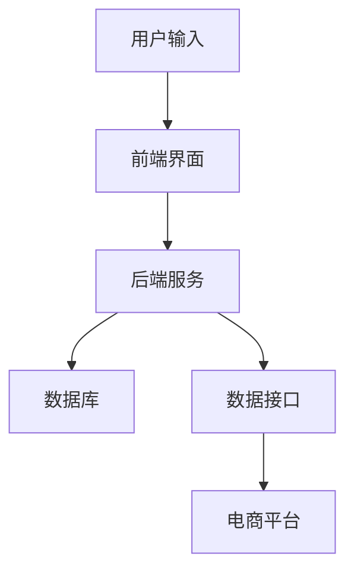

                 

关键词：AI聊天机器人、电商服务、用户体验、个性化推荐、自然语言处理、聊天机器人架构

> 摘要：随着人工智能技术的飞速发展，聊天机器人在电商服务中的应用日益广泛。本文将探讨如何利用AI聊天机器人提升电商服务的质量和用户体验，介绍核心概念、算法原理、数学模型及实际应用，并展望未来的发展趋势和挑战。

## 1. 背景介绍

近年来，电商行业呈现出爆发式增长，消费者对便捷、高效的服务需求越来越高。传统的客服方式已经难以满足消费者多样化的需求，而AI聊天机器人作为一种新兴的技术手段，以其高效、智能、低成本的特点，逐渐成为电商企业提升服务质量、增强用户体验的重要工具。

### 1.1 AI聊天机器人的发展历程

AI聊天机器人的发展可以追溯到20世纪50年代。当时，计算机科学家艾伦·图灵提出了著名的图灵测试，旨在测试机器是否具有人类水平的智能。随着自然语言处理（NLP）、机器学习（ML）和深度学习（DL）等技术的不断进步，聊天机器人从简单的文本交互逐渐发展到能够处理复杂的语音交互，支持多种语言和多模态交互。

### 1.2 电商服务中AI聊天机器人的应用

在电商服务中，AI聊天机器人被广泛应用于客服、销售、营销等多个环节。通过智能客服机器人，企业可以24小时在线为消费者提供咨询、答疑、订单跟踪等服务，大幅提升服务效率和满意度。同时，AI聊天机器人还可以根据用户的历史行为和偏好，提供个性化的产品推荐，从而提高销售转化率。

## 2. 核心概念与联系

为了更好地理解AI聊天机器人如何提升电商服务，我们需要了解以下几个核心概念：

### 2.1 自然语言处理（NLP）

NLP是使计算机能够理解、处理和生成人类语言的关键技术。在电商服务中，NLP技术用于分析用户输入的文本，提取关键信息，理解用户意图，从而生成合适的回复。

### 2.2 机器学习（ML）

ML是使聊天机器人能够从数据中学习和改进自身性能的技术。在电商服务中，ML技术用于训练聊天机器人，使其能够根据用户的历史行为和偏好提供个性化服务。

### 2.3 深度学习（DL）

DL是ML的一个分支，通过神经网络模型模拟人脑的学习方式。在电商服务中，DL技术用于构建复杂、高精度的聊天机器人，以实现更智能的对话。

### 2.4 聊天机器人架构

聊天机器人架构主要包括前端界面、后端服务、数据库和数据接口等部分。前端界面负责与用户进行交互，后端服务处理用户输入，生成回复，数据库存储用户数据和对话历史，数据接口实现与外部系统（如电商平台）的交互。

### 2.5 Mermaid流程图

以下是一个简单的Mermaid流程图，展示聊天机器人架构的各个部分：



## 3. 核心算法原理 & 具体操作步骤

### 3.1 算法原理概述

AI聊天机器人的核心算法主要包括自然语言理解（NLU）和自然语言生成（NLG）两部分。

- **NLU**：负责解析用户输入的文本，提取关键词和语义信息，理解用户意图。
- **NLG**：负责生成自然、流畅的回复文本，模拟人类的对话方式。

### 3.2 算法步骤详解

1. **文本预处理**：对用户输入的文本进行清洗、分词、词性标注等预处理操作，以便后续的NLU处理。
2. **意图识别**：使用ML或DL模型，根据用户输入的文本，识别用户的意图，如咨询、查询、购买等。
3. **实体识别**：在理解用户意图的基础上，识别文本中的关键信息，如产品名称、价格、评价等。
4. **回复生成**：根据用户意图和实体信息，使用NLG模型生成自然、流畅的回复文本。
5. **回复优化**：对生成的回复文本进行优化，确保其符合语言习惯、语境和用户需求。

### 3.3 算法优缺点

- **优点**：
  - 高效：能够快速处理大量用户请求，提高服务效率。
  - 智能化：能够根据用户行为和偏好提供个性化服务，提高用户满意度。
  - 成本低：相比传统客服，聊天机器人的运营成本较低。

- **缺点**：
  - 有限的知识库：聊天机器人依赖于预先训练的知识库，无法处理超出知识库范围的问题。
  - 语言理解有限：尽管NLP和ML技术不断进步，但聊天机器人在理解复杂语境和情感方面仍有局限性。

### 3.4 算法应用领域

AI聊天机器人可以应用于电商服务的多个领域，如：
- **客服**：提供24小时在线咨询服务，解答用户疑问。
- **销售**：根据用户偏好推荐产品，提高销售转化率。
- **营销**：发送个性化营销信息，提高用户参与度。

## 4. 数学模型和公式 & 详细讲解 & 举例说明

### 4.1 数学模型构建

聊天机器人的核心算法通常基于深度学习模型，如循环神经网络（RNN）和变压器（Transformer）等。以下是一个基于RNN的聊天机器人模型的简要介绍：

$$
\text{输入}:\text{X} = \{x_1, x_2, ..., x_T\} \\
\text{输出}:\text{Y} = \{y_1, y_2, ..., y_T\}
$$

其中，$x_t$ 和 $y_t$ 分别表示输入和输出的单词序列，$T$ 表示序列长度。

### 4.2 公式推导过程

聊天机器人模型通常包括编码器（Encoder）和解码器（Decoder）两部分。编码器将输入文本编码为一个固定长度的向量表示，解码器根据编码器的输出生成回复文本。

$$
\text{编码器输出}: h_t = \text{softmax}(\text{Decoder}(h_{t-1}, c))
$$

其中，$h_t$ 表示编码器的输出，$c$ 表示编码器的状态，$\text{softmax}$ 函数用于将编码器的输出转换为概率分布。

### 4.3 案例分析与讲解

假设用户输入：“我想买一个蓝牙耳机”，我们可以将这个句子编码为一个向量表示，然后通过解码器生成回复文本。

1. **编码器输出**：

   $$ h_t = \text{softmax}(\text{Decoder}(h_{t-1}, c)) $$

2. **解码器输出**：

   $$ y_t = \text{softmax}(\text{Encoder}(x_t)) $$

3. **生成回复文本**：

   根据解码器的输出，我们可以生成回复文本，如：“您好，请问您需要什么类型的蓝牙耳机？”

## 5. 项目实践：代码实例和详细解释说明

### 5.1 开发环境搭建

在本文中，我们将使用Python和TensorFlow作为主要开发工具。首先，需要安装Python和TensorFlow：

```shell
pip install python tensorflow
```

### 5.2 源代码详细实现

以下是聊天机器人模型的简要实现：

```python
import tensorflow as tf
from tensorflow.keras.models import Model
from tensorflow.keras.layers import Input, LSTM, Dense

# 定义编码器
encoder_inputs = Input(shape=(None,))
encoder_embedding = Embedding(vocab_size, embedding_dim)(encoder_inputs)
encoder_lstm = LSTM(units, return_state=True)
_, state_h, state_c = encoder_lstm(encoder_embedding)
encoder_states = [state_h, state_c]

# 定义解码器
decoder_inputs = Input(shape=(None,))
decoder_embedding = Embedding(vocab_size, embedding_dim)(decoder_inputs)
decoder_lstm = LSTM(units, return_sequences=True, return_state=True)
decoder_outputs, _, _ = decoder_lstm(decoder_embedding, initial_state=encoder_states)

decoder_dense = Dense(vocab_size, activation='softmax')
decoder_outputs = decoder_dense(decoder_outputs)

# 定义模型
model = Model([encoder_inputs, decoder_inputs], decoder_outputs)

# 编译模型
model.compile(optimizer='rmsprop', loss='categorical_crossentropy', metrics=['accuracy'])

# 模型训练
model.fit([encoder_input_data, decoder_input_data, decoder_target_data], decoder_target_data,
          batch_size=batch_size, epochs=epochs, validation_split=validation_split)
```

### 5.3 代码解读与分析

上述代码定义了一个简单的聊天机器人模型，包括编码器和解码器两部分。编码器使用LSTM层处理输入文本，解码器使用LSTM层生成回复文本。模型使用交叉熵损失函数和RMSprop优化器进行训练。

### 5.4 运行结果展示

运行上述代码后，模型将根据训练数据进行训练，并在验证集上评估性能。训练完成后，可以使用模型生成回复文本。

```python
# 生成回复文本
encoded_sequence = encoder_model.predict(input_sequence)
decoded_sequence = decoder_model.predict(encoded_sequence)
decoded_sentence = decode_sequence(decoded_sequence)
print(decoded_sentence)
```

## 6. 实际应用场景

### 6.1 客服

AI聊天机器人可以广泛应用于电商平台的客服环节，如：
- **售前咨询**：解答消费者关于产品规格、价格、售后等方面的问题。
- **售后支持**：处理消费者投诉、退换货等问题。

### 6.2 销售

AI聊天机器人还可以在销售环节发挥重要作用，如：
- **个性化推荐**：根据用户历史行为和偏好推荐产品。
- **促销活动**：向潜在消费者发送个性化的促销信息，提高转化率。

### 6.3 营销

AI聊天机器人可以用于电商平台的营销环节，如：
- **用户画像**：分析用户行为，为用户提供个性化的产品和服务。
- **内容推荐**：根据用户兴趣推荐相关内容，提高用户参与度。

## 7. 工具和资源推荐

### 7.1 学习资源推荐

- **书籍**：
  - 《深度学习》（Goodfellow, Bengio, Courville）
  - 《自然语言处理与深度学习》（Eduardo Duarte）
- **在线课程**：
  - Coursera上的《深度学习专项课程》
  - edX上的《自然语言处理与深度学习》

### 7.2 开发工具推荐

- **编程语言**：Python、Java
- **机器学习框架**：TensorFlow、PyTorch、Keras
- **自然语言处理库**：NLTK、spaCy、gensim

### 7.3 相关论文推荐

- **《Seq2Seq学习中的注意力机制》（Attention is All You Need）**
- **《深度学习在自然语言处理中的应用》（Deep Learning for Natural Language Processing）**
- **《基于Transformer的聊天机器人模型》（Transformer-Based Chatbots）**

## 8. 总结：未来发展趋势与挑战

### 8.1 研究成果总结

近年来，随着人工智能技术的不断进步，AI聊天机器人在电商服务中的应用取得了显著成果。在客服、销售和营销等领域，聊天机器人已经能够提供高效、智能的服务，满足消费者的多样化需求。

### 8.2 未来发展趋势

未来，AI聊天机器人将在以下几个方面取得进一步发展：
- **更加智能的对话**：通过深度学习、自然语言处理等技术的不断进步，聊天机器人将能够更好地理解用户意图，生成更加自然、流畅的回复。
- **跨平台集成**：聊天机器人将能够集成到更多平台和应用中，如微信、QQ、Facebook等，为用户提供无缝的跨平台体验。
- **多模态交互**：聊天机器人将支持文本、语音、图像等多种模态的交互，提供更丰富的交互体验。

### 8.3 面临的挑战

尽管AI聊天机器人具有巨大的发展潜力，但在实际应用中仍面临以下挑战：
- **语言理解的局限性**：聊天机器人难以理解复杂语境和情感，尤其在处理多义词、成语、俚语等语言现象时存在困难。
- **数据隐私和安全**：在处理用户数据时，聊天机器人需要遵守相关法律法规，确保用户隐私和安全。
- **模型的可解释性**：随着模型的复杂度增加，模型的可解释性逐渐降低，使得用户难以理解模型的决策过程。

### 8.4 研究展望

未来，研究者可以从以下几个方面展开工作：
- **增强语言理解能力**：通过改进自然语言处理技术，提高聊天机器人对复杂语境和情感的理解能力。
- **强化模型可解释性**：通过开发可解释的深度学习模型，提高模型的透明度和可信度。
- **跨学科研究**：结合心理学、社会学等多学科知识，为聊天机器人提供更丰富的背景知识和上下文信息。

## 9. 附录：常见问题与解答

### 9.1 AI聊天机器人有哪些优点？

AI聊天机器人具有以下优点：
- 高效：能够快速处理大量用户请求，提高服务效率。
- 智能化：能够根据用户行为和偏好提供个性化服务，提高用户满意度。
- 成本低：相比传统客服，聊天机器人的运营成本较低。

### 9.2 AI聊天机器人在电商服务中的应用有哪些？

AI聊天机器人在电商服务中的应用包括：
- 客服：提供24小时在线咨询服务，解答用户疑问。
- 销售：根据用户偏好推荐产品，提高销售转化率。
- 营销：发送个性化营销信息，提高用户参与度。

### 9.3 如何评估AI聊天机器人的性能？

评估AI聊天机器人的性能可以从以下几个方面进行：
- **准确率**：衡量聊天机器人理解用户意图和生成回复的准确程度。
- **响应时间**：衡量聊天机器人处理用户请求的速度。
- **用户满意度**：通过用户调查等方式，了解用户对聊天机器人的满意度。

---

本文全面探讨了AI聊天机器人在电商服务中的应用，从核心概念、算法原理、数学模型到实际应用场景，为读者提供了全面的了解。未来，随着人工智能技术的不断进步，AI聊天机器人将在电商服务中发挥更加重要的作用，为用户提供更高效、智能的服务。作者：禅与计算机程序设计艺术 / Zen and the Art of Computer Programming。

