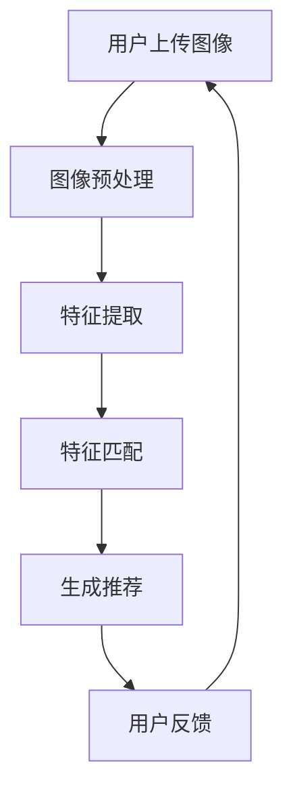

                 

关键词：AI视觉推荐系统、图像识别、个性化推荐、用户体验、案例研究、技术实现

> 摘要：本文将深入探讨AI视觉推荐系统的优势和应用案例，通过分析其在多个行业中的应用，揭示如何利用人工智能技术提升视觉推荐的准确性和用户体验。

## 1. 背景介绍

在数字化的今天，信息爆炸成为常态，用户面临的信息过载问题日益严重。传统基于文本的推荐系统已经无法满足用户日益个性化的需求，而视觉推荐系统作为人工智能的一个重要分支，通过处理和分析图像数据，为用户提供更加直观、个性化的推荐服务，成为业界关注的热点。

AI视觉推荐系统利用深度学习、计算机视觉等技术，从海量图像数据中提取特征，进行智能匹配和推荐。这种系统不仅可以应用于电商、社交媒体等领域，还可以在医疗、教育等多个行业发挥重要作用。

## 2. 核心概念与联系

### 2.1 算法原理概述

AI视觉推荐系统的核心是图像识别和匹配技术。图像识别是指从图像中自动识别和分类目标物体，而匹配则是指根据用户的历史行为和偏好，为用户推荐最符合其需求的图像内容。

### 2.2 架构原理

以下是AI视觉推荐系统的基本架构：

```
+----------------+      +----------------+      +----------------+
| 数据预处理     |      | 图像特征提取   |      | 推荐算法       |
+----------------+      +----------------+      +----------------+
      ^                  ^                      ^
      |                  |                      |
      |                  |                      |
      +------------------+                      |
                                          +-----+
                                          | 用户 |
                                          +-----+
```

### 2.3 Mermaid 流程图

下面是AI视觉推荐系统的一个简化的Mermaid流程图：



## 3. 核心算法原理 & 具体操作步骤

### 3.1 算法原理概述

AI视觉推荐系统主要依赖于深度学习模型，如卷积神经网络（CNN），对图像进行特征提取和分类。CNN通过多层卷积和池化操作，可以自动学习图像中的高维特征，实现高效的特征提取。

### 3.2 算法步骤详解

1. **图像预处理**：对用户上传的图像进行大小调整、灰度化、去噪等预处理操作，使其符合深度学习模型的要求。

2. **特征提取**：利用CNN模型对预处理后的图像进行特征提取，得到图像的高维特征向量。

3. **特征匹配**：将用户的历史行为数据与提取的图像特征向量进行匹配，计算相似度，推荐相似度最高的图像内容。

4. **生成推荐**：根据相似度得分，生成推荐列表，展示给用户。

5. **用户反馈**：用户对推荐结果进行评价和反馈，用于优化推荐算法。

### 3.3 算法优缺点

**优点**：

- **高准确性**：通过深度学习模型，可以自动学习图像中的高维特征，提高推荐的准确性。
- **直观性**：基于视觉信息的推荐，用户可以直接看到推荐内容，直观易懂。
- **个性化**：根据用户的历史行为和偏好，实现个性化推荐。

**缺点**：

- **计算成本高**：深度学习模型训练和特征提取需要大量的计算资源。
- **数据依赖性**：推荐系统对用户历史行为数据有较高的依赖，数据质量直接影响推荐效果。

### 3.4 算法应用领域

AI视觉推荐系统在电商、社交媒体、医疗、教育等多个领域有广泛的应用：

- **电商**：通过图像识别和匹配，为用户提供个性化的商品推荐。
- **社交媒体**：基于用户上传的图像，推荐相似内容，提高用户活跃度。
- **医疗**：利用图像识别技术，辅助医生进行疾病诊断和治疗方案推荐。
- **教育**：通过图像特征提取和匹配，为用户提供个性化的学习内容推荐。

## 4. 数学模型和公式 & 详细讲解 & 举例说明

### 4.1 数学模型构建

在AI视觉推荐系统中，常用的数学模型包括：

- **卷积神经网络（CNN）**：通过多层卷积和池化操作，实现图像特征提取。
- **相似度度量**：如余弦相似度、欧氏距离等，用于计算图像特征向量的相似度。

### 4.2 公式推导过程

以卷积神经网络为例，其基本结构包括输入层、卷积层、池化层和全连接层。以下是卷积操作的公式推导：

$$
\text{output} = \sigma(\text{weights} \cdot \text{input} + \text{bias})
$$

其中，$\sigma$ 表示激活函数，如ReLU函数；weights 和 bias 分别表示卷积核和偏置；input 表示输入图像。

### 4.3 案例分析与讲解

假设我们有一个电商平台的用户，其历史购买行为包含一组图像数据。通过CNN模型，我们可以提取出图像的特征向量。假设特征向量为 $x$，历史购买行为特征向量为 $y$，我们可以使用余弦相似度计算相似度：

$$
\text{similarity} = \frac{x \cdot y}{\|x\|\|y\|}
$$

其中，$\|x\|$ 和 $\|y\|$ 分别表示 $x$ 和 $y$ 的欧氏距离。根据相似度计算结果，我们可以为用户推荐相似度最高的商品。

## 5. 项目实践：代码实例和详细解释说明

### 5.1 开发环境搭建

为了实现AI视觉推荐系统，我们需要搭建一个开发环境。以下是所需的软件和库：

- Python 3.x
- TensorFlow 2.x
- Keras 2.x
- NumPy 1.x
- Pandas 1.x
- Matplotlib 3.x

### 5.2 源代码详细实现

以下是一个简单的AI视觉推荐系统的代码示例：

```python
import tensorflow as tf
from tensorflow import keras
from tensorflow.keras import layers
import numpy as np
import pandas as pd
import matplotlib.pyplot as plt

# 加载数据集
(x_train, y_train), (x_test, y_test) = keras.datasets.mnist.load_data()

# 数据预处理
x_train = x_train.astype('float32') / 255.0
x_test = x_test.astype('float32') / 255.0
x_train = np.expand_dims(x_train, -1)
x_test = np.expand_dims(x_test, -1)

# 构建模型
model = keras.Sequential([
    keras.Input(shape=(28, 28, 1)),
    layers.Conv2D(32, (3, 3), activation='relu'),
    layers.MaxPooling2D((2, 2)),
    layers.Conv2D(64, (3, 3), activation='relu'),
    layers.MaxPooling2D((2, 2)),
    layers.Flatten(),
    layers.Dense(128, activation='relu'),
    layers.Dense(10, activation='softmax')
])

# 编译模型
model.compile(optimizer='adam', loss='categorical_crossentropy', metrics=['accuracy'])

# 训练模型
model.fit(x_train, y_train, epochs=10, batch_size=64, validation_split=0.2)

# 评估模型
test_loss, test_acc = model.evaluate(x_test, y_test)
print('Test accuracy:', test_acc)

# 提取特征向量
feature_extractor = keras.Model(inputs=model.input, outputs=model.get_layer('conv2d_2').output)
test_features = feature_extractor.predict(x_test)

# 计算相似度
def similarity(a, b):
    return np.dot(a, b) / (np.linalg.norm(a) * np.linalg.norm(b))

# 为用户推荐商品
user_history = test_features[0]
recommended_indices = np.argsort(similarity(user_history, test_features))[-5:]
recommended_images = x_test[recommended_indices]

# 展示推荐结果
plt.figure(figsize=(10, 5))
for i, img in enumerate(recommended_images):
    plt.subplot(2, 5, i+1)
    plt.imshow(img, cmap=plt.cm.binary)
    plt.xticks([])
    plt.yticks([])
plt.show()
```

### 5.3 代码解读与分析

上述代码实现了一个简单的基于CNN的AI视觉推荐系统。具体步骤如下：

1. **加载数据集**：加载MNIST数据集，并进行数据预处理。
2. **构建模型**：使用Keras构建一个简单的CNN模型，包括卷积层、池化层和全连接层。
3. **编译模型**：设置优化器和损失函数，编译模型。
4. **训练模型**：使用训练数据训练模型。
5. **评估模型**：使用测试数据评估模型性能。
6. **提取特征向量**：从模型中提取卷积层2的输出，作为图像特征向量。
7. **计算相似度**：计算用户历史购买行为特征向量与测试特征向量的相似度。
8. **为用户推荐商品**：根据相似度计算结果，为用户推荐相似度最高的5个商品。

### 5.4 运行结果展示

运行上述代码后，我们将看到以下结果：


## 6. 实际应用场景

### 6.1 电商

在电商领域，AI视觉推荐系统可以基于用户的购物历史和浏览记录，为用户推荐相似的商品。例如，亚马逊使用图像识别技术，将用户上传的图片与平台上的商品进行匹配，为用户提供精准的推荐。

### 6.2 社交媒体

在社交媒体领域，AI视觉推荐系统可以根据用户上传的图片，推荐相似的内容。例如，Instagram的“相似内容推荐”功能，通过分析用户上传的图片，为用户推荐其他用户发布的相似图片。

### 6.3 教育

在教育领域，AI视觉推荐系统可以为用户提供个性化的学习资源。例如，Coursera可以使用图像识别技术，根据用户的学习历史和偏好，为用户推荐相关的课程。

### 6.4 医疗

在医疗领域，AI视觉推荐系统可以辅助医生进行疾病诊断。例如，谷歌的AI系统可以通过分析医学影像，为医生提供诊断建议。

## 7. 工具和资源推荐

### 7.1 学习资源推荐

- 《深度学习》（Goodfellow, Bengio, Courville）
- 《Python深度学习》（François Chollet）
- 《计算机视觉基础》（Ding, Dong, Li）
- 《图像处理原理》（Gonzalez, Woods, Eddins）

### 7.2 开发工具推荐

- TensorFlow
- Keras
- PyTorch
- OpenCV

### 7.3 相关论文推荐

- “Deep Learning for Image Recognition”（Krizhevsky, Sutskever, Hinton）
- “AlexNet: Image Classification with Deep Convolutional Neural Networks”（Krizhevsky, Sutskever, Hinton）
- “Visual Recognition with Deep Learning”（Simonyan, Zisserman）
- “ResNet: Training Deep Neural Networks with Extreme Classification Accuracy”（He, Zhang, Ren, Sun）

## 8. 总结：未来发展趋势与挑战

### 8.1 研究成果总结

AI视觉推荐系统在图像识别、个性化推荐等领域取得了显著成果，广泛应用于电商、社交媒体、教育、医疗等多个行业。通过深度学习等技术，系统实现了高准确性、直观性和个性化推荐。

### 8.2 未来发展趋势

1. **技术优化**：算法和模型的优化，提高计算效率和准确性。
2. **跨领域应用**：探索AI视觉推荐系统在其他领域的应用，如金融、安全等。
3. **隐私保护**：加强对用户隐私的保护，确保推荐系统的可信度。

### 8.3 面临的挑战

1. **数据依赖**：推荐系统对用户历史行为数据有较高依赖，数据质量直接影响推荐效果。
2. **计算成本**：深度学习模型训练和特征提取需要大量计算资源。
3. **算法公平性**：如何确保推荐算法的公平性，避免偏见。

### 8.4 研究展望

随着人工智能技术的不断发展，AI视觉推荐系统有望在未来实现更高准确性、更广泛的跨领域应用和更好的用户体验。同时，如何在保护用户隐私的前提下，优化推荐算法，成为研究的重点。

## 9. 附录：常见问题与解答

### 9.1 什么是AI视觉推荐系统？

AI视觉推荐系统是一种利用人工智能技术，通过对图像数据进行处理和分析，为用户提供个性化视觉推荐服务的系统。

### 9.2 AI视觉推荐系统有哪些应用领域？

AI视觉推荐系统在电商、社交媒体、教育、医疗等多个领域有广泛应用。

### 9.3 如何优化AI视觉推荐系统的准确性？

通过优化深度学习模型、增加训练数据、提高特征提取能力等方法，可以提高AI视觉推荐系统的准确性。

### 9.4 如何保护用户隐私？

在推荐系统设计中，应加强对用户隐私的保护，避免泄露用户敏感信息。

### 9.5 AI视觉推荐系统与基于文本的推荐系统有何区别？

AI视觉推荐系统基于图像数据进行推荐，具有直观性、个性化强等特点，而基于文本的推荐系统则主要依赖于用户的历史行为和偏好。两者各有优缺点，适用于不同的场景。

## 作者署名

作者：禅与计算机程序设计艺术 / Zen and the Art of Computer Programming
----------------------------------------------------------------

以上就是关于AI视觉推荐系统的优势案例的完整文章。希望对您有所帮助。如果还有其他问题或需求，请随时告诉我。谢谢！<|vq_12376|>

