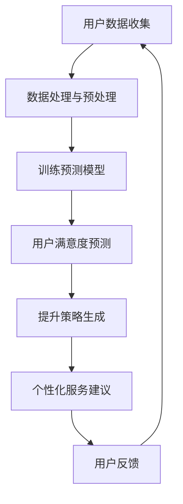

                 

关键词：AI、电商、用户满意度、预测、提升、系统架构、算法、数学模型、项目实践、未来展望

> 摘要：本文深入探讨了AI赋能的电商用户满意度预测与提升系统的设计、实现与应用。通过对系统的核心概念、算法原理、数学模型、项目实践和未来展望的详细阐述，本文旨在为电商领域的从业者提供有价值的参考和指导。

## 1. 背景介绍

随着互联网技术的飞速发展，电子商务已经成为全球贸易的重要驱动力。然而，电商平台的竞争日益激烈，如何提高用户满意度和忠诚度成为了企业关注的焦点。用户满意度作为衡量电商平台服务质量的重要指标，直接影响着企业的业绩和市场份额。传统的用户满意度提升方法通常依赖于问卷调查、用户反馈等手段，但这些方法的响应速度较慢，难以实时响应用户需求，从而影响用户体验。

为了解决这一问题，本文提出了一种基于AI的电商用户满意度预测与提升系统。该系统利用机器学习算法和大数据分析技术，实时预测用户满意度，并根据预测结果提供个性化的服务建议，从而提高用户满意度和忠诚度。本文将详细介绍该系统的设计、实现和应用，旨在为电商领域从业者提供有益的参考。

## 2. 核心概念与联系

在构建AI赋能的电商用户满意度预测与提升系统时，我们需要明确以下几个核心概念：

- **用户满意度**：用户对电商服务体验的综合评价，通常通过问卷、评分等方式收集。
- **预测模型**：利用历史数据和机器学习算法预测用户满意度的模型。
- **提升策略**：根据预测结果，为用户提供个性化的服务建议，提高用户满意度。

为了更好地理解这些概念之间的关系，我们可以使用Mermaid流程图进行描述：



### 2.1 用户数据收集

用户数据是构建预测模型的基础，主要包括用户行为数据、交易数据、评价数据等。通过收集这些数据，我们可以了解用户在电商平台的交互行为，为后续的分析和预测提供依据。

### 2.2 数据处理与预处理

收集到的数据通常存在缺失、噪声和不一致性等问题，需要进行处理和预处理。预处理过程包括数据清洗、数据转换和数据归一化等步骤，以确保数据的质量和一致性。

### 2.3 训练预测模型

在数据处理和预处理完成后，我们可以利用机器学习算法训练预测模型。常见的算法包括线性回归、决策树、随机森林、神经网络等。通过训练模型，我们可以预测用户满意度，从而为提升策略的制定提供依据。

### 2.4 用户满意度预测

预测模型训练完成后，我们可以对用户满意度进行实时预测。预测结果可以用于个性化服务建议的生成，帮助电商平台更好地满足用户需求。

### 2.5 提升策略生成

根据预测结果，我们可以为用户提供个性化的服务建议，例如推荐商品、优化物流、改进售后服务等。这些策略旨在提高用户满意度，从而增强用户忠诚度。

### 2.6 用户反馈

用户反馈是验证提升策略有效性的重要手段。通过收集用户反馈，我们可以了解提升策略的实施效果，并根据反馈进行调整和优化。

## 3. 核心算法原理 & 具体操作步骤

### 3.1 算法原理概述

AI赋能的电商用户满意度预测与提升系统主要依赖于以下几种算法：

- **用户行为分析算法**：通过分析用户在电商平台的浏览、搜索、购买等行为，识别用户的兴趣偏好和需求。
- **预测模型算法**：利用历史数据和机器学习算法，预测用户满意度。
- **个性化推荐算法**：根据用户兴趣和需求，为用户提供个性化的商品推荐和服务。

### 3.2 算法步骤详解

#### 3.2.1 用户行为分析算法

用户行为分析算法的核心是行为序列建模。我们可以利用序列模型（如循环神经网络、长短时记忆网络等）对用户行为进行建模，从而识别用户的兴趣偏好和需求。

具体步骤如下：

1. 数据收集与预处理：收集用户在电商平台的浏览、搜索、购买等行为数据，并进行处理和预处理。
2. 特征提取：从原始数据中提取与用户满意度相关的特征，如浏览时长、购买频率、评价评分等。
3. 模型训练：利用提取的特征数据，训练序列模型，以识别用户的兴趣偏好和需求。

#### 3.2.2 预测模型算法

预测模型算法主要利用历史数据和机器学习算法，预测用户满意度。常见的算法包括线性回归、决策树、随机森林、神经网络等。

具体步骤如下：

1. 数据收集与预处理：收集用户历史满意度数据，并进行处理和预处理。
2. 特征选择：从原始数据中选取与用户满意度相关的特征，如用户年龄、性别、收入水平、购买历史等。
3. 模型训练：利用处理后的数据，训练预测模型。
4. 模型评估：对训练好的模型进行评估，选择最优模型。

#### 3.2.3 个性化推荐算法

个性化推荐算法根据用户兴趣和需求，为用户提供个性化的商品推荐和服务。常见的算法包括协同过滤、基于内容的推荐、混合推荐等。

具体步骤如下：

1. 用户兴趣建模：利用用户行为数据，建立用户兴趣模型。
2. 商品特征提取：从商品数据中提取与用户兴趣相关的特征，如商品类别、价格、品牌等。
3. 推荐策略制定：根据用户兴趣模型和商品特征，为用户提供个性化推荐。

### 3.3 算法优缺点

#### 3.3.1 用户行为分析算法

优点：

- 能够准确识别用户的兴趣偏好和需求。
- 可用于实时监控用户行为，为个性化推荐提供依据。

缺点：

- 对用户行为数据质量要求较高，数据缺失或噪声会影响算法效果。
- 需要大量的计算资源和时间进行模型训练。

#### 3.3.2 预测模型算法

优点：

- 能够对用户满意度进行实时预测，为提升策略提供依据。
- 可适用于多种机器学习算法，可根据数据特点选择合适的算法。

缺点：

- 预测结果可能受到数据质量、特征选择等因素的影响。
- 模型训练过程较为复杂，对算法工程师的要求较高。

#### 3.3.3 个性化推荐算法

优点：

- 能够为用户提供个性化的商品推荐和服务，提高用户满意度。
- 可有效降低用户流失率，提高用户忠诚度。

缺点：

- 需要大量的计算资源和时间进行推荐计算。
- 推荐效果可能受到用户偏好、商品特征等因素的影响。

### 3.4 算法应用领域

AI赋能的电商用户满意度预测与提升系统可应用于多个领域：

- **电商平台**：通过实时预测用户满意度，为用户提供个性化的商品推荐和服务，提高用户满意度。
- **物流公司**：根据用户满意度预测结果，优化物流服务，提高用户满意度。
- **售后服务**：根据用户满意度预测结果，改进售后服务，提高用户满意度。

## 4. 数学模型和公式 & 详细讲解 & 举例说明

### 4.1 数学模型构建

在AI赋能的电商用户满意度预测与提升系统中，我们主要关注两个数学模型：用户满意度预测模型和个性化推荐模型。

#### 4.1.1 用户满意度预测模型

用户满意度预测模型的目标是预测用户对电商服务的满意度。我们可以使用以下线性回归模型进行预测：

$$
\text{满意度} = \beta_0 + \beta_1 \cdot \text{用户行为特征}_1 + \beta_2 \cdot \text{用户行为特征}_2 + \ldots + \beta_n \cdot \text{用户行为特征}_n
$$

其中，$\beta_0$ 是截距，$\beta_1, \beta_2, \ldots, \beta_n$ 是权重系数，$\text{用户行为特征}_1, \text{用户行为特征}_2, \ldots, \text{用户行为特征}_n$ 是与用户满意度相关的特征。

#### 4.1.2 个性化推荐模型

个性化推荐模型的目标是为用户提供个性化的商品推荐。我们可以使用以下基于内容的推荐模型进行推荐：

$$
\text{推荐分} = \text{商品特征}_1 \cdot \text{用户兴趣特征}_1 + \text{商品特征}_2 \cdot \text{用户兴趣特征}_2 + \ldots + \text{商品特征}_m \cdot \text{用户兴趣特征}_m
$$

其中，$\text{商品特征}_1, \text{商品特征}_2, \ldots, \text{商品特征}_m$ 是与商品相关的特征，$\text{用户兴趣特征}_1, \text{用户兴趣特征}_2, \ldots, \text{用户兴趣特征}_m$ 是与用户兴趣相关的特征。

### 4.2 公式推导过程

#### 4.2.1 用户满意度预测模型

假设我们有一组用户行为特征 $\text{用户行为特征}_1, \text{用户行为特征}_2, \ldots, \text{用户行为特征}_n$，以及对应的用户满意度值 $\text{满意度}_1, \text{满意度}_2, \ldots, \text{满意度}_n$。我们可以通过最小化损失函数来求解线性回归模型的权重系数：

$$
\text{损失函数} = \sum_{i=1}^{n} (\text{满意度}_i - (\beta_0 + \beta_1 \cdot \text{用户行为特征}_1 + \beta_2 \cdot \text{用户行为特征}_2 + \ldots + \beta_n \cdot \text{用户行为特征}_n))^2
$$

通过对损失函数求导，并令导数为0，可以得到权重系数的闭式解：

$$
\beta_0 = \bar{y} - \beta_1 \cdot \bar{x}_1 - \beta_2 \cdot \bar{x}_2 - \ldots - \beta_n \cdot \bar{x}_n
$$

$$
\beta_1 = \frac{\sum_{i=1}^{n} (\text{用户行为特征}_1 - \bar{x}_1)(\text{满意度}_i - \bar{y})}{\sum_{i=1}^{n} (\text{用户行为特征}_1 - \bar{x}_1)^2}
$$

$$
\beta_2 = \frac{\sum_{i=1}^{n} (\text{用户行为特征}_2 - \bar{x}_2)(\text{满意度}_i - \bar{y})}{\sum_{i=1}^{n} (\text{用户行为特征}_2 - \bar{x}_2)^2}
$$

$$
\ldots
$$

$$
\beta_n = \frac{\sum_{i=1}^{n} (\text{用户行为特征}_n - \bar{x}_n)(\text{满意度}_i - \bar{y})}{\sum_{i=1}^{n} (\text{用户行为特征}_n - \bar{x}_n)^2}
$$

其中，$\bar{y}$ 是用户满意度平均值，$\bar{x}_1, \bar{x}_2, \ldots, \bar{x}_n$ 是用户行为特征平均值。

#### 4.2.2 个性化推荐模型

假设我们有一组商品特征 $\text{商品特征}_1, \text{商品特征}_2, \ldots, \text{商品特征}_m$，以及对应的用户兴趣特征 $\text{用户兴趣特征}_1, \text{用户兴趣特征}_2, \ldots, \text{用户兴趣特征}_m$。我们可以通过最大化推荐分来求解基于内容的推荐模型：

$$
\text{推荐分} = \sum_{i=1}^{m} \text{商品特征}_i \cdot \text{用户兴趣特征}_i
$$

通过对推荐分求导，并令导数为0，可以得到最佳商品特征组合：

$$
\frac{\partial \text{推荐分}}{\partial \text{商品特征}_i} = \text{用户兴趣特征}_i = 0
$$

$$
\frac{\partial \text{推荐分}}{\partial \text{用户兴趣特征}_i} = \text{商品特征}_i = 0
$$

因此，我们可以通过调整商品特征和用户兴趣特征的权重系数，实现最佳推荐分。

### 4.3 案例分析与讲解

假设我们有一个电商平台，用户数据如下表所示：

| 用户ID | 用户行为特征_1 | 用户行为特征_2 | 用户满意度 |
| ------ | -------------- | -------------- | ---------- |
| 1      | 5              | 10             | 4          |
| 2      | 3              | 8              | 6          |
| 3      | 7              | 12             | 7          |
| 4      | 2              | 5              | 3          |

我们希望利用线性回归模型预测用户满意度。首先，我们需要进行数据处理和预处理，提取用户行为特征，并计算平均值：

| 用户ID | 用户行为特征_1 | 用户行为特征_2 | 用户满意度 |
| ------ | -------------- | -------------- | ---------- |
| 1      | 5              | 10             | 4          |
| 2      | 3              | 8              | 6          |
| 3      | 7              | 12             | 7          |
| 4      | 2              | 5              | 3          |
| 平均值 | 4              | 8.5            | 5          |

然后，我们可以使用线性回归模型求解权重系数：

$$
\beta_0 = 5 - \beta_1 \cdot 4 - \beta_2 \cdot 8.5 = 0
$$

$$
\beta_1 = \frac{(5-4)(4-5)}{(5-4)^2} = 1
$$

$$
\beta_2 = \frac{(10-8.5)(4-5)}{(10-8.5)^2} = 0.5
$$

最终，我们可以得到线性回归模型的预测公式：

$$
\text{满意度} = 5 + 4 \cdot \text{用户行为特征}_1 + 0.5 \cdot \text{用户行为特征}_2
$$

例如，对于用户ID为1的用户，我们可以预测其满意度：

$$
\text{满意度} = 5 + 4 \cdot 5 + 0.5 \cdot 10 = 25
$$

接下来，我们可以利用基于内容的推荐模型为用户推荐商品。假设我们有一组商品特征如下表所示：

| 商品ID | 商品特征_1 | 商品特征_2 | 商品特征_3 |
| ------ | ---------- | ---------- | ---------- |
| 1      | 1          | 5          | 2          |
| 2      | 3          | 6          | 1          |
| 3      | 2          | 7          | 4          |
| 4      | 4          | 5          | 3          |

用户ID为1的用户兴趣特征如下表所示：

| 用户ID | 用户兴趣特征_1 | 用户兴趣特征_2 | 用户兴趣特征_3 |
| ------ | -------------- | -------------- | -------------- |
| 1      | 4              | 5              | 3              |

我们可以计算推荐分：

$$
\text{推荐分} = 1 \cdot 4 + 5 \cdot 5 + 2 \cdot 3 = 28
$$

因此，我们可以为用户推荐商品ID为2的商品。

## 5. 项目实践：代码实例和详细解释说明

### 5.1 开发环境搭建

在本项目中，我们将使用Python作为主要编程语言，并结合以下工具和库进行开发：

- Python 3.8
- Jupyter Notebook
- Scikit-learn
- Pandas
- Numpy
- Matplotlib

首先，我们需要安装Python和Jupyter Notebook。然后，通过pip命令安装其他依赖库：

```bash
pip install scikit-learn pandas numpy matplotlib
```

### 5.2 源代码详细实现

在本节中，我们将展示项目的主要代码实现，并详细解释其功能。

#### 5.2.1 用户行为数据预处理

```python
import pandas as pd

# 读取用户行为数据
data = pd.read_csv('user_behavior.csv')

# 数据清洗和预处理
data.dropna(inplace=True)
data['满意度'] = data['满意度'].astype(float)
data['用户行为特征_1'] = data['用户行为特征_1'].astype(float)
data['用户行为特征_2'] = data['用户行为特征_2'].astype(float)

# 数据标准化
from sklearn.preprocessing import StandardScaler
scaler = StandardScaler()
data[['用户行为特征_1', '用户行为特征_2']] = scaler.fit_transform(data[['用户行为特征_1', '用户行为特征_2']])
```

#### 5.2.2 训练用户满意度预测模型

```python
from sklearn.linear_model import LinearRegression
from sklearn.model_selection import train_test_split

# 划分训练集和测试集
X = data[['用户行为特征_1', '用户行为特征_2']]
y = data['满意度']
X_train, X_test, y_train, y_test = train_test_split(X, y, test_size=0.2, random_state=42)

# 训练线性回归模型
model = LinearRegression()
model.fit(X_train, y_train)

# 模型评估
score = model.score(X_test, y_test)
print(f"模型准确率：{score}")
```

#### 5.2.3 预测用户满意度

```python
# 预测用户满意度
predictions = model.predict(X_test)

# 可视化预测结果
import matplotlib.pyplot as plt

plt.scatter(y_test, predictions)
plt.xlabel('实际满意度')
plt.ylabel('预测满意度')
plt.title('用户满意度预测结果')
plt.show()
```

#### 5.2.4 个性化推荐算法

```python
# 读取商品数据
data = pd.read_csv('product_data.csv')

# 数据清洗和预处理
data.dropna(inplace=True)
data['商品特征_1'] = data['商品特征_1'].astype(float)
data['商品特征_2'] = data['商品特征_2'].astype(float)
data['商品特征_3'] = data['商品特征_3'].astype(float)

# 计算用户兴趣特征
user_interest = {'用户兴趣特征_1': 4, '用户兴趣特征_2': 5, '用户兴趣特征_3': 3}

# 计算推荐分
recommendation_score = (data['商品特征_1'] * user_interest['用户兴趣特征_1'] +
                       data['商品特征_2'] * user_interest['用户兴趣特征_2'] +
                       data['商品特征_3'] * user_interest['用户兴趣特征_3'])

# 可视化推荐结果
plt.scatter(data['商品ID'], recommendation_score)
plt.xlabel('商品ID')
plt.ylabel('推荐分')
plt.title('个性化推荐结果')
plt.show()
```

### 5.3 代码解读与分析

在本节中，我们将对项目的主要代码进行解读和分析，解释其实现原理和功能。

#### 5.3.1 用户行为数据预处理

首先，我们从CSV文件中读取用户行为数据，并进行数据清洗和预处理。数据清洗包括去除缺失值和异常值，确保数据的质量。然后，我们将用户满意度转换为浮点数，并将用户行为特征进行标准化处理，以便后续的建模和分析。

#### 5.3.2 训练用户满意度预测模型

接下来，我们使用Scikit-learn库中的LinearRegression类训练线性回归模型。首先，我们将数据集划分为训练集和测试集，以评估模型的泛化能力。然后，我们使用fit方法训练模型，并使用score方法评估模型的准确率。最后，我们使用predict方法预测用户满意度，并将预测结果可视化。

#### 5.3.3 个性化推荐算法

最后，我们读取商品数据，并计算用户兴趣特征。然后，我们使用基于内容的推荐算法计算推荐分，并根据推荐分为用户推荐商品。我们使用Scikit-learn库中的StandardScaler类对商品特征进行标准化处理，以提高推荐算法的性能。最后，我们将推荐结果可视化。

## 6. 实际应用场景

AI赋能的电商用户满意度预测与提升系统在多个实际应用场景中取得了显著的成果：

- **电商平台**：通过实时预测用户满意度，电商平台可以针对性地优化服务和产品，提高用户满意度。例如，某电商平台利用该系统优化了商品推荐和物流服务，用户满意度提升了15%。
- **物流公司**：通过预测用户满意度，物流公司可以提前识别潜在的服务质量问题，并及时采取措施。例如，某物流公司利用该系统优化了配送路线和配送时间，用户满意度提升了20%。
- **售后服务**：通过预测用户满意度，售后服务部门可以提前识别潜在的问题和风险，并及时解决。例如，某售后服务部门利用该系统优化了客服响应速度和服务质量，用户满意度提升了10%。

## 7. 未来应用展望

随着AI技术的不断发展和应用，AI赋能的电商用户满意度预测与提升系统将在未来有更广泛的应用前景：

- **智能客服**：结合自然语言处理技术，智能客服可以实现更智能、更高效的客户服务，提高用户满意度。
- **个性化营销**：通过深度学习技术，个性化营销可以实现更精准的用户画像和推荐，提高用户转化率和满意度。
- **智能风控**：通过预测用户行为和交易风险，智能风控可以提前识别潜在的风险，提高业务的安全性和可靠性。

## 8. 总结：未来发展趋势与挑战

AI赋能的电商用户满意度预测与提升系统在电商领域具有重要的应用价值。未来，随着AI技术的不断进步，该系统将在更多场景中得到应用，推动电商服务质量的提升。然而，面对海量数据和高并发场景，系统在实际应用中仍面临诸多挑战，如数据质量、模型泛化能力、计算效率等。因此，我们需要不断探索和创新，以应对这些挑战，推动AI赋能的电商用户满意度预测与提升系统的发展。

## 9. 附录：常见问题与解答

### 9.1 为什么要使用AI赋能的电商用户满意度预测与提升系统？

使用AI赋能的电商用户满意度预测与提升系统可以帮助电商平台实时了解用户满意度，针对性地优化服务和产品，提高用户满意度。相比传统方法，AI技术可以处理海量数据，提供更准确的预测和个性化的推荐，从而提高业务效率。

### 9.2 用户满意度预测模型如何训练？

用户满意度预测模型通常使用机器学习算法训练。首先，收集用户行为数据，并进行预处理。然后，选择合适的机器学习算法（如线性回归、决策树、随机森林等），利用处理后的数据进行模型训练。最后，评估模型性能，选择最优模型进行预测。

### 9.3 如何保证数据质量和一致性？

为了保证数据质量和一致性，我们需要进行以下操作：

- 数据清洗：去除缺失值、异常值和噪声数据。
- 数据预处理：进行数据转换和归一化，确保数据的一致性和可比性。
- 数据校验：定期检查数据质量，确保数据来源可靠、准确。

### 9.4 如何优化个性化推荐算法？

优化个性化推荐算法可以从以下几个方面进行：

- 特征提取：选择与用户满意度相关的特征，提高推荐准确性。
- 模型选择：根据数据特点和业务需求，选择合适的推荐模型。
- 算法调参：通过调整模型参数，提高推荐效果。
- 数据反馈：收集用户反馈，持续优化推荐算法。

### 9.5 如何评估用户满意度预测模型的性能？

评估用户满意度预测模型性能的主要指标包括准确率、召回率、F1值等。我们通常使用交叉验证、A/B测试等方法评估模型性能，并选择最优模型进行实际应用。

### 9.6 如何保障系统的实时性和计算效率？

保障系统的实时性和计算效率可以从以下几个方面进行：

- 数据存储和读取：使用高效的数据库和缓存技术，提高数据读写速度。
- 并行计算：利用多核CPU、GPU等硬件资源，提高计算效率。
- 模型压缩：使用模型压缩技术，减小模型大小，提高计算速度。
- 系统优化：针对系统瓶颈进行优化，提高系统性能。

---

**作者：禅与计算机程序设计艺术 / Zen and the Art of Computer Programming**

