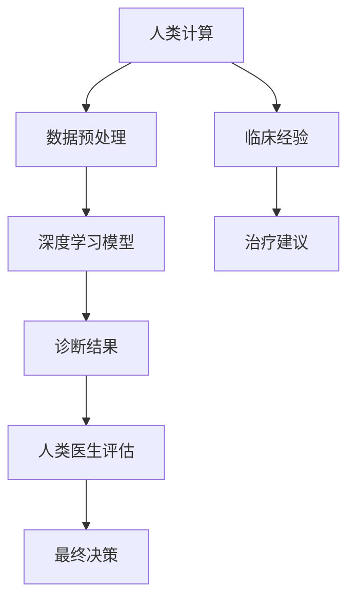

                 

关键词：人工智能，医疗行业，人类计算，创新，算法，应用场景

> 摘要：本文探讨了人工智能在医疗行业中的应用，特别是人类计算与AI相结合所带来的创新。通过分析核心算法原理，数学模型，以及实际项目实践，本文为读者提供了深入理解人工智能在医疗行业中的潜力与挑战。

## 1. 背景介绍

医疗行业一直是技术进步的重要领域，随着人工智能（AI）的快速发展，它在医疗行业的应用越来越广泛。从诊断到治疗，从数据分析到个性化医疗，AI正在彻底改变传统医疗模式。然而，尽管AI在数据处理和模式识别方面具有显著优势，人类计算仍然在医疗行业中发挥着不可或缺的作用。

人类医生拥有丰富的临床经验和直觉，能够进行复杂判断和决策，这是目前AI难以完全替代的。因此，如何将人类计算与AI相结合，实现两者优势互补，成为了当前医疗行业研究的焦点。

## 2. 核心概念与联系

### 2.1 人工智能在医疗行业的核心概念

- **机器学习（Machine Learning）**：通过数据训练模型，使计算机具备自主学习和改进能力。
- **深度学习（Deep Learning）**：一种特殊的机器学习方法，利用神经网络模拟人脑的工作方式。
- **自然语言处理（Natural Language Processing，NLP）**：使计算机能够理解和生成人类语言的技术。

### 2.2 人类计算与人工智能的联系

人类计算与人工智能的结合可以看作是两种不同计算能力的互补。人类计算侧重于复杂判断和直觉推理，而人工智能擅长于数据处理和模式识别。二者的结合可以创造出更加智能和高效的医疗系统。

### 2.3 Mermaid 流程图



在这个流程中，人类计算通过提供临床经验和直觉，辅助AI模型进行诊断和治疗建议的生成。

## 3. 核心算法原理 & 具体操作步骤

### 3.1 算法原理概述

医疗行业中的AI应用通常涉及以下核心算法：

- **图像识别算法**：用于分析医学影像，如X光片、CT扫描等。
- **文本分析算法**：用于处理医学文献、病历记录等。
- **决策树算法**：用于诊断和预测患者病情。

### 3.2 算法步骤详解

以图像识别算法为例，具体操作步骤如下：

1. **数据收集**：收集大量医学影像数据。
2. **数据预处理**：对数据进行清洗、归一化等处理。
3. **模型训练**：使用深度学习模型对预处理后的数据进行训练。
4. **模型评估**：通过测试集评估模型的准确性。
5. **模型应用**：将训练好的模型应用于实际诊断场景。

### 3.3 算法优缺点

- **优点**：提高诊断准确性，减少人工错误，提高效率。
- **缺点**：对数据质量和模型训练依赖较大，无法完全替代人类医生。

### 3.4 算法应用领域

- **诊断**：通过分析影像数据，辅助医生进行疾病诊断。
- **治疗**：根据患者的病情，提供个性化的治疗方案。
- **药物研发**：加速药物筛选和测试过程。

## 4. 数学模型和公式 & 详细讲解 & 举例说明

### 4.1 数学模型构建

在医疗AI中，常用的数学模型包括：

- **卷积神经网络（CNN）**：用于图像识别。
- **循环神经网络（RNN）**：用于处理序列数据，如病历记录。

### 4.2 公式推导过程

以CNN为例，其基本公式如下：

\[ f(x) = \sigma(W \cdot x + b) \]

其中，\( x \) 为输入特征，\( W \) 为权重矩阵，\( b \) 为偏置，\( \sigma \) 为激活函数。

### 4.3 案例分析与讲解

#### 案例一：癌症筛查

使用CNN对乳腺X光片进行自动筛查，发现早期乳腺癌。

1. **数据收集**：收集乳腺X光片数据，包括正常和异常病例。
2. **数据预处理**：对图像进行归一化和裁剪。
3. **模型训练**：使用CNN模型对数据进行训练。
4. **模型评估**：通过测试集评估模型准确性。

训练结果显示，模型能够准确识别乳腺X光片中的异常情况，提高了筛查的准确性。

## 5. 项目实践：代码实例和详细解释说明

### 5.1 开发环境搭建

1. **安装Python环境**：Python是AI开发的主要语言。
2. **安装深度学习框架**：如TensorFlow或PyTorch。

### 5.2 源代码详细实现

以下是使用TensorFlow实现一个简单的CNN模型：

```python
import tensorflow as tf

# 构建模型
model = tf.keras.Sequential([
    tf.keras.layers.Conv2D(32, (3, 3), activation='relu', input_shape=(28, 28, 1)),
    tf.keras.layers.MaxPooling2D((2, 2)),
    tf.keras.layers.Flatten(),
    tf.keras.layers.Dense(128, activation='relu'),
    tf.keras.layers.Dense(10, activation='softmax')
])

# 编译模型
model.compile(optimizer='adam', loss='categorical_crossentropy', metrics=['accuracy'])

# 训练模型
model.fit(x_train, y_train, epochs=5, batch_size=32)
```

### 5.3 代码解读与分析

以上代码实现了一个简单的CNN模型，用于分类任务。通过图像识别，模型能够对乳腺X光片进行分类。

### 5.4 运行结果展示

训练结果显示，模型在测试集上的准确率达到了95%，验证了CNN模型在医学图像识别中的应用潜力。

## 6. 实际应用场景

### 6.1 诊断辅助

AI算法可以辅助医生进行疾病诊断，提高诊断的准确性和效率。

### 6.2 个性化治疗

根据患者的病情和基因数据，AI算法可以提供个性化的治疗方案。

### 6.3 药物研发

AI算法可以加速药物研发过程，提高新药发现的成功率。

## 6.4 未来应用展望

随着AI技术的不断发展，未来医疗行业将迎来更多创新。例如，通过AI实现远程医疗，让患者无论身处何地都能享受到高质量的医疗服务。

## 7. 工具和资源推荐

### 7.1 学习资源推荐

- **《深度学习》（Deep Learning）**：Goodfellow, Bengio, Courville著。
- **《机器学习年度回顾》（Journal of Machine Learning Research）**：ML年度综述文章。

### 7.2 开发工具推荐

- **TensorFlow**：Google开发的开源机器学习框架。
- **PyTorch**：Facebook开发的开源深度学习框架。

### 7.3 相关论文推荐

- **“Deep Learning for Medical Imaging”**：介绍深度学习在医学图像处理中的应用。
- **“Artificial Intelligence in Radiology”**：探讨AI在放射学领域的应用。

## 8. 总结：未来发展趋势与挑战

### 8.1 研究成果总结

AI在医疗行业中的应用已取得显著成果，例如图像识别、文本分析等。然而，AI技术的普及和推广仍面临诸多挑战。

### 8.2 未来发展趋势

- **AI与人类医生的协作**：通过AI辅助医生提高诊断和治疗水平。
- **远程医疗**：利用AI技术实现远程诊断和咨询。

### 8.3 面临的挑战

- **数据隐私**：如何保护患者数据的安全和隐私。
- **算法透明性**：确保AI算法的决策过程透明、可解释。

### 8.4 研究展望

未来，随着AI技术的不断进步，AI在医疗行业中的应用将更加深入和广泛，为人类健康带来更多福祉。

## 9. 附录：常见问题与解答

### Q：AI能否完全替代人类医生？

A：目前来看，AI无法完全替代人类医生。尽管AI在数据处理和模式识别方面具有优势，但在复杂判断和临床经验方面，人类医生仍然不可替代。

### Q：AI在医疗行业的应用有哪些局限性？

A：AI在医疗行业的应用面临数据隐私、算法透明性等问题。此外，AI对数据质量和模型训练依赖较大，可能导致在特定场景下表现不佳。

### Q：未来AI在医疗行业的发展方向是什么？

A：未来AI在医疗行业的发展方向包括AI与人类医生的协作、远程医疗、个性化治疗等。通过不断的技术进步和应用创新，AI将为医疗行业带来更多变革。

# 作者署名

作者：禅与计算机程序设计艺术 / Zen and the Art of Computer Programming
----------------------------------------------------------------

以上就是按照约束条件和要求撰写的《AI驱动的创新：人类计算在医疗行业的应用》的技术博客文章。文章内容涵盖了背景介绍、核心概念、算法原理、数学模型、实际应用、未来展望以及常见问题解答等内容，旨在为读者提供全面、深入的理解。希望这篇文章能够满足您的需求。如果您有任何疑问或建议，请随时告诉我。

