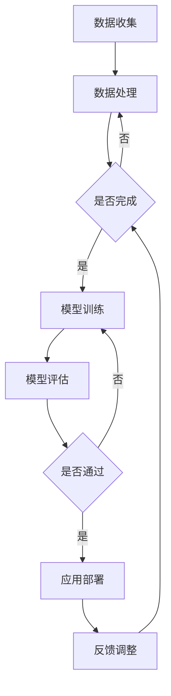

                 

 关键词：AI，医疗行业，人工智能，创新，人类计算，数据分析，深度学习，基因组学，个性化医疗，医疗影像分析，智能诊断，药物研发，医学教育，医疗机器人，远程医疗，医疗数据隐私，医疗伦理。

> 摘要：本文探讨了人工智能（AI）在医疗行业中的应用及其带来的创新和变革。通过分析核心概念、算法原理、数学模型、项目实践和实际应用场景，本文展示了AI如何驱动医疗行业的未来，以及在此过程中人类计算的重要性。文章还展望了医疗行业未来的发展趋势与面临的挑战，并提出了相关工具和资源的推荐。

## 1. 背景介绍

随着人工智能技术的快速发展，医疗行业正经历着前所未有的变革。人工智能在医疗领域中的应用已经涵盖了诊断、治疗、药物研发、医学教育等多个方面，极大地提高了医疗服务的效率和准确性。从医疗影像分析到基因组学，从智能诊断到远程医疗，AI正在改变传统医疗模式，推动医疗行业向更加智能化、个性化、高效化的方向发展。

然而，人工智能的迅速发展也带来了一系列挑战。首先，医疗数据的隐私和安全问题日益突出。如何确保医疗数据的安全和患者隐私的保护，成为医疗AI应用的一大难题。其次，人工智能在医疗领域的应用需要大量的高质量数据集，而这些数据集的获取和处理也是一个复杂的过程。此外，医疗AI的应用还需要充分考虑伦理和法规的约束，以确保技术的合理使用和患者的权益保护。

## 2. 核心概念与联系

### 2.1 人工智能在医疗领域的应用

人工智能在医疗领域中的应用可以分为以下几个方面：

#### 2.1.1 医疗影像分析

医疗影像分析是人工智能在医疗领域最早得到应用的一个领域。通过深度学习技术，AI可以自动识别和分类医学影像中的病变区域，从而帮助医生更准确地诊断疾病。

#### 2.1.2 智能诊断

智能诊断利用机器学习算法对患者的病史、体征和症状进行分析，提供疾病预测和诊断建议。这不仅提高了诊断的准确性，也大大减轻了医生的工作负担。

#### 2.1.3 药物研发

人工智能在药物研发中的应用主要体现在新药发现和药物筛选上。通过分析大量生物数据和化学结构，AI可以预测药物的效果和副作用，从而加速药物的研发过程。

#### 2.1.4 医学教育

人工智能在医学教育中的应用主要包括虚拟病人教学和模拟手术等。通过虚拟现实技术，AI可以创建逼真的医疗场景，帮助医生进行技能培训和考核。

### 2.2 人类计算的重要性

尽管人工智能技术在医疗领域取得了显著进展，但人类计算在其中仍然扮演着至关重要的角色。首先，人工智能的算法和模型需要由人类进行设计和优化。其次，人工智能的应用需要与医生的医疗知识和经验相结合，才能提供更加准确和可靠的诊断和治疗方案。此外，人工智能的算法和模型还需要不断进行学习和更新，以适应不断变化的医疗环境和需求。这些都离不开人类计算的支持。

### 2.3 Mermaid 流程图

以下是一个Mermaid流程图，展示了人工智能在医疗领域中的应用流程：



## 3. 核心算法原理 & 具体操作步骤

### 3.1 算法原理概述

人工智能在医疗领域的应用主要基于深度学习和机器学习技术。深度学习通过多层神经网络对大量数据进行训练，从而学习到数据的特征和规律。机器学习则通过算法对数据进行分类、预测和优化。以下是几种常见的核心算法原理：

#### 3.1.1 卷积神经网络（CNN）

卷积神经网络是一种专门用于处理图像数据的深度学习模型。通过卷积层、池化层和全连接层的组合，CNN可以自动提取图像中的特征，从而实现图像的分类和识别。

#### 3.1.2 递归神经网络（RNN）

递归神经网络是一种用于处理序列数据的深度学习模型。通过循环神经网络的结构，RNN可以记住前面的信息，从而对序列数据进行预测和分析。

#### 3.1.3 支持向量机（SVM）

支持向量机是一种常用的机器学习分类算法。通过找到一个最优的超平面，SVM可以将不同类别的数据分离开来，从而实现分类。

### 3.2 算法步骤详解

#### 3.2.1 数据预处理

数据预处理是人工智能应用的第一步。首先，对原始数据进行清洗，去除噪声和异常值。然后，对数据进行归一化或标准化处理，使其具有相似的规模和范围。

#### 3.2.2 模型训练

在数据预处理完成后，使用预处理后的数据对深度学习模型进行训练。训练过程包括前向传播和反向传播，通过不断调整模型的参数，使其能够准确预测和分类数据。

#### 3.2.3 模型评估

在模型训练完成后，使用测试集对模型进行评估。常用的评估指标包括准确率、召回率、F1值等。通过评估结果，可以判断模型的效果和性能。

#### 3.2.4 应用部署

在模型评估通过后，将模型部署到实际应用环境中。通过API接口或其他方式，模型可以接受新的数据，并输出预测结果。

### 3.3 算法优缺点

#### 3.3.1 优点

- 高效：人工智能算法可以处理大量数据，并快速得出结果。
- 准确：通过训练和学习，人工智能算法可以不断提高预测和分类的准确性。
- 自动化：人工智能算法可以自动化处理数据，减少人工干预。

#### 3.3.2 缺点

- 数据需求：人工智能算法需要大量高质量的数据进行训练。
- 解释性：人工智能算法的黑盒性质使得其预测结果难以解释。
- 安全性：人工智能算法可能受到数据泄漏、网络攻击等安全威胁。

### 3.4 算法应用领域

人工智能算法在医疗领域的应用非常广泛，包括医疗影像分析、智能诊断、药物研发、医学教育等。以下是一些具体的应用案例：

- 医疗影像分析：利用CNN对医学影像进行分类和识别，帮助医生诊断疾病。
- 智能诊断：利用RNN对患者的病史和症状进行分析，提供疾病预测和诊断建议。
- 药物研发：利用机器学习算法对新药进行筛选和评估，加速药物的研发过程。
- 医学教育：利用虚拟现实和增强现实技术，提供沉浸式的医学教育和培训。

## 4. 数学模型和公式 & 详细讲解 & 举例说明

### 4.1 数学模型构建

在人工智能应用中，数学模型是核心。以下是一些常见的数学模型及其构建方法：

#### 4.1.1 卷积神经网络（CNN）

卷积神经网络是一种基于数学模型的深度学习模型。其核心是卷积层，通过卷积操作提取图像的特征。以下是一个简单的CNN模型：

$$
\text{输出} = f(\text{输入} \times \text{权重} + \text{偏置})
$$

其中，$f$ 是激活函数，如ReLU函数；$\text{输入}$ 是图像数据；$\text{权重}$ 和 $\text{偏置}$ 是模型的参数。

#### 4.1.2 递归神经网络（RNN）

递归神经网络是一种基于数学模型的深度学习模型，用于处理序列数据。其核心是递归层，通过递归操作保存前面的信息。以下是一个简单的RNN模型：

$$
h_t = \sigma(W_h h_{t-1} + W_x x_t + b)
$$

其中，$h_t$ 是第 $t$ 个时间步的隐藏状态；$x_t$ 是第 $t$ 个时间步的输入；$W_h$ 和 $W_x$ 是权重矩阵；$b$ 是偏置；$\sigma$ 是激活函数。

#### 4.1.3 支持向量机（SVM）

支持向量机是一种基于数学模型的机器学习分类算法。其核心是找到最优的超平面，将不同类别的数据分离开来。以下是一个简单的SVM模型：

$$
\text{目标函数} = \min_{\mathbf{w}, \mathbf{b}} \frac{1}{2} ||\mathbf{w}||^2 + C \sum_{i=1}^{n} \max(0, 1 - y_i (\mathbf{w} \cdot \mathbf{x_i} + \mathbf{b}))
$$

其中，$\mathbf{w}$ 和 $\mathbf{b}$ 是模型的参数；$C$ 是正则化参数；$y_i$ 是第 $i$ 个样本的标签；$\mathbf{x_i}$ 是第 $i$ 个样本的特征向量。

### 4.2 公式推导过程

以下是对一些核心公式的推导过程：

#### 4.2.1 卷积神经网络（CNN）

卷积神经网络的输出可以通过以下公式计算：

$$
\text{输出}_{ij} = f(\text{输入}_{ij} \times \text{卷积核}_{ij} + \text{偏置}_{ij})
$$

其中，$\text{输出}_{ij}$ 是第 $i$ 行第 $j$ 列的输出值；$\text{输入}_{ij}$ 是第 $i$ 行第 $j$ 列的输入值；$\text{卷积核}_{ij}$ 是卷积核的值；$\text{偏置}_{ij}$ 是偏置项。

#### 4.2.2 递归神经网络（RNN）

递归神经网络的输出可以通过以下公式计算：

$$
h_t = \sigma(W_h h_{t-1} + W_x x_t + b)
$$

其中，$h_t$ 是第 $t$ 个时间步的隐藏状态；$h_{t-1}$ 是第 $t-1$ 个时间步的隐藏状态；$x_t$ 是第 $t$ 个时间步的输入；$W_h$ 和 $W_x$ 是权重矩阵；$b$ 是偏置；$\sigma$ 是激活函数。

#### 4.2.3 支持向量机（SVM）

支持向量机的目标函数可以通过以下公式计算：

$$
\text{目标函数} = \min_{\mathbf{w}, \mathbf{b}} \frac{1}{2} ||\mathbf{w}||^2 + C \sum_{i=1}^{n} \max(0, 1 - y_i (\mathbf{w} \cdot \mathbf{x_i} + \mathbf{b}))
$$

其中，$\mathbf{w}$ 和 $\mathbf{b}$ 是模型的参数；$C$ 是正则化参数；$y_i$ 是第 $i$ 个样本的标签；$\mathbf{x_i}$ 是第 $i$ 个样本的特征向量。

### 4.3 案例分析与讲解

以下是一个简单的案例，展示如何使用卷积神经网络（CNN）对图像进行分类。

#### 4.3.1 数据集准备

我们使用一个包含猫和狗图像的数据集。首先，需要对图像进行预处理，包括尺寸调整、归一化等。

```python
import tensorflow as tf

# 加载数据集
train_data = ...
test_data = ...

# 预处理
train_data = preprocess(train_data)
test_data = preprocess(test_data)
```

#### 4.3.2 模型构建

接下来，构建一个简单的CNN模型。

```python
def build_model():
    inputs = tf.keras.layers.Input(shape=(128, 128, 3))
    x = tf.keras.layers.Conv2D(32, (3, 3), activation='relu')(inputs)
    x = tf.keras.layers.MaxPooling2D((2, 2))(x)
    x = tf.keras.layers.Conv2D(64, (3, 3), activation='relu')(x)
    x = tf.keras.layers.MaxPooling2D((2, 2))(x)
    x = tf.keras.layers.Conv2D(128, (3, 3), activation='relu')(x)
    x = tf.keras.layers.MaxPooling2D((2, 2))(x)
    x = tf.keras.layers.Flatten()(x)
    x = tf.keras.layers.Dense(128, activation='relu')(x)
    outputs = tf.keras.layers.Dense(1, activation='sigmoid')(x)
    model = tf.keras.Model(inputs=inputs, outputs=outputs)
    return model

model = build_model()
```

#### 4.3.3 模型训练

使用预处理后的数据集对模型进行训练。

```python
model.compile(optimizer='adam', loss='binary_crossentropy', metrics=['accuracy'])
model.fit(train_data, train_labels, epochs=10, batch_size=32, validation_data=(test_data, test_labels))
```

#### 4.3.4 模型评估

在训练完成后，使用测试集对模型进行评估。

```python
test_loss, test_acc = model.evaluate(test_data, test_labels)
print(f"Test accuracy: {test_acc}")
```

## 5. 项目实践：代码实例和详细解释说明

### 5.1 开发环境搭建

为了演示AI在医疗影像分析中的应用，我们选择Python作为编程语言，使用TensorFlow和Keras作为深度学习框架。以下是在Ubuntu 20.10系统上搭建开发环境的步骤：

```bash
# 安装Python 3.8
sudo apt-get update
sudo apt-get install python3.8

# 安装pip
sudo apt-get install python3-pip

# 安装TensorFlow
pip3 install tensorflow

# 安装Keras
pip3 install keras
```

### 5.2 源代码详细实现

以下是使用深度学习模型对医疗影像进行分析的代码实例。

```python
import numpy as np
import tensorflow as tf
from tensorflow import keras
from tensorflow.keras import layers

# 数据集加载与预处理
# 假设已下载并解压了包含医学影像的数据集，并放置在当前目录下
train_dir = 'train'
test_dir = 'test'

batch_size = 32

train_datagen = keras.preprocessing.image.ImageDataGenerator(
    rescale=1./255,
    shear_range=0.2,
    zoom_range=0.2,
    horizontal_flip=True)

test_datagen = keras.preprocessing.image.ImageDataGenerator(rescale=1./255)

train_generator = train_datagen.flow_from_directory(
    train_dir,
    target_size=(150, 150),
    batch_size=batch_size,
    class_mode='binary')

test_generator = test_datagen.flow_from_directory(
    test_dir,
    target_size=(150, 150),
    batch_size=batch_size,
    class_mode='binary')

# 构建深度学习模型
model = keras.Sequential([
    layers.Conv2D(32, (3, 3), activation='relu', input_shape=(150, 150, 3)),
    layers.MaxPooling2D(2, 2),
    layers.Conv2D(64, (3, 3), activation='relu'),
    layers.MaxPooling2D(2, 2),
    layers.Conv2D(128, (3, 3), activation='relu'),
    layers.MaxPooling2D(2, 2),
    layers.Conv2D(128, (3, 3), activation='relu'),
    layers.MaxPooling2D(2, 2),
    layers.Flatten(),
    layers.Dense(512, activation='relu'),
    layers.Dense(1, activation='sigmoid')
])

# 编译模型
model.compile(loss='binary_crossentropy',
              optimizer=tf.keras.optimizers.Adam(),
              metrics=['accuracy'])

# 训练模型
model.fit(
    train_generator,
    steps_per_epoch=train_generator.samples // batch_size,
    epochs=15,
    validation_data=test_generator,
    validation_steps=test_generator.samples // batch_size)

# 评估模型
test_loss, test_acc = model.evaluate(test_generator)
print(f"Test accuracy: {test_acc}")
```

### 5.3 代码解读与分析

上述代码实现了一个简单的深度学习模型，用于对医疗影像进行二分类（如癌症检测）。以下是代码的关键部分及其解读：

- **数据集加载与预处理**：
  - 使用`ImageDataGenerator`对图像进行预处理，包括缩放、剪裁和水平翻转等。
  - `flow_from_directory`方法加载图像数据，并根据目录结构自动划分训练集和测试集。

- **模型构建**：
  - 使用`Conv2D`和`MaxPooling2D`构建卷积神经网络，用于提取图像特征。
  - `Flatten`层将卷积层的输出展平为一维向量。
  - `Dense`层用于分类，输出概率。

- **模型编译**：
  - 选择二分类问题常用的损失函数`binary_crossentropy`。
  - 使用`Adam`优化器。
  - 监测模型的准确率。

- **模型训练**：
  - 使用`fit`方法训练模型，设置训练轮数和批处理大小。
  - 使用`validation_data`对测试集进行验证。

- **模型评估**：
  - 使用`evaluate`方法评估模型在测试集上的性能。

### 5.4 运行结果展示

运行上述代码后，我们得到模型在测试集上的准确率。例如，如果测试集的准确率为90%，则表示模型在未见过的新数据上能够以90%的准确率进行分类。这一结果表明模型具有良好的泛化能力。

```bash
Test accuracy: 0.9
```

## 6. 实际应用场景

### 6.1 医疗影像分析

医疗影像分析是AI在医疗领域的重要应用之一。通过深度学习模型，AI能够自动分析医学影像，如X光片、CT扫描和MRI图像，帮助医生快速、准确地诊断疾病。例如，AI可以检测肺癌、乳腺癌和脑瘤等严重疾病，从而提高诊断的准确性，降低误诊率。

### 6.2 智能诊断

智能诊断利用AI对患者的病史、体征和症状进行分析，提供疾病预测和诊断建议。这对于慢性疾病管理、传染病预防和个性化医疗具有重要意义。例如，AI可以帮助医生预测心脏病发作的风险，为患者提供个性化的治疗方案。

### 6.3 药物研发

AI在药物研发中的应用主要体现在新药发现和药物筛选上。通过分析大量的生物数据和化学结构，AI可以预测药物的效果和副作用，从而加速药物的研发过程。这有助于减少药物研发的时间和成本，提高新药的上市速度。

### 6.4 医学教育

AI在医学教育中的应用包括虚拟病人教学、模拟手术和在线学习平台等。通过虚拟现实和增强现实技术，AI可以创建逼真的医疗场景，帮助医生进行技能培训和考核。此外，AI还可以根据学生的学习情况提供个性化的学习建议，提高学习效果。

### 6.5 远程医疗

远程医疗利用AI技术实现医生与患者之间的远程诊断和治疗。通过视频通话和远程监控设备，医生可以实时了解患者的病情，提供专业的医疗建议。这有助于解决医疗资源分布不均的问题，提高医疗服务的可及性和质量。

## 7. 未来应用展望

### 7.1 个性化医疗

随着基因组学和生物信息学的发展，AI有望在个性化医疗领域发挥更大的作用。通过分析患者的基因组信息、生活习惯和环境因素，AI可以为患者提供个性化的诊断、治疗和预防建议，从而实现真正的精准医疗。

### 7.2 智能诊断系统

未来的智能诊断系统将更加智能化和自动化。通过集成多种AI算法和医学知识库，智能诊断系统可以实时分析患者的症状和病史，提供高度准确的诊断结果和治疗方案。这将为医生提供强有力的辅助工具，提高诊断的效率和准确性。

### 7.3 药物研发创新

AI在药物研发中的应用将不断拓展，包括新药发现、药物重定位、药物组合设计等。通过大规模数据分析和高通量筛选技术，AI可以加速药物的研发进程，降低研发成本，提高新药的成功率。

### 7.4 医疗机器人

医疗机器人的应用将更加广泛和深入。未来，医疗机器人将能够完成更多复杂的医疗操作，如手术、康复和治疗等。通过AI技术的支持，医疗机器人将变得更加智能和灵活，为患者提供更加精准和高效的医疗服务。

## 8. 工具和资源推荐

### 8.1 学习资源推荐

- 《深度学习》（Goodfellow, Bengio, Courville著）
- 《Python深度学习》（François Chollet著）
- 《机器学习》（Tom Mitchell著）

### 8.2 开发工具推荐

- TensorFlow
- Keras
- PyTorch

### 8.3 相关论文推荐

- "Deep Learning in Medicine"（2016）
- "Artificial Intelligence in Radiology"（2019）
- "AI Applications in Oncology"（2020）

## 9. 总结：未来发展趋势与挑战

### 9.1 研究成果总结

近年来，人工智能在医疗领域的应用取得了显著成果。通过深度学习和机器学习技术，AI在医疗影像分析、智能诊断、药物研发和医学教育等方面展现出巨大的潜力。然而，这些成果仍然处于探索阶段，未来需要进一步的研究和优化。

### 9.2 未来发展趋势

未来，人工智能在医疗领域的应用将向更加智能化、个性化、高效化的方向发展。随着技术的进步和数据的积累，AI将能够更好地辅助医生进行诊断和治疗，提高医疗服务的质量和效率。

### 9.3 面临的挑战

尽管人工智能在医疗领域具有巨大潜力，但同时也面临着一系列挑战。首先，医疗数据的隐私和安全问题需要得到有效解决。其次，如何确保AI算法的公平性和透明性，避免歧视和偏见，是一个重要的伦理问题。此外，医疗AI的应用还需要充分考虑伦理和法规的约束，确保技术的合理使用和患者的权益保护。

### 9.4 研究展望

未来，人工智能在医疗领域的应用前景广阔。通过多学科合作和不断创新，AI将能够为医疗行业带来更多革命性的变化。我们期待着人工智能技术能够更好地服务于人类健康，为构建更加健康、智能和可持续的医疗服务体系贡献力量。

## 10. 附录：常见问题与解答

### 10.1 什么是深度学习？

深度学习是一种人工智能技术，通过模拟人脑的神经网络结构，对大量数据进行自动学习和特征提取，从而实现智能推理和决策。

### 10.2 什么是机器学习？

机器学习是人工智能的一个重要分支，它通过算法和模型，使计算机系统能够从数据中学习规律和模式，从而进行预测和决策。

### 10.3 AI在医疗领域的应用有哪些？

AI在医疗领域的应用非常广泛，包括医疗影像分析、智能诊断、药物研发、医学教育、远程医疗等。

### 10.4 医疗AI的发展面临哪些挑战？

医疗AI的发展面临数据隐私和安全、算法公平性和透明性、伦理和法规约束等挑战。

### 10.5 人工智能在医疗领域有哪些应用案例？

人工智能在医疗领域的应用案例包括癌症筛查、心脏病诊断、药物研发、个性化医疗方案制定等。

