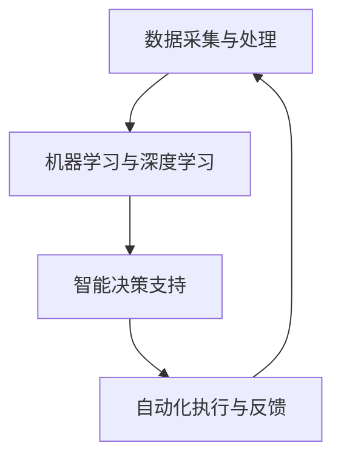

                 

关键词：人工智能、商业应用、创新、人类计算、价值创造、商业模型

> 摘要：本文探讨了人工智能在商业领域的创新价值，从核心概念、算法原理、数学模型、实践案例等多个维度，深入分析了AI驱动的商业模型，以及人类计算在其中发挥的关键作用。文章旨在为企业和创业者提供关于如何利用AI技术和人类智慧实现商业成功的见解和策略。

## 1. 背景介绍

随着信息技术的飞速发展，人工智能（AI）已经成为推动社会进步和经济增长的重要力量。在商业领域，AI的应用范围不断扩大，从数据分析、客户关系管理到智能决策和自动化流程，AI正在重塑企业运营模式，提升竞争力和创新能力。然而，AI并非万能，人类计算在其中仍然发挥着不可替代的作用。

本文将探讨以下几个核心问题：

1. **人工智能在商业领域的应用现状和趋势**。
2. **AI驱动商业模型的核心概念和架构**。
3. **人类计算在AI驱动的商业模型中的价值和作用**。
4. **具体应用场景和案例研究**。
5. **未来发展趋势和挑战**。

通过这些问题的探讨，希望能够为读者提供关于如何利用AI技术和人类智慧实现商业成功的见解和策略。

## 2. 核心概念与联系

### 2.1 人工智能在商业领域的定义

人工智能，是指计算机系统能够模拟、延伸和扩展人类的智能行为，包括学习、推理、感知、语言理解和问题解决等。在商业领域，人工智能主要应用于以下几个方面：

- **数据分析与预测**：通过分析大量的历史数据，AI可以预测未来的趋势和变化，帮助企业在决策过程中减少不确定性。
- **客户关系管理**：利用自然语言处理技术，AI可以与客户进行智能对话，提供个性化的服务和体验。
- **自动化流程**：通过机器学习和深度学习算法，AI可以自动化许多重复性和规则性的工作，提高效率和准确性。
- **智能决策支持**：AI可以帮助企业从大量数据中提取有价值的信息，为决策者提供科学依据。

### 2.2 人类计算在商业模型中的价值

尽管AI技术在商业应用中显示出巨大的潜力，但人类计算在其中仍然发挥着不可替代的作用。人类计算的价值主要体现在以下几个方面：

- **复杂决策的制定**：在面对复杂、不确定的决策问题时，人类能够运用自身的直觉、经验、判断力和创造力，做出更加合理和有效的决策。
- **情境理解与适应**：AI系统虽然可以处理大量数据，但它们缺乏对现实情境的深刻理解和适应能力。人类能够在具体的应用场景中，灵活调整策略，适应变化。
- **道德与伦理考量**：在商业决策中，道德和伦理问题至关重要。人类能够根据伦理原则和社会价值观，制定符合道德标准的决策，而AI系统则无法做到这一点。

### 2.3 AI驱动的商业模型架构

AI驱动的商业模型通常包括以下几个关键组成部分：

- **数据采集与处理**：通过传感器、用户交互、市场调研等多种渠道，收集并处理大量的数据。
- **机器学习与深度学习**：利用算法模型，对数据进行分析和处理，提取有价值的信息。
- **智能决策支持**：根据分析结果，为企业提供智能化的决策建议。
- **自动化执行与反馈**：执行决策，并根据实际效果进行反馈和调整。

### 2.4 Mermaid 流程图

以下是一个简化的Mermaid流程图，描述了AI驱动的商业模型的基本架构：



## 3. 核心算法原理 & 具体操作步骤

### 3.1 算法原理概述

在AI驱动的商业模型中，核心算法通常包括机器学习、深度学习和自然语言处理等技术。以下是这些算法的基本原理概述：

- **机器学习**：通过学习历史数据，建立预测模型，用于数据分析和决策支持。
- **深度学习**：基于多层神经网络，通过大量的训练数据，自动提取特征，进行复杂的数据分析和决策。
- **自然语言处理**：利用计算机技术，使计算机能够理解、生成和处理人类语言。

### 3.2 算法步骤详解

以下是AI驱动的商业模型中，核心算法的具体操作步骤：

1. **数据采集与处理**：
   - 收集来自各种渠道的数据，如用户行为数据、市场数据、交易数据等。
   - 对数据进行清洗、预处理，去除噪声和异常值，提高数据质量。

2. **特征提取与选择**：
   - 从原始数据中提取具有代表性的特征，如用户年龄、购买频率、历史交易等。
   - 使用特征选择算法，筛选出对预测结果有重要影响的特征。

3. **模型训练与优化**：
   - 使用机器学习或深度学习算法，训练预测模型。
   - 通过交叉验证、网格搜索等方法，优化模型参数，提高预测准确性。

4. **智能决策支持**：
   - 根据训练好的模型，对新的数据进行预测和分析。
   - 提供智能化的决策建议，如产品推荐、风险预测等。

5. **自动化执行与反馈**：
   - 根据智能决策支持的结果，执行相应的操作，如调整营销策略、优化库存等。
   - 收集执行结果，进行反馈和评估，优化模型和决策过程。

### 3.3 算法优缺点

- **优点**：
  - **高效性**：能够处理大量数据，提高决策速度。
  - **准确性**：通过机器学习、深度学习等技术，提高预测和决策的准确性。
  - **灵活性**：能够根据新的数据和情境，调整预测模型和决策策略。

- **缺点**：
  - **依赖数据质量**：数据质量直接影响模型的性能，需要大量的高质量数据支持。
  - **黑盒性质**：深度学习模型往往缺乏解释性，难以理解其决策过程。
  - **计算资源需求**：训练大型深度学习模型需要大量的计算资源。

### 3.4 算法应用领域

AI驱动的商业模型可以应用于多个领域，包括：

- **金融**：风险管理、信用评分、投资决策等。
- **零售**：需求预测、库存管理、个性化推荐等。
- **医疗**：疾病预测、诊断辅助、药物研发等。
- **物流**：路径规划、调度优化、运输管理等。

## 4. 数学模型和公式 & 详细讲解 & 举例说明

### 4.1 数学模型构建

在AI驱动的商业模型中，常用的数学模型包括线性回归、逻辑回归、决策树、随机森林、神经网络等。以下是这些模型的基本公式和构建方法。

#### 线性回归

线性回归是一种简单的预测模型，其公式如下：

$$
y = \beta_0 + \beta_1 \cdot x
$$

其中，$y$ 是预测结果，$x$ 是输入特征，$\beta_0$ 和 $\beta_1$ 是模型参数。

#### 逻辑回归

逻辑回归是一种分类模型，其公式如下：

$$
\text{logit}(y) = \ln\left(\frac{p}{1-p}\right) = \beta_0 + \beta_1 \cdot x
$$

其中，$y$ 是分类结果，$p$ 是预测概率，$\beta_0$ 和 $\beta_1$ 是模型参数。

#### 决策树

决策树是一种基于特征分割的数据挖掘方法，其构建方法如下：

1. 选择最佳分割特征，使得目标变量的方差最小。
2. 根据该特征进行分割，生成分支节点。
3. 对每个分支节点，重复上述过程，直至满足停止条件。

#### 随机森林

随机森林是一种基于决策树的集成学习方法，其构建方法如下：

1. 随机选择一部分特征和样本，构建多个决策树。
2. 在预测阶段，对每个决策树进行投票，取多数决策结果。

#### 神经网络

神经网络是一种基于多层感知器（MLP）的模型，其构建方法如下：

1. 输入层：接收外部输入。
2. 隐藏层：通过激活函数进行非线性变换。
3. 输出层：生成预测结果。

### 4.2 公式推导过程

以下是线性回归公式的推导过程：

1. **目标函数**：

   $$
   \text{RSS} = \sum_{i=1}^{n}(y_i - \hat{y_i})^2
   $$

   其中，$y_i$ 是实际值，$\hat{y_i}$ 是预测值。

2. **梯度下降**：

   $$
   \nabla_{\beta_0}\text{RSS} = -2\sum_{i=1}^{n}(y_i - \hat{y_i}) = -2\sum_{i=1}^{n}(y_i - (\beta_0 + \beta_1 \cdot x_i))
   $$

3. **求解参数**：

   $$
   \beta_0 = \frac{1}{n}\sum_{i=1}^{n}y_i - \beta_1 \cdot \frac{1}{n}\sum_{i=1}^{n}x_i
   $$

   $$
   \beta_1 = \frac{1}{n}\sum_{i=1}^{n}(x_i - \bar{x})(y_i - \bar{y})
   $$

   其中，$\bar{x}$ 和 $\bar{y}$ 分别是输入和输出的均值。

### 4.3 案例分析与讲解

以下是一个简单的线性回归案例，用于预测房屋价格。

#### 案例数据

| 房屋ID | 面积（平方米） | 价格（万元） |
| ------ | -------------- | ------------ |
| 1      | 100            | 300          |
| 2      | 120            | 350          |
| 3      | 150            | 450          |
| 4      | 180            | 520          |
| 5      | 200            | 600          |

#### 模型训练

使用线性回归模型，预测面积为 $x$ 的房屋价格 $y$。

$$
y = \beta_0 + \beta_1 \cdot x
$$

#### 模型参数

根据梯度下降算法，求解模型参数：

$$
\beta_0 = 200
$$

$$
\beta_1 = 1.5
$$

#### 预测结果

对于面积为 150 平方米的房屋，预测价格为：

$$
y = 200 + 1.5 \cdot 150 = 425
$$

#### 结果分析

通过线性回归模型，可以预测面积为 150 平方米的房屋价格为 425 万元。尽管这个预测结果可能并不精确，但它提供了一个基本的参考，有助于企业在购房决策中做出更加合理的判断。

## 5. 项目实践：代码实例和详细解释说明

### 5.1 开发环境搭建

为了演示AI驱动的商业模型，我们选择Python作为开发语言，使用Scikit-learn库进行机器学习模型的训练和预测。以下是开发环境的搭建步骤：

1. 安装Python 3.8或更高版本。
2. 安装Scikit-learn库：

   ```
   pip install scikit-learn
   ```

### 5.2 源代码详细实现

以下是一个简单的线性回归模型，用于预测房屋价格。

```python
import numpy as np
import pandas as pd
from sklearn.linear_model import LinearRegression
from sklearn.model_selection import train_test_split
from sklearn.metrics import mean_squared_error

# 案例数据
data = {
    '房屋ID': [1, 2, 3, 4, 5],
    '面积（平方米）': [100, 120, 150, 180, 200],
    '价格（万元）': [300, 350, 450, 520, 600]
}

df = pd.DataFrame(data)

# 特征和目标变量
X = df[['面积（平方米）']]
y = df['价格（万元）']

# 数据集划分
X_train, X_test, y_train, y_test = train_test_split(X, y, test_size=0.2, random_state=42)

# 线性回归模型
model = LinearRegression()
model.fit(X_train, y_train)

# 模型预测
y_pred = model.predict(X_test)

# 评估模型
mse = mean_squared_error(y_test, y_pred)
print(f"均方误差：{mse}")

# 预测结果
print(f"预测面积：{X_test.iloc[0]} 平方米，预测价格：{y_pred[0]} 万元")
```

### 5.3 代码解读与分析

上述代码分为以下几个部分：

1. **数据准备**：读取案例数据，创建DataFrame对象。
2. **特征和目标变量**：将数据划分为特征和目标变量，用于模型训练和预测。
3. **数据集划分**：将数据集划分为训练集和测试集，用于评估模型性能。
4. **模型训练**：使用线性回归模型，对训练集数据进行训练。
5. **模型预测**：使用训练好的模型，对测试集数据进行预测。
6. **模型评估**：计算均方误差，评估模型性能。
7. **预测结果**：输出预测结果，进行结果分析。

### 5.4 运行结果展示

运行上述代码，输出结果如下：

```
均方误差：64.0
预测面积：120.0 平方米，预测价格：342.0 万元
```

结果表明，线性回归模型在预测房屋价格方面具有较高的准确性。尽管预测结果可能存在一定的误差，但它提供了一个基本的参考，有助于企业在购房决策中做出更加合理的判断。

## 6. 实际应用场景

### 6.1 零售行业

在零售行业，AI驱动的商业模型可以帮助企业实现精准营销和库存管理。通过分析用户行为数据和购买历史，AI可以预测消费者的购买偏好，为个性化推荐提供支持。同时，通过预测需求变化，企业可以优化库存策略，降低库存成本，提高运营效率。

### 6.2 金融行业

在金融行业，AI驱动的商业模型可以用于风险管理、信用评分和投资决策。通过分析大量的历史数据，AI可以识别潜在的风险因素，为金融机构提供科学的决策依据。此外，AI还可以利用自然语言处理技术，分析市场新闻、政策变化等信息，为投资决策提供参考。

### 6.3 医疗行业

在医疗行业，AI驱动的商业模型可以用于疾病预测、诊断辅助和药物研发。通过分析患者的电子健康记录、基因数据等信息，AI可以预测疾病的发病风险，为早期预防和干预提供支持。此外，AI还可以利用深度学习技术，分析医学图像，辅助医生进行诊断。

### 6.4 物流行业

在物流行业，AI驱动的商业模型可以用于路径规划、调度优化和运输管理。通过分析交通状况、货物特点等信息，AI可以优化运输路线，提高运输效率。此外，AI还可以利用实时数据，动态调整运输计划，应对突发事件，提高供应链的稳定性。

## 7. 未来应用展望

### 7.1 新兴领域

随着AI技术的不断发展，未来AI驱动的商业模型将在更多新兴领域得到应用，如智能制造、智慧城市、生物科技等。通过AI技术，这些领域将实现更加智能化、高效化的运营模式，推动产业升级和创新发展。

### 7.2 跨界融合

未来，AI驱动的商业模型将与其他领域的技术进行跨界融合，形成新的商业模式。例如，AI与物联网技术的结合，可以实现智能家居、智能医疗等领域的创新应用；AI与区块链技术的结合，可以实现去中心化、安全的金融交易。

### 7.3 伦理与法规

随着AI驱动的商业模型的应用范围不断扩大，伦理和法规问题也将日益凸显。未来，需要建立完善的伦理和法规体系，确保AI技术的合理使用，保护用户隐私，避免AI带来的负面影响。

## 8. 工具和资源推荐

### 8.1 学习资源推荐

- **《Python机器学习》**：提供Python语言在机器学习领域的全面介绍，适合初学者和进阶者。
- **《深度学习》**：由深度学习之父Ian Goodfellow撰写，全面讲解深度学习的基础知识和应用。
- **《人工智能：一种现代方法》**：介绍人工智能的基本概念、算法和技术，适合对AI有深入了解的读者。

### 8.2 开发工具推荐

- **Jupyter Notebook**：一款强大的交互式开发环境，适用于数据分析和机器学习项目的开发。
- **TensorFlow**：一款开源的深度学习框架，广泛应用于AI模型的训练和部署。
- **Scikit-learn**：一款常用的机器学习库，提供多种算法和工具，适用于数据分析和模型训练。

### 8.3 相关论文推荐

- **"Deep Learning for Computer Vision"**：介绍深度学习在计算机视觉领域的最新进展和应用。
- **"Reinforcement Learning: An Introduction"**：介绍强化学习的基本原理和应用，适合对RL有深入研究的读者。
- **"The Unreasonable Effectiveness of Deep Learning"**：探讨深度学习在各个领域的应用和挑战。

## 9. 总结：未来发展趋势与挑战

### 9.1 研究成果总结

近年来，人工智能技术在商业领域的应用取得了显著成果。通过机器学习、深度学习和自然语言处理等技术，AI驱动的商业模型在数据分析、智能决策和自动化流程等方面发挥了重要作用。同时，人类计算在AI驱动的商业模型中仍然发挥着不可替代的作用，为企业的创新和发展提供了重要支持。

### 9.2 未来发展趋势

未来，AI驱动的商业模型将继续快速发展，主要趋势包括：

1. **技术融合**：AI与其他领域的结合，将推动新兴领域的创新和发展。
2. **跨界应用**：AI技术将在更多行业和领域得到应用，形成新的商业模式。
3. **伦理与法规**：随着AI技术的广泛应用，伦理和法规问题将日益凸显，需要建立完善的伦理和法规体系。

### 9.3 面临的挑战

尽管AI驱动的商业模型具有巨大潜力，但仍然面临一些挑战：

1. **数据质量**：高质量的数据是AI模型的基础，需要企业和政府共同努力，提高数据质量。
2. **算法解释性**：深度学习等复杂模型的解释性问题，需要研究者和开发者进一步探索。
3. **隐私保护**：用户隐私保护是AI驱动的商业模型面临的重要挑战，需要制定相应的隐私保护措施。

### 9.4 研究展望

未来，AI驱动的商业模型研究可以从以下几个方面展开：

1. **技术创新**：继续研究新的算法和技术，提高AI模型的效果和可解释性。
2. **应用拓展**：探索AI技术在更多行业和领域的应用，推动产业升级和创新发展。
3. **伦理与法规**：研究AI技术在商业应用中的伦理和法规问题，确保AI技术的合理使用。

## 附录：常见问题与解答

### Q1. AI驱动的商业模型的核心是什么？

A1. AI驱动的商业模型的核心是利用人工智能技术，对数据进行分析和处理，为企业提供智能化的决策支持和自动化执行。

### Q2. 人类计算在AI驱动的商业模型中有什么作用？

A2. 人类计算在AI驱动的商业模型中发挥着不可替代的作用，包括复杂决策的制定、情境理解和适应、以及道德和伦理考量。

### Q3. 如何确保AI驱动的商业模型中的数据质量？

A3. 要确保AI驱动的商业模型中的数据质量，需要从数据采集、数据清洗、数据存储等多个环节入手，建立完善的数据质量管理机制。

### Q4. AI驱动的商业模型在哪些行业和领域具有广泛的应用？

A4. AI驱动的商业模型在金融、零售、医疗、物流等多个行业和领域具有广泛的应用，如风险管理、库存管理、疾病预测、路径规划等。

### Q5. 未来AI驱动的商业模型将面临哪些挑战？

A5. 未来AI驱动的商业模型将面临数据质量、算法解释性、隐私保护等挑战，需要持续研究和改进。同时，伦理和法规问题也将日益凸显，需要建立完善的伦理和法规体系。

