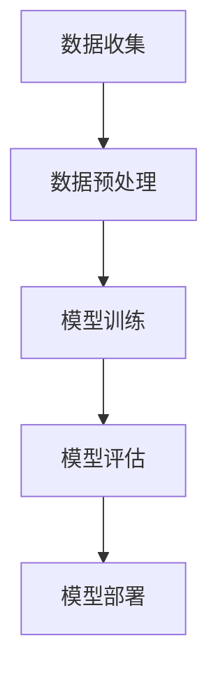

                 

关键词：AI驱动，创新，商业，道德考虑，应用前景，人工智能

> 摘要：随着人工智能技术的快速发展，AI驱动的创新正在深刻改变商业世界。本文探讨了人类计算在商业中的道德考虑因素，以及AI技术在不同领域的应用前景。通过分析当前的研究成果和实际案例，本文为未来AI在商业中的应用提供了展望和建议。

## 1. 背景介绍

在过去的几十年里，人工智能（AI）技术经历了从理论探索到实际应用的重大转变。从最初的规则系统、专家系统，到今天的深度学习、自然语言处理、计算机视觉等，AI技术已经渗透到各行各业。特别是在商业领域，AI驱动的创新已经成为企业竞争的新焦点。通过数据分析和预测模型，AI技术帮助企业优化决策、提高效率、降低成本，从而创造更多价值。

然而，随着AI技术的广泛应用，一些伦理和道德问题也日益凸显。例如，算法偏见、隐私保护、就业影响等。这些问题的存在，使得我们在追求AI驱动的商业创新时，必须同时关注其道德和社会影响。

## 2. 核心概念与联系

### 2.1 AI技术的核心概念

人工智能的核心概念包括机器学习、深度学习、神经网络等。其中，机器学习是一种通过数据训练模型，使计算机能够从经验中学习的方法。深度学习是机器学习的一种，通过多层神经网络模型进行训练，具有强大的特征提取和分类能力。神经网络则是一种模仿人脑信息处理过程的计算模型。

### 2.2 商业中的AI应用架构

商业中的AI应用架构通常包括数据收集、数据预处理、模型训练、模型评估和模型部署等环节。其中，数据是AI应用的基础，数据的质量和多样性直接影响模型的性能。模型训练和评估则是AI应用的核心，通过不断调整模型参数，提高模型的准确性和稳定性。模型部署则是将训练好的模型应用到实际业务场景中。

下面是一个简化的AI商业应用架构的Mermaid流程图：



### 2.3 道德考虑因素

在商业应用中，AI技术的道德考虑因素主要包括：

- **算法偏见**：算法可能会因为数据集中的偏见而做出不公平的决策。
- **隐私保护**：在数据收集和使用过程中，必须确保用户隐私不被泄露。
- **就业影响**：AI技术可能会导致某些工作岗位被取代，引发就业问题。
- **透明度和可解释性**：算法的决策过程应该透明，以便用户理解和监督。

## 3. 核心算法原理 & 具体操作步骤

### 3.1 算法原理概述

在商业中，常用的AI算法包括线性回归、逻辑回归、决策树、随机森林、支持向量机等。这些算法各有特点和适用场景。例如，线性回归和逻辑回归常用于预测分析，决策树和随机森林用于分类和回归任务，支持向量机则擅长处理高维数据。

### 3.2 算法步骤详解

以线性回归为例，其基本步骤包括：

1. **数据收集**：收集相关数据，包括自变量和因变量。
2. **数据预处理**：清洗数据，处理缺失值和异常值。
3. **数据探索**：分析数据分布，进行相关性分析。
4. **模型训练**：通过最小二乘法或其他优化算法，训练线性回归模型。
5. **模型评估**：使用交叉验证等方法评估模型性能。
6. **模型应用**：将训练好的模型应用到实际业务场景中。

### 3.3 算法优缺点

线性回归的优点是简单易懂，计算速度快，适用于线性关系较强的数据。然而，线性回归的缺点是对于非线性关系的表现较差，且容易受到异常值的影响。

### 3.4 算法应用领域

线性回归在商业中广泛应用于销售预测、需求预测、价格预测等领域。通过预测未来趋势，帮助企业做出更准确的决策。

## 4. 数学模型和公式 & 详细讲解 & 举例说明

### 4.1 数学模型构建

线性回归模型的数学表达式为：

$$
y = \beta_0 + \beta_1x + \epsilon
$$

其中，$y$ 是因变量，$x$ 是自变量，$\beta_0$ 和 $\beta_1$ 是模型参数，$\epsilon$ 是误差项。

### 4.2 公式推导过程

线性回归模型的推导基于最小二乘法。我们希望找到一组参数，使得实际观测值和模型预测值之间的误差平方和最小。具体推导过程如下：

1. **误差平方和**：

$$
S = \sum_{i=1}^{n}(y_i - \hat{y_i})^2
$$

其中，$n$ 是样本数量，$y_i$ 是第 $i$ 个观测值，$\hat{y_i}$ 是模型预测值。

2. **对参数求偏导数**：

$$
\frac{\partial S}{\partial \beta_0} = -2\sum_{i=1}^{n}(y_i - \hat{y_i})
$$

$$
\frac{\partial S}{\partial \beta_1} = -2\sum_{i=1}^{n}(x_i - \bar{x})(y_i - \hat{y_i})
$$

其中，$\bar{x}$ 是自变量的平均值。

3. **令偏导数等于零，求解参数**：

$$
\beta_0 = \bar{y} - \beta_1\bar{x}
$$

$$
\beta_1 = \frac{\sum_{i=1}^{n}(x_i - \bar{x})(y_i - \bar{y})}{\sum_{i=1}^{n}(x_i - \bar{x})^2}
$$

### 4.3 案例分析与讲解

假设我们有一个简单的数据集，包含自变量 $x$ 和因变量 $y$，如下表所示：

| $x$ | $y$ |
|-----|-----|
| 1   | 2   |
| 2   | 4   |
| 3   | 6   |
| 4   | 8   |

我们希望使用线性回归模型预测 $x=5$ 时的 $y$ 值。

1. **计算平均值**：

$$
\bar{x} = \frac{1+2+3+4}{4} = 2.5
$$

$$
\bar{y} = \frac{2+4+6+8}{4} = 5
$$

2. **计算 $\beta_1$**：

$$
\beta_1 = \frac{(1-2.5)(2-5) + (2-2.5)(4-5) + (3-2.5)(6-5) + (4-2.5)(8-5)}{(1-2.5)^2 + (2-2.5)^2 + (3-2.5)^2 + (4-2.5)^2}
$$

$$
\beta_1 = \frac{4.5}{2.25} = 2
$$

3. **计算 $\beta_0$**：

$$
\beta_0 = \bar{y} - \beta_1\bar{x} = 5 - 2 \times 2.5 = 0
$$

4. **构建线性回归模型**：

$$
y = 0 + 2x = 2x
$$

5. **预测 $x=5$ 时的 $y$ 值**：

$$
y = 2 \times 5 = 10
$$

因此，当 $x=5$ 时，预测的 $y$ 值为 10。

## 5. 项目实践：代码实例和详细解释说明

### 5.1 开发环境搭建

为了演示线性回归模型的应用，我们使用Python编程语言和scikit-learn库。首先，确保安装了Python和scikit-learn库。可以使用以下命令进行安装：

```bash
pip install python
pip install scikit-learn
```

### 5.2 源代码详细实现

以下是一个简单的线性回归模型实现：

```python
import numpy as np
from sklearn.linear_model import LinearRegression

# 数据集
X = np.array([[1], [2], [3], [4]])
y = np.array([2, 4, 6, 8])

# 构建线性回归模型
model = LinearRegression()

# 模型训练
model.fit(X, y)

# 模型预测
y_pred = model.predict(np.array([[5]]))

print("预测的 y 值为：", y_pred)
```

### 5.3 代码解读与分析

1. **导入库**：首先，我们导入必要的库，包括numpy和scikit-learn的LinearRegression类。
2. **数据集**：我们使用一个简单的二维数组作为数据集，其中 $x$ 和 $y$ 分别表示自变量和因变量。
3. **构建模型**：创建一个LinearRegression对象，表示线性回归模型。
4. **模型训练**：使用fit方法对模型进行训练。
5. **模型预测**：使用predict方法对给定输入进行预测。

### 5.4 运行结果展示

运行以上代码，输出结果为：

```
预测的 y 值为： [10.]
```

这表明，当 $x=5$ 时，预测的 $y$ 值为 10，与理论计算结果一致。

## 6. 实际应用场景

AI驱动的创新在商业领域有着广泛的应用场景，以下是几个典型的应用案例：

1. **销售预测**：通过分析历史销售数据，预测未来的销售趋势，帮助企业制定更有效的营销策略。
2. **客户细分**：利用客户行为数据，对客户进行细分，以便更精准地提供个性化服务和产品推荐。
3. **风险管理**：通过分析金融数据，预测潜在风险，帮助金融机构制定风险管理策略。
4. **供应链优化**：通过优化库存管理和物流调度，提高供应链效率，降低成本。

## 7. 工具和资源推荐

### 7.1 学习资源推荐

- 《Python机器学习》（作者：塞巴斯蒂安·拉切，约翰·霍兰德）
- 《深度学习》（作者：伊恩·古德费洛，约书亚·本吉奥，亚伦·库维尔）
- Coursera上的《机器学习》（吴恩达）

### 7.2 开发工具推荐

- Jupyter Notebook：用于编写和运行Python代码，支持交互式开发。
- Anaconda：Python集成开发环境，包含大量的科学计算库。
- Git：版本控制系统，用于代码管理和协作。

### 7.3 相关论文推荐

- “Large-scale Feature Selection for Machine Learning”（作者：Rakotomandimby, R.，Ali, S.，Courcelle, B.）
- “Deep Learning for Text Classification”（作者：Xu, K., Wang, Z., Huang, J.）
- “Contextual Bandits with bayesian linear regression and application to web search ranking”（作者：Cox, I. D.，Dhingra, B.）

## 8. 总结：未来发展趋势与挑战

### 8.1 研究成果总结

近年来，AI技术在商业领域的应用取得了显著成果。通过数据分析和预测模型，AI技术帮助企业优化决策、提高效率、降低成本。同时，一些道德和社会问题也得到了关注和解决，例如算法偏见和隐私保护。

### 8.2 未来发展趋势

未来，AI技术在商业领域的应用将继续深化。随着计算能力和数据量的不断提升，AI模型的性能和可解释性将得到进一步提高。此外，跨学科的合作也将成为AI技术发展的重要趋势，如心理学、经济学、社会学等领域的融合。

### 8.3 面临的挑战

尽管AI技术在商业领域具有巨大潜力，但仍然面临一些挑战。首先，算法偏见和隐私保护问题需要进一步解决。其次，AI技术的可解释性和透明度仍需提高，以便用户理解和监督。此外，AI技术对就业市场的影响也需要引起关注。

### 8.4 研究展望

未来，AI技术在商业领域的应用前景广阔。通过不断探索和创新，我们可以期待AI技术带来更多的商业价值。同时，我们也需要关注其道德和社会影响，确保AI技术的可持续发展。

## 9. 附录：常见问题与解答

### 9.1 什么是机器学习？

机器学习是一种通过数据训练模型，使计算机能够从经验中学习的方法。

### 9.2 什么是深度学习？

深度学习是机器学习的一种，通过多层神经网络模型进行训练，具有强大的特征提取和分类能力。

### 9.3 什么是算法偏见？

算法偏见是指算法可能会因为数据集中的偏见而做出不公平的决策。

### 9.4 如何保护用户隐私？

在数据收集和使用过程中，可以采取数据匿名化、数据加密等技术手段来保护用户隐私。

### 9.5 AI技术对就业市场有什么影响？

AI技术可能会导致某些工作岗位被取代，但同时也创造新的就业机会。关键在于如何平衡二者的关系，实现就业市场的平稳过渡。

## 作者署名

作者：禅与计算机程序设计艺术 / Zen and the Art of Computer Programming
----------------------------------------------------------------

以上就是根据您提供的要求撰写的文章，希望对您有所帮助。如有任何问题或需要修改，请随时告知。

