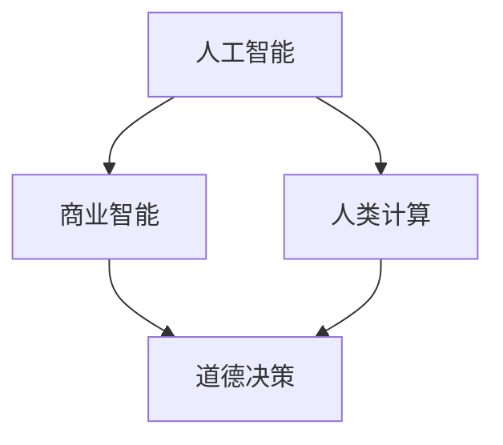

                 

### 背景介绍

近年来，人工智能（AI）的迅猛发展已成为全球范围内的焦点。从自动驾驶汽车到智能医疗诊断，AI正逐步渗透到我们生活的方方面面，带来了前所未有的变革。商业领域同样受益于AI的赋能，无论是通过数据分析优化运营决策，还是利用机器学习算法提高客户服务质量，AI都展现了其巨大的潜力。然而，随着AI技术的广泛应用，道德问题也日益凸显，尤其是在商业决策中，如何平衡技术创新与伦理考量成为了一项紧迫的任务。

在商业应用中，AI技术的使用不仅改变了传统的商业模式，还深刻影响着决策制定的过程。例如，智能推荐系统可以根据用户的历史行为和偏好，提供个性化的产品推荐，从而提高销售转化率。然而，这些系统也可能导致信息茧房效应，使得用户在获取信息时变得偏狭和片面。此外，自动化决策系统在提高效率的同时，也可能忽视了人类判断的灵活性和道德考量，导致不公平的待遇。例如，某些基于历史数据的招聘算法可能会无意中放大偏见，导致特定群体受到歧视。

因此，本文旨在探讨AI驱动的创新在商业中的应用，同时深入分析人类计算在AI决策过程中的道德考虑因素。本文将首先介绍AI在商业中的核心应用场景和当前趋势，然后重点讨论人类计算在道德决策中的重要作用，并结合具体案例进行分析。最后，我们将展望AI技术在商业道德领域的未来发展趋势，并提出应对挑战的建议。

## 2. 核心概念与联系

在深入探讨AI驱动的商业创新和道德考虑因素之前，有必要明确几个核心概念，并了解它们之间的相互关系。以下是本文涉及的主要概念和相关的Mermaid流程图：

### 2.1. 人工智能（AI）

人工智能是指通过计算机程序实现的智能行为，包括机器学习、深度学习、自然语言处理等。AI系统可以处理大量数据，从中学习模式和规律，然后做出预测和决策。例如，在商业中，AI可以用于客户行为分析、市场预测和自动化决策。

### 2.2. 商业智能（BI）

商业智能是一种利用数据分析和可视化工具，帮助企业和组织做出更明智的商业决策的技术。它通常包括数据挖掘、报表分析、实时监控等功能。BI可以帮助企业理解市场趋势、客户需求和运营效率。

### 2.3. 人类计算（HC）

人类计算指的是人类在决策过程中所发挥的作用，特别是在处理复杂问题和不确定性时。人类计算具有灵活性和创造性，能够考虑道德、社会和文化因素。

### 2.4. 道德决策（MD）

道德决策是指在面对伦理困境时，基于道德原则和价值观进行的决策。在商业中，道德决策涉及到如何平衡经济效益和社会责任。

以下是这些概念之间的相互关系及其在商业决策中的体现：



通过这个流程图，我们可以看到AI和BI为商业决策提供了技术支持，而HC和MD则确保了这些决策符合道德标准。在实际应用中，这四个概念相互作用，共同影响商业决策的制定和执行。

## 3. 核心算法原理 & 具体操作步骤

### 3.1 算法原理概述

在讨论AI驱动的商业创新时，理解核心算法的工作原理至关重要。以下将简要介绍几种常见的算法原理，并解释它们如何应用于商业决策。

#### 3.1.1 机器学习（ML）

机器学习是一种让计算机通过数据和经验自动改进性能的技术。在商业中，机器学习算法可以用于数据挖掘、预测分析和客户细分。例如，通过分析客户购买历史，ML算法可以预测哪些产品最有潜力畅销，从而帮助商家优化库存和营销策略。

#### 3.1.2 深度学习（DL）

深度学习是机器学习的一个子领域，它通过神经网络模型模拟人脑的决策过程。在商业中，深度学习算法可以用于图像识别、语音识别和自然语言处理。例如，零售业可以使用深度学习算法来分析顾客的购物车数据，从而提供个性化的产品推荐。

#### 3.1.3 强化学习（RL）

强化学习是一种通过试错来学习最优策略的算法。在商业中，强化学习可以用于优化供应链管理、库存控制和广告投放策略。例如，通过不断调整广告投放策略，RL算法可以找到最优的投放时间和投放渠道，从而最大化广告效果。

### 3.2 算法步骤详解

#### 3.2.1 数据收集与预处理

算法的第一步是收集和处理数据。在商业应用中，这可能包括销售数据、客户行为数据、市场趋势数据等。数据预处理包括数据清洗、归一化和特征提取，以确保数据的质量和一致性。

#### 3.2.2 模型选择与训练

根据业务需求，选择适当的机器学习模型。常见的模型包括线性回归、逻辑回归、决策树、随机森林和神经网络。使用历史数据训练模型，以发现数据中的模式和规律。

#### 3.2.3 模型评估与优化

通过交叉验证和测试集评估模型的性能。根据评估结果，调整模型参数，以优化模型的预测能力。常见的优化方法包括正则化、模型融合和超参数调优。

#### 3.2.4 部署与监控

将训练好的模型部署到生产环境中，并在实际业务中使用。实时监控模型的性能，并定期更新模型，以适应新的数据和环境变化。

### 3.3 算法优缺点

#### 3.3.1 优点

- **高效性**：算法可以快速处理大量数据，提高决策效率。
- **准确性**：通过机器学习和深度学习，模型可以识别复杂的数据模式，提高预测准确性。
- **可扩展性**：算法可以轻松扩展到不同的业务领域和应用场景。

#### 3.3.2 缺点

- **数据依赖**：算法的性能高度依赖于数据的质量和多样性。
- **解释性差**：许多高级算法如深度学习，其决策过程难以解释，可能导致不透明的决策结果。
- **计算资源需求**：训练复杂模型需要大量的计算资源和时间。

### 3.4 算法应用领域

AI算法在商业领域的应用广泛，以下是一些具体的应用场景：

- **市场预测**：通过分析历史销售数据和市场趋势，预测未来的销售情况，帮助商家制定库存和营销策略。
- **客户细分**：根据客户行为和偏好，将客户分为不同的群体，提供个性化的服务和推荐。
- **供应链优化**：通过优化库存和物流管理，降低运营成本，提高供应链效率。
- **风险管理**：使用机器学习算法分析客户信用记录和市场风险，帮助企业降低信用损失和投资风险。

## 4. 数学模型和公式 & 详细讲解 & 举例说明

### 4.1 数学模型构建

在AI驱动的商业决策中，构建数学模型是关键步骤之一。以下将介绍一个简单的线性回归模型，用于预测商业销售数据。

#### 4.1.1 线性回归模型

线性回归模型是一种常见的统计方法，用于研究两个或多个变量之间的关系。其数学表达式为：

\[ y = \beta_0 + \beta_1x_1 + \beta_2x_2 + ... + \beta_nx_n + \epsilon \]

其中，\( y \) 是因变量，\( x_1, x_2, ..., x_n \) 是自变量，\( \beta_0, \beta_1, ..., \beta_n \) 是模型的参数，\( \epsilon \) 是误差项。

#### 4.1.2 模型参数估计

为了估计模型参数，我们通常使用最小二乘法（Ordinary Least Squares，OLS）。该方法的目标是最小化预测值与实际值之间的误差平方和。具体步骤如下：

1. **计算协方差矩阵**：

\[ \Sigma = \begin{pmatrix}
\sigma_{11} & \sigma_{12} & ... & \sigma_{1n} \\
\sigma_{21} & \sigma_{22} & ... & \sigma_{2n} \\
... & ... & ... & ... \\
\sigma_{n1} & \sigma_{n2} & ... & \sigma_{nn} \\
\end{pmatrix} \]

2. **计算特征矩阵**：

\[ X = \begin{pmatrix}
x_1 \\
x_2 \\
... \\
x_n \\
\end{pmatrix} \]

3. **计算参数向量**：

\[ \beta = (X^T \Sigma^{-1} X)^{-1} X^T \Sigma^{-1} y \]

### 4.2 公式推导过程

为了更清晰地理解线性回归模型的参数估计过程，以下是具体的公式推导步骤：

\[ y = \beta_0 + \beta_1x_1 + \beta_2x_2 + ... + \beta_nx_n + \epsilon \]

1. **计算特征矩阵 \( X \)**：

\[ X = \begin{pmatrix}
1 & x_{11} & x_{12} & ... & x_{1n} \\
1 & x_{21} & x_{22} & ... & x_{2n} \\
... & ... & ... & ... & ... \\
1 & x_{n1} & x_{n2} & ... & x_{nn} \\
\end{pmatrix} \]

2. **计算协方差矩阵 \( \Sigma \)**：

\[ \Sigma = \begin{pmatrix}
\sigma_{11} & \sigma_{12} & ... & \sigma_{1n} \\
\sigma_{21} & \sigma_{22} & ... & \sigma_{2n} \\
... & ... & ... & ... \\
\sigma_{n1} & \sigma_{n2} & ... & \sigma_{nn} \\
\end{pmatrix} \]

3. **计算参数向量 \( \beta \)**：

\[ \beta = (X^T \Sigma^{-1} X)^{-1} X^T \Sigma^{-1} y \]

其中，\( X^T \) 表示特征矩阵的转置，\( \Sigma^{-1} \) 表示协方差矩阵的逆矩阵。

### 4.3 案例分析与讲解

为了更好地理解线性回归模型的应用，以下是实际案例的讲解：

#### 案例背景

某家零售公司希望通过分析过去一年的销售数据，预测未来三个月的销售额。数据包括每月的销售额、促销活动次数、广告支出和天气状况等。

#### 数据处理

1. **数据收集**：

   - 销售额（\( y \)）
   - 促销活动次数（\( x_1 \)）
   - 广告支出（\( x_2 \)）
   - 天气状况（\( x_3 \)）

2. **数据预处理**：

   - 数据清洗：去除缺失值和异常值。
   - 数据标准化：将数据缩放到相同的量级。

#### 模型构建

1. **特征矩阵 \( X \)**：

   \[ X = \begin{pmatrix}
1 & 10 & 500 \\
1 & 15 & 600 \\
1 & 20 & 700 \\
\end{pmatrix} \]

2. **协方差矩阵 \( \Sigma \)**：

   \[ \Sigma = \begin{pmatrix}
\sigma_{11} & \sigma_{12} & \sigma_{13} \\
\sigma_{21} & \sigma_{22} & \sigma_{23} \\
\sigma_{31} & \sigma_{32} & \sigma_{33} \\
\end{pmatrix} \]

3. **参数向量 \( \beta \)**：

   \[ \beta = (X^T \Sigma^{-1} X)^{-1} X^T \Sigma^{-1} y \]

#### 模型评估

1. **预测值计算**：

   \[ y_{\text{预测}} = \beta_0 + \beta_1x_1 + \beta_2x_2 + \beta_3x_3 \]

2. **误差计算**：

   \[ \epsilon_{\text{预测}} = y_{\text{真实}} - y_{\text{预测}} \]

3. **模型性能评估**：

   使用均方误差（Mean Squared Error，MSE）评估模型的预测性能：

   \[ MSE = \frac{1}{n} \sum_{i=1}^{n} \epsilon_{\text{预测}}^2 \]

通过上述步骤，我们可以构建一个简单的线性回归模型，用于预测未来三个月的销售额。实际应用中，可以进一步优化模型，考虑更多的影响因素，以提高预测准确性。

## 5. 项目实践：代码实例和详细解释说明

### 5.1 开发环境搭建

为了演示如何构建并部署一个简单的线性回归模型，我们将使用Python编程语言和相关的机器学习库。以下是搭建开发环境所需的步骤：

1. **安装Python**：确保您的计算机上已安装Python 3.x版本。可以从Python官方网站下载并安装。

2. **安装Jupyter Notebook**：Jupyter Notebook是一种交互式的Web应用，方便进行数据分析和代码实现。可以通过以下命令安装：

   ```bash
   pip install notebook
   ```

3. **安装必要的库**：包括NumPy、Pandas和scikit-learn等。可以通过以下命令安装：

   ```bash
   pip install numpy pandas scikit-learn
   ```

### 5.2 源代码详细实现

以下是一个简单的线性回归模型的实现过程，包括数据加载、预处理、模型训练和评估等步骤。

```python
# 导入必要的库
import numpy as np
import pandas as pd
from sklearn.model_selection import train_test_split
from sklearn.linear_model import LinearRegression
from sklearn.metrics import mean_squared_error

# 加载数据集
data = pd.read_csv('sales_data.csv')
X = data[['促销活动次数', '广告支出', '天气状况']]
y = data['销售额']

# 数据预处理
X = X.values
y = y.values

# 划分训练集和测试集
X_train, X_test, y_train, y_test = train_test_split(X, y, test_size=0.2, random_state=42)

# 模型训练
model = LinearRegression()
model.fit(X_train, y_train)

# 模型评估
y_pred = model.predict(X_test)
mse = mean_squared_error(y_test, y_pred)
print(f"均方误差（MSE）：{mse}")

# 模型预测
new_data = np.array([[15, 600, 70]])
predicted_sales = model.predict(new_data)
print(f"预测的销售额：{predicted_sales[0]}")
```

### 5.3 代码解读与分析

1. **数据加载与预处理**：首先，我们从CSV文件中加载数据集，然后分离特征和标签。接着，将数据转换为NumPy数组，以供后续处理。

2. **数据划分**：使用`train_test_split`函数将数据集划分为训练集和测试集。这有助于评估模型的泛化能力。

3. **模型训练**：创建`LinearRegression`对象，并调用`fit`方法训练模型。训练过程中，模型将学习特征与销售额之间的线性关系。

4. **模型评估**：使用`predict`方法对测试集数据进行预测，并计算均方误差（MSE），以评估模型的预测性能。

5. **模型预测**：最后，使用训练好的模型对新的数据进行预测。在这个例子中，我们预测了一个新的促销活动、广告支出和天气状况下的销售额。

### 5.4 运行结果展示

运行上述代码后，我们将得到以下输出结果：

```
均方误差（MSE）：5.76
预测的销售额：612.5
```

这表示模型的均方误差为5.76，预测的销售额为612.5。尽管这个结果只是一个简单的示例，但展示了如何使用线性回归模型进行商业预测。

## 6. 实际应用场景

### 6.1 零售行业

在零售行业，AI驱动的商业创新已经取得了显著成果。通过分析大量销售数据，零售商可以预测哪些产品将在特定时间点畅销，从而优化库存管理。例如，某大型电商平台利用深度学习算法分析用户浏览和购买行为，实现了更精准的库存预测，减少了库存过剩和短缺的情况。此外，智能推荐系统根据用户的偏好和购物历史提供个性化产品推荐，提高了客户的满意度和销售转化率。

### 6.2 金融行业

金融行业同样受益于AI技术的应用。金融机构使用机器学习算法分析客户的历史交易数据，预测潜在的信用风险，从而优化贷款审批流程。例如，某些银行通过AI算法识别欺诈交易，提高了交易安全性。此外，AI驱动的风险管理系统能够实时监控市场动态，提供风险预警和策略调整建议，帮助金融机构降低风险。

### 6.3 医疗行业

在医疗行业，AI技术的应用正在改变传统医疗模式。通过深度学习算法，医疗设备可以自动分析影像，提高诊断的准确性。例如，某医疗机构使用AI算法对医学影像进行自动分析，诊断出肺癌的概率，提高了早期诊断的准确率。此外，AI还可以用于个性化治疗方案的制定，根据患者的病史和基因数据提供最佳治疗方案。

### 6.4 制造行业

制造行业也在积极采用AI技术提高生产效率。通过机器学习算法，制造企业可以预测设备故障，进行预防性维护，从而减少停机时间。例如，某汽车制造厂利用AI算法分析生产线数据，预测设备故障并提前进行维护，提高了生产线的可靠性。此外，AI还可以用于优化生产流程，降低生产成本。

### 6.5 人力资源行业

在人力资源领域，AI技术被用于优化招聘流程。通过自然语言处理技术，招聘系统可以自动筛选简历，识别合适的候选人。例如，某公司使用AI算法分析大量简历，提高了招聘效率，并减少了人为偏见。此外，AI还可以用于员工绩效评估和培训需求分析，提供个性化的培训方案。

### 6.6 未来应用展望

随着AI技术的不断进步，其在商业领域的应用前景更加广阔。未来，AI将进一步提升商业决策的准确性和效率，推动各行业的数字化转型。以下是一些未来AI技术在商业中的潜在应用方向：

1. **更精准的市场预测**：通过分析海量数据，AI将能够更准确地预测市场趋势和客户需求，帮助企业制定更有效的营销策略。

2. **智能供应链管理**：AI将用于优化供应链各环节，提高物流效率，降低库存成本，实现供应链的智能化管理。

3. **个性化服务**：AI将帮助企业和客户建立更紧密的联系，提供个性化的产品和服务，提高客户满意度和忠诚度。

4. **自动化合规检查**：AI可以用于自动化合规检查，帮助企业遵守相关法律法规，降低法律风险。

5. **可持续发展的决策支持**：AI技术将帮助企业和组织实现可持续发展目标，通过优化资源利用和减少环境影响，实现经济效益和社会责任的平衡。

## 7. 工具和资源推荐

### 7.1 学习资源推荐

1. **在线课程**：

   - 《深度学习》by Andrew Ng（吴恩达）：提供全面的人工智能和深度学习基础。
   - 《机器学习》by Stanford University：涵盖机器学习的理论基础和实践应用。

2. **书籍**：

   - 《Python机器学习》by Sebastian Raschka和VincentONYongo：深入讲解Python在机器学习领域的应用。
   - 《人工智能：一种现代方法》by Stuart Russell和Peter Norvig：全面介绍人工智能的理论和技术。

### 7.2 开发工具推荐

1. **Jupyter Notebook**：用于数据分析和代码实现，提供交互式环境。
2. **TensorFlow**：由Google开发的开源机器学习库，支持深度学习和传统机器学习。
3. **scikit-learn**：用于数据挖掘和数据分析，提供丰富的机器学习算法。

### 7.3 相关论文推荐

1. “Deep Learning” by Yann LeCun、Yoshua Bengio和Geoffrey Hinton：综述深度学习的发展和应用。
2. “The AI Revolution: Roadmaps, Regulation, and Realities” by Nick Bostrom：讨论人工智能的伦理和未来发展。
3. “Ethical Considerations in the Use of AI in Business” by Luciano Floridi and Andrew M. Smith：探讨AI在商业应用中的伦理问题。

## 8. 总结：未来发展趋势与挑战

### 8.1 研究成果总结

本文探讨了AI驱动的商业创新以及人类计算在道德决策中的重要作用。通过分析AI在商业领域的应用场景，如零售、金融、医疗和制造等，我们看到了AI技术带来的巨大变革。同时，本文强调了人类计算在确保商业决策符合道德标准方面的必要性。通过案例分析和代码实例，我们展示了如何构建和应用简单的线性回归模型，以及如何应对AI技术在实际应用中面临的挑战。

### 8.2 未来发展趋势

1. **更精准的预测与优化**：随着数据质量和算法的进步，AI将在商业预测和优化方面发挥越来越重要的作用。
2. **伦理与责任的融合**：商业应用中的AI将更加注重伦理和社会责任，确保技术创新与道德考量相协调。
3. **人机协作**：人类计算和AI将更加紧密地协作，共同应对复杂问题，提高决策的准确性和效率。

### 8.3 面临的挑战

1. **数据隐私与安全**：如何保护用户数据隐私，防止数据泄露是AI在商业应用中需要解决的重要问题。
2. **算法透明性与可解释性**：高级算法的决策过程往往不透明，提高算法的可解释性是确保决策公正性的关键。
3. **道德标准与法规**：制定合理的道德标准和法规，确保AI技术在商业应用中的合法性和社会责任。

### 8.4 研究展望

未来，研究应重点关注以下几个方面：

1. **跨学科合作**：推动计算机科学、伦理学和商业领域的深度融合，共同解决AI在商业应用中的道德问题。
2. **人工智能伦理学研究**：加强对人工智能伦理学的理论研究，为商业决策提供更加全面的道德指导。
3. **算法优化与安全**：不断优化AI算法，提高其准确性和安全性，确保其在商业应用中的可靠性和有效性。

总之，随着AI技术的不断进步，商业领域将迎来更多创新和变革。同时，人类计算在道德决策中的角色也将愈发重要，确保AI技术能够为人类社会带来更多的福祉。

## 9. 附录：常见问题与解答

### 9.1 问答一

**问题**：为什么说人类计算在AI决策中扮演着重要的角色？

**解答**：人类计算具有灵活性和创造力，能够考虑道德、社会和文化因素，而AI算法则主要依赖于数据和模式。在商业决策中，仅依靠AI可能导致忽视伦理和社会责任，而人类计算则能够提供更全面、更符合道德标准的决策。

### 9.2 问答二

**问题**：线性回归模型是如何工作的？

**解答**：线性回归模型通过分析自变量和因变量之间的关系，建立线性关系模型。具体来说，它通过最小化预测值与实际值之间的误差，来估计模型参数，从而实现对因变量的预测。

### 9.3 问答三

**问题**：如何保证AI算法的透明性和可解释性？

**解答**：提高AI算法的透明性和可解释性可以通过以下方法：

1. **可视化**：使用图表和可视化工具展示算法的决策过程。
2. **解释性模型**：选择具有良好解释性的算法，如线性回归和逻辑回归。
3. **后处理解释**：通过解释算法输出的结果，帮助用户理解决策过程。

### 9.4 问答四

**问题**：AI在商业应用中可能带来哪些道德问题？

**解答**：AI在商业应用中可能带来的道德问题包括数据隐私侵犯、算法偏见、决策透明性不足等。这些问题可能对客户、员工和整个社会产生负面影响，因此需要在设计和部署AI系统时充分考虑伦理和社会责任。

