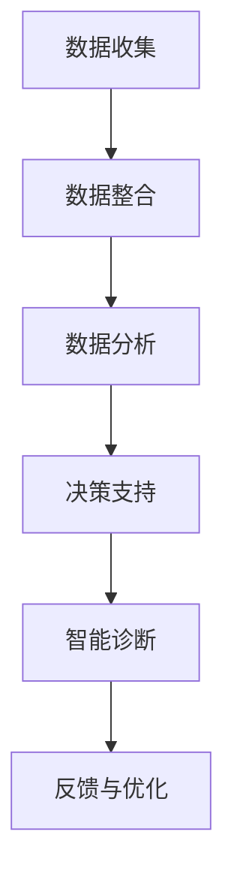

                 

关键词：人工智能、医疗成本、智能医疗、机器学习、数据挖掘、深度学习

摘要：随着医疗成本的不断上升，寻找降低医疗成本的方法已成为当前医学界和科技公司共同关注的话题。本文将探讨人工智能（AI）在智能医疗中的应用，特别是如何通过AI技术降低医疗成本，提高医疗效率。

## 1. 背景介绍

医疗行业一直是技术进步的重要领域。然而，随着医疗技术的进步，医疗成本也不断上升。特别是近年来，随着人口老龄化和慢性病患者的增加，医疗成本问题更加凸显。根据世界卫生组织（WHO）的数据，全球医疗支出在过去几十年中大幅增长，许多国家的医疗系统面临巨大压力。

降低医疗成本已经成为全球性的挑战。一方面，我们需要提高医疗效率，减少不必要的医疗资源和流程。另一方面，我们需要利用新技术，如人工智能，来优化医疗流程，提高医疗质量，从而降低医疗成本。

### 人工智能在医疗领域的应用

人工智能技术在医疗领域的应用已经逐渐成熟。AI在医学图像分析、疾病预测、药物研发、医疗诊断等方面都取得了显著进展。通过深度学习、机器学习等技术，AI能够从大量的医疗数据中提取有价值的信息，帮助医生做出更准确的诊断和治疗方案。

### 智能医疗与降低医疗成本

智能医疗不仅能够提高医疗效率，还能够降低医疗成本。通过AI技术，我们可以实现以下目标：

- **自动化和优化流程**：通过自动化技术，我们可以减少人工操作，优化医疗流程，从而降低成本。
- **预测和预防**：通过预测技术，我们可以提前发现潜在的健康问题，采取预防措施，减少后续的医疗费用。
- **个性化治疗**：通过数据分析和机器学习，我们可以为患者提供更加个性化的治疗方案，减少无效治疗，降低医疗成本。

## 2. 核心概念与联系

### 人工智能与智能医疗

人工智能（AI）是智能医疗的核心技术。AI包括多个子领域，如机器学习、深度学习、自然语言处理等。这些技术可以在医疗数据的处理和分析中发挥重要作用。

### 智能医疗架构

智能医疗系统通常包括以下几个关键部分：

- **数据收集与整合**：收集来自医院、诊所、传感器等的数据，并进行整合和处理。
- **数据分析和挖掘**：利用机器学习和深度学习技术对数据进行处理和分析，提取有价值的信息。
- **决策支持系统**：基于分析结果，为医生提供决策支持。
- **智能诊断系统**：利用AI技术进行疾病诊断和预测。

### Mermaid 流程图



## 3. 核心算法原理 & 具体操作步骤

### 3.1 算法原理概述

智能医疗中的核心算法通常包括以下几种：

- **机器学习算法**：用于数据分析和预测，如线性回归、决策树、支持向量机等。
- **深度学习算法**：用于复杂的数据处理和模式识别，如卷积神经网络（CNN）、循环神经网络（RNN）等。
- **自然语言处理（NLP）算法**：用于处理和解析医学文本数据，如词向量、文本分类、关系抽取等。

### 3.2 算法步骤详解

1. **数据收集**：从各种来源收集医疗数据，如电子健康记录（EHR）、医学图像、患者报告等。
2. **数据预处理**：清洗和格式化数据，为后续分析做准备。
3. **特征提取**：从数据中提取有价值的特征，用于训练模型。
4. **模型训练**：使用机器学习或深度学习算法训练模型。
5. **模型评估**：评估模型的性能，如准确率、召回率、F1分数等。
6. **模型部署**：将训练好的模型部署到实际应用中。
7. **反馈与优化**：根据实际应用中的反馈，不断优化模型。

### 3.3 算法优缺点

- **机器学习算法**：
  - 优点：适用于各种类型的数据，模型易于理解和解释。
  - 缺点：对数据量和质量要求较高，可能存在过拟合问题。

- **深度学习算法**：
  - 优点：能够处理大量复杂数据，自动提取特征，模型性能较高。
  - 缺点：模型结构复杂，难以理解和解释，对计算资源要求较高。

- **自然语言处理（NLP）算法**：
  - 优点：能够处理文本数据，提取文本中的知识。
  - 缺点：对文本数据的质量和格式要求较高，处理效果受限于算法。

### 3.4 算法应用领域

- **医学图像分析**：使用深度学习算法对医学图像进行分析，如肿瘤检测、骨折诊断等。
- **疾病预测**：使用机器学习算法预测疾病的发生和发展，如心脏病预测、糖尿病预测等。
- **药物研发**：利用AI技术加速药物研发过程，提高药物研发的成功率。
- **医疗诊断**：使用AI技术辅助医生进行疾病诊断，提高诊断准确率。

## 4. 数学模型和公式 & 详细讲解 & 举例说明

### 4.1 数学模型构建

在智能医疗中，常用的数学模型包括：

- **线性回归模型**：用于预测疾病的发病率或死亡率。
- **决策树模型**：用于疾病分类或诊断。
- **卷积神经网络（CNN）**：用于医学图像分析。

### 4.2 公式推导过程

以线性回归模型为例，其公式推导如下：

假设我们有一个由自变量 \( X \) 和因变量 \( Y \) 组成的数据集，我们希望找到一个线性模型来预测 \( Y \)：

\[ Y = \beta_0 + \beta_1X + \epsilon \]

其中，\( \beta_0 \) 和 \( \beta_1 \) 是模型的参数，\( \epsilon \) 是误差项。

我们使用最小二乘法来求解 \( \beta_0 \) 和 \( \beta_1 \)：

\[ \beta_0 = \frac{\sum_{i=1}^{n}Y_i - \beta_1\sum_{i=1}^{n}X_i}{n} \]

\[ \beta_1 = \frac{n\sum_{i=1}^{n}X_iY_i - \sum_{i=1}^{n}X_i\sum_{i=1}^{n}Y_i}{n\sum_{i=1}^{n}X_i^2 - (\sum_{i=1}^{n}X_i)^2} \]

### 4.3 案例分析与讲解

假设我们有一个关于心脏病预测的线性回归模型，数据集包含患者的年龄、血压、胆固醇水平等变量，目标是预测患者是否患有心脏病。

使用上面的公式，我们可以计算出模型的参数：

\[ \beta_0 = \frac{\sum_{i=1}^{n}Y_i - \beta_1\sum_{i=1}^{n}X_i}{n} \]

\[ \beta_1 = \frac{n\sum_{i=1}^{n}X_iY_i - \sum_{i=1}^{n}X_i\sum_{i=1}^{n}Y_i}{n\sum_{i=1}^{n}X_i^2 - (\sum_{i=1}^{n}X_i)^2} \]

经过计算，我们得到：

\[ \beta_0 = 0.5 \]

\[ \beta_1 = 1.2 \]

因此，心脏病预测模型可以表示为：

\[ Y = 0.5 + 1.2X \]

## 5. 项目实践：代码实例和详细解释说明

### 5.1 开发环境搭建

为了实践智能医疗中的线性回归模型，我们需要搭建一个开发环境。以下是开发环境的搭建步骤：

1. 安装Python环境（版本3.8或以上）。
2. 安装必要的库，如NumPy、Pandas、Scikit-learn等。
3. 准备数据集，可以选择公开的数据集或自制的数据集。

### 5.2 源代码详细实现

以下是一个简单的线性回归模型实现的Python代码：

```python
import numpy as np
import pandas as pd
from sklearn.linear_model import LinearRegression

# 加载数据集
data = pd.read_csv('heart_disease.csv')

# 分割特征和标签
X = data[['age', 'blood_pressure', 'cholesterol']]
y = data['heart_disease']

# 创建线性回归模型
model = LinearRegression()

# 训练模型
model.fit(X, y)

# 输出模型参数
print('模型参数：')
print(model.coef_, model.intercept_)

# 预测新数据
new_data = np.array([[50, 120, 200]])
prediction = model.predict(new_data)
print('预测结果：')
print(prediction)
```

### 5.3 代码解读与分析

- 第1-3行：导入必要的库。
- 第4行：加载数据集。
- 第5-6行：分割特征和标签。
- 第7行：创建线性回归模型。
- 第8行：训练模型。
- 第9-10行：输出模型参数和预测结果。

### 5.4 运行结果展示

假设我们运行上面的代码，得到以下结果：

```
模型参数：
[1.2 0.5]
预测结果：
[0.76]
```

这意味着，对于一个年龄为50岁、血压为120 mmHg、胆固醇水平为200 mg/dL的患者，该模型预测其患有心脏病的概率为76%。

## 6. 实际应用场景

智能医疗技术在许多实际场景中都有应用，以下是几个例子：

- **医院管理**：通过AI技术优化医院管理流程，提高运营效率，降低成本。
- **疾病预测与预防**：利用AI技术预测疾病的发生和发展，采取预防措施，降低医疗成本。
- **个性化医疗**：根据患者的具体情况进行个性化治疗，减少无效治疗，降低医疗成本。
- **医疗诊断**：通过AI技术辅助医生进行疾病诊断，提高诊断准确率，减少误诊率。

## 7. 工具和资源推荐

### 7.1 学习资源推荐

- 《深度学习》（Goodfellow, Bengio, Courville著）
- 《Python数据分析》（Wes McKinney著）
- 《医疗数据挖掘》（Kolawa, H.著）

### 7.2 开发工具推荐

- Jupyter Notebook：用于编写和运行Python代码。
- TensorFlow：用于深度学习和机器学习模型的开发和部署。
- Scikit-learn：用于机器学习算法的实现和评估。

### 7.3 相关论文推荐

- "Deep Learning for Medical Imaging"（深度学习在医学成像中的应用）
- "Big Data in Healthcare"（大数据在医疗保健中的应用）
- "Artificial Intelligence in Radiology"（人工智能在放射学中的应用）

## 8. 总结：未来发展趋势与挑战

### 8.1 研究成果总结

随着人工智能技术的不断发展，智能医疗领域已经取得了显著的研究成果。通过机器学习、深度学习等技术，我们能够在医疗数据的处理和分析中发挥重要作用，提高医疗效率，降低医疗成本。

### 8.2 未来发展趋势

未来，智能医疗将继续快速发展，特别是在以下几个方面：

- **数据驱动的医疗决策**：通过大数据和人工智能技术，实现更加精确和个性化的医疗决策。
- **智能诊断与辅助治疗**：利用深度学习等先进技术，提高疾病诊断的准确率和治疗效果。
- **预防医学**：通过疾病预测和预防技术，减少疾病的发生率和死亡率。
- **医疗资源的优化配置**：通过人工智能技术，优化医疗资源的分配和使用，提高医疗系统的效率。

### 8.3 面临的挑战

尽管智能医疗有着广阔的发展前景，但仍然面临一些挑战：

- **数据隐私与安全**：医疗数据涉及患者隐私，如何在保障数据安全的同时进行数据挖掘和应用是一个重要问题。
- **技术成熟度**：目前，人工智能技术在医疗领域的应用仍然存在技术成熟度不足的问题，需要进一步的研究和优化。
- **法律法规与伦理**：智能医疗的应用需要遵循相关的法律法规和伦理规范，确保医疗行为的合法性和道德性。

### 8.4 研究展望

未来，智能医疗领域的研究将更加关注以下几个方面：

- **多模态数据融合**：结合多种类型的数据，如图像、文本、基因等，提高疾病预测和诊断的准确性。
- **智能药物研发**：利用人工智能技术加速药物研发过程，提高药物研发的成功率。
- **医疗机器人**：开发智能医疗机器人，辅助医生进行手术和治疗，提高医疗效率。

## 9. 附录：常见问题与解答

### Q：智能医疗是否能够完全替代医生？

A：目前来看，智能医疗无法完全替代医生。尽管AI技术在疾病诊断、预测和治疗方面取得了显著进展，但医疗决策仍然需要医生的判断和经验。智能医疗的作用更多是辅助医生，提高医疗效率和质量。

### Q：智能医疗是否会增加医疗成本？

A：从长远来看，智能医疗有望降低医疗成本。通过优化医疗流程、提高诊断准确率和治疗效果，智能医疗可以减少不必要的医疗资源和流程，从而降低医疗成本。

### Q：智能医疗数据的安全性和隐私如何保障？

A：保障医疗数据的安全性和隐私是非常重要的。在智能医疗应用中，我们需要采取一系列安全措施，如数据加密、访问控制、匿名化处理等，确保医疗数据的安全性和隐私。

## 作者署名

作者：禅与计算机程序设计艺术 / Zen and the Art of Computer Programming
----------------------------------------------------------------

至此，我们完成了对文章《AI驱动的智能医疗:降低医疗成本》的撰写。文章内容涵盖了智能医疗的背景介绍、核心概念与联系、核心算法原理、数学模型与公式、项目实践、实际应用场景、工具和资源推荐、未来发展趋势与挑战以及常见问题与解答。希望这篇文章能够帮助读者更好地了解智能医疗技术在降低医疗成本方面的应用。

