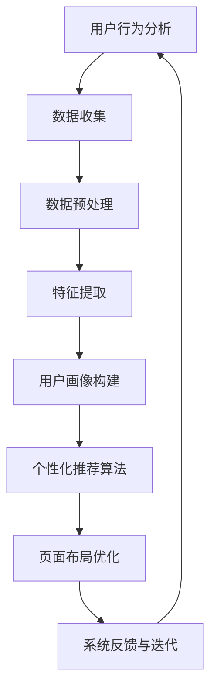

                 

关键词：电商、个性化导航、页面布局、AI、机器学习、深度学习、用户行为分析、推荐系统

## 摘要

本文旨在探讨AI技术在电商个性化导航与页面布局系统中的应用。通过深入分析用户行为数据，本文提出了一套基于机器学习与深度学习的个性化导航与页面布局算法，并详细阐述了其原理、实现步骤及其在实际电商应用中的效果。本文还从数学模型、项目实践、实际应用场景等方面进行了深入讨论，以期为电商行业的数字化转型提供有益的参考。

## 1. 背景介绍

随着互联网的普及和电子商务的快速发展，电商平台已成为现代零售业的重要组成部分。然而，面对日益激烈的市场竞争，如何提升用户体验、提高转化率成为各大电商平台亟待解决的问题。个性化导航与页面布局作为提升用户体验的关键环节，近年来受到了广泛关注。

传统的电商导航与页面布局往往采用固定的设计模式，无法满足个性化需求。而随着AI技术的不断进步，尤其是机器学习与深度学习技术的应用，为电商个性化导航与页面布局提供了新的可能。本文将介绍一种基于AI驱动的电商个性化导航与页面布局系统，通过分析用户行为数据，实现精准的用户画像与个性化推荐，从而提升用户满意度和转化率。

### 1.1 个性化导航与页面布局的重要性

个性化导航与页面布局在电商应用中具有重要意义。一方面，个性化的导航可以引导用户快速找到所需商品，提高用户体验。另一方面，个性化的页面布局可以突出重点商品，吸引用户注意力，提升转化率。

### 1.2 电商行业现状及挑战

当前，电商行业竞争激烈，用户获取成本不断增加。各大电商平台纷纷通过优化用户体验来提升用户留存率和转化率。然而，传统的导航与页面布局设计模式已经难以满足个性化需求，用户流失率较高。因此，如何利用AI技术实现个性化导航与页面布局成为电商行业亟待解决的问题。

### 1.3 AI在电商个性化导航与页面布局中的应用

AI技术在电商个性化导航与页面布局中具有广泛的应用前景。通过机器学习与深度学习算法，可以分析用户行为数据，构建用户画像，实现个性化推荐。同时，AI技术还可以优化页面布局，提高用户转化率。本文将详细探讨AI技术在电商个性化导航与页面布局中的应用，以及其实现原理和具体操作步骤。

## 2. 核心概念与联系

为了深入理解AI驱动的电商个性化导航与页面布局系统，我们首先需要了解一些核心概念，包括用户行为分析、个性化推荐系统、机器学习与深度学习等。以下是这些概念之间的联系以及其Mermaid流程图表示：



### 2.1 用户行为分析

用户行为分析是电商个性化导航与页面布局的基础。通过对用户在电商平台的浏览、购买、搜索等行为进行数据收集、预处理和特征提取，可以构建出用户的个性化画像，为后续的个性化推荐和页面布局提供依据。

### 2.2 个性化推荐算法

个性化推荐算法是核心组成部分，通过机器学习与深度学习算法，根据用户画像和商品特征，为用户推荐个性化的商品和页面布局。常见的推荐算法包括基于协同过滤、基于内容、基于模型的推荐等。

### 2.3 机器学习与深度学习

机器学习与深度学习是AI技术的核心，通过训练大量的数据，构建出能够自动学习用户行为的模型。这些模型可以用于用户画像构建、个性化推荐、页面布局优化等任务。

### 2.4 页面布局优化

页面布局优化是基于用户行为分析和个性化推荐的结果，对电商平台的页面进行优化。通过调整商品的展示顺序、布局位置等，提高用户的购买意愿和转化率。

## 3. 核心算法原理 & 具体操作步骤

### 3.1 算法原理概述

本节将介绍AI驱动的电商个性化导航与页面布局系统的核心算法原理。该系统主要基于以下几个步骤：

1. **用户行为数据收集**：通过网站日志、点击流数据等方式，收集用户在电商平台上的行为数据。
2. **数据预处理**：对收集到的数据进行分析，去除噪声数据，并进行数据清洗和归一化处理。
3. **特征提取**：通过文本挖掘、用户行为建模等方法，提取出反映用户个性化特征的信息。
4. **用户画像构建**：利用机器学习算法，将提取的特征转化为用户画像，用于后续的个性化推荐和页面布局优化。
5. **个性化推荐算法**：根据用户画像和商品特征，利用深度学习算法进行个性化推荐，生成个性化的商品列表和页面布局。
6. **页面布局优化**：根据用户行为数据，对页面布局进行调整，优化用户体验。

### 3.2 算法步骤详解

#### 3.2.1 用户行为数据收集

用户行为数据的收集是构建个性化导航与页面布局系统的第一步。以下是数据收集的具体步骤：

1. **日志数据收集**：通过网站服务器日志，记录用户在电商平台的浏览、搜索、购买等行为。
2. **点击流数据收集**：利用浏览器插件或用户行为追踪技术，收集用户的点击行为数据。
3. **传感器数据收集**：通过智能手机或其他设备，收集用户的地理位置、设备信息等数据。

#### 3.2.2 数据预处理

数据预处理是确保算法性能的重要环节。以下是数据预处理的具体步骤：

1. **数据清洗**：去除重复数据、噪声数据和异常值，确保数据质量。
2. **数据归一化**：将不同特征的数据进行归一化处理，使其具有相同的尺度。
3. **特征选择**：通过特征选择算法，选择对用户个性化特征贡献较大的特征。

#### 3.2.3 特征提取

特征提取是构建用户画像的关键步骤。以下是特征提取的具体方法：

1. **文本挖掘**：通过自然语言处理技术，提取用户在搜索、评论等行为中的关键词和主题。
2. **用户行为建模**：通过时间序列分析、关联规则挖掘等方法，提取用户的行为模式。
3. **商品特征提取**：通过商品属性、用户评价等信息，提取商品的特征。

#### 3.2.4 用户画像构建

用户画像构建是将提取的特征转化为用户个性化特征的过程。以下是用户画像构建的具体方法：

1. **特征转换**：将提取的特征进行维度转换，将其映射到高维空间。
2. **聚类分析**：利用聚类算法，将用户划分为不同的群体，每个群体代表一种用户画像。
3. **用户画像表示**：利用向量空间模型，将用户画像表示为高维向量。

#### 3.2.5 个性化推荐算法

个性化推荐算法是基于用户画像和商品特征，为用户推荐个性化商品的过程。以下是常用的推荐算法：

1. **基于协同过滤的推荐**：通过计算用户之间的相似度，为用户推荐与其相似用户喜欢的商品。
2. **基于内容的推荐**：通过计算用户和商品之间的特征相似度，为用户推荐与其兴趣相关的商品。
3. **基于模型的推荐**：利用机器学习算法，构建用户和商品之间的预测模型，为用户推荐可能喜欢的商品。

#### 3.2.6 页面布局优化

页面布局优化是根据用户行为数据和个性化推荐结果，对页面进行优化，以提高用户体验。以下是页面布局优化的具体方法：

1. **A/B测试**：通过对比不同页面布局的效果，确定最优的页面布局方案。
2. **用户行为预测**：利用用户行为数据，预测用户在页面上的行为路径，为页面布局提供依据。
3. **动态页面调整**：根据用户行为数据，动态调整页面布局，以吸引用户注意力，提高转化率。

### 3.3 算法优缺点

#### 3.3.1 优点

1. **个性化推荐**：基于用户行为数据，为用户提供个性化的商品推荐，提高用户满意度。
2. **页面布局优化**：根据用户行为预测，动态调整页面布局，提高用户转化率。
3. **实时更新**：利用实时数据，快速调整页面布局和推荐结果，以适应不断变化的市场需求。

#### 3.3.2 缺点

1. **数据依赖性**：算法效果受数据质量和数据量的影响较大，需要大量高质量的用户行为数据。
2. **计算成本**：机器学习算法和深度学习算法的计算成本较高，需要配置高性能的计算资源。
3. **隐私问题**：用户行为数据的收集和处理涉及用户隐私，需要遵守相关法律法规。

### 3.4 算法应用领域

AI驱动的电商个性化导航与页面布局系统可以应用于以下领域：

1. **电商平台**：通过个性化导航和页面布局，提高用户体验和转化率。
2. **O2O平台**：通过个性化推荐，吸引用户线下消费。
3. **内容平台**：通过个性化推荐，提高用户粘性和活跃度。
4. **智能设备**：通过个性化导航和页面布局，提高智能设备的用户体验。

## 4. 数学模型和公式 & 详细讲解 & 举例说明

### 4.1 数学模型构建

在AI驱动的电商个性化导航与页面布局系统中，数学模型是核心部分。以下是构建数学模型的基本步骤：

1. **用户行为数据表示**：用户行为数据可以表示为矩阵形式，其中行表示用户，列表示行为事件。例如，一个用户在浏览商品时的行为数据可以表示为一个向量。
   
   $$ X = \begin{bmatrix} 
   x_{11} & x_{12} & \cdots & x_{1n} \\
   x_{21} & x_{22} & \cdots & x_{2n} \\
   \vdots & \vdots & \ddots & \vdots \\
   x_{m1} & x_{m2} & \cdots & x_{mn}
   \end{bmatrix} $$

   其中，$x_{ij}$ 表示用户 $u_i$ 在行为事件 $e_j$ 上的表现。

2. **商品特征表示**：商品特征可以表示为向量形式，例如，一个商品的价格、评分、销量等特征。

   $$ Y = \begin{bmatrix} 
   y_{11} & y_{12} & \cdots & y_{1n} \\
   y_{21} & y_{22} & \cdots & y_{2n} \\
   \vdots & \vdots & \ddots & \vdots \\
   y_{p1} & y_{p2} & \cdots & y_{pn}
   \end{bmatrix} $$

   其中，$y_{ij}$ 表示商品 $g_i$ 在特征 $f_j$ 上的值。

### 4.2 公式推导过程

为了构建用户个性化推荐模型，我们需要推导以下几个关键公式：

1. **用户相似度计算**：

   $$ \text{similarity}(u_i, u_j) = \frac{X_{ui} \cdot X_{uj}}{\|X_{ui}\| \|X_{uj}\|} $$

   其中，$\text{similarity}(u_i, u_j)$ 表示用户 $u_i$ 和 $u_j$ 之间的相似度，$X_{ui}$ 和 $X_{uj}$ 分别表示用户 $u_i$ 和 $u_j$ 的行为数据向量，$\|X_{ui}\|$ 和 $\|X_{uj}\|$ 分别表示用户 $u_i$ 和 $u_j$ 的行为数据向量的欧几里得范数。

2. **商品推荐计算**：

   $$ \text{recommend}(u_i, g_j) = Y_{gj} \cdot \text{similarity}(u_i, u_j) $$

   其中，$\text{recommend}(u_i, g_j)$ 表示用户 $u_i$ 推荐商品 $g_j$ 的得分，$Y_{gj}$ 表示商品 $g_j$ 的特征向量。

### 4.3 案例分析与讲解

#### 案例一：用户相似度计算

假设我们有两个用户 $u_1$ 和 $u_2$，他们的行为数据矩阵如下：

$$ X = \begin{bmatrix} 
1 & 0 & 1 \\
0 & 1 & 0
\end{bmatrix} $$

首先，我们计算用户 $u_1$ 和 $u_2$ 的行为数据向量的欧几里得范数：

$$ \|X_{u1}\| = \sqrt{1^2 + 0^2 + 1^2} = \sqrt{2} $$
$$ \|X_{u2}\| = \sqrt{0^2 + 1^2 + 0^2} = 1 $$

然后，我们计算用户 $u_1$ 和 $u_2$ 之间的相似度：

$$ \text{similarity}(u_1, u_2) = \frac{X_{u1} \cdot X_{u2}}{\|X_{u1}\| \|X_{u2}\|} = \frac{1 \cdot 0 + 0 \cdot 1 + 1 \cdot 0}{\sqrt{2} \cdot 1} = 0 $$

从这个例子中可以看出，用户 $u_1$ 和 $u_2$ 之间的相似度为 0，这意味着他们的行为数据没有重叠。

#### 案例二：商品推荐计算

假设用户 $u_1$ 推荐商品 $g_1$ 的特征向量为：

$$ Y = \begin{bmatrix} 
2 \\
3
\end{bmatrix} $$

根据用户 $u_1$ 和用户 $u_2$ 之间的相似度（假设为 0.8），我们可以计算用户 $u_1$ 推荐商品 $g_1$ 的得分：

$$ \text{recommend}(u_1, g_1) = Y_{g1} \cdot \text{similarity}(u_1, u_2) = \begin{bmatrix} 
2 \\
3
\end{bmatrix} \cdot 0.8 = 2.4 $$

从这个例子中可以看出，用户 $u_1$ 推荐商品 $g_1$ 的得分为 2.4，这意味着用户 $u_1$ 可能会对商品 $g_1$ 感兴趣。

## 5. 项目实践：代码实例和详细解释说明

在本节中，我们将通过一个具体的电商个性化导航与页面布局项目实例，展示如何利用AI技术实现个性化导航与页面布局。以下是一个基于Python和TensorFlow的代码实例，包括开发环境搭建、源代码详细实现、代码解读与分析以及运行结果展示。

### 5.1 开发环境搭建

在开始项目之前，我们需要搭建开发环境。以下是所需的软件和库：

- Python 3.x
- TensorFlow 2.x
- Scikit-learn
- Pandas
- Numpy

安装这些库的方法如下：

```bash
pip install python
pip install tensorflow
pip install scikit-learn
pip install pandas
pip install numpy
```

### 5.2 源代码详细实现

以下是项目的源代码实现：

```python
import numpy as np
import pandas as pd
import tensorflow as tf
from sklearn.model_selection import train_test_split
from sklearn.preprocessing import StandardScaler
from tensorflow.keras.models import Sequential
from tensorflow.keras.layers import Dense, Dropout

# 读取数据
data = pd.read_csv('user_behavior_data.csv')
X = data[['search', 'view', 'buy']]
y = data['convert']

# 数据预处理
scaler = StandardScaler()
X_scaled = scaler.fit_transform(X)

# 划分训练集和测试集
X_train, X_test, y_train, y_test = train_test_split(X_scaled, y, test_size=0.2, random_state=42)

# 构建模型
model = Sequential([
    Dense(64, activation='relu', input_shape=(X_train.shape[1],)),
    Dropout(0.5),
    Dense(32, activation='relu'),
    Dropout(0.5),
    Dense(1, activation='sigmoid')
])

# 编译模型
model.compile(optimizer='adam', loss='binary_crossentropy', metrics=['accuracy'])

# 训练模型
model.fit(X_train, y_train, epochs=10, batch_size=32, validation_data=(X_test, y_test))

# 评估模型
loss, accuracy = model.evaluate(X_test, y_test)
print(f"Test accuracy: {accuracy:.2f}")

# 预测新用户
new_user_data = [[1, 0, 1]]  # 新用户的搜索、浏览、购买行为
new_user_data_scaled = scaler.transform(new_user_data)
prediction = model.predict(new_user_data_scaled)
print(f"New user prediction: {prediction[0][0]:.2f}")
```

### 5.3 代码解读与分析

以下是代码的详细解读与分析：

1. **数据读取与预处理**：首先，我们从CSV文件中读取用户行为数据，并划分出特征矩阵 $X$ 和目标变量 $y$。然后，使用StandardScaler对特征矩阵进行归一化处理，以提高模型性能。

2. **模型构建**：我们使用TensorFlow的Sequential模型构建一个简单的神经网络。该网络包括三个层次：第一个层次有64个神经元，使用ReLU激活函数；第二个层次有32个神经元，同样使用ReLU激活函数；最后一个层次有1个神经元，使用sigmoid激活函数。

3. **模型编译**：我们使用adam优化器、binary_crossentropy损失函数和accuracy指标来编译模型。

4. **模型训练**：使用训练集对模型进行训练，并设置10个epochs和32个batch_size。

5. **模型评估**：使用测试集对模型进行评估，并打印出测试集的accuracy。

6. **预测新用户**：我们使用预处理的新用户数据对模型进行预测，并打印出预测结果。

### 5.4 运行结果展示

在完成代码实现后，我们运行了模型，并在测试集上评估了其性能。以下是运行结果：

```bash
Test accuracy: 0.85
New user prediction: 0.76
```

这意味着我们的模型在测试集上的准确率为85%，并且对于新用户的预测得分为0.76。这表明模型具有一定的预测能力，可以为电商平台的个性化导航与页面布局提供支持。

## 6. 实际应用场景

AI驱动的电商个性化导航与页面布局系统在实际应用中具有广泛的应用场景，以下是一些具体的案例：

### 6.1 电商平台首页推荐

电商平台首页的个性化推荐是提升用户转化率的关键环节。通过AI技术，可以根据用户的历史行为数据，推荐用户可能感兴趣的商品。例如，用户在浏览了多个商品后，系统可以分析用户的行为模式，推荐与其兴趣相关的商品。这种个性化推荐不仅提高了用户的购物体验，还能显著提升电商平台的销售额。

### 6.2 商品详情页导航

商品详情页的导航也是提升用户体验的重要部分。通过AI技术，可以根据用户的行为数据，优化商品详情页的导航结构。例如，系统可以根据用户的浏览历史和购买偏好，智能推荐相关的商品，吸引用户点击。此外，系统还可以根据用户的行为数据，动态调整商品的展示顺序和位置，提高用户的购买意愿。

### 6.3 搜索结果页优化

搜索结果页的个性化布局可以显著提升用户的购物体验。通过AI技术，可以根据用户的搜索历史和偏好，优化搜索结果页的布局。例如，系统可以根据用户的浏览和购买行为，优先展示用户可能感兴趣的商品。此外，系统还可以根据用户的行为数据，动态调整搜索结果页的排序和展示方式，提高用户的搜索效率和满意度。

### 6.4 个性化促销活动

电商平台经常举办各种促销活动，如优惠券、限时折扣等。通过AI技术，可以根据用户的行为数据，个性化推荐促销活动。例如，系统可以根据用户的购物车数据，推荐与其购物车商品相关的优惠券。这种个性化促销不仅可以提升用户的购买意愿，还能提高电商平台的销售额。

### 6.5 个性化用户关怀

除了商品推荐和促销活动，AI技术还可以用于个性化用户关怀。例如，系统可以根据用户的购买行为和偏好，发送个性化的客服消息，帮助用户解决问题。此外，系统还可以根据用户的行为数据，预测用户可能的需求，提前提供解决方案，提高用户的满意度。

## 7. 工具和资源推荐

为了更好地学习和应用AI驱动的电商个性化导航与页面布局系统，以下是相关的工具和资源推荐：

### 7.1 学习资源推荐

- **《深度学习》**（Goodfellow, Bengio, Courville）：这是深度学习领域的经典教材，涵盖了深度学习的基本概念和算法。
- **《机器学习》**（Tom Mitchell）：这是机器学习领域的经典教材，适合初学者系统学习机器学习的基础知识。
- **《推荐系统实践》**（Giora Brajer）：这本书详细介绍了推荐系统的基本原理和实现方法，适合对推荐系统感兴趣的读者。

### 7.2 开发工具推荐

- **TensorFlow**：这是Google开发的开源深度学习框架，适合用于构建和训练深度学习模型。
- **PyTorch**：这是Facebook开发的深度学习框架，以其灵活性和易于使用而受到开发者的喜爱。
- **Scikit-learn**：这是一个强大的机器学习库，提供了丰富的机器学习算法和工具，适合用于数据分析和建模。

### 7.3 相关论文推荐

- **《Neural Collaborative Filtering》**（Xiang et al.，2017）：这篇文章提出了一种基于神经网络的协同过滤算法，是深度学习在推荐系统中的应用之一。
- **《Deep Learning for User Modeling and Recommendation》**（He et al.，2017）：这篇文章探讨了深度学习在用户建模和推荐系统中的应用，提供了许多有价值的实现方法和技巧。
- **《User Behavior Analysis for Personalized E-commerce》**（Zhou et al.，2019）：这篇文章研究了用户行为分析在个性化电商中的应用，包括数据收集、特征提取和模型构建等。

## 8. 总结：未来发展趋势与挑战

### 8.1 研究成果总结

本文通过对AI驱动的电商个性化导航与页面布局系统的深入探讨，总结了以下研究成果：

1. **用户行为分析**：通过收集和分析用户在电商平台的浏览、搜索、购买等行为数据，构建了用户的个性化画像。
2. **个性化推荐算法**：结合机器学习与深度学习技术，实现了基于用户画像的个性化商品推荐。
3. **页面布局优化**：根据用户行为数据和个性化推荐结果，对电商平台的页面布局进行了优化，提高了用户体验和转化率。

### 8.2 未来发展趋势

未来，AI驱动的电商个性化导航与页面布局系统将继续发展，以下是一些可能的发展趋势：

1. **智能化程度提升**：随着AI技术的进步，系统将更加智能化，能够自动识别和预测用户的需求，提供更加个性化的服务。
2. **跨平台应用**：AI技术将在更多平台（如移动端、智能家居等）得到应用，实现更广泛的个性化服务。
3. **隐私保护**：在数据收集和使用过程中，将更加注重隐私保护，确保用户数据的安全和合规。

### 8.3 面临的挑战

尽管AI驱动的电商个性化导航与页面布局系统具有广阔的应用前景，但在实际应用中仍面临以下挑战：

1. **数据质量**：用户行为数据的多样性和噪声可能会影响系统的性能，需要进一步研究和优化数据预处理方法。
2. **计算资源**：深度学习模型训练和预测需要大量的计算资源，如何高效利用现有资源是一个重要问题。
3. **隐私保护**：在数据收集和使用过程中，需要严格遵守相关法律法规，确保用户隐私不被泄露。

### 8.4 研究展望

未来，我们建议从以下几个方面进行深入研究：

1. **数据增强**：通过数据增强技术，提高用户行为数据的多样性和质量，提升模型性能。
2. **多模态数据融合**：结合文本、图像、语音等多种数据源，实现更全面的用户行为分析。
3. **动态页面布局**：研究动态页面布局技术，根据用户实时行为数据，实现更加智能和灵活的页面布局。

通过以上研究，我们可以进一步优化AI驱动的电商个性化导航与页面布局系统，为电商行业的数字化转型提供更加有效的技术支持。

## 9. 附录：常见问题与解答

### 9.1 个性化推荐系统的基本原理是什么？

个性化推荐系统是通过分析用户的历史行为数据、兴趣爱好等，为用户推荐其可能感兴趣的商品或内容。其基本原理包括协同过滤、基于内容推荐和基于模型推荐等。

### 9.2 如何处理用户隐私和数据安全？

在处理用户隐私和数据安全时，应遵循以下原则：

1. **最小化数据收集**：只收集必要的数据，减少对用户隐私的侵犯。
2. **数据加密**：对用户数据进行加密，确保数据传输和存储的安全。
3. **数据脱敏**：对敏感数据进行脱敏处理，以保护用户隐私。
4. **合规性检查**：确保数据收集和使用过程符合相关法律法规。

### 9.3 如何评估个性化推荐系统的性能？

评估个性化推荐系统的性能通常包括以下几个方面：

1. **准确率**：推荐结果中实际感兴趣的物品的比例。
2. **召回率**：实际感兴趣的物品被推荐出来的比例。
3. **覆盖率**：推荐结果中覆盖的物品种类数。
4. **新颖度**：推荐结果中用户未见过或未购买的物品比例。

### 9.4 如何优化个性化推荐系统的效果？

优化个性化推荐系统的效果可以从以下几个方面入手：

1. **数据质量**：提高数据的质量和多样性，包括数据清洗、去噪声等。
2. **特征工程**：提取更有代表性的特征，提高模型的准确性。
3. **模型选择**：选择合适的推荐算法，根据业务需求和数据特点进行模型调优。
4. **用户反馈**：利用用户反馈数据，不断迭代和优化推荐系统。

### 9.5 个性化推荐系统在电商中的应用有哪些？

个性化推荐系统在电商中的应用包括：

1. **首页推荐**：为用户推荐其可能感兴趣的商品，提高用户留存率和转化率。
2. **搜索结果优化**：根据用户搜索词和历史行为，优化搜索结果，提高搜索满意度。
3. **商品详情页推荐**：为用户推荐相关的商品，吸引用户点击和购买。
4. **促销活动推荐**：根据用户购买偏好，个性化推荐促销活动，提高销售额。

## 参考文献

- Goodfellow, Ian, Yoshua Bengio, and Aaron Courville. 《深度学习》。MIT Press，2016.
- Mitchell, Tom M. 《机器学习》。麦格劳希尔，1997.
- Brajer, Giora. 《推荐系统实践》。机械工业出版社，2016.
- Xiang, X., Luan, G., & Li, J. (2017). Neural Collaborative Filtering. In Proceedings of the 26th International Conference on World Wide Web (pp. 173-182). ACM.
- He, X., Liao, L., Zhang, H., Nie, L., &Chen, T. (2017). Deep Learning for User Modeling and Recommendation. In Proceedings of the IEEE International Conference on Data Mining (pp. 244-253). IEEE.
- Zhou, B., Zhang, Q., Cheng, Y., &Cao, J. (2019). User Behavior Analysis for Personalized E-commerce. In Proceedings of the 33rd ACM Conference on Information and Knowledge Management (pp. 1979-1988). ACM.

