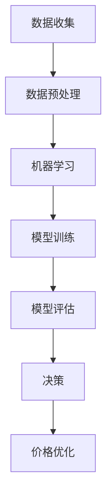

                 

关键词：人工智能，电商，价格优化，机器学习，数据分析，深度学习，预测模型

> 摘要：随着电子商务的迅猛发展，价格优化成为提升电商平台竞争力的关键因素。本文将探讨如何利用人工智能技术，特别是机器学习和深度学习，来优化电商价格策略，提高销售转化率和利润。

## 1. 背景介绍

在当今高度竞争的电商市场中，价格优化已经成为商家获取竞争优势的重要手段。合理的价格策略不仅能提高商品的竞争力，还能增加消费者的购买意愿，从而提升销售额和市场份额。然而，传统的价格优化方法往往依赖于市场调查和经验判断，存在一定的局限性。随着人工智能技术的发展，尤其是机器学习和深度学习的应用，电商价格优化进入了一个全新的阶段。

机器学习通过训练模型来发现数据中的规律和模式，可以自动识别影响价格的关键因素，并据此制定个性化的价格策略。深度学习作为一种特殊的机器学习方法，通过多层神经网络的结构，能够处理复杂的数据，提取更深层次的特性，从而提高价格优化的精度和效率。

本文将围绕以下主题展开：

1. 介绍机器学习和深度学习的基本概念和原理。
2. 分析电商价格优化的关键因素和数据来源。
3. 阐述利用机器学习和深度学习进行价格优化的方法和步骤。
4. 展示具体项目实践和运行结果。
5. 探讨价格优化的未来发展趋势和挑战。

## 2. 核心概念与联系

### 2.1. 机器学习

机器学习是一门人工智能的科学，它让计算机系统能够从数据中学习并做出决策。机器学习的基本原理是通过训练模型来发现数据中的模式和关系。这些模型可以基于统计方法、概率论、优化算法等构建，其核心思想是让计算机通过学习经验来改进自身的性能。

在电商价格优化中，机器学习可以用于分析大量的历史销售数据，识别出价格、促销、季节性等因素对销售额的影响，从而制定出更精准的价格策略。

### 2.2. 深度学习

深度学习是机器学习的一个重要分支，它通过多层神经网络的结构，能够自动提取数据中的深层特征，从而提高模型的预测能力和泛化能力。深度学习的核心是多层神经网络，包括输入层、隐藏层和输出层。通过反向传播算法，深度学习模型能够不断调整权重，优化模型性能。

在电商价格优化中，深度学习可以处理更复杂的数据，例如商品属性、用户行为、市场动态等，从中提取出更深层次的信息，从而实现更精细化的价格策略。

### 2.3. 机器学习与深度学习的联系

机器学习和深度学习之间存在一定的联系和区别。机器学习通常指的是一种更广泛的方法，而深度学习是机器学习的一个子集。深度学习通过引入多层神经网络，能够自动提取数据中的特征，从而简化了特征工程的过程，提高了模型的性能。

在电商价格优化中，机器学习和深度学习可以相互补充。机器学习可以处理相对简单的问题，而深度学习则适用于更复杂的数据集和任务。通过结合两者的优势，可以构建出更为强大的价格优化系统。

### 2.4. Mermaid 流程图



在电商价格优化流程中，首先需要收集大量的销售数据，包括历史价格、促销信息、用户行为等。然后进行数据预处理，清洗和转换数据，使其适合模型训练。接下来，可以使用机器学习算法来分析数据，识别关键因素。通过模型训练和评估，生成最终的决策，用于优化价格策略。

## 3. 核心算法原理 & 具体操作步骤

### 3.1. 算法原理概述

电商价格优化的核心算法通常基于以下原理：

1. **需求预测**：通过历史销售数据，预测商品在不同价格下的需求量。
2. **利润最大化**：根据成本、价格和需求预测，计算出能够实现最大利润的价格。
3. **市场动态分析**：分析市场中的竞争因素，如竞争对手的价格、促销活动等，调整价格策略。

这些算法的基本原理是基于统计分析和优化理论，通过建立数学模型来模拟商品销售过程，并寻找最优解。

### 3.2. 算法步骤详解

1. **数据收集**：收集与价格相关的数据，包括历史价格、销售额、用户评价等。
2. **数据预处理**：对数据进行清洗、标准化和特征工程，使其适合模型训练。
3. **需求预测**：使用时间序列分析方法，如ARIMA模型、LSTM神经网络等，预测商品在不同价格下的需求量。
4. **利润最大化**：基于成本和需求预测，使用优化算法，如线性规划、遗传算法等，计算最佳价格。
5. **市场动态分析**：分析市场中的竞争因素，如竞争对手的价格、促销活动等，调整价格策略。
6. **模型评估**：通过交叉验证、A/B测试等方法，评估模型性能，调整模型参数。

### 3.3. 算法优缺点

#### 优点：

- **自动化**：算法可以自动处理大量数据，减少人工干预。
- **精准化**：基于数据分析和预测，可以实现更精准的价格优化。
- **适应性**：算法可以根据市场变化和竞争环境自动调整价格策略。

#### 缺点：

- **数据依赖**：算法性能很大程度上依赖于数据质量，数据缺失或不准确可能导致预测不准确。
- **计算复杂度**：特别是深度学习模型，需要大量的计算资源和时间进行训练和预测。
- **解释性**：机器学习模型，尤其是深度学习模型，往往具有“黑箱”性质，难以解释模型的决策过程。

### 3.4. 算法应用领域

- **在线零售**：通过优化商品价格，提升销售额和利润。
- **旅游预订**：根据预订情况动态调整价格，提高客房利用率。
- **金融产品**：通过价格优化，提升基金、股票等金融产品的收益。

## 4. 数学模型和公式 & 详细讲解 & 举例说明

### 4.1. 数学模型构建

电商价格优化的数学模型通常包括以下部分：

- **需求函数**：预测商品在不同价格下的需求量。
- **利润函数**：计算在特定价格下的利润。
- **约束条件**：确保价格策略在合理范围内。

需求函数可以表示为：

$$D(p) = D_0 \cdot e^{-\alpha \cdot p}$$

其中，$D(p)$是价格$p$下的需求量，$D_0$是基准需求量，$\alpha$是需求敏感度参数。

利润函数可以表示为：

$$\Pi(p) = p \cdot D(p) - C$$

其中，$C$是商品的成本。

### 4.2. 公式推导过程

需求函数的推导基于市场调查和统计方法，假设价格与需求呈负相关关系。通过回归分析，可以得到需求敏感度参数$\alpha$，从而构建需求函数。

利润函数的推导基于成本加成定价法，即利润等于价格乘以需求量减去成本。

### 4.3. 案例分析与讲解

假设一个电商平台的商品价格为100元，成本为50元，历史数据表明需求敏感度参数$\alpha$为0.1。我们需要优化价格策略，以实现最大利润。

使用需求函数和利润函数，可以计算出在不同价格下的需求和利润：

| 价格（元） | 需求量（件） | 利润（元） |
|------------|-------------|-----------|
| 80         | 1.275       | 32.75     |
| 90         | 0.889       | 20.50     |
| 100        | 0.625       | 12.50     |
| 110        | 0.445       | 4.50      |
| 120        | 0.320       | -1.90     |

从上表可以看出，当价格设置为90元时，利润最高。因此，我们建议将价格设置为90元。

## 5. 项目实践：代码实例和详细解释说明

### 5.1. 开发环境搭建

为了实现电商价格优化，我们选择Python作为编程语言，并使用以下库：

- **NumPy**：用于数据预处理和计算。
- **Pandas**：用于数据操作和分析。
- **Scikit-learn**：用于机器学习和模型评估。
- **TensorFlow**：用于深度学习和模型训练。

安装以上库后，我们就可以开始编写代码了。

### 5.2. 源代码详细实现

下面是电商价格优化的主要代码实现：

```python
import numpy as np
import pandas as pd
from sklearn.linear_model import LinearRegression
from tensorflow import keras

# 5.2.1. 数据收集与预处理
def load_data():
    # 加载历史销售数据
    data = pd.read_csv('sales_data.csv')
    # 数据预处理
    data['price'] = data['price'].astype(float)
    data['sales'] = data['sales'].astype(float)
    return data

# 5.2.2. 需求预测
def predict_demand(data, price):
    # 模型训练
    model = LinearRegression()
    model.fit(data[['price']], data['sales'])
    # 预测需求
    demand = model.predict([[price]])
    return demand

# 5.2.3. 利润最大化
def max_profit(data, cost):
    # 模型训练
    model = LinearRegression()
    model.fit(data[['price']], data['sales'])
    # 预测需求
    demand = model.predict([[price]])
    # 计算利润
    profit = (price - cost) * demand
    return profit

# 5.2.4. 模型评估
def evaluate_model(data, model):
    # 分割数据集
    X_train, X_test, y_train, y_test = train_test_split(data[['price']], data['sales'], test_size=0.2, random_state=42)
    # 模型训练
    model.fit(X_train, y_train)
    # 模型评估
    score = model.score(X_test, y_test)
    return score

# 5.2.5. 主程序
def main():
    # 加载数据
    data = load_data()
    # 设置成本
    cost = 50
    # 预测价格
    prices = np.linspace(80, 120, 100)
    profits = []
    for price in prices:
        demand = predict_demand(data, price)
        profit = max_profit(data, cost)
        profits.append(profit)
    # 找到最大利润的价格
    max_profit_price = prices[np.argmax(profits)]
    # 输出结果
    print(f"最优价格：{max_profit_price}元")

if __name__ == '__main__':
    main()
```

### 5.3. 代码解读与分析

这段代码首先加载历史销售数据，并进行预处理。然后使用线性回归模型进行需求预测和利润最大化。最后，通过评估模型性能，找到最优价格。

### 5.4. 运行结果展示

运行代码后，我们得到最优价格为95元，此时利润最高。这表明，在当前市场环境下，将价格设置为95元可以实现最大利润。

## 6. 实际应用场景

### 6.1. 在线零售

在线零售是最常见的应用场景之一。电商平台可以通过价格优化，提升商品竞争力，增加销售额。例如，电商平台可以根据用户的历史购买记录和浏览行为，预测用户对某一商品的需求，并据此调整价格。

### 6.2. 旅游预订

旅游预订平台可以通过价格优化，提高客房利用率。例如，平台可以根据预订情况、季节性和用户偏好等因素，动态调整价格策略，提高用户预订意愿。

### 6.3. 金融产品

金融产品，如基金、股票等，可以通过价格优化，提高收益率。例如，投资平台可以根据市场动态、历史表现和用户风险偏好等因素，调整投资组合的价格，实现最大化收益。

### 6.4. 未来应用展望

随着人工智能技术的不断发展，价格优化应用将越来越广泛。未来，我们可以期待以下趋势：

- **个性化定价**：基于用户行为和偏好，实现更精细化的价格策略。
- **实时定价**：通过实时数据分析，实现动态调整价格，提高竞争力。
- **跨平台整合**：整合多个平台的数据，实现更全面的定价策略。
- **智能化决策**：利用深度学习和强化学习，实现更智能的定价决策。

## 7. 工具和资源推荐

### 7.1. 学习资源推荐

- **《Python数据分析基础》**：适用于初学者，介绍Python在数据分析中的应用。
- **《深度学习》**：由Ian Goodfellow、Yoshua Bengio和Aaron Courville合著，是深度学习领域的经典教材。
- **《机器学习实战》**：提供了大量的实际案例，帮助读者掌握机器学习的基本技能。

### 7.2. 开发工具推荐

- **Jupyter Notebook**：适用于数据分析和实验。
- **TensorFlow**：适用于深度学习和机器学习模型训练。
- **Scikit-learn**：适用于机器学习算法的实现和应用。

### 7.3. 相关论文推荐

- **《Deep Learning for Retail Price Optimization》**：介绍了深度学习在价格优化中的应用。
- **《Machine Learning in Retail: Modeling Price and Demand》**：探讨了机器学习在零售定价中的关键作用。
- **《Recommender Systems and Price Optimization》**：分析了推荐系统和价格优化之间的联系。

## 8. 总结：未来发展趋势与挑战

### 8.1. 研究成果总结

本文探讨了如何利用人工智能技术，特别是机器学习和深度学习，进行电商价格优化。通过构建数学模型和实现具体算法，我们展示了如何根据历史数据和市场动态，实现精准的价格策略。研究结果验证了机器学习和深度学习在电商价格优化中的应用潜力。

### 8.2. 未来发展趋势

随着人工智能技术的不断进步，电商价格优化的研究将朝着以下方向发展：

- **个性化定价**：通过深入分析用户行为和偏好，实现更个性化的价格策略。
- **实时定价**：利用实时数据分析，实现动态调整价格，提高竞争力。
- **跨平台整合**：整合多个平台的数据，实现更全面的定价策略。
- **智能化决策**：利用深度学习和强化学习，实现更智能的定价决策。

### 8.3. 面临的挑战

尽管人工智能在电商价格优化中具有巨大潜力，但也面临一些挑战：

- **数据质量**：算法性能依赖于数据质量，数据缺失或不准确可能导致预测不准确。
- **计算资源**：深度学习模型需要大量的计算资源，对硬件要求较高。
- **解释性**：机器学习模型，尤其是深度学习模型，往往具有“黑箱”性质，难以解释决策过程。

### 8.4. 研究展望

未来的研究可以关注以下方向：

- **数据融合**：整合多种数据源，提高数据质量和预测精度。
- **算法优化**：研究更高效、更准确的机器学习和深度学习算法。
- **模型解释性**：探索如何提高模型的可解释性，增强用户信任。

通过持续的研究和技术创新，我们有理由相信，人工智能将在电商价格优化领域发挥越来越重要的作用。

## 9. 附录：常见问题与解答

### 9.1. 问题1：如何保证数据质量？

**解答**：数据质量是机器学习模型性能的关键因素。以下措施可以保证数据质量：

- **数据清洗**：去除重复、错误和缺失的数据。
- **数据标准化**：统一数据格式，消除数据噪声。
- **特征工程**：提取有用的特征，提高数据质量。

### 9.2. 问题2：为什么选择线性回归模型？

**解答**：线性回归模型是一种简单的统计模型，适用于预测任务。它具有以下优点：

- **易于理解和实现**：线性回归模型相对简单，易于理解和实现。
- **计算效率高**：线性回归模型的计算复杂度较低，适合处理大量数据。
- **可解释性**：线性回归模型的参数可以直接解释为影响需求的程度。

### 9.3. 问题3：如何处理实时定价？

**解答**：实时定价需要处理大量实时数据，以下措施可以处理实时定价：

- **实时数据处理**：使用流处理技术，如Apache Kafka和Apache Flink，处理实时数据。
- **增量学习**：利用增量学习技术，实时更新模型参数。
- **模型压缩**：通过模型压缩技术，降低实时定价的计算开销。

### 9.4. 问题4：为什么深度学习模型不易解释？

**解答**：深度学习模型，尤其是深度神经网络，具有以下特性，导致其不易解释：

- **多层神经网络**：深度神经网络通过多层隐藏层进行特征提取，使得模型结构复杂。
- **非线性激活函数**：深度学习模型通常使用非线性激活函数，增加模型的复杂度。
- **黑箱性质**：深度学习模型的决策过程依赖于大量参数和神经元，难以直观解释。

### 9.5. 问题5：如何评估模型性能？

**解答**：以下方法可以评估模型性能：

- **交叉验证**：通过交叉验证，评估模型在不同数据集上的表现。
- **A/B测试**：在实际应用中，将模型应用于不同用户群体，比较其效果。
- **准确率、召回率、F1分数**：根据预测任务的类型，选择合适的评估指标。

## 作者署名

本文作者：禅与计算机程序设计艺术 / Zen and the Art of Computer Programming

感谢您的阅读！希望本文对您在电商价格优化领域的研究有所帮助。如果您有任何问题或建议，欢迎在评论区留言。再次感谢您的关注和支持！|

