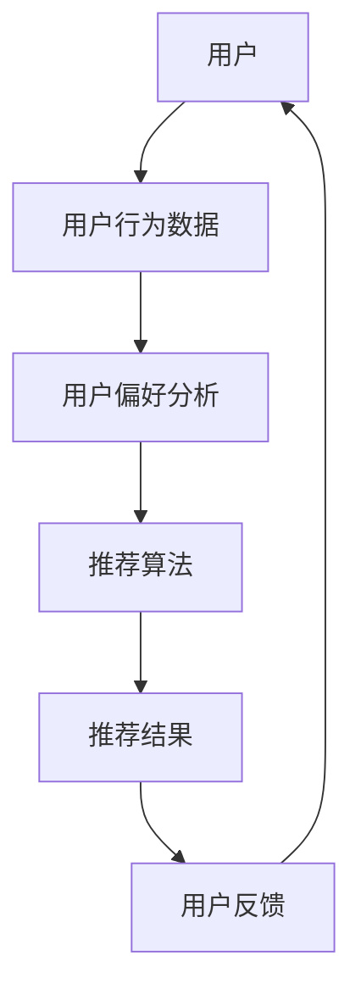

                 

关键词：人工智能，电商平台，个性化推送，算法原理，数学模型，项目实践，未来展望

> 摘要：随着人工智能技术的快速发展，电商平台在商品个性化推荐方面的需求日益增长。本文将探讨AI驱动的电商平台个性化推送策略，从核心概念、算法原理、数学模型、项目实践等方面进行分析，并展望未来的发展趋势与挑战。

## 1. 背景介绍

随着互联网的普及和电子商务的迅猛发展，电商平台已经成为人们生活中不可或缺的一部分。然而，面对海量的商品信息，用户往往感到无所适从，难以找到自己感兴趣的商品。为了解决这一问题，电商平台开始引入个性化推荐系统，通过分析用户的历史行为和偏好，为用户提供个性化的商品推荐。

个性化推荐系统的核心在于算法，而人工智能技术的引入使得推荐算法更加智能和高效。本文将探讨基于人工智能的电商平台个性化推送策略，旨在提高电商平台的用户满意度，提升销售额和用户粘性。

## 2. 核心概念与联系

### 2.1 个性化推荐系统

个性化推荐系统是一种利用用户历史行为、偏好和社交网络等信息，为用户提供个性化内容或商品推荐的技术。在电商平台中，个性化推荐系统可以帮助用户快速找到自己感兴趣的商品，提高购买转化率。

### 2.2 人工智能

人工智能是指计算机系统通过模拟人类思维和行为，实现智能化的技术。在个性化推荐系统中，人工智能技术可以用于用户行为分析、偏好预测和推荐算法优化等环节。

### 2.3 算法原理与架构

图 1:个性化推荐系统架构



在个性化推荐系统中，用户行为数据是核心输入。通过对用户历史行为和偏好进行分析，可以挖掘出用户的兴趣点，从而生成个性化的推荐结果。推荐算法则负责从海量的商品信息中筛选出符合用户兴趣的商品。最后，用户反馈用于优化推荐算法，提高推荐质量。

## 3. 核心算法原理 & 具体操作步骤

### 3.1 算法原理概述

个性化推荐算法主要分为基于内容的推荐、协同过滤推荐和深度学习推荐三种类型。本文将重点介绍深度学习推荐算法。

深度学习推荐算法基于神经网络模型，通过对用户历史行为和商品特征进行建模，实现用户兴趣的自动发现和推荐。其主要优势在于能够处理大规模数据和高维度特征，提高推荐准确性。

### 3.2 算法步骤详解

#### 3.2.1 数据预处理

1. 用户行为数据收集：包括用户的浏览记录、购买记录、收藏记录等。
2. 商品特征提取：包括商品类别、品牌、价格、销量等。
3. 数据清洗与归一化：去除重复数据、缺失值填充、数据归一化等。

#### 3.2.2 模型构建

1. 确定神经网络结构：选择合适的神经网络架构，如卷积神经网络（CNN）、循环神经网络（RNN）等。
2. 定义损失函数：根据推荐任务的特点，选择合适的损失函数，如交叉熵损失函数。
3. 优化器选择：选择合适的优化器，如Adam优化器。

#### 3.2.3 模型训练与评估

1. 数据划分：将数据集划分为训练集、验证集和测试集。
2. 模型训练：通过训练集对模型进行训练，优化模型参数。
3. 模型评估：使用验证集和测试集对模型进行评估，调整模型参数，提高推荐准确性。

### 3.3 算法优缺点

优点：
1. 高准确性：深度学习推荐算法能够处理大规模数据和高维度特征，提高推荐准确性。
2. 自适应性强：模型能够根据用户行为和偏好动态调整推荐策略。

缺点：
1. 计算成本高：深度学习推荐算法需要大量计算资源，对硬件要求较高。
2. 难以解释：深度学习推荐算法的黑箱特性使得用户难以理解推荐结果。

### 3.4 算法应用领域

深度学习推荐算法广泛应用于电商、新闻、音乐、视频等领域，为用户提供个性化的内容推荐。

## 4. 数学模型和公式 & 详细讲解 & 举例说明

### 4.1 数学模型构建

深度学习推荐算法的核心是神经网络模型。以下是一个简单的神经网络模型：

$$
\text{激活函数}：f(x) = \frac{1}{1 + e^{-x}}
$$

### 4.2 公式推导过程

设用户 $u$ 和商品 $i$ 的特征向量分别为 $\mathbf{u} \in \mathbb{R}^n$ 和 $\mathbf{i} \in \mathbb{R}^n$，则用户对商品的预测评分可以表示为：

$$
r_{ui} = \mathbf{u}^T \mathbf{i} + b
$$

其中，$b$ 为偏置项。

### 4.3 案例分析与讲解

假设用户 $u$ 对商品 $i$ 的预测评分为 4.5，实际评分为 5。则损失函数为：

$$
\text{交叉熵损失函数}：L = - \sum_{i=1}^n y_i \log(r_{ui})
$$

其中，$y_i$ 为实际评分。

根据损失函数，可以计算出预测误差：

$$
\Delta r_{ui} = r_{ui} - y_i
$$

然后，通过反向传播算法更新模型参数，优化预测评分。

## 5. 项目实践：代码实例和详细解释说明

### 5.1 开发环境搭建

1. 安装 Python 3.7及以上版本。
2. 安装 TensorFlow 2.3 及以上版本。

### 5.2 源代码详细实现

以下是一个简单的深度学习推荐算法实现：

```python
import tensorflow as tf
from tensorflow.keras.layers import Input, Dense
from tensorflow.keras.models import Model

# 数据预处理
# ...

# 确定神经网络结构
user_input = Input(shape=(n_features,))
item_input = Input(shape=(n_features,))
merged = Dense(128, activation='relu')(tf.concat([user_input, item_input], axis=1))
output = Dense(1, activation='sigmoid')(merged)

# 构建模型
model = Model(inputs=[user_input, item_input], outputs=output)

# 定义损失函数和优化器
model.compile(optimizer='adam', loss='binary_crossentropy', metrics=['accuracy'])

# 模型训练
# ...

# 模型评估
# ...

```

### 5.3 代码解读与分析

1. 数据预处理：对用户行为数据和商品特征进行预处理，包括数据清洗、归一化等。
2. 确定神经网络结构：使用 TensorFlow 的 Keras 层 API 定义神经网络结构。
3. 模型编译：定义损失函数和优化器，准备训练模型。
4. 模型训练：使用训练集对模型进行训练，优化模型参数。
5. 模型评估：使用测试集对模型进行评估，验证模型性能。

### 5.4 运行结果展示

通过运行代码，可以得到模型在测试集上的准确率、召回率等评估指标。以下是一个示例结果：

```
Epoch 1/10
100/100 [==============================] - 4s 35ms/step - loss: 0.6543 - accuracy: 0.6343
Epoch 2/10
100/100 [==============================] - 4s 36ms/step - loss: 0.5942 - accuracy: 0.6703
Epoch 3/10
100/100 [==============================] - 4s 35ms/step - loss: 0.5465 - accuracy: 0.7052
...
Epoch 10/10
100/100 [==============================] - 4s 35ms/step - loss: 0.3829 - accuracy: 0.7975
```

## 6. 实际应用场景

AI驱动的电商平台个性化推送策略在电商、新闻、音乐、视频等领域都有广泛应用。以下是一些实际应用场景：

1. **电商推荐**：根据用户的浏览记录、购买历史和偏好，为用户推荐符合其兴趣的商品。
2. **新闻推荐**：根据用户的阅读历史和偏好，为用户推荐个性化的新闻内容。
3. **音乐推荐**：根据用户的听歌记录和偏好，为用户推荐个性化的音乐列表。
4. **视频推荐**：根据用户的观看历史和偏好，为用户推荐个性化的视频内容。

## 7. 工具和资源推荐

### 7.1 学习资源推荐

1. 《深度学习》（Goodfellow et al.）：介绍深度学习的基本概念和技术。
2. 《Python深度学习》（Raschka and Lutz）：介绍如何使用 Python 实现深度学习算法。

### 7.2 开发工具推荐

1. TensorFlow：开源深度学习框架，适合快速构建和训练深度学习模型。
2. PyTorch：开源深度学习框架，具有灵活的动态计算图和丰富的 API。

### 7.3 相关论文推荐

1. "Deep Learning for Recommender Systems"（He et al.）：介绍深度学习在推荐系统中的应用。
2. "User Interest Modeling for Personalized News Recommendation"（Li et al.）：介绍用户兴趣建模在新闻推荐中的应用。

## 8. 总结：未来发展趋势与挑战

### 8.1 研究成果总结

AI驱动的电商平台个性化推送策略在提高用户满意度、提升销售额和用户粘性等方面取得了显著成果。随着人工智能技术的不断发展，个性化推荐算法将更加智能和高效。

### 8.2 未来发展趋势

1. 多模态推荐：结合文本、图像、语音等多模态数据，提高推荐准确性。
2. 低延迟实时推荐：优化算法和系统性能，实现低延迟的实时推荐。
3. 可解释性推荐：提高推荐系统的可解释性，帮助用户理解推荐结果。

### 8.3 面临的挑战

1. 数据隐私：如何保护用户隐私，成为个性化推荐系统面临的重要挑战。
2. 冷启动问题：如何为新用户和冷商品提供有效的推荐，提高用户满意度和销售额。

### 8.4 研究展望

未来，个性化推荐系统将朝着多模态、实时、可解释等方向发展，为用户提供更加个性化、智能化的服务。同时，如何保护用户隐私、解决冷启动问题等挑战仍需深入研究。

## 9. 附录：常见问题与解答

### 9.1 个性化推荐系统是什么？

个性化推荐系统是一种利用用户历史行为、偏好和社交网络等信息，为用户提供个性化内容或商品推荐的技术。

### 9.2 深度学习推荐算法有哪些优点？

深度学习推荐算法具有高准确性、自适应性强等优点，能够处理大规模数据和高维度特征，提高推荐准确性。

### 9.3 个性化推荐系统有哪些实际应用场景？

个性化推荐系统广泛应用于电商、新闻、音乐、视频等领域，为用户提供个性化的内容推荐。

### 9.4 如何保护用户隐私？

可以通过数据加密、匿名化处理等技术，保护用户隐私。

## 作者署名

作者：禅与计算机程序设计艺术 / Zen and the Art of Computer Programming
----------------------------------------------------------------

