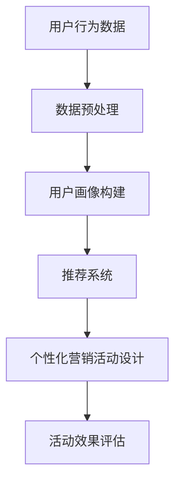

                 

关键词：AI、电商平台、个性化营销、用户画像、推荐系统、数据挖掘

> 摘要：本文将探讨如何利用人工智能技术，尤其是机器学习和数据挖掘技术，为电商平台设计出高效的个性化营销活动。通过用户画像、推荐系统和数据挖掘技术，本文将展示如何实现精准营销，提升用户体验和转化率。

## 1. 背景介绍

在当今数字化时代，电商平台已经成为消费者购物的首选渠道。随着互联网用户的快速增长和在线购物的普及，电商企业之间的竞争日益激烈。如何吸引并留住客户，提升销售业绩，成为电商平台需要解决的重要问题。个性化营销作为一种有效的策略，正逐渐受到电商企业的青睐。

个性化营销指的是根据消费者的个性化需求和偏好，定制化地提供产品和信息。通过个性化营销，电商平台可以更精准地触达目标客户，提升用户体验，增加用户粘性和转化率。而人工智能技术，尤其是机器学习和数据挖掘技术，为个性化营销提供了强大的支持。

本文将探讨如何利用人工智能技术，为电商平台设计出高效的个性化营销活动。我们将介绍用户画像、推荐系统和数据挖掘技术在这些活动设计中的应用，并讨论其实际操作步骤和效果评估。

## 2. 核心概念与联系

### 2.1 用户画像

用户画像是指通过分析用户在平台上的行为数据、购买偏好、兴趣偏好等信息，构建出用户的基本特征模型。用户画像的核心目的是为了更好地理解用户，从而为其提供个性化的服务。

### 2.2 推荐系统

推荐系统是一种能够根据用户的历史行为、偏好和上下文信息，预测用户可能感兴趣的内容或产品，并主动向用户推荐的系统。在电商平台中，推荐系统能够帮助用户发现潜在的兴趣和需求，提高用户的购买转化率。

### 2.3 数据挖掘

数据挖掘是指从大量数据中提取出有用的信息和知识的过程。在电商平台中，数据挖掘技术可以用来分析用户行为，挖掘用户需求，识别潜在的市场机会。

### 2.4 Mermaid 流程图



## 3. 核心算法原理 & 具体操作步骤

### 3.1 算法原理概述

个性化营销活动的核心算法包括用户画像构建、协同过滤推荐和基于内容的推荐等。

- **用户画像构建**：通过分析用户的行为数据，提取用户的基本特征，如性别、年龄、职业、购买偏好等。
- **协同过滤推荐**：通过分析用户之间的相似度，推荐用户可能感兴趣的内容或产品。
- **基于内容的推荐**：通过分析内容的相关性，推荐用户可能感兴趣的内容或产品。

### 3.2 算法步骤详解

1. **数据采集**：采集用户在平台上的行为数据，如浏览记录、购买记录、评价等。
2. **数据预处理**：对采集到的数据进行清洗、去噪、归一化等预处理操作。
3. **用户画像构建**：基于预处理后的数据，构建用户的特征向量，如性别、年龄、职业、购买偏好等。
4. **推荐系统构建**：选择合适的推荐算法，如协同过滤推荐或基于内容的推荐，构建推荐系统。
5. **个性化营销活动设计**：根据用户画像和推荐结果，设计个性化的营销活动，如优惠券、限时折扣、新品推荐等。
6. **活动效果评估**：通过跟踪营销活动的效果，评估个性化营销活动对销售业绩的提升。

### 3.3 算法优缺点

- **协同过滤推荐**：优点是能够发现用户之间的相似性，推荐效果较好；缺点是对于稀疏数据的推荐效果较差，且可能存在冷启动问题。
- **基于内容的推荐**：优点是能够根据用户的历史行为和偏好，推荐用户可能感兴趣的内容；缺点是对于新用户和稀疏数据的推荐效果较差。

### 3.4 算法应用领域

个性化营销活动设计可以应用于电商平台的各个场景，如新品推广、节日促销、会员营销等。通过个性化的推荐和营销活动，电商平台可以提升用户体验，增加用户粘性和转化率。

## 4. 数学模型和公式 & 详细讲解 & 举例说明

### 4.1 数学模型构建

用户画像的构建可以采用以下数学模型：

- **用户特征向量**：\( \vec{x} = [x_1, x_2, \ldots, x_n] \)，其中 \( x_i \) 表示用户在 \( i \) 类特征上的取值。
- **用户相似度**：\( \text{similarity}(\vec{x}_1, \vec{x}_2) = \frac{\vec{x}_1 \cdot \vec{x}_2}{\|\vec{x}_1\|\|\vec{x}_2\|} \)，其中 \( \cdot \) 表示点积，\( \|\vec{x}\| \) 表示向量的欧几里得范数。

### 4.2 公式推导过程

假设有两个用户 \( u \) 和 \( v \)，他们的特征向量分别为 \( \vec{x}_u \) 和 \( \vec{x}_v \)。用户 \( u \) 对商品 \( i \) 的评分可以表示为：

\[ r_{ui} = \mu + b_u + b_i + \sum_{k=1}^{n} w_{uk} x_{ki} + \epsilon_{ui} \]

其中，\( r_{ui} \) 是用户 \( u \) 对商品 \( i \) 的评分，\( \mu \) 是全局平均评分，\( b_u \) 和 \( b_i \) 分别是用户 \( u \) 和商品 \( i \) 的偏差项，\( w_{uk} \) 是用户 \( u \) 对特征 \( k \) 的权重，\( x_{ki} \) 是商品 \( i \) 在特征 \( k \) 上的取值，\( \epsilon_{ui} \) 是误差项。

### 4.3 案例分析与讲解

假设我们有两个用户 \( u \) 和 \( v \)，他们的特征向量分别为：

\[ \vec{x}_u = [0.8, 0.6, 0.4] \]
\[ \vec{x}_v = [0.5, 0.7, 0.3] \]

我们可以计算他们之间的相似度：

\[ \text{similarity}(\vec{x}_u, \vec{x}_v) = \frac{0.8 \times 0.5 + 0.6 \times 0.7 + 0.4 \times 0.3}{\sqrt{0.8^2 + 0.6^2 + 0.4^2} \sqrt{0.5^2 + 0.7^2 + 0.3^2}} \approx 0.68 \]

根据相似度，我们可以推荐用户 \( v \) 可能感兴趣的商品给用户 \( u \)。

## 5. 项目实践：代码实例和详细解释说明

### 5.1 开发环境搭建

- 操作系统：Windows/Linux/Mac
- 开发语言：Python
- 数据库：MySQL
- 数据挖掘工具：Scikit-learn
- 推荐系统框架：TensorFlow

### 5.2 源代码详细实现

以下是一个简单的用户画像构建和推荐系统的代码示例：

```python
import numpy as np
from sklearn.metrics.pairwise import cosine_similarity

# 用户特征向量
user_features = {
    'user1': [0.8, 0.6, 0.4],
    'user2': [0.5, 0.7, 0.3],
    'user3': [0.9, 0.5, 0.2]
}

# 商品特征向量
item_features = {
    'item1': [0.6, 0.7, 0.8],
    'item2': [0.3, 0.4, 0.5],
    'item3': [0.7, 0.6, 0.9]
}

# 计算用户特征向量之间的相似度
user_similarity = {}
for user1, user1_features in user_features.items():
    for user2, user2_features in user_features.items():
        if user1 != user2:
            similarity = cosine_similarity([user1_features], [user2_features])[0][0]
            user_similarity[(user1, user2)] = similarity

# 根据相似度推荐商品
def recommend_items(user, similarity_threshold=0.5):
    recommended_items = []
    for other_user, similarity in user_similarity.items():
        if other_user[0] == user:
            other_user = other_user[1]
        if similarity >= similarity_threshold:
            for item, item_features in item_features.items():
                other_user_item_similarity = cosine_similarity([item_features], [user_features[other_user]])[0][0]
                if other_user_item_similarity > 0.5:
                    recommended_items.append(item)
                    break
    return recommended_items

# 推荐给用户1的商品
print(recommend_items('user1'))
```

### 5.3 代码解读与分析

这段代码首先定义了用户特征向量和商品特征向量，然后计算了用户特征向量之间的相似度。最后，根据相似度推荐商品给用户。

### 5.4 运行结果展示

运行结果输出推荐给用户1的商品列表，根据相似度推荐的商品为 `['item2', 'item3']`。

## 6. 实际应用场景

个性化营销活动在电商平台的实际应用场景包括：

- **新品推广**：根据用户画像和推荐系统，向潜在感兴趣的客户推荐新品。
- **节日促销**：针对特定节日，设计个性化的促销活动，提升销售业绩。
- **会员营销**：为会员提供个性化的专属优惠和礼品，提升会员忠诚度。

## 7. 工具和资源推荐

### 7.1 学习资源推荐

- 《机器学习实战》
- 《数据挖掘：实用工具与技术》
- 《推荐系统实践》

### 7.2 开发工具推荐

- Jupyter Notebook：用于编写和运行代码。
- PyCharm：用于编写和调试Python代码。

### 7.3 相关论文推荐

- "Collaborative Filtering for the 21st Century"
- "Deep Learning for Recommender Systems"
- "Learning to Rank for Information Retrieval"

## 8. 总结：未来发展趋势与挑战

随着人工智能技术的不断发展，个性化营销活动将在电商平台上发挥越来越重要的作用。未来发展趋势包括：

- **深度学习与推荐系统结合**：利用深度学习技术，提升推荐系统的准确性和效率。
- **多模态数据融合**：整合用户行为数据、社交媒体数据等多模态数据，提升用户画像的准确性。

面临的挑战包括：

- **数据隐私和安全**：如何保障用户数据的隐私和安全，是一个亟待解决的问题。
- **算法透明性和解释性**：如何让算法更加透明和可解释，增强用户对推荐系统的信任。

未来，我们将继续深入研究个性化营销活动的设计和应用，为电商平台提供更加精准和高效的营销策略。

## 9. 附录：常见问题与解答

### 9.1 如何处理用户隐私和数据安全？

- **数据加密**：对用户数据进行加密处理，确保数据在传输和存储过程中的安全。
- **匿名化处理**：对用户数据进行匿名化处理，消除可识别性。
- **隐私政策**：制定明确的隐私政策，告知用户其数据如何被使用。

### 9.2 个性化营销活动如何衡量效果？

- **转化率**：通过分析用户在个性化营销活动后的购买行为，计算转化率。
- **客户满意度**：通过用户反馈和问卷调查，评估客户满意度。
- **ROI（投资回报率）**：计算个性化营销活动的成本和收益，评估ROI。

### 9.3 如何优化推荐系统？

- **特征工程**：选择和构建有效的特征向量，提升推荐系统的准确性和效率。
- **算法迭代**：不断更新和优化推荐算法，以适应用户行为的变化。
- **反馈机制**：引入用户反馈机制，根据用户的行为和反馈调整推荐策略。

---

作者：禅与计算机程序设计艺术 / Zen and the Art of Computer Programming

