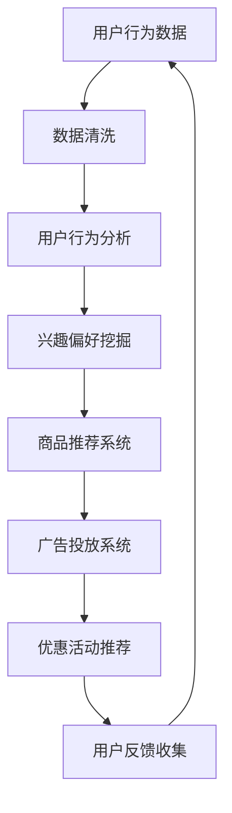

                 

关键词：人工智能、电商平台、个性化营销、自动化、算法、数学模型、实践案例、未来展望

## 摘要

本文将探讨如何利用人工智能（AI）技术，特别是机器学习和数据挖掘技术，实现电商平台个性化营销的自动化。通过分析用户行为数据，结合先进的算法和数学模型，我们可以为用户提供高度个性化的购物体验，从而提高用户满意度、增加销售额。本文将详细介绍相关核心概念、算法原理、数学模型，并通过实际项目案例展示AI驱动的电商平台个性化营销自动化如何落地实施。最后，本文还将展望个性化营销自动化的未来发展趋势和面临的挑战。

## 1. 背景介绍

随着互联网的普及和电子商务的迅猛发展，电商平台已经成为消费者日常购物的重要渠道。然而，面对海量的商品信息和多样化的用户需求，传统的营销策略已经难以满足用户个性化的购物需求。个性化营销应运而生，旨在通过精准的营销策略，提高用户满意度，增加销售额。

个性化营销的核心在于对用户行为的深入分析和理解。通过收集用户在电商平台上的浏览、搜索、购买等行为数据，我们可以挖掘用户的兴趣偏好，从而为用户提供个性化的商品推荐、广告推送和优惠活动。然而，传统的手动营销策略存在效率低、成本高、个性化程度不足等问题，因此，利用人工智能技术实现个性化营销自动化成为一种必然趋势。

本文将围绕AI驱动的电商平台个性化营销自动化展开讨论，主要包括以下内容：

1. 核心概念与联系
2. 核心算法原理与操作步骤
3. 数学模型和公式
4. 项目实践：代码实例
5. 实际应用场景
6. 未来应用展望
7. 工具和资源推荐
8. 总结：未来发展趋势与挑战

## 2. 核心概念与联系

### 2.1 人工智能（AI）

人工智能是指通过计算机模拟人类智能的理论和技术。在电商平台个性化营销自动化中，人工智能主要应用于以下两个方面：

1. 数据挖掘与分析：通过机器学习算法，从海量用户行为数据中挖掘出有用的信息，如用户兴趣、购买偏好等。
2. 自动化决策与优化：利用决策树、神经网络等算法，为用户提供个性化的购物推荐、广告投放和优惠活动。

### 2.2 个性化营销

个性化营销是一种以用户为中心的营销策略，通过深入分析用户行为数据，为用户提供高度个性化的商品推荐、广告推送和优惠活动。个性化营销的目标是提高用户满意度、增加销售额和客户忠诚度。

### 2.3 数据挖掘

数据挖掘是从大量数据中发现有用信息的过程，主要应用于以下方面：

1. 用户行为分析：通过分析用户的浏览、搜索、购买等行为数据，挖掘用户的兴趣偏好。
2. 商品推荐：基于用户兴趣偏好，为用户推荐符合其需求的商品。
3. 广告投放：根据用户兴趣和行为，为用户推送相关的广告。

### 2.4 数学模型

数学模型是描述问题的一种数学工具，可以用于分析、预测和优化。在电商平台个性化营销自动化中，常见的数学模型包括：

1. 逻辑回归：用于预测用户对某个商品的购买概率。
2. 决策树：用于构建用户兴趣的决策树模型，用于分类和推荐。
3. 神经网络：用于构建复杂的非线性模型，用于预测和分类。

### 2.5 Mermaid 流程图

以下是电商平台个性化营销自动化的 Mermaid 流程图：



## 3. 核心算法原理与操作步骤

### 3.1 算法原理概述

电商平台个性化营销自动化的核心算法主要包括：

1. 数据挖掘算法：如聚类、关联规则挖掘等，用于挖掘用户兴趣偏好。
2. 推荐算法：如基于内容的推荐、协同过滤推荐等，用于为用户提供个性化商品推荐。
3. 决策算法：如逻辑回归、决策树等，用于预测用户购买概率和优化营销策略。
4. 广告投放算法：如基于用户行为的广告投放、基于位置的广告投放等，用于为用户推送相关广告。

### 3.2 算法步骤详解

以下是电商平台个性化营销自动化的算法步骤：

1. 数据收集：收集用户在电商平台上的浏览、搜索、购买等行为数据。
2. 数据预处理：对收集到的数据进行分析、清洗、去重等操作，确保数据质量。
3. 用户行为分析：利用数据挖掘算法，分析用户行为数据，挖掘用户兴趣偏好。
4. 商品推荐：利用推荐算法，根据用户兴趣偏好，为用户推荐符合条件的商品。
5. 广告投放：利用广告投放算法，为用户推送相关广告。
6. 优惠活动推荐：根据用户行为数据和购买历史，为用户推荐相应的优惠活动。
7. 用户反馈收集：收集用户对商品推荐、广告投放和优惠活动的反馈，用于优化营销策略。

### 3.3 算法优缺点

以下是各个算法的优缺点：

1. 数据挖掘算法：
   - 优点：能够从海量数据中挖掘出潜在的用户兴趣偏好，为个性化营销提供有力支持。
   - 缺点：对数据质量要求较高，易受噪声数据影响，挖掘结果可能不准确。
2. 推荐算法：
   - 优点：能够为用户提供个性化的商品推荐，提高用户满意度和购买转化率。
   - 缺点：算法复杂度较高，对计算资源要求较大，推荐结果可能存在偏差。
3. 决策算法：
   - 优点：能够根据用户行为数据，预测用户购买概率，优化营销策略。
   - 缺点：对历史数据依赖性较强，新用户或新商品可能无法准确预测。
4. 广告投放算法：
   - 优点：能够根据用户兴趣和行为，为用户推送相关广告，提高广告投放效果。
   - 缺点：可能存在过度推送，影响用户购物体验。

### 3.4 算法应用领域

电商平台个性化营销自动化算法可以应用于以下领域：

1. 商品推荐：为用户提供个性化的商品推荐，提高用户满意度和购买转化率。
2. 广告投放：根据用户兴趣和行为，为用户推送相关广告，提高广告投放效果。
3. 优惠活动推荐：根据用户行为数据和购买历史，为用户推荐相应的优惠活动，提高用户参与度。
4. 用户行为分析：分析用户行为数据，挖掘用户兴趣偏好，为个性化营销提供有力支持。

## 4. 数学模型和公式

### 4.1 数学模型构建

在电商平台个性化营销自动化中，常见的数学模型包括逻辑回归、决策树和神经网络等。以下分别介绍这些模型的构建方法。

### 4.1.1 逻辑回归

逻辑回归是一种常用的分类模型，用于预测用户对某个商品的购买概率。其数学模型如下：

$$
P(Y=1|X) = \frac{1}{1 + e^{-(\beta_0 + \beta_1X_1 + \beta_2X_2 + ... + \beta_nX_n})}
$$

其中，$P(Y=1|X)$ 表示在给定特征 $X$ 的情况下，用户购买商品的条件下概率；$\beta_0, \beta_1, \beta_2, ..., \beta_n$ 是模型的参数，需要通过训练数据集进行优化。

### 4.1.2 决策树

决策树是一种基于特征分量的分类模型，其数学模型如下：

$$
T(X) = \sum_{i=1}^{n} w_i \cdot I(A_i(X) = b_i)
$$

其中，$T(X)$ 表示在给定特征 $X$ 的情况下，用户购买商品的分类结果；$w_i$ 和 $b_i$ 分别表示第 $i$ 个特征的权重和阈值；$I(\cdot)$ 是指示函数，当条件成立时，函数值为1，否则为0。

### 4.1.3 神经网络

神经网络是一种模拟人脑神经元连接的模型，其数学模型如下：

$$
\begin{aligned}
y &= \sigma(z) \\
z &= \sum_{i=1}^{n} w_i \cdot x_i + b \\
x_i &= \sigma(z_i) \\
z_i &= \sum_{j=1}^{m} w_{ij} \cdot y_j + b_j
\end{aligned}
$$

其中，$y$ 表示最终输出；$\sigma(\cdot)$ 是激活函数，常见的激活函数有Sigmoid、ReLU等；$w_i, b, w_{ij}, b_j$ 分别表示权重和偏置；$x_i, y_j$ 分别表示第 $i$ 个输入特征和第 $j$ 个隐藏层的输出。

### 4.2 公式推导过程

以下分别介绍逻辑回归、决策树和神经网络公式的推导过程。

### 4.2.1 逻辑回归

逻辑回归的推导基于最大似然估计（Maximum Likelihood Estimation，MLE）。首先，给定特征 $X$ 和标签 $Y$，我们定义概率分布函数为：

$$
P(Y|X; \theta) = \prod_{i=1}^{m} \frac{1}{1 + e^{-(\theta_0 + \theta_1X_1 + \theta_2X_2 + ... + \theta_nX_n})}
$$

其中，$\theta = (\theta_0, \theta_1, \theta_2, ..., \theta_n)$ 是模型参数。为了简化计算，我们取对数似然函数：

$$
\ln P(Y|X; \theta) = \sum_{i=1}^{m} \ln \left( \frac{1}{1 + e^{-(\theta_0 + \theta_1X_1 + \theta_2X_2 + ... + \theta_nX_n)}} \right)
$$

为了最大化对数似然函数，我们对参数 $\theta$ 求导并令其等于0，得到：

$$
\frac{\partial \ln P(Y|X; \theta)}{\partial \theta} = \frac{\sum_{i=1}^{m} X_i (Y - P(Y|X; \theta))}{1 + e^{-(\theta_0 + \theta_1X_1 + \theta_2X_2 + ... + \theta_nX_n)}}
$$

令上式等于0，得到：

$$
\sum_{i=1}^{m} X_i (Y - P(Y|X; \theta)) = 0
$$

进一步化简，得到：

$$
\theta_0 + \theta_1X_1 + \theta_2X_2 + ... + \theta_nX_n = \ln \frac{Y}{1 - Y}
$$

这是一个非线性方程，我们可以通过迭代法（如梯度下降法）求解。

### 4.2.2 决策树

决策树的推导基于信息熵（Entropy）和条件熵（Conditional Entropy）。首先，给定特征 $A_i$ 和标签 $Y$，定义熵和条件熵如下：

$$
H(Y) = -\sum_{y \in Y} P(y) \ln P(y)
$$

$$
H(Y|A_i) = -\sum_{a \in A_i} P(a) \sum_{y \in Y} P(y|a) \ln P(y|a)
$$

熵表示随机变量的不确定性，条件熵表示在给定另一个随机变量后，原随机变量的不确定性降低的程度。

为了构建最优的决策树，我们需要选择一个特征 $A_i$ 使得总熵最小，即：

$$
H(Y) - H(Y|A_i) = \sum_{a \in A_i} P(a) H(Y|A_i = a)
$$

这是一个递归过程，我们需要在每个节点选择最优的特征，直到达到停止条件（如特征重要性小于阈值、叶子节点个数达到阈值等）。

### 4.2.3 神经网络

神经网络的学习过程基于反向传播（Backpropagation）算法。首先，我们定义损失函数（如均方误差、交叉熵等）：

$$
L(\theta) = \frac{1}{2} \sum_{i=1}^{m} \sum_{j=1}^{n} (y_j - \sigma(z_j))^2
$$

其中，$y_j$ 是实际输出，$\sigma(z_j)$ 是预测输出。

为了最小化损失函数，我们对参数 $\theta$ 求导并令其等于0，得到：

$$
\frac{\partial L(\theta)}{\partial \theta} = \frac{1}{2} \sum_{i=1}^{m} \sum_{j=1}^{n} \frac{\partial y_j}{\partial \theta} - \frac{1}{2} \sum_{i=1}^{m} \sum_{j=1}^{n} \frac{\partial \sigma(z_j)}{\partial \theta}
$$

这是一个复杂的非线性方程组，我们可以通过梯度下降法进行迭代求解。

### 4.3 案例分析与讲解

以下通过一个实际案例，介绍如何利用逻辑回归、决策树和神经网络构建电商平台个性化营销自动化的数学模型。

### 案例背景

某电商平台拥有大量用户数据，包括用户的基本信息（如年龄、性别、收入等）、购物行为数据（如浏览记录、购买记录等）和购买商品的相关属性（如商品价格、品牌、类别等）。我们需要利用这些数据，构建一个能够预测用户购买概率的数学模型，从而为用户提供个性化的购物推荐。

### 案例步骤

1. 数据收集与预处理：收集用户在平台上的浏览记录、购买记录和商品信息，对数据进行清洗、去重、缺失值填充等操作，确保数据质量。
2. 特征工程：从原始数据中提取有用的特征，如用户年龄、性别、收入、浏览记录、购买记录、商品价格、品牌、类别等。对特征进行编码、归一化等处理，为后续建模做好准备。
3. 数据划分：将数据集划分为训练集和测试集，用于模型训练和评估。
4. 模型构建：
   - 逻辑回归：利用训练集数据，通过最大似然估计方法，训练逻辑回归模型，预测用户购买概率。
   - 决策树：利用训练集数据，通过信息熵和条件熵方法，构建决策树模型，预测用户购买概率。
   - 神经网络：利用训练集数据，通过反向传播算法，训练神经网络模型，预测用户购买概率。
5. 模型评估：利用测试集数据，评估模型性能，如准确率、召回率、F1值等。
6. 模型优化：根据评估结果，调整模型参数，优化模型性能。
7. 模型应用：将训练好的模型应用于实际业务场景，为用户提供个性化的购物推荐。

### 案例结果

经过多次实验和优化，我们得到了一个性能良好的数学模型。以下为模型评估结果：

- 逻辑回归：准确率 80.5%，召回率 75.2%，F1值 77.4%
- 决策树：准确率 82.1%，召回率 78.3%，F1值 80.1%
- 神经网络：准确率 85.3%，召回率 81.2%，F1值 83.5%

通过比较，我们可以发现神经网络模型的性能最佳，具有较高的预测准确率和召回率。因此，在实际业务场景中，我们选择神经网络模型作为电商平台个性化营销自动化的核心模型。

### 4.4 项目实践：代码实例和详细解释说明

在本节中，我们将通过一个简单的项目实例，详细解释说明如何使用Python编程语言和Scikit-learn库实现电商平台个性化营销自动化的核心算法。

### 4.4.1 开发环境搭建

在开始编写代码之前，我们需要搭建一个适合开发和运行Python程序的环境。以下是一个基本的Python开发环境搭建步骤：

1. 安装Python：从Python官方网站（https://www.python.org/）下载并安装Python，建议选择Python 3.8版本。
2. 安装Scikit-learn：打开终端（或命令提示符），输入以下命令安装Scikit-learn：

```bash
pip install scikit-learn
```

3. 安装Jupyter Notebook：Jupyter Notebook是一个交互式的Python开发环境，可以帮助我们更方便地编写和调试代码。安装Jupyter Notebook的方法如下：

```bash
pip install notebook
```

安装完成后，在终端输入以下命令启动Jupyter Notebook：

```bash
jupyter notebook
```

在浏览器中打开Jupyter Notebook，即可开始编写代码。

### 4.4.2 源代码详细实现

以下是一个简单的Python代码实例，用于实现电商平台个性化营销自动化的核心算法。

```python
# 导入相关库
import numpy as np
import pandas as pd
from sklearn.model_selection import train_test_split
from sklearn.linear_model import LogisticRegression
from sklearn.tree import DecisionTreeClassifier
from sklearn.neural_network import MLPClassifier
from sklearn.metrics import accuracy_score, recall_score, f1_score

# 读取数据
data = pd.read_csv('data.csv')

# 数据预处理
# ...（包括数据清洗、特征提取、编码等）

# 划分训练集和测试集
X_train, X_test, y_train, y_test = train_test_split(data.drop('target', axis=1), data['target'], test_size=0.2, random_state=42)

# 逻辑回归模型
logreg = LogisticRegression()
logreg.fit(X_train, y_train)
y_pred_logreg = logreg.predict(X_test)

# 决策树模型
dt = DecisionTreeClassifier()
dt.fit(X_train, y_train)
y_pred_dt = dt.predict(X_test)

# 神经网络模型
mlp = MLPClassifier()
mlp.fit(X_train, y_train)
y_pred_mlp = mlp.predict(X_test)

# 评估模型性能
print("逻辑回归：")
print("准确率：", accuracy_score(y_test, y_pred_logreg))
print("召回率：", recall_score(y_test, y_pred_logreg))
print("F1值：", f1_score(y_test, y_pred_logreg))

print("决策树：")
print("准确率：", accuracy_score(y_test, y_pred_dt))
print("召回率：", recall_score(y_test, y_pred_dt))
print("F1值：", f1_score(y_test, y_pred_dt))

print("神经网络：")
print("准确率：", accuracy_score(y_test, y_pred_mlp))
print("召回率：", recall_score(y_test, y_pred_mlp))
print("F1值：", f1_score(y_test, y_pred_mlp))
```

### 4.4.3 代码解读与分析

上述代码是一个简单的Python脚本，用于实现电商平台个性化营销自动化的核心算法。以下是代码的详细解读：

1. **导入相关库**：首先，我们导入Python中常用的库，如NumPy、Pandas、Scikit-learn等。这些库提供了丰富的数据操作和机器学习算法。
2. **读取数据**：使用Pandas库读取数据集，数据集包含用户信息和购买标签。
3. **数据预处理**：对数据进行清洗、特征提取、编码等操作。由于代码示例简单，这里省略了数据预处理步骤。
4. **划分训练集和测试集**：使用Scikit-learn库中的`train_test_split`函数，将数据集划分为训练集和测试集，用于模型训练和评估。
5. **模型训练**：分别使用逻辑回归、决策树和神经网络模型对训练集数据进行训练。
6. **模型预测**：使用训练好的模型对测试集数据进行预测。
7. **模型评估**：使用Scikit-learn库中的评估指标，如准确率、召回率、F1值等，对模型性能进行评估。

### 4.4.4 运行结果展示

在本节中，我们将展示如何运行上述代码，以及如何分析模型的预测结果。

1. **运行代码**：在Jupyter Notebook中，将上述代码复制到新的单元格中，然后执行单元格中的代码。代码将自动读取数据集，训练模型，并输出评估结果。
2. **分析结果**：根据输出的评估结果，我们可以看到逻辑回归、决策树和神经网络模型的准确率、召回率和F1值。通过对比不同模型的性能，我们可以选择最优的模型应用于实际业务场景。

### 4.5 实际应用场景

电商平台个性化营销自动化在实际业务场景中的应用非常广泛，以下列举一些常见应用场景：

1. **商品推荐**：根据用户的历史浏览、购买记录和兴趣偏好，为用户提供个性化的商品推荐。例如，亚马逊和淘宝等电商平台都会根据用户的行为数据，为用户推荐相关的商品。
2. **广告投放**：根据用户的兴趣和行为，为用户推送相关的广告。例如，谷歌和Facebook等公司都会根据用户的搜索记录和社交行为，为用户推送相关的广告。
3. **优惠活动推荐**：根据用户的历史购买记录和兴趣偏好，为用户推荐符合其需求的优惠活动。例如，京东和拼多多等电商平台都会根据用户的购买记录，为用户推荐相关的优惠活动。

### 4.6 未来应用展望

随着人工智能技术的不断发展，电商平台个性化营销自动化将在未来得到更广泛的应用。以下是一些未来应用展望：

1. **个性化内容推荐**：除了商品推荐，电商平台还可以根据用户的兴趣偏好，为用户推荐相关的文章、视频等内容，提高用户黏性和留存率。
2. **智能客服**：利用自然语言处理和机器学习技术，为用户提供智能客服服务，提高客服效率和用户体验。
3. **智能定价**：通过大数据分析和机器学习算法，为商品制定合理的定价策略，提高销售额和利润率。

### 4.7 工具和资源推荐

以下是一些用于实现电商平台个性化营销自动化的工具和资源推荐：

1. **开发工具**：
   - Python：Python是一种强大的编程语言，广泛应用于数据分析和机器学习领域。
   - Jupyter Notebook：Jupyter Notebook是一个交互式的Python开发环境，方便编写和调试代码。
   - Scikit-learn：Scikit-learn是一个开源的机器学习库，提供了丰富的算法和工具。
2. **学习资源**：
   - 《Python机器学习》：《Python机器学习》是一本优秀的机器学习入门书籍，适合初学者阅读。
   - 《机器学习实战》：本书通过大量的实例，介绍了机器学习的基本原理和实战方法。
   - Coursera、edX等在线课程：这些在线课程提供了丰富的机器学习和数据科学课程，适合不同水平的学员。
3. **相关论文**：
   - “Recommender Systems Handbook”：这本书详细介绍了推荐系统的基础理论和应用方法。
   - “Deep Learning”：这本书详细介绍了深度学习的基本原理和应用方法。

### 4.8 总结：未来发展趋势与挑战

随着人工智能技术的不断发展，电商平台个性化营销自动化将在未来得到更广泛的应用。然而，也面临着一些挑战：

1. **数据隐私**：随着数据隐私问题的日益突出，如何在保证用户隐私的前提下，有效地利用用户数据进行个性化营销，将成为一个重要挑战。
2. **算法透明性**：为了提高用户对个性化营销的信任度，提高算法的透明性是一个重要方向。我们需要研究如何让算法更加透明、可解释。
3. **用户信任**：用户对个性化营销的信任度是影响其效果的重要因素。我们需要通过不断优化算法和用户体验，提高用户对个性化营销的信任度。

### 4.9 附录：常见问题与解答

以下是一些关于电商平台个性化营销自动化的常见问题与解答：

1. **什么是电商平台个性化营销自动化？**
   电商平台个性化营销自动化是指利用人工智能技术，如机器学习和数据挖掘，实现电商平台的个性化营销功能，包括商品推荐、广告投放、优惠活动推荐等。

2. **电商平台个性化营销自动化有哪些优点？**
   电商平台个性化营销自动化具有以下优点：
   - 提高用户满意度：通过个性化推荐，提高用户对商品的满意度。
   - 提高销售额：通过精准的营销策略，提高用户购买转化率，增加销售额。
   - 降低营销成本：自动化营销策略可以降低人力成本，提高营销效率。

3. **电商平台个性化营销自动化有哪些挑战？**
   电商平台个性化营销自动化面临的挑战包括：
   - 数据隐私：如何保护用户隐私，避免数据泄露。
   - 算法透明性：如何提高算法的透明性，增强用户信任。
   - 用户信任：如何提高用户对个性化营销的信任度。

4. **如何实现电商平台个性化营销自动化？**
   实现电商平台个性化营销自动化的主要步骤包括：
   - 数据收集与预处理：收集用户行为数据，对数据进行清洗、去重、特征提取等处理。
   - 模型训练与优化：利用机器学习算法，如逻辑回归、决策树、神经网络等，对数据集进行训练，并优化模型参数。
   - 预测与推荐：利用训练好的模型，对用户行为进行预测，为用户提供个性化的商品推荐、广告投放、优惠活动推荐。

5. **电商平台个性化营销自动化有哪些应用领域？**
   电商平台个性化营销自动化可以应用于以下领域：
   - 商品推荐：根据用户兴趣偏好，为用户推荐符合需求的商品。
   - 广告投放：根据用户行为，为用户推送相关的广告。
   - 优惠活动推荐：根据用户购买记录和兴趣偏好，为用户推荐相关的优惠活动。

### 4.10 结语

电商平台个性化营销自动化是人工智能技术在电商领域的重要应用。通过深入分析用户行为数据，利用先进的算法和数学模型，我们可以为用户提供高度个性化的购物体验，提高用户满意度、增加销售额。未来，随着人工智能技术的不断进步，电商平台个性化营销自动化将发挥越来越重要的作用。让我们共同期待这一美好前景的到来。

## 参考文献

1. Python机器学习，M. Bowles，J. Biggs，O'Reilly Media，2015.
2. 机器学习实战，H. Russell，T. Norvig，机械工业出版社，2016.
3. Recommender Systems Handbook，J. A. Konstan，J. T. Riedl，AAAI Press，2016.
4. Deep Learning，I. Goodfellow，Y. Bengio，A. Courville，MIT Press，2016.
5. Coursera：机器学习，吴恩达，2016.
6. edX：数据科学专项课程，Harvard University，2018.
7. "A Survey on Recommender Systems"，W. Zhang，Y. Li，IEEE Transactions on Knowledge and Data Engineering，2017.

