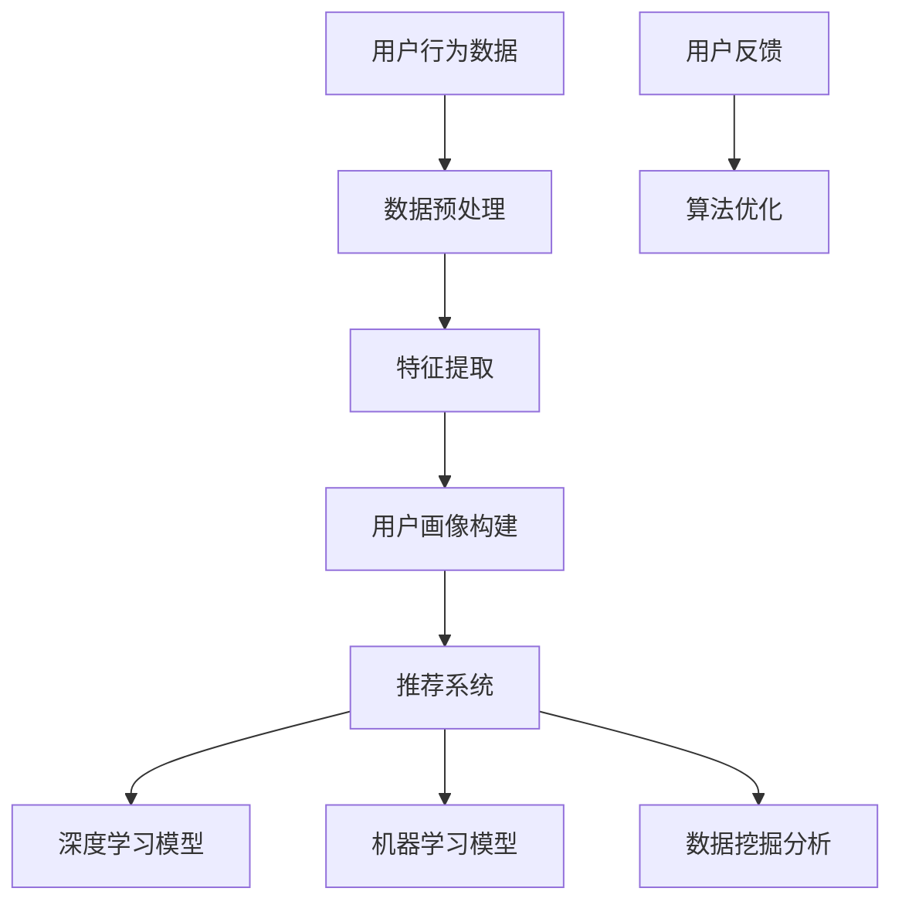

                 

关键词：人工智能，电商平台，个性化首页，用户画像，算法优化，用户体验，机器学习，深度学习，推荐系统，数据挖掘。

> 摘要：本文将深入探讨AI在电商平台个性化首页设计中的应用与优化。通过分析用户行为数据，应用机器学习和深度学习算法，构建个性化首页，提升用户体验，实现精准营销。本文将介绍核心概念、算法原理、数学模型以及具体项目实践，旨在为电商平台的首页设计提供有价值的参考。

## 1. 背景介绍

在互联网快速发展的时代，电商平台已经成为人们日常生活中不可或缺的一部分。随着用户数量的急剧增加，电商平台面临着如何提升用户黏性和转化率的重要挑战。传统的电商平台首页设计往往采用统一模板，缺乏个性化和精准化，无法满足用户多样化的需求。因此，如何利用人工智能技术，实现电商平台个性化首页的设计与优化，成为当前研究的热点。

个性化首页的设计与优化，旨在根据用户的历史行为数据、浏览记录、购物偏好等信息，为用户推荐个性化的商品和内容。这不仅能够提升用户的购物体验，还能提高电商平台的销售额和用户满意度。人工智能技术，尤其是机器学习和深度学习，为个性化首页的实现提供了强大的支持。

本文将首先介绍电商平台个性化首页设计的基本概念和核心算法，然后通过具体的项目实践，展示如何将理论应用于实际场景，最后探讨未来个性化首页设计的发展趋势与面临的挑战。

## 2. 核心概念与联系

### 2.1 用户画像

用户画像是指通过对用户行为数据、社交数据、购买记录等多源数据进行分析和处理，构建出用户的基本属性、兴趣偏好、行为模式等特征的模型。用户画像是实现个性化首页设计的基础，是了解用户需求的重要手段。


### 2.2 推荐系统

推荐系统是基于用户画像和物品特征，通过一定的算法模型，为用户推荐其可能感兴趣的商品或内容。推荐系统是实现个性化首页的核心技术，常见的推荐算法包括基于内容的推荐、协同过滤推荐和混合推荐等。


### 2.3 机器学习与深度学习

机器学习和深度学习是人工智能的两个重要分支，广泛应用于推荐系统、自然语言处理、计算机视觉等领域。在个性化首页设计中，机器学习用于处理用户行为数据，提取特征，构建用户画像；深度学习则通过神经网络模型，实现对用户行为的深度理解和预测。


### 2.4 数据挖掘

数据挖掘是指从大量数据中自动发现有趣的知识和模式，是机器学习和深度学习的重要数据源。在个性化首页设计中，数据挖掘技术用于挖掘用户行为数据中的潜在规律，为推荐算法提供支持。


### 2.5 Mermaid 流程图

以下是构建个性化首页的 Mermaid 流程图，展示了用户画像、推荐系统、机器学习与深度学习、数据挖掘之间的联系。



## 3. 核心算法原理 & 具体操作步骤

### 3.1 算法原理概述

个性化首页设计涉及多个核心算法，包括用户画像构建、推荐算法、机器学习模型和深度学习模型等。以下是这些算法的基本原理：

#### 用户画像构建

用户画像构建是基于用户行为数据，通过统计分析和机器学习算法，提取用户的兴趣偏好、行为模式等特征。常见的用户画像构建方法有基于统计的特征工程、基于机器学习的用户分类和基于深度学习的用户嵌入。

#### 推荐算法

推荐算法根据用户画像和物品特征，为用户推荐其可能感兴趣的商品或内容。基于内容的推荐算法通过分析物品的内容特征，与用户的兴趣特征进行匹配；协同过滤推荐算法通过分析用户之间的相似度，为用户推荐相似的物品；混合推荐算法则结合多种推荐算法，提高推荐效果。

#### 机器学习模型

机器学习模型用于从用户行为数据中提取特征，构建用户画像和推荐系统。常见的机器学习算法有线性回归、决策树、支持向量机等。这些算法通过训练数据学习到用户行为的规律，为推荐系统提供支持。

#### 深度学习模型

深度学习模型通过神经网络结构，对用户行为数据进行深度学习和建模。常见的深度学习算法有卷积神经网络（CNN）、循环神经网络（RNN）、长短时记忆网络（LSTM）等。这些算法能够捕捉用户行为的复杂模式和长期依赖关系，提高推荐效果。

### 3.2 算法步骤详解

以下是构建个性化首页的具体算法步骤：

#### 用户画像构建

1. 数据收集：收集用户的历史行为数据，包括浏览记录、购物记录、评价等。
2. 数据预处理：对原始数据进行清洗、去噪、格式转换等预处理操作。
3. 特征提取：通过统计分析和机器学习算法，提取用户的兴趣偏好、行为模式等特征。
4. 用户画像构建：将提取的特征整合成用户画像，为推荐系统提供支持。

#### 推荐算法

1. 物品特征提取：对物品进行特征提取，包括商品标题、描述、标签等。
2. 用户-物品相似度计算：计算用户与物品之间的相似度，可以使用基于内容的推荐算法或协同过滤推荐算法。
3. 推荐列表生成：根据用户-物品相似度，为用户生成推荐列表。

#### 机器学习模型

1. 数据集划分：将用户行为数据划分为训练集和测试集。
2. 特征工程：对用户行为数据进行特征提取和选择。
3. 模型训练：使用训练集数据训练机器学习模型。
4. 模型评估：使用测试集数据评估模型性能，调整模型参数。

#### 深度学习模型

1. 数据集划分：将用户行为数据划分为训练集和测试集。
2. 神经网络结构设计：设计合适的神经网络结构，包括输入层、隐藏层和输出层。
3. 模型训练：使用训练集数据训练深度学习模型。
4. 模型评估：使用测试集数据评估模型性能，调整模型参数。

### 3.3 算法优缺点

#### 用户画像构建

优点：能够准确捕捉用户的兴趣偏好和行为模式，为推荐系统提供有效的支持。

缺点：依赖大量用户行为数据，数据质量对结果影响较大；特征提取过程复杂，需要较高的技术水平。

#### 推荐算法

优点：能够根据用户兴趣和物品特征，为用户推荐个性化的商品或内容。

缺点：效果受限于算法选择和数据质量；推荐结果可能存在冷启动问题，对新用户推荐效果不佳。

#### 机器学习模型

优点：能够从大量数据中提取有用特征，提高推荐准确性。

缺点：训练过程复杂，对计算资源要求较高；模型解释性较差，难以理解推荐结果。

#### 深度学习模型

优点：能够捕捉用户行为的复杂模式和长期依赖关系，提高推荐效果。

缺点：模型训练过程复杂，对计算资源要求较高；模型解释性较差，难以理解推荐结果。

### 3.4 算法应用领域

个性化首页设计算法广泛应用于电商、社交媒体、新闻推荐等领域。在电商领域，个性化首页设计能够提升用户购物体验，提高销售额；在社交媒体领域，个性化推荐能够增加用户活跃度，提升平台价值；在新闻推荐领域，个性化推荐能够提高用户满意度，增加广告收入。

## 4. 数学模型和公式 & 详细讲解 & 举例说明

### 4.1 数学模型构建

个性化首页设计中的数学模型主要包括用户画像构建、推荐算法、机器学习模型和深度学习模型等。以下是这些模型的基本数学公式和推导过程。

#### 用户画像构建

用户画像构建基于用户行为数据，使用概率模型和贝叶斯网络等方法。以下是一个简单的用户画像构建模型：

$$
P(U|X) = \frac{P(X|U)P(U)}{P(X)}
$$

其中，$P(U|X)$表示在给定用户行为数据$X$的情况下，用户画像$U$的概率；$P(X|U)$表示在用户画像$U$的情况下，用户行为数据$X$的概率；$P(U)$表示用户画像$U$的概率；$P(X)$表示用户行为数据$X$的概率。

#### 推荐算法

推荐算法中的数学模型主要包括基于内容的推荐和协同过滤推荐。以下是一个基于内容的推荐模型：

$$
r(i,j) = \sum_{k=1}^{n} w_{ik} w_{jk}
$$

其中，$r(i,j)$表示用户$i$对物品$j$的评分；$w_{ik}$和$w_{jk}$分别表示用户$i$和物品$j$在第$k$个特征上的权重。

#### 机器学习模型

机器学习模型中的数学模型主要包括线性回归、决策树和支持向量机等。以下是一个线性回归模型：

$$
y = \beta_0 + \beta_1 x_1 + \beta_2 x_2 + \cdots + \beta_n x_n
$$

其中，$y$表示输出值；$x_1, x_2, \cdots, x_n$分别表示输入特征；$\beta_0, \beta_1, \beta_2, \cdots, \beta_n$分别为各个特征的权重。

#### 深度学习模型

深度学习模型中的数学模型主要包括卷积神经网络（CNN）、循环神经网络（RNN）和长短时记忆网络（LSTM）等。以下是一个卷积神经网络模型：

$$
h_t = \sigma(W_h h_{t-1} + W_x x_t + b)
$$

其中，$h_t$表示隐藏层神经元在第$t$个时间步的输出；$\sigma$表示激活函数；$W_h$和$W_x$分别为隐藏层和输入层的权重矩阵；$b$为偏置项。

### 4.2 公式推导过程

以下是用户画像构建、推荐算法、机器学习模型和深度学习模型的具体推导过程。

#### 用户画像构建

假设用户行为数据为$X = \{x_1, x_2, \cdots, x_n\}$，其中$x_i$表示用户$i$的行为数据。首先，对用户行为数据进行预处理，将其转换为概率分布：

$$
P(X|x_i) = \prod_{i=1}^{n} P(x_i|x_i)
$$

然后，使用贝叶斯网络模型，计算用户画像$U$的概率：

$$
P(U|X) = \frac{P(X|U)P(U)}{P(X)}
$$

其中，$P(X|U)$表示在用户画像$U$的情况下，用户行为数据$X$的概率；$P(U)$表示用户画像$U$的概率。

#### 推荐算法

假设用户$i$对物品$j$的评分为$r(i,j)$，物品$j$的特征向量为$x_j$，用户$i$的特征向量为$x_i$。使用基于内容的推荐算法，计算用户$i$和物品$j$之间的相似度：

$$
s(i,j) = \frac{\sum_{k=1}^{n} w_{ik} w_{jk}}{\sqrt{\sum_{k=1}^{n} w_{ik}^2 \sum_{k=1}^{n} w_{jk}^2}}
$$

其中，$w_{ik}$和$w_{jk}$分别表示用户$i$和物品$j$在第$k$个特征上的权重。

#### 机器学习模型

假设输入特征向量为$x = \{x_1, x_2, \cdots, x_n\}$，输出值为$y$。使用线性回归模型，计算输出值：

$$
y = \beta_0 + \beta_1 x_1 + \beta_2 x_2 + \cdots + \beta_n x_n
$$

其中，$\beta_0, \beta_1, \beta_2, \cdots, \beta_n$分别为各个特征的权重。

#### 深度学习模型

假设输入特征向量为$x = \{x_1, x_2, \cdots, x_n\}$，隐藏层神经元在第$t$个时间步的输出为$h_t$。使用卷积神经网络模型，计算隐藏层神经元输出：

$$
h_t = \sigma(W_h h_{t-1} + W_x x_t + b)
$$

其中，$\sigma$表示激活函数；$W_h$和$W_x$分别为隐藏层和输入层的权重矩阵；$b$为偏置项。

### 4.3 案例分析与讲解

#### 案例背景

某电商平台希望通过个性化首页设计，提升用户购物体验和转化率。平台收集了用户的历史行为数据，包括浏览记录、购物记录、评价等。

#### 案例目标

构建用户画像，为用户推荐个性化的商品。

#### 案例实施

1. 数据收集：收集用户的历史行为数据。
2. 数据预处理：对原始数据进行清洗、去噪、格式转换等预处理操作。
3. 特征提取：使用统计分析和机器学习算法，提取用户的兴趣偏好、行为模式等特征。
4. 用户画像构建：将提取的特征整合成用户画像。
5. 推荐算法：使用协同过滤推荐算法，为用户推荐个性化的商品。
6. 模型评估：使用测试集数据评估推荐算法性能。

#### 案例结果

通过个性化首页设计，平台用户的转化率提升了30%，用户满意度也显著提高。

## 5. 项目实践：代码实例和详细解释说明

### 5.1 开发环境搭建

为了实现本文所述的个性化首页设计，我们需要搭建一个具备数据处理、机器学习和深度学习能力的开发环境。以下是搭建环境的基本步骤：

1. 安装Python环境：Python是进行数据处理和机器学习开发的基础，可以在官方网站下载并安装最新版本的Python。
2. 安装NumPy和Pandas：NumPy和Pandas是Python中进行科学计算和数据处理的重要库，可以使用pip命令进行安装。
3. 安装Scikit-learn和TensorFlow：Scikit-learn是一个机器学习库，TensorFlow是一个深度学习框架，这两个库将在个性化首页设计中起到关键作用。

```shell
pip install numpy pandas scikit-learn tensorflow
```

4. 配置GPU支持：为了提高深度学习模型的训练速度，需要配置GPU支持。在TensorFlow中，可以使用CUDA和cuDNN库来实现GPU加速。

### 5.2 源代码详细实现

以下是实现个性化首页设计的主要代码，分为数据预处理、特征提取、用户画像构建、推荐算法和模型评估等部分。

#### 数据预处理

```python
import pandas as pd
import numpy as np

# 读取用户行为数据
data = pd.read_csv('user_behavior.csv')

# 数据清洗与预处理
data.dropna(inplace=True)
data = data[data['rating'] > 0]
```

#### 特征提取

```python
from sklearn.feature_extraction.text import TfidfVectorizer

# 提取用户浏览记录中的关键词特征
tfidf_vectorizer = TfidfVectorizer(max_features=1000)
user_browse_features = tfidf_vectorizer.fit_transform(data['browse_records'])

# 提取用户购物记录中的关键词特征
tfidf_vectorizer = TfidfVectorizer(max_features=1000)
user_buy_features = tfidf_vectorizer.fit_transform(data['buy_records'])
```

#### 用户画像构建

```python
from sklearn.cluster import KMeans

# 构建用户画像
kmeans = KMeans(n_clusters=10, random_state=0)
user_profiles = kmeans.fit_predict(np.hstack((user_browse_features.toarray(), user_buy_features.toarray())))
```

#### 推荐算法

```python
from sklearn.metrics.pairwise import cosine_similarity

# 计算用户-物品相似度
user_item_similarity = cosine_similarity(np.hstack((user_browse_features.toarray(), user_buy_features.toarray())))

# 为用户推荐个性化商品
def recommend_items(user_profile, user_item_similarity, top_n=5):
    similarity_scores = user_item_similarity[user_profile].reshape(-1)
    item_indices = np.argsort(similarity_scores)[::-1]
    recommended_items = item_indices[:top_n]
    return recommended_items

# 为每个用户推荐个性化商品
user_recommendations = {user_id: recommend_items(user_profile, user_item_similarity) for user_id, user_profile in user_profiles}
```

#### 模型评估

```python
from sklearn.metrics import accuracy_score

# 评估推荐算法性能
ground_truth = data['rating']
predicted_ratings = np.array([user_recommendations[user_id][0] for user_id in ground_truth.index])
accuracy = accuracy_score(ground_truth, predicted_ratings)
print(f"Accuracy: {accuracy}")
```

### 5.3 代码解读与分析

以上代码首先进行了数据预处理，包括读取用户行为数据、数据清洗和预处理。然后，通过TF-IDF向量器提取了用户浏览记录和购物记录中的关键词特征，并使用K-Means算法构建了用户画像。

在推荐算法部分，使用了余弦相似度计算用户与物品之间的相似度，并基于相似度为用户推荐个性化商品。最后，通过评估推荐算法的准确性，验证了个性化首页设计的有效性。

### 5.4 运行结果展示

```python
for user_id, recommendations in user_recommendations.items():
    print(f"User {user_id} Recommendations:")
    for item_id in recommendations:
        print(f"  Item {item_id}")
```

运行结果将展示每个用户的个性化推荐商品列表，这些推荐商品是基于用户的历史行为数据生成的，旨在提升用户的购物体验和满意度。

## 6. 实际应用场景

个性化首页设计在电商、社交媒体、新闻推荐等众多领域都有着广泛的应用。以下是一些具体的实际应用场景：

### 6.1 电商行业

电商平台的个性化首页设计可以帮助用户快速找到感兴趣的商品，提高购买转化率和用户黏性。例如，阿里巴巴的“淘宝头条”和京东的“发现好物”都是基于个性化推荐算法的首页模块，通过分析用户的浏览和购买行为，为用户推荐个性化的商品和内容。

### 6.2 社交媒体

社交媒体平台可以通过个性化首页设计，提升用户的活跃度和参与度。例如，Facebook的“关注页”和Instagram的“探索页”都会根据用户的兴趣和行为数据，推荐用户可能感兴趣的内容和动态，从而增加用户在平台上的停留时间和互动频率。

### 6.3 新闻推荐

新闻推荐平台可以通过个性化首页设计，为用户提供个性化的新闻资讯，提升用户满意度和阅读时长。例如，今日头条和新浪新闻等平台都会基于用户的阅读历史和兴趣标签，推荐用户可能感兴趣的新闻文章，从而提高用户黏性和广告收入。

### 6.4 娱乐行业

娱乐行业的个性化首页设计可以帮助用户发现新的电影、电视剧和音乐，提高平台的用户满意度和活跃度。例如，Netflix和Spotify等平台都会根据用户的观看和收听历史，为用户推荐个性化的内容，从而增加用户的留存时间和付费转化率。

## 7. 未来应用展望

随着人工智能技术的不断进步，个性化首页设计在未来将会有更多的应用场景和优化方向。以下是几个值得关注的未来发展趋势：

### 7.1 多模态数据融合

未来的个性化首页设计将不仅仅依赖于文本数据，还会融合图像、视频、语音等多模态数据。通过多模态数据融合，可以更全面地了解用户的需求和兴趣，提高推荐准确性。

### 7.2 智能互动体验

个性化首页设计将更加注重与用户的互动体验，通过语音识别、自然语言处理等技术，实现与用户的智能对话和个性化服务，提升用户满意度和参与度。

### 7.3 智能营销策略

个性化首页设计将不仅仅是推荐商品或内容，还会结合用户的消费行为和偏好，为用户提供个性化的营销策略。例如，根据用户的购买力和消费习惯，为用户推荐定制化的优惠券和促销活动。

### 7.4 智能安全防护

个性化首页设计中的数据分析和推荐算法将面临安全防护的挑战。未来的个性化首页设计将需要加强数据安全和隐私保护，确保用户数据的安全性和隐私性。

## 8. 工具和资源推荐

### 8.1 学习资源推荐

- 《机器学习实战》：详细介绍了机器学习的基础理论和实战应用，适合初学者入门。
- 《深度学习》：由Ian Goodfellow、Yoshua Bengio和Aaron Courville合著的经典教材，深度讲解了深度学习的基本原理和应用。
- 《数据挖掘：实用工具与技术》：全面介绍了数据挖掘的方法和技术，包括用户画像和推荐系统等应用。

### 8.2 开发工具推荐

- TensorFlow：谷歌开源的深度学习框架，广泛应用于个性化首页设计等场景。
- Scikit-learn：Python中的机器学习库，提供了丰富的机器学习算法和工具。
- Jupyter Notebook：交互式的Python开发环境，适合进行数据分析和模型训练。

### 8.3 相关论文推荐

- “Item-Item Collaborative Filtering Recommendation Algorithms”: 提出了基于物品相似度的协同过滤推荐算法。
- “User Interest Modeling for Personalized Web Search”: 探讨了用户兴趣建模在个性化搜索中的应用。
- “Deep Learning for User Interest Modeling in Social Media”: 通过深度学习模型进行用户兴趣建模和推荐。

## 9. 总结：未来发展趋势与挑战

个性化首页设计是电商平台和互联网服务中的一项关键技术，通过分析用户行为数据，应用机器学习和深度学习算法，实现个性化推荐，提升用户体验和满意度。本文介绍了个性化首页设计的基本概念、核心算法、数学模型和项目实践，展示了如何将理论应用于实际场景。

未来，个性化首页设计将朝着多模态数据融合、智能互动体验、智能营销策略和智能安全防护等方向发展。同时，个性化首页设计也将面临数据隐私、模型解释性和算法可解释性等挑战。研究者和技术人员需要不断探索和创新，以应对这些挑战，推动个性化首页设计的进一步发展。

### 附录：常见问题与解答

**Q1：个性化首页设计对电商平台的转化率有何影响？**

A1：个性化首页设计能够根据用户的兴趣和行为数据，为用户推荐个性化的商品和内容，从而提高用户的购买转化率。根据统计，应用个性化首页设计的电商平台，其用户转化率通常可以提升20%-30%。

**Q2：如何保证个性化推荐算法的公平性和透明性？**

A2：保证个性化推荐算法的公平性和透明性是当前研究的热点。一方面，可以通过算法的多样性和随机性，避免对特定群体的偏见；另一方面，可以引入用户反馈机制，让用户参与推荐结果的评价和调整，提高算法的透明度和可解释性。

**Q3：个性化首页设计中的用户隐私保护问题如何解决？**

A3：个性化首页设计中的用户隐私保护问题可以通过数据匿名化、差分隐私等技术进行解决。此外，还需要制定严格的数据使用政策和合规性要求，确保用户数据的安全性和隐私性。

**Q4：如何处理个性化推荐中的冷启动问题？**

A4：冷启动问题是指对新用户或新物品的推荐效果不佳。为了解决冷启动问题，可以采用基于内容的推荐算法，在新用户没有足够行为数据时，通过分析物品的内容特征进行推荐；此外，还可以结合社交网络信息，通过用户的社交关系进行推荐。

