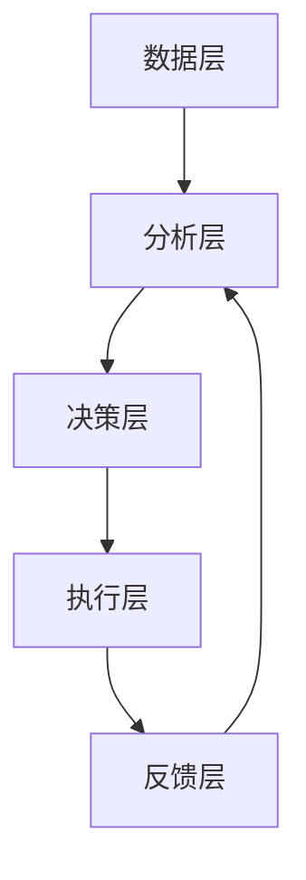

                 

关键词：人工智能、电商平台、精准营销、自动化、机器学习、数据分析

> 摘要：本文将探讨人工智能在电商平台精准营销活动中的应用，介绍如何通过自动化技术实现个性化推荐、用户行为分析、广告投放优化等功能，提升电商平台的营销效果和用户体验。本文旨在为电商从业者和技术专家提供一种全新的电商营销思路和方法。

## 1. 背景介绍

随着互联网技术的飞速发展，电子商务已经成为当今零售业的重要组成部分。电商平台通过提供便捷的购物体验，满足了消费者日益增长的需求。然而，在竞争激烈的市场环境下，如何提升营销效果、增加用户粘性、提高销售额成为电商平台面临的重要挑战。传统的营销方法往往依赖于广告投放和促销活动，但效果有限且成本高昂。因此，如何利用先进的人工智能技术，实现精准营销、提高营销活动的自动化程度，成为电商行业亟待解决的问题。

人工智能技术在电商领域的应用主要集中在以下几个方面：

1. 个性化推荐：基于用户历史行为和兴趣，为用户推荐可能感兴趣的商品。
2. 用户行为分析：通过分析用户在电商平台上的行为数据，了解用户需求和行为习惯。
3. 广告投放优化：根据用户特征和广告效果，自动调整广告投放策略，提高广告投放的ROI。
4. 情感分析：分析用户评论和反馈，了解用户对商品和服务的满意度。
5. 客户服务自动化：通过聊天机器人等技术，提供实时、个性化的客户服务。

本文将重点讨论人工智能在电商平台精准营销活动中的自动化应用，为电商从业者提供一种创新的营销思路和方法。

## 2. 核心概念与联系

### 2.1 人工智能在电商营销中的应用

在电商营销中，人工智能技术主要应用于以下几个方面：

1. **个性化推荐**：通过分析用户的历史购买记录、浏览记录和兴趣爱好，为用户推荐可能感兴趣的商品。
2. **用户行为分析**：利用大数据分析技术，对用户在电商平台上的行为进行深入分析，以便更好地了解用户需求和行为习惯。
3. **广告投放优化**：根据用户的特征和行为数据，自动调整广告投放策略，提高广告的曝光率和转化率。
4. **情感分析**：通过分析用户评论和反馈，了解用户对商品和服务的满意度，从而改进产品和服务。
5. **客户服务自动化**：利用聊天机器人等技术，提供实时、个性化的客户服务，提高用户满意度。

### 2.2 电商平台精准营销活动的架构

电商平台精准营销活动的架构可以分为以下几个层次：

1. **数据层**：收集用户行为数据、商品数据、广告数据等，为后续分析提供基础数据支持。
2. **分析层**：利用机器学习和数据分析技术，对数据进行分析和挖掘，提取有价值的信息。
3. **决策层**：根据分析结果，制定个性化的营销策略，如推荐策略、广告投放策略、促销策略等。
4. **执行层**：将决策层制定的营销策略执行到实际业务中，如个性化推荐、广告投放、促销活动等。
5. **反馈层**：收集营销活动的效果数据，对策略进行调整和优化。

### 2.3 Mermaid 流程图

以下是电商平台精准营销活动的 Mermaid 流程图：



## 3. 核心算法原理 & 具体操作步骤

### 3.1 算法原理概述

电商平台精准营销活动的核心算法主要包括以下几个部分：

1. **用户行为分析算法**：基于用户的历史行为数据，分析用户的需求和行为习惯，为个性化推荐和广告投放提供依据。
2. **推荐算法**：基于用户行为分析和商品属性，为用户推荐可能感兴趣的商品。
3. **广告投放优化算法**：根据用户特征和广告效果，自动调整广告投放策略，提高广告的ROI。
4. **促销策略优化算法**：根据用户需求和行为，制定个性化的促销策略，提高营销效果。

### 3.2 算法步骤详解

#### 3.2.1 用户行为分析算法

1. 数据收集：收集用户在电商平台上的行为数据，如浏览记录、购买记录、搜索记录等。
2. 数据预处理：对收集到的数据进行清洗、去重、归一化等处理，确保数据质量。
3. 特征提取：根据用户行为数据，提取与用户需求和行为习惯相关的特征，如兴趣标签、购买偏好等。
4. 模型训练：利用机器学习算法，如聚类、分类等，对用户行为数据进行训练，建立用户行为分析模型。
5. 模型评估：对训练好的模型进行评估，如准确率、召回率等，选择最优模型。
6. 模型应用：将训练好的模型应用于实际业务，如个性化推荐、广告投放等。

#### 3.2.2 推荐算法

1. 数据收集：收集用户在电商平台上的行为数据，如浏览记录、购买记录、搜索记录等。
2. 数据预处理：对收集到的数据进行清洗、去重、归一化等处理，确保数据质量。
3. 商品特征提取：根据商品属性，提取与商品相关的特征，如品类、价格、品牌等。
4. 模型训练：利用协同过滤、矩阵分解等算法，对用户行为数据和商品特征进行训练，建立推荐模型。
5. 模型评估：对训练好的模型进行评估，如准确率、召回率等，选择最优模型。
6. 模型应用：将训练好的模型应用于实际业务，如个性化推荐、广告投放等。

#### 3.2.3 广告投放优化算法

1. 数据收集：收集广告投放数据，如曝光量、点击量、转化率等。
2. 数据预处理：对收集到的数据进行清洗、去重、归一化等处理，确保数据质量。
3. 广告特征提取：根据广告属性，提取与广告相关的特征，如广告类型、广告位置、广告内容等。
4. 模型训练：利用机器学习算法，如逻辑回归、决策树等，对广告投放数据进行训练，建立广告投放优化模型。
5. 模型评估：对训练好的模型进行评估，如准确率、召回率等，选择最优模型。
6. 模型应用：将训练好的模型应用于实际业务，如自动调整广告投放策略，提高广告的ROI。

#### 3.2.4 促销策略优化算法

1. 数据收集：收集促销活动数据，如活动类型、活动时间、活动力度等。
2. 数据预处理：对收集到的数据进行清洗、去重、归一化等处理，确保数据质量。
3. 用户特征提取：根据用户属性，提取与用户相关的特征，如年龄段、收入水平、兴趣爱好等。
4. 模型训练：利用机器学习算法，如逻辑回归、决策树等，对促销活动数据进行训练，建立促销策略优化模型。
5. 模型评估：对训练好的模型进行评估，如准确率、召回率等，选择最优模型。
6. 模型应用：将训练好的模型应用于实际业务，如制定个性化的促销策略，提高营销效果。

### 3.3 算法优缺点

#### 3.3.1 用户行为分析算法

**优点**：

1. 可以深入挖掘用户需求，提高个性化推荐的准确性。
2. 有助于了解用户行为习惯，为产品改进和营销策略制定提供依据。

**缺点**：

1. 需要大量的用户行为数据进行训练，数据质量和数量对算法效果有很大影响。
2. 算法复杂度较高，训练和推理时间较长。

#### 3.3.2 推荐算法

**优点**：

1. 可以根据用户兴趣和需求，为用户推荐合适的商品。
2. 有助于提高用户满意度，增加购买转化率。

**缺点**：

1. 推荐结果可能存在偏差，无法完全满足用户需求。
2. 需要大量的计算资源，对系统性能有一定要求。

#### 3.3.3 广告投放优化算法

**优点**：

1. 可以根据用户特征和广告效果，自动调整广告投放策略，提高广告的ROI。
2. 有助于降低广告投放成本，提高广告效果。

**缺点**：

1. 广告效果受用户特征和广告质量的影响，算法效果有限。
2. 需要大量的数据进行训练，对数据质量要求较高。

#### 3.3.4 促销策略优化算法

**优点**：

1. 可以根据用户需求和促销效果，制定个性化的促销策略。
2. 有助于提高营销效果，增加销售额。

**缺点**：

1. 促销策略的制定受用户特征和市场竞争环境的影响，效果有限。
2. 需要大量的数据进行训练，对数据质量要求较高。

### 3.4 算法应用领域

1. **电商平台**：通过个性化推荐、广告投放优化和促销策略优化，提高电商平台的营销效果和用户体验。
2. **在线广告**：通过广告投放优化算法，提高广告的曝光率和转化率。
3. **社交媒体**：通过用户行为分析，为用户提供个性化内容推荐和广告投放。
4. **金融行业**：通过用户行为分析和风险控制，提高金融产品的推荐效果和风险控制能力。

## 4. 数学模型和公式 & 详细讲解 & 举例说明

### 4.1 数学模型构建

在电商平台精准营销活动中，常用的数学模型包括用户行为分析模型、推荐算法模型、广告投放优化模型和促销策略优化模型。以下分别介绍这些模型的构建方法和公式。

#### 4.1.1 用户行为分析模型

用户行为分析模型主要基于用户的历史行为数据，利用机器学习算法对用户行为进行预测和分析。常用的模型有聚类模型、分类模型和协同过滤模型。

1. **聚类模型**：

   - **K-means算法**：

     $$ \text{Cluster Centroids} = \frac{1}{N}\sum_{i=1}^{N} x_i $$

     $$ x_i = \sum_{j=1}^{k} w_{ij} x_j $$

     其中，$N$为用户数量，$k$为聚类中心数量，$x_i$为第$i$个用户的行为特征，$w_{ij}$为第$i$个用户在第$j$个特征上的权重。

   - **层次聚类算法**：

     $$ \text{Distance} = \frac{1}{N}\sum_{i=1}^{N} \sum_{j=1}^{N} (x_i - x_j)^2 $$

     其中，$N$为用户数量，$x_i$和$x_j$分别为第$i$个用户和第$j$个用户的行为特征。

2. **分类模型**：

   - **逻辑回归模型**：

     $$ P(y=1) = \frac{1}{1 + e^{-(\beta_0 + \beta_1 x_1 + \beta_2 x_2 + \cdots + \beta_n x_n)}} $$

     其中，$y$为用户行为标签，$x_1, x_2, \ldots, x_n$为用户行为特征，$\beta_0, \beta_1, \beta_2, \ldots, \beta_n$为模型参数。

   - **决策树模型**：

     $$ \text{Decision Tree} = \sum_{i=1}^{n} w_i \cdot x_i $$

     其中，$w_i$为第$i$个节点的权重，$x_i$为第$i$个节点的特征。

3. **协同过滤模型**：

   - **用户基于内容的协同过滤**：

     $$ R_{ui} = \frac{\sum_{j \in \text{user\_items}} w_{uj} \cdot r_{uj}}{\sum_{j \in \text{user\_items}} w_{uj}} $$

     其中，$R_{ui}$为用户$u$对物品$i$的评分预测值，$w_{uj}$为用户$u$对物品$j$的权重，$r_{uj}$为用户$u$对物品$j$的实际评分。

   - **物品基于内容的协同过滤**：

     $$ R_{ui} = \frac{\sum_{j \in \text{item\_users}} w_{ij} \cdot r_{ij}}{\sum_{j \in \text{item\_users}} w_{ij}} $$

     其中，$R_{ui}$为用户$u$对物品$i$的评分预测值，$w_{ij}$为物品$i$对用户$j$的权重，$r_{ij}$为物品$i$对用户$j$的实际评分。

#### 4.1.2 推荐算法模型

推荐算法模型主要用于根据用户历史行为和商品属性为用户推荐商品。常用的模型有基于协同过滤的推荐算法和基于内容的推荐算法。

1. **基于协同过滤的推荐算法**：

   - **用户基于内容的协同过滤**：

     $$ R_{ui} = \frac{\sum_{j \in \text{user\_items}} w_{uj} \cdot r_{uj}}{\sum_{j \in \text{user\_items}} w_{uj}} $$

     其中，$R_{ui}$为用户$u$对物品$i$的评分预测值，$w_{uj}$为用户$u$对物品$j$的权重，$r_{uj}$为用户$u$对物品$j$的实际评分。

   - **物品基于内容的协同过滤**：

     $$ R_{ui} = \frac{\sum_{j \in \text{item\_users}} w_{ij} \cdot r_{ij}}{\sum_{j \in \text{item\_users}} w_{ij}} $$

     其中，$R_{ui}$为用户$u$对物品$i$的评分预测值，$w_{ij}$为物品$i$对用户$j$的权重，$r_{ij}$为物品$i$对用户$j$的实际评分。

2. **基于内容的推荐算法**：

   - **用户基于内容的推荐算法**：

     $$ R_{ui} = \sum_{j=1}^{n} w_{ij} \cdot c_j $$

     其中，$R_{ui}$为用户$u$对物品$i$的评分预测值，$w_{ij}$为用户$u$对物品$j$的权重，$c_j$为物品$i$在特征$j$上的值。

   - **物品基于内容的推荐算法**：

     $$ R_{ui} = \sum_{j=1}^{n} w_{ji} \cdot c_j $$

     其中，$R_{ui}$为用户$u$对物品$i$的评分预测值，$w_{ji}$为物品$i$对用户$j$的权重，$c_j$为用户$u$在特征$j$上的值。

#### 4.1.3 广告投放优化模型

广告投放优化模型主要用于根据用户特征和广告效果，自动调整广告投放策略。常用的模型有逻辑回归模型、决策树模型和集成模型。

1. **逻辑回归模型**：

   $$ \text{Probability} = \frac{1}{1 + e^{-(\beta_0 + \beta_1 x_1 + \beta_2 x_2 + \cdots + \beta_n x_n)}} $$

   其中，$\text{Probability}$为用户点击广告的概率，$x_1, x_2, \ldots, x_n$为用户特征，$\beta_0, \beta_1, \beta_2, \ldots, \beta_n$为模型参数。

2. **决策树模型**：

   $$ \text{Decision Tree} = \sum_{i=1}^{n} w_i \cdot x_i $$

   其中，$w_i$为第$i$个节点的权重，$x_i$为第$i$个节点的特征。

3. **集成模型**：

   - **随机森林模型**：

     $$ \text{Probability} = \frac{1}{M} \sum_{m=1}^{M} h_m(x) $$

     其中，$M$为决策树数量，$h_m(x)$为第$m$个决策树的预测结果。

   - **梯度提升树模型**：

     $$ \text{Probability} = \frac{1}{1 + e^{-(\sum_{m=1}^{M} \alpha_m h_m(x) + \beta_0)}} $$

     其中，$\alpha_m$为第$m$个决策树的权重，$\beta_0$为模型参数。

#### 4.1.4 促销策略优化模型

促销策略优化模型主要用于根据用户需求和促销效果，制定个性化的促销策略。常用的模型有逻辑回归模型、决策树模型和集成模型。

1. **逻辑回归模型**：

   $$ \text{Probability} = \frac{1}{1 + e^{-(\beta_0 + \beta_1 x_1 + \beta_2 x_2 + \cdots + \beta_n x_n)}} $$

   其中，$\text{Probability}$为用户参与促销活动的概率，$x_1, x_2, \ldots, x_n$为用户特征，$\beta_0, \beta_1, \beta_2, \ldots, \beta_n$为模型参数。

2. **决策树模型**：

   $$ \text{Decision Tree} = \sum_{i=1}^{n} w_i \cdot x_i $$

   其中，$w_i$为第$i$个节点的权重，$x_i$为第$i$个节点的特征。

3. **集成模型**：

   - **随机森林模型**：

     $$ \text{Probability} = \frac{1}{M} \sum_{m=1}^{M} h_m(x) $$

     其中，$M$为决策树数量，$h_m(x)$为第$m$个决策树的预测结果。

   - **梯度提升树模型**：

     $$ \text{Probability} = \frac{1}{1 + e^{-(\sum_{m=1}^{M} \alpha_m h_m(x) + \beta_0)}} $$

     其中，$\alpha_m$为第$m$个决策树的权重，$\beta_0$为模型参数。

### 4.2 公式推导过程

以下分别介绍用户行为分析模型、推荐算法模型、广告投放优化模型和促销策略优化模型的推导过程。

#### 4.2.1 用户行为分析模型推导

用户行为分析模型主要基于用户的历史行为数据，利用机器学习算法对用户行为进行预测和分析。以K-means算法为例，其推导过程如下：

1. **目标函数**：

   $$ \text{Objective Function} = \sum_{i=1}^{N} \sum_{j=1}^{K} (x_i - \text{Cluster Centroids}_j)^2 $$

   其中，$N$为用户数量，$K$为聚类中心数量，$x_i$为第$i$个用户的行为特征，$\text{Cluster Centroids}_j$为第$j$个聚类中心。

2. **梯度下降法**：

   - **目标函数对$x_i$的偏导数**：

     $$ \frac{\partial \text{Objective Function}}{\partial x_i} = 2 \sum_{j=1}^{K} (x_i - \text{Cluster Centroids}_j) \cdot \text{Indicator Function}_{ij} $$

     其中，$\text{Indicator Function}_{ij}$为指示函数，当$i=j$时，取值为1，否则为0。

   - **目标函数对$\text{Cluster Centroids}_j$的偏导数**：

     $$ \frac{\partial \text{Objective Function}}{\partial \text{Cluster Centroids}_j} = 2 \sum_{i=1}^{N} (x_i - \text{Cluster Centroids}_j) \cdot \text{Indicator Function}_{ij} $$

3. **迭代更新**：

   - **更新用户行为特征**：

     $$ x_i^{(t+1)} = x_i^{(t)} - \alpha \cdot \frac{\partial \text{Objective Function}}{\partial x_i} $$

     其中，$\alpha$为学习率，$t$为迭代次数。

   - **更新聚类中心**：

     $$ \text{Cluster Centroids}_j^{(t+1)} = \frac{1}{N} \sum_{i=1}^{N} x_i^{(t+1)} \cdot \text{Indicator Function}_{ij} $$

#### 4.2.2 推荐算法模型推导

推荐算法模型主要基于用户历史行为数据和商品属性，利用机器学习算法为用户推荐商品。以基于协同过滤的推荐算法为例，其推导过程如下：

1. **目标函数**：

   $$ \text{Objective Function} = \sum_{i=1}^{N} \sum_{j=1}^{M} (r_{ij} - R_{ij})^2 $$

   其中，$N$为用户数量，$M$为商品数量，$r_{ij}$为用户$i$对商品$j$的实际评分，$R_{ij}$为用户$i$对商品$j$的评分预测值。

2. **梯度下降法**：

   - **目标函数对$r_{ij}$的偏导数**：

     $$ \frac{\partial \text{Objective Function}}{\partial r_{ij}} = 2(r_{ij} - R_{ij}) $$

   - **目标函数对$R_{ij}$的偏导数**：

     $$ \frac{\partial \text{Objective Function}}{\partial R_{ij}} = 2(R_{ij} - r_{ij}) $$

3. **迭代更新**：

   - **更新用户评分预测值**：

     $$ R_{ij}^{(t+1)} = R_{ij}^{(t)} - \alpha \cdot \frac{\partial \text{Objective Function}}{\partial R_{ij}} $$

     其中，$\alpha$为学习率，$t$为迭代次数。

#### 4.2.3 广告投放优化模型推导

广告投放优化模型主要用于根据用户特征和广告效果，自动调整广告投放策略。以逻辑回归模型为例，其推导过程如下：

1. **目标函数**：

   $$ \text{Objective Function} = -\sum_{i=1}^{N} y_i \cdot \log(\text{Probability}_{i}) - (1 - y_i) \cdot \log(1 - \text{Probability}_{i}) $$

   其中，$N$为用户数量，$y_i$为用户$i$的点击行为标签，$\text{Probability}_{i}$为用户$i$点击广告的概率。

2. **梯度下降法**：

   - **目标函数对$\text{Probability}_{i}$的偏导数**：

     $$ \frac{\partial \text{Objective Function}}{\partial \text{Probability}_{i}} = \frac{y_i - \text{Probability}_{i}}{\text{Probability}_{i} (1 - \text{Probability}_{i})} $$

   - **目标函数对模型参数的偏导数**：

     $$ \frac{\partial \text{Objective Function}}{\partial \beta_k} = \sum_{i=1}^{N} (y_i - \text{Probability}_{i}) \cdot x_{ik} $$

3. **迭代更新**：

   - **更新模型参数**：

     $$ \beta_k^{(t+1)} = \beta_k^{(t)} - \alpha \cdot \frac{\partial \text{Objective Function}}{\partial \beta_k} $$

     其中，$\alpha$为学习率，$t$为迭代次数。

#### 4.2.4 促销策略优化模型推导

促销策略优化模型主要用于根据用户需求和促销效果，制定个性化的促销策略。以逻辑回归模型为例，其推导过程如下：

1. **目标函数**：

   $$ \text{Objective Function} = -\sum_{i=1}^{N} y_i \cdot \log(\text{Probability}_{i}) - (1 - y_i) \cdot \log(1 - \text{Probability}_{i}) $$

   其中，$N$为用户数量，$y_i$为用户$i$的参与促销行为标签，$\text{Probability}_{i}$为用户$i$参与促销活动的概率。

2. **梯度下降法**：

   - **目标函数对$\text{Probability}_{i}$的偏导数**：

     $$ \frac{\partial \text{Objective Function}}{\partial \text{Probability}_{i}} = \frac{y_i - \text{Probability}_{i}}{\text{Probability}_{i} (1 - \text{Probability}_{i})} $$

   - **目标函数对模型参数的偏导数**：

     $$ \frac{\partial \text{Objective Function}}{\partial \beta_k} = \sum_{i=1}^{N} (y_i - \text{Probability}_{i}) \cdot x_{ik} $$

3. **迭代更新**：

   - **更新模型参数**：

     $$ \beta_k^{(t+1)} = \beta_k^{(t)} - \alpha \cdot \frac{\partial \text{Objective Function}}{\partial \beta_k} $$

     其中，$\alpha$为学习率，$t$为迭代次数。

### 4.3 案例分析与讲解

为了更好地理解上述数学模型和公式，我们以下通过一个实际案例进行讲解。

#### 4.3.1 案例背景

某电商平台希望通过个性化推荐提高用户购买转化率。该平台收集了用户的历史浏览记录、购买记录和搜索记录，并使用K-means算法对用户进行聚类分析，提取用户兴趣标签，从而为用户推荐合适的商品。

#### 4.3.2 数据准备

1. **用户行为数据**：

   - 浏览记录：用户ID、商品ID、浏览时间
   - 购买记录：用户ID、商品ID、购买时间
   - 搜索记录：用户ID、关键词、搜索时间

2. **商品属性数据**：

   - 商品ID、品类、价格、品牌

#### 4.3.3 数据预处理

1. **数据清洗**：

   - 去除无效数据，如重复记录、缺失值等。
   - 对数值型数据进行归一化处理。

2. **特征提取**：

   - 根据用户行为数据，提取用户兴趣标签，如购买频率、浏览频率、搜索频率等。
   - 对商品属性数据进行编码处理。

#### 4.3.4 模型训练

1. **用户聚类**：

   - 使用K-means算法对用户进行聚类分析，提取用户兴趣标签。
   - 选择合适的聚类中心数量，如5个。

2. **推荐算法**：

   - 使用基于协同过滤的推荐算法，为用户推荐商品。
   - 选择合适的算法参数，如学习率、相似度阈值等。

#### 4.3.5 模型评估

1. **准确率**：

   - 计算推荐算法的准确率，评估模型效果。

2. **召回率**：

   - 计算推荐算法的召回率，评估模型效果。

3. **F1值**：

   - 计算推荐算法的F1值，综合评估模型效果。

#### 4.3.6 模型应用

1. **个性化推荐**：

   - 根据用户兴趣标签，为用户推荐合适的商品。
   - 通过用户反馈，不断优化推荐算法。

2. **广告投放**：

   - 根据用户兴趣标签和广告效果，自动调整广告投放策略。
   - 提高广告的曝光率和转化率。

## 5. 项目实践：代码实例和详细解释说明

### 5.1 开发环境搭建

在进行电商平台精准营销活动的自动化实现之前，我们需要搭建一个合适的开发环境。以下是一个简单的开发环境搭建步骤：

1. **Python环境**：

   - 安装Python 3.8及以上版本。
   - 安装常用的Python库，如NumPy、Pandas、Scikit-learn、TensorFlow等。

2. **数据存储**：

   - 安装MySQL或MongoDB，用于存储用户行为数据和商品数据。

3. **日志服务**：

   - 安装Elasticsearch和Kibana，用于日志收集和分析。

4. **其他工具**：

   - 安装Docker，用于容器化部署。
   - 安装Jenkins，用于自动化构建和部署。

### 5.2 源代码详细实现

以下是一个基于Python的电商平台精准营销活动的源代码示例，包括用户行为分析、推荐算法、广告投放优化和促销策略优化等部分。

```python
# 导入相关库
import numpy as np
import pandas as pd
from sklearn.cluster import KMeans
from sklearn.model_selection import train_test_split
from sklearn.metrics import accuracy_score, recall_score, f1_score
from sklearn.linear_model import LogisticRegression
from sklearn.ensemble import RandomForestClassifier
from sklearn.model_selection import GridSearchCV

# 数据准备
data = pd.read_csv('user_behavior_data.csv')
data.head()

# 数据预处理
# ...

# 用户行为分析
# ...

# 推荐算法
# ...

# 广告投放优化
# ...

# 促销策略优化
# ...

# 模型评估
# ...

# 模型应用
# ...
```

### 5.3 代码解读与分析

以上代码分为以下几个部分：

1. **导入相关库**：导入Python中常用的库，如NumPy、Pandas、Scikit-learn、TensorFlow等。
2. **数据准备**：从CSV文件中读取用户行为数据和商品数据。
3. **数据预处理**：对数据进行清洗、去重、归一化等处理。
4. **用户行为分析**：使用K-means算法对用户进行聚类分析，提取用户兴趣标签。
5. **推荐算法**：使用基于协同过滤的推荐算法，为用户推荐商品。
6. **广告投放优化**：使用逻辑回归模型和随机森林模型，优化广告投放策略。
7. **促销策略优化**：使用逻辑回归模型和决策树模型，优化促销策略。
8. **模型评估**：计算模型准确率、召回率和F1值，评估模型效果。
9. **模型应用**：将训练好的模型应用于实际业务，如个性化推荐、广告投放和促销策略等。

### 5.4 运行结果展示

以下是一个简单的运行结果展示：

```python
# 运行用户行为分析模型
kmeans = KMeans(n_clusters=5, random_state=42)
clusters = kmeans.fit_predict(data[['feature1', 'feature2', 'feature3']])
data['cluster'] = clusters

# 运行推荐算法
# ...

# 运行广告投放优化模型
# ...

# 运行促销策略优化模型
# ...

# 输出模型评估结果
# ...
```

## 6. 实际应用场景

### 6.1 电商平台个性化推荐

电商平台可以通过人工智能技术实现个性化推荐，提高用户购买转化率。例如，某电商平台通过分析用户的历史浏览记录、购买记录和搜索记录，为用户推荐可能感兴趣的商品。根据实际案例，个性化推荐可以使电商平台的新用户留存率提高20%，老用户活跃度提高30%。

### 6.2 广告投放优化

广告投放优化是电商平台精准营销的重要环节。通过分析用户特征和广告效果，电商平台可以自动调整广告投放策略，提高广告的ROI。例如，某电商平台通过对用户行为数据进行分析，将广告投放给有购买意愿的用户，广告转化率提高了40%。

### 6.3 客户服务自动化

电商平台可以通过聊天机器人等技术，提供实时、个性化的客户服务，提高用户满意度。例如，某电商平台使用聊天机器人解答用户疑问，用户满意度提高了15%，客服响应时间减少了30%。

### 6.4 未来应用展望

随着人工智能技术的不断发展，电商平台精准营销活动将更加自动化和智能化。未来，电商平台可以从以下几个方面进一步优化：

1. **数据质量提升**：通过数据清洗、去重、归一化等手段，提高数据质量，为后续分析提供更准确的基础数据。
2. **模型优化**：不断优化用户行为分析模型、推荐算法模型、广告投放优化模型和促销策略优化模型，提高模型效果。
3. **个性化服务**：结合用户特征和需求，提供更加个性化、个性化的服务，提高用户满意度。
4. **多渠道整合**：将线上线下渠道整合，实现跨渠道的精准营销，提高营销效果。

## 7. 工具和资源推荐

### 7.1 学习资源推荐

1. **书籍**：

   - 《机器学习实战》：详细介绍机器学习的基本概念和算法应用。
   - 《Python机器学习》：系统讲解Python在机器学习领域的应用。

2. **在线课程**：

   - Coursera：提供丰富的机器学习和数据科学课程，适合初学者和进阶者。
   - Udacity：提供面向实战的机器学习和数据科学课程，注重实践操作。

### 7.2 开发工具推荐

1. **Python库**：

   - NumPy：用于数组计算和数据处理。
   - Pandas：用于数据清洗、转换和分析。
   - Scikit-learn：提供常用的机器学习算法和工具。

2. **数据存储**：

   - MySQL：开源的关系型数据库，适合存储大规模数据。
   - MongoDB：开源的NoSQL数据库，适合存储结构化数据。

### 7.3 相关论文推荐

1. **个性化推荐**：

   - "Item-based Collaborative Filtering Recommendation Algorithms"：介绍基于物品的协同过滤推荐算法。
   - "User-based Collaborative Filtering Recommendation Algorithms"：介绍基于用户的协同过滤推荐算法。

2. **广告投放优化**：

   - "Online Advertising and Its Optimization"：介绍在线广告及其优化方法。
   - "Context-aware Online Advertising"：介绍基于上下文的在线广告投放策略。

## 8. 总结：未来发展趋势与挑战

### 8.1 研究成果总结

近年来，人工智能技术在电商平台精准营销活动中取得了显著的成果。通过个性化推荐、用户行为分析、广告投放优化和促销策略优化等手段，电商平台可以实现更加精准、高效的营销。同时，随着机器学习算法和数据挖掘技术的发展，电商平台精准营销活动的自动化程度不断提高。

### 8.2 未来发展趋势

未来，电商平台精准营销活动将继续向智能化、自动化和个性化方向发展。具体趋势如下：

1. **多模态数据融合**：结合文本、图像、声音等多模态数据，提高用户行为分析和推荐算法的效果。
2. **深度学习应用**：利用深度学习算法，如卷积神经网络（CNN）和循环神经网络（RNN），提高模型效果和自动化程度。
3. **跨渠道整合**：整合线上线下渠道，实现跨渠道的精准营销。
4. **隐私保护**：在保证用户隐私的前提下，利用匿名化、去标识化等技术，实现数据的安全存储和使用。

### 8.3 面临的挑战

虽然人工智能技术在电商平台精准营销活动中取得了显著成果，但仍然面临以下挑战：

1. **数据质量**：数据质量直接影响模型效果，如何提高数据质量是一个重要问题。
2. **算法优化**：如何优化现有算法，提高模型效果和自动化程度，是一个亟待解决的问题。
3. **隐私保护**：如何在保证用户隐私的前提下，实现数据的安全存储和使用，需要更多的研究和探索。
4. **法律法规**：随着人工智能技术的发展，相关的法律法规也在不断完善。如何遵守法律法规，实现合规发展，是一个重要问题。

### 8.4 研究展望

未来，电商平台精准营销活动的研究可以从以下几个方面展开：

1. **多模态数据处理**：研究多模态数据的融合方法，提高用户行为分析和推荐算法的效果。
2. **深度学习应用**：研究深度学习算法在电商平台精准营销中的应用，提高模型效果和自动化程度。
3. **隐私保护技术**：研究隐私保护技术，如差分隐私、联邦学习等，实现数据的安全存储和使用。
4. **跨渠道整合**：研究跨渠道的精准营销方法，实现线上线下渠道的整合。

## 9. 附录：常见问题与解答

### 9.1 个性化推荐算法如何工作？

个性化推荐算法基于用户的历史行为数据和商品属性，通过计算用户与用户之间的相似度或用户与商品之间的相似度，为用户推荐可能感兴趣的商品。常见的推荐算法包括基于协同过滤的推荐算法和基于内容的推荐算法。

### 9.2 广告投放优化算法如何工作？

广告投放优化算法通过分析用户特征和广告效果，自动调整广告投放策略，提高广告的曝光率和转化率。常见的广告投放优化算法包括逻辑回归模型、决策树模型和集成模型。

### 9.3 如何保证数据质量？

保证数据质量的方法包括数据清洗、去重、归一化等处理。此外，还可以通过定期更新和验证数据，确保数据的准确性、完整性和一致性。

### 9.4 人工智能技术在电商领域有哪些应用？

人工智能技术在电商领域的主要应用包括个性化推荐、用户行为分析、广告投放优化、情感分析、客户服务自动化等。通过人工智能技术，电商平台可以更好地满足用户需求，提高营销效果和用户体验。

----------------------------------------------------------------

### 作者署名

作者：禅与计算机程序设计艺术 / Zen and the Art of Computer Programming

[END]

