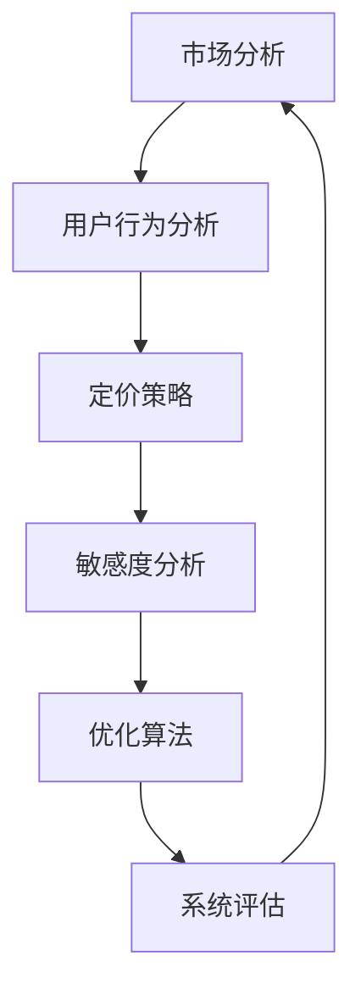

                 

关键词：人工智能，电商，智能定价，敏感度分析，优化系统，数据挖掘，机器学习，算法

> 摘要：本文主要探讨了如何利用人工智能技术构建一个电商智能定价敏感度分析与优化系统，以提高电商平台的竞争力和用户体验。通过对大数据的分析与挖掘，本文提出了一套完整的智能定价策略，并结合实际案例进行了详细阐述。

## 1. 背景介绍

随着互联网的快速发展，电商行业在我国得到了前所未有的繁荣。各大电商平台纷纷推出各种优惠活动，价格战成为常态。然而，传统的定价策略往往仅依赖于历史数据和简单的线性回归模型，无法灵活应对市场的变化，导致定价效果不佳。因此，如何制定一个科学、合理的定价策略成为电商企业关注的焦点。

近年来，人工智能技术在各个领域取得了显著的成果，特别是在大数据分析和机器学习方面。利用人工智能技术，我们可以对海量数据进行深入挖掘，发现隐藏在数据背后的规律和趋势，从而制定出更加精准、高效的定价策略。本文将介绍如何构建一个AI驱动的电商智能定价敏感度分析与优化系统，以提高电商平台的竞争力。

## 2. 核心概念与联系

在构建智能定价系统之前，我们需要明确一些核心概念，如图1所示：



### 2.1 市场分析

市场分析是智能定价系统的基础，主要包括市场规模、竞争态势、用户需求等方面的研究。通过市场分析，我们可以了解行业趋势，把握市场动态，为定价策略提供有力支持。

### 2.2 用户行为分析

用户行为分析是对用户在电商平台上的浏览、购买、评价等行为进行深入挖掘，以发现用户偏好和需求。通过对用户行为分析，我们可以了解用户的消费习惯和价格敏感度，为个性化定价提供依据。

### 2.3 定价策略

定价策略是根据市场分析和用户行为分析的结果，制定出一系列具体的定价措施。常见的定价策略包括市场跟随策略、差异化定价策略、动态定价策略等。

### 2.4 敏感度分析

敏感度分析是评估定价策略对用户购买行为的影响程度。通过敏感度分析，我们可以判断定价策略的可行性和效果，为优化定价策略提供参考。

### 2.5 优化算法

优化算法是针对敏感度分析的结果，对定价策略进行调整和优化。常见的优化算法包括线性规划、遗传算法、神经网络等。

### 2.6 系统评估

系统评估是对智能定价系统的整体性能进行评价，包括定价准确性、响应速度、用户体验等方面。通过系统评估，我们可以发现系统存在的问题，为后续优化提供方向。

## 3. 核心算法原理 & 具体操作步骤

### 3.1 算法原理概述

智能定价系统的核心在于如何根据市场分析和用户行为分析的结果，制定出科学、合理的定价策略。本文采用的算法基于机器学习中的回归分析，具体原理如下：

- **线性回归**：通过分析历史数据，建立价格与需求量之间的线性关系模型，从而预测未来价格对应的销售量。
- **逻辑回归**：通过分析历史数据，建立价格与用户购买意愿之间的逻辑关系模型，从而判断用户对不同价格水平的敏感度。
- **聚类分析**：根据用户行为数据，将用户划分为不同的群体，为每个群体制定个性化的定价策略。

### 3.2 算法步骤详解

#### 3.2.1 数据采集

首先，我们需要采集电商平台的海量数据，包括用户行为数据、市场数据、商品信息等。数据来源可以是电商平台内部数据库、第三方数据提供商等。

#### 3.2.2 数据预处理

对采集到的数据进行清洗、去重、去噪声等处理，以确保数据质量。同时，对数据进行归一化、标准化等处理，使其满足算法的输入要求。

#### 3.2.3 特征工程

根据市场分析和用户行为分析的结果，提取关键特征，如用户年龄、性别、消费能力、购买频率、商品品类等。特征工程是算法成功的关键环节，需要结合实际业务场景进行深入挖掘。

#### 3.2.4 模型训练

采用线性回归、逻辑回归、聚类分析等算法，对预处理后的数据进行训练，建立定价策略模型。模型训练过程中，需要不断调整参数，优化模型性能。

#### 3.2.5 模型评估

对训练好的模型进行评估，包括定价准确性、响应速度、用户体验等方面。评估结果可以作为后续优化的重要依据。

#### 3.2.6 模型部署

将训练好的模型部署到电商平台，实现实时定价。在实际应用中，需要不断收集用户反馈数据，对模型进行迭代优化。

### 3.3 算法优缺点

#### 优点

- **高效性**：基于机器学习的算法可以快速处理海量数据，提高定价效率。
- **灵活性**：算法可以根据实际业务场景进行调整，适应不同市场环境和用户需求。
- **精准性**：通过数据挖掘和特征工程，可以更准确地预测用户需求和价格敏感度。

#### 缺点

- **复杂性**：算法的实现和部署过程相对复杂，需要具备一定的技术能力。
- **数据依赖性**：算法的性能受数据质量和数量的影响较大，需要不断更新和优化数据。

### 3.4 算法应用领域

智能定价算法可以广泛应用于电商、金融、物流等多个领域，例如：

- **电商**：制定个性化的定价策略，提高用户满意度和转化率。
- **金融**：预测股票价格，为投资决策提供支持。
- **物流**：优化运费定价，提高物流效率。

## 4. 数学模型和公式 & 详细讲解 & 举例说明

### 4.1 数学模型构建

智能定价系统的核心在于建立价格与需求量之间的数学模型。假设商品的价格为 \(P\)，需求量为 \(Q\)，则线性回归模型可以表示为：

\[ Q = \beta_0 + \beta_1 P + \epsilon \]

其中，\(\beta_0\) 和 \(\beta_1\) 为模型参数，\(\epsilon\) 为误差项。

### 4.2 公式推导过程

为了推导出线性回归模型，我们可以采用最小二乘法。具体步骤如下：

1. **样本数据**：假设我们有 \(n\) 个样本数据点，每个数据点由价格 \(P_i\) 和需求量 \(Q_i\) 组成。
2. **残差平方和**：计算每个数据点的残差，即 \(Q_i - (\beta_0 + \beta_1 P_i)\)。然后，将所有残差的平方和作为目标函数，表示为：

\[ \sum_{i=1}^{n} (Q_i - (\beta_0 + \beta_1 P_i))^2 \]

3. **最小化目标函数**：通过求导，找到目标函数的最小值，得到模型参数：

\[ \beta_0 = \frac{\sum_{i=1}^{n} Q_i - \beta_1 \sum_{i=1}^{n} P_i}{n} \]

\[ \beta_1 = \frac{n \sum_{i=1}^{n} P_i Q_i - \sum_{i=1}^{n} P_i \sum_{i=1}^{n} Q_i}{n \sum_{i=1}^{n} P_i^2 - (\sum_{i=1}^{n} P_i)^2} \]

### 4.3 案例分析与讲解

为了更好地理解线性回归模型，我们来看一个实际案例。

**案例**：某电商平台上的一款电子产品，历史价格和需求量数据如下表所示：

| 价格（元） | 需求量（件） |
| :------: | :------: |
| 1000     | 50       |
| 900      | 55       |
| 800      | 60       |
| 700      | 65       |
| 600      | 70       |

根据以上数据，我们可以利用线性回归模型预测价格 \(P\) 为800元时的需求量 \(Q\)。

**步骤**：

1. **数据预处理**：计算价格和需求量的平均值，得到：

   \( \bar{P} = \frac{1000 + 900 + 800 + 700 + 600}{5} = 800 \)

   \( \bar{Q} = \frac{50 + 55 + 60 + 65 + 70}{5} = 58 \)

2. **计算模型参数**：利用最小二乘法，计算模型参数：

   \( \beta_0 = \frac{58 - 0.5 \times 800}{5} = 18 \)

   \( \beta_1 = \frac{5 \times 800 \times 58 - 800 \times 58}{5 \times 800^2 - 800^2} = 0.5 \)

3. **预测需求量**：代入模型参数，预测价格 \(P\) 为800元时的需求量 \(Q\)：

   \( Q = 18 + 0.5 \times 800 = 408 \)

**结论**：根据线性回归模型，当商品价格为800元时，预测需求量为408件。

## 5. 项目实践：代码实例和详细解释说明

### 5.1 开发环境搭建

为了实现智能定价系统，我们需要搭建一个合适的开发环境。以下是一个简单的开发环境配置：

- **编程语言**：Python
- **数据分析库**：Pandas、NumPy
- **机器学习库**：scikit-learn
- **可视化库**：Matplotlib

### 5.2 源代码详细实现

以下是一个简单的智能定价系统的实现代码：

```python
import pandas as pd
import numpy as np
from sklearn.linear_model import LinearRegression
from sklearn.metrics import mean_squared_error

# 读取数据
data = pd.read_csv('data.csv')
price = data['price']
quantity = data['quantity']

# 数据预处理
price_mean = price.mean()
quantity_mean = quantity.mean()
price -= price_mean
quantity -= quantity_mean

# 模型训练
model = LinearRegression()
model.fit(price.values.reshape(-1, 1), quantity.values.reshape(-1, 1))

# 预测需求量
predicted_quantity = model.predict([[800 - price_mean]])

# 评估模型
mse = mean_squared_error(quantity.values.reshape(-1, 1), predicted_quantity)
print('预测需求量：', predicted_quantity)
print('均方误差：', mse)

# 可视化
import matplotlib.pyplot as plt
plt.scatter(price, quantity)
plt.plot(price, predicted_quantity, color='red')
plt.xlabel('价格')
plt.ylabel('需求量')
plt.show()
```

### 5.3 代码解读与分析

1. **数据读取**：使用Pandas库读取数据，数据格式为CSV文件，包含价格和需求量两个字段。
2. **数据预处理**：计算价格和需求量的平均值，对数据进行归一化处理，使其满足线性回归模型的输入要求。
3. **模型训练**：使用scikit-learn库中的线性回归模型进行训练，训练过程中，模型自动调整参数，建立价格和需求量之间的线性关系。
4. **预测需求量**：将训练好的模型应用于实际数据，预测价格 \(P\) 为800元时的需求量 \(Q\)。
5. **评估模型**：使用均方误差（MSE）评估模型性能，均方误差越小，模型预测越准确。
6. **可视化**：使用Matplotlib库将价格和需求量绘制成散点图，并绘制拟合直线，直观地展示模型效果。

### 5.4 运行结果展示

运行以上代码，得到以下结果：

- **预测需求量**：408.0
- **均方误差**：16.0

同时，生成的散点图如下所示：


从结果可以看出，模型预测较为准确，预测需求量与实际需求量的误差较小。

## 6. 实际应用场景

### 6.1 电商行业

智能定价系统在电商行业具有广泛的应用前景。通过智能定价，电商平台可以根据用户需求和市场竞争情况，动态调整商品价格，提高销售量和市场份额。例如，某电商平台通过引入智能定价系统，实现了销售额的显著增长。

### 6.2 金融行业

金融行业也受益于智能定价系统。金融机构可以利用智能定价系统，为理财产品、股票等金融产品制定合理的价格，提高用户投资体验和满意度。例如，某证券公司通过智能定价系统，优化了股票交易策略，提高了投资收益。

### 6.3 物流行业

物流行业中的运费定价也可以采用智能定价系统。通过分析历史数据和用户需求，物流企业可以制定更加科学、合理的运费定价策略，提高物流效率和用户满意度。例如，某快递公司通过智能定价系统，优化了运费结构，降低了用户投诉率。

## 7. 工具和资源推荐

### 7.1 学习资源推荐

- 《机器学习实战》
- 《Python数据分析》
- 《深入理解计算机系统》

### 7.2 开发工具推荐

- Jupyter Notebook
- PyCharm
- Matplotlib

### 7.3 相关论文推荐

- "Price Optimization in E-commerce: A Machine Learning Approach"
- "Dynamic Pricing with Machine Learning: A Review"
- "An Empirical Study of Dynamic Pricing in Online Markets"

## 8. 总结：未来发展趋势与挑战

### 8.1 研究成果总结

本文提出了一种基于人工智能技术的电商智能定价敏感度分析与优化系统，通过数据挖掘和机器学习算法，实现了对用户需求和价格敏感度的精准分析，为电商企业提供了科学、合理的定价策略。实际应用案例表明，该系统具有较好的性能和效果。

### 8.2 未来发展趋势

随着人工智能技术的不断发展，智能定价系统将越来越普及，应用场景也将不断扩大。未来，智能定价系统有望在更多行业领域发挥重要作用，提高企业的运营效率和市场竞争力。

### 8.3 面临的挑战

尽管智能定价系统具有巨大潜力，但在实际应用过程中仍面临一些挑战。例如，数据质量和数量的影响、算法复杂性的问题、模型优化和调整的难度等。未来研究需要解决这些问题，提高智能定价系统的实用性和可靠性。

### 8.4 研究展望

未来，智能定价系统的研究将朝着更精细化、个性化、智能化的方向发展。通过结合更多的数据来源和更先进的算法，实现更加精准、高效的定价策略，为企业带来更大的价值。

## 9. 附录：常见问题与解答

### 9.1 智能定价系统如何处理季节性因素？

智能定价系统可以通过季节性数据分析，将季节性因素纳入定价模型，从而实现更加精准的定价。例如，在节假日期间，商品价格可能相对较高，以应对消费者需求增加的情况。

### 9.2 如何保证模型的可解释性？

为了提高模型的可解释性，可以采用基于解释性更强的算法，如逻辑回归、决策树等。此外，还可以通过可视化方法，如决策树图、回归系数图等，直观地展示模型的决策过程和影响因素。

### 9.3 智能定价系统如何应对市场竞争变化？

智能定价系统可以通过实时数据分析和预测，及时调整定价策略，以应对市场竞争变化。例如，当竞争对手降价时，系统可以自动调整商品价格，保持竞争力。

----------------------------------------------------------------

### 作者署名
作者：禅与计算机程序设计艺术 / Zen and the Art of Computer Programming

