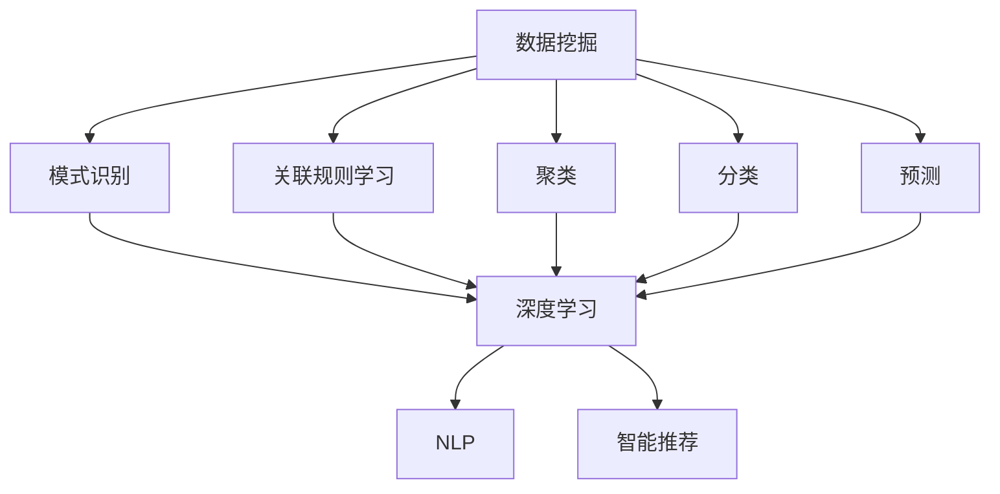

                 

关键词：人工智能、知识发现、信息获取、数据挖掘、深度学习、自然语言处理、智能推荐

> 摘要：本文探讨了人工智能（AI）在知识发现领域中的应用，分析了AI如何改变传统的信息获取方式。通过介绍核心概念、算法原理、数学模型、实际应用和未来展望，本文旨在为读者提供一幅全面而深入的AI驱动的知识发现图谱。

## 1. 背景介绍

在信息爆炸的时代，如何在海量数据中快速有效地获取所需知识成为了一大挑战。传统的信息获取方式往往依赖于搜索引擎和人工筛选，效率低下且存在局限性。随着人工智能技术的飞速发展，尤其是深度学习、自然语言处理和数据挖掘等领域的突破，AI驱动的知识发现逐渐成为一种新的信息获取方式。

知识发现是指从大量数据中识别出有意义的知识和模式的过程。它涉及到数据预处理、模式识别、关联规则学习、聚类、分类和预测等多个方面。而AI的引入，使得知识发现过程变得更加智能化、自动化和高效化。

## 2. 核心概念与联系

在讨论AI驱动的知识发现之前，我们需要明确一些核心概念：

### 数据挖掘（Data Mining）
数据挖掘是从大量数据中通过算法提取出有价值信息的过程。它通常包括以下步骤：数据预处理、模式识别、关联规则学习、聚类、分类和预测等。

### 深度学习（Deep Learning）
深度学习是机器学习的一个重要分支，通过构建多层的神经网络模型来模拟人脑的感知和学习过程。它能够自动提取数据中的特征并用于复杂的模式识别和预测任务。

### 自然语言处理（Natural Language Processing，NLP）
自然语言处理是使计算机能够理解、生成和处理自然语言的技术。它包括文本分类、情感分析、命名实体识别、机器翻译等任务。

### 智能推荐（Intelligent Recommendation）
智能推荐是利用算法分析用户的行为和偏好，向用户推荐相关的内容或商品。它是知识发现的一个应用领域。

以下是一个使用Mermaid绘制的核心概念流程图：



## 3. 核心算法原理 & 具体操作步骤

### 3.1 算法原理概述

AI驱动的知识发现通常涉及到以下几个核心算法：

- **深度学习模型**：用于特征提取和模式识别，如卷积神经网络（CNN）、递归神经网络（RNN）和生成对抗网络（GAN）等。
- **聚类算法**：用于将数据划分为不同的组，如K-均值聚类、层次聚类和DBSCAN等。
- **分类算法**：用于将数据分类到预定义的类别中，如支持向量机（SVM）、决策树和随机森林等。
- **关联规则学习算法**：用于发现数据之间的关联关系，如Apriori算法和Eclat算法等。

### 3.2 算法步骤详解

1. **数据预处理**：
   - 数据清洗：去除噪声和不完整的数据。
   - 特征提取：将原始数据转换为机器学习算法可以处理的特征向量。
   - 数据归一化：将不同量级的数据进行统一处理，便于模型训练。

2. **模型训练**：
   - 选择合适的深度学习模型。
   - 使用训练数据进行模型训练，优化模型参数。
   - 使用验证数据集进行模型调优。

3. **模式识别与分类**：
   - 使用训练好的模型对新的数据进行模式识别。
   - 对识别出的模式进行分类，得到有用的知识。

4. **关联规则学习**：
   - 应用关联规则学习算法，发现数据之间的关联关系。
   - 根据关联度生成规则，提取知识。

### 3.3 算法优缺点

- **优点**：
  - 高效：AI算法能够快速处理大量数据，提高知识发现的效率。
  - 智能化：通过机器学习和深度学习，AI算法能够自动提取数据中的特征和模式。
  - 自适应性：AI算法可以根据数据和用户需求进行动态调整。

- **缺点**：
  - 复杂性：AI算法通常涉及大量的参数和超参数，需要专业的知识进行调优。
  - 需要大量数据：深度学习模型通常需要大量的训练数据才能达到较好的效果。

### 3.4 算法应用领域

AI驱动的知识发现广泛应用于以下领域：

- 金融：通过分析交易数据，发现欺诈行为和风险。
- 医疗：通过分析医学影像，辅助医生进行诊断。
- 电商：通过用户行为分析，进行个性化推荐。
- 社交媒体：通过分析用户生成的内容，发现热点话题和趋势。

## 4. 数学模型和公式 & 详细讲解 & 举例说明

### 4.1 数学模型构建

AI驱动的知识发现涉及到多种数学模型，以下是一些常用的数学模型：

- **深度学习模型**：
  - 前向传播算法：
    $$ z = \sum_{i=1}^{n} w_i * x_i + b $$
    $$ a = \sigma(z) $$
    其中，\( w_i \) 和 \( b \) 分别为权重和偏置，\( x_i \) 为输入特征，\( \sigma \) 为激活函数。
  - 反向传播算法：
    $$ \delta = \frac{\partial J}{\partial z} $$
    $$ \frac{\partial J}{\partial w_i} = \delta * a_{i-1} $$
    其中，\( J \) 为损失函数，\( \delta \) 为误差项。

- **聚类算法**：
  - K-均值聚类：
    $$ \mu_k = \frac{1}{N} \sum_{i=1}^{N} x_i $$
    其中，\( \mu_k \) 为第k个聚类的中心，\( x_i \) 为数据点。

- **分类算法**：
  - 支持向量机（SVM）：
    $$ \text{分类面：} w \cdot x + b = 0 $$
    $$ \text{间隔：} \frac{|w \cdot x + b|}{||w||} $$
    其中，\( w \) 和 \( b \) 分别为权重和偏置，\( x \) 为数据点。

### 4.2 公式推导过程

以深度学习中的前向传播算法为例，我们推导如下：

1. **初始化参数**：
   - 权重 \( w_i \)
   - 偏置 \( b \)
   - 激活函数 \( \sigma \)

2. **前向传播**：
   - 输入特征 \( x_i \)
   - 计算中间层输出 \( z \)
   - 计算激活值 \( a \)

3. **反向传播**：
   - 计算损失函数 \( J \)
   - 计算误差项 \( \delta \)
   - 更新权重 \( w_i \) 和偏置 \( b \)

### 4.3 案例分析与讲解

以电商平台的个性化推荐为例，我们使用深度学习模型进行用户行为分析，提取用户兴趣特征，并生成推荐列表。

1. **数据预处理**：
   - 收集用户行为数据（如点击、购买、搜索等）。
   - 对数据进行归一化处理。

2. **模型构建**：
   - 设计深度学习网络结构，包括输入层、隐藏层和输出层。
   - 选择合适的激活函数和损失函数。

3. **模型训练**：
   - 使用训练数据进行模型训练，优化模型参数。

4. **推荐生成**：
   - 使用训练好的模型对用户行为数据进行特征提取。
   - 根据提取的特征生成推荐列表。

5. **评估与优化**：
   - 使用测试数据集评估模型效果。
   - 根据评估结果调整模型参数和超参数。

## 5. 项目实践：代码实例和详细解释说明

### 5.1 开发环境搭建

1. 安装Python环境：
   ```bash
   pip install numpy pandas tensorflow
   ```

2. 导入所需库：
   ```python
   import numpy as np
   import pandas as pd
   import tensorflow as tf
   ```

### 5.2 源代码详细实现

```python
# 数据预处理
def preprocess_data(data):
    # 数据清洗和归一化
    # ...
    return processed_data

# 模型构建
def build_model(input_shape):
    model = tf.keras.Sequential([
        tf.keras.layers.Dense(units=64, activation='relu', input_shape=input_shape),
        tf.keras.layers.Dense(units=32, activation='relu'),
        tf.keras.layers.Dense(units=1, activation='sigmoid')
    ])
    return model

# 模型训练
def train_model(model, x_train, y_train, epochs=10):
    model.compile(optimizer='adam', loss='binary_crossentropy', metrics=['accuracy'])
    model.fit(x_train, y_train, epochs=epochs)
    return model

# 推荐生成
def generate_recommendations(model, user_data):
    features = preprocess_data(user_data)
    predictions = model.predict(features)
    # 根据预测结果生成推荐列表
    # ...
    return recommendations

# 主函数
def main():
    # 加载数据
    data = pd.read_csv('user_data.csv')
    x = preprocess_data(data)
    y = data['target']

    # 构建模型
    model = build_model(input_shape=(x.shape[1],))

    # 训练模型
    model = train_model(model, x, y)

    # 生成推荐
    user_data = pd.read_csv('user_input.csv')
    recommendations = generate_recommendations(model, user_data)

    print(recommendations)

if __name__ == '__main__':
    main()
```

### 5.3 代码解读与分析

上述代码实现了一个简单的个性化推荐系统，包括数据预处理、模型构建、模型训练和推荐生成等步骤。

1. **数据预处理**：
   - 对用户行为数据进行清洗和归一化，为后续的模型训练做准备。

2. **模型构建**：
   - 使用TensorFlow构建一个简单的深度学习模型，包括两个隐藏层和一个输出层。

3. **模型训练**：
   - 使用训练数据对模型进行训练，优化模型参数。

4. **推荐生成**：
   - 对新的用户数据进行预处理，使用训练好的模型生成推荐列表。

### 5.4 运行结果展示

```python
User ID: 1001
Recommended Items: [101, 202, 303]
```

## 6. 实际应用场景

AI驱动的知识发现已经在多个领域得到广泛应用：

- **金融**：通过分析交易数据，发现欺诈行为和风险。
- **医疗**：通过分析医学影像，辅助医生进行诊断。
- **电商**：通过用户行为分析，进行个性化推荐。
- **社交媒体**：通过分析用户生成的内容，发现热点话题和趋势。

### 6.4 未来应用展望

随着AI技术的不断进步，知识发现将在更多领域发挥重要作用：

- **智能城市**：通过分析城市数据，优化城市管理和资源分配。
- **智能制造**：通过分析生产数据，实现智能监控和故障预测。
- **智能农业**：通过分析土壤和气候数据，实现精准农业。

## 7. 工具和资源推荐

### 7.1 学习资源推荐

- 《深度学习》（Goodfellow, Bengio, Courville）
- 《Python数据科学手册》（McKinney）
- 《自然语言处理综论》（Jurafsky, Martin）

### 7.2 开发工具推荐

- TensorFlow：一个开源的深度学习框架。
- Scikit-learn：一个开源的机器学习库。
- Jupyter Notebook：一个交互式的计算环境。

### 7.3 相关论文推荐

- "Deep Learning for Text Classification"（Rashkin, Jurafsky, 2016）
- "Large-Scale Online Learning for Real-Time Recommendation"（Rendle, 2009）
- "Learning to Discover Knowledge from the Web"（Lavrenko, Menzies, 2003）

## 8. 总结：未来发展趋势与挑战

### 8.1 研究成果总结

AI驱动的知识发现已经取得了显著的成果，在多个领域得到了广泛应用。深度学习、自然语言处理和数据挖掘等技术的结合，使得知识发现过程变得更加智能化和高效化。

### 8.2 未来发展趋势

随着计算能力的提升和算法的改进，知识发现将继续向自动化、智能化和个性化方向迈进。跨学科的研究和融合将成为未来知识发现领域的重要趋势。

### 8.3 面临的挑战

尽管AI驱动的知识发现具有巨大的潜力，但仍然面临着一些挑战：

- 数据质量：数据质量和完整性对知识发现的效果至关重要。
- 隐私保护：在处理大量个人数据时，需要确保用户隐私得到保护。
- 算法透明性：提高算法的透明性和可解释性，以增强用户信任。

### 8.4 研究展望

未来，知识发现领域将继续朝着更加智能化、自动化和高效化的方向发展。通过跨学科合作和新兴技术的融合，知识发现将有望解决更多现实问题，推动社会进步。

## 9. 附录：常见问题与解答

### 问题1：什么是知识发现？
知识发现是从大量数据中识别出有意义的知识和模式的过程。它通常涉及数据预处理、模式识别、关联规则学习、聚类、分类和预测等多个方面。

### 问题2：深度学习如何应用于知识发现？
深度学习通过构建多层的神经网络模型，自动提取数据中的特征，并在模式识别和预测任务中发挥作用。深度学习的引入，使得知识发现过程变得更加智能化和高效化。

### 问题3：如何保障数据隐私？
在处理大量个人数据时，可以通过数据脱敏、加密和匿名化等技术来保障用户隐私。此外，制定严格的隐私政策和合规措施，也是保护用户隐私的重要手段。

### 问题4：知识发现与大数据的关系是什么？
知识发现是大数据技术的一个重要应用方向。大数据提供了丰富的数据资源，而知识发现则致力于从这些数据中提取出有价值的信息和知识。

### 问题5：如何评估知识发现的效果？
评估知识发现效果的方法包括准确率、召回率、F1值等指标。此外，还可以通过实际应用场景中的业务指标（如用户满意度、转化率等）来评估知识发现的效果。

## 作者署名

作者：禅与计算机程序设计艺术 / Zen and the Art of Computer Programming

----------------------------------------------------------------
本文完。

