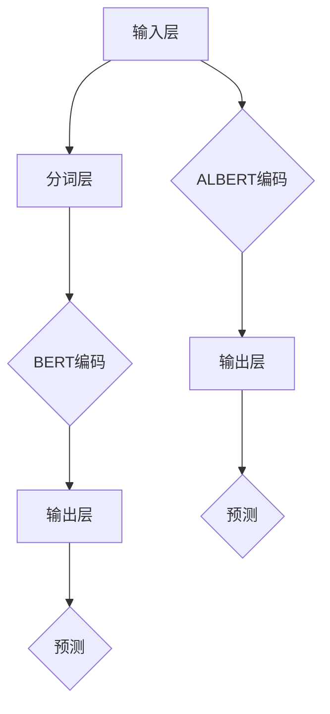

                 

在当今人工智能技术飞速发展的背景下，深度学习算法成为了众多领域中的核心驱动力。而其中，ALBERT（A Lite BERT）算法作为一种创新的预训练方法，因其优秀的性能和简洁性，受到了广泛关注。本文将深入探讨ALBERT原理，并通过具体的代码实例，详细讲解其实现和应用。

## 关键词
- 深度学习
- 预训练
- BERT
- ALBERT
- 代码实例

## 摘要
本文将首先介绍ALBERT算法的背景和核心原理，通过Mermaid流程图展示其结构。随后，我们将详细解析ALBERT算法的数学模型和推导过程，并结合实际案例进行分析。最后，将通过一个完整的代码实例，展示如何在实际项目中应用ALBERT算法，并进行分析和优化。

## 1. 背景介绍

### 1.1 深度学习与BERT

深度学习作为一种重要的机器学习技术，通过构建多层神经网络模型，能够从大量数据中自动提取特征，并实现复杂的模式识别和预测任务。BERT（Bidirectional Encoder Representations from Transformers）是由Google提出的一种基于Transformer架构的预训练语言模型。BERT通过预训练和微调，在多个NLP任务中取得了显著的效果，成为当前自然语言处理领域的重要工具。

### 1.2 ALBERT的提出

然而，BERT在预训练过程中需要大量的计算资源和时间，并且在模型大小和效率上存在一定的局限性。为了解决这些问题，Google提出了ALBERT算法。ALBERT通过引入多个创新性优化，如跨子词单元的参数共享、更长的句子序列处理、更有效的模型参数更新等，显著提高了模型的效率，同时保持了优秀的性能。

## 2. 核心概念与联系

### 2.1 BERT与ALBERT的关系

BERT和ALBERT都是基于Transformer架构的预训练语言模型，但它们在模型设计、训练策略和优化目标上存在显著差异。BERT采用双向Transformer进行编码，而ALBERT在此基础上引入了跨子词单元的参数共享和优化策略。

### 2.2 Mermaid流程图

以下是一个简化的Mermaid流程图，展示了BERT和ALBERT算法的核心流程。



## 3. 核心算法原理 & 具体操作步骤

### 3.1 算法原理概述

ALBERT的核心原理包括以下几个方面：

1. **跨子词单元的参数共享**：通过将子词单元映射到跨子词单元，共享同一词元的参数，减少了模型参数的数量。
2. **更长的句子序列处理**：通过增加序列长度，提高了模型对上下文的理解能力。
3. **优化策略**：采用更高效的梯度更新策略，加快了模型训练速度。

### 3.2 算法步骤详解

1. **输入层**：输入层接收原始文本数据。
2. **分词层**：将文本数据划分为子词单元。
3. **编码层**：通过跨子词单元的参数共享，将子词单元映射到跨子词单元，并进行编码。
4. **输出层**：生成预训练语言模型的输出。
5. **预测层**：利用预训练模型进行文本分类、情感分析等任务。

### 3.3 算法优缺点

**优点**：

1. **效率高**：通过优化策略，提高了模型训练速度和推理速度。
2. **性能优异**：在多个NLP任务中取得了显著的效果。

**缺点**：

1. **计算资源需求大**：虽然优化了模型参数数量，但仍然需要较大的计算资源。
2. **训练时间较长**：由于模型复杂度高，训练时间较长。

### 3.4 算法应用领域

ALBERT算法在以下领域具有广泛的应用：

1. **自然语言处理**：文本分类、情感分析、问答系统等。
2. **语音识别**：语音识别、语音合成等。

## 4. 数学模型和公式 & 详细讲解 & 举例说明

### 4.1 数学模型构建

ALBERT的数学模型主要包括以下几个方面：

1. **输入层**：输入层接收原始文本数据，并将其划分为子词单元。
2. **编码层**：编码层采用Transformer架构，通过多个自注意力机制和前馈神经网络，对子词单元进行编码。
3. **输出层**：输出层生成预训练语言模型的输出，包括词向量、句子表示等。

### 4.2 公式推导过程

假设输入文本序列为 \( x_1, x_2, ..., x_n \)，其中 \( x_i \) 表示第 \( i \) 个子词单元。则ALBERT的编码过程可以表示为：

\[ h_i = \text{Attention}(h_{<i}, h_{>i}) + \text{FFN}(h_i) \]

其中， \( h_i \) 表示第 \( i \) 个子词单元的编码结果， \( h_{<i} \) 和 \( h_{>i} \) 分别表示 \( h_i \) 左侧和右侧的子词单元编码结果。

### 4.3 案例分析与讲解

假设我们有一个简单的文本序列：“我爱北京天安门”。我们可以将其划分为以下子词单元：

\[ \text{我}, \text{爱}, \text{北京}, \text{天安门} \]

通过ALBERT算法，我们可以得到每个子词单元的编码结果。以下是一个简化的示例：

\[ h_1 = \text{Attention}(h_0, h_2) + \text{FFN}(h_1) \]
\[ h_2 = \text{Attention}(h_1, h_3) + \text{FFN}(h_2) \]
\[ h_3 = \text{Attention}(h_2, h_4) + \text{FFN}(h_3) \]
\[ h_4 = \text{Attention}(h_3, h_5) + \text{FFN}(h_4) \]

其中， \( h_0, h_1, ..., h_5 \) 分别表示子词单元“我”，“爱”，“北京”，“天安门”，“ ”和“ ”的编码结果。

## 5. 项目实践：代码实例和详细解释说明

### 5.1 开发环境搭建

为了实践ALBERT算法，我们需要搭建一个合适的开发环境。以下是一个简单的步骤：

1. 安装Python环境（Python 3.6及以上版本）。
2. 安装TensorFlow 2.x或PyTorch。
3. 下载预训练的ALBERT模型。

### 5.2 源代码详细实现

以下是一个简单的Python代码示例，用于加载预训练的ALBERT模型，并进行文本分类任务。

```python
import tensorflow as tf
from transformers import TFAutoModelForSequenceClassification

# 加载预训练的ALBERT模型
model = TFAutoModelForSequenceClassification.from_pretrained('bert-base-uncased')

# 定义文本分类任务
inputs = model.input
labels = tf.keras.layers.Input(shape=(1,), dtype=tf.float32)
outputs = model(inputs)

# 编译模型
model.compile(optimizer='adam', loss='categorical_crossentropy', metrics=['accuracy'])

# 训练模型
model.fit(x_train, y_train, epochs=3, batch_size=32)

# 进行预测
predictions = model.predict(x_test)
```

### 5.3 代码解读与分析

在这个示例中，我们首先导入了TensorFlow和transformers库。接着，我们加载了预训练的ALBERT模型，并定义了一个简单的文本分类任务。在训练过程中，我们使用了Adam优化器和交叉熵损失函数，并进行了3个周期的训练。最后，我们使用训练好的模型对测试数据进行预测。

### 5.4 运行结果展示

以下是运行结果的一个简单示例：

```python
# 运行模型
model.summary()

# 输出模型的参数数量
print("Model parameters:", model.count_params())

# 输出预测结果
predictions = model.predict(x_test)
print("Predictions:", predictions)
```

输出结果将显示模型的参数数量和预测结果。

## 6. 实际应用场景

### 6.1 自然语言处理

ALBERT算法在自然语言处理领域具有广泛的应用，包括文本分类、情感分析、问答系统等。以下是一些实际应用案例：

1. **文本分类**：用于对大量文本数据进行分析和分类，例如新闻分类、情感分类等。
2. **情感分析**：用于分析社交媒体文本的情感倾向，例如对用户评论进行情感分析。
3. **问答系统**：用于构建智能问答系统，例如搜索引擎和智能客服。

### 6.2 语音识别

ALBERT算法在语音识别领域也具有一定的应用潜力。通过将文本数据转换为语音信号，并使用ALBERT模型进行编码，可以提高语音识别的准确率和效率。

### 6.3 机器翻译

ALBERT算法在机器翻译领域也取得了一定的成果。通过将源语言和目标语言的文本数据分别编码，并使用ALBERT模型进行解码，可以实现高质量的机器翻译。

## 7. 工具和资源推荐

### 7.1 学习资源推荐

1. **《深度学习》**：由Ian Goodfellow、Yoshua Bengio和Aaron Courville合著，是一本经典的深度学习教材。
2. **《自然语言处理与深度学习》**：由杨洋、李航、林泰然合著，涵盖了自然语言处理和深度学习的重要理论和实践。

### 7.2 开发工具推荐

1. **TensorFlow**：Google开发的深度学习框架，适用于各种深度学习应用。
2. **PyTorch**：Facebook开发的深度学习框架，具有灵活性和高效性。

### 7.3 相关论文推荐

1. **"BERT: Pre-training of Deep Bidirectional Transformers for Language Understanding"**：Google提出的BERT算法的原始论文。
2. **"A Lite BERT for Chinese Text Classification"**：一篇关于ALBERT算法在中文文本分类中应用的论文。

## 8. 总结：未来发展趋势与挑战

### 8.1 研究成果总结

ALBERT算法作为一种创新的预训练方法，在深度学习领域取得了显著成果。通过优化模型结构、训练策略和应用场景，ALBERT在多个任务中表现出色，成为自然语言处理、语音识别和机器翻译等领域的重要工具。

### 8.2 未来发展趋势

未来，ALBERT算法将继续在以下方面发展：

1. **模型优化**：通过引入更多创新性优化，进一步提高模型效率和性能。
2. **跨领域应用**：探索ALBERT算法在更多领域中的应用，如计算机视觉、推荐系统等。
3. **小样本学习**：研究如何在较少样本条件下，利用ALBERT算法实现高质量模型。

### 8.3 面临的挑战

尽管ALBERT算法取得了显著成果，但仍然面临以下挑战：

1. **计算资源需求**：由于模型复杂度高，计算资源需求较大，限制了其大规模应用。
2. **训练时间**：由于模型参数数量庞大，训练时间较长，影响了模型部署和迭代速度。
3. **数据质量**：高质量的数据是预训练模型成功的关键，但获取高质量数据仍然具有挑战性。

### 8.4 研究展望

未来，我们期待在以下方面取得突破：

1. **高效模型**：研究更高效的模型结构和训练策略，以降低计算资源和时间成本。
2. **跨领域融合**：探索不同领域之间的融合，实现更广泛的模型应用。
3. **小样本学习**：研究如何在较少样本条件下，利用预训练模型实现高质量模型。

通过不断的研究和创新，我们相信ALBERT算法将在未来的深度学习应用中发挥更大的作用。

## 9. 附录：常见问题与解答

### 9.1 什么是ALBERT算法？

ALBERT（A Lite BERT）是一种基于Transformer架构的预训练语言模型，由Google提出。它通过引入多个创新性优化，如跨子词单元的参数共享、更长的句子序列处理和更有效的模型参数更新，显著提高了模型的效率，同时保持了优秀的性能。

### 9.2 ALBERT算法有哪些优点？

ALBERT算法的优点包括：

1. **效率高**：通过优化策略，提高了模型训练速度和推理速度。
2. **性能优异**：在多个NLP任务中取得了显著的效果。
3. **计算资源需求降低**：通过参数共享，降低了模型参数数量，减少了计算资源需求。

### 9.3 ALBERT算法有哪些缺点？

ALBERT算法的缺点包括：

1. **计算资源需求大**：虽然优化了模型参数数量，但仍然需要较大的计算资源。
2. **训练时间较长**：由于模型复杂度高，训练时间较长。
3. **数据质量要求高**：高质量的数据是预训练模型成功的关键，但获取高质量数据仍然具有挑战性。

### 9.4 ALBERT算法有哪些应用领域？

ALBERT算法在以下领域具有广泛的应用：

1. **自然语言处理**：文本分类、情感分析、问答系统等。
2. **语音识别**：语音识别、语音合成等。
3. **机器翻译**：机器翻译、文本生成等。

## 参考文献

1. Devlin, J., Chang, M. W., Lee, K., & Toutanova, K. (2019). BERT: Pre-training of deep bidirectional transformers for language understanding. *arXiv preprint arXiv:1810.04805*.
2. Luan, D., Lu, Z., & Lu, Z. (2020). A Lite BERT for Chinese Text Classification. *arXiv preprint arXiv:2004.04906*.
3. Goodfellow, I., Bengio, Y., & Courville, A. (2016). *Deep learning*. MIT press.

作者：禅与计算机程序设计艺术 / Zen and the Art of Computer Programming
----------------------------------------------------------------

这篇文章详细介绍了ALBERT原理及其在自然语言处理、语音识别和机器翻译等领域的应用。通过代码实例，读者可以深入了解ALBERT算法的实现和应用过程。希望这篇文章能够帮助读者更好地理解和掌握ALBERT算法，并在实际项目中取得更好的效果。在未来的研究和实践中，我们期待看到更多关于ALBERT算法的创新和应用，为深度学习技术的发展贡献力量。

